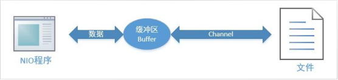
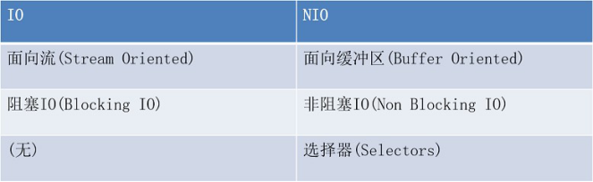
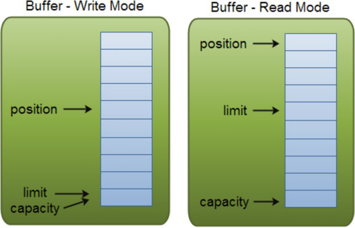
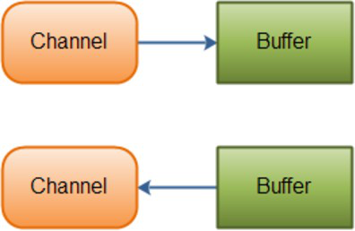
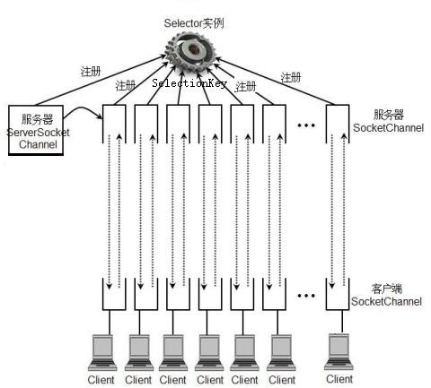
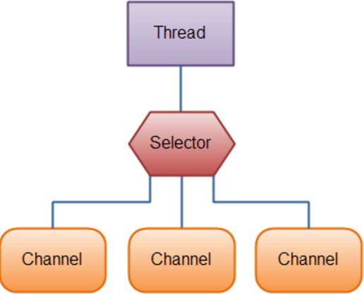

 

# NIO

# 第一章：NIO简介

## **1.1** IO 介绍

我们通常所说的 BIO 是相对于 NIO 来说的，BIO 也就是 Java 开始之初推出的 IO 操作模块，BIO 是 BlockingIO 的缩写，顾名思义就是阻塞 IO 的意思。

全面认识 IO

传统的 IO 大致可以分为4种类型：

InputStream、OutputStream 基于字节操作的 IO Writer、Reader 基于字符操作的 IO File 基于磁盘操作的 IO Socket 基于网络操作的 IO java.net 下提供的 Scoket 很多时候人们也把它归为 同步阻塞 IO ,因为网络通讯同样是 IO 行为。

java.io 下的类和接口很多，但大体都是  InputStream、OutputStream、Writer、Reader  的子集，所有掌握这4个类和File的使用，是用好 IO 的关键。

## **1.2** NIO介绍

java.nio全称Java non-blocking IO或Java New  IO，是从jdk1.4  开始引入的一套新的IO  api（New  IO） ，为所有的原始类型（boolean类型除外）提供缓存支持的数据容器，使用它可以提供非阻塞式的高伸缩性网络。

IO操作的模式：

PIO（Programing IO）: 所有的IO操作由CPU处理，CPU占用率比较高 。

DMA(Direct Memory  Access):CPU把IO操作控制权交给DMA控制器，只能以固定的方式读写，CPU空闲做其他工作。

通道方式(Channel)：能执行有限通道指令的IO控制器，代替CPU管理控制外设。通道有自己的指令系统，是一个协    处理器，具有更强的独立处理数据输入和输出的能力。

## Java NIO 由以下几个核心部分组成：

​        Buffer： 缓 冲 区

​        Channel： 通 道 

​        Selector：选择器(轮询器)



 


## **1.3** NIO和普通IO的区别



**1.4** 同步、异步、阻塞、非阻塞

上面说了很多关于同步、异步、阻塞和非阻塞的概念，接下来就具体聊一下它们4个的含义，以及组合之后形成的性  能分析。

**1.4.1** 同步与异步

同步就是一个任务的完成需要依赖另外一个任务时，只有等待被依赖的任务完成后，依赖的任务才能算完成，这是一  种可靠的任务序列。要么成功都成功，失败都失败，两个任务的状态可以保持一致。而异步是不需要等待被依赖的任  务完成，只是通知被依赖的任务要完成什么工作，依赖的任务也立即执行，只要自己完成了整个任务就算完成了。至  于被依赖的任务最终是否真正完成，依赖它的任务无法确定，所以它是不可靠的任务序列。我们可以用打电话和发短  信来很好的比喻同步与异步操作。

**1.4.2** 阻塞与非阻塞

阻塞与非阻塞主要是从 CPU 的消耗上来说的，阻塞就是 CPU 停下来等待一个慢的操作完成 CPU 才接着完成其它的事。非阻塞就是在这个慢的操作在执行时 CPU 去干其它别的事，等这个慢的操作完成时，CPU 再接着完成后续的操作。虽然表面上看非阻塞的方式可以明显的提高 CPU 的利用率，但是也带了另外一种后果就是系统的线程切换增加。增加的 CPU 使用时间能不能补偿系统的切换成本需要好好评估。

**1.4.3** 同/异、阻/非堵塞 组合

同/异、阻/非堵塞的组合，有四种类型，如下表：

 

| 组合方式 | 性能分析                                           |
| ------------------ | ------------------------------------------------------------ |
| 同步阻塞           | 最常用的一种用法，使用也是最简单的，但是 I/O 性能一般很差，CPU 大部分在空闲状态。 |
| 同步非阻塞         | 提升 I/O 性能的常用手段，就是将 I/O 的阻塞改成非阻塞方式，尤其在网络 I/O 是长连接，同时传输数据也不是很多的情况下，提升性能非常有效。 这种方式通常能提升 I/O 性能，但是会增加CPU 消耗，要考虑增加的 I/O 性能能不能补偿 CPU 的消耗，也就是系统的瓶颈是在 I/O 还是在 CPU 上。 |
| 异步阻塞           | 这种方式在分布式数据库中经常用到，例如在网一个分布式数据库中写一条记录，通常会有一份是同步  阻塞的记录，而还有两至三份是备份记录会写到其它机器上，这些备份记录通常都是采用异步阻塞的方  式写 I/O。异步阻塞对网络 I/O 能够提升效率，尤其像上面这种同时写多份相同数据的情况。 |
| 异步非阻塞         | 这种组合方式用起来比较复杂，只有在一些非常复杂的分布式情况下使用，像集群之间的消息同步机制   一般用这种 I/O 组合方式。如 Cassandra 的 Gossip 通信机制就是采用异步非阻塞的方式。它适合同时要传多份相同的数据到集群中不同的机器，同时数据的传输量虽然不大，但是却非常频繁。这种网络  I/O 用这个方式性能能达到最高。 |

 

# 第二章：Buffer的使用

Java NIO中的Buffer用于和NIO通道进行交互。如你所知，数据是从通道读入缓冲区，从缓冲区写入到通道中的。

缓冲区本质上是一块可以写入数据，然后可以从中读取数据的内存。这块内存被包装成NIO    Buffer对象，并提供了一组方法，用来方便的访问该块内存。

​	ByteBuffer

​	CharBuffer

​	DoubleBuffer

​	FloatBuffer 

​	IntBuffer

​	LongBuffer

​	ShortBuffer

## **2.1** Buffer的基本用法

使用Buffer读写数据一般遵循以下四个步骤：

1. 创建缓冲区，写入数据到Buffer

2. 调flip()方法

3. 从Buffer中读取数据

4. 调用clear()方法或者compact()方法

当向buffer写入数据时，buffer会记录下写了多少数据。一旦要读取数据，需要通过flip()方法将Buffer从写模式切换到读模式。在读模式下，可以读取之前写入到buffer的所有数据。

一旦读完了所有的数据，就需要清空缓冲区，让它可以再次被写入。有两种方式能清空缓冲区：调用clear()或compact()方法。clear()方法会清空整个缓冲区。compact()方法只会清除已经读过的数据。任何未读的数据都被移到缓冲区的起始处，新写入的数据将放到缓冲区未读数据的后面。

案例一：使用ByteBuffer

```java
public static void main(String[] args) {
    //1创建缓冲区
    ByteBuffer buffer=ByteBuffer.allocate(1024);
    //2向缓冲区中添加内容buffer.put("helloworld".getBytes());
    //3切换为读模式
    buffer.flip();
    //4获取单个字节
    //buffer.get();
    //5获取多个字节
    byte[] data=new byte[buffer.limit()]; buffer.get(data);
    System.out.println(new String(data));
    //6清空缓冲区buffer.clear();
}
```


## **2.2** Buffer的capacity,position和limit

缓冲区本质上是一块可以写入数据，然后可以从中读取数据的内存。这块内存被包装成NIO    Buffer对象，并提供了一组方法，用来方便的访问该块内存。

为了理解Buffer的工作原理，需要熟悉它的三个属性：

capacity 

position 

limit

position和limit的含义取决于Buffer处在读模式还是写模式。不管Buffer处在什么模式，capacity的含义总是一样的。

这里有一个关于capacity，position和limit在读写模式中的说明。

 

 

 

## capacity

作为一个内存块，Buffer有一个固定的大小值，也叫“capacity”.你只能往里写capacity个byte、long，char等类型。一旦Buffer满了，需要将其清空（通过读数据或者清除数据）才能继续写数据往里写数据。

## position

当你写数据到Buffer中时，position表示当前的位置。初始的position值为0.当一个byte、long等数据写到Buffer  后， position会向前移动到下一个可插入数据的Buffer单元。position最大可为capacity.

当读取数据时，也是从某个特定位置读。当将Buffer从写模式切换到读模式，position会被重置为0. 当从Buffer的

position处读取数据时，position向前移动到下一个可读的位置。

## limit

在写模式下，Buffer的limit表示你最多能往Buffer里写多少数据。 写模式下，limit等于Buffer的capacity。

当切换Buffer到读模式时， limit表示你最多能读到多少数据。因此，当切换Buffer到读模式时，limit会被设置成写模式下的position值。换句话说，你能读到之前写入的所有数据（limit被设置成已写数据的数量，这个值在写模式下    就是position）

## Buffer的分配

要想获得一个Buffer对象首先要进行分配。 每一个Buffer类都有一个allocate方法。下面是一个分配1024字节

capacity的ByteBuffer的例子。

```
ByteBuffer buf = ByteBuffer.allocate(1024);//创建间接缓冲区，大小为1024个字节ByteBuffer buf2=ByteBuffer.allocateDirect(1024);//直接缓冲区
```


直接缓冲区和间接缓冲区的区别：

间接缓冲区：在堆中开辟，易于管理，垃圾回收器可以回收，空间有限，读写文件速度较慢。

直接缓冲区：不在堆中，物理内存中开辟空间，空间比较大，读写文件速度快，缺点：不受垃圾回收器控制，创建和  销毁耗性能。

## 向Buffer中写数据

写数据到Buffer有两种方式：

从Channel写到Buffer。后面案例使用通过Buffer的put()方法写到Buffer里。

从Channel写到Buffer的例子  通过put方法写Buffer的例子：

```
buf.put(127);
```

put方法有很多版本，允许你以不同的方式把数据写入到Buffer中。例如，   写到一个指定的位置，或者把一个字节数组写入到Buffer。 更多Buffer实现的细节参考JavaDoc。

## flip()方法

flip方法将Buffer从写模式切换到读模式。调用flip()方法会将position设回0，并将limit设置成之前position的值。 换句话说，position现在用于标记读的位置，limit表示之前写进了多少个byte、char等 —— 现在能读取多少个

byte、char等。

## 从Buffer中读取数据

从Buffer中读取数据有两种方式：

1. 从Buffer读取数据到Channel。后面案例使用

2. 使用get()方法从Buffer中读取数据。

从Buffer读取数据到Channel的例子： 

使用get()方法从Buffer中读取数据的例子

```
byte aByte = buf.get();
```

get方法有很多版本，允许你以不同的方式从Buffer中读取数据。例如，从指定position读取，或者从Buffer中读取数据到字节数组。更多Buffer实现的细节参考JavaDoc。

## rewind()方法

Buffer.rewind()将position设回0，所以你可以重读Buffer中的所有数据。limit保持不变，仍然表示能从Buffer中读  取多少个元素（byte、char等）。

## clear()与compact()方法

一旦读完Buffer中的数据，需要让Buffer准备好再次被写入。可以通过clear()或compact()方法来完成。

如果调用的是clear()方法，position将被设回0，limit被设置成 capacity的值。换句话说，Buffer 被清空了。Buffer 中的数据并未清除，只是这些标记告诉我们可以从哪里开始往Buffer里写数据。

如果Buffer中有一些未读的数据，调用clear()方法，数据将“被遗忘”，意味着不再有任何标记会告诉你哪些数据被读   过，哪些还没有。

如果Buffer中仍有未读的数据，且后续还需要这些数据，但是此时想要先写些数据，那么使用compact()方法。

compact()方法将所有未读的数据拷贝到Buffer起始处。然后将position设到最后一个未读元素正后面。limit属性依然像clear()方法一样，设置成capacity。现在Buffer准备好写数据了，但是不会覆盖未读的数据。

## mark()与reset()方法

通过调用Buffer.mark()方法，可以标记Buffer中的一个特定position。之后可以通过调用Buffer.reset()方法恢复到这  个position。例如：

```
buffer.mark(); //添加标记
buffer.reset();//恢复到标记位置
```

案例二：使用capacity,position和limit

```java
public class Demo2 {
	public static void main(String[] args) {
		//1创建直接缓冲区
		ByteBuffer buf=ByteBuffer.allocateDirect(1024);
		System.out.println("---------写之前----------");
		System.out.println("capacity:"+buf.capacity());
		System.out.println("limit:"+buf.limit());
		System.out.println("position:"+buf.position());
		
		//2写入数据
		buf.put("abcdefg".getBytes());
		System.out.println("---------写之后----------");
		System.out.println("capacity:"+buf.capacity());
		System.out.println("limit:"+buf.limit());
		System.out.println("position:"+buf.position());
		
		//3切换为读取模式
		buf.flip();
		System.out.println("---------切换为读取模式----------");
		System.out.println("capacity:"+buf.capacity());
		System.out.println("limit:"+buf.limit());
		System.out.println("position:"+buf.position());
		
		
		byte[] data=new byte[3];
		buf.get(data);
		System.out.println("---------读取之后----------");
		System.out.println(new String(data,0,3));
		System.out.println("capacity:"+buf.capacity());
		System.out.println("limit:"+buf.limit());
		System.out.println("position:"+buf.position());
		
		buf.mark();
		buf.get(data);
		System.out.println("----------mark()----------");
		System.out.println("---------再次读取之后----------");
		System.out.println(new String(data,0,3));
		System.out.println("capacity:"+buf.capacity());
		System.out.println("limit:"+buf.limit());
		System.out.println("position:"+buf.position());
		
		
		buf.reset();
		buf.get(data);
		System.out.println("------reset() 重置------------");
		System.out.println(new String(data,0,3));
		System.out.println("capacity:"+buf.capacity());
		System.out.println("limit:"+buf.limit());
		System.out.println("position:"+buf.position());
		
		
		buf.clear();
		System.out.println("---------clear()清空--------");
		System.out.println("capacity:"+buf.capacity());
		System.out.println("limit:"+buf.limit());
		System.out.println("position:"+buf.position());
	}
}
```

 

# 第三章：Channel

基本上，所有的 IO 在NIO 中都从一个Channel 开始。Channel  有点象流。 数据可以从Channel读到Buffer中，也可以从Buffer 写到Channel中。这里有个图示：

   

JAVA NIO中的一些主要Channel的实现：

FileChannel 

DatagramChannel 

SocketChannel 

ServerSocketChannel


## **3.1** FileChannel基本使用

Java NIO中的FileChannel是一个连接到文件的通道。可以通过文件通道读写文件。

FileChannel无法设置为非阻塞模式。3.1.1创建FileChannel

在使用FileChannel之前，必须先创建它。创建方式有两种：


第一种：使用一个InputStream、OutputStream或RandomAccessFile来获取一个FileChannel实例。     第二种：JDK1.7之后才能使用, FileChannel.open()方法。

```
//第一种
RandomAccessFile aFile = new RandomAccessFile("data/nio-data.txt", "rw");
FileChannel inChannel = aFile.getChannel();
//第二种
FileChannel inChannel = FileChannel.open(Paths.get("d:\\aaa.txt"),StandardOpenOption.READ);
```


## **3.1.2** 从FileChannel读取数据

调用多个read()方法之一从FileChannel中读取数据。如：

```
ByteBuffer buf = ByteBuffer.allocate(48); 
int bytesRead = inChannel.read(buf);
```

首先，分配一个Buffer。从FileChannel中读取的数据将被读到Buffer中。

然后，调用FileChannel.read()方法。该方法将数据从FileChannel读取到Buffer中。read()方法返回的int值表示了有  多少字节被读到了Buffer中。如果返回-1，表示到了文件末尾。

## **3.1.3** 向FileChannel写数据

使用FileChannel.write()方法向FileChannel写数据，该方法的参数是一个Buffer。如：

```java
String newData = "New String to write to file..." + System.currentTimeMillis(); ByteBuffer buf = ByteBuffer.allocate(48);
buf.clear(); 
buf.put(newData.getBytes()); 
buf.flip(); 
while(buf.hasRemaining()) {
	channel.write(buf);
}
```

注意FileChannel.write()是在while循环中调用的。因为无法保证write()方法一次能向FileChannel写完所有字节，因 此需要重复调用write()方法，直到Buffer中已经没有尚未写入通道的字节。

## **3.1.4** 关闭FileChannel

用完FileChannel后必须将其关闭。如：

```
channel.close();
```

## **3.2** FileChannel操作案例

3.2.1写入文本文件

```java
//1创建FileOutputStream
FileOutputStream fos=new FileOutputStream("d:\\out.txt");
//2获取通道
FileChannel outChannel = fos.getChannel();
//3创建缓冲区
ByteBuffer buffer=ByteBuffer.allocate(1024);
//4向缓冲区中放入数据
buffer.put("hello world".getBytes());
//5切换为读模式buffer.flip();
//写入
outChannel.write(buffer);
//6关闭outChannel.close();
System.out.println("写入完毕");
```


**3.2.2** 读取文本文件

```java
//1创建FileInputStream
FileInputStream fis=new FileInputStream("d:\\out.txt");
//2创建通道
FileChannel inChannel = fis.getChannel();
//3创建缓冲区
ByteBuffer buffer=ByteBuffer.allocate(1024); 
int len=inChannel.read(buffer);
//4处理数据buffer.flip();
String data=new  String(buffer.array(),0,len); 
System.out.println(data);

//5关闭inChannel.close();
```


**3.2.3** 复制文件

复制文件通道之间的数据传输(直接缓冲区的模式)

```java
        FileInputStream fis=new FileInputStream("d:\\a.txt");
		FileOutputStream fos=new FileOutputStream("d:\\b.txt");
		FileChannel sourceCh=fis.getChannel(); 
		FileChannel destCh=fos.getChannel(); 
		destCh.transferFrom(sourceCh,0,sourceCh.size()); 
		sourceCh.close(); 
		destCh.close();
```


## **3.3** 学员练习

使用FileChannel进行文件复制

 

# 第四章：Selector和非阻塞网络编程

传统的网络编程

TCP ServerSocket Socket (accept 阻塞式)

UDP DatagramSocket DatagramPacket (receive 阻塞式)

## 4.1 ServerSocketChannel、SocketChannel实现阻塞式网络编程

ServerSocketChannel是一个基于通道的socket监听器,等同于ServerSocket类。SocketChannel是一个基于通道的客    户端套接字,等同于Socket类。

实现代码

```java
public class TcpServer {
    public static void main(String[] args) throws Exception{
    //1创建ServerSocketChannel
    ServerSocketChannel ssc=ServerSocketChannel.open();
    //2绑定地址
    ssc.bind(new InetSocketAddress(1234));
    //3监听
    System.out.println("服务器已启动");
    SocketChannel sc=ssc.accept();

    //4创建缓冲区
    ByteBuffer buffer=ByteBuffer.allocate(1024); 

    int len=sc.read(buffer);
    buffer.flip(); 

    String string=new String(buffer.array(),0, len);
    System.out.println(string);
    //5关闭
    sc.close();
    }
}
```


```java
public class TcpClient {
    public static void main(String[] args) throws Exception {
    //1创建SocketChannel
    SocketChannel sc=SocketChannel.open(new InetSocketAddress("127.0.0.1", 1234));

    //2创建缓冲区
    ByteBuffer buffer=ByteBuffer.allocate(1024);
    buffer.put("你还好吗?".getBytes()); buffer.flip();

    //3发送数据sc.write(buffer);
    //4关闭
    sc.close();
    }
}
```

 

## 4.2. Selector简介

要使用Selector，得向Selector注册Channel，然后调用它的select()方法。这个方法会一直阻塞到某个注册的通道有事件就绪。一旦这个方法返回，线程就可以处理这些事件，事件的例子有如新连接进来，数据接收等。

选择器提供选择执行已经就绪的任务的能力.从底层来看，Selector提供了询问通道是否已经准备好执行每个I/O操作    的能力。Selector 允许单线程处理多个Channel。仅用单个线程来处理多个Channels的好处是，只需要更少的线程来处理通道。事实上，可以只用一个线程处理所有的通道，这样会大量的减少线程之间上下文切换的开销。


 

 

 

 

 

 

 

 

选择器（Selector)：Selector选择器类管理着一个被注册的通道集合的信息和它们的就绪状态。通道是和选择器一    起被注册的，并且使用选择器来更新通道的就绪状态。

可选择通道(SelectableChannel)：SelectableChannel这个抽象类提供了实现通道的可选择性所需要的公共方法。它是所有支持就绪检查的通道类的父类。因为FileChannel类没有继承SelectableChannel因此是不是可选通道，而所有socket通道都是可选择的，SocketChannel和ServerSocketChannel是SelectableChannel的子类。

选择键(SelectionKey)：选择键封装了特定的通道与特定的选择器的注册关系。选择键对象被SelectableChannel.register()返回并提供一个表示这种注册关系的标记。选择键包含了两个比特集(以整数的形式进行编码)，选择键支持四种操作类型：

Connect 连接

Accept 接受请求

Read 读
Write 写

Java中定义了四个常量来表示这四种操作类型：

SelectionKey.OP_CONNECT SelectionKey.OP_ACCEPT  SelectionKey.OP_READ  SelectionKey.OP_WRITE 

4.3.实现非阻塞式网络通信

```java
public class ChatServer{
    public static void main(String[] args) throws Exception {
    //1创建ServerSocketChannel
    ServerSocketChannel ssc=ServerSocketChannel.open();
    //2设置为非阻塞式
    ssc.configureBlocking(false);
    //3绑定地址
    ssc.bind(new InetSocketAddress("127.0.0.1",9999));
    //4创建选择器
    Selector selector=Selector.open();
    //5注册选择器ssc.register(selector,SelectionKey.OP_ACCEPT); while(selector.select()>0){
    Iterator<SelectionKey> it = selector.selectedKeys().iterator(); while(it.hasNext()){
    SelectionKey selectionKey = it.next();
    //有客户端连接过来了 
    if(selectionKey.isAcceptable()){
    SocketChannel socketChannel=ssc.accept(); socketChannel.configureBlocking(false);//设置为非阻塞式编程 socketChannel.register(selector, SelectionKey.OP_READ);//把客户端socketChannel注册到selctor
    }else if(selectionKey.isReadable()){
    //获取SocketChannel
    SocketChannel channel = (SocketChannel) selectionKey.channel();
    //创建缓冲区
    ByteBuffer buffer = ByteBuffer.allocate(1024); 
    int len = 0;
    while((len = channel.read(buffer)) > 0 ){ 
    buffer.flip();
    System.out.println(new String(buffer.array(), 0, len)); buffer.clear();
    }
    if(len==-1){//客户端已经退出
    channel.close();
    }
    }
    it.remove();
    }
    }
 }
}
```


 ```java
 public class ChatClient{
     public static void main(String[] args) throws Exception{
     //1创建SocketChannel
     SocketChannel sc=SocketChannel.open(new InetSocketAddress("127.0.0.1", 9999));
     //2设置为非阻塞式sc.configureBlocking(false);
     //3创建缓冲区
     ByteBuffer buffer=ByteBuffer.allocate(1024); Scanner input=new Scanner(System.in); while(input.hasNext()){
     String s=input.nextLine(); buffer.put(s.getBytes()); buffer.flip(); sc.write(buffer); buffer.clear();
     if(s.equals("886")){ break;
     }
     }
     //4关闭sc.close();
     }
 }
 ```

read返回值

```
1、read什么时候返回-1
read返回-1说明客户端的数据发送完毕，并且主动的close socket。所以在这种场景下，（服务器程序）你需要关闭socketChannel并且取消key，最好是退出当前函数。注意，这个时候服务端要是继续使用该socketChannel进行读操作的话，就会抛出“远程主机强迫关闭一个现有的连接”的IO异常。
2、read什么时候返回0
其实read返回0有3种情况，一是某一时刻socketChannel中当前（注意是当前）没有数据可以读，这时会返回0，其次是bytebuffer的position等于limit了，即bytebuffer的remaining等于0，这个时候也会返回0，最后一种情况就是客户端的数据发送完毕了（注意看后面的程序里有这样子的代码），这个时候客户端想获取服务端的反馈调用了recv函数，若服务端继续read，这个时候就会返回0。
```


## **4.4** 总结

1 NIO简介 Java Non-blocking IO New IO 2 和传统IO

(1) 面向流 ，面向缓冲区

(2) 阻塞， 非阻塞

(3) 无 选择器（selector）

3 NIO

Buffer Channel Selector 4 Buffer

ByteBuffer CharBuffer ShortBuffer

....

重要属性0<=mark<=postion<=limit<=capacitiy put();//放入数据

get();//获取数据

flip();//切换为读模式

rewind()//可以重复

mark();//做标记

reset();//返回上一个标记

clear()//清空,

compact();//清空，会保留未读取的数据

间接缓冲区: 堆中，空间不大，速度慢，jvm可以回收

直接缓冲区: 物理内存中，空间大，速度块，jvm不能回收。

5 Channel

FileChannel 

5.1创建通道

InputStream OutputStream RandomAcceFile的getChannle(); 

FileChannel channel=FileChannel.open();

channel.read(); channel.write();

6 Selector：选择器(轮询器)(理解就可以)

## **4.5** 学员练习

使用NIO复制文件

 

# 第五章 课后作业

使用NIO实现简单聊天

 

# 第六章 面试题

1,BIO,NIO,AIO的区别

BIO 就是传统的 java.io 包，它是基于流模型实现的，交互的方式是同步、阻塞方式，也就是说在读入输入流或者输出流时，在读写动作完成之前，线程会一直阻塞在那里，它们之间的调用时可靠的线性顺序。它的有点就是代码比较  简单、直观；缺点就是 IO 的效率和扩展性很低，容易成为应用性能瓶颈。 NIO 是 Java 1.4 引入的 java.nio 包，提供了 Channel、Selector、Buffer 等新的抽象，可以构建多路复用的、同步非阻塞 IO 程序，同时提供了更接近操作系统底层高性能的数据操作方式。

AIO 是 Java 1.7 之后引入的包，是 NIO 的升级版本，提供了异步非堵塞的 IO 操作方式，所以人们叫它AIO（Asynchronous IO），异步 IO 是基于事件和回调机制实现的，也就是应用操作之后会直接返回，不会堵塞在那里，当后台处理完成，操作系统会通知相应的线程进行后续的操作。

 

2.NIO 核心组件

Channel Buffers Selector