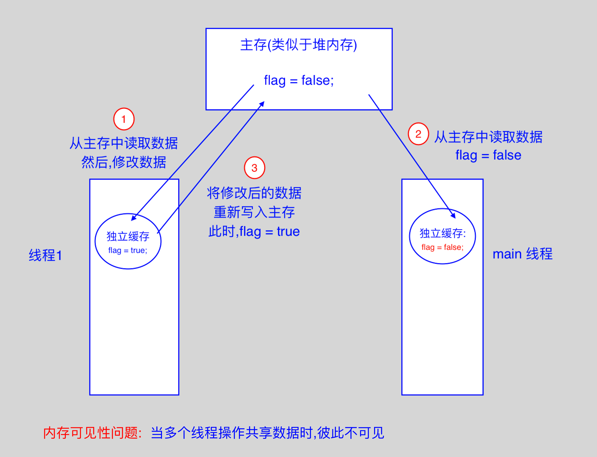
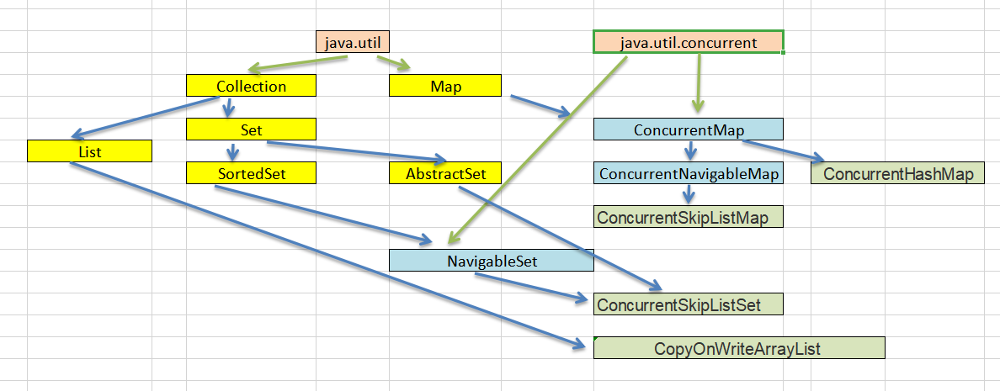
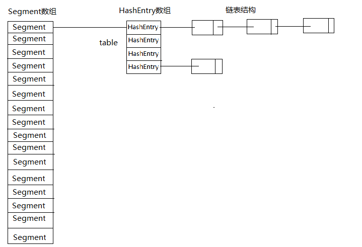
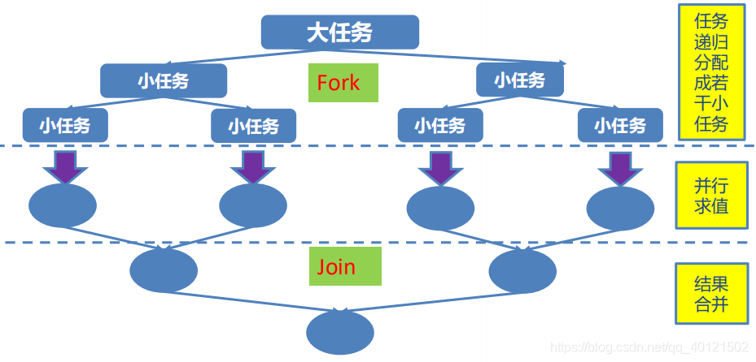

# 0. 学习目标

- 理解JUC的概念
- 理解多线程操作共享数据的特性
- 掌握如何使用volatile来保证内存变量的可见性
- 掌握CAS算法与原子变量的使用
- 掌握并发容器类的使用
- 理解CountDownLatch闭锁
- 掌握Callable接口的使用
- 掌握Lock同步锁与Condition线程同学与信号量的使用
- 掌握ReadWriteLock读写锁与线程同步锁synchronizes的使用方法
- 掌握JUC线程池的使用和调度


# 1. JUC概述

## 1.1 JUC是什么

​		在 Java 5.0 提供了 java.util.concurrent （简称JUC ）包，在此包中增加了在并发编程中很常用的实用工具类，用于定义类似于线程的自定义子系统，包括线程池、异步 IO 和轻量级任务框架。提供可调的、灵活的线程池。还提供了设计用于多线程上下文中的 Collection 实现等。


# 2 内存可见性与volatile关键字

## 2.1 多线程共享数据的特性

​		

```
public class Test1 extends Thread {
    class ThreadDemo implements Runnable {
        private boolean flag = false;

        public boolean isFlag() {
            return flag;
        }

        public void setFlag(boolean flag) {
            this.flag = flag;
        }

        @Override
        public void run() {
            // TODO Auto-generated method stub
            System.out.println("go run().");
            this.setFlag(true);
            System.out.println("子线程.flag=" + isFlag());
        }
    }

    public void test1() {
        //ThreadDemo线程先开始的
        ThreadDemo td = new ThreadDemo();
        new Thread(td).start();
        //然后这里是主线程才开始
//        try {
//            this.sleep(200);
//        } catch (InterruptedException e) {
//            e.printStackTrace();
//        }
        System.out.println("主进程.flag=" + td.isFlag());
    }

    public static void main(String[] args) {
        Test1 t1 = new Test1();
        t1.test1();
    }
}
```

​		在以上例程中，子线程的run方法先运行，将flag变量改变，但是主线程中读取flag变量还是改变之前的值。如果想在主线程中读取到被子线程改变之后值，需要主线程等待一会，以便子线程将缓存中的值赋值到主内存区中。

​		

```
go run().
子线程.flag=true
主进程.flag=false
```

​		具体需要多长时间才会把主内存同步，大概几个到十几个cpu时钟周期。在主线程中随便加入一句代码就够了。

```
System.out.println("主线程号：" + currentThread().getId());
```

```
go run().
子线程.flag=true
主线程号：1
主进程.flag=true
```

​		可以得到结论，**当多线程操作共享数据时，彼此之间不可见**，至少不是立刻可见，中间有个时间差。

### 内存可见性

​		内存可见性（Memory Visibility）是指当某个线程正在使用对象状态而另一个线程在同时修改该状态，需要确保当一个线程修改了对象状态后，其他线程能够看到发生的状态变化。
​		可见性错误是指当读操作与写操作在不同的线程中执行时，我们无法确保执行读操作的线程能适时地看到其他线程写入的值，有时甚至是根本不可能的事情。
​		我们可以通过同步来保证对象被安全地发布。除此之外我们也可以使用一种更加轻量级的 volatile变量。

### volatile 关键字

​		Java 提供了一种稍弱的同步机制，即 volatile 变量，用来确保将变量的更新操作通知到其他线程。可以将 volatile 看做一个轻量级的锁，但是又与锁有些不同：

1. 对于多线程，不是一种互斥关系
2. 不能保证变量状态的“原子性操作”

被volatile修饰的共享变量，就具有了以下两点特性：

- 1.保证了不同线程对该变量操作的内存可见性;

- 2.禁止指令重排序

  ​		jvm运行时刻内存的分配：其中有一个内存区域是jvm虚拟机栈，每一个线程运行时都有一个线程栈，线程栈保存了线程运行时候变量值信息。当线程访问某一个对象时候值的时候，首先通过对象的引用找到对应在堆内存的变量的值，然后把堆内存变量的具体值load到线程本地内存中，建立一个变量副本，之后线程就不再和对象在堆内存变量值有任何关系，而是直接修改副本变量的值，在修改完之后的某一个时刻（线程退出之前），自动把线程变量副本的值回写到对象在堆中变量。这样在堆中的对象的值就产生变化了。下面一幅图描述这写交互！


```
public class Test2 extends Thread {
    boolean flag = false;
    int i = 0;

    public void run() {
        while (!flag) {
            i++;
        }
    }

    public static void main(String[] args) throws Exception {
        Test2 vt = new Test2();
        vt.start();
        Thread.sleep(1000);
        vt.flag = true;
        while(true) {
            System.out.println("stop:" + vt.i);
            Thread.sleep(1000);
        }
    }
}
```

​       可以看到，在此代码中，每隔一秒打印一次i的值，发现i值不断在增长，主线程中将vt.flag设置为true，但是没有影响到子线程中的flag。我们把flag变量加上volatile修饰后，i值将不再增长，证明子线程每次读取flag值时间会从主内存区同步。

​       如果我们不加上volatile修饰，而是的子线程循环中加入一条打印语句，可以发现运行一段时间后，子线程的flag值也一样被同步了。

​		**JVM会尽力保证内存的可见性，即便这个变量没有加同步关键字。**换句话说，只要CPU有时间，JVM会尽力去保证变量值的更新。这种与volatile关键字的不同在于，volatile关键字会强制的保证线程的可见性。而不加这个关键字，JVM也会尽力去保证可见性，但是如果CPU一直有其他的事情在处理，它也没办法。最开始的代码，一直处于死循环中，CPU处于一直被饱受占用的时候，这个时候CPU没有时间，JVM也不能强制要求CPU分点时间去取最新的变量值。而加了System.out.println之后，由于屏幕输出其实是比较耗时的，这个时候CPU就有可能有时间去保证内存的可见性。

  

## 2.3 CAS算法、原子变量

### CAS算法

CAS (Compare-And-Swap 比较与交换) 是一种硬件对并发的支持，针对多处理器操作而设计的处理器中的一种特殊指令，用于管理对共享数据的并发访问。

- CAS 是一种无锁的非阻塞算法的实现。
- CAS 包含了 3 个操作数：需要读写的内存值 V、进行比较的值 A、拟写入的新值 B
- 当且仅当 V 的值等于 A 时，CAS 通过原子方式用新值 B 来更新 V 的值，否则不会执行任何操作。

这是一个模拟实现，是通过synchronizes加锁的阻塞算法，跟真正的CAS不同。

```
public synchronized int compareAndSwap(int expectedValue, int newValue){
		int oldValue = value;
		
		if(oldValue == expectedValue){
			this.value = newValue;
		}		
		return oldValue;
	}
```


### 原子变量

​		类的小工具包，支持在单个变量上解除锁的线程安全编程。事实上，此包中的类可将 volatile 值、字段和数组元素的概念扩展到那些也提供原子条件更新操作的。
​		类 AtomicBoolean、AtomicInteger、AtomicLong 和 AtomicReference 的实例各自提供对相应类型单个变量的访问和更新。每个类也为该类型提供适当的实用工具方法。
​		AtomicIntegerArray、AtomicLongArray 和 AtomicReferenceArray 类进一步扩展了原子操作，对这些类型的数组提供了支持。这些类在为其数组元素提供 volatile 访问语义方面也引人注目，这对于普通数组来说是不受支持的。
​		核心方法：boolean compareAndSet(expectedValue, updateValue)
java.util.concurrent.atomic 包下提供了一些原子操作的常用类：
AtomicBoolean 、AtomicInteger 、AtomicLong 、 AtomicReference
AtomicIntegerArray 、AtomicLongArray
AtomicMarkableReference
AtomicReferenceArray
AtomicStampedReference


```
import java.util.concurrent.atomic.AtomicInteger;

public class Test3 {
    class AtomicDemo implements Runnable{

//        private volatile int serialNumber = 0;
        private AtomicInteger serialNumber = new AtomicInteger(0);

        @Override
        public void run() {

            try {
                Thread.sleep(100);
            } catch (InterruptedException e) {
            }
            System.out.println(getSerialNumber());
        }

        public int getSerialNumber(){
//            return serialNumber++;
            return serialNumber.getAndIncrement(); // 原子执行自增1操作
        }
    }

    public void method1() {
        AtomicDemo ad = new AtomicDemo();
        for (int i = 0; i < 100; i++) {
            new Thread(ad).start();
        }
    }

    public static void main(String[] args) {
        Test3 t3 = new Test3();
        t3.method1();
    }
}
```

​		这个例子中，使用普通变量或者volatile变量，都比较容易出现最后累加不到99的情况。这是由于子线程中休眠0.1秒，这期间可能有其他线程读取变量值累加，导致并发结果不对。如果把累加变量声明为原子变量，则可以保证正确运行结果。


# 3.并发容器类

- Java 5.0 在 `java.util.concurrent` 包中提供了多种并发容器类来改进同步容器的性能;
- 以下展示这些类的接口实现关系（了解）




当期望许多线程访问一个给定 collection 时，ConcurrentHashMap 通常优于同步的 HashMap，ConcurrentSkipListMap 通常优于同步的 TreeMap。当期望的读数和遍历远远大于列表的更新数时，CopyOnWriteArrayList 优于同步的 ArrayList。

## 3.1 CopyOnWriteArrayList

```
/**
        * CopyOnWriteArrayList/CopyOnWriteArraySet : “写入并复制”
        * 注意：添加操作多时，效率低，因为每次添加时都会进行复制，开销非常的大。并发迭代操作多时可以选择。
        */
public class Test4 {

    public static void main(String[] args) {
        HelloThread ht = new HelloThread();

        for (int i = 0; i < 10; i++) {
            new Thread(ht).start();
        }
    }
}

class HelloThread implements Runnable{
    private CopyOnWriteArrayList<String> list = new CopyOnWriteArrayList<>();
//  private List<String> list = new ArrayList<String>();
//	private List<String> list = Collections.synchronizedList(new ArrayList<String>());
    public HelloThread() {
        list.add("AA");
        list.add("BB");
        list.add("CC");
    }

    @Override
    public void run() {
        Iterator<String> it = list.iterator();

        while(it.hasNext()){
            System.out.println(Thread.currentThread().getName() +":" + it.next());

            list.add("AA");
        }
    }
}
```

​		以上例程，使用传统ArrayList，将会由于并发问题导致异常抛出，而使用CopyOnWriteArrayList，可以正常运行。

## 3.2 ConcurrentHashMap

- ConcurrentHashMap 同步容器类是 Java5 增加的一个线程安全的哈希表；性能介于 HashMap 与 Hashtable 之间；内部采用"锁分段"机制替代Hashtable的独占锁,进而提高性能;

- 此包还提供了设计用于多线程上下文中的 Collection、Map 实现：ConcurrentHashMap、ConcurrentSkipListMap、ConcurrentSkipListSet、CopyOnWriteArrayList 和CopyOnWriteArraySet。

​		Hashtable 之所以效率低下，主要是因为其实现使用了synchronized 关键字对 put 等操作进行加锁，而 synchronized 关键字加锁是对整个对象加锁，也就是说在进行put等修改Hashtable的操作时，锁住了整个Hash表，从而使得其效率低下。因此在JDK1.5~1.7版本，Java使用分段锁机制实现ConcurrentHashMap。锁分段机制的ConcurrentHashMap 模拟图如下：


- ConcurrentHashMap找那个定义了一个Segment<K, V>[]数组来讲Hash表分段存储，从而实现分段加锁；而每个Segment元素则与HashMap结构类似，其包含了一个HashEntry数组，用来存储Key/Value对。Segment继承了ReetrantLock，表示Segment是一个可重入锁，因此ConcurrentHashMap通过可重入锁对每个分段进行加锁。
- JDK 1.8
  JDK 1.8之前，ConcurrentHashMap采用锁分段机制，其最大并发度受Segment的个数限制。因此JDK 1.8 摒弃了这种设计，而是选择了与HashMap类似的数组+链表+红黑树的方式实现，而加锁则采用CAS + synchronized 实现。

# 4 CountDownLatch 闭锁

​		CountDownLatch 是一个同步辅助类，在完成一组正在其他线程中执行的操作之前，它允许一个或多个线程一直等待。

​		闭锁可以延迟线程的进度直到其到达终止状态，闭锁可以用来确保某些活动直到其他活动都完成才继续执行：

- 确保某个计算在其需要的所有资源都被初始化之后才继续执行;

- 确保某个服务在其依赖的所有其他服务都已经启动之后才启动;

- 等待直到某个操作所有参与者都准备就绪再继续执行。

  ```
  public class Test6 {
      class latchDemo implements Runnable {
          private CountDownLatch latch;
          private int x = 0;
          public latchDemo(CountDownLatch latch) {
              this.latch = latch;
          }
  
          @Override
          public void run() {
              try {
                  long start = System.currentTimeMillis();
                  for(int i=0; i<10; i++) {
                      x += 2;
                  }
                  String name = Thread.currentThread().getName();
                  System.out.println(name + ":x=" + x);
                  long end = System.currentTimeMillis();
                  System.out.println(name + "耗费时间为：" + (end - start) + "ms");
              } finally {
                  latch.countDown();  // 必须的操作，表示结束
              }
  
          }
      }
  
      public void go() {
          int latchSize = 10;
          CountDownLatch latch = new CountDownLatch(latchSize); // 5表示有5个线程
          latchDemo l = new latchDemo(latch);
          long start = System.currentTimeMillis();
  
          for(int i=0; i<latchSize; i++) {
              new Thread(l).start();
          }
          try {
              latch.await(); // 主进程等待，直到计算达到latchSize数量的子进程执行latch.countDown
          } catch (InterruptedException e) {
              e.printStackTrace();
          }
  
          long end = System.currentTimeMillis();
          System.out.println("总耗费时间为：" + (end - start) + "ms");
      }
  
      public static void main(String[] args) {
          Test6 t = new Test6();
          t.go();
      }
  }
  ```

  试一试想一想：让latchSize与实际启动的子线程数量多或少，会发生什么情况？

  当latchSize比实际启动的子线程多时，主进程会等待countDown达标，但是实际不可能达到，所以主进程会一直等待下去。

  当latchSize比实际启动的子线程少时，主进程会在countDown达标时，直接停止等待，唤起执行，而不是等待所有子线程结束。

  > CountDownLatch的构造器中的count即线程数(正数)，相当于一个递减计数器的作用，count只能初始化时设置一次，之后便不能更改。每个线程完成之后，便立即调用 CountDownLatch.countDown()方法来通知CountDownLatch对象，count减一。若count的值等于0，主线程就能通过await()方法，恢复执行自己的任务。await()方法会一直阻塞，直到count为0或等待中的线程中断或等待超时。

  

# 5 Callable 接口

 		Java 5.0 在 java.util.concurrent 提供了一个新的创建执行线程的方式：Callable 接口
 		Callable 接口类似于 Runnable，两者都是为那些其实例可能被另一个线程执行的类设计的。但是 Runnable 不会返回结果，并且无法抛出经过检查的异常。
		Callable 需要依赖FutureTask ，FutureTask 也可以用作闭锁。

```
public class Test7 {
    /**
     * 一、创建执行线程的方式三：实现Callable接口。相较于实现Runnable接口的方式，方法可以有返回值，并且可以抛出异常
     * 二、执行Callable方式，需要FutureTask实现类的支持，用于接受运算结果。FutureTask是Future接口的实现类
     */

    public static void main(String[] args) {
        ThreadDemo td = new ThreadDemo();
        List<FutureTask<Integer>> list1 = new ArrayList<FutureTask<Integer>>();
        List<Thread> list2 = new ArrayList<Thread>();

        for(int i=0; i<10; i++) {
            // 1.执行Callable方式，需要FutureTask实现类的支持，用于接受运算结果
            FutureTask<Integer> result = new FutureTask<>(td);
            Thread t1 = new Thread(result);
            t1.start();
            list1.add(result);
            list2.add(t1);
        }

        for(int i=0; i<list1.size(); i++) {
            // 2.接收线程运算后的结果
            try {
                Integer sum = list1.get(i).get(); // FutureTask可用于闭锁
                System.out.println(list2.get(i).getName() + ".result=" + sum);
            } catch (InterruptedException e) {
                e.printStackTrace();
            } catch (ExecutionException e) {
                e.printStackTrace();
            }
        }
    }
}

class ThreadDemo implements Callable<Integer> {
    private int sum = 0;

    @Override
    public Integer call() throws Exception {
        System.out.println(Thread.currentThread().getName() + "线程开始");
        for (int i = 0; i <= 100; i++) {
            sum += i;
        }
        System.out.println(Thread.currentThread().getName() + "线程结束");
        return sum;
    }
}
```

> **FutureTask**：一种闭锁的实现,实现了Future接口。可以用来执行一个高开销的计算，并且计算结果将在稍后使用。通过提前启动计算，减少等待结果的时间。Future.get的行为取决于任务的状态。如果任务已经完成，那么get会立即返回结果，否则get将阻塞直到任务进入完成状态，然后返回结果或者抛出异常。

在Future接口中声明了5个方法：
**cancel方法**：用来取消任务，如果取消任务成功则返回true，如果取消任务失败则返回false。参数mayInterruptIfRunning表示是否允许取消正在执行却没有执行完毕的任务，如果设置true，则表示可以取消正在执行过程中的任务。如果任务已经完成，则无论mayInterruptIfRunning为true还是false，此方法肯定返回false，即如果取消已经完成的任务会返回false；如果任务正在执行，若mayInterruptIfRunning设置为true，则返回true，若mayInterruptIfRunning设置为false，则返回false；如果任务还没有执行，则无论mayInterruptIfRunning为true还是false，肯定返回true。
**isCancelled方法**：表示任务是否被取消成功，如果在任务正常完成前被取消成功，则返回 true。
**isDone方法**：表示任务是否已经完成，若任务完成，则返回true；
**get()方法**：用来获取执行结果，这个方法会产生阻塞，会一直等到任务执行完毕才返回；
**get(long timeout, TimeUnit unit)**：用来获取执行结果，如果在指定时间内，还没获取到结果，就直接返回null。
Future通过这5个方法提供了三种功能：
　　1）判断任务是否完成；
　　2）能够中断任务；
　　3）能够获取任务执行结果。


# 6 Lock 同步锁、Condition 控制线程通信、信号量

  

## 6.1 显示锁 Lock

​		在 Java 5.0 之前，协调共享对象的访问时可以使用的机制只有 synchronized 和 volatile 。Java 5.0 后增加了一些新的机制，但并不是一种替代内置锁的方法，而是当内置锁不适用时，作为一种可选择的高级功能。
​		ReentrantLock 实现了 Lock 接口，并提供了与synchronized 相同的互斥性和内存可见性。但相较于synchronized 提供了更高的处理锁的灵活性。

```
public class Test8 {

    public static void main(String[] args) {
        Ticket ticket = new Ticket();

        for(int i=0; i<10; i++) {
            new Thread(ticket, i+"号窗口").start();
        }
    }
}

class Ticket implements Runnable{
    private int tick = 100;
    private Lock lock = new ReentrantLock();

    @Override
    public void run() {
        while(true){
            lock.lock(); //上锁
            try{
                if(tick > 0){
                    try {
                        Thread.sleep(200);
                    } catch (InterruptedException e) {
                    }
                    System.out.println(Thread.currentThread().getName() + " 完成售票，余票为：" + --tick);
                } else {
                	break;
                }
            }finally{
                lock.unlock(); //释放锁
            }
        }
    }
}
```

lock上锁以后，其他线程的加锁请求会被阻塞，直到unlock，才能开始竞争锁资源。

试一试想一想：如果把lock去掉，会发生什么情况。


## 6.2 Condition 控制线程通信

​		Condition 接口描述了可能会与锁有关联的条件变量。这些变量在用法上与使用 Object.wait 访问的隐式监视器类似，但提供了更强大的功能。需要特别指出的是，单个 Lock 可能与多个 Condition 对象关联。为了避免兼容性问题，Condition 方法的名称与对应的 Object 版本中的不同。
​		在 Condition 对象中，与 wait、notify 和 notifyAll 方法对应的分别是await、signal 和 signalAll。
​		Condition 实例实质上被绑定到一个锁上。要为特定 Lock 实例获得Condition 实例，请使用其 newCondition() 方法。

```
public class Test9 {
    public static ReentrantLock lock = new ReentrantLock();
    public static Condition condition = lock.newCondition();

    class CondationDemo implements Runnable {

        @Override
        public void run() {
            try {
                lock.lock();
                System.out.println("Thread is await");
                condition.await();
                System.out.println("Thread is going on");
            } catch (Exception e) {
                e.printStackTrace();
            } finally {
                lock.unlock();
            }
        }
    }

    public void go() throws InterruptedException {
        CondationDemo c1 = new CondationDemo();
        Thread t1 = new Thread(c1);
        t1.start();
        Thread.sleep(2000);
        // 通知线程t1继续执行
        lock.lock();
        condition.signal();
        lock.unlock();
        System.out.println("go on.");
    }

    public static void main(String[] args) throws InterruptedException {
        Test9 t9 = new Test9();
        t9.go();
    }
}
```

**await()**：当前线程调用后，释放锁资源，进入等待状态；当其他线程调用signal()或者signalAll()时，线程会重新获得锁并继续执行。
**awaitUninterruptibly()**：与await()方法的唯一区别就是，不响应中断信号。（await是响应中断的）
**signal()**：唤醒一个等待中的线程，类似于Object.notify()，signalAll()则是唤醒所有等待中的线程，然后让其竞争执行。

上述示例代码可以看出，在t1执行的过程中，调用了await()，进入等待并释放锁，然后主线程中调用了signal()，让t1继续执行。 

**注意：condition.await() 和 condition.signal() 调用前，必须加锁，调用完成后，必须释放锁。**


**利用Lock和Condition结合应用以实现线程按序交替。**

案例：

编写一个程序，开启 3 个线程，这三个线程的 ID 分别为A、B、C，每个线程将自己的 ID 在屏幕上打印 10 遍，要求输出的结果必须按顺序显示。如：ABCABCABC…… 依次递归。

```
public class Test10 {
    public static void main(String[] agrs) {
        AlternateDemo ad = new AlternateDemo();
        new Thread(new Runnable() {
            @Override
            public void run() {
                for (int i = 0; i < 10; i++) {
                    ad.loopA();
                }
            }
        }, "A").start();
        new Thread(new Runnable() {
            @Override
            public void run() {
                for (int i = 0; i < 10; i++) {
                    ad.loopB();
                }
            }
        }, "B").start();
        new Thread(new Runnable() {
            @Override
            public void run() {
                for (int i = 0; i < 10; i++) {
                    ad.loopC();
                }
            }
        }, "C").start();
    }

}

class AlternateDemo {
    private int number = 1; // 当前正在执行的线程标记
    private Lock lock = new ReentrantLock();
    private Condition condition1 = lock.newCondition();
    private Condition condition2 = lock.newCondition();
    private Condition condition3 = lock.newCondition();

    public void loopA() {
        lock.lock();
        try {
            // 1.判断
            if (number != 1) {
                condition1.await();
            }
            // 2.打印
            System.out.print(Thread.currentThread().getName());
            // 3.唤醒
            number = 2;
            condition2.signal();
        } catch (Exception e) {
            e.printStackTrace();
        } finally {
            lock.unlock();
        }
    }

    public void loopB() {
        lock.lock();
        try {
            if (number != 2) {
                try {
                    condition2.await();
                } catch (InterruptedException e) {
                    e.printStackTrace();
                }
            }
            System.out.print(Thread.currentThread().getName());
            number = 3;
            condition3.signal();
        } finally {
            lock.unlock();
        }
    }

    public void loopC() {
        lock.lock();
        try {
            if (number != 3) {
                try {
                    condition3.await();
                } catch (InterruptedException e) {
                    e.printStackTrace();
                }
            }
            System.out.print(Thread.currentThread().getName());
            number = 1;
            condition1.signal();
        } finally {
            lock.unlock();
        }
    }
}
```

注意：通过判断计数器的值，来指定相应的Condition阻塞或唤醒，以达成需求目的。


## 6.3 信号量（Semaphore）

​		Semaphore（信号量）为多线程协作提供了更为强大的控制方法，之前我们使用synchronized和重入锁ReentrantLock，这2种锁一次都只能允许一个线程访问一个资源，而信号量可以控制有多少个线程可以访问特定的资源。

**Semaphore主要方法**
**Semaphore(int permits)**：构造方法，参数表示许可证数量，用来创建信号量

**Semaphore(int permits,boolean fair)**：构造方法，当fair等于true时，创建具有给定许可数的计数信号量并设置为公平信号量

**void acquire() throws InterruptedException**：从此信号量获取1个许可前线程将一直阻塞，此方法会响应线程中断，表示调用线程的interrupt方法，会使该方法抛出InterruptedException异常

**void acquire(int permits) throws InterruptedException** ：和acquire()方法类似，参数表示需要获取许可的数量；比如一个大卡车要入停车场，由于车比较大，需要申请3个车位才可以停放

**void acquireUninterruptibly(int permits)** ：和acquire(int permits) 方法类似，只是不会响应线程中断

**boolean tryAcquire()**：尝试获取1个许可，不管是否能够获取成功，都立即返回，true表示获取成功，false表示获取失败

**boolean tryAcquire(int permits)**：和tryAcquire()，表示尝试获取permits个许可

**boolean tryAcquire(long timeout, TimeUnit unit) throws InterruptedException**：尝试在指定的时间内获取1个许可，获取成功返回true，指定的时间过后还是无法获取许可，返回false

**boolean tryAcquire(int permits, long timeout, TimeUnit unit) throws InterruptedException**：和tryAcquire(long timeout, TimeUnit unit)类似，多了一个permits参数，表示尝试获取permits个许可

**void release()**：释放一个许可，将其返回给信号量

**void release(int n)**：释放n个许可

**int availablePermits()**：当前可用的许可数

```
public class Test11 {
    static Semaphore semaphore = new Semaphore(2);

    public class semaphoreDemo implements Runnable {
        @Override
        public void run() {
            Thread thread = Thread.currentThread();
            try {
                semaphore.acquire();
                System.out.println(System.currentTimeMillis() + "," + thread.getName() + ",获取许可!");
                TimeUnit.SECONDS.sleep(3);
            } catch (InterruptedException e) {
                e.printStackTrace();
            } finally {
                semaphore.release();
                System.out.println(System.currentTimeMillis() + "," + thread.getName() + ",释放许可!");
            }
        }
    }

    public void go() {
        for (int i = 0; i < 10; i++) {
            new Thread(new semaphoreDemo()).start();
        }
    }

    public static void main(String[] args) throws InterruptedException {
        Test11 t11 = new Test11();
        t11.go();
    }
}
```

​		此案例中，限定许可只有2个，10个线程启动后，只能有2个线程获取到许可后执行，其他线程处于阻塞状态。线程执行完成后释放许可，随后其他线程竞争许可。

**注意：在finally里面直接释放锁，会有问题么？**

如果获取锁的过程中发生异常，导致获取锁失败，最后finally里面也释放了许可，最终会导致许可数量凭空增长了。

我们可以加一个判断，只有成功申请到锁的情况下，才会执行释放操作。

```
//获取许可是否成功
			boolean acquireSuccess = false;
			try {
				semaphore.acquire();
				acquireSuccess = true;
				System.out.println(System.currentTimeMillis() + "," + thread.getName() + ",获取许可,当前可用许可数量:" + semaphore.availablePermits());
				//休眠
				TimeUnit.SECONDS.sleep(5);
				System.out.println(System.currentTimeMillis() + "," + thread.getName() + ",运行结束!");
			} catch (InterruptedException e) {
				e.printStackTrace();
			} finally {
				if (acquireSuccess) {
					semaphore.release();
				}
			}
```

> Semaphore默认创建的是非公平的信号量，什么意思呢？这个涉及到公平与非公平。举个例子：5个车位，允许5个车辆进去，来了100辆车，只能进去5辆，其他95在外面排队等着。里面刚好出来了1辆，此时刚好又来了10辆车，这10辆车是直接插队到其他95辆前面去，还是到95辆后面去排队呢？让新来的去排队就表示公平，直接去插队争抢第一个，就表示不公平。对于停车场，排队肯定更好一些。不过对于信号量来说不公平的效率更高一些，所以默认是不公平的。
>
> 方法中带有 throwsInterruptedException声明的，表示这个方法会响应线程中断信号，什么意思？表示调用线程的 interrupt()方法后，会让这些方法触发 InterruptedException异常，即使这些方法处于阻塞状态，也会立即返回，并抛出 InterruptedException异常，线程中断信号也会被清除。


# 7. ReadWriteLock 读写锁

​		ReadWriteLock 维护了一对相关的锁，一个用于只读操作，另一个用于写入操作。只要没有 writer，读取锁可以由多个 reader 线程同时保持。写入锁是独占的。
​		ReadWriteLock 读取操作通常不会改变共享资源，但执行写入操作时，必须独占方式来获取锁。对于读取操作占多数的数据结构。 		ReadWriteLock 能提供比独占锁更高的并发性。而对于只读的数据结构，其中包含的不变性可以完全不需要考虑加锁操作。

```
public class Test12 {
    class ReadWriteLockDemo implements Runnable {
        private int number = 0;

        public ReadWriteLockDemo(int number) {
            this.number = number;
        }

        private ReadWriteLock lock = new ReentrantReadWriteLock();
        public void get() {
            lock.readLock().lock();//加锁
            try {
                System.out.println(Thread.currentThread().getName() + " : " + number);
                Thread.sleep(100);
            } catch (InterruptedException e) {
                e.printStackTrace();
            } finally {
                lock.readLock().unlock();//解锁
            }
        }

        public void set(int number) {
            lock.writeLock().lock();//加锁
            try {
                System.out.println(Thread.currentThread().getName());
                this.number = number;
                Thread.sleep(100);
            } catch (InterruptedException e) {
                e.printStackTrace();
            } finally {
                lock.writeLock().unlock();//解锁
            }
        }

        @Override
        public void run() {
            this.get();
//            this.set((int)(Math.random() * 101));
        }
    }

    public void go() {
        ReadWriteLockDemo rw = new ReadWriteLockDemo(12);
        for (int i = 0; i < 100; i++) {
            new Thread(rw).start();
        }
    }


    public static void main(String[] args) {
        Test12 t12 = new Test12();
        t12.go();
    }
}
```

​		从以上案例可以看出，readLock的加锁，不会影响到其他线程加读锁的操作，而writeLock加锁，会导致其他线程加写锁操作被阻塞。


# 8. 线程同步锁 synchronizes

> 一个对象里面如果有多个synchronized方法，某一个时刻内，只要一个线程去调用其中的一个synchronized方法了，其它的线程都只能等待，换句话说，某一个时刻内，只能有唯一一个线程去访问这些synchronized方法
> 锁的是当前对象this，被锁定后，其它的线程都不能进入到当前对象的其它的synchronized方法
> 加个普通方法后发现和同步锁无关
> 换成两个对象后，不是同一把锁了，不会发生冲突。

```
public class Test13 {
    class synDemo implements Runnable {

        public synchronized void method1() {
            String name = Thread.currentThread().getName();
            System.out.println(name + ".method1 begin.");
            try {
                Thread.sleep(1000);
            } catch (InterruptedException e) {
                e.printStackTrace();
            }
            System.out.println(name + ".method1 end.");
        }

        public synchronized void method2() {
            String name = Thread.currentThread().getName();
            System.out.println(name + ".method2 begin.");
            try {
                Thread.sleep(1000);
            } catch (InterruptedException e) {
                e.printStackTrace();
            }
            System.out.println(name + ".method2 end.");
        }

        @Override
        public void run() {
            String name = Thread.currentThread().getName();
            int i = Integer.valueOf(name.substring(name.length()-1));
            if(i % 2 == 0) {
                method1();
            } else {
                method2();
            }

        }
    }

    public void go1() {
        synDemo d = new synDemo();
        for(int i=0; i<10; i++) {
            new Thread(d).start();
        }
    }

    public void go2() {
        for(int i=0; i<10; i++) {
            synDemo d = new synDemo();
            new Thread(d).start();
        }
    }

    public static void main(String[] args) {
        Test13 t13 = new Test13();
        t13.go2();
    }
}
```

> 所有的非静态同步方法用的都是同一把锁——实例对象本身，也就是说如果一个实例对象的非静态同步方法获取锁后，该实例对象的其他非静态同步方法必须等待获取锁的方法释放锁后才能获取锁，可是别的实例对象的非静态同步方法因为跟该实例对象的非静态同步方法用的是不同的锁，所以毋须等待该实例对象已获取锁的非静态同步方法释放锁就可以获取他们自己的锁。


> 所有的静态同步方法用的也是同一把锁——类对象本身，这两把锁是两个不同的对象，所以静态同步方法与非静态同步方法之间是不会有竞态条件的。但是一旦一个静态同步方法获取锁后，其他的静态同步方法都必须等待该方法释放锁后才能获取锁，而不管是同一个实例对象的静态同步方法之间，还是不同的实例对象的静态同步方法之间，只要它们同一个类的实例对象！

```
public class Test13 {
    public static void main(String[] args) {
        for(int i=0; i<10; i++) {
            synDemo sd = new synDemo();
            new Thread(sd).start();
        }
    }
}

class synDemo implements Runnable {

    public static synchronized void method1() {
        String name = Thread.currentThread().getName();
        System.out.println(name + ".method1 begin.");
        try {
            Thread.sleep(1000);
        } catch (InterruptedException e) {
            e.printStackTrace();
        }
        System.out.println(name + ".method1 end.");
    }

    public static synchronized void method2() {
        String name = Thread.currentThread().getName();
        System.out.println(name + ".method2 begin.");
        try {
            Thread.sleep(1000);
        } catch (InterruptedException e) {
            e.printStackTrace();
        }
        System.out.println(name + ".method2 end.");
    }

    @Override
    public void run() {
        String name = Thread.currentThread().getName();
        int i = Integer.valueOf(name.substring(name.length()-1));
        if(i % 2 == 0) {
            method1();
        } else {
            method2();
        }

    }
}
```


# 9. 线程池与线程调度

​		JUC也提供了线程池，一个 ExecutorService，它使用可能的几个池线程之一执行每个提交的任务，通常使用 Executors 工厂方法配置。
​		线程池可以解决两个不同问题：由于减少了每个任务调用的开销，它们通常可以在执行大量异步任务时提供增强的性能，并且还可以提供绑定和管理资源（包括执行任务集时使用的线程）的方法。每个 ThreadPoolExecutor 还维护着一些基本的统计数据，如完成的任务数。
​		为了便于跨大量上下文使用，此类提供了很多可调整的参数和扩展钩子 (hook)。但是，强烈建议程序员使用较为方便的 Executors 工厂方法 ：

- Executors.newCachedThreadPool()（无界线程池，可以进行自动线程回收）
- Executors.newFixedThreadPool(int)（固定大小线程池）
- Executors.newSingleThreadExecutor()（单个后台线程）
- Executors.newScheduledThreadPool(int)  （可以指定大小，并按指定的延迟时间与周期定时执行）

它们均为大多数使用场景预定义了设置。

**类结构关系（了解）**


**接口: Executor**

> Executor接口提供一种将任务提交与每个任务将如何运行的机制(包括线程使用的细节、调度等)分离开来的方法。通常使用 Executor 而不是显式地创建线程。

**ExecutorService**

> ExecutorService继承自Executor接口，ExecutorService提供了管理终止的方法，以及可为跟踪一个或多个异步任务执行状况而生成 Future 的方法。 可以关闭 ExecutorService，这将导致其停止接受新任务。关闭后，执行程序将最后终止，这时没有任务在执行，也没有任务在等待执行，并且无法提交新任务。

**ScheduledExecutorService**

> ScheduledExecutorService继承自ExecutorService接口，可安排在给定的延迟后运行或定期执行的命令。

**AbstractExecutorService**

> AbstractExecutorService继承自ExecutorService接口，其提供 ExecutorService 执行方法的默认实现。此类使用 newTaskFor 返回的 RunnableFuture 实现 submit、invokeAny 和 invokeAll 方法，默认情况下，RunnableFuture 是此包中提供的 FutureTask 类。

**FutureTask**

> FutureTask 为 Future 提供了基础实现，如获取任务执行结果(get)和取消任务(cancel)等。如果任务尚未完成，获取任务执行结果时将会阻塞。一旦执行结束，任务就不能被重启或取消(除非使用runAndReset执行计算)。FutureTask 常用来封装 Callable 和 Runnable，也可以作为一个任务提交到线程池中执行。除了作为一个独立的类之外，此类也提供了一些功能性函数供我们创建自定义 task 类使用。FutureTask 的线程安全由CAS来保证。

**核心: ThreadPoolExecutor**

> ThreadPoolExecutor实现了AbstractExecutorService接口，也是一个 ExecutorService，它使用可能的几个池线程之一执行每个提交的任务，通常使用 Executors 工厂方法配置。 线程池可以解决两个不同问题: 由于减少了每个任务调用的开销，它们通常可以在执行大量异步任务时提供增强的性能，并且还可以提供绑定和管理资源(包括执行任务集时使用的线程)的方法。每个 ThreadPoolExecutor 还维护着一些基本的统计数据，如完成的任务数。

**核心: ScheduledThreadExecutor**

> ScheduledThreadPoolExecutor实现ScheduledExecutorService接口，可安排在给定的延迟后运行命令，或者定期执行命令。需要多个辅助线程时，或者要求 ThreadPoolExecutor 具有额外的灵活性或功能时，此类要优于 Timer。

**核心: Fork/Join框架**

> ForkJoinPool 是JDK 7加入的一个线程池类。Fork/Join 技术是分治算法(Divide-and-Conquer)的并行实现，它是一项可以获得良好的并行性能的简单且高效的设计技术。目的是为了帮助我们更好地利用多处理器带来的好处，使用所有可用的运算能力来提升应用的性能。

**工具类: Executors**

> Executors是一个工具类，用其可以创建ExecutorService、ScheduledExecutorService、ThreadFactory、Callable等对象。它的使用融入到了ThreadPoolExecutor, ScheduledThreadExecutor和ForkJoinPool中。


**示例代码**

```
public class Test15 {
    class taskDemo implements Runnable {
        private int taskNum;
        public taskDemo(int taskNum) {
            System.out.println(Thread.currentThread().getName() + " : taskNum=" + taskNum + " init.");
            this.taskNum = taskNum;
        }

        @Override
        public void run() {
            System.out.println(Thread.currentThread().getName() + " : taskNum=" + taskNum + " begin.");
            try {
                Thread.sleep(3000);
            } catch (InterruptedException e) {
                e.printStackTrace();
            }
            System.out.println(Thread.currentThread().getName() + " : taskNum=" + taskNum + " end.");
        }
    }

    // 创建一个定长线程池，可控制线程最大并发数，超出的线程会在队列中等待。
    public void go1() throws ExecutionException, InterruptedException {
        int poolSize = 5;
        ExecutorService pool = Executors.newFixedThreadPool(poolSize);
        for (int i = 0; i < poolSize*3; i++) {
            taskDemo task = new taskDemo(i);
            pool.submit(task);
        }
        pool.shutdown();
    }

    // 可安排在给定的延迟后运行或定期执行的命令。
    public void go2() {
        int poolSize = 5;
        ScheduledExecutorService pool = Executors.newScheduledThreadPool(poolSize);
        for (int i = 0; i < poolSize*3; i++) {
            taskDemo task = new taskDemo(i);
            // 任务将在延迟2秒后启动
            pool.schedule(task, 2, TimeUnit.SECONDS);
        }
        pool.shutdown();
    }

    // 创建一个可缓存线程池，如果线程池长度超过处理需要，可灵活回收空闲线程，若无可回收，则新建线程。
    public void go3() {
        int poolSize = 8;
        ExecutorService pool = Executors.newCachedThreadPool();
        for(int j=0; j<3; j++) {
            for (int i = 0; i < poolSize; i++) {
                taskDemo task = new taskDemo(i);
                //
                pool.submit(task);
            }
            try {
                System.out.println("主线程休眠");
                Thread.sleep(10 * 1000);
                System.out.println("主线程唤醒");
            } catch (InterruptedException e) {
                e.printStackTrace();
            }
        }
        pool.shutdown();
    }

    // 单任务线程池可以确保任务按照提交的顺序被执行
    public void go4() {
        ExecutorService pool = Executors.newSingleThreadExecutor();
        int index = 1;
        for(int j=0; j<3; j++) {
            for (int i = 0; i < 2; i++) {
                taskDemo task = new taskDemo(index++);
                pool.submit(task);
            }
        }
        pool.shutdown();
    }

    public static void main(String[] args) throws Exception {
        Test15 t15 = new Test15();
        t15.go4();
    }
}
```


# 10. ForkJoinPool 分支/合并框架 工作窃取（了解）

**Fork/Join 框架**
		Fork/Join 框架：就是在必要的情况下，将一个大任务，进行拆分(fork)成若干个小任务（拆到不可再拆时），再将一个个的小任务运算的结果进行 join 汇总。



**Fork/Join 框架与线程池的区别**

​		采用 “工作窃取”模式（work-stealing）：
​		当执行新的任务时它可以将其拆分分成更小的任务执行，并将小任务加到线程队列中，然后再从一个随机线程的队列中偷一个并把它放在自己的队列中。
​		相对于一般的线程池实现，fork/join框架的优势体现在对其中包含的任务的处理方式上.在一般的线程池中，如果一个线程正在执行的任务由于某些原因无法继续运行，那么该线程会处于等待状态。而在fork/join框架实现中，如果某个子问题由于等待另外一个子问题的完成而无法继续运行。那么处理该子问题的线程会主动寻找其他尚未运行的子问题来执行.这种方式减少了线程的等待时间，提高了性能。

示例代码

```
public class Test16 {
    class ForkJoinSumCalculate extends RecursiveTask<Long> {
        /**
         *
         */
        private static final long serialVersionUID = -259195479995561737L;
        private long start;
        private long end;

        private static final long THURSHOLD = 10000L;  //临界值

        public ForkJoinSumCalculate(long start, long end) {
            this.start = start;
            this.end = end;
        }

        @Override
        protected Long compute() {
//            System.out.println("doTask for " + start +" to " + end);
            long length = end - start;
            if(length <= THURSHOLD){
                long sum = 0L;
                for (long i = start; i <= end; i++) {
                    sum += i;
                }
                return sum;
            }else{
                long middle = (start + end) / 2;
                ForkJoinSumCalculate left = new ForkJoinSumCalculate(start, middle);
                left.fork(); //进行拆分，同时压入线程队列
                ForkJoinSumCalculate right = new ForkJoinSumCalculate(middle+1, end);
                right.fork(); //
                return left.join() + right.join();
            }
        }
    }

    public void test1(){
        Instant start = Instant.now();
        long sum = 0L;
        for (long i = 0L; i <= 50000000000L; i++) {
            sum += i;
        }
        System.out.println(sum);
        Instant end = Instant.now();
        System.out.println("耗费时间为：" + Duration.between(start, end).toMillis());//35-3142-15704
    }

    public void test2() {
        Instant start = Instant.now();
        ForkJoinPool pool = new ForkJoinPool();
        ForkJoinTask<Long> task = new ForkJoinSumCalculate(0L, 50000000000L);
        Long sum = pool.invoke(task);
        System.out.println(sum);
        Instant end = Instant.now();
        System.out.println("耗费时间为：" + Duration.between(start, end).toMillis());//166-1996-10590
    }

    public static void main(String[] args) {
        Test16 t16 = new Test16();
        t16.test2();
    }
}
```

