# 1.ElasticSearch简介

> Elaticsearch，简称为es， es是一个开源的高扩展的分布式全文检索引擎，它可以近乎实时的存储、检索数据；本
> 身扩展性很好，可以扩展到上百台服务器，处理PB级别的数据。es也使用Java开发并使用Lucene作为其核心来实
> 现所有索引和搜索的功能，但是它的目的是通过简单的RESTful API来隐藏Lucene的复杂性，从而让全文搜索变得
> 简单。

## 1.1ElasticSearch的使用案例

- 2013年初，GitHub抛弃了Solr，采取ElasticSearch 来做PB级的搜索。 “GitHub使用ElasticSearch搜索20TB
  的数据，包括13亿文件和1300亿行代码”
- 维基百科：启动以elasticsearch为基础的核心搜索架构
- SoundCloud：“SoundCloud使用ElasticSearch为1.8亿用户提供即时而精准的音乐搜索服务”
- 百度：百度目前广泛使用ElasticSearch作为文本数据分析，采集百度所有服务器上的各类指标数据及用户自定义数据，通过对各种数据进行多维分析展示，辅助定位分析实例异常或业务层面异常。目前覆盖百度内部20多个业务线（包括casio、云分析、网盟、预测、文库、直达号、钱包、风控等），单集群最大100台机器，200个ES节点，每天导入30TB+数据
- 新浪使用ES 分析处理32亿条实时日志
- 阿里使用ES 构建挖财自己的日志采集和分析体系

# 1.2 ElasticSearch与solr的对比

- Solr 利用 Zookeeper 进行分布式管理，而 Elasticsearch 自身带有分布式协调管理功能;
- Solr 支持更多格式的数据，而 Elasticsearch 仅支持json文件格式；
- Solr 官方提供的功能更多，而 Elasticsearch 本身更注重于核心功能，高级功能多有第三方插件提供；
- Solr 在传统的搜索应用中表现好于 Elasticsearch，但在**处理实时搜索应用时效率明显低于 Elasticsearch**

2.ElasticSearch安装（windows）

下载压缩包：

ElasticSearch的官方地址： https://www.elastic.co/products/elasticsearch

## 2.1 安装

注意：**es使用java开发，使用lucene作为核心，需要配置好java环境！（jdk1.8以上）**

类似与tomcat，直接解压即可。其目录结构如下：


## 2.2修改配置文件

- 修改conf\jvm.option文件

```java
将#-Xms2g                                  
  #-Xmx2g修改成为：
-Xms340m
-Xmx340m
否则因为虚拟机内存不够无法启动
```

- 修改conf\elasticsearch.yml文件

```java
elasticsearch-6.5.0\config\elasticsearch.yml中末尾加入：
http.cors.enabled: true
http.cors.allow-origin: "*"
network.host: 127.0.0.1
目的是使ES支持跨域请求
```

## 2.3 启动

点击ElasticSearch下的bin目录下的elasticsearch.bat启动，控制台显示的日志信息如下：

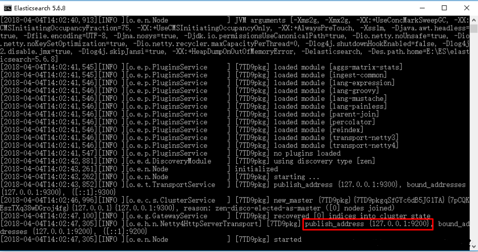

**注意：9300是tcp通信端口，es集群之间使用tcp进行通信，9200是http协议端口。**

我们在浏览器可以访问：

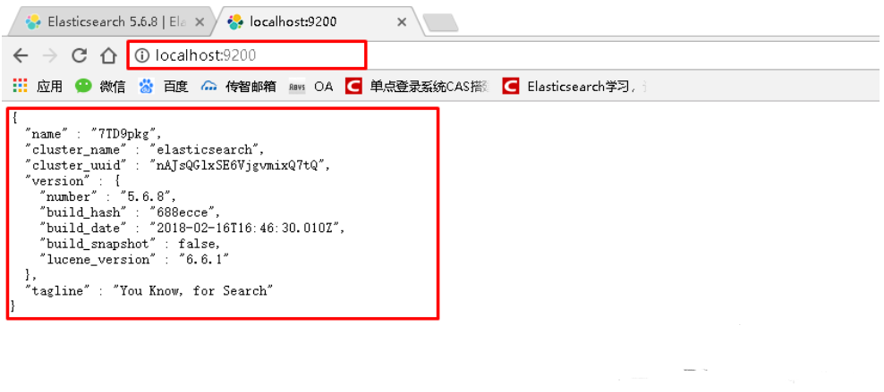

## 2.4 安装图形化插件

> 上述可以发现，ElasticSearch不同于Solr自带图形化界面，我们可以通过安装ElasticSearch的head插件，完成图形化界面的效果，完成索引数据的查看。安装插件的方式有两种，在线安装和本地安装。本文档采用本地安装方式进行head插件的安装。elasticsearch-5-*以上版本安装head需要安装node和grunt 。

- 下载head插件：https://github.com/mobz/elasticsearch-head

下载压缩包后解压即可。

- 下载node.js：https://nodejs.org/en/download/

双击安装，通过cmd输入 node -v查看版本号

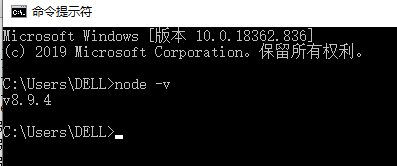

- 将grunt安装为全局命令 ，Grunt是基于Node.js的项目构建工具

在cmd中输入：

> npm install ‐g grunt‐cli

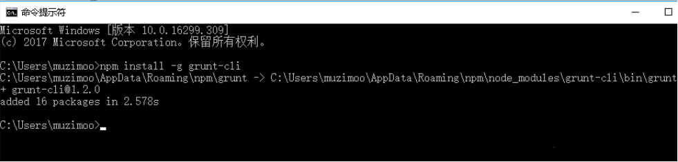

**由于访问的是国外的服务器，如果下载速度较慢，可以切换淘宝镜像**

> npm install -g cnpm –registry=https://registry.npm.taobao.org
>
> 后续使用的时候，只需要把npm xxx 换成 cnpm xxx 即可

**检测是否安装成功**

```nginx
npm config get registry 
```

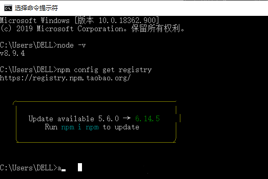
注意：后续使用时需要将`npm`替换为`cnpm`。

- 启动head

进入head插件目录，打开cmd，输入：

```java
>npm install
>grunt server
```


打开浏览器，输入http://localhost:9100即可

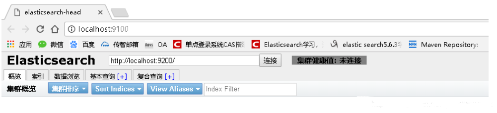

# 3.ES相关概念

## 3.1 概述（重要）

Elasticsearch是面向文档(document oriwqented)的，这意味着它可以存储整个对象或文档(document)。然而它不仅
仅是存储，还会索引(index)每个文档的内容使之可以被搜索。在Elasticsearch中，你可以对文档（而非成行成列的数据）进行索引、搜索、排序、过滤。Elasticsearch比传统关系型数据库如下：

> Relational DB ‐> Databases ‐> Tables ‐> Rows ‐> Columns
> Elasticsearch ‐> Indices ‐> Types ‐> Documents ‐> Fields

## 3.2 核心概念

#### 1）index索引

> 一个索引就是一个拥有几分相似特征的文档的集合。比如说，你可以有一个客户数据的索引，另一个产品目录的索引，还有一个订单数据的索引。一个索引由一个名字来标识（必须全部是小写字母的），并且当我们要对对应于这个索引中的文档进行索引、搜索、更新和删除的时候，都要使用到这个名字。在一个集群中，可以定义任意多的索引。**可类比mysql中的数据库**

#### 2）type类型

> 在一个索引中，你可以定义一种或多种类型。一个类型是你的索引的一个逻辑上的分类/分区，其语义完全由你来定。通常，会为具有一组共同字段的文档定义一个类型。比如说，我们假设你运营一个博客平台并且将你所有的数据存储到一个索引中。在这个索引中，你可以为用户数据定义一个类型，为博客数据定义另一个类型，当然，也可以为评论数据定义另一个类型。 **可类比mysql中的表**

#### 3)Filed字段

> 相当于是数据表的字段，对文档数据根据不同属性进行的分类标识 。

#### 4）映射mapping

> mapping是处理数据的方式和规则方面做一些限制，如某个字段的数据类型、默认值、分析器、是否被索引等等，这些都是映射里面可以设置的，其它就是处理es里面数据的一些使用规则设置也叫做映射，按着最优规则处理数据对性能提高很大，因此才需要建立映射，并且需要思考如何建立映射才能对性能更好。**相当于mysql中的创建表的过程，设置主键外键等等**

#### 5）document文档

> 一个文档是一个可被索引的基础信息单元。比如，你可以拥有某一个客户的文档，某一个产品的一个文档，当然，也可以拥有某个订单的一个文档。文档以JSON（Javascript Object Notation）格式来表示，而JSON是一个到处存在的互联网数据交互格式。在一个index/type里面，你可以存储任意多的文档。注意，尽管一个文档，物理上存在于一个索引之中，文档必须被索引/赋予一个索引的type。 **插入索引库以文档为单位，类比与数据库中的一行数据**

#### 6）集群cluster

> 一个集群就是由一个或多个节点组织在一起，它们共同持有整个的数据，并一起提供索引和搜索功能。一个集群由 一个唯一的名字标识，这个名字默认就是“elasticsearch”。这个名字是重要的，因为一个节点只能通过指定某个集 群的名字，来加入这个集群。

#### 7）节点node

> 一个节点是集群中的一个服务器，作为集群的一部分，它存储数据，参与集群的索引和搜索功能。和集群类似，一 个节点也是由一个名字来标识的，默认情况下，这个名字是一个随机的漫威漫画角色的名字，这个名字会在启动的 时候赋予节点。这个名字对于管理工作来说挺重要的，因为在这个管理过程中，你会去确定网络中的哪些服务器对 应于Elasticsearch集群中的哪些节点。

> 一个节点可以通过配置集群名称的方式来加入一个指定的集群。默认情况下，每个节点都会被安排加入到一个叫 做“elasticsearch”的集群中，这意味着，如果你在你的网络中启动了若干个节点，并假定它们能够相互发现彼此， 它们将会自动地形成并加入到一个叫做“elasticsearch”的集群中。

> 在一个集群里，只要你想，可以拥有任意多个节点。而且，如果当前你的网络中没有运行任何Elasticsearch节点， 这时启动一个节点，会默认创建并加入一个叫做“elasticsearch”的集群。

#### 8）分片和复制 shards&replicas

> 一个索引可以存储超出单个结点硬件限制的大量数据。比如，一个具有10亿文档的索引占据1TB的磁盘空间，而任一节点都没有这样大的磁盘空间；或者单个节点处理搜索请求，响应太慢。为了解决这个问题，Elasticsearch提供了将索引划分成多份的能力，这些份就叫做分片。当你创建一个索引的时候，你可以指定你想要的分片的数量。每个分片本身也是一个功能完善并且独立的“索引”，这个“索引”可以被放置到集群中的任何节点上。分片很重要，主要有两方面的原因： 1）允许你水平分割/扩展你的内容容量。 2）允许你在分片（潜在地，位于多个节点上）之上进行分布式的、并行的操作，进而提高性能/吞吐量。

> 至于一个分片怎样分布，它的文档怎样聚合回搜索请求，是完全由Elasticsearch管理的，对于作为用户的你来说，这些都是透明的。

> 在一个网络/云的环境里，失败随时都可能发生，在某个分片/节点不知怎么的就处于离线状态，或者由于任何原因消失了，这种情况下，有一个故障转移机制是非常有用并且是强烈推荐的。为此目的，Elasticsearch允许你创建分片的一份或多份拷贝，这些拷贝叫做复制分片，或者直接叫复制。

> 复制之所以重要，有两个主要原因： 在分片/节点失败的情况下，提供了高可用性。因为这个原因，注意到复制分片从不与原/主要（original/primary）分片置于同一节点上是非常重要的。扩展你的搜索量/吞吐量，因为搜索可以在所有的复制上并行运行。总之，每个索引可以被分成多个分片。一个索引也可以被复制0次（意思是没有复制）或多次。一旦复制了，每个索引就有了主分片（作为复制源的原来的分片）和复制分片（主分片的拷贝）之别。分片和复制的数量可以在索引创建的时候指定。在索引创建之后，你可以在任何时候动态地改变复制的数量，但是你事后不能改变分片的数量。

> 默认情况下，Elasticsearch中的每个索引被分片5个主分片和1个复制，这意味着，如果你的集群中至少有两个节点，你的索引将会有5个主分片和另外5个复制分片（1个完全拷贝），这样的话每个索引总共就有10个分片。

# 4.ElasticSearch客户端操作

上述部分为理论部分，实际开发中，主要有三种方式可以作为es服务的客户端：

- 使用elasticsearch-head插件
- 使用elasticsearch提供的Restful接口直接访问
- 使用elasticsearch提供的API进行访问

## 4.1使用Restful接口直接访问

我们需要使用http请求，介绍两款接口测试工具：postman和Talend API tester。

- Talend API tester安装：

这是一款chrome插件，无需下载；


- Postman安装：

Postman官网：[https://www.getpostman.com](https://www.getpostman.com/)


## 4.2使用Talend API tester进行es客户端操作。

#### 1）Elasticsearch的接口语法

```
curl ‐X<VERB> '<PROTOCOL>://<HOST>:<PORT>/<PATH>?<QUERY_STRING>' ‐d '<BODY>'
```

其中：

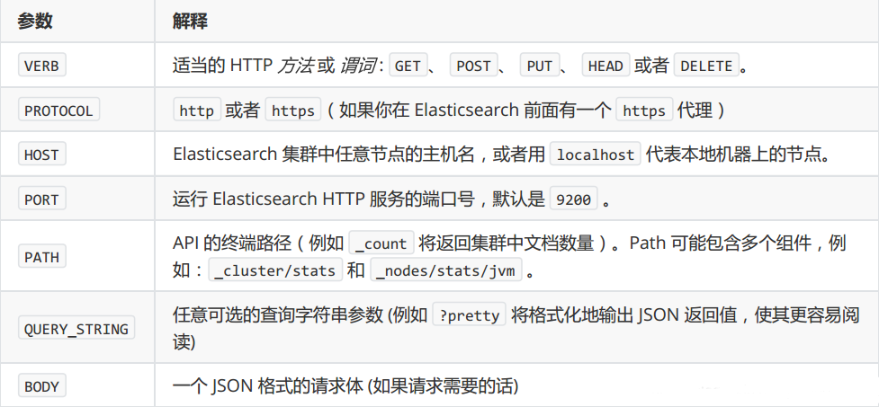

#### 2）创建索引库index并添加映射mapping------PUT

```
PUT 
```

请求体：

> article：
>
> type：相当于这个索引库中有张表叫做article下面定义的这张表中的字段的定义，
>
> index：索引，字段默认为不索引的，
>
> store：存储
>
> analyzer：分词器使用标准分词器

```json
{
    "mappings": {
        "article": {
            "properties": {
                "id": {
                    "type": "long",
                    "store": true,
                    "index": true
                },
                "title": {
                    "type": "text",
                    "store": true,
                    "index": true,
                    "analyzer": "standard"
                },
                "content": {
                    "type": "text",
                    "store": true,
                    "index": true,
                    "analyzer": "standard"
                }
            }
        }
    }
}
```

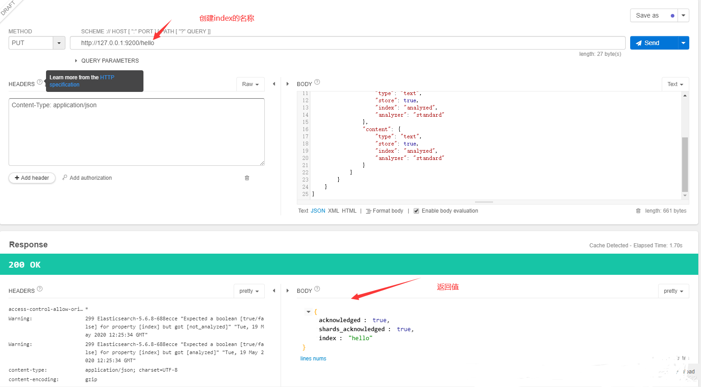

在可视化工具elasticsearch-head中查看：

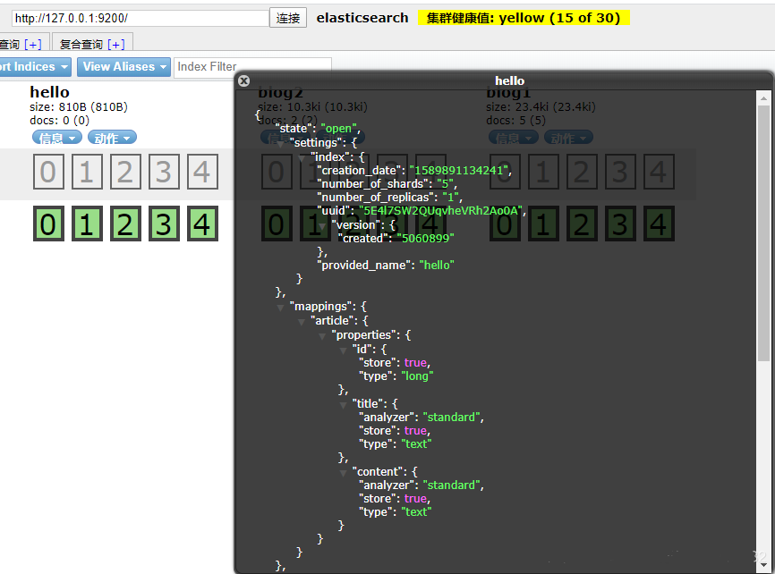

#### 3）先创建索引index，再添加mapping ----PUT

我们可以在创建索引时设置mapping信息，当然也可以先创建索引然后再设置mapping。
在上一个步骤中不设置maping信息，直接使用put方法创建一个索引，然后设置mapping信息。
请求的url：

```java
PUT   http://127.0.0.1:9200/hello2/article/_mapping
```

请求体：

```json
{
     "article": {
            "properties": {
                "id": {
                    "type": "long",
                    "store": true,
                    "index": true
                },
                "title": {
                    "type": "text",
                    "store": true,
                    "index": true,
                    "analyzer": "standard"
                },
                "content": {
                    "type": "text",
                    "store": true,
                    "index": true,
                    "analyzer": "standard"
                }
            }
        }
}
```

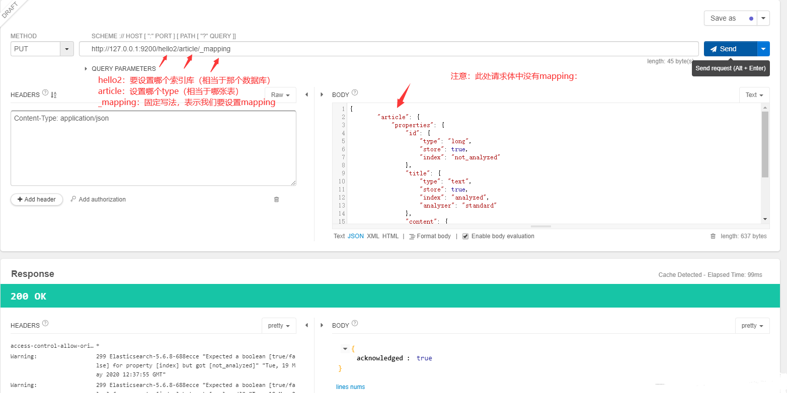

#### 4)删除索引index ----DELETE

请求URL:

```java
DELETE  http://127.0.0.1:9200/hello2
```

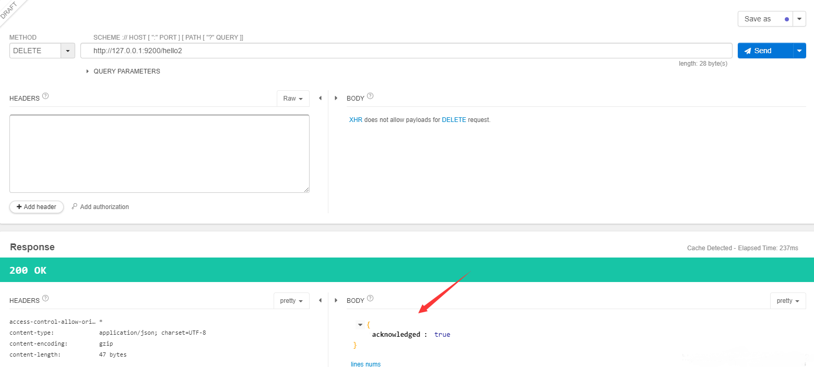

#### 5)创建文档document（向索引库中添加内容）---POST

请求URL:

```java
POST  http://127.0.0.1:9200/hello/article/1
```

请求体：

```json
{
    "id": 1,
    "title": "ElasticSearch是一个基于Lucene的搜索服务器",
    "content": "它提供了一个分布式多用户能力的全文搜索引擎，基于RESTful web接口。Elasticsearch是用Java开发的，并作为Apache许可条款下的开放源码发布，是当前流行的企业级搜索引擎。设计用于云计算中，能够达到实时搜索，稳定，可靠，快速，安装使用方便。"
}
```

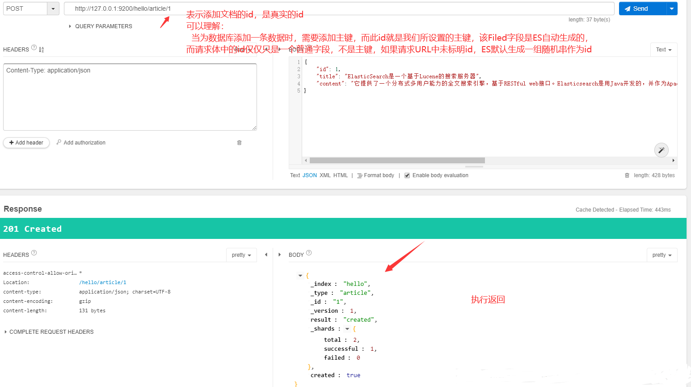

在elasticsearch-head中查看：


**注意，一般我们将_id与id赋相同值。**

#### 6）修改document内容----POST

请求URL:

```java
POST http://127.0.0.1:9200/hello/article/1
```

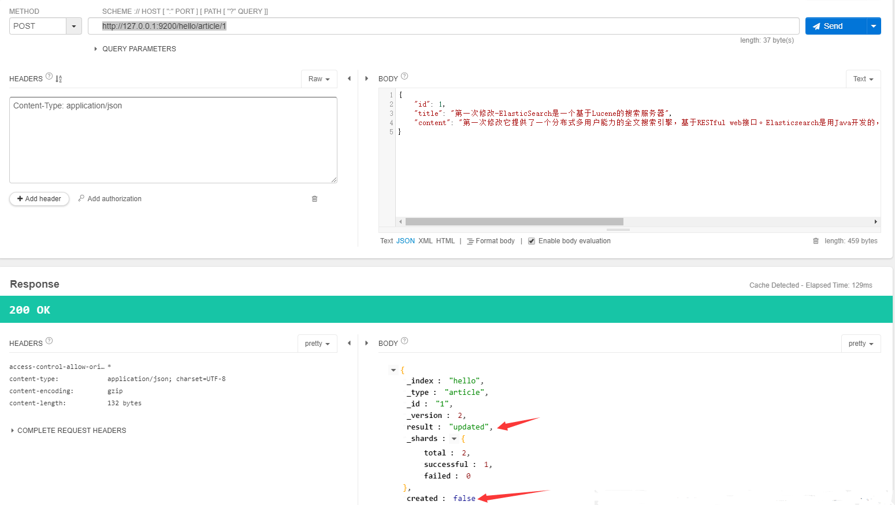

在elasticsearch-head中查看：


#### 7)删除文档document---DELETE

请求URL:

```java
DELETE http://127.0.0.1:9200/hello/article/2
```

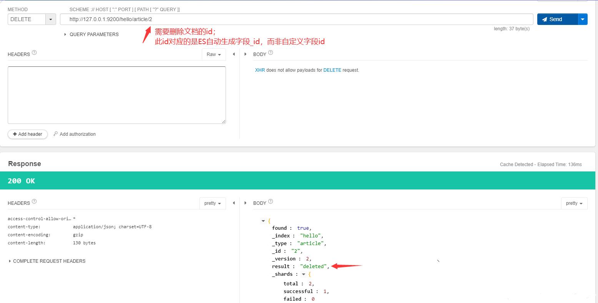

#### 8)查询文档document-----GET

查询文档有三种方式：

- 根据id查询；
- 根据关键词查询
- 根据输入的内容先分词，再查询

##### i.根据id查询

请求URL：

```java
GET http://127.0.0.1:9200/hello/article/1
```

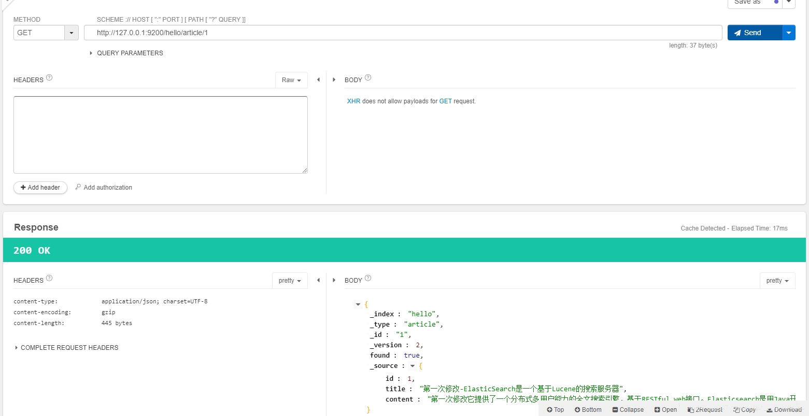

##### ii.根据关键字查询-term查询

请求URL：

```
POST http://127.0.0.1:9200/hello/article/_search
```

请求体：

```json
{
    "query": {
        "term": {
            "title": "搜"
        }
    }
}
```

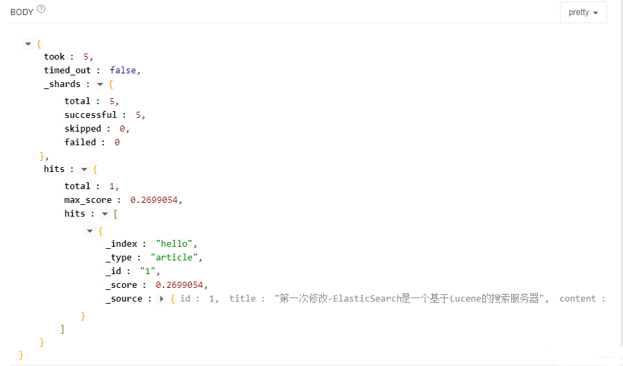

##### iii.查询文档-querystring查询

请求URL：

```java
POST   http://127.0.0.1:9200/hello/article/_search
```

请求体：

```java
{
    "query": {
        "query_string": {
            "default_field": "title",
            "query": "搜索服务器"
        }
    }
}
```

> 指定：
> 在哪个字段上进行查询；
> 要查询的内容是什么；
>
> 它会把查询内容先进行分词，再进行查询


## 4.3使用elasticsearch-head进行es客户端操作

在elasticsearch-head中集成了http请求的工具，可以提供复查查询：
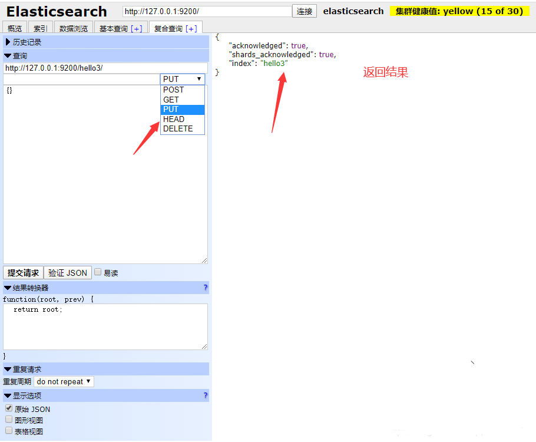

# 5.IK分词器和Elasticsearch集成使用

上述分词器使用的是标准分词器，其对中文分词不是很友好，例如对我是程序员进行分词得到：

```java
GET http://127.0.0.1:9200/_analyze?analyzer=standard&pretty=true&text=我是程序员
"tokens":[
{"token": "我", "start_offset": 0, "end_offset": 1, "type": "<IDEOGRAPHIC>",…},
{"token": "是", "start_offset": 1, "end_offset": 2, "type": "<IDEOGRAPHIC>",…},
{"token": "程", "start_offset": 2, "end_offset": 3, "type": "<IDEOGRAPHIC>",…},
{"token": "序", "start_offset": 3, "end_offset": 4, "type": "<IDEOGRAPHIC>",…},
{"token": "员", "start_offset": 4, "end_offset": 5, "type": "<IDEOGRAPHIC>",…}
]
```

我们希望达到的分词是：我、是、程序、程序员。

支持中文的分词器有很多，word分词器，庖丁解牛，Ansj分词器，下面注意说IK分词器的使用。

## 5.1IK分词器的安装

1）下载地址：https://github.com/medcl/elasticsearch-analysis-ik/releases

2）解压，将解压后的elasticsearch文件夹拷贝到elasticsearch-6.5.0\plugins下，并重命名文件夹为analysis-ik （其他名字也可以，目的是不要重名）

3）重新启动ElasticSearch，即可加载IK分词器

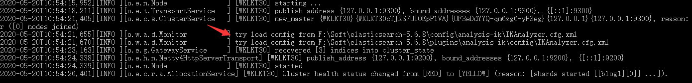

## 5.2IK分词器测试

IK提供两种分词ik_smart和ik_max_word

其中ik_smart为最少切分，ik_max_word为最细粒度划分。

下面测试一下：

- 最小切分


```
{
    "analyzer":"chinese",
    "text":"我是一个程序员"
}
```

返回结果：

```json
{
    "tokens": [
        {
            "token": "我",
            "start_offset": 0,
            "end_offset": 1,
            "type": "<IDEOGRAPHIC>",
            "position": 0
        },
        {
            "token": "是",
            "start_offset": 1,
            "end_offset": 2,
            "type": "<IDEOGRAPHIC>",
            "position": 1
        },
        {
            "token": "一",
            "start_offset": 2,
            "end_offset": 3,
            "type": "<IDEOGRAPHIC>",
            "position": 2
        },
        {
            "token": "个",
            "start_offset": 3,
            "end_offset": 4,
            "type": "<IDEOGRAPHIC>",
            "position": 3
        },
        {
            "token": "程",
            "start_offset": 4,
            "end_offset": 5,
            "type": "<IDEOGRAPHIC>",
            "position": 4
        },
        {
            "token": "序",
            "start_offset": 5,
            "end_offset": 6,
            "type": "<IDEOGRAPHIC>",
            "position": 5
        },
        {
            "token": "员",
            "start_offset": 6,
            "end_offset": 7,
            "type": "<IDEOGRAPHIC>",
            "position": 6
        }
    ]
}
```

- 最细切分

  

```java
{
    "analyzer":"ik_max_word",
    "text":"我是一个程序员"
}
```

返回结果：

```json
{
    "tokens": [
        {
            "token": "我",
            "start_offset": 0,
            "end_offset": 1,
            "type": "CN_CHAR",
            "position": 0
        },
        {
            "token": "是",
            "start_offset": 1,
            "end_offset": 2,
            "type": "CN_CHAR",
            "position": 1
        },
        {
            "token": "一个",
            "start_offset": 2,
            "end_offset": 4,
            "type": "CN_WORD",
            "position": 2
        },
        {
            "token": "一",
            "start_offset": 2,
            "end_offset": 3,
            "type": "TYPE_CNUM",
            "position": 3
        },
        {
            "token": "个",
            "start_offset": 3,
            "end_offset": 4,
            "type": "COUNT",
            "position": 4
        },
        {
            "token": "程序员",
            "start_offset": 4,
            "end_offset": 7,
            "type": "CN_WORD",
            "position": 5
        },
        {
            "token": "程序",
            "start_offset": 4,
            "end_offset": 6,
            "type": "CN_WORD",
            "position": 6
        },
        {
            "token": "员",
            "start_offset": 6,
            "end_offset": 7,
            "type": "CN_CHAR",
            "position": 7
        }
    ]
}
```

# 6.ElasticSearch集群

> ES集群是一个 P2P类型(使用 gossip 协议)的分布式系统，除了集群状态管理以外，其他所有的请求都可以发送到集群内任意一台节点上，这个节点可以自己找到需要转发给哪些节点，并且直接跟这些节点通信。所以，从网络架构及服务配置上来说，构建集群所需要的配置极其简单。在 Elasticsearch 2.0 之前，无阻碍的网络下，所有配置了相同 cluster.name 的节点都自动归属到一个集群中。2.0 版本之后，基于安全的考虑避免开发环境过于随便造成的麻烦，从 2.0 版本开始，默认的自动发现方式改为了单播(unicast)方式。配置里提供几台节点的地址，ES 将其视作gossip router 角色，借以完成集群的发现。由于这只是 ES 内一个很小的功能，所以 gossip router 角色并不需要单独配置，每个 ES 节点都可以担任。所以，采用单播方式的集群，各节点都配置相同的几个节点列表作为 router即可。

集群中节点数量没有限制，一般大于等于2个节点就可以看做是集群了。一般处于高性能及高可用方面来

虑一般集群中的节点数量都是3个及3个以上 .

## 6.1 集群的搭建（Windows）

#### 1）准备三台elasticsearch服务器：

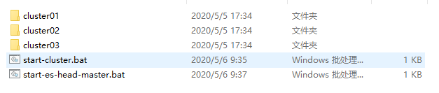

#### 2）修改每台服务器的配置

修改\comf\elasticsearch.yml配置文件：

```json
#Node节点1：
 
http.cors.enabled: true
http.cors.allow-origin: "*"
#节点1的配置信息：
#集群名称，保证唯一
cluster.name: my-elasticsearch
#节点名称，必须不一样
node.name: node-1
#必须为本机的ip地址
network.host: 127.0.0.1
#服务端口号，在同一机器下必须不一样
http.port: 9201
#集群间通信端口号，在同一机器下必须不一样
transport.tcp.port: 9301
#设置集群自动发现机器ip集合
discovery.zen.ping.unicast.hosts: ["127.0.0.1:9301","127.0.0.1:9302","127.0.0.1:9303"]
 
#Node节点2：
 
http.cors.enabled: true
http.cors.allow-origin: "*"
#节点1的配置信息：
#集群名称，保证唯一
cluster.name: my-elasticsearch
#节点名称，必须不一样
node.name: node-2
#必须为本机的ip地址
network.host: 127.0.0.1
#服务端口号，在同一机器下必须不一样
http.port: 9202
#集群间通信端口号，在同一机器下必须不一样
transport.tcp.port: 9302
#设置集群自动发现机器ip集合
discovery.zen.ping.unicast.hosts: ["127.0.0.1:9301","127.0.0.1:9302","127.0.0.1:9303"]
 
#Node节点3：
 
http.cors.enabled: true
http.cors.allow-origin: "*"
#节点1的配置信息：
#集群名称，保证唯一
cluster.name: my-elasticsearch
#节点名称，必须不一样
node.name: node-3
#必须为本机的ip地址
network.host: 127.0.0.1
#服务端口号，在同一机器下必须不一样
http.port: 9203
#集群间通信端口号，在同一机器下必须不一样
transport.tcp.port: 9303
#设置集群自动发现机器ip集合
discovery.zen.ping.unicast.hosts: ["127.0.0.1:9301","127.0.0.1:9302","127.0.0.1:9303"]
```

#### 3.启动各个节点服务器

可以分别启动每个服务器下的elasticsearch.bat，我这里使用的是windows下的批处理文件：

新建一个elasticsearch_cluster_start.bat文件，然后添加下面内容：

格式为：start "需要启动的文件名" "文件的路径" &表示启动A后继续执行。

```bat
start "elasticsearch.bat" "F:\Soft\ES-cluster\cluster01\bin\elasticsearch.bat" &
start "elasticsearch.bat" "F:\Soft\ES-cluster\cluster02\bin\elasticsearch.bat" &
start "elasticsearch.bat" "F:\Soft\ES-cluster\cluster03\bin\elasticsearch.bat" 
```

关于Windows的批处理在本章就不细说了。

#### 4.集群测试

> 只要连接集群中的任意节点，其操作方式与单机版本基本相同，改变的仅仅是存储的结构。

**添加索引和映射**

```java
PUT  http://127.0.0.1:9201/hello
```

请求体：

```json
{
    "mappings": {
    "article": {
        "properties": {
            "id": {
                "type": "long",
                "store": true,
                 "index": "not_analyzed"
            },
            "title": {
                "type": "text",
                "store": true,
                "index": true,
                "analyzer": "ik_smart"
            },
            "content": {
                "type": "text",
                "store": true,
                "index": true,
                "analyzer": "ik_smart"
            }
        }
    }
    }
}
```

返回结果：

```json
{
"acknowledged": true,
"shards_acknowledged": true,
"index": "hello"
}
```

**添加文档**

```java
POST   http://127.0.0.1:9201/hello/article/1
```

请求体：

```json
{
"id":1,
"title":"ElasticSearch是一个基于Lucene的搜索服务器",
"content":"它提供了一个分布式多用户能力的全文搜索引擎，基于RESTful web接口。Elasticsearch是用Java开发的，并作为Apache许可条款下的开放源码发布，是当前流行的企业级搜索引擎。设计用于云计算中，能够达到实时搜索，稳定，可靠，快速，安装使用方便。"
}
```

返回值：

```json
{
"_index": "hello",
"_type": "article",
"_id": "1",
"_version": 1,
"result": "created",
"_shards":{
"total": 2,
"successful": 2,
"failed": 0
},
"created": true
}
```

在elasticsearch-head中查看：


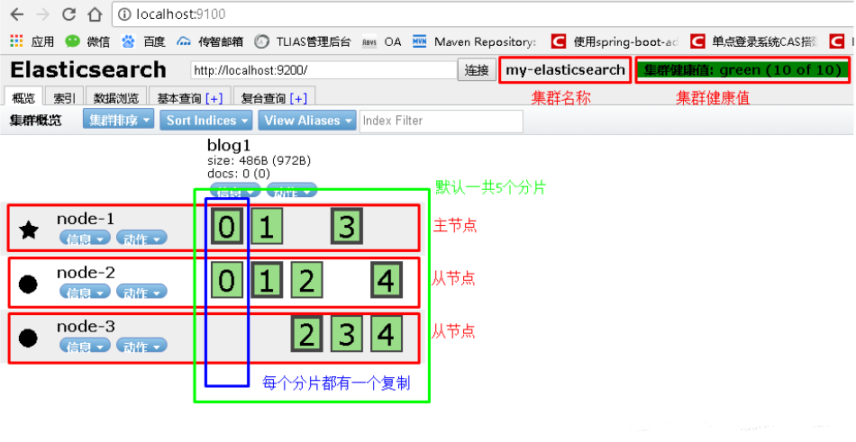