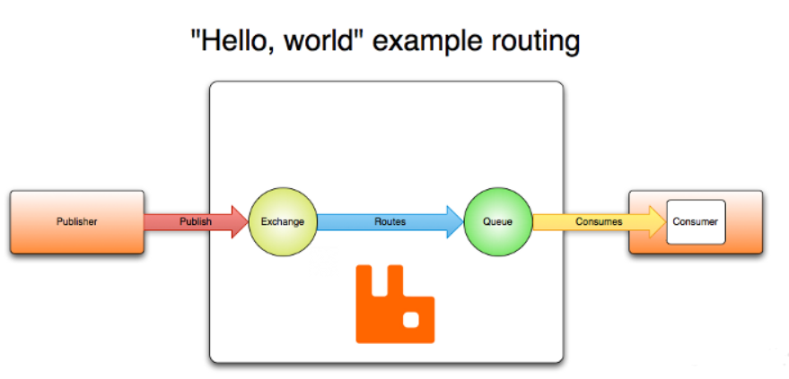
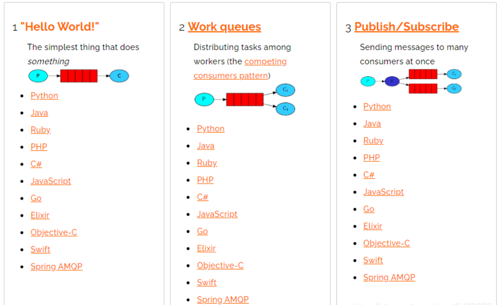
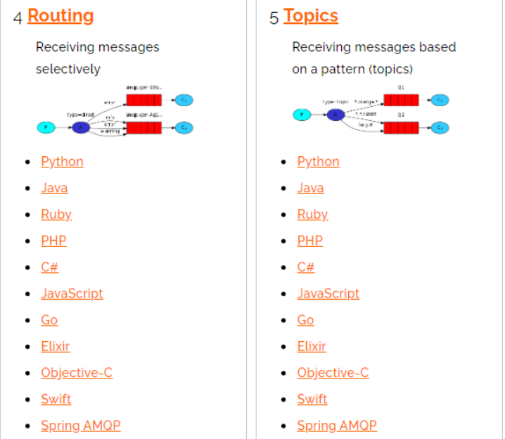
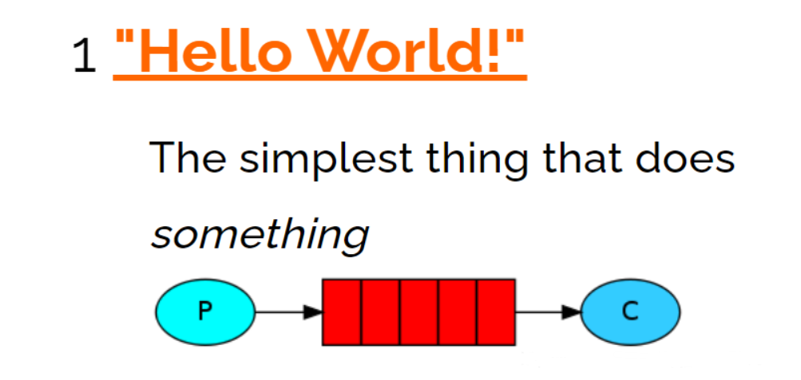
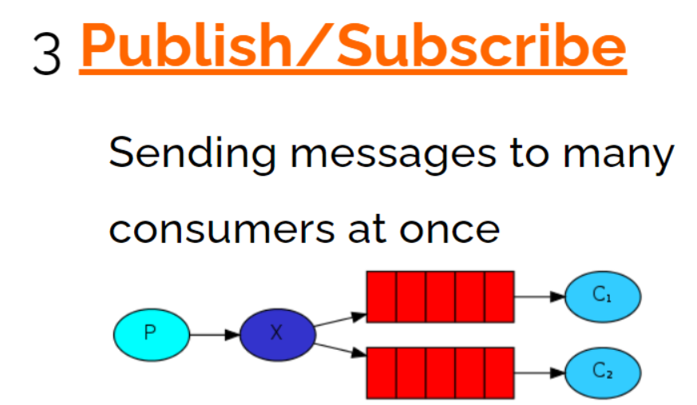
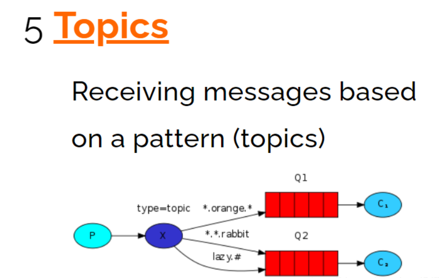
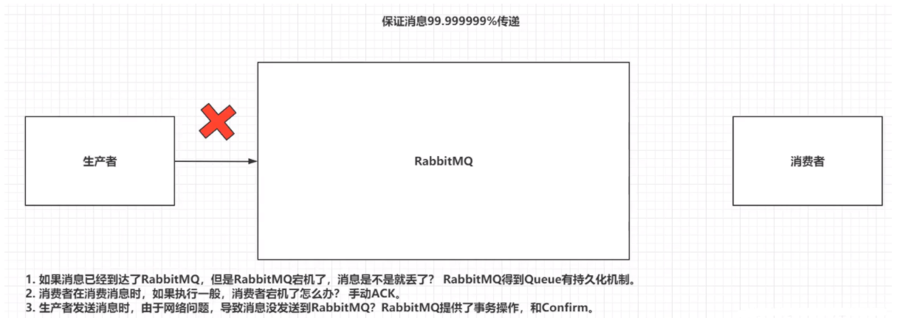
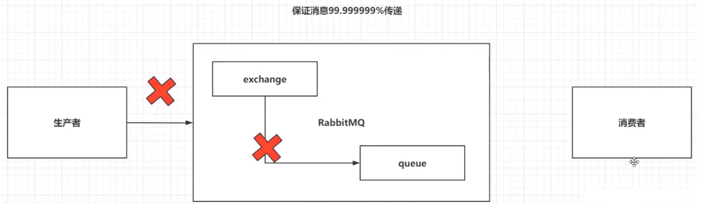
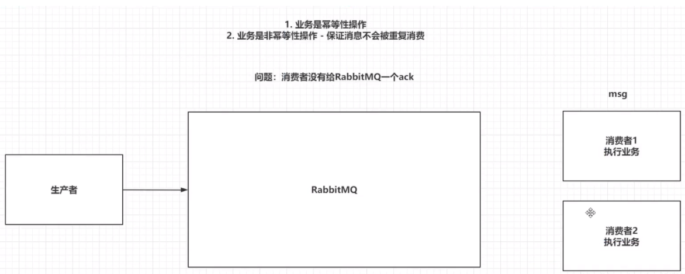

## 学习目标

- 了解RabbitMQ的作用及架构
- 掌握RabbitMQ安装及基本使用
- 掌握Springboot整合RabbitMQ
- 掌握RabbitMQ的高级应用

## 一.RabbitMQ安装

### 1.1 为什么使用RabbitMQ

> 1.降低耦合度
>
> 2.RabbitMQ速度快，微秒级别
>
> 3.学习成本低
>
> 4.支持多种语言

### 1.2 什么是RabbitMQ

> 1. RabbitMQ是一个由erlang开发的AMQP（Advanced Message Queue 高级消息队列协议）的开源实现
> 2. 能够实现异步消息处理

### 1.3 安装RabbitMQ

```
#在线安装
docker pull rabbitmq:management
#使用官方定义的端口号启动
docker run -d --hostname my-rabbit --name rabbit -p 15672:15672 -p 5672:5672 rabbitmq:management
```

## 二.RabbitMQ架构

### 2.1官方简单架构图

> 1.Publish-生产者（发布消息到RabbitMQ中的Exchange）
>
> 2.Exchange-交换机（与生产者建立连接并接收生产者的消息）
>
> 3.Routes-路由（交换机以什么样的策略消息发布到Queue）
>
> 4.Queue-队列（Exchange会将消息分发到指定的Queue，Queue和消费者进行交互）
>
> 5.Consumer-消费者（监听RabbitMQ中的Queue中的消息）



### 2.2Rabbit完整架构图


### 2.3查看图形化界面并创建一个Virtual Host

> Virtual Host:相当于RabbitMQ上的虚拟机，建立connection连接的时Virtual Host！
>
> 创建一个全新的用户和全新的Virtual Host,并且将test用户设置上可以操作/test-1的权限！


## 三.RabbitMQ使用

### 3.1RabbitMQ通讯方式





### 3.2 Java连接RabbitMQ

```
 public static Connection getConnection(){
        //创建Connection工厂
        ConnectionFactory factory = new ConnectionFactory();
        factory.setVirtualHost("/test-1");
        factory.setPassword("test");
        factory.setUsername("test");
        factory.setHost("192.168.61.134");
        factory.setPort(5672);
        Connection connection = null;
        //拿到连接
        try {
            connection  = factory.newConnection();
        } catch (IOException e) {
            e.printStackTrace();
        } catch (TimeoutException e) {
            e.printStackTrace();
        }

        return connection;
    }

```

### 3.3Hello-world



> 一个生产者，一个默认的交换机，一个队列，一个消费者

> 1、创建生产者，创建一个channel，发送消息到exchange，指定路由规则

```
//生产者
public static void publish() throws Exception {
    //1、获取connection
    Connection connection = RabbitConfig.getConnection();
    //2、创建channel
    Channel channel = connection.createChannel();
    //3、发送消息到exchange
      String msg = "hello world!!!";
    /**
     * 参数1：指定exchange，使用“”。默认的exchange
     * 参数2：指定路由的规则，使用具体的队列名称。exchange为""时，消息直接发送到队列中
     * 参数3：制动传递的消息携带的properties
     * 参数4：指定传递的消息，byte[]类型
     */
    channel.basicPublish("", "helloworld", null,msg.getBytes());
    //PS:exchange是不会将消息持久化的，Queue可以持久化，得配置

    System.out.println("生产者发布消息成功！");
    //4、关闭管道和连接
    channel.close();
    connection.close();

}
```

> 2、创建一个消费者，创建一个channel，创建一个队列，并且消费队列

```
//消费者  
public static void consumer() throws Exception{
    //1、获取连对象、
    Connection connection = RabbitConfig.getConnection();

    //2、创建channel
    Channel channel = connection.createChannel();

    //3、创建队列-helloworld
    /**
         * 参数1：queue 指定队列名称
         * 参数2：durable 是否开启持久化（true）
         * 参数3：exclusive 是否排外（conn.close()-》当前对列自动删除，当前队列只能被一个 消费者消费）
         * 参数4：autoDelete 如果这个队列没有其他消费者在消费，队列自动删除
         * 参数5：arguments 指定队列携带的信息
         *
         */
    channel.queueDeclare("helloworld",true,false,false,null);


    //4.开启监听Queue
    DefaultConsumer consumer = new DefaultConsumer(channel){
        @Override
        public void handleDelivery(String consumerTag, Envelope envelope, AMQP.BasicProperties properties, byte[] body) throws IOException {
            System.out.println("接收到消息:"+new String(body,"UTF-8"));
        }
    };
    /**
         * 参数1：queue 指定消费哪个队列
         * 参数1：deliverCallback 指定是否ACK（true:收到消息会立即告诉RabbiMQ，false：手动告诉）
         * 参数1：cancelCallback 指定消费回调
         *
         */
    channel.basicConsume("helloworld",true,consumer);
    System.out.println("消费者开始监听队列");

    //5、键盘录入，让程序不结束！
    System.in.read();

    //6、释放资源
    channel.close();
    connection.close();

}
```

### 3.4 Work


> 一个生产者，一个默认的交换机，一个队列，两个消费者

> 只需要在consumer消费者端，添加Qos能力以及更改为ACK手动即可让消费者根据自己的能力消费，不是RabbitMQ默认的平均分配了

```
//1指定当前消费者一次能消费多少条消息
channel.basicQos(1);

//2.开启监听Queue
DefaultConsumer consumer = new DefaultConsumer(channel){
    @Override
    public void handleDelivery(String consumerTag, Envelope envelope, AMQP.BasicProperties properties, byte[] body) throws IOException {
        System.out.println("消费者1号接收到消息:"+new String(body,"UTF-8"));
        try {
            Thread.sleep(100);
        } catch (InterruptedException e) {
            e.printStackTrace();
        }
        //手动ACK（接收信息，指定书否批量操作）
        channel.basicAck(envelope.getDeliveryTag(),false);
    }
};
//3.关闭自动ACK
    channel.basicConsume("work",false,consumer);

```

### 3.5 Publish/Subscribe



> 一个生产者，一个交换机，两个队列，两个消费者

> 声明一个Fanout类型的exchange，并且将exchange和queue绑定在一起，绑定规则直接绑定。

> 1、让生产者创建一个exchange并且指定类型，和一个或多个队列绑定在一起。当生产者发送消息是会发送到exchange中，再由exchange到绑定的队列中

```
//3、通过channel创建自己的exchange 并且绑定队列
    /**
     * 参数1：exchange的名称
     * 参数2：指定exchange的类型
     * FANOUT-Publish/Subscribe
     * DIRECT-Routing
     * TOPIC-Topics
     */

    channel.exchangeDeclare("publish-exchange", BuiltinExchangeType.FANOUT);
    channel.queueBind("pubsub-queue1","publish-exchange","");
    channel.queueBind("pubsub-queue2","publish-exchange","");

```

> 2、消费者还是监听指定队列即可。

### 3.6 Routing


> 一个生产者，一个交换机，两个队列，两个消费者

> 声明一个DIRECT类型的exchange，并且根据Routingkey绑定指定的队列
>
> 绑定生产者和消费者都可以做，因为两边都有channel

> 1、生产者在创建DIRECT类型的exchange后绑定相应的队列，并且指定Routingkey。在发送消息是也要指定消息的Routingkey

```
//3、创建exchange并且指定类型
channel.exchangeDeclare("routing-exchange", BuiltinExchangeType.DIRECT);

//4、绑定队列 routing-queue-error routing-queue-info
channel.queueBind("routing-queue-error", "routing-exchange", "ERROR");
channel.queueBind("routing-queue-info", "routing-exchange", "INFO");

//5、发送消息并且指定接收的队列的routingkey
channel.basicPublish("routing-exchange", "ERROR", null, "ERROR-MSG".getBytes());
channel.basicPublish("routing-exchange", "INFO", null, "INFO-1".getBytes());
channel.basicPublish("routing-exchange", "INFO", null, "INFO-2".getBytes());
channel.basicPublish("routing-exchange", "INFO", null, "INFO-3".getBytes());

```

> 2、消费者没变化，监听自己的队列即可

### 3.7 Topics



> 一个生产者，一个交换机，两个队列，两个消费者

> 1、生产者创建Topic的exchange并且并且指定队列，这次绑定可以通过*和#匹配关键字，对指定RoutingKey内容进行匹配。
>
> *（星号）可以代替一个单词。
>
> ＃（哈希）可以替代零个或多个单词。

```
//3、创建exchange
channel.exchangeDeclare("topics-exchange", BuiltinExchangeType.TOPIC);

//4、绑定队列 topics-queue-1 topics-queue-2
channel.queueBind("topics-queue-1", "topics-exchange", "zhang.*");
channel.queueBind("topics-queue-2", "topics-exchange", "wang.*");
channel.queueBind("topics-queue-2", "topics-exchange", "wang.#;");

//3、发送消息到exchange
channel.basicPublish("topics-exchange", "zhang.sna", null, "张三".getBytes());
channel.basicPublish("topics-exchange", "zhang.sna.sna", null, "张三三".getBytes());
channel.basicPublish("topics-exchange", "wang.wu", null, "王五".getBytes());
channel.basicPublish("topics-exchange", "wang.ergou", null, "王二狗".getBytes());
System.out.println("生产者发布消息成功！");

```

> 2、消费者无变化，监听指定的队列即可。

## 四.Springboot整合RabbitMQ

### 4.1 Springboot整合RabbitMQ

> 1.创建Springboot工程

> 2.导入依赖

```
<dependency>
    <groupId>org.springframework.boot</groupId>
    <artifactId>spring-boot-starter-amqp</artifactId>
</dependency>

```

> 3.写入配置文件application.yml

```
spring:
  rabbitmq:
    host: 192.168.164.133
    virtual-host: /test-1
    username: test
    password: test
    port: 5672

```

> 4.创建config配置，声明exchange和queue，并且绑定在一起

```
@Configuration
public class MQConfig {


    //1、创建exchange topic
    @Bean
    public TopicExchange getTopicExchage() {
        return new TopicExchange("boot-topic-exchange", true, false);
    }

    //2、创建queue
    @Bean
    public Queue getQueue(){
        return new Queue("topic-queue",true,false,false,null);
    }


    //3、绑定
    @Bean
    public Binding geteBinding(TopicExchange topicExchange,Queue queue){
        return BindingBuilder.bind(queue).to(topicExchange).with("ERROR");
    }

}

```

> 5.发布消息到RabbitMQ

```
  @Test
    void contextLoads() throws IOException {
        rabbitTemplate.convertAndSend("boot-topic-exchange","ERROR","error");
    }

```

> 6.创建消费者监听器接收消息

```
@Component
public class Consumer {
    @RabbitListener(queues = "topic-queue")
    public void getMassage(Object massage){
        System.out.println("接收到消息："+massage);
    }

}

```

### 4.2 Springboot整合RabbitMQ手动ACK

> 1.修改配置文件 关闭自动ack 开启手动ack

```
spring:
  rabbitmq:
    listener:
      simple:
        acknowledge-mode: manual

```

> 2.修改消费者类为手动ack

```
@RabbitListener(queues = "topic-queue")
public void getMassage(String msg, Channel channel, Message message) throws IOException {
    System.out.println("接收到消息："+msg);
    //手动ack
   channel.basicAck(message.getMessageProperties().getDeliveryTag(),false);
}

```

## 五.RabbitMQ的高级应用

### 5.1 消息的可靠性

> 生产者和RabbitMQ的问题 publiser—>exchange

#### 5.1.1 confirm机制

> RabbitMQ的事务：保证生产者能将消息100%发送到RabbitMQ中。如果失败则回滚，并且记录日志，后面在定时发送。但是事务的效率太低，加了事务，RabbitMQ的效率要比平常低100倍
>
> 除了事务，RabbitMQ还提供了Confirm机制。比事务效率高。
>

> 1.普通Confirm方式

```
//3.1、开启Confirm
channel.confirmSelect();
//3.2、发送消息
channel.basicPublish("", "hello3world", null, "hello world".getBytes());
//3.3、判断消息是否发送成功 返回boolean 返回flase则不会将消息发送到RabbitMQ
if (channel.waitForConfirms()){
    System.out.println("消息发送成功！");
}else {
  throw  new Exception("消息发送失败");
}

```

> 2.批量Confirm方式

```
//3.1、开启Confirm
channel.confirmSelect();
//3.2、发送消息
for (int i = 0; i <1000 ; i++) {
    channel.basicPublish("", "hello3world", null, ("hello world"+i).getBytes());
}

//3.3、判断消息是否发送成功 当你发送全部的消息，只要有一个消息发送失败，则所有发送失败，抛出IoException
channel.waitForConfirmsOrDie();

```

> 3.异步Confirm方式

```
//3.1、开启Confirm
channel.confirmSelect();
//3.2、发送消息
for (int i = 0; i <1000 ; i++) {
    channel.basicPublish("", "hello3world", null, ("hello world"+i).getBytes());
}

//3.3、开启异步回调
channel.addConfirmListener(new ConfirmListener() {
   public void handleAck(long deliveryTag, boolean multiple) throws IOException {
       System.out.println("消息发送成功，标示为："+deliveryTag+",是否为批量操作："+multiple);
   }

   public void handleNack(long deliveryTag, boolean multiple) throws IOException {
       System.out.println("消息发送失败，标示为："+deliveryTag+",是否为批量操作："+multiple);
   }
});
System.in.read();

```



#### 5.1.2 Return机制

>  Confirm只能保证消息到exchange,无法保证在RibbtMQ中exchange将消息分发到queue中
>
>  而且exchange不能持久化消息，queue是可以持久化消息的
>
>  采用Return机制来保证消息是否由exchange发送到了queue中！

> 1.开启Return机制，解决exchange->queue问题

```
//3.1.2、开启Return机制
channel.addReturnListener(new ReturnListener() {
    public void handleReturn(int replyCode, String replyText, String exchange, String routingKey, AMQP.BasicProperties properties, byte[] body) throws IOException {
        //当送达失败是才会回调
        System.out.println(new String(body,"utf-8")+",消息没有送达到queue中");
    }
});

```

> 2.发送消息 ***boolean mandatory为trun才会有Return机制效果***

```
//3.2、发送消息,第三个设置为true才会有Return机制，默认为false
//使用void basicPublish(String exchange, String routingKey, boolean mandatory, BasicProperties props, byte[] body)
for (int i = 0; i <1000 ; i++) {
    channel.basicPublish("", "xxx", true,null, ("hello world"+i).getBytes());
}

```



#### 5.1.3 通过Springboot实现Confirm以及Return机制

> 1、编写配置文件，开启Confirm和Return

```
spring:
  rabbitmq:
    publisher-confirm-type: simple
    publisher-returns: true

```

> 2、 指定RabbitTemplate对象，开启Confirm个Return，实现回调方法

```
@Component
public class PublisherConfirmAndReturnConfig implements RabbitTemplate.ConfirmCallback,RabbitTemplate.ReturnCallback {
@Autowired
private RabbitTemplate rabbitTemplate;

//在类加载的时候回执行这个方法
@PostConstruct
public  void initMethod(){
    rabbitTemplate.setConfirmCallback(this::confirm);
    rabbitTemplate.setReturnCallback(this::returnedMessage);
}

@Override
public void confirm(CorrelationData correlationData, boolean ack, String cause) {
    if (ack){
        System.out.println("消息发送到Exchange成功!!!");
    }else {
        System.out.println("消息发送到Exchange失败");
    }

}

@Override
public void returnedMessage(Message message, int replyCode, String replyText, String exchange, String routingKey) {
    System.out.println("消息发送到Queue失败！！！");

}

}

```

### 5.2消息重复消费

> 重复消费消息，会对非幂等性操作造成问题
>
> 重复消费消息的原因是，消费者1消费完消息后没有给RabbitMQ一个ack



> 为了解决消费者重复消费消息的问题，可以采用Redis，在消费者消费值前，将消息的id放入Redis中
>
> id-0（正在执行业务）
>
> id-1（业务执行成功）
>
> 如果ack失败，在RabbitMQ将消息交给其他消费者是，先执行Reids的setnx方法，如果key存在，获取key的值，如果是0，什么都不做。如果是1，手动ack给RabbitMQ。
>
> 极端情况：在第一个消费者执行业务时，出现了死锁，导致Reids中消息的key-value一直为0
>
> 解决方法：在setnx的基础上给Redis的消息缓存设置失效时间

#### 5.2.1 消息重复消费

> 1、生产者在发送消息时，指定messageId

```
//4、添加携带属性
AMQP.BasicProperties properties = new AMQP.BasicProperties().builder()
        .deliveryMode(1) //设置当前消息是否开启持久化 1-需要持久化 0-不需要持久化
        .messageId(UUID.randomUUID().toString()).build();
//5、发送消息 Hello World方式 直接发送到queue中
channel.basicPublish("", "helloworld", properties, "Hello World".getBytes());

```

> 2、消费者在消费信息时,在监听队列回调方法中，根据业务逻辑来操作redis

```
DefaultConsumer consumer = new DefaultConsumer(channel){
Jedis jedis = new Jedis("192.168.164.136",6379);
@Override
public void handleDelivery(String consumerTag, Envelope envelope, AMQP.BasicProperties properties, byte[] body) throws IOException {
    String messageId = properties.getMessageId();
    //4.1 通过setnx判断当前消息是否为首次消费 true:放入key-value
    String result = jedis.set(messageId,"0","NX","EX",10);
    if (null!=result&&result.equalsIgnoreCase("OK")){
        System.out.println("接收到消息:"+new String(body,"UTF-8"));
        //4.2消费成功 把messageId的Value设置为1
        jedis.set(messageId,"1");
        channel.basicAck(envelope.getDeliveryTag(),false);
    }else {
        //4.3如果当前setnx为false 如果是0那就直接return 如果为1那就手动ack
        String s = jedis.get(messageId);
        if ("1".equalsIgnoreCase(s)){
            //手动ack
            channel.basicAck(envelope.getDeliveryTag(),false);
        }else{
            return;
        }
    }
}
};

```

#### 5.2.1 Springboot解决消息重复消费

> 1、添加redis依赖

```
<dependency>
    <groupId>org.springframework.boot</groupId>
    <artifactId>spring-boot-starter-data-redis</artifactId>
</dependency>]

```

> 2、修改配置文件

```
  redis:
    host: 192.168.164.136
    port: 6379

```

> 3、修改生产者

```
@Test
void contextLoads() throws IOException {
    //携带信息发送
    CorrelationData messageId = new CorrelationData(UUID.randomUUID().toString());
    rabbitTemplate.convertAndSend("boot-topic-exchange","ERROR","error",messageId);
    System.in.read();
}

```

> 4、修改消费者

```
@RabbitListener(queues = "topic-queue")
public void getMassage(String msg, Channel channel, Message message) throws IOException {
    //1、获取messageID
    String messageID = message.getMessageProperties().getHeader("spring_returned_message_correlation");
    //2、用redis的setnx()方法放入值 放入成功返回true 放入失败返回false
    if (redisTemplate.opsForValue().setIfAbsent(messageID, "0", 10, TimeUnit.SECONDS)) {
        //3、消费消息
        System.out.println("接收到消息：" + msg);
        //4、设置value值为1
        redisTemplate.opsForValue().set(messageID, "1",10,TimeUnit.SECONDS);
        //5、手动ack
        channel.basicAck(message.getMessageProperties().getDeliveryTag(), false);
    } else {
        //6、如果放入值失败 获取messageID对应的value
        String s = redisTemplate.opsForValue().get(messageID);
        //7、value=0 什么都不做
        if ("0".equalsIgnoreCase(s)) {
            return;
            //8、value=1 手动ack
        } else {
            channel.basicAck(message.getMessageProperties().getDeliveryTag(), false);
        }

    }

}

```

