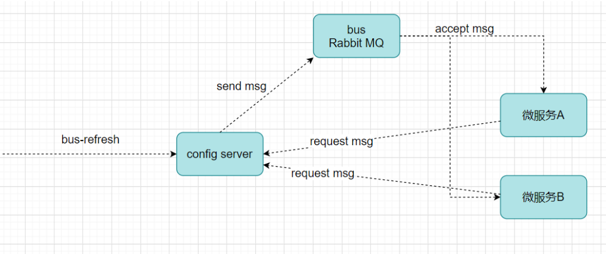

# 目录

[toc]

# 1 Spring Cloud Config 分布式配置中心

## 1.1 分布式配置中心应用场景

​		往往，我们使用配置文件管理一些配置信息，比如application.yml

​		**单体应用架构，**配置信息的管理、维护并不会显得特别麻烦，手动操作就可以，因为就一个工程；

​		**微服务架构，**因为我们的分布式集群环境中可能有很多个微服务，我们不可能一个一个去修改配置然后重启生效，在一定场景下我们还需要在运行期间动态调整配置信息，比如：根据各个微服务的负载情况，动态调整数据源连接池大小，我们希望配置内容发生变化的时候，微服务可以自动更新。

​		场景总结如下：

​		1）集中配置管理，一个微服务架构中可能有成百上千个微服务，所以集中配置管理是很重要的（一次修改、到处生效）

​		2）不同环境不同配置，比如数据源配置在不同环境（开发dev,测试test,生产prod）中是不同的

​		3）运行期间可动态调整。例如，可根据各个微服务的负载情况，动态调整数据源连接池大小等配置修改后可自动更新

​		4）如配置内容发生变化，微服务可以自动更新配置

​		那么，我们就需要对配置文件进行**集中式管理**，这也是分布式配置中心的作用。

## 1.2 Spring Cloud Config

### 1.2.1 Config简介

​		Spring Cloud Config是一个分布式配置管理方案，包含了 Server端和 Client端两个部分。


* Server 端：提供配置文件的存储、以接口的形式将配置文件的内容提供出去，通过使用@EnableConfigServer注解在 Spring boot 应用中非常简单的嵌入
* Client 端：通过接口获取配置数据并初始化自己的应用

### 1.2.2 Config分布式配置应用

​		**说明：Config Server是集中式的配置服务，用于集中管理应用程序各个环境下的配置。 默认使用Git存储配置文件内容，也可以SVN。**

​		比如，我们要对“静态化微服务或者商品微服务”的application.yml进行管理（区分开发环境（dev）、测试环境(test)、生产环境(prod)）

​		1）登录GitHub，创建项目demo-config

​		2）上传yml配置文件，命名规则如下：

​			  {application}-{profile}.yml 或者 {application}-{profile}.properties 

​			  其中，application为应用名称，profile指的是环境（用于区分开发环境，测试环境、生产环境等）

​			  示例：demo-service-page-dev.yml、demo-service-page-test.yml、demo-service-page-prod.yml

​		3）**构建Config Server统一配置中心**

​			   **新建SpringBoot工程，引入依赖坐标**（需要注册自己到Eureka）

```xml
<?xml version="1.0" encoding="UTF-8"?>
<project xmlns="http://maven.apache.org/POM/4.0.0"
         xmlns:xsi="http://www.w3.org/2001/XMLSchema-instance"
         xsi:schemaLocation="http://maven.apache.org/POM/4.0.0 http://maven.apache.org/xsd/maven-4.0.0.xsd">
    <parent>
        <artifactId>demo-parent</artifactId>
        <groupId>com.demo</groupId>
        <version>1.0-SNAPSHOT</version>
    </parent>
    <modelVersion>4.0.0</modelVersion>

    <artifactId>demo-cloud-config</artifactId>

    <dependencies>
        <!--eureka client 客户端依赖引入-->
        <dependency>
            <groupId>org.springframework.cloud</groupId>
            <artifactId>spring-cloud-starter-netflix-eureka-client</artifactId>
        </dependency>
        <!--config配置中心服务端-->
        <dependency>
            <groupId>org.springframework.cloud</groupId>
            <artifactId>spring-cloud-config-server</artifactId>
        </dependency>
    </dependencies>

</project>
```

​			**配置启动类，使用注解@EnableConfigServer开启配置中心服务器功能**

```java
package com.demo.config;

import org.springframework.boot.SpringApplication;
import org.springframework.boot.autoconfigure.SpringBootApplication;
import org.springframework.cloud.client.discovery.EnableDiscoveryClient;
import org.springframework.cloud.config.server.EnableConfigServer;


@SpringBootApplication
@EnableConfigServer // 开启配置服务器功能
@EnableDiscoveryClient
public class ConfigApplication {
    public static void main(String[] args) {
        SpringApplication.run(ConfigApplication.class, args);
    }
}

```

​          **application.yml配置**

```yaml
server:
  port: 9400
#注册到Eureka服务中心
eureka:
  client:
    service-url:
      defaultZone: http://demoCloudEurekaServerA:9200/eureka,http://demoCloudEurekaServerB:9201/eureka
  instance:
    prefer-ip-address: true
    instance-id: ${spring.cloud.client.ip-address}:${spring.application.name}:${server.port}:@project.version@
spring:
  application:
    name: demo-service-config
  cloud:
    config:
      server:
        git:
          uri: https://github.com/jetwu-do/demo-config.git  #配置git服务地址
          username: gitwu #配置git用户名
          password: 123456 #配置git密码
          search-paths:
            - demo-config
      # 读取分支
      label: master

```

​		**测试**

http://127.0.0.1:9400/master/application-dev.yml

- master：分支名称
- application-dev.yml：文件名称


4）**构建Client客户端（在已有页面静态化微服务基础上）**

案例实现：在demo-service-page微服务中动态获取config server的配置信息

​			  **已有工程中添加依赖坐标**

```xml
<dependency>
  <groupId>org.springframework.cloud</groupId>
  <artifactId>spring-cloud-config-client</artifactId>
</dependency>
```

​			**application.yml修改为bootstrap.yml配置文件**	

​			bootstrap.yml是系统级别的，优先级比application.yml高，应用启动时会检查这个配置文件，在这个配置文件中指定配置中心的服务地址，会自动拉取所有应用配置并且启用。

​		（主要是把与统一配置中心连接的配置信息放到bootstrap.yml）

​			注意：需要统一读取的配置信息，从配置中心获取

bootstrap.yml（部分）

```yaml
server:
  port: 9100   # 后期该微服务多实例，端口从9100递增（10个以内）
Spring:
  application:
    name: demo-service-page
  datasource:
    driver-class-name: com.mysql.jdbc.Driver
    url: jdbc:mysql://localhost:3306/demodb?useUnicode=true&characterEncoding=utf8&serverTimezone=UTC
    username: root
    password: 123456
  cloud:
    config:
      #config客户端配置,和ConfigServer通信，并告知ConfigServer希望获取的配置信息在哪个文件中
      name: application
      profile: dev   #后缀名称
      label: master  #分支名称
      uri: http://localhost:9400   #ConfigServer配置中心地址

```


ConfigController

```java
package com.demo.page.controller;

import org.springframework.beans.factory.annotation.Value;
import org.springframework.web.bind.annotation.RequestMapping;
import org.springframework.web.bind.annotation.RestController;

@RestController
@RequestMapping("/config")
public class ConfigClientController {

    @Value("${mysql.user}")
    private String mysqlUser;

    @Value("${person.name}")
    private String personName;

    @RequestMapping("/remote")
    public String findRemoteConfig() {
        return mysqlUser + "  " + personName;
    }

}
```


启动日志：


测试：

http://127.0.0.1:9100/config/remote


## 1.3 Config配置手动刷新

​		不用重启微服务，只需要手动的做一些其他的操作（访问一个地址/refresh）刷新，之后再访问即可

​		此时，客户端取到了配置中心的值，但当我们修改GitHub上面的值时，服务端（Config Server）能实时获取最新的值，但客户端（Config Client）读的是缓存，无法实时获取最新值。Spring Cloud已 经为我们解决了这个问题，那就是客户端使用post去触发refresh，获取最新数据。

​		1）Client客户端添加依赖springboot-starter-actuator（已添加）

​		2）Client客户端bootstrap.yml中添加配置（暴露通信端点）

```yml
management:
	endpoints:
		web:
			exposure:
				include: refresh
				
#也可以暴露所有的端口
management:
  endpoints:
    web:
      exposure:
        include: "*"
```

​	   3）Client客户端使用到配置信息的类上添加@RefreshScope	

```java
package com.demo.page.controller;

import org.springframework.beans.factory.annotation.Value;
import org.springframework.cloud.context.config.annotation.RefreshScope;
import org.springframework.web.bind.annotation.RequestMapping;
import org.springframework.web.bind.annotation.RestController;

@RestController
@RequestMapping("/config")
@RefreshScope  //手动刷新
public class ConfigClientController {

    @Value("${mysql.user}")
    private String mysqlUser;

    @Value("${person.name}")
    private String personName;

    @RequestMapping("/remote")
    public String findRemoteConfig() {
        return mysqlUser + "  " + personName;
    }

}

```

​	   4）手动向Client客户端发起POST请求，http://localhost:9100/actuator/refresh，刷新配置信息


​		**注意：手动刷新方式避免了服务重启**

​		思考：可否使用广播机制，一次通知，处处生效，方便大范围配置自动刷新？


## 1.4 Config配置自动更新

​		实现一次通知，处处生效

​		在微服务架构中，我们可以结合消息总线（Bus）实现分布式配置的自动更新（Spring Cloud Config + Spring Cloud Bus）

### 1.4.1 消息总线Bus

​		所谓消息总线Bus，即我们经常会使用MQ消息代理构建一个共用的Topic，通过这个Topic连接各个微服务实例，MQ广播的消息会被所有在注册中心的微服务实例监听和消费。**换言之就是通过一个主题连接各个微服务，打通脉络**。

​		Spring Cloud Bus（基于MQ的，支持RabbitMq/Kafka） 是Spring Cloud中的消息总线方案，Spring Cloud Config + Spring Cloud Bus 结合可以实现配置信息的自动更新。




### 1.4.2 Spring Cloud Config + Spring Cloud Bus 实现自动刷新

​		MQ消息代理，我们还选择使用RabbitMQ，ConfigServer和ConfigClient都添加都消息总线的支持以及与RabbitMq的连接信息

1）Config Server服务端和客户端添加消息总线支持

```xml
<dependency>
    <groupId>org.springframework.cloud</groupId>
    <artifactId>spring-cloud-starter-bus-amqp</artifactId>
</dependency>
```

2）Config Server和客户端添加配置

```yml
spring:
	rabbitmq:
		host: 192.169.200.128 
		port: 5672 
		username: guest 
		password: guest
```

3）Config Server微服务暴露端口

```yaml
management:
	endpoints:
		web:
			exposure:
				include: bus-refresh
				
#建议暴露所有的端口
management:
  endpoints:
    web:
      exposure:
        include: "*"
```

4）重启各个服务，更改配置之后，向配置中心服务端发送post请求，各个客户端配置即可自动刷新

http://127.0.0.1:9400/actuator/bus-refresh


5）Config Client测试

http://localhost:9100/config/remote

在广播模式下实现了一次请求，处处更新，如果我只想定向更新呢？

在发起刷新请求的时候http://localhost:9006/actuator/bus-refresh/demo-service-page:9100

即为最后面跟上要定向刷新的实例的 **服务名:端口号**即可


