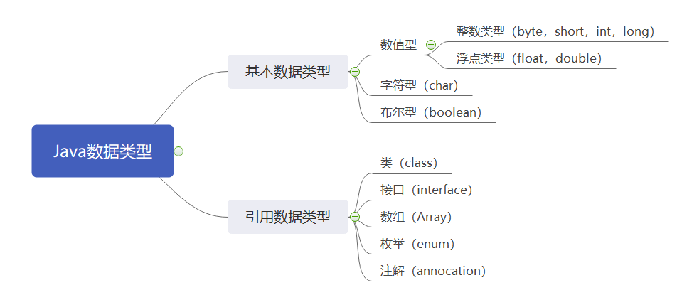
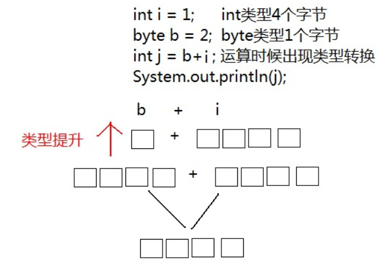
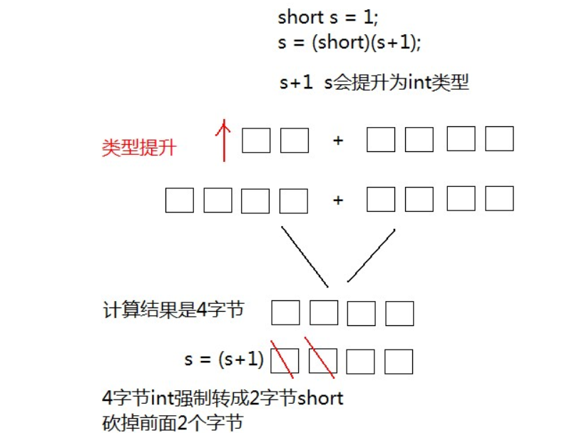
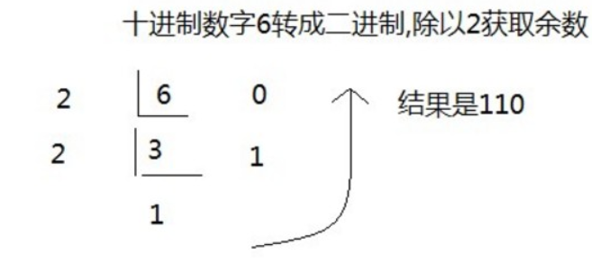
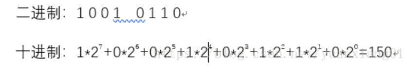
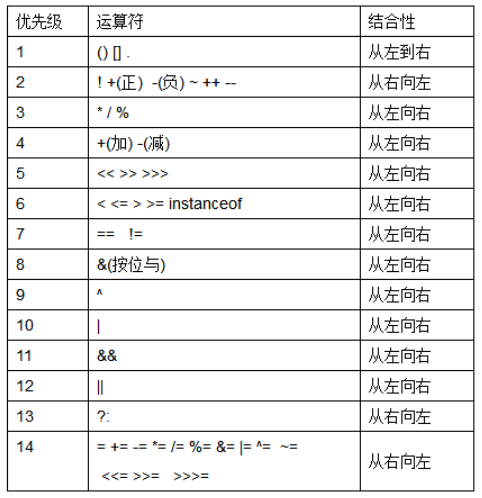

# 学习目标

```
* 掌握Java数据类型与变量的定义
* 掌握Java数据类型的转换
* 掌握常用运算符的使用
```


# 第1章 变量与数据类型

## 1.1 变量概述

* **变量：常量是固定不变的数据，那么在程序中可以变化的量称为变量。**

> 数学中，可以使用字母代替数字运算,例如 y=x+5 或者 6=x+5。
>
> 程序中，可以使用字母保存数字的方式进行运算，提高计算能力，可以解决更多的问题。比如x保存5，x也可以保存6，这样x保存的数据是可以改变的，也就是我们所讲解的变量。

Java中要求一个变量每次只能保存一个数据，必须要明确保存的数据类型。


## 1.2 数据类型

Java是一种强类型语言，为不管是常量还是变量都必提供了具体的数据类型，来表示我们声明的常量或者变量是什么类型，怎么赋值。

### 1.2.1 Java数据类型分类

Java的数据类型分为两大类：

* **基本数据类型**：包括 `整数`、`浮点数`、`字符`、`布尔`。 
* **引用数据类型**：包括 `类`、`数组`、`接口`，`枚举`，`注解`。



> **说明：**后期学习过程中，除了8种基本数据类型外，都属于引用数据类型。


### 1.2.2 基本数据类型

四类八种基本数据类型：

| 数据类型     | 关键字         | 内存占用 | 取值范围                     |
| :----------- | :------------- | :------- | :--------------------------- |
| 字节型       | byte           | 1个字节  | -128 至 127                  |
| 短整型       | short          | 2个字节  | -32768 至 32767              |
| 整型         | int（默认）    | 4个字节  | -2^31^ 至 2^31^-1            |
| 长整型       | long           | 8个字节  | -2^63^ 至 2^63^-1   19位数字 |
| 单精度浮点数 | float          | 4个字节  | 1.4013E-45 至 3.4028E+38     |
| 双精度浮点数 | double（默认） | 8个字节  | 4.9E-324 至 1.7977E+308      |
| 字符型       | char           | 2个字节  | 0 至 2^16^-1                 |
| 布尔类型     | boolean        | 1个字节  | true，false                  |

> Java中的默认类型：整数类型是`int` 、浮点类型是`double` 。
>
> e+38表示是乘以10的38次方，同样，e-45表示乘以10的负45次方。


## 1.3 变量的定义

变量定义的格式包括三个要素：`数据类型` 、 `变量名` 、 `  数据值` 。

**格式：**

```
// 声明变量并赋值
数据类型 变量名 = 数据值;
```

或者

```
// 先声明，后赋值（使用前赋值即可）
数据类型 变量名;
变量名 = 初始化值;
```

当然，如果一次要声明多个变量，且这多个变量类型一样时，也可以这样定义：

```
// 同时声明多个同类型的变量，中间用逗号分隔
数据类型 变量名1,变量名2;
数据类型 变量名1=值1,变量名2=值2;
```

**练习：**

定义所有基本数据类型的变量，代码如下：

```
public class Variable {
	public static void main(String[] args){
        //定义字节型变量
        byte b = 10;
        System.out.println(b);
        //定义短整型变量
        short s = 100;
        System.out.println(s);
        //定义整型变量
        int i = 123456;
        System.out.println(i);
        //定义长整型变量
        long l = 12345678900L;
        System.out.println(l);
        //定义单精度浮点型变量
        float f = 5.0F;
        System.out.println(f);
        //定义双精度浮点型变量
        double d = 8.0;
        System.out.println(d);
        //定义布尔型变量
        boolean flag = true;
        System.out.println(flag);
        //定义字符型变量
        char c = 'a';
        System.out.println(c);
	}
}
```

> long类型：建议数据后加L表示。
>
> float类型：数据后必须加F或者f表示。


**注意：**

* 变量名称：在同一个大括号范围内，变量名不可以重复。
* 变量赋值：定义的变量，不赋值不能使用。


# 第2章 数据类型转换

Java程序中要求参与的计算的数据，必须要保证数据类型的一致性，如果数据类型不一致将发生类型的转换。而这里的数据类型转换分为自动转换和强制转换两种。

## 2.1 自动转换

 一个`int` 类型变量和一个`byte`类型变量进行加法运算， 结果会是什么数据类型？ 

```java
int i = 1; 
byte b = 2; 
```

运算结果，变量的类型将是`int` 类型，这就是出现了数据类型的自动类型转换现象。

* **自动转换**：将`取值范围小的类型`自动提升为`取值范围大的类型` 。

```java
public static void main(String[] args) {
    int i = 1;
    byte b = 2;
  	// byte x = b + i; // 报错
    // int类型和byte类型运算，结果是int类型
    int j = b + i;
    System.out.println(j);
}
```

这里，我们可以以一个小瓶水和一个大瓶水相加为例进行说明。

**转换原理图解：**

`byte` 类型内存占有1个字节，在和`int` 类型运算时会提升为`int`类型 ，自动补充3个字节，因此计算后的结果还是`int` 类型。



同样道理，当一个`int` 类型变量和一个`double` 变量运算时，`int` 类型将会自动提升为`double` 类型进行运算。

```java
public static void main(String[] args) {
    int i = 1;
    double d = 2.5;
    //int类型和double类型运算，结果是double类型
    //int类型会提升为double类型
    double e = d+i;
    System.out.println(e);
}
```

**自动转换规则：**

范围小的类型向范围大的类型提升，`byte、short、char` 运算时直接提升为`int` 。

```
byte、short、char-->int-->long-->float-->double-->String
```

## 2.2 强制转换	

将`1.5` 赋值到`int` 类型变量会发生什么？产生编译失败，肯定无法赋值。

```java
int i = 1.5; // 编译报错
```

`double` 类型内存8个字节，`int` 类型内存4个字节。`1.5` 是`double` 类型，取值范围大于`int` 。可以理解为`double` 是8升的水壶，`int` 是4升的水壶，不能把大水壶中的水直接放进小水壶去。

想要赋值成功，只有通过强制类型转换，将`double` 类型强制转换成`int` 类型才能赋值。

* **强制类型转换**：将`取值范围大的类型`强制转换成`取值范围小的类型`。

 比较而言，自动转换是Java自动执行的，因为自动提升后不会丢失精度，出现错误；而强制转换需要我们自己判断是否手动执行，因为可能会出现精度丢失的问题。

**转换格式：**

```
数据类型 变量名 = （要转换成的数据类型）被转数据值；
```

将`1.5` 赋值到`int` 类型，代码修改为：

```
// double类型数据强制转成int类型，直接去掉小数点。
int i = (int)1.5;
```

同样道理，当一个`short`类型与`1`相加，我们知道会类型提升，但是还想给结果赋值给short类型变量，就需要强制转换。

```java
public static void main(String[] args) {
     //short类型变量，内存中2个字节
     short s = 1;
     /*
       出现编译失败
       s和1做运算的时候，1是int类型，s会被提升为int类型
       s+1后的结果是int类型，将结果在赋值会short类型时发生错误
       short内存2个字节，int类型4个字节
       必须将int强制转成short才能完成赋值
     */
     s = s + 1；//编译失败
     s = (short)(s+1);//编译成功
}
```

**转换原理图解：**



## 2.3 ASCII编码表

```
public static void main(String[] args) {
  //字符类型变量
  char c = 'a';
  int i = 1;
  //字符类型和int类型计算
  System.out.println(c+i);//输出结果是98
}
```

在计算机的内部都是二进制的0、1数据，如何让计算机可以直接识别人类文字的问题呢？就产生出了编码表的概念。

* **编码表**：就是将人类的文字和一个十进制数进行对应起来组成一张表格。
* **存储字符时**：需要查找ASC码表,找到字符对应的数字,将数字转换为二进制数存放到计算机中
* **使用字符时**：将对应的二进制数转换为十进制 找到ASC表中对应的字符显示出来。
  人们就规定：

| 字符 | 数值 |
| :--: | :--: |
|  0   |  48  |
|  9   |  57  |
|  A   |  65  |
|  Z   |  90  |
|  a   |  97  |
|  z   | 122  |

- 将所有的英文字母，数字，符号都和十进制进行了对应，因此产生了世界上第一张编码表ASCII（                     			        

American Standard Code for Information Interchange 美国标准信息交换码）。

> 说明：
>
> 在char类型和int类型计算的过程中，char类型的字符先查询编码表，得到97，再和1求和，结果为98。char类型提升为了int类型。char类型内存2个字节，int类型内存4个字节。


## 2.4 常量和变量的运算

下面的程序有问题吗？

```java
public static void main(String[] args){
  byte b1=1;
  byte b2=2;
  byte b3=1 + 2;
  byte b4=b1 + b2;
  System.out.println(b3);
  System.out.println(b4);
}
```

分析：`b3 = 1 + 2` ，`1 `和 `2 ` 是常量，为固定不变的数据，在编译的时候（编译器javac），已经确定了`1+2` 的结果并没有超过byte类型的取值范围，可以赋值给变量`b3` ，因此`b3=1 + 2`是正确的。

反之，`b4 = b2 + b3`，`b2` 和 `b3` 是变量，变量的值是可能变化的，在编译的时候，编译器javac不确定b2+b3的结果是什么，因此会将结果以int类型进行处理，所以int类型不能赋值给byte类型，因此编译失败。


# 第3章 运算符

- **运算符&表达式**

  - **运算符：**对常量或者变量进行操作的符号；
  - **表达式：**用运算符把常量或者变量连接起来符合java语法的式子就可以称为表达式。

  

- 不同运算符连接的表达式体现的是不同类型的表达式。
- **举例说明：**
  - +：是运算符，并且是算术运算符（类比数学中的算术运算）。
  - a + b：是表达式，由于+是算术运算符，所以这个表达式叫算术表达式。


根据具体功能以及运算符语法的不同，Java运算符分为几类，下面就分别说明。

## 3.1 算数运算符

### 3.1.1 算术运算符介绍

| 算数运算符 | 作用                         | 例子(a=11,b=2)        |
| ---------- | ---------------------------- | --------------------- |
| `+`        | 加法运算，字符串连接运算     | 13=a+b;               |
| `-`        | 减法运算                     | 9=a-b;                |
| `*`        | 乘法运算                     | 22=a*b;               |
| `/`        | 除法运算，取整除结果         | 5=a/b;                |
| `%`        | 取模运算，两个数字相除取余数 | 1=a%b;                |
| ++         | 自增: 操作数的值增加1        | a++或++a，a的值都为12 |
| --         | 自减: 操作数的值减少1        | a--或--a，a的值都为10 |

Java中，整数使用以上运算符，无论怎么计算，也不会得到小数。

```
public static void main(String[] args) {
  	int i = 123456;
  	System.out.println(i/1000*1000);//计算结果是123000
}
```

### 3.1.2 特别说明

**1、+运算符**

- `+` 符号在遇到数字运算的时候，表示**数学相加**的意思。比如1+2的结果是3，相加含义；
- `+` 符号在遇到字符串的时候，表示**连接、拼接**的含义。比如，"a"+"b"的结果是“ab”，连接含义。

```
public static void main(String[] args){
 	System.out.println("5+5="+5+5);//输出5+5=55
}
```


**2、++与--运算符**

- `++`  **运算，变量自己增长1**。反之，`--` **运算，变量自己减少1**，用法与`++` 一致。

- 独立运算：

  - 变量在独立运算时，`前++`和`后++`没有区别 。
  - 变量`前++`   ：例如 `++i` 。
  - 变量`后++`   ：例如 `i++` 。

- 混合运算：

  - 和其他变量放在一起，`前++`和`后++`就产生了不同。

  - 变量`前++` ：变量a自己加1，将加1后的结果赋值给b，也就是说a先计算。a和b的结果都是2。

    ```
    public static void main(String[] args) {
        int a = 1;
        int b = ++a;
        System.out.println(a);//计算结果是2
        System.out.println(b);//计算结果是2
    }
    ```

  - 变量`后++` ：变量a先把自己的值1，赋值给变量b，此时变量b的值就是1，变量a自己再加1。a的结果是2，b的结果是1。

    ```java
    public static void main(String[] args) {
        int a = 1;
        int b = a++;
        System.out.println(a);//计算结果是2
        System.out.println(b);//计算结果是1
    }
    ```


前++，前--  先计算，再赋值；

后++ ，后--  先赋值，再计算

## 3.2 赋值运算符

| 符号 | 作用       | 说明                          |
| ---- | ---------- | ----------------------------- |
| `=`  | 赋值       | a=10，将10赋值给变量a         |
| `+=` | 加后赋值   | a+=b，将a+b的值给a     a=a+b  |
| `-=` | 减后赋值   | a-=b，将a-b的值给a      a=a-b |
| `*=` | 乘后赋值   | a*=b，将a×b的值给a            |
| `/=` | 除后赋值   | a/=b，将a÷b的商给a    a=a/b   |
| `%=` | 取余后赋值 | a%=b，将a÷b的余数给a   a=a%b  |

- 赋值运算符，就是将符号右边的值，赋给左边的变量。

```java
public static void main(String[] args){
    int i = 1;
    i+=1;
   // i=i+1  ==>   1+1 ==>2     i=2
    System.out.println(i); //输出结果是2 
}
```

- +=符号的扩展

下面的程序有问题吗？

```java
public static void main(String[] args){
  short s = 1;
  s+=1;
  System.out.println(s);
}
```

**分析：** `s += 1` 逻辑上看作是`s = s + 1` 计算结果被提升为int类型，再向short类型赋值时发生错误，因为不能将取值范围大的类型赋值到取值范围小的类型。但是，`s=s+1进行两次运算`，`+=` 是一个运算符，只运算一次，并带有强制转换的特点，也就是说`s += 1` 就是`s = (short)(s + 1)`，因此程序没有问题编译通过，运行结果是2。

因此，这里要说一点的是，赋值运算符默认进行了强制类型转换。

## 3.3 关系运算符

| 符号  | 说明                                                    |
| ----- | ------------------------------------------------------- |
| `==`  | a==b，判断a和b的值是否相等，成立为true，不成立为false   |
| `>`   | a>b，判断a是否大于b，成立为true，不成立为false          |
| `>=`  | a>=b，判断a是否大于或者等于b，成立为true，不成立为false |
| `<`   | a<b，判断a是否小于b，成立为true，不成立为false          |
| `<=`  | a<=b，判断a是否小于或者等于b，成立为true，不成立为false |
| `！=` | a!=b，判断a和b的值是否不相等，成立为true，不成立为false |

- 关系运算符，是两个数据之间进行比较的运算，运算结果都是布尔值`true`或者`false` 。

```java
public static void main(String[] args) {
    System.out.println(1==1);//true
    System.out.println(1<2);//true
    System.out.println(2>3);//false
    System.out.println(2<=3);//true
    System.out.println(2>=3);//false
    System.out.println(2!=3);//true
}
```

## 3.4 逻辑运算符

逻辑运算符把各个运算的关系表达式连接起来组成一个复杂的逻辑表达式，以判断程序中的表达式是否成立，判断
的结果是 true 或 false。

| 符号 | 作用     | 说明                                                         |
| ---- | -------- | ------------------------------------------------------------ |
| &    | 逻辑与   | a&b，a和b都是true，结果为true，否则为false    并且关系       |
| \|   | 逻辑或   | a\|b，a和b都是false，结果为false，否则为true    或者关系     |
| ^    | 逻辑异或 | a^b，a和b结果不同为true，相同为false                         |
| ！   | 逻辑非   | ！a，结果和a的结果正好相反                                   |
| &&   | 短路与   | 1. 两边都是true，结果是true  <br />2. 一边是false，结果是false  <br />短路与特点：符号左边是false，右边不再运算 |
| \|\| | 短路或   | 1. 两边都是false，结果是false  <br />2. 一边是true，结果是true  <br />短路或特点： 符号左边是true，右边不再运算 |

**示例：**

```java
public static void main(String[] args)  { 
    //定义变量
    int i = 10;
    int j = 20;
    int k = 30;
    //& “与”，并且的关系，只要表达式中有一个值为false，结果即为false
    System.out.println((i > j) & (i > k)); //false & false,输出false
    System.out.println((i < j) & (i > k)); //true & false,输出false
    System.out.println((i > j) & (i < k)); //false & true,输出false
    System.out.println((i < j) & (i < k)); //true & true,输出true
    System.out.println("........");
    //| “或”，或者的关系，只要表达式中有一个值为true，结果即为true
    System.out.println((i > j) | (i > k)); //false | false,输出false
    System.out.println((i < j) | (i > k)); //true | false,输出true
    System.out.println((i > j) | (i < k)); //false | true,输出true
    System.out.println((i < j) | (i < k)); //true | true,输出true
    System.out.println("........");
    //^ “异或”，相同为false，不同为true
    System.out.println((i > j) ^ (i > k)); //false ^ false,输出false
    System.out.println((i < j) ^ (i > k)); //true ^ false,输出true
    System.out.println((i > j) ^ (i < k)); //false ^ true,输出true
    System.out.println((i < j) ^ (i < k)); //true ^ true,输出false
    System.out.println("........");
    //! “非”，取反
    System.out.println((i > j)); //false
    System.out.println(!(i > j)); //!false，,输出true
}
```

- 逻辑运算符，是用来连接两个布尔类型结果的运算符，运算结果都是布尔值`true`或者`false`

```java
public static void main(String[] args)  {
   	int x = 3;
    int y = 4;
    System.out.println((x++ > 4) & (y++ > 5)); // 两个表达都会运算
    System.out.println(x); // 4
    System.out.println(y); // 5
    System.out.println((x++ > 4) && (y++ > 5)); // 左边结果为false，右边不参与运算
    System.out.println(x); // 4
    System.out.println(y); // 4
}
```


## 3.5 三元运算符

三元运算符也叫三目运算符。

* 三元运算符格式：

```java
 数据类型 变量名 = 布尔类型表达式？结果1：结果2
```

- 三元运算符计算方式：
  - 布尔类型表达式结果是true，三元运算符整体结果为结果1，赋值给变量。
  - 布尔类型表达式结果是false，三元运算符整体结果为结果2，赋值给变量。

```java
public static void main(String[] args) {
    int a = 20；
    int b = 10；
    int max = (a>b ? a : b);//max赋值为 a，b中较大的值
    System.out.println(max);//20
    int min = (a<b ? a : b);//min赋值为 a，b中较小的值
    System.out.println(min);//10
}
```


## 3.6 位运算符

### 3.6.1 进制及转换

计算机中的数据不同于人们生活中的数据，人们生活采用十进制数，而计算机中全部采用二进制数表示，它只包含0、1两个数，逢二进一，1+1=10。每一个0或者每一个1，叫做一个bit（比特）。

下面了解一下十进制和二进制数据之间的转换计算。

**1、 十进制转二进制**

> **十进制整数转换成二进制采用“除2倒取余”，十进制小数转换成二进制小数采用“乘2取整”。**

这里，我们以常用的整数进制转换进行说明：



十进制转八进制、十六进制的思路与十进制转二进制一样。


 **2、二进制转十进制**

> **二进制转十进制采用按权相加法**




二进制转换成八进制的方法是，**取三合一法**，即从二进制的小数点为分界点，向左（或向右）每三位取成一位。

二进制转换成十六进制的方法是，**取四合一法**，即从二进制的小数点为分界点，向左（或向右）每四位取成一位。


更多转换细节，可以查阅一些资料，参考地址：https://blog.csdn.net/yuanxiang01/article/details/82503568


另外介绍一下，快速进制转换器：https://www.sojson.com/hexconvert/10to8.html


### 3.6.2 计算机底层存储运算科普

**参考：**https://blog.csdn.net/afsvsv/article/details/94553228

**科普：**这里，我们对计算机底层数据存储及相关知识科普一下，以后面试有可能遇到。

计算机中是以二进制补码进行存储的，正数的原码、反码、补码都是一样，负数的补码是原码的反码再加1，这样可以减法运算可以使用加法器实现，**符号位也参与运算**（**二进制的最高位为符号位0为正，1为负，以8位来算，最高位为符号位，其余7位表示数值**），**取反码与符号位无关。**

**基础定义:**

```
原码：

　　　　* 就是二进制定点表示法，即最高位为符号位，“0”表示正，“1”表示负，其余位表示数值的大小。

　　　　* 通过一个字节,也就是8个二进制位表示+7和-7

　　　　* 0(符号位) 0000111

　　　　* 1(符号位) 0000111

反码：

　　　　* 正数的反码与其原码相同；负数的反码是对其原码逐位取反，但符号位不变。

补码：

　　　　* 正数的补码与其原码相同；负数的补码是在其反码的末位加1。
```

>  **小贴士：**
>
> 计算机中的源码，是十进制数转换为计算机0、1表示的原本真实字节码数据；而反码和补码的出现则是为了负数的计算而生的。所以，计算机底层参与运算的都是补码形式。


### 3.6.3 位运算符说明

**说明：**位运算符指的是两个数之间的位运算，运算过程中都转换为字节类型参与运算。比如：数字3转换为字节数为0000 0011。

| 符号 | 作用       | 说明                                                         |
| ---- | ---------- | ------------------------------------------------------------ |
| &    | 按位与     | 两数同位对比，有0则为0                                       |
| \|   | 按位或     | 两数同位对比，有1则为1                                       |
| ^    | 按位异或   | 两数同位对比，不同为1，相同为0                               |
| ~    | 按位取反   | 针对一个数，操作数的每一位都取反                             |
| <<   | 按位左移   | 针对一个数，操作数的每位向左移动指定位数，最高位丢弃，尾部空位补0（相当于乘以2的n次方） |
| \>>  | 按位右移   | 针对一个数，操作数的每位向右移动指定位数，头部空位补符号位数，移除部分丢弃 |
| \>>> | 无符号右移 | 针对一个数，操作数的每位向右移动指定位数，无论符号数头部都补0，移除部分丢弃 |

**练习：**

需求：有两个int类型变量a=10;b=20，要求使用多种方式实现这两个变量数值的交换。

```java
public static void main(String[] args) {
    // 方法1:引入第三方变量进行互换(适用于整型/字符串型)
    int temp = a;
    a = b;
    b = temp;
    System.out.println(a + "和" + b);
    // 方法2：求和再减
    a = a + b;
    b = a - b;
    a = a - b
    System.out.println(a + "和" + b);
    // 使用位运算符	
	a = a ^ b;
    b = a ^ b;
   	a = a ^ b;
   	System.out.println(a + "和" + b);
}
```


## 3.7 运算符的优先级

不同运算符可以相互组合数据形成一个复杂的表达式，表达式的具体执行先后运行就需要根据运算符的优先级判断。



> **小贴士：**
>
> 尽量不要写特别复杂的表达式，别人看着也不舒服；另外可以结合小括号()来控制执行顺序。