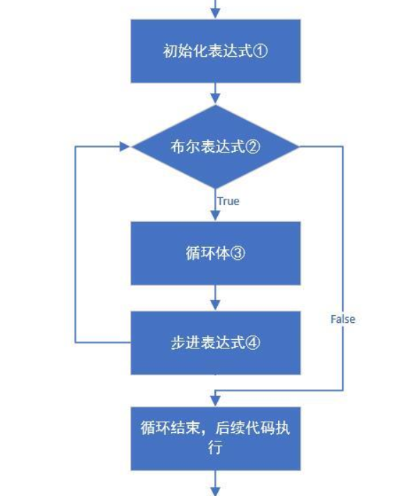
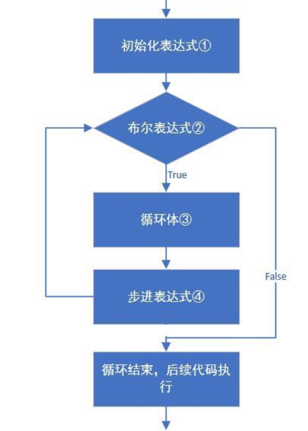
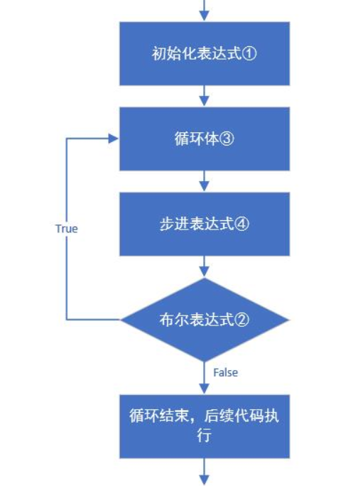

# 学习目标

```
掌握for、while、do...while三种循环语句结构、流程及使用
掌握break、continue关键字的使用
掌握嵌套循环的使用及跳出
掌握随机数Random类的使用
```


# 第1章 循环语句

## 1.1 循环概述

在实际开发中，可能有一个功能，要我们判断两个数据的大小，或者是判断当前是哪个季节，等等类似需求，我们都可以使用前面刚学的if和switch条件语句进行控制处理。

但也有可能遇到下面的需求：要求计算1~100相加的总和，或者更直白简单一点，要求我们打印1000行helloword。这对这种需要重复多次的工作，就需要使用Java的另一个循环语句来处理了。


循环语句可以在满足循环条件的情况下，反复执行某一段代码，这段被重复执行的代码被称为循环体语句，当反复执行这个循环体时，需要在合适的时候把循环判断条件修改为false，从而结束循环，否则循环将一直执行下去，形成死循环。


**Java循环语句分类：**

- for循环
- while循环
- do...while循环
- 嵌套循环


## 1.2 for循环

### **1.2.1 语法格式**

```
for(初始化表达式①; 布尔表达式②; 步进表达式④){
		循环体③
}
```

**说明：**

- 初始化语句： 用于表示循环开启时的起始状态，简单说就是循环开始的时候什么样
- 条件判断语句：用于表示循环反复执行的条件，简单说就是判断循环是否能一直执行下去
- 循环体语句： 用于表示循环反复执行的内容，简单说就是循环反复执行的事情
- 条件控制语句：用于表示循环执行中每次变化的内容，简单说就是控制循环是否能执行下去

### **1.2.2 执行流程**



- 执行顺序：①②③④>②③④>②③④…②不满足为止。
- ①负责完成循环变量初始化
- ②负责判断是否满足循环条件，不满足则跳出循环
- ③具体执行的语句
- ④循环后，循环条件所涉及变量的变化情况


### 1.2.3 练习

**1、在控制台输出1-5和5-1的数据**

```java
public static void main(String[] args) {
    //需求：输出数据1-5
    for(int i=1; i<=5; i++) {
    	System.out.println(i);
    }
    System.out.println("--------");
    //需求：输出数据5-1
    for(int i=5; i>=1; i--) {
   		System.out.println(i);
    }
}
```


**2、求1~100之间的数据和，并把求和结果在控制台输出**

```java
public static void main(String[] args) {
    //求和的最终结果必须保存起来，需要定义一个变量，用于保存求和的结果，初始值为0
    int sum = 0;
    //从1开始到100结束的数据，使用循环结构完成
    /*
        sum += i; sum = sum + i;
        第一次：sum = sum + i = 0 + 1 = 1;
        第二次：sum = sum + i = 1 + 2 = 3;
        第三次：sum = sum + i = 3 + 3 = 6;
        第四次：sum = sum + i = 6 + 4 = 10;
        第五次：sum = sum + i = 10 + 5 = 15;
        。。。
        */
    for(int i=1; i<=100; i++) {
        //将反复进行的事情写入循环结构内部
        // 此处反复进行的事情是将数据 i 加到用于保存最终求和的变量 sum 中
        sum += i;        
    }
    System.out.println(sum);
}
```

- **本题要点**

  - 今后遇到的需求中，如果带有求和二字，请立即联想到求和变量；

  - 求和变量的定义位置，必须在循环外部，如果在循环内部则计算出的数据将是错误的。


**3、在控制台输出所有的“水仙花数”**

- 解释：什么是水仙花数？
  - 水仙花数，指的是一个三位数，个位、十位、百位的数字立方和等于原数
  - 例如 `153 3*3*3 + 5*5*5 + 1*1*1 = 153`
- 思路：
  - 获取所有的三位数，准备进行筛选，最小的三位数为100，最大的三位数为999，使用for循环获取
  - 获取每一个三位数的个位，十位，百位，做if语句判断是否是水仙花数

```java
public static void main(String[] args) {
    //输出所有的水仙花数必然要使用到循环，遍历所有的三位数，三位数从100开始，到999结束
    for(int i=100; i<1000; i++) {
        //在计算之前获取三位数中每个位上的值
        int ge = i%10;    
        int shi = i/10%10;
        int bai = i/10/10%10;
        //判定条件是将三位数中的每个数值取出来，计算立方和后与原始数字比较是否相等
        if(ge*ge*ge + shi*shi*shi + bai*bai*bai == i) {
        	//输出满足条件的数字就是水仙花数
        	System.out.println(i);
        }        
    }    
}
```


## 1.3 while循环

### 1.3.1 语法格式

```
初始化表达式①
while(布尔表达式②){
    循环体③
    步进表达式④
}
```


### 1.3.2 执行流程



- 执行顺序：①②③④>②③④>②③④…②不满足为止。
- ①负责完成循环变量初始化。
- ②负责判断是否满足循环条件，不满足则跳出循环。
- ③具体执行的语句。
- ④循环后，循环变量的变化情况。


### 1.3.3 练习

**1、珠穆朗玛峰高度**

- 需求：世界最高山峰是珠穆朗玛峰(8844.43米=8844430毫米)，假如我有一张足够大的纸，它的厚度是0.1毫米。请问，我折叠多少次，可以折成珠穆朗玛峰的高度?

- 思路：
  - 定义计数器变量，准备用于统计次数
  - 定义纸张的厚度，和珠穆朗玛峰的高度，注意单位换算
  - 编写while循环的判断条件，当纸张厚度小于等于珠穆朗玛峰的高度，说明循环可以继续，循环内部纸张*=2
  - 循环中每一次折完，计数器增长一次，循环结束后打印计数器

```java
 public static void main(String[] args) {
		//定义一个计数器，初始值为0
		int count = 0;		
		//定义纸张厚度
		double paper = 0.1;		
		//定义珠穆朗玛峰的高度
		int zf = 8844430;		
		//因为要反复折叠，所以要使用循环，但是不知道折叠多少次，这种情况下更适合使用while循环
		//折叠的过程中当纸张厚度大于珠峰就停止了，因此继续执行的要求是纸张厚度小于珠峰高度
		while(paper <= zf) {
			//循环的执行过程中每次纸张折叠，纸张的厚度要加倍
			paper *= 2;			
			//在循环中执行累加，对应折叠了多少次
			count++;
		}		
		//打印计数器的值
		System.out.println("需要折叠：" + count + "次");
}
```


## 1.4 do...while循环

### 1.4.1 语法格式

```
初始化表达式①
do{
    循环体③
    步进表达式④
}while(布尔表达式②);
```


### 1.4.2 执行流程



- 执行顺序：①③④>②③④>②③④…②不满足为止。
- ①负责完成循环变量初始化。
- ②负责判断是否满足循环条件，不满足则跳出循环。
- ③具体执行的语句
- ④循环后，循环变量的变化情况


### 1.4.3 练习

**1、在控制台输出10次HelloWorld**

```java
public static void main(String[] args) {
    int x=1;
    do {
      System.out.println("helloworld");
      x++;
    }while(x<=10);
}
```

do...while循环的特点：无条件执行一次循环体，即使我们将循环条件直接写成false，也依然会循环一次。这样的循环具有一定的风险性，因此初学者不建议使用do...while循环。

```java
public static void main(String[] args){
    do{
      	System.out.println("无条件执行一次");
    }while(false);
}
```


## 1.5 三种循环语句的总结

- 三种循环的区别

  - for循环和while循环先判断条件是否成立，然后决定是否执行循环体（先判断后执行）
  - do...while循环先执行一次循环体，然后判断条件是否成立，是否继续执行循环体（先执行后判断）

- for循环和while的区别

  - for循环用在循环次数已知的情况下，可以控制遍历次数；

  - while和do...while循环还可以用在循环次数未知的情况下。

    

- 三种循环的区别总结

  1、建议使用的顺序：for，while，do-while
  2、循环次数确定的话，建议使用for，循环次数不确定建议使用while
  3、do-while循环来讲的话,至少执行一次


## 1.6 跳出语句

在使用循环语句过程中可能有下面一个场景，我们想在一个班级中循环查找每一个学生，找到学生名字叫“张三”的人（假如班级没有重名的）。

如果用之前的循环遍历方法，会循环每一个学生，对比一下名字。有一个问题在于，比如说有100个学生，刚刚第3个就找到了，有必要继续查找下去吗？

因此，类似需求就要我们控制一下，在循环结构中，某个点跳出当前语句。

**跳出语句关键字：**

- break
- continue


### 1.6.1 break

**1、使用场景**

-  在选择结构switch语句中
-  在循环语句中

**2、作用**

- 跳出当前整个循环语句。

### 1.6.2 continue

**1、使用场景**

- 循环语句中

**2、作用**

- 结束本次循环，进入下一次循环。

  

**练习：**观察以下代码的执行结果，分析break与 continue的作用

```
public static void main(String[] args) {
    for (int i = 1; i<=10; i++) {
       
        if(i % 3 == 0){
          //分别单独打开注释执行，看执行结果
          //break;  
          //continue; 
        }
        System.out.println("i= "+i);
    }
}
```


# 第2章 循环语句扩展

## 2.1 死循环

- **死循环：**也就是循环中的条件永远为true，死循环的是永不结束的循环。例如：while(true){}。

在后期的开发中，会出现使用死循环的场景，例如：我们需要读取用户输入的输入，但是用户输入多少数据我们并不清楚，也只能使用死循环，当用户不想输入数据了，就可以结束循环了，如何去结束一个死循环呢，就需要使用到跳出语句了。

- 死循环（无限循环）的三种格式

  - for(;;){}
  - while(true){}
  - do {} while(true);

  

## 2.2 变异循环

在前面介绍for循环时，介绍的是标准语法的for循环：

```
for(初始化表达式①; 布尔表达式②; 步进表达式④){
		循环体③
}
```

除此之外，for循环还有一些变异语法：

```
初始化表达式①
for(; 布尔表达式②; ){
		循环体③
		步进表达式④
}
```

也就是说，可以把for循环的初始化表达式可以放在for循环语句之前，作为一个全局变量；步进表达式④可以放在for循环语句大括号内{}。

**示例如下：**

```java
	public static void main(String[] args) {
	    //需求：输出数据1-5
		int i=1;
	    for(; i<=5;) {
	    	System.out.println(i);
	    	i++;
	    }
	}
```

另外，在for循环中的初始化表示和布局表达式支持同时声明多个。

```java
public static void main(String[] args) {
    for(int i=0,j=5; i<=5&&j>3;i++,j--) {
    	System.out.println("i= "+i+",j= "+j);
    }
}
```


## 2.3 嵌套循环

### 2.3.1 嵌套循环使用

**所谓嵌套循环**，是指一个循环的循环体是另一个循环。比如for循环里面还有一个for循环，就是嵌套循环。总共的循环次数=外循环次数*内循环次数。

**嵌套循环格式：**	

```
for(初始化表达式①; 循环条件②; 步进表达式⑦) {
    for(初始化表达式③; 循环条件④; 步进表达式⑥) {
      	执行语句⑤;
    }
}
```

**嵌套循环执行流程：**

- 执行顺序：①②③④⑤⑥>④⑤⑥>⑦②③④⑤⑥>④⑤⑥

- 外循环一次，内循环多次（一圈）。

- 例如：日历中 年与月的关系，时钟中 分与秒的关系

  - 如 2020年至2023年，一共3年，每年12个月。其中，年份看成外循环，月份看成内循环。

**练习**：使用嵌套循环，打印2021年至2023年月份，格式：xxxx年x月。

```java
public static void main(String[] args) {
    //打印2020年至2023年月份
    //年份是外循环，3年；月份是内循环，12月
    for (int i = 2020; i <= 2023; i++) {
        for (int j = 1; j <= 12; j++) {
            //不换行打印星号
            System.out.print(i + "年" + j + "月 ");
        }
        //内循环打印12个月后，需要一次换行
        System.out.println();
    }
}
```


**案例：**打印一个九九乘法表。

```java
	public static void main(String[] args) {
	    //外层循环控制行
	    for (int i = 1; i <= 9; i++) {
	    	// 内层循环控制列
	        for (int j = 1; j <= i; j++) {
	            //不换行\t表示制表符
	            System.out.print(i + "*" + j + "="+i*j+"\t");
	        }
	        // 需要一次换行
	        System.out.println();
	    }
	}
```


### 2.3.2 嵌套循环跳出

在前面小节介绍单个循环的跳出时使用到了break和continue两个关键字，假如在嵌套循环中，这两个关键字是否生效，同时，如果要跳出外层循环怎么办呢？

针对于嵌套循环中，想要跳出指定的外层循环，使用方式如下：

```
别名: for(初始化表达式①; 循环条件②; 步进表达式⑦) {
    for(初始化表达式③; 循环条件④; 步进表达式⑥) {
      	执行语句⑤;
      //	break 别名;
      	continue 别名;
    }
}
```

如上所示，break和continue默认跳出的是当前所在循环语句，在嵌套循环中，如果要跳出外层的某个循环，需要先对外层循环指定别名，然后在break 和continu后面跟上跳出循环的别名即可。

**示例：**

```java
	public static void main(String[] args) {
	    //外层循环控制行
	   a: for (int i = 1; i <= 9; i++) {
	    	// 内层循环控制列
	        for (int j = 1; j <= i; j++) {
	        	if(j>=5) {
	        		break a;
	        	}
	            //不换行\t表示制表符
	            System.out.print(i + "*" + j + "="+i*j+"\t");
	        }
	        // 需要一次换行
	        System.out.println();
	    }
	}
```


# 第3章 随机数

## 3.1 Random介绍

- **概述：**

  - Random类似Scanner，也是Java提供好的API，内部提供了产生随机数的功能
  - API后续课程详细讲解，现在可以简单理解为Java已经写好的代码

- **使用步骤：**

  1. 导入包

     import java.util.Random;

  2. 创建对象

     Random r = new Random();

  3. 产生随机数

     int num = r.nextInt(10);   

     解释： 10代表的是一个范围，如果括号写10，产生的随机数就是0(包括)-9(包括)，括号写20，参数的随机数则是0(包括)-19(包括)

- 使用Random类，完成生成3个10以内的随机整数的操作，代码如下：

```java
//1. 导包
import java.util.Random;
public class RandomDemo1 {
  	public static void main(String[] args) {
        //2. 创建随机数对象
        Random r = new Random();

        for(int i = 0; i < 3; i++){
            //3. 随机生成一个数据
            int number = r.nextInt(10);
            //4. 输出数据
            System.out.println("number:"+ number);
        }		
    }
}
```


## 3.2 Random练习

- **需求：**程序自动生成一个1-100之间的数字，使用程序实现猜出这个数字是多少？49

- **效果：**
  - 如果猜的数字比真实数字大，提示你猜的数据大了   
  - 如果猜的数字比真实数字小，提示你猜的数据小了
  - 如果猜的数字与真实数字相等，提示恭喜你猜中了 

- **代码实现**

```java
import java.util.Random;
import java.util.Scanner;
public class RandomDemo2 {
    public static void main(String[] args) {
        //要完成猜数字的游戏，首先需要有一个要猜的数字，使用随机数生成该数字，范围1到100
        Random r = new Random();
        int number = r.nextInt(100) + 1;
        while(true) {
            //使用程序实现猜数字，每次均要输入猜测的数字值，需要使用键盘录入实现
            Scanner sc = new Scanner(System.in);
            System.out.println("请输入你要猜的数字：");
            int guessNumber = sc.nextInt();
            //比较输入的数字和系统产生的数据，需要使用分支语句。
            //这里使用if..else..if..格式，根据不同情况进行猜测结果显示
            if(guessNumber > number) {
            	System.out.println("你猜的数字" + guessNumber + "大了");
            } else if(guessNumber < number) {
            	System.out.println("你猜的数字" + guessNumber + "小了");
            } else {
            	System.out.println("恭喜你猜中了");
            	break;
            }
        }
    }
}
```


**扩展：**

关于nextInt(100)方法中具体数字的确定：

13---21  nextInt(8)+13

37~79  包含头不包含尾；nextInt(m-n)+n

37~79  包含头也包含尾；nextInt(m-n+1)+n


**总结：**n~m之间的数字（包括n，不包括m）， nextInt(m-n)+n。

**注意：**包含数的时候还要加1。


**更多相关练习题：**https://www.doc88.com/p-497273660442.html，有些可能有问题。