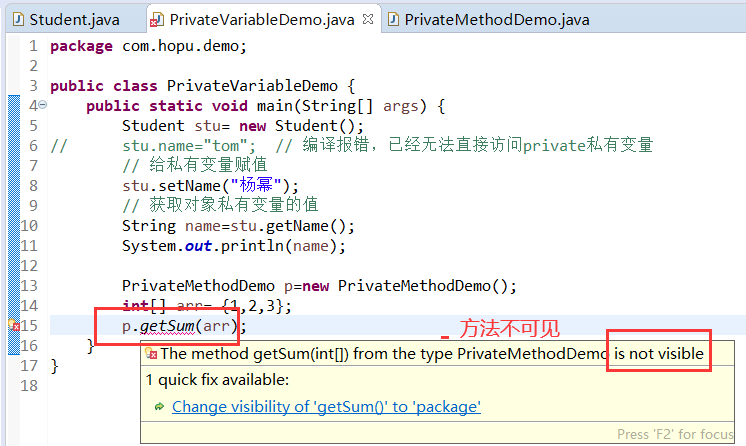
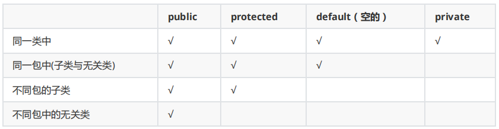
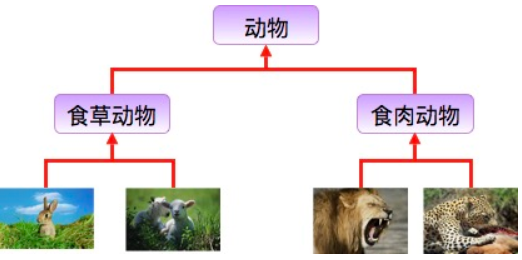
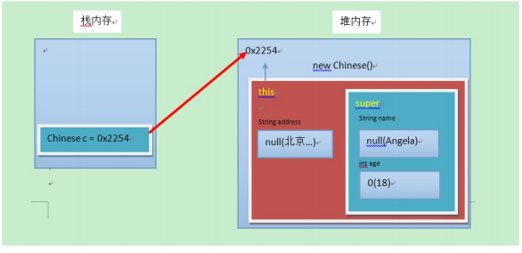

# 学习目标

```
1、理解Java封装的意义
2、掌握封装的使用
3、掌握访问权限修饰符
4、掌握Java继承的使用及注意事项
5、掌握super、final关键字
```


# 第1章 封装

Java语言有三大特性：封装、继承、多态。

- 封装：主要是将类中的部分代码实现细节隐藏、封装起来，不直接对外提供访问；
- 继承：主要体现的父子类的关系上，提高了软件的可重用性和可扩展性；
- 多态：包括编译时多态和运行时多态，通过调用不同参数或名称的方法来决定父类对象动态调用哪个子类方法，增强了代码的灵活度。

```
Animal d= new Animal();

Cat m= new Cat();

Animal dm= new Cat();

Animal dg= new Dog();

dm.work(); 

dg.work();
```


## 1.1 封装概述

**介绍：**

面向对象编程语言是对客观世界的模拟，客观世界里成员变量都是隐藏在对象内部的，外界无法直接操作和修改。封装可以被认为是一个保护屏障，防止该类的代码和数据被其他类随意访问。要访问该类的数据，必须通过指定的方式。适当的封装可以让代码更容易理解与维护，也加强了代码的安全性。

**原则：**

​	将**内部细节隐藏**起来，若需要访问某个成员，**提供公共方法**对其访问或者是只允许内部访问。

**封装的优点：**

- 良好的封装能够减少耦合。
- 类内部的结构可以自由修改。
- 可以对类成员进行更精确的控制。
- 隐藏信息，实现细节。

**封装基本使用：**

- 使用 `private` 关键字来修饰类的成员（成员变量和成员方法）以及类。
- 对需要访问的成员变量，提供对应的一对public的 getXxx方法 、setXxx 方法。
-  `private`修饰的成员方法，只允许本类中的其他方法调用；
-  `private`修饰的类，只能作为内部类使用（内部类后续详解）。

**说明：**

- private是一个权限修饰符，代表最小权限（其他权限修饰符包括public、protected、default、private），只能在同一个类下访问。


## 1.2 封装成员变量

在没有权限修饰符修饰的成员变量，默认情况下可以被外界随意访问，一旦使用private私有权限修饰符修饰，成员变量就不会被外界随意访问，同时可以提供对应的`getXxx`方法 、`setXxx` 方法来控制内部逻辑代码。

**使用格式：**

```java
private 数据类型 变量名;
// 同时提供成员变量的getXxx、setXxx方法
```

**操作演示：**

1. 使用 `private` 修饰成员变量，代码如下：

```java
public class Student {
  private String name;
  private int age;
}
```

2. 提供 `getXxx`方法 / `setXxx` 方法（快捷键【Alt+Shift+S】），可以来控制访问成员变量的方式，代码如下：

```java
public class Student {
	// 使用private封装成员变量
	private String name;
	private int age;
	
	// 提供对应的getXxx`方法 / `setXxx` 方法
	public String getName() {
		return name;
	}
	public void setName(String name) {
		this.name = name;
	}
	public int getAge() {
		return age;
	}
	public void setAge(int age) {
		this.age = age;
	}
}
```

上面的`getXxx`方法 / `setXxx` 方法只是将原本直接暴露的成员变量转用其他方法访问而已，而真正的控制的话可以在`getXxx`方法 / `setXxx` 方法中编写对应的逻辑代码。比如控制对年龄赋值：

```java
	public void setAge(int age) {
		if(age<=0) {
			System.out.println("学生年龄有误，不能为0");
		}else {
			this.age = age;	
		}
	}
```


3、使用

```java
public class PrivateVariableDemo {
	public static void main(String[] args) {
		Student stu= new Student();	
//		stu.name="tom";  // 编译报错，已经无法直接访问private私有变量
		// 给私有变量赋值
		stu.setName("杨幂");
		// 获取对象私有变量的值
		String name=stu.getName();
		System.out.println(name);
	}
}
```


## 1.3 封装方法

在没有权限修饰符修饰的成员方法，默认情况下可以被外界随意访问，一旦使用private私有权限修饰符修饰，成员方法就不能被外界。针对这种private修饰的成员方法，我们叫做私有方法，仅对本类中的其他方法使用。

**使用格式：**

```
private 静态修饰符 返回值类型 方法名(参数列表){ 方法体 };
```

**操作演示：**

1. 使用 `private` 修饰成员方法，代码如下：

```java
public class PrivateMethodDemo {
	public static void main(String[] args) {
		int[] arr= {1,2,3,4,5}; 
		// 调用本类的私有方法
		int sum= getSum(arr);
		System.out.println(sum);
	}
	// 定义一个私有方法
	private static int getSum(int[] array) {
		int sum=0;
		for (int i = 0; i < array.length; i++) {
			sum+=array[i];
		}
		return sum;
	}
}
```

本类定义的私有方法，只能在本类中调用。

2、其他类方法中无法使用




**说明：**

一个类中的方法如果代码量比较大、涉及较多的业务逻辑处理，就可以封装部分代码到本类的一个private私有方法中，这样体现了封装的特点和好处，能够极大程度的优化代码，并且条理清晰。


## 1.4 封装类

private私有修饰符修饰的类只能作为内部类使用，也就是说在一个公开类的内部又声明了一个私有的类。

**使用格式：**

```
public clss 外部类名{
	private class 内部类名{ 内部类成员 }
	外部类成员
}
```

因为Java内部类根据定义的位置和修饰符，又分为成员内部类、静态内部类、方法内部类、匿名内部类，所以我们这里只是展示一种目前比较容易理解的方式，来说明一下封装类的效果（后续会对内部类详解）。

**示例：** 

```java
public class PrivateClassDemo {
	// 定义一个私有的内部类
	private class User{
		// 私有的内部类方法
		public void test() {
			System.out.println("私有内部类测试方法");
		}
	}
	// 外部类入口main方法
	public static void main(String[] args) {
		// 创建外部内对象，通过外部内对象来访问内部类对象
		PrivateClassDemo p= new PrivateClassDemo();
		User u=p.new User();
		u.test();
	}
}
```


**为什么不能用private封装外部类?**

Java封装特性的本质作用是减少代码耦合度，隐藏内部实现细节，控制内部代码的可见性。private修饰成员变量，可以考虑使用get/set方法对外提供访问入口；private修饰成员方法，可以让内部其他方法访问；private修饰内部类，可以让外部类访问。但是，如果private修饰了外部类，那就没法进行访问了，那这个封装的外部类就没有存在的意义了，因此Java不允许适用private修饰外部类，只允许使用public、default这两种级别的权限修饰符进行控制。


##  1.5 标准JavaBean

`JavaBean` 是 Java语言编写类的一种标准规范。符合`JavaBean` 的类，要求类必须是具体的和公共的，并且具有无参数的构造方法，提供用来操作成员变量的`set` 和`get` 方法。

```java
public class ClassName{
  // 成员变量
  // 构造方法
  // 无参构造方法【必须】
  // 有参构造方法【建议】
  // 成员方法	
  // getXxx()
  // setXxx()
}
```

 编写符合`JavaBean` 规范的类，以学生类为例，标准代码如下：

```java
public class Student {
  //成员变量
  private String name;
  private int age;

  //构造方法
  public Student() {}

  public Student(String name,int age) {
    this.name = name;
    this.age = age;
  }

  //成员方法
  publicvoid setName(String name) {
    this.name = name;
  }

  public String getName() {
    return name;
  }

  publicvoid setAge(int age) {
    this.age = age;
  }

  publicint getAge() {
    return age;
  }
}
```

测试类，代码如下：

```java
public class TestStudent {
  public static void main(String[] args) {
    // 无参构造使用
    Student s= new Student();
    s.setName("柳岩");
    s.setAge(28);
    System.out.println(s.getName()+"---"+s.getAge());

    //带参构造使用
    Student s2= new Student("赵丽颖",28);
    System.out.println(s2.getName()+"---"+s2.getAge());
  }
}
```


# 第2章 访问权限修饰符

## **2.1** **概述**

在Java中提供了四种访问权限，使用不同的访问权限修饰符修饰时，被修饰的内容会有不同的访问权限：

- public：公共的。
- protected：受保护的。
- default：默认的（默认什么都不用写）。
- private：私有的。


## **2.2** **不同权限的访问范围**



可见，public具有最大权限。private则是最小权限。

编写代码时，如果没有特殊的考虑，建议这样使用权限：

- 成员变量使用 private ，隐藏细节。
- 构造方法使用 public ，方便创建对象。
- 成员方法使用 public ，方便调用方法；私有方法使用private，仅对内提供访问。


# 第3章 继承

## 3.1 继承概述

### 3.1.1 继承介绍

继承是java面向对象编程技术的一块基石，因为它允许创建分等级层次的类。

继承就是子类继承父类的特征和行为，使得子类对象（实例）具有父类的实例域和方法，或子类从父类继承方法，使得子类具有父类相同的行为。

**生活中的继承：**



**说明：**在Java中，类的继承是指在一个现有类的基础上去构建一个新的类，构建出来的新类被称作子类，现有类被称作父类，子类会自动拥有父类所有可继承的属性和方法。

### 3.1.2 继承语法

**继承语法格式：**

在 Java 中通过 extends 关键字可以申明一个类是从另外一个类继承而来的，一般形式如下：

```java
class 父类 {
	。。。
}
 
class 子类 extends 父类 {
	。。。
}
```

**示例：**

```java
// 父类
public class Animal {
	private String name; 	
	public void run() {
		System.out.println("动物在奔跑");
	}	
	public String getName() {
		return name;
	}
	public void setName(String name) {
		this.name = name;
	}	 
}
// 子类
public class Rabbit extends Animal {
	// 打印一下名字
	public void printName(String name) {
		System.out.println("name=" + name);
	}
}
// 测试类
public class ExtendsTest {
	public static void main(String[] args) {
		Rabbit r= new Rabbit();
		// 通过父类方法为属性赋值
		r.setName("小白兔");
		// 调用从父类继承的方法
		r.run();
		// 调用本类方法
		r.printName(r.getName());
	}
}
```


**继承的好处**

- 提高**代码的复用性**。 

- 类与类之间产生了关系，是**多态的前提**。


## 3.2 继承后的特点

当类之间产生了关系后，其中各类中的成员，又产生了哪些影响呢？

### 3.2.1 成员变量

- 如果子类父类中出现**不重名**的成员变量，这时的访问是**没有影响的**。
- 如果子类父类中出现**重名**的成员变量，这时的访问是**有影响的**。代码如下：

```java
class Fu { 
	// Fu中的成员变量。 
	int num = 3; 
}
class Zi extends Fu { 
	// Zi中的成员变量 
	int num = 5;
	public void show() { 
		// 访问父类中的num 
		System.out.println("Fu num=" + num); 
		// 访问子类中的num 
		System.out.println("Zi num=" + num); 
	} 
}
public class ExtendsDemo01 { 
	public static void main(String[] args) { 
		// 创建子类对象 
		Zi z = new Zi(); 
		// 调用子类中的show方法 
		z.show(); 
	} 
}
// 结果
// Fu num=6
// Zi num=6
```

子父类中出现了同名的成员变量时，在子类中需要访问父类中非私有成员变量时，需要使用 super 关键字，修饰父类成员变量，类似于之前学过的 this 。


### 3.2.2 成员方法

**1、成员方法不重名**

如果子类父类中出现**不重名**的成员方法，这时的调用是**没有影响的**。

调用方法时，先在子类中查找有没有对应的方法，若子类中存在就会执行子类中的方法，若子类中不存在就会执行父类中相应的方法。


**2、成员方法重名**

如果子类父类中出现**重名**的成员方法，这时的访问是一种特殊情况，并且分为两种情况。

- 如果子类出现与父类重名方法，但是方法参数不同，这种情况属于方法重载；
- 如果子类出现与父类重名方法，同时方法参数也相同，这种情况叫做**方法重写Override**。

**方法重写** ：子类中出现与父类一模一样的方法时（方法名和参数列表都相同，重写的返回值类型相同或者是父类方法的子类），会出现覆盖效果，也称为重写或者复写。

> 如果是父类的私有方法，因为根本无法继承，所以不存在重写。

**代码如下：**

```java
class Fu { 
	public void show() { 
		System.out.println("Fu show"); 
	} 
}
class Zi extends Fu { 
	public void show() { 
		System.out.println("Zi show"); 
	} 
}
public class ExtendsDemo2 { 
	public static void main(String[] args) { 
		// 创建子类对象 
		Zi z = new Zi(); 
		// 子类中有show方法，只执行重写后的show方法
		z.show(); 
	} 
}
// 结果
// Zi show
```


**重写的应用：**子类可以根据需要，定义特定于自己的行为。既沿袭了父类的功能名称，又根据子类的需要重新实现父类方法，从而进行扩展增强。


**注意事项：**

- 子类方法覆盖父类方法，必须要保证权限大于等于父类权限。
- 子类方法覆盖父类方法，方法名和参数列表都要一模一样。
- 子类方法覆盖父类方法，返回值类型可以与父类保持一致，或者返回父类返回值的子类。
- 私有方法不是不能继承，而是无法访问，所以不能重写。


### 3.2.3 构造方法

首先我们要回忆两个事情，构造方法的定义格式和作用。

- 构造方法的名字是与类名一致的。所以子类是无法继承父类构造方法的。

- 构造方法的作用是创建对象并初始化成员变量的。所以子类的初始化过程中，必须先执行父类的初始化动作。子类的构造方法中默认有一个 super() ，表示调用父类的构造方法，父类成员变量初始化后，才可以给子类使用。

**代码如下：**

```java
class Fu { 
	public Fu() { 
		System.out.println("Fu()"); 
	}
}
class Zi extends Fu { 	
	public Zi() { // super()，调用父类构造方法
//		super();  // super()方法默认提供，可以省略
		System.out.println("Zi()");
	}
}
public class ExtendsDemo03 { 
	public static void main(String[] args) { 
		// 创建子类对象 
		Zi z = new Zi(); 	
	} 
}
// 结果
// Fu()
// Zi()
```

**说明：**super代表父类对象（后续详解），在子类构造方法中默认提供了一个super()方法来执行父类的空参构造方法。


## 3.3 super关键字

### 3.3.1 继承空间介绍

**父类空间优先于子类对象产生：**

在每次创建子类对象时，先初始化父类空间，再创建其子类对象本身。目的在于子类对象中包含了其对应的父类空间，便可以包含其父类的成员，如果父类成员非private修饰，则子类可以随意使用父类成员。代码体现在子类的构造方法调用时，一定先调用父类的构造方法。

**理解图解如下：**



### 3.3.2 super关键字说明

- **super** ：代表父类的**存储空间标识**(可以理解为父亲的引用)。

- **this** ：代表**当前对象的引用**(谁调用就代表谁，之前有详解）。


**super、this用法对比：**

```
this.成员变量 -- 本类的 
super.成员变量 -- 父类的 

this.成员方法名() -- 本类的 
super.成员方法名() -- 父类的

this(...) -- 本类的构造方法 
super(...) -- 父类的构造方法
```


**示例：**

```java
class Fu { 
	int n=3; 	
	public void run() {
		System.out.println("Fun run()");
	}
	public Fu() { 
		System.out.println("Fu()"); 
	}
}
class Zi extends Fu { 	
	int n=5; 
	// 1、变量调用
	public void test() {
		System.out.println("Fu N="+super.n);
		System.out.println("Fu N="+this.n);
	}	
	public void run() {
		System.out.println("Zi run()");
	}	
	// 2、成员方法调用
	public void runTest() {
		super.run();
		this.run();
	}	
	// 3、构造方法调用
	public Zi(){ 
		// super()调用父类空参构造方法，默认已经提供，可以省略
		super();
		System.out.println("Zi()");
	}
}
public class ExtendsDemo4 { 
	public static void main(String[] args) { 
		// 创建子类对象 
		Zi z = new Zi(); 	
		z.test();		
		z.runTest();
	} 
}
```

> **小提示：**子类的每个构造方法中均有默认的super()，调用父类的空参构造。手动调用父类构造会覆盖默认的super()。
>
> super() 和 this() 都必须是在构造方法的第一行，所以不能同时出现。


## 3.4 final关键字

Java提供有一个final关键字，中文意思是最终、终极的意思，在Java中代表不可变更的意思。final关键字可以用来修饰类、成员变量、成员方法。

- final修饰类：表示最终类，也就是此类不能被继承；
- final修饰变量：表示常量，也就是一个变量的值始终如一，无法变更；
- final修饰方法：表示最终方法，也就是此方法不能被重写。

**示例：**

```java
// 1、final类
public final class Hello {
	。。。
}

// 2、final方法、变量
public class Hello {
	private final int n=1;
	public final void run() {
		System.out.println("hello world");
	}
}
```


**注意：**

- 被final修饰的成员变量，必须进行初始化赋值，且值不能变更，否则编译出错；
- 被final修饰的成员变量，通常会结合final和static关键字一起使用，表示一个全局的静态常量，常量名用大写；
- 被final修饰的局部变量，不能使用static修饰，同时可以不用先初始化赋值，使用时进行一次赋值即可，后续也不能变更；
- final修饰基本数据类型，表示该基本数据类型的值一旦在**初始化后便不能发生变化**；
- final修饰引用数据类型，则在对其初始化之后便**不能再改变引用地址**了，但该**引用所指向的对象的内容是可以发生变化的**。


## 3.5 继承的特点

**1、Java只支持单继承，不支持多继承**

```
//一个类只能有一个父类，不可以有多个父类。 
class C extends A{} //ok 

class C extends A，B... //error
```

**2、Java支持多层继承(继承体系)** 

```
class A{} 

class B extends A{} 

class C extends B{}
```

**3、所有的类都直接或者间接继承了Object类，Object类是所有类的父类。**

关于Ojbect这个类，后续课程后详细说明。


