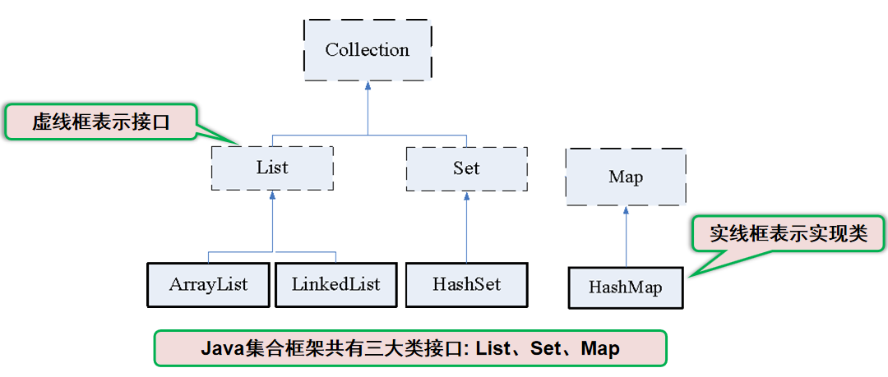
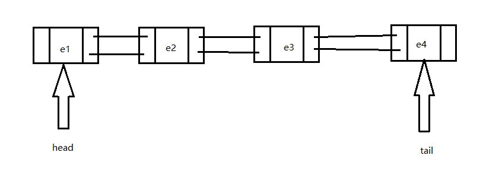

# 学习目标

```
1、了解容器的概念和体系结构
2、掌握List接口以及List接口子类的底层数据结构
3、掌握Set接口以及Set接口子类的的底层数据结构
4、掌握ArrayList类跟LinkedList类的用法跟区别
5、掌握HashSet类跟TreeSet类的用法
6、掌握迭代器的用法以及原理
```


# 第1章 集合框架

## 1.1 概述

​		集合是JAVA中提供的一种容器，用来存储多个数据。

​		前面学习过数组的知识，数组也是一种数据的容器，但是数组使用起来非常不方便，区别：

- 数组特点：类型固定，长度固定 

- 集合特点：类型不固定，长度也不固定，随意存放任何数据

  JAVA中提供了很多不同的集合，在不同的场景下选择合适的集合，这些众多的集合称为集合框架。


​		集合框架中大概分为两大类，分别是单列集合`java.util.Collection`和双列集合`java.util.Map`，集合框架都位于`java.util`包中




​	使用比较多的有接口有List、Set、Map接口，List,Set都是继承自Collection接口，Map则不是。

- List接口：元素有放入顺序，元素可重复 。和数组类似，List可以动态增长，查找元素效率高，插入删除元素效率低，因为会引起其他元素位置改变。
- Set接口：元素无放入顺序，元素不可重复，重复元素会覆盖掉。检索元素效率低下，删除和插入效率高，插入和删除不会引起元素位置改变。
- Map接口：Map用于保存具有映射关系的数据，Map里保存着两组数据：key和value，它们都可以使任何引用类型的数据，但key不能重复。所以通过指定的key就可以取出对应的value。**Map 没有继承 Collection 接口**。


# 第2章 ArrayList类

## 2.1 概述

​		我们先学习单列集合中的`List`接口跟实现类`ArrayList`，这个是开发过程使用得最多最频繁的一个集合。`ArrayList`的底层结构是一个数组实现，并提供了非常丰富使用的API供使用。

​		`ArrayList`实现了长度可变的数组，所有的元素是以一种线性方式进行存储的，在内存中分配连续的空间，遍历元素和随机访问元素的效率比较高。 


## 2.2 常用API

* `public boolean add(E e)`：  把给定的对象添加到当前集合中 。
* `public E get(int index)`:  返回此列表中指定位置上的元素。
* `public void clear()` :  清空集合中所有的元素。
* `public boolean remove(E e)`:  把给定的对象在当前集合中删除。
* `public boolean contains(E e)`:  判断当前集合中是否包含给定的对象。
* `public boolean isEmpty()`:  判断当前集合是否为空。
* `public int size()`:  返回集合中元素的个数。
* `public Object[] toArray()`:  把集合中的元素，存储到数组中。


**代码演示**

```java
    public static void main(String[] args) {
//        创建集合容器
        List<String> list = new ArrayList<>();
        list.add("关羽");// 添加元素关羽，索引为0
        list.add("张飞");// 添加元素张飞，索引为1
        list.add("刘备");// 添加元素刘备，索引为2
        list.add("赵云");// 添加元素赵云，索引为3
        list.add("诸葛亮");// 添加元素诸葛亮，索引为4

        System.out.println(list);// 打印集合信息
        
        System.out.println(list.get(2));// 根据索引查找对应的元素

        System.out.println(list.size());// 查看集合中一共有多少个元素

        System.out.println(list.contains("赵云")); // 判断赵云是否存在集合中

        list.remove("诸葛亮");// 删除诸葛亮

        //Object[] toArray()转换成一个Object数组
        Object[] objects = list.toArray();
        // 遍历数组
        for (int i = 0; i < objects.length; i++) {
            System.out.println(objects[i]);
        }

        list.clear();// 清空集合
        System.out.println(list.isEmpty());// boolean  isEmpty()  判断是否为空

    }
```

tips: `java.util.Vector`集合用法同`java.util.ArrayList`，区别在于`java.util.Vector`是线程安全的，而`java.util.ArrayList`是线程非安全的。


## 2.3 遍历

​	我们经常需要遍历集合，那么如果遍历`ArrayList`中的所有元素呢？

> 方式1

```java
public static void main(String[] args) {
//        创建集合容器
        List<String> list = new ArrayList<>();
        list.add("关羽");// 添加元素关羽，索引为0
        list.add("张飞");// 添加元素张飞，索引为1
        list.add("刘备");// 添加元素刘备，索引为2
        list.add("赵云");// 添加元素赵云，索引为3
        list.add("诸葛亮");// 添加元素诸葛亮，索引为4

//        遍历方式1
        for (int i=0;i<list.size();i++){
            System.out.println(list.get(i));
        } 

    }
```


> 方式2

```java
public static void main(String[] args) {
//        创建集合容器
        List<String> list = new ArrayList<>();
        list.add("关羽");// 添加元素关羽，索引为0
        list.add("张飞");// 添加元素张飞，索引为1
        list.add("刘备");// 添加元素刘备，索引为2
        list.add("赵云");// 添加元素赵云，索引为3
        list.add("诸葛亮");// 添加元素诸葛亮，索引为4
 
//        遍历方式2
        for (String name : list){
            System.out.println(name);
        }

    }
```


> 方式3

​	此外，我们还可以通过迭代器的方式来遍历，后面专门章节来讲解迭代器的用法。


# 第3章 LinkedList类

## 3.1 概述

​		`LinkedList`也是`List`接口的实现类，所以`List`接口中定义的方法在`LinkedList`中也可以使用。

`LinkedList`底层的存储结构是一个链表，在元素的前后分别有一个前置结点和后置结点，用于连接集合中的上一个元素和下一个元素，依次“手拉手”，构成一条链式数据的集合。

​		`LinkedList`集合的元素在内存中并不连续，从图中我们可以发现`LinkedList`对于添加、删除元素效率比较高，对于查找跟修改效率比较低。


## 3.2 常用API

* `public void addFirst(E e)`:将指定元素插入此列表的开头。

* `public void addLast(E e)`:将指定元素添加到此列表的结尾。

* `public E getFirst()`:返回此列表的第一个元素。

* `public E getLast()`:返回此列表的最后一个元素。

* `public E removeFirst()`:移除并返回此列表的第一个元素。

* `public E removeLast()`:移除并返回此列表的最后一个元素。

* `public E pop()`:从此列表所表示的堆栈处弹出一个元素。此方法等效于 removeFirst()。 

* `public void push(E e)`:将元素推入此列表所表示的堆栈。此方法等效于 addFirst(E)。 

* `public boolean isEmpty()`：如果列表不包含元素，则返回true。

  

**代码演示**

```java
 public static void main(String[] args) {
        LinkedList<String> link = new LinkedList<String>();
        //添加元素
        link.addFirst("关羽");
        link.addFirst("张飞");
        link.addFirst("刘备");
        System.out.println(link);

        System.out.println(link.getFirst()); // 获取第1个元素
        System.out.println(link.getLast()); // 获取最后1个元素

        System.out.println(link.removeFirst());// 删除第1个元素
        System.out.println(link.removeLast());// 删除最后1个元素

        while (!link.isEmpty()) { //判断集合是否为空
            System.out.println(link.pop()); //弹出集合中的栈顶元素
        }

        System.out.println(link);
    }
```


## 3.3 遍历

> 方式1

```java
public static void main(String[] args) {
    LinkedList<String> link = new LinkedList<String>();
    //添加元素
    link.addFirst("关羽");
    link.addFirst("张飞");
    link.addFirst("刘备");

    for (int i=0; i<link.size(); i++) {
        System.out.println(link.get(i));
    }
}
```


> 方式2

```java
public static void main(String[] args) {
        LinkedList<String> link = new LinkedList<String>();
        //添加元素
        link.addFirst("关羽");
        link.addFirst("张飞");
        link.addFirst("刘备");

        for (String s : link) {
            System.out.println(s);
        }
}
```

> 方式3

​	此外，我们还可以通过迭代器的方式来遍历，后面专门章节来讲解迭代器的用法。


# 第4章 HashSet类

## 4.1 概述

​	`java.util.Set`接口和`java.util.List`接口一样，同样继承自`Collection`接口，它与`Collection`接口中的方法基本一致，并没有对`Collection`接口进行功能上的扩充，只是比`Collection`接口更加严格了。与`List`接口不同的是，`Set`接口中元素无序，并且都会以某种规则保证存入的元素不出现重复。

​	`Set`集合有多个子类，这里我们介绍其中的`java.util.HashSet`、`java.util.TreeSet`这两个集合。

​	`java.util.HashSet`是`Set`接口的一个实现类，它所存储的元素是不可重复的，并且元素都是无序的(即存取顺序不一致)。`java.util.HashSet`底层的实现其实是一个`java.util.HashMap`。


## 4.2 常用API

- `public boolean add(E e)`： 如果此 set 中尚未包含指定元素，则添加指定元素 。
- `public boolean contains(Object o)`:  如果此 set 包含指定元素，则返回 true。
- `public void clear()` : 从此 set 中移除所有元素。此调用返回后，该 set 将为空。
- `public boolean remove(Object o)`:  如果指定元素存在于此 set 中，则将其移除。 
- `public boolean isEmpty()`:  如果此 set 不包含任何元素，则返回 true。
- `public int size()`:   返回此 set 中的元素的数量（set 的容量）。
- `public Iterator<E> iterator()`:  返回对此 set 中元素进行迭代的迭代器。返回元素的顺序并不是特定的。


**代码演示**

```java
   public static void main(String[] args) {
//        创建集合容器
        Set<String> set = new HashSet<>();
        set.add("关羽");
        set.add("张飞");
        set.add("刘备");
        set.add("赵云");
        set.add("诸葛亮");

        System.out.println(set);// 打印集合信息

        System.out.println(set.size());// 查看集合中一共有多少个元素

        System.out.println(set.contains("赵云")); // 判断赵云是否存在集合中

        set.remove("诸葛亮");// 删除诸葛亮


        set.clear();// 清空集合
        System.out.println(set.isEmpty());// boolean  isEmpty()  判断是否为空

    }
```


## 4.3 遍历
> 方式1

```java
public static void main(String[] args) {
        LinkedList<String> link = new LinkedList<String>();
        //添加元素
        link.addFirst("关羽");
        link.addFirst("张飞");
        link.addFirst("刘备");

        for (String s : link) {
            System.out.println(s);
        }
}
```

> 方式2

​	此外，我们还可以通过迭代器的方式来遍历，后面专门章节来讲解迭代器的用法。


# 第5章 TreeSet类

​		`TreeSet`同样也是Set接口的一个实现类`TreeSet`是一个有序集合，底层结构为红黑树。会根据自然排序排列或比较器进行排序，且没有重复元素，也没有下标。通过`TreeMap`实现。

​		 `TreeSet`由于底层结构是红黑树，红黑树满足2叉查找树的特性，故在`TreeSet`中的元素需要满足具有可比性的特性，可比性需要内部比较器或者外部比较器来实现，否则会抛出`java.lang.ClassCastException`。

**代码演示**

​	创建`TreeSet`容器，里面元素使用自定义`Person`类，拥有`name`、`age`属性，按照`age`的大小进行比较。

```java
import java.util.TreeSet;

public class Demo05 {

    public static void main(String[] args) {
        TreeSet<Person> treeSet = new TreeSet<>();
        treeSet.add(new Person("刘备",33));
        treeSet.add(new Person("关羽",23));
        treeSet.add(new Person("张飞",27));
    }

}

class Person implements  Comparable<Person>{

    private String name ;
    private int age ;

    public Person(String name, int age) {
        this.name = name;
        this.age = age;
    }

    public String getName() {
        return name;
    }

    public void setName(String name) {
        this.name = name;
    }

    public int getAge() {
        return age;
    }

    public void setAge(int age) {
        this.age = age;
    }

    @Override
    public String toString() {
        return "Person{" +
                "name='" + name + '\'' +
                ", age=" + age +
                '}';
    }

    @Override
    public int compareTo(Person person) {
        return this.age - person.age;
    }
}
```


# 第6章 迭代器

## 6.1 Iterator接口

在开发过程中，经常需要遍历集合中的所有元素。JDK专门提供了一个接口`java.util.Iterator`。它与`Collection`、`Map`接口有所不同，`Collection`接口与`Map`接口主要用于存储元素，而`Iterator`主要用于迭代访问（即遍历）`Collection`中的元素，因此`Iterator`对象也被称为迭代器。

想要遍历Collection集合，那么就要获取该集合迭代器完成迭代操作，下面介绍一下获取迭代器的方法：

* `public Iterator iterator()`: 获取集合对应的迭代器，用来遍历集合中的元素的。


* **迭代**：简而言之，就是使用循环从头开始遍历所有元素。迭代的方法为在取元素之前先要判断集合中有没有元素，如果有，就把这个元素取出来，继续在判断，如果还有就再取出出来。一直把集合中的所有元素全部取出。这种取出方式专业术语称为迭代。

  

Iterator接口的常用方法如下：

* `public E next()`:返回迭代的下一个元素。
* `public boolean hasNext()`:如果仍有元素可以迭代，则返回 true。


**代码演示**

~~~java
public static void main(String[] args) {
    //        准备集合跟元素
    List<String> list = new ArrayList<>();
    list.add("关羽");
    list.add("张飞");
    list.add("刘备");
    list.add("赵云");
    list.add("诸葛亮");

    //        获取集合对应的迭代器
    Iterator<String> iterator = list.iterator();
    //        每次判断是否有下一个元素，如果有返回true，否则返回false
    while (iterator.hasNext()){
        String hero = iterator.next();
        System.out.println(hero);
    }

}
~~~


## 2.2 实现原理

​		我们在之前案例已经完成了`Iterator`遍历集合的整个过程。当遍历集合时，首先通过调用t集合的iterator()方法获得迭代器对象，然后使用hashNext()方法判断集合中是否存在下一个元素，如果存在，则调用next()方法将元素取出，否则说明已到达了集合末尾，停止遍历元素。

​		`Iterator`是使用索引指针完成遍历过程的。在调用`Iterator`的`next`方法之前，迭代器的索引位于第一个元素之前，不指向任何元素，当第一次调用迭代器的next方法后，迭代器的索引会向后移动一位，指向第一个元素并将该元素返回，当再次调用next方法时，迭代器的索引会指向第二个元素并将该元素返回，依此类推，直到`hasNext`方法返回`false`，表示到达了集合的末尾，终止对元素的遍历。

​		`Iterator`是快速失败的，意思就是在获取迭代器后，遍历结束之前，不能修改集合的数据结构。否则会出现`ConcurrentModificationException`异常。如果在迭代过程中需要删除元素的话，只能通过`Iterator`的`void remove()`方法实现，而不能通过集合的`remove`方法。

**代码演示**

```java
public static void main(String[] args) {
    //        准备集合跟元素
    List<String> list = new ArrayList<>();
    list.add("关羽");
    list.add("张飞");
    list.add("刘备");
    list.add("赵云");
    list.add("诸葛亮");

    //        获取集合对应的迭代器
    Iterator<String> iterator = list.iterator();
    //      获取迭代器之后修改了集合结构，会异常
    //        list.add("黄忠");

    //        每次判断是否有下一个元素，如果有返回true，否则返回false
    while (iterator.hasNext()){
        String hero = iterator.next();
        System.out.println(hero);
        //            遍历过程中修改了集合的结构，会异常
        //            list.remove(hero);
    }

}
```

tips：增强for循环的底层就是通过迭代器实现的，所以使用这种方式的时候，也同样是快速失败的。


