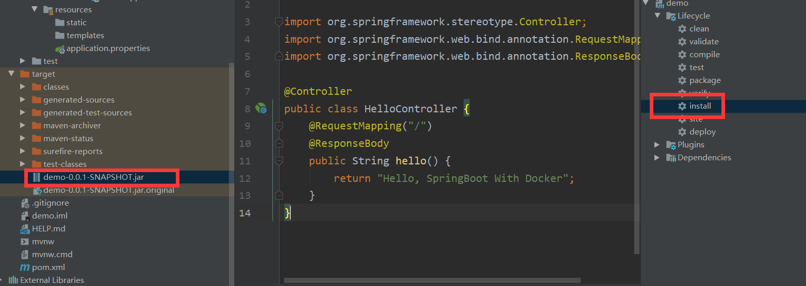
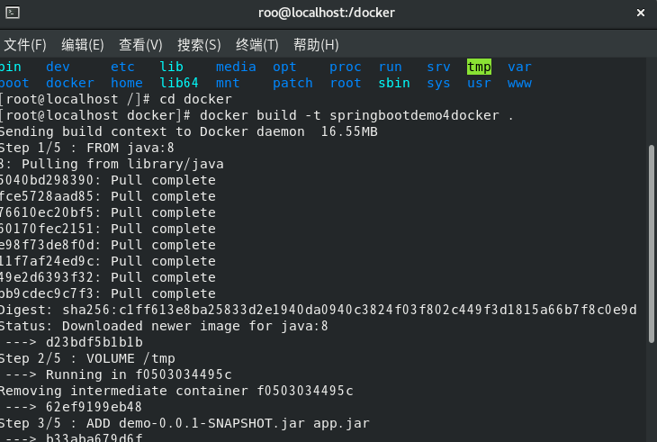

# Docker简介


Docker 是一个开源的应用容器引擎，基于 Go 语言 并遵从 Apache2.0 协议开源。

Docker 可以让开发者打包他们的应用以及依赖包到一个轻量级、可移植的容器中，然后发布到任何流行的 Linux 机器上，也可以实现虚拟化。

容器是完全使用沙箱机制，相互之间不会有任何接口（类似 iPhone 的 app）,更重要的是容器性能开销极低。

Docker 从 17.03 版本之后分为 CE（Community Edition: 社区版） 和 EE（Enterprise Edition: 企业版），我们用社区版就可以了。

------

## Docker的应用场景

- Web 应用的自动化打包和发布。
- 自动化测试和持续集成、发布。
- 在服务型环境中部署和调整数据库或其他的后台应用。
- 从头编译或者扩展现有的 OpenShift 或 Cloud Foundry 平台来搭建自己的 PaaS 环境。

------

## Docker 的优点

Docker 是一个用于开发，交付和运行应用程序的开放平台。Docker 使您能够将应用程序与基础架构分开，从而可以快速交付软件。借助 Docker，您可以与管理应用程序相同的方式来管理基础架构。通过利用 Docker 的方法来快速交付，测试和部署代码，您可以大大减少编写代码和在生产环境中运行代码之间的延迟。

### 1、快速，一致地交付您的应用程序

Docker 允许开发人员使用您提供的应用程序或服务的本地容器在标准化环境中工作，从而简化了开发的生命周期。

容器非常适合持续集成和持续交付（CI / CD）工作流程，请考虑以下示例方案：

- 您的开发人员在本地编写代码，并使用 Docker 容器与同事共享他们的工作。
- 他们使用 Docker 将其应用程序推送到测试环境中，并执行自动或手动测试。
- 当开发人员发现错误时，他们可以在开发环境中对其进行修复，然后将其重新部署到测试环境中，以进行测试和验证。
- 测试完成后，将修补程序推送给生产环境，就像将更新的镜像推送到生产环境一样简单。

### 2、响应式部署和扩展

Docker 是基于容器的平台，允许高度可移植的工作负载。Docker 容器可以在开发人员的本机上，数据中心的物理或虚拟机上，云服务上或混合环境中运行。

Docker 的可移植性和轻量级的特性，还可以使您轻松地完成动态管理的工作负担，并根据业务需求指示，实时扩展或拆除应用程序和服务。

### 3、在同一硬件上运行更多工作负载

Docker 轻巧快速。它为基于虚拟机管理程序的虚拟机提供了可行、经济、高效的替代方案，因此您可以利用更多的计算能力来实现业务目标。Docker 非常适合于高密度环境以及中小型部署，而您可以用更少的资源做更多的事情。

# CentOS Docker 安装

Docker 支持以下的 64 位 CentOS 版本：

- CentOS 7
- CentOS 8
- 更高版本...

### 卸载旧版本

较旧的 Docker 版本称为 docker 或 docker-engine 。如果已安装这些程序，请卸载它们以及相关的依赖项。

```
$ sudo yum remove docker \
                  docker-client \
                  docker-client-latest \
                  docker-common \
                  docker-latest \
                  docker-latest-logrotate \
                  docker-logrotate \
                  docker-engine
```

### 安装 Docker Engine-Community

在新主机上首次安装 Docker Engine-Community 之前，需要设置 Docker 仓库。之后，您可以从仓库安装和更新 Docker。

#### **设置仓库**

安装所需的软件包。yum-utils 提供了 yum-config-manager ，并且 device mapper 存储驱动程序需要 device-mapper-persistent-data 和 lvm2。

```
$ sudo yum install -y yum-utils \
  device-mapper-persistent-data \
  lvm2
```

使用以下命令来设置稳定的仓库。

使用官方源地址（比较慢）

```
$ sudo yum-config-manager \
    --add-repo \
    https://download.docker.com/linux/centos/docker-ce.repo
```

阿里云

```
$ sudo yum-config-manager \
    --add-repo \
    http://mirrors.aliyun.com/docker-ce/linux/centos/docker-ce.repo
```

清华大学源

```
$ sudo yum-config-manager \
    --add-repo \
    https://mirrors.tuna.tsinghua.edu.cn/docker-ce/linux/centos/docker-ce.repo
```

#### 安装最新版本的 Docker Engine-Community 和 containerd

```
$ sudo yum install docker-ce docker-ce-cli containerd.io
```

执行 yum install docker-ce docker-ce-cli containerd.io 提示：

```
问题: package docker-ce-3:19.03.8-3.el7.x86_64 requires containerd.io >= 1.2.2-3, but none of the providers can be installed
```

解决方法：

```
yum install -y https://mirrors.aliyun.com/docker-ce/linux/centos/7/x86_64/edge/Packages/containerd.io-1.2.13-3.1.el7.x86_64.rpm
```

然后再执行 yum install docker-ce docker-ce-cli containerd.io 即可。

如果提示您接受 GPG 密钥，请选是。

启动 Docker。

```
$ sudo systemctl start docker
```

通过运行 hello-world 映像来验证是否正确安装了 Docker Engine-Community 。

```
$ sudo docker run hello-world
```

# Docker部署SpringBoot项目

### 1.创建springboot项目

```css
package com.example.demo.controller;

import org.springframework.stereotype.Controller;
import org.springframework.web.bind.annotation.RequestMapping;
import org.springframework.web.bind.annotation.ResponseBody;

@Controller
public class HelloController {
    @RequestMapping("/")
    @ResponseBody
    public String hello() {
        return "Hello, SpringBoot With Docker";
    }
}
```


### 2.打包springboot项目为jar包



### 3. 编写Dockerfile文件

```ruby
# Docker image for springboot file run
# VERSION 0.0.1
# 基础镜像使用java
FROM openjdk:8
# VOLUME 指定了临时文件目录为/tmp。
# 其效果是在主机 /var/lib/docker 目录下创建了一个临时文件，并链接到容器的/tmp
VOLUME /tmp 
# 将jar包添加到容器中并更名为app.jar
ADD demo-0.0.1-SNAPSHOT.jar app.jar 
# 运行jar包
RUN bash -c 'touch /app.jar'
ENTRYPOINT ["java","-Djava.security.egd=file:/dev/./urandom","-jar","/app.jar"]
```

**解释下这个配置文件：**

VOLUME 指定了临时文件目录为/tmp。其效果是在主机 /var/lib/docker 目录下创建了一个临时文件，并链接到容器的/tmp。改步骤是可选的，如果涉及到文件系统的应用就很有必要了。/tmp目录用来持久化到 Docker 数据文件夹，因为 Spring Boot 使用的内嵌 Tomcat 容器默认使用/tmp作为工作目录
 项目的 jar 文件作为 “app.jar” 添加到容器的
 ENTRYPOINT 执行项目 app.jar。为了缩短 Tomcat 启动时间，添加一个系统属性指向 “/dev/./urandom” 作为 Entropy Source

如果是第一次打包，它会自动下载java 8的镜像作为基础镜像，以后再制作镜像的时候就不会再下载了。

### 4. 部署文件

在服务器新建一个docker文件夹，将maven打包好的jar包和Dockerfile文件复制到服务器的docker文件夹下

### 5. 制作镜像

执行下面命令， 看好，最后面有个"."点！

```undefined
docker build -t springbootdemo4docker .
```



-t 参数是指定此镜像的tag名

制作完成后通过**docker images**命令查看我们制作的镜像

```
docker images
```

### 6.启动容器

```csharp
docker run -d -p 8081:8080 springbootdemo4docker
```

-d参数是让容器后台运行 
-p 是做端口映射，此时将服务器中的8081端口映射到容器中的8080(项目中端口配置的是8080)端口

### 7. 访问网站

直接浏览器访问： http://你的服务器ip地址:8081/

# Docker常用命令

## 一、安装相关命令

1.查看内核版本
uname -r

2.更新yum
yum -y update

3.安装docker（以下为社区版本）
yum install docker-ce

4.指定docker版本安装（指定社区版本）
yum install docker-ce-18.031.ce

5.安装dokcer不互动
yum -y install docker-ce

6.启动docker
systemctl start docker

7.加入开机启动
systrmctl enable docker 

8.查看docker版本
docker version

9.docker查询远程仓库
docker search java

11.重启docker
service docker restart

12.下载镜像（可选指定版本 ：8）
docker pull java ：8

13.列出本地镜像
docker images

14删除本地镜像
docker rmi java

## 二、容器相关命令


1.新建一个容器并启动一个容器，
docker rum -d -p91:80 nginx

此时会先在本地查找，本地没有的话，会在仓库找下载。然后启动
-p：端口映射， 宿主机端口。小格子端口。通过宿主机端口映射小格子端口
-d：后台运行

2.；列出容器
docker ps
分别会出现： id，IName。容器id ，安装时间。状态。端口映射。名称

3.查看容器相关信息
docker inspect （容器id）

4.删除容器
docker rm （容器id）

5.停止容器
docker stop （容器id）

6.强制停止容器
docker kill （容器id）

7.启动已停止的容器
docker start （容器id）

8.查看日志
docker container logs （容器id）

9.查看容器内的进程
docker top （容器id）

10进入容器(一般不在容器内部进行配置)
docker container exec -it （容器id）/bin...