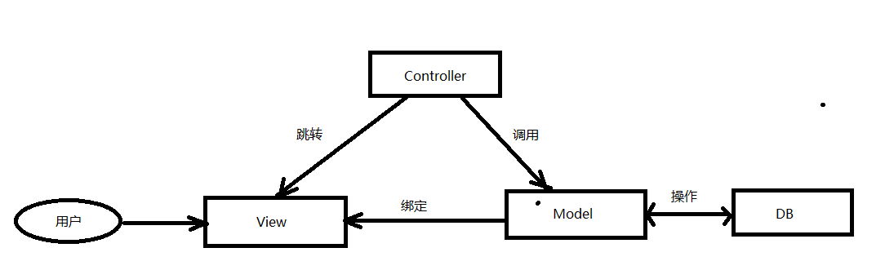
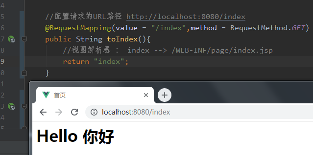
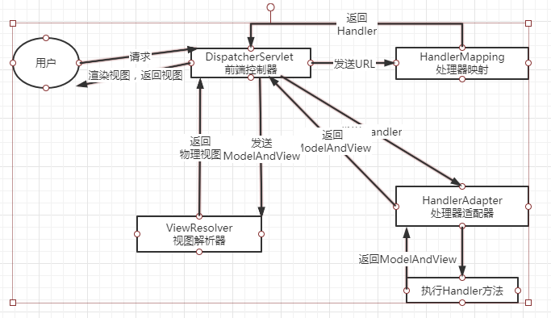
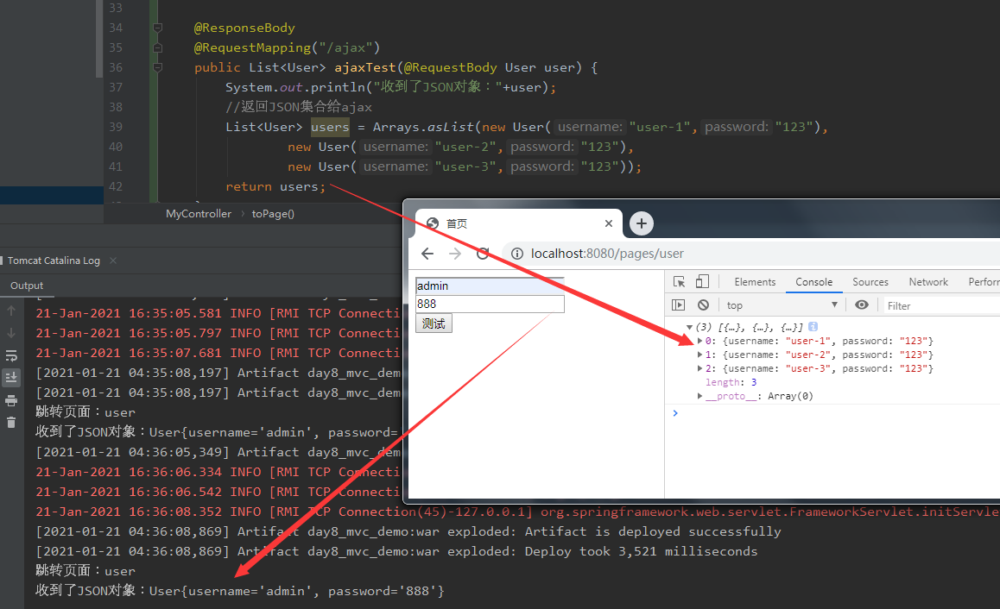

# 学习目标

```
1、SpringMVC概述
2、SpringMVC入门案例
3、SpringMVC的执行流程
4、处理参数
5、返回数据
```

# 1、SpringMVC概述

## 1.1 回顾MVC设计模式

### 1.1.1 MVC的概念

一种Web和桌面应用主流的设计模式

```
M（Model模型）负责数据访问、业务逻辑（dao、service、entity）

V（View视图）负责和用户交互、展示数据（页面）

C（Controller控制器）负责调用模型、更新视图（servlet-->Controller)
```

作用：解耦，便于开发和维护

### 1.1.2 MVC的执行流程



```
1）用户来访问视图，如：在商品页面点击查看商品的详情
2）视图将请求发送给控制器，控制器调用模型查询商品数据
3）模型将查询到的数据绑定到详情页面上，控制器使页面跳转到详情页面
4）用户看到商品的详情
```

## 1.2 Struts2.0和SpringMVC的区别

### 1.2.1 MVC框架的演变

最早的MVC架构是：Servlet + JSP + JavaBean，这种方式开发项目比较复杂，管理起来很不方便，所以渐渐出现了MVC的框架。早期比较流行的框架是：Struts，Struts从1.0发展为了2.0，后来Spring推出的SpringMVC框架由于更加优秀，慢慢的代替了Struts框架。

### 1.2.2 Struts2.0和SpringMVC的区别

1. 实现机制
   SpringMVC基于Servlet机制，而Struts2基于Filter机制

2. 拦截机制
   SpringMVC是方法级别拦截，每个请求对应一个方法；
   Struts2是类级别的拦截，每个请求对应一个Action类；
   SpringMVC执行速度更快
   
3. 集成
   SpringMVC是Spring体系中的，配置起来更容易，而Struts2需要更多的配置


#  2、入门案例

1）导入SpringMVC依赖

    <!-- https://mvnrepository.com/artifact/org.springframework/spring-aop -->
    <dependency>
      <groupId>org.springframework</groupId>
      <artifactId>spring-webmvc</artifactId>
      <version>5.2.8.RELEASE</version>
    </dependency>
2）Spring配置文件

```
<?xml version="1.0" encoding="UTF-8"?>
<beans xmlns="http://www.springframework.org/schema/beans"
       xmlns:xsi="http://www.w3.org/2001/XMLSchema-instance"
       xmlns:context="http://www.springframework.org/schema/context"
       xmlns:mvc="http://www.springframework.org/schema/mvc"
       xsi:schemaLocation="http://www.springframework.org/schema/beans 	
       http://www.springframework.org/schema/beans/spring-beans.xsd 
       http://www.springframework.org/schema/context 
       https://www.springframework.org/schema/context/spring-context.xsd 
       http://www.springframework.org/schema/mvc 
       https://www.springframework.org/schema/mvc/spring-mvc.xsd">
        <!--扫描包-->
        <context:component-scan base-package="com.blb.mvc"></context:component-scan>
        <!--视图解析器 帮助查找视图文件的位置 index 转换为 /WEB-INF/pages/index.jsp -->
        <bean id="viewResolver" class="org.springframework.web.servlet.view.InternalResourceViewResolver">
            <!--配置视图的前缀-->
            <property name="prefix" value="/WEB-INF/pages/"></property>
            <!--配置视图的后缀-->
            <property name="suffix" value=".jsp"></property>
        </bean>
        <!--处理静态资源-->
        <mvc:default-servlet-handler/>
        <!--启动注解配置-->
        <mvc:annotation-driven/>
</beans>
```

3） web.xml配置文件

```
<?xml version="1.0" encoding="UTF-8"?>
<web-app xmlns:xsi="http://www.w3.org/2001/XMLSchema-instance"
         xmlns="http://xmlns.jcp.org/xml/ns/javaee"
         xsi:schemaLocation="http://xmlns.jcp.org/xml/ns/javaee http://xmlns.jcp.org/xml/ns/javaee/web-app_3_1.xsd"
         id="WebApp_ID" version="3.1">
  <display-name>Archetype Created Web Application</display-name>
  <!--配置核心控制器-->
  <servlet>
    <servlet-name>dispatcherServlet</servlet-name>
    <servlet-class>org.springframework.web.servlet.DispatcherServlet</servlet-class>
    <init-param>
      <!--springmvc的配置文件路径-->
      <param-name>contextConfigLocation</param-name>
      <param-value>classpath:spring-mvc.xml</param-value>
    </init-param>
      <!--启动顺序-->
    <load-on-startup>1</load-on-startup>
  </servlet>
  <servlet-mapping>
    <servlet-name>dispatcherServlet</servlet-name>
    <!--处理所有资源-->
    <url-pattern>/</url-pattern>
  </servlet-mapping>
</web-app>
```

4） 控制器

```
     /**
      * 自定义控制器
      */
  	  @Controller
      public class MyController {
    
          //配置请求的URL路径/index，请求方法是GET
          @RequestMapping(value = "/index",method = RequestMethod.GET)
          public String toIndex(){
              //视图解析器 ： index --> /WEB-INF/page/index.jsp
              return "index";
          }
    
      }
```

 5） 配置Tomcat运行效果




# 3、SpringMVC执行流程



1） 用户发送请求

2）前端控制器获得用户请求的URL，发送URL给处理器映射

3）处理器映射将Handler（包装方法信息）返回给前端控制器

4）前端控制器发送Handler给处理器适配器，适配器执行Handler方法

5）执行Handler方法后，返回ModelAndView（逻辑视图）给前端控制器

6）前端控制器将ModelAndView发送给视图解析器，解析出物理视图返回给前端控制器

7）前端控制器渲染视图，发送视图给用户

# 4、参数处理

## 4.1 SpringMVC的常用注解

这里介绍几个SpringMVC常用的注解：

- **@Controller**  				          配置控制器类

- **@RequestMapping("URL")**  配置请求方法

  属性：

  value		配置请求的URL

  method   配置请求的方法，值包含RequestMethod.GET、RequestMethod.POST等

- **@GetMapping("URL")**  		配置GET请求方法

  相当于@RequestMapping(value="URL",method=RequestMethod.GET)

  类似的还有：@PostMapping、@DeleteMapping、@PutMapping

- **@RequestParam("名称")**     配置请求参数

- **@PathVariable("名称")**        配置路径参数

  

## 4.2 参数绑定

登录页面

```
<html>
<head>
    <title>登录</title>
</head>
<body>
    <span style="color:red">${msg}</span>
    <form action="/user/login" method="post">
        <input name="username" placeholder="请输入用户名"><br>
        <input name="password" placeholder="请输入密码"><br>
        <input type="submit" value="登录">
    </form>
</body>
</html>
```

实现参数绑定有多种方式。

### 4.2.1 参数直接绑定

直接定义和表单元素name相同的参数

```
@Controller
@RequestMapping("user")
public class UserController {

    @PostMapping("/login")
    public void login(String username, String password){...}
}
```

### 4.2.2 @RequestParam注解绑定参数

如果名称不一样，可以通过@RequestParam注解配置参数

```
@PostMapping("/login")
public void login(@RequestParam("username")String uname, 
	@RequestParam("password")String pwd){
	...
}
```

### 4.2.3 对象绑定参数

通过对象也可以进行参数绑定
实体类

```
public class User {

    private String username;
    private String password;
    ...
}
```
方法定义
```
@PostMapping("/login")
public void login(User user){
	...
}
```

### 4.2.4 @PathVariable绑定参数

通过URL的路径也可以实现参数绑定，需要给参数添加@PathVariable注解

在URL中可以使用{name}来定位参数的位置，name是@PathVariable注解中配置的名称

```
@GetMapping("/login/{username}/{password}")
public void login(@PathVariable("username")String username,
					@PathVariable("password")String password){
    System.out.println(username);
    System.out.println(password);
}
```

在浏览器输入：http://localhost:8080/user/login/admin/123456

可以看到账号和密码的输出，当然登录不适合将账号和密码添加到URL中，这里只是测试

### 4.2.5 通过Map集合进行参数绑定
在实体类中添加Map集合

```
public class UserVO {

    private Map<String,String> user = new HashMap<>();
    //get、set
}
```
修改表单name为: 集合名[‘属性名’]
```
<input name="user['username']" placeholder="请输入用户名"><br>
<input name="user['password']" placeholder="请输入密码"><br>
```
修改方法
```
@PostMapping("/login")
public void login(UserVO userVO){
    String username = userVO.getUser().get("username");
    String password = userVO.getUser().get("password");
}
```
### 4.2.6 通过List集合进行参数绑定
修改集合为List
```
public class UserVO {

    private List<String> user = new ArrayList<>();
    //get、set
}
```
修改表单name为: 集合名[下标]
```
<input name="user[0]" placeholder="请输入用户名"><br>
<input name="user[1]" placeholder="请输入密码"><br>
```
修改方法
```
@PostMapping("/login")
public void login(UserVO userVO){
    String username = userVO.getUser().get(0);
    String password = userVO.getUser().get(1);
}
```
## 4.3 参数绑定的中文乱码问题

SpringMVC提供了过滤器来设置编码
在web.xml中配置

```
<!--编码过滤器-->
<filter>
    <filter-name>encodingFilter</filter-name>
    <filter-class>org.springframework.web.filter.CharacterEncodingFilter</filter-class>
    <init-param>
        <param-name>encoding</param-name>
        <param-value>UTF-8</param-value>
    </init-param>
    <init-param>
        <param-name>forceEncoding</param-name>
        <param-value>true</param-value>
    </init-param>
</filter>
<filter-mapping>
    <filter-name>encodingFilter</filter-name>
    <url-pattern>/*</url-pattern>
</filter-mapping>
```

## 4.4 自定义类型转换器

在进行参数绑定时，会自动完成完成基本类型（如byte、short、 int、long、float、double、boolean 、char ）以及String类型的数据转换。

因为SpringMVC提供了大量内置的类型转换器Converter，来帮助进行参数在类型转换，如果我们需要完成某些特殊的数据格式的处理，就需要自定义类型转换器。

案例：表单输入id-name-age-subject格式的字符串，绑定到Student类型的参数。

实体类

```
public class Student {

    private Long id;
    private String name;
    private Integer age;
    private String subject;
    ...get/set
 }
```

自定义转换器   

```
/**
 * 学生类型转换器，将id-name-age-subject格式字符串转换为Student对象
 */
public class StudentConverter implements Converter<String, Student> {

    @Override
    public Student convert(String s) {
        //按-分割字符串
        String[] strings = s.split("\\-");
        if(strings.length != 4){
            throw new IllegalArgumentException("字符串不符合学生信息格式要求");
        }
        //返回Student对象
        Student student = new Student();
        student.setId(Long.valueOf(strings[0]));
        student.setName(strings[1]);
        student.setAge(Integer.valueOf(strings[2]));
        student.setSubject(strings[3]);
        return student;
    }
}
```

注册转换器，修改springmvc的annotation-driver配置

```
<!--注册类型转换器-->
<bean id="conversionService" class="org.springframework.format.support.FormattingConversionServiceFactoryBean">
    <property name="converters">
        <list>
            <bean class="com.blb.mvc.converter.StudentConverter"/>
        </list>
    </property>
</bean>
<mvc:annotation-driven conversion-service="conversionService"/>
```

控制器

```
@PostMapping("/saveStudent")
public void saveStudent(Student student){
    System.out.println(student.getId());
    System.out.println(student.getName());
    System.out.println(student.getAge());
    System.out.println(student.getSubject());
}
```

页面

```
<form action="/saveStudent" method="post">
    <input name="student" placeholder="请输入学生信息"><br>
    <input type="submit" value="提交">
</form>
```

# 5、页面数据绑定

## 5.1 EL实现后台数据绑定

在JSP页面中可以通过EL表达式来绑定后台的数据，后台数据可以保存到：

1. 将数据保存到HttpServletRequest、HttpSession、ServletContext中

2. 在参数中定义Model参数保存数据

3. 在参数中定义Map参数保存数据


## 5.2 页面跳转

页面跳转的两种方式：

1. 请求转发

   forward:url

2. 重定向

   redirect:url
   
## 5.3 登录案例 

首页

```
<%@ page contentType="text/html;charset=UTF-8" language="java" isELIgnored="false" %>
<html>
<head>
    <title>首页</title>
</head>
<body>
    <h1>Hello ${user.username}你好</h1>
</body>
</html>
```

模拟登录，使用User来获得参数，保存User对象到HttpSession，重定向到首页后，可以从首页读取用户名；

保存错误信息到Model对象中，请求转发到登录页面后，可以读取Model中的数据

```
@PostMapping("/login")
public String login(User user,HttpSession session,Model model){
    if("admin".equals(user.getUsername()) && "123".equals(user.getPassword())){
        //保存用户数据到Session中
        session.setAttribute("user",user);
        //重定向到首页
        return "redirect:/index";
    }
    //保存错误提示数据到Model
    model.addAttribute("msg","账号或密码错误");
    //请求转发到当前页
    return "forward:/login";
}
```

## 5.4 处理ServletAPI

SpringMVC还支持以原生ServletAPI作为形参，包括：

- HttpServletRequest
- HttpServletResponse
- HttpSession
- java.security.Principal
- Local
- InputStream
- OutputStream
- Reader
- Writer

使用HttpServletRequest获得参数，将用户名保存到Session中

```
@PostMapping("/login")
public String login(HttpServletRequest req,HttpSession session){
    String username = req.getParameter("username");
    String password = req.getParameter("password");
    session.setAttribute("username",username);
    return "redirect:/test";
}
```

@SessionAttribute

通过@SessionAttribute注解，可以读取Session中的用户名

```
@PostMapping("/test")
public String test(@SessionAttribute("username")String username){
    System.out.println(username);
    return "/index";
}
```

@ModelAttribute

@ModelAttribute可以将模型数据注入到方法参数中

定义方法，在方法上加@ModelAttribute，将返回的User对象作为模型

```
@ModelAttribute("user")
public User getUser(){
    User user = new User();
    user.setUsername("admin");
    user.setPassword("123");
    return user;
}
```

在方法的参数上加入@ModelAttribute，注入模型对象

```
@RequestMapping("/test2")
public void test2(@ModelAttribute("user")User user){
    System.out.println(user);
}
```

# 6、SpringMVC和Ajax交互

目前后台和前端进行通信主要的数据格式是：JSON

## 6.1 JSON简介

JSON是JavaScript的对象，代码简洁，可读性很高

格式有两种：

1. 单个对象

   {“name”:"张三","age":"20"}

2. 对象数组

   [{“name”:"张三","age":"20"},{“name”:"李四","age":"20"}]

Java后台和前端Ajax通信时，经常需要接受JSON参数，也可能需要返回JSON给Ajax

## 6.2 相关的注解

SpringMVC和Ajax通信的相关注解

- @RequestBody

  定义在参数前面，用于接收JSON格式的对象

- @ResponseBody

  定义在方法前面，用于将数据返回给Ajax

## 6.3 案例

下面案例演示如何接收Ajax的JSON参数，以及如何返回JSON给Ajax

1） 导入依赖

SpringMVC需要JSON解析的相关依赖

```
<dependency>
    <groupId>com.fasterxml.jackson.core</groupId>
    <artifactId>jackson-databind</artifactId>
    <version>2.9.5</version>
</dependency>
```

2）用户对象

```
public class User {

    private String username;
    private String password;

    public String getUsername() {
        return username;
    }

    public void setUsername(String username) {
        this.username = username;
    }

    public String getPassword() {
        return password;
    }

    public void setPassword(String password) {
        this.password = password;
    }

    @Override
    public String toString() {
        return "User{" +
                "username='" + username + '\'' +
                ", password='" + password + '\'' +
                '}';
    }

    public User(String username, String password) {
        this.username = username;
        this.password = password;
    }

    public User() {
    }
}
```

3） 控制器，在参数中添加了@RequestBody，方法前添加@ResponseBody

将会接收一个User对象参数，然后返回一个User集合给Ajax

```
/**
 * 自定义控制器
 */
@Controller
public class MyController {

    @ResponseBody
    @RequestMapping("/ajax")
    public List<User> ajaxTest(@RequestBody User user) {
        System.out.println("收到了JSON对象："+user);
        //返回JSON集合给ajax
        List<User> users = Arrays.asList(new User("user-1","123"),
                new User("user-2","123"),
                new User("user-3","123"));
        return users;
    }
}

```

4） user.jsp

```
<%@ page contentType="text/html;charset=UTF-8" language="java" isELIgnored="false" %>
<html>
<head>
    <title>首页</title>
</head>
<body>
    <input id="username" placeholder="请输入用户名"><br>
    <input id="password" placeholder="请输入密码"><br>
    <button>测试</button>
    <script  type="text/javascript" src="/js/jquery-3.3.1.js"></script>
    <script>
        //点击测试
        $("button").click(function () {
            var json = {username:$("#username").val(),password:$("#password").val()};
            $.ajax({
                type: "post",
                dataType: "json",//数据为JSON格式
                url: "/ajax",
                contentType: "application/json;charset=UTF-8",//指定消息请求类型
                data: JSON.stringify(json),//将json对象转成json对象
                success: function (data) {
                    console.log(data);
                }
            });
        });
    </script>
</body>
</html>
```

测试结果可以看到后台接收到Ajax传递的用户对象，后台返回的Ajax集合也在浏览器控制台输出了。

