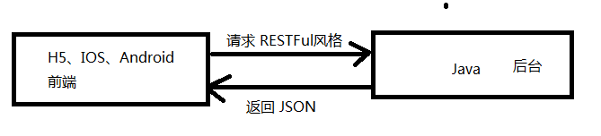

# 学习目标

```
1、拦截器
2、文件的上传下载
3、RESTFul
```

# 1、拦截器

## 1.1 拦截器概念

类似于JavaWeb中的Filter过滤器，用于过滤请求，可以对不符合要求的请求进行拦截

拦截器和过滤器的区别：

1）过滤器的使用范围比拦截器大，JavaWeb项目都可以使用，拦截器只能在SpringMVC使用

2）拦截器效率高于过滤器

### 1.2 拦截器的使用

1） 实现HandlerInterceptor接口

2）实现方法

- preHandle			   前置处理

- postHandle		     后置处理

- afterCompletion	完成后处理

```
/**
 * 登录拦截器
 */
public class LoginInterceptor implements HandlerInterceptor {

    /**
     * 前置处理
     */
    @Override
    public boolean preHandle(HttpServletRequest request, HttpServletResponse response, Object handler) throws Exception {

        //查询session是否保存用户
        User user = (User) request.getSession().getAttribute("user");
        if(user == null){
            //没有登录，重定向到login页面
            response.sendRedirect("/pages/login");
            //返回false，拦截
            return false;
        }
        //返回true，放行
        return true;
    }
}

```

3） 配置拦截器

```
	<!--配置拦截器-->
    <mvc:interceptors>
        <mvc:interceptor>
            <!--配置拦截的URL请求路径 /**代表所有请求-->
            <mvc:mapping path="/**"/>
            <!--配置不拦截的请求路径-->
            <mvc:exclude-mapping path="/**/login"/>
            <mvc:exclude-mapping path="/**/*.css"/>
            <mvc:exclude-mapping path="/**/*.js"/>
            <mvc:exclude-mapping path="/**/*.png"/>
            <mvc:exclude-mapping path="/**/*.jpg"/>
            <!--配置class-->
            <bean class="com.blb.bookms.interceptor.LoginInterceptor"/>
        </mvc:interceptor>
    </mvc:interceptors>
```


# 2、文件上传下载

## 2.1 文件上传

文件上传分为两种方式：

- 传统的Servlet文件上传

- SpringMVC文件上传

## 2.1.1 传统的Servlet文件上传

1）导入依赖

    <dependency>
        <groupId>commons-fileupload</groupId>
        <artifactId>commons-fileupload</artifactId>
        <version>1.4</version>
    </dependency>
2）编写表单

表单文件上传的三个要素：

1. form标签要添加enctype="multipart/form-data"
2. 提交方法为post
3. input类型为file
```
<form  action="/upload" method="post" enctype="multipart/form-data">
    ...
    <input type="file" name="file" >
    ...
</form>
```

2）上传方法

```
@Controller
public class UploadController {

    @RequestMapping("/upload")
    public String fileupload(HttpServletRequest request) throws Exception {
        //获取项目的upload目录路径
        String path= request.getSession().getServletContext().getRealPath("/upload/");
        File file=new File(path);
        //判断文件夹是否存在
        if (!file.exists()){
            //创建文件夹
            file.mkdirs();
        }
        //创建上传对象
        ServletFileUpload upload=new ServletFileUpload(new DiskFileItemFactory());
        //获得文件列表
        List<FileItem> fileItems= upload.parseRequest(request);
        for (FileItem item:fileItems){
            //判断文件是不是普通表单项
            if (item.isFormField()){
                //如果是普通表单项，打印表单项名和值
                System.out.println(item.getFieldName());
                System.out.println(item.getString());
            }else{
                //如果是文件，截取后缀名
                String filename= item.getName();
                String suffix = filename.substring(filename.lastIndexOf("."));
                //创建唯一的文件名
                String uuid= UUID.randomUUID().toString().replace("-","");
                filename = uuid + suffix;
                //完成文件上传
                item.write(new File(path,filename));
                System.out.println("上传完毕");
            }
        }
        //跳转到success页面
        return "success";
    }
```

## 2.1.2 SpringMVC文件上传

依赖和上面一样

```
<form  action="/upload" method="post" enctype="multipart/form-data">
    <input type="file" name="upload" >
    <button>上传</button>
</form>
```

上传方法中使用MultipartFile参数获得上传文件

```
@RequestMapping("/upload")
public String fileupload(HttpServletRequest request, MultipartFile upload) throws Exception {
    //获取项目目录下的upload目录路径
    String path = request.getSession().getServletContext().getRealPath("/upload/");
    System.out.println(path);
    File file = new File(path);
    if (!file.exists()) {
        file.mkdirs();
    }
    //获取上传文件名字
    String filename = upload.getOriginalFilename();
    String suffix = filename.substring(filename.lastIndexOf("."));
    //创建唯一的文件名
    String uuid= UUID.randomUUID().toString().replace("-","");
    filename = uuid + suffix;
    //完成文件上传
    upload.transferTo(new File(path,filename));
    return "success";
}
```

需要在springmvc的配置中添加上传处理器

```
<!--上传处理器-->
<bean class="org.springframework.web.multipart.commons.CommonsMultipartResolver" id="multipartResolver">
    <!--上传文件最大字节数-->
    <property name="maxUploadSize" value="10485760"/>
</bean>
```

## 2.1.3 SpringMVC多文件上传

给表单添加多个文件项

```
<form action="/upload" method="post" enctype="multipart/form-data">
    <input type="file" name="uploads">
    <input type="file" name="uploads">
    <input type="file" name="uploads">
    <input type="submit" value="MVC多文件上传">
</form>
```

添加MultipartFile数组为参数，参数名和表单name一致

```
@RequestMapping("/upload3")
public String fileupload3(HttpServletRequest request, MultipartFile[] uploads) throws Exception {
    //获取tomcat项目目录下的upload目录路径
    String path = request.getSession().getServletContext().getRealPath("/upload/");
    System.out.println(path);
    File file = new File(path);
    if (!file.exists()) {
        file.mkdirs();
    }
    for(MultipartFile upload : uploads) {
        //获取上传文件名字
        String filename = upload.getOriginalFilename();
        String suffix = filename.substring(filename.lastIndexOf("."));
        //创建唯一的文件名
        String uuid = UUID.randomUUID().toString().replace("-", "");
        filename = uuid + "-" + suffix;
        //完成文件上传
        upload.transferTo(new File(path, filename));
    }
    return "success";
}
```
## 2.1.4 SpringMVC其它上传类
SpringMVC还提供了其它API支持上传：
- CommonsMultipartResolver 多部分解析器，用于判断请求是否存在上传文件
- MultipartHttpServletRequest 多部分请求，用于获得文件相关信息

具体用法：
```
@RequestMapping("upload4")
public String  fileupload4(HttpServletRequest request) throws IllegalStateException, IOException
{
    String path = request.getSession().getServletContext().getRealPath("/upload/");
    //创建多部分解析器
    CommonsMultipartResolver multipartResolver=new CommonsMultipartResolver(
            request.getSession().getServletContext());
    //检查表单是否支持文件上传
    if(multipartResolver.isMultipart(request)){
        //将请求转换为多部分请求，支持上传
        MultipartHttpServletRequest multiRequest=(MultipartHttpServletRequest)request;
        //获取请求中所有的文件名
        Iterator iter=multiRequest.getFileNames();
        while(iter.hasNext()) {
            //遍历所有文件
            MultipartFile file=multiRequest.getFile(iter.next().toString());
            if(file!=null) {
                //获取上传文件名字
                String filename = file.getOriginalFilename();
                String suffix = filename.substring(filename.lastIndexOf("."));
                //创建唯一的文件名
                String uuid = UUID.randomUUID().toString().replace("-", "");
                filename = uuid + suffix;
                //上传
                file.transferTo(new File(path,filename));
            }
        }
    }
    return "success";
}
```

## 2.2 文件下载

```
/**
 * 下载控制器
 */
@Controller
public class DownloadController {

    @RequestMapping("download")
    public void download(String file,  HttpServletResponse response) throws IOException {
        //下载文件的路径
        String path = "D:\\install\\";
        File downFile = new File(path+file);
        if(downFile.exists()){
            //设置浏览器下载内容类型，响应头
            response.setContentType("application/x-msdownload");
            response.setHeader("Content-Disposition","attachment;filename="+file);
            //通过流发送文件
            Files.copy(downFile.toPath(),response.getOutputStream());
        }
    }
}
```

# 3、RestFul

## 3.1 前后端分离

### 3.1.1 前后端分离是什么

前端项目（html5、小程序、移动端），后端项目（java、数据库、tomcat）分开开发和部署

### 3.1.2 前后端分离优势

1）开发分工明确，前端团队和后端团队同时分工合作开发

2）项目分开部署不同的服务器，如：Tomcat适合部署动态资源，Nginx适合部署静态资源

3）便于测试和维护

### 3.1.3 前后端开发人员的交互方式

1）设计人员根据需求设计接口，提供接口文档

1）后端根据接口文档开发后台接口

2）前端通过接口请求数据，渲染页面




## 3.2 RESTFul

### 3.2.1 RESTFul是什么

RESTFul是一种网络应用程序的设计风格和开发方式，基于HTTP，可以使用XML格式定义或JSON格式定义。适用于移动互联网厂商作为业务使能接口的场景，实现第三方调用移动网络资源的功能，动作类型为新增、变更、删除所调用资源。

RESTful架构，是目前最流行的一种互联网软件架构。它结构清晰、符合标准、易于理解、扩展方便，所以正得到越来越多网站的采用。

### 3.2.2 RESTFul架构的特点

1)  每一个URI对应服务器上的一个资源（数据库数据、方法等）

2) 通过不同Http请求方法来区别增删改查操作

- GET   -->  查询

- POST -->  添加

- PUT --> 更新

- DELETE --> 删除

3) 通信的格式是JSON

### 3.2.3 RESTFul风格的API

传统API设计，常用动词定义API，如：find、get、save、update、delete等
```
查询所有书籍：
http://域名/book/findAll
查询一本书：
http://域名/book/findById?id=1
添加书籍：
http://域名/book/saveBook
更新书籍：
http://域名/book/updateBook
删除书籍：
http://域名/book/deleteBook?id=1
```
RESTFul风格API设计，只使用名词，使用不同的请求方法来区别增删改查
```
查询所有书籍： 	GET
http://域名/books
查询一本书：		GET
http://域名/book/1
添加书籍：		POST
http://域名/book
更新书籍：		PUT
http://域名/book
删除书籍：		DELETE
http://域名/book/1
```

Restful风格的控制器的实现

@RestController定义RestFul风格的控制器，其中所有的方法都直接返回数据，相当于加了@ResponseBody

```
@RestController
public class BookController {

    @Autowired
    private BookService bookService;
    
    @GetMapping("/books")
    public JsonResult findAll(){
        try {
            List<Book> list = bookService.list();
            return new JsonResult(1,list);
        }catch (Exception ex){
            ex.printStackTrace();
            return new JsonResult(0,null);
        }
    }
    
    @GetMapping("/book/{id}")
    public JsonResult findById(@PathVariable("id")Integer id){
        try {
            Book book = bookService.getById(id);
            return new JsonResult(1,book);
        }catch (Exception ex){
            ex.printStackTrace();
            return new JsonResult(0,null);
        }
    }


    @PostMapping("/book")
    public JsonResult saveBook(@RequestBody Book book){
        try {
            bookService.save(book);
            return new JsonResult(1,null);
        }catch (Exception ex){
            ex.printStackTrace();
            return new JsonResult(0,null);
        }
    }


    @PutMapping("/book")
    public JsonResult updateBook(@RequestBody Book book){
        try {
            bookService.updateById(book);
            return new JsonResult(1,null);
        }catch (Exception ex){
            ex.printStackTrace();
            return new JsonResult(0,null);
        }
    }


    @DeleteMapping("/book/{id}")
    public JsonResult delBook(@PathVariable("id")Integer id){
        try {
            bookService.removeById(id);
            return new JsonResult(1,null);
        }catch (Exception ex){
            ex.printStackTrace();
            return new JsonResult(0,null);
        }
    }
}

```

### 3.2.4 浏览器支持DELETE和PUT

浏览器默认只支持GET和POST请求，如果要表单提交DELETE或PUT请求，需要通过SpringMVC的过滤器来实现

web.xml添加：

```
<filter>
    <filter-name>HiddenHttpMethodFilter</filter-name>
    <filter-class>org.springframework.web.filter.HiddenHttpMethodFilter</filter-class>
</filter>
<filter-mapping>
    <filter-name>HiddenHttpMethodFilter</filter-name>
    <url-pattern>/*</url-pattern>
</filter-mapping>
```

HiddenHttpMethodFilter过滤器的作用是：过滤表单中名称为_method的隐藏域，如果值是DELETE就将请求方法转换为DELETE，是PUT就将请求方法转换为PUT。

表单

```
<form action="/testDelete" method="post">
    <input name="name" placeholder="输入姓名"><br>
    <input type="hidden" name="_method" value="DELETE"/>
    <input type="submit" value="提交">
</form>
```

