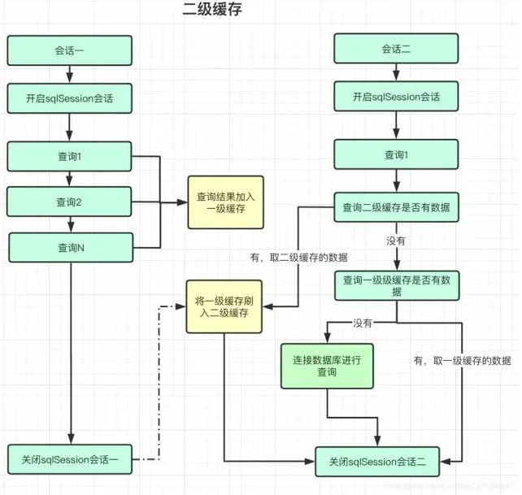

# 学习目标

```
1、动态SQL
2、关联查询
3、延迟加载
4、缓存机制
```

# 1、动态SQL

## 1.1 引入

如果我们要实现多条件的查询，该怎么设计？

一般情况下，需要使用SQL拼接的方式实现

```
String sql = "select * from phone where 1 = 1 ";
if(a != null)
{
  sql += " and a = " + a;
}
if(b != null)
{
  sql += " and b = " + b;
}
..
```

问题：	

1）Java代码中出现大量if，可读性和维护性比较差

2）拼接字符串容易出现错误

## 1.2 动态SQL简介

MyBatis的一个重要特性就是动态SQL，能通过条件动态生成SQL语句

动态SQL包含几种标签：

- sql

- if

- where

- set

- trim

- foreach

### 1.2.1 sql标签
可以通过sql标签提高sql代码的复用性
定义代码片段
```
<sql id="sql_count">select count(*)</sql>
```
使用代码片段
```
<select id="selectUserCount" resultType="String">
	<include refid="sql_count"/> from t_user
</select>
```
### 1.2.2 if标签

进行条件判断，判断成功会把if内部SQL拼接到外部SQL中，否则不拼接

```
<if test="条件">
	SQL语句
</if>
```

问题：直接使用if会出现多余的where和and、or等关键词

### 1.2.3 where标签

用于配置条件，会去掉多余的where、and、or关键词

```
select * from xx
<where>
    <if test="条件">
    	SQL语句
    </if>
</where>
```

### 1.2.4 set标签

用于配置update语句，用于去掉多余的，

```
update xx 
<set>
    <if test="条件">
    列 = 值,
    </if>
    <if test="条件">
    列 = 值,
    </if>
	...
</set>
where 条件
```

### 1.2.5 trim标签

可以删除或添加前缀和后缀，用来拼接SQL

```
<trim prefix="添加前缀" suffix="添加后缀" prefixOverride="删除后缀" suffixOverride="删除后缀">
	<if>...</if>
</trim>
```

用trim代替set

```
<trim prefix="set" suffixOverride=",">
	..
</trim>
```

### 1.2.6 foreach标签

用于循环拼接SQL

```
<foreach collection="集合参数名称" item="变量名" open="开始符号" close="结束符号" seprator="分割符" index="下标">
	#{变量名}
</foreach> 
```


# 2、关联查询

## 2.1 关联关系的分类

表之间有几种关联关系：

1. 一对一		如：一个人有一个身份证
2. 一对多		如：一个部门有多个员工
3. 多对一		如：多个员工属于一个部门
4. 多对多		如：一个学生可以选择多门课程，一门课程也有多个学生

## 2.2 MyBatis实现关联
在进行数据库查询时，会遇到多张表相互关联的情况，下面以书籍和类型为例，配置最常见的一对多关系。

## 2.3 关联配置

MyBatis映射文件中，在ResultMap里可以配置关联关系

主要有两种标签来映射关联属性：

- collection		配置集合类型的属性

- association     配置单独对象的属性

collection和association的相关参数：

- property 属性的名称
- select 查询方法
- javaType 属性的类型
- ofType 如果属性是集合，集合中对象的类型
- column 外键字段名

### 2.3.1 查询集合

配置一的一方，查询书籍类型时，能同时查询到该类型的所有书籍

1） 给类型添加书籍集合，这里需要使用collection

```
public class BookType {

  private long id;
  private String type;
  //书籍的集合
  private List<Book> books;
  ..
 }
```

2） 书籍类型Mapper接口

```
public interface IBookTypeDAO {

    /**
     * 按id查书籍类型
     * @param typeId
     * @return
     */
    BookType selectBookTypeById(int typeId);
}
```

3） 在Book映射接口中定义方法

```
    /**
     * 根据类型id查询所有书籍
     * @param typeId
     * @return
     */
    List<Book> selectBooksByTypeId(int typeId);
```

4） BookType的映射文件

```
<resultMap id="bookTypeMap" type="BookType" >
    <id property="id" column="id"></id>
    <result property="type" column="type"></result>
    <!--配置集合 property是集合属性 select是查询方法 javaType是集合类型
    ofType是集合的数据类型 column外建列作为参数传入查询方法-->
    <collection property="books" select="com.blb.bookms.dao.IBookDAO.selectBooksByTypeId"
              javaType="java.util.List"   ofType="Book" column="id">
    </collection>
</resultMap>

<select id="selectBookTypeById" resultMap="bookTypeMap" parameterType="java.lang.Integer">
        select * from tb_book_type where id = #{typeId}
</select>
```

这里使用的是子查询的机制，在查询书籍类型后，将每个类型id作为参数，调用书籍接口的selectBooksByTypeId方法查询书籍集合。

### 2.3.2 查询单个对象

配置多的一方，通过书籍查询到它所属的类型

1) 给Book添加BookType属性

```
/**
 * 书籍
 */
public class Book {

    ...

    /书籍类型
    private BookType bookType;
```

2）书籍映射文件中，使用association配置bookType属性

```
<resultMap id="bookMap" type="Book">
    <id property="id" column="id"></id>
    <result property="bookName" column="book_name"></result>
    <result property="price" column="price"></result>
    <result property="typeId" column="type_id"></result>
    <result property="author" column="author"></result>
    <result property="publishOrg" column="publish_org"></result>
    <result property="publishTime" column="publish_time"></result>
    <result property="state" column="state"></result>
    <result property="bookImage" column="book_image"></result>
    <!--映射一对一 类型-->
    <association property="bookType" javaType="BookType"
                 select="com.blb.bookms.dao.IBookTypeDAO.selectBookTypeById" column="type_id">
    </association>
</resultMap>

<select id="selectBookById" parameterType="java.lang.Integer" resultMap="bookMap">
    select * from tb_book where id = #{id}
</select>
```


#  3、延迟加载

## 3.1 引入

问题：在查询书籍类型时，如果只需要类型名称，不需要该类的书籍，但还是把书籍查询出来，岂不浪费时间？

我们需要一种机制来优化查询

## 3.2 延迟加载

延迟加载也叫懒加载，需要数据时再启动查询，是MyBatis对数据库的优化机制。

## 3.3 配置

给MyBatis添加配置

```
    <settings>
        <setting name="mapUnderscoreToCamelCase" value="true"/>
        <!-- 打印查询语句 -->
        <setting name="logImpl" value="STDOUT_LOGGING" />
        <!--配置懒加载-->
        <setting name="lazyLoadingEnabled" value="true"/>
        <!--执行所有属性按需加载-->
        <setting name="aggressiveLazyLoading" value="false"/>
    </settings>
```

## 3.4 测试

在控制台查看，查询书籍类型后，调用和不调用书籍集合属性的SQL执行情况


# 4、缓存机制

## 4.1 缓存概述

将数据库的数据保存到内存或磁盘上，查询数据时直接访问内存或磁盘，减少对数据库的访问。

缓存作用：

1）减少数据库的负担，因为数据库连接数有限，并发量大的情况下，数据库连接耗尽，造成用户长期等待或者数据库宕机。

2）提升性能，对数据库的访问是通过TCP/IP网络进行访问，速度比较慢，通过缓存可以提高访问速度。

## 4.2 MyBatis缓存机制

### 4.3.1 MyBatis两级缓存

1. 一级缓存

   范围：SqlSession

   同一个SqlSession对象访问的数据，可以被缓存，下次访问直接获得不用查数据库

   默认开启，Spring整合MyBatis默认是没有开启

   失效的情况：

   1）创建新的SQLSession

   2）对缓存中的对象进行修改

2. 二级缓存

   范围：SQLSessionFactory

   同一个SqlSessionFactory创建的所有SQLSession能共享缓存对象

   默认开启

   1）cacheEnabled 配置为true

   2）在对应的映射文件上加<cache/>标签

   3）实体类需要序列化

### 4.3.2 缓存执行流程

