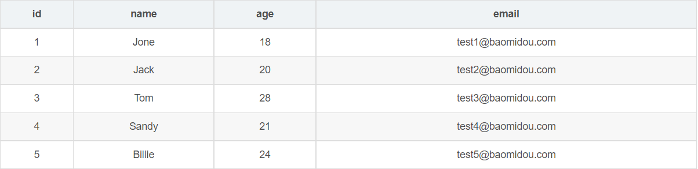
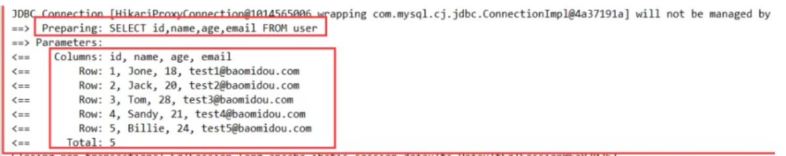
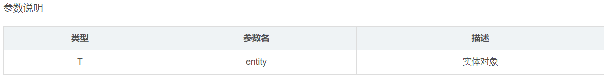
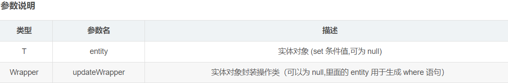
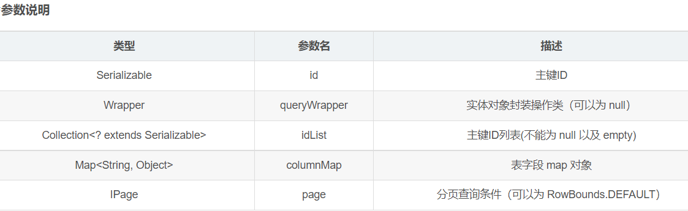
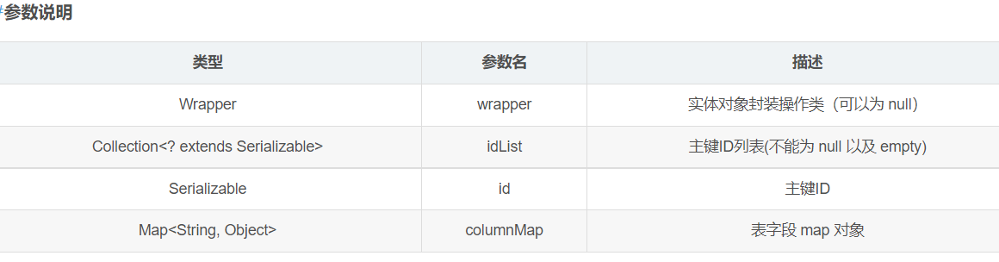
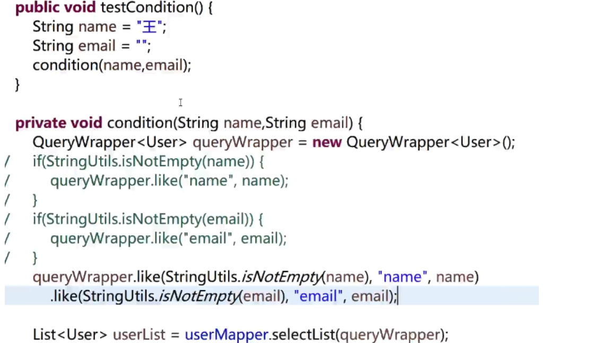

[TOC]

## 简介

MyBatis-Plus（简称 MP）是一个 MyBatis 的增强工具，在 MyBatis 的基础上只做增强不做改变，为简化开发、提高效率而生。

官方地址：https://mp.baomidou.com/

## 特性

- 无侵入：只做增强不做改变，引入它不会对现有工程产生影响，如丝般顺滑
- 损耗小：启动即会自动注入基本 CURD，性能基本无损耗，直接面向对象操作
- 强大的 CRUD 操作：内置通用 Mapper、通用 Service，仅仅通过少量配置即可实现单表大部分 CRUD 操作，更有强大的条件构造器，满足各类使用需求
- 支持 Lambda 形式调用：通过 Lambda 表达式，方便的编写各类查询条件，无需再担心字段写错
- 支持主键自动生成：支持多达 4 种主键策略（内含分布式唯一 ID 生成器 - Sequence），可自由配置，完美解决主键问题
- 支持 ActiveRecord 模式：支持 ActiveRecord 形式调用，实体类只需继承 Model 类即可进行强大的 CRUD 操作
- 支持自定义全局通用操作：支持全局通用方法注入（ Write once, use anywhere ）
- 内置代码生成器：采用代码或者 Maven 插件可快速生成 Mapper 、 Model 、 Service 、 Controller 层代码，支持模板引擎，更有超多自定义配置等您来使用
- 内置分页插件：基于 MyBatis 物理分页，开发者无需关心具体操作，配置好插件之后，写分页等同于普通 List 查询
- 分页插件支持多种数据库：支持 MySQL、MariaDB、Oracle、DB2、H2、HSQL、SQLite、Postgre、SQLServer 等多种数据库
- 内置性能分析插件：可输出 Sql 语句以及其执行时间，建议开发测试时启用该功能，能快速揪出慢查询
- 内置全局拦截插件：提供全表 delete 、 update 操作智能分析阻断，也可自定义拦截规则，预防误操作

## 支持数据库

- mysql 、 mariadb 、 oracle 、 db2 、 h2 、 hsql 、 sqlite 、 postgresql 、 sqlserver
- 达梦数据库 、 虚谷数据库 、 人大金仓数据库

## 快速指南

我们将通过一个简单的 Demo 来阐述 MyBatis-Plus 的强大功能，在此之前，我们假设您已经：

- 拥有 Java 开发环境以及相应 IDE
- 熟悉 Spring Boot
- 熟悉 Maven

使用第三方组件：

1. 导入对应的依赖
2. 研究依赖如何配置

3. 代码如何编写
4. 提高扩展技术的能力

### 1、创建数据库 `mybatis_plus`

现有一张 `User` 表，其表结构如下：



其对应的数据库 Schema 脚本如下：

```
DROP TABLE IF EXISTS user;

CREATE TABLE user
(
	id BIGINT(20) NOT NULL COMMENT '主键ID',
	name VARCHAR(30) NULL DEFAULT NULL COMMENT '姓名',
	age INT(11) NULL DEFAULT NULL COMMENT '年龄',
	email VARCHAR(50) NULL DEFAULT NULL COMMENT '邮箱',
	PRIMARY KEY (id)
);
-- 真实开发中，version（乐观锁），deleted（逻辑删除）、gmt_create、gem_mo

```

其对应的数据库 Data 脚本如下：

```
DELETE FROM user;

INSERT INTO user (id, name, age, email) VALUES
(1, 'Jone', 18, 'test1@baomidou.com'),
(2, 'Jack', 20, 'test2@baomidou.com'),
(3, 'Tom', 28, 'test3@baomidou.com'),
(4, 'Sandy', 21, 'test4@baomidou.com'),
(5, 'Billie', 24, 'test5@baomidou.com');

```

### 2、导入相应的依赖

```
	<dependency>
         <groupId>mysql</groupId>
         <artifactId>mysql-connector-java</artifactId>
         <scope>runtime</scope>
     </dependency>
<!--mybatis-plus 是自己开发的，非官方的！-->
	<dependency>
        <groupId>com.baomidou</groupId>
        <artifactId>mybatis-plus-boot-starter</artifactId>
        <version>3.3.1.tmp</version>
    </dependency>
<!--lombok-->
	 <dependency>
         <groupId>org.projectlombok</groupId>
         <artifactId>lombok</artifactId>
         <version>1.18.10</version>
         <scope>provided</scope>
     </dependency>

```

说明：我们使用mybatis-plus可以节省我们大量的代码，尽量不要同时导入mybatis和mybatis-plus！ 版本的差异！

### 3、连接数据库

```
# mysql 5 驱动不同 com.mysql.jsbc.Driver

# mysql 8 驱动不同 com.mysql.cj.jsbc.Driver、需要增加时区的配置
spring.datasource.username=root
spring.datasource.password=123
spring.datasource.url=jdbc:mysql://localhost:3306/mybatis_plus?useSSL=false&useUnicode=true&characterEncoding=utf-8&serverTimezone=GMT%2B8
spring.datasource.driver-class-name=com.mysql.cj.jdbc.Driver

```

### 4、编写代码

pojo–>dao–>(连接mybatis，配置mapper.xml文件)–>service-controller (传统方式 )

 使用mybatis-plus之后

```
* pojo
* dao接口（不用写mapper.xml文件）
* 使用
```

编写实体类 `User.java`（此处使用了 [Lombok](https://www.projectlombok.org/) 简化代码）

```
@Data
public class User {
    private Long id;
    private String name;
    private Integer age;
    private String email;
}

```

编写Mapper类 `UserMapper.java`

```
//在对应的Mapper上继承基本的类baseMapper
public interface UserMapper extends BaseMapper<User> {
    //所有的CRUD已经编写完成
    //不需要像以前的配置一些xml

}

```

在 Spring Boot 启动类中添加 `@MapperScan` 注解，扫描 Mapper 文件夹：

```
@SpringBootApplication
@MapperScan("com.baomidou.mybatisplus.mapper")//扫描mapper文件夹
public class Application {

    public static void main(String[] args) {
        SpringApplication.run(QuickStartApplication.class, args);
    }

}

```

添加测试类，进行功能测试：

```
@RunWith(SpringRunner.class)
@SpringBootTest
public class SampleTest {

    @Autowired
    private UserMapper userMapper;

    @Test
    public void testSelect() {
        System.out.println(("----- selectAll method test ------"));
        //参数是一个Wrapper，条件结构器，这里先不用 填null
        //查询所有的用户 
        List<User> userList = userMapper.selectList(null);
        Assert.assertEquals(5, userList.size());
        userList.forEach(System.out::println);
    }

}

```

UserMapper 中的 `selectList()` 方法的参数为 MP 内置的条件封装器 `Wrapper`，所以不填写就是无任何条件

控制台输出：

```
User(id=1, name=Jone, age=18, email=test1@baomidou.com)
User(id=2, name=Jack, age=20, email=test2@baomidou.com)
User(id=3, name=Tom, age=28, email=test3@baomidou.com)
User(id=4, name=Sandy, age=21, email=test4@baomidou.com)
User(id=5, name=Billie, age=24, email=test5@baomidou.com)
```

### 5、小结

通过以上几个简单的步骤，我们就实现了 User 表的 CRUD 功能，甚至连 XML 文件都不用编写！

从以上步骤中，我们可以看到集成MyBatis-Plus非常的简单，只需要引入 starter 工程，并配置 mapper 扫描路径即可。

但 MyBatis-Plus 的强大远不止这些功能，想要详细了解 MyBatis-Plus 的强大功能？那就继续往下看吧！

## 配置日志

我们所用的sql现在是不可见的，我们希望知道他是怎么执行的，所以我们必须要查看日志！

```
#配置日志
mybatis-plus.configuration.log-impl=org.apache.ibatis.logging.stdout.StdouImpl

```



## 常用注解

@TableName("表名")

当表名与实体类名不一致时，可以在实体类上加入@TableName（）声明

`@TableId`声明属性为表中的主键（若属性名称不为默认id）

`@TableFieId("字段")` 当实体类属性与表字段不一致时，可以用来声明

```
@TableName("表名")
public class User{
    
    @TableId
    private Long userId;
    @TableFieId("name")
    private String realName
        
}  

```

## CRUD

### Insert 插入

```
// 插入一条记录
int insert(T entity);

```



**举例测试**

```

@Test
    public void testInsert() {
        System.out.println(("----- selectAll method test ------"));
        User user = new User();
        user.setName=("shuishui");
        user.setAge(3);
        user.setEmail("12434141@qq.com");
        
        userMapper.insert(user);
    }

```

### 主键生成策略

我们需要配置主键自增

1、实体类字段上 @TableId（type =IdType.AUTO）


2、数据库字段一定要是自增的

```
public enum IdType {
    AUTO(0),   //数据可id自增
    NONE(1),   //未设置主键
    INPUT(2),   //手动输入
    ID_WORKER(3), //默认的全局唯一id
    UUID(4),  //全局唯一id uuid
    ID_WORKER_STR(5); // ID_WORKEK 字符串表示法

    private int key;

    private IdType(int key) {
        this.key = key;
    }

    public int getKey() {
        return this.key;
    }
}

```

### 更新操作

```
// 根据 whereEntity 条件，更新记录
int update(@Param(Constants.ENTITY) T entity, @Param(Constants.WRAPPER) Wrapper<T> updateWrapper);
// 根据 ID 修改
int updateById(@Param(Constants.ENTITY) T entity);

```

##### 

**举例测试**

```
@Test
    public void testUpdate() {
        //sql自动动态配置
        User user = new User();
        user.setName=("shui");
        user.setId(3L);
        user.setAge("18");
        
        //注意：updateById的参数是一个对象
        userMapper.updateById(user);
    }

```

创建时间、修改时间！这些个操作一遍都是自动化完成，我们不希望手动更新！

阿里巴巴开发手册：所有的数据库表：gmt_create\gmt_modified几乎所有的表都要配置上！而且需要自动化

**方式一**：数据库级别

 在表中新增字段 create_time 、update_time(默认CURRENT_TIMESIAMP)

**方式二**：代码级别

 实体类上的属性需要增加注解@TableField

```

//创建时间
@TableField(fill = FieldFill.INSERT)
private Date createTime;

//更新时间 
@TableField(fill = FieldFill.INSERT_UPDATE)
private Date updateTime;

```

 编写处理器来处理这个注释即可！

```
@Slf4j
@Component
public class MyMetaObjectHandler implements MetaObjectHandler {

    //插入时候的填充策略
    @Override
    @Componcent  //一定不要忘记吧处理器加到IOC容器中
    public void insertFill(MetaObject metaObject) {
        log.info("start insert fill ....");  //日志
        //设置字段的值（String fieldName字段名,Object fieldVal要传递的值,MetaObject metaObject)
        this.setFieldVaLByName("createTime",new Date(),metaObject);
        this.setFieldVaLByName("createTime",new Date(),metaObject);
        
        
        //this.strictInsertFill(metaObject, "createTime", LocalDateTime.class, LocalDateTime.now()); // 起始版本 3.3.0(推荐使用)
       // this.fillStrategy(metaObject, "createTime", LocalDateTime.now()); // 也可以使用(3.3.0 该方法有bug请升级到之后的版本如`3.3.1.8-SNAPSHOT`)
        /* 上面选其一使用,下面的已过时(注意 strictInsertFill 有多个方法,详细查看源码) */
        //this.setFieldValByName("operator", "Jerry", metaObject);
        //this.setInsertFieldValByName("operator", "Jerry", metaObject);
    }

    //更新时间的填充策略
    @Override
    public void updateFill(MetaObject metaObject) {
        log.info("start update fill ....");
        this.setFieldVaLByName("createTime",new Date(),metaObject);
        
        
        //this.strictUpdateFill(metaObject, "updateTime", LocalDateTime.class, LocalDateTime.now()); // 起始版本 3.3.0(推荐使用)
       // this.fillStrategy(metaObject, "updateTime", LocalDateTime.now()); // 也可以使用(3.3.0 该方法有bug请升级到之后的版本如`3.3.1.8-SNAPSHOT`)
        /* 上面选其一使用,下面的已过时(注意 strictUpdateFill 有多个方法,详细查看源码) */
        //this.setFieldValByName("operator", "Tom", metaObject);
        //this.setUpdateFieldValByName("operator", "Tom", metaObject);
    }
}
```

### 查询操作

```
// 根据 ID 查询
T selectById(Serializable id);
// 根据 entity 条件，查询一条记录
T selectOne(@Param(Constants.WRAPPER) Wrapper<T> queryWrapper);

// 查询（根据ID 批量查询）
List<T> selectBatchIds(@Param(Constants.COLLECTION) Collection<? extends Serializable> idList);
// 根据 entity 条件，查询全部记录
List<T> selectList(@Param(Constants.WRAPPER) Wrapper<T> queryWrapper);
// 查询（根据 columnMap 条件）
List<T> selectByMap(@Param(Constants.COLUMN_MAP) Map<String, Object> columnMap);
// 根据 Wrapper 条件，查询全部记录
List<Map<String, Object>> selectMaps(@Param(Constants.WRAPPER) Wrapper<T> queryWrapper);
// 根据 Wrapper 条件，查询全部记录。注意： 只返回第一个字段的值
List<Object> selectObjs(@Param(Constants.WRAPPER) Wrapper<T> queryWrapper);

// 根据 entity 条件，查询全部记录（并翻页）
IPage<T> selectPage(IPage<T> page, @Param(Constants.WRAPPER) Wrapper<T> queryWrapper);
// 根据 Wrapper 条件，查询全部记录（并翻页）
IPage<Map<String, Object>> selectMapsPage(IPage<T> page, @Param(Constants.WRAPPER) Wrapper<T> queryWrapper);
// 根据 Wrapper 条件，查询总记录数
Integer selectCount(@Param(Constants.WRAPPER) Wrapper<T> queryWrapper);

```



**实例测试**

```
@Test
public void testSelectById(){
    User user =userMapper.selectById(1);
    System.out.println(user)
}

//测试批量查询
@Test
public void testSelectByBatchId(){
    List<User> user =userMapper.selectBatchIds(Arrays.asList(1,2,3));
    users.forEach(System.out::println)
}

//条件查询
public void testSelectByBatchIds(){
    HashMap<String,Object> map=new HashMap<>();
    //自定义查询
    map.put("name","shuishui");
    map.put("age",3);
    
    List<User> user = userMapper.selectByMap(map);
    users.forEach(System.out::println);
}

```

### 自定义sql

在Mapper文件中定义一个方法

```
@Select("select * from user ${ew.customSqlSegment}")
List<User> selectAll(@Param(Constants.WRAPPER)Wrapper<User> wrapper);

```

在application中加入扫描mapper文件路径

```
mybatis-plus:
 mapper-locations: com/mp/mapper/*

```

在Mapper.xml中写sql

```
<mapper namespace="com.mp.dao.UserMapper">
	<select id="selectAll" resultType="com.mp.entity.User">
    	select * from user ${ew.customSqlSegment}
    </select>
</mapper>

```

### 分页查询

分页在网站使用的十分多

1、原始的limit进行分页

2、pageHelper 第三方插件

3、Mybatis-Plus中也内置了分页插件！

#### Mybatis-Plus分页插件

1、配置拦截器组件即可

```
//Spring boot方式
@EnableTransactionManagement
@Configuration
@MapperScan("com.baomidou.cloud.service.*.mapper*")
public class MybatisPlusConfig {

    @Bean
    public PaginationInterceptor paginationInterceptor() {
        PaginationInterceptor paginationInterceptor = new PaginationInterceptor();
        // 设置请求的页面大于最大页后操作， true调回到首页，false 继续请求  默认false
        // paginationInterceptor.setOverflow(false);
        // 设置最大单页限制数量，默认 500 条，-1 不受限制
        // paginationInterceptor.setLimit(500);
        // 开启 count 的 join 优化,只针对部分 left join
        paginationInterceptor.setCountSqlParser(new JsqlParserCountOptimize(true));
        return paginationInterceptor;
    }
}

```

2、写测试

```
//测试分页查询
@Test
pulic void testPage(){
    // 参数一：当前页
    // 参数二：页面大小
    // 使用了分页插件之后，所有的分页操作也变得简单了
    Page<User> page =new Page<>(2,5);
    userMapper.selectPage(page,null);
    
    page.getRecords().forEach(System.out::println);
    //获取总数
    page.getTotal();
}

```

### 删除

```
// 根据 entity 条件，删除记录
int delete(@Param(Constants.WRAPPER) Wrapper<T> wrapper);
// 删除（根据ID 批量删除）
int deleteBatchIds(@Param(Constants.COLLECTION) Collection<? extends Serializable> idList);
// 根据 ID 删除
int deleteById(Serializable id);
// 根据 columnMap 条件，删除记录
int deleteByMap(@Param(Constants.COLUMN_MAP) Map<String, Object> columnMap);

```



测试

```
@Test
public void testDeleteById(){
    userMapper.deleteById(1);
}

//批量删除
@Test
public void testDeleteBatchId(){
    userMapper.deleteBatchIds(Arrays.asList(1,2));
}

//条件删除
@Test
public void testDeleteMap(){
    HashMap<String,Object> map = new HashMap<>();
    map.put("name","shuishui");
    userMapper.deleteByMap(Map);
}

```

## 通用service

1、创建一个service接口：

```
public interface UserService extends IService<User>{
    
}

```

2、创建实现类

```
public class UserServiceImpl extend ServiceImol<UserMapper,User> implements UserService{
    
}

```

3、测试方法

```
@RunWith(SpringRunner.class)
@SpringBootTest
public class ServiceTest{
    
    @Autowired
    private UserService userService;
    
    //取一个值
    @Test
    public void getOne(){
        User one = userService.getOne(Wrapper.<User>lambdaQuery().gt(User::getAge,25),false);
        
    }
    
    //批量插入
    @Test 
    public void batch(){
        User user1= new User();
        user1.steName("shui");
        user1.setAge("28");
        
        User user2= new User();
        user1.steName("shui2");
        user1.setAge("29");
        List<User> userList =Arrays.asList(user1,user2);
        userService.saveBatch(userList);
    }
    
    @Test 
    public void chain(){
     //查询
     userService.lambdaQuery().ge(User::getAge,25).like(User::getName,"雨").list();
    }
        
}

```

## 条件构造器（Wrapper）

我们写一些复杂的sql可以用它来完成

```
@Test
void contextLoads(){
    // 查询name不为null的用户，并且邮箱不为null的永不，年龄大于等于20的用户
    QueryWrapper<User> wrapper =new QueryWrapper<>();
    wrapper.isNotNull("name");
    wrapper.isNotNull("email");
    wrapper.ge("age",12);
    userMapper.selectList(wrapper).forEach(System.out::println);
}

@Test
void test2(){
    // 查询name为shuishui的用户
    QueryWrapper<User> wrapper =new QueryWrapper<>();
    wrapper.eq("name","shuishui");
    User user=userMapper.selectList(wrapper)
    System.out.println（user）;
}

@Test
void test3(){
    // 查询年龄在20~30岁之间的用户
    QueryWrapper<User> wrapper =new QueryWrapper<>();
    wrapper.between("age",20,30);
    Integer count =userMapper.selectCount(wrapper);//查询结果数
    System.out.println（count）;
}

//模糊查询
@Test
void test4(){
    QueryWrapper<User> wrapper =new QueryWrapper<>();
    
    wrapper.notLike("name",“s”);//相当于NOT LIKE '%s%'
    wrapper.likeRight("email",“s”);//相当于LIKE 's%'
    List<Map<String,Object>>maps =userMapper.selectMaps(wrapper);//查询结果数
    maps.forEach(System.out::println);
}


@Test
void test5(){
    QueryWrapper<User> wrapper =new QueryWrapper<>();
    //子查询
    wrapper.insql("id","select id from user where id<3");
    List<Object> objects =userMapper.selectobjs(wrapper);
    objects.forEach(System.out::println);
}
    
@Test
void test6(){
    QueryWrapper<User> wrapper =new QueryWrapper<>();
    //通过id进行排序
    wrapper.orderByAsc("id");
    List<User> users =userMapper.selectList(wrapper);
    objects.forEach(System.out::println);
}

//姓王年龄大于等于25，按年龄降序，年龄相同按id升序排列
void test7(){
    QueryWrapper<User> wrapper =new QueryWrapper<>();
   wrapper.likeRoght("name","王").or().ge("age",25).ordeiByDesc("age").orderByAsc("id");
    List<User> users =userMapper.selectList(wrapper);
    objects.forEach(System.out::println);
}

//创建日期为2019年2月14日并且直属上级为姓王
void test8(){
    QueryWrapper<User> wrapper =new QueryWrapper<>();
    wrapper.apply("date_fromat(create_time,'%Y-%m-%d')='2019-02-14'").inSql("manager_id","select id from user where name like '王%'");
    List<User> users =userMapper.selectList(wrapper);
    objects.forEach(System.out::println);
}

//姓王并且（年龄小于40或者邮箱不为空）
void test9(){
    QueryWrapper<User> wrapper =new QueryWrapper<>();
    //lt小于，gt大于
    wrapper.likeRoght("name","王").and(wq->wa.lt("age",40).or().isNotNull("email"))
    List<User> users =userMapper.selectList(wrapper);
    objects.forEach(System.out::println);
}

//不列出所有字段
@Test
void test10(){
    QueryWrapper<User> wrapper =new QueryWrapper<>();
    
    wrapper.select("id","name").like("name","雨").lt("age",40);
    //不显示时间和id
    //wrapper.select(User.class,info->!info.getColumn().equals("create_time")&&!info.getColumn().equals("manager_id")).like("name","雨").lt("age",40);
    List<User> users =userMapper.selectList(wrapper);
    objects.forEach(System.out::println);
}

```

### condition的用法



### alleq的用法

```
allEq(Map<R, V> params)
allEq(Map<R, V> params, boolean null2IsNull)
allEq(boolean condition, Map<R, V> params, boolean null2IsNull)
```

params : key为数据库字段名,value为字段值
null2IsNull : 为true则在map的value为null时调用 isNull 方法,为false时则忽略value为null的

- 例1: allEq({id:1,name:"老王",age:null})—>id = 1 and name = '老王' and age is null
- 例2: allEq({id:1,name:"老王",age:null}, false)—>id = 1 and name = '老王'
  

```
allEq(BiPredicate<R, V> filter, Map<R, V> params)
allEq(BiPredicate<R, V> filter, Map<R, V> params, boolean null2IsNull)
allEq(boolean condition, BiPredicate<R, V> filter, Map<R, V> params, boolean null2IsNull) 
```

filter : 过滤函数,是否允许字段传入比对条件中
params 与 null2IsNull : 同上

- 例1: allEq((k,v) -> k.indexOf("a") >= 0, {id:1,name:"老王",age:null})—>name = '老王' and age is null
- 例2: allEq((k,v) -> k.indexOf("a") >= 0, {id:1,name:"老王",age:null}, false)—>name = '老王'

测试案例

```
@Test
void selecrAlleq(){
    QueryWrapper<User> wrapper =new QueryWrapper<>();
    Map<String,Object> params=new HashMap<String,Object>();
    params.put("name","水");
    params.put("age",25);
    wrapper.allEq(params);
   
    List<User> users =userMapper.selectList(wrapper);
    users.forEach(System.out::println);
}
```

### Lambda 条件构造器

```
@Test
public void selectLambda(){
    // LambdaQueryWrapper<User> lambda =new QueryWrapper<User>().lambda();
    // LambdaQueryWrapper<User> lambda =new LambdaQueryWrapper<User>();
    LambdaQueryWrapper<User> lambda =new Wrapper.<User>lambdaQuery();
    lambda.like(User::getName,"雨").lt(User::getAge,40);   //写错会直接爆红
    List<user> userList =userMapper.selectList(lambdaQuery);
    userList.forEach(System.out::println);
}

```

## AR模式

通过实体类对象直接实现CRUD

```
@Data
@EqualsAndHashCode(callSuper = false)
public class User extends Model<User> {

    private static final long serialVersionUID = 1L;

    @ApiModelProperty(value = "用户id")
    private String userId;
}

```

dao层Mapper接口操作：

```
public interface UserMapper extends BaseMapper<RentDetail> {

}

```

测试

```
// 测试插入
@Test
public void insert(){
    User user =new User();
    user.setName("水");
    user.setAge(29);
    ...
    user.insert();  //不用再调用mapper接口，直接实现
}

// 测试查询
@Test
public void select(){
    User user =new User();
    user.selectById(1);
}
@Test
public void select2(){
    User user =new User();
    user.setId(1);
    user.selectById();
}

//测试更新
@Test
public void update(){
    User user =new User();
    user.setId(1);
    user.setName("火")
    user.updateById();
}

//测试删除
@Test
public void delete(){
    User user =new User();
    user.setId(1);
    user.deleteById();
}

```

