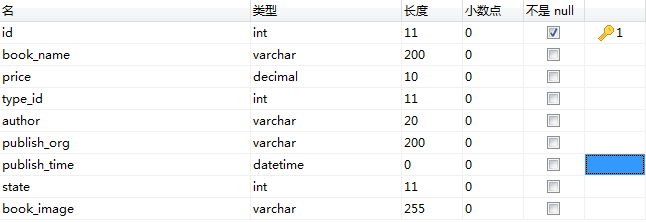
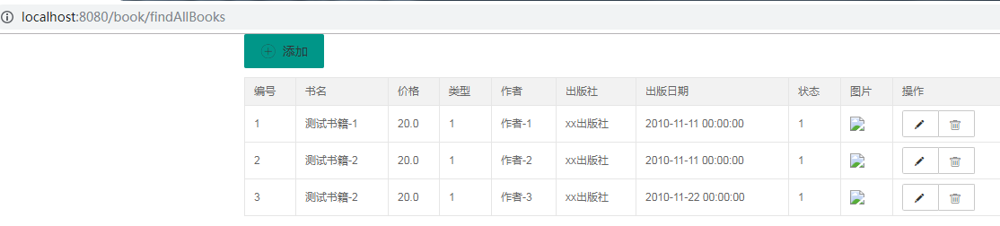

# 学习目标

```
1、SSM整合
2、事务
```

# 1、SSM整合

## 1.1 概述

在进行企业级项目开发时，我们需要将Spring、SpringMVC、MyBatis框架整合起来，共同完成开发工作。

SSM分工：

- Spring		    作为基础框架，整合其他框架
- SpringMVC    作为Web开发框架，提供服务器开发支持
- MyBatis          作为ORM框架，提供数据库开发支持

## 1.2 整合配置

1、添加依赖

```
		<dependency>
            <groupId>mysql</groupId>
            <artifactId>mysql-connector-java</artifactId>
            <version>8.0.16</version>
        </dependency>

        <!-- https://mvnrepository.com/artifact/com.mchange/c3p0 -->
        <dependency>
            <groupId>com.mchange</groupId>
            <artifactId>c3p0</artifactId>
            <version>0.9.5.2</version>
        </dependency>

        <!-- https://mvnrepository.com/artifact/javax.servlet/javax.servlet-api -->
        <dependency>
            <groupId>javax.servlet</groupId>
            <artifactId>javax.servlet-api</artifactId>
            <version>3.1.0</version>
            <scope>provided</scope>
        </dependency>

        <dependency>
            <groupId>org.apache.taglibs</groupId>
            <artifactId>taglibs-standard-impl</artifactId>
            <version>1.2.5</version>
        </dependency>

        <dependency>
            <groupId>org.apache.taglibs</groupId>
            <artifactId>taglibs-standard-compat</artifactId>
            <version>1.2.5</version>
        </dependency>

        <dependency>
            <groupId>org.apache.taglibs</groupId>
            <artifactId>taglibs-standard-jstlel</artifactId>
            <version>1.2.5</version>
        </dependency>

        <dependency>
            <groupId>org.apache.taglibs</groupId>
            <artifactId>taglibs-standard-spec</artifactId>
            <version>1.2.5</version>
        </dependency>

        <!-- https://mvnrepository.com/artifact/org.springframework/spring-context -->
        <dependency>
            <groupId>org.springframework</groupId>
            <artifactId>spring-context</artifactId>
            <version>5.2.8.RELEASE</version>
        </dependency>

        <!-- https://mvnrepository.com/artifact/org.springframework/spring-context -->
        <dependency>
            <groupId>org.springframework</groupId>
            <artifactId>spring-webmvc</artifactId>
            <version>5.2.8.RELEASE</version>
        </dependency>

        <!-- https://mvnrepository.com/artifact/org.springframework/spring-context -->
        <dependency>
            <groupId>org.springframework</groupId>
            <artifactId>spring-test</artifactId>
            <version>5.2.8.RELEASE</version>
        </dependency>

        <!-- https://mvnrepository.com/artifact/org.springframework/spring-context -->
        <dependency>
            <groupId>org.springframework</groupId>
            <artifactId>spring-jdbc</artifactId>
            <version>5.2.8.RELEASE</version>
        </dependency>

        <!-- https://mvnrepository.com/artifact/org.mybatis/mybatis -->
        <dependency>
            <groupId>org.mybatis</groupId>
            <artifactId>mybatis</artifactId>
            <version>3.5.5</version>
        </dependency>

        <dependency>
            <groupId>org.mybatis</groupId>
            <artifactId>mybatis-spring</artifactId>
            <version>2.0.5</version>
        </dependency>
```

2、SpringMVC的配置 spring-mvc.xml

```
<?xml version="1.0" encoding="UTF-8"?>
<beans xmlns="http://www.springframework.org/schema/beans"
       xmlns:xsi="http://www.w3.org/2001/XMLSchema-instance"
       xmlns:context="http://www.springframework.org/schema/context"
       xmlns:mvc="http://www.springframework.org/schema/mvc"
       xsi:schemaLocation="http://www.springframework.org/schema/beans http://www.springframework.org/schema/beans/spring-beans.xsd http://www.springframework.org/schema/context https://www.springframework.org/schema/context/spring-context.xsd http://www.springframework.org/schema/mvc https://www.springframework.org/schema/mvc/spring-mvc.xsd">
    <!--配置视图处理器-->
    <bean id="viewResolver" class="org.springframework.web.servlet.view.InternalResourceViewResolver">
        <property name="prefix" value="/WEB-INF/pages/"></property>
        <property name="suffix" value=".jsp"></property>
    </bean>

    <mvc:default-servlet-handler/>
    <mvc:annotation-driven/>
</beans>
```

3、MyBatis基础设置 mybatis-config.xml

```
<?xml version="1.0" encoding="UTF-8"?>
<!DOCTYPE configuration
        PUBLIC "-//mybatis.org//DTD Config 3.0//EN"
        "http://mybatis.org/dtd/mybatis-3-config.dtd">
<configuration>
    <settings>
        <!-- 下划线转驼峰命名 -->
        <setting name="mapUnderscoreToCamelCase" value="true"/>
        <!-- 打印查询语句 -->
        <setting name="logImpl" value="STDOUT_LOGGING" />
        <!--配置懒加载-->
        <setting name="lazyLoadingEnabled" value="true"/>
        <!--执行所有属性按需加载-->
        <setting name="aggressiveLazyLoading" value="false"/>
    </settings>
</configuration>
```

4、Spring整合MyBatis配置 spring-mybatis.xml

```
<?xml version="1.0" encoding="UTF-8"?>
<beans xmlns="http://www.springframework.org/schema/beans"
       xmlns:xsi="http://www.w3.org/2001/XMLSchema-instance"
       xmlns:context="http://www.springframework.org/schema/context"
       xsi:schemaLocation="http://www.springframework.org/schema/beans http://www.springframework.org/schema/beans/spring-beans.xsd http://www.springframework.org/schema/context https://www.springframework.org/schema/context/spring-context.xsd">

    <!--配置C3P0数据源-->
    <bean id="dataSource" class="com.mchange.v2.c3p0.ComboPooledDataSource">
        <!--jdbc的配置-->
        <property name="driverClass" value="com.mysql.cj.jdbc.Driver"></property>
        <property name="jdbcUrl" value="jdbc:mysql://localhost:3306/book_db?useUnicode=true&amp;characterEncoding=UTF-8&amp;serverTimezone=UTC&amp;useSSL=false"></property>
        <property name="user" value="root"></property>
        <property name="password" value="123456"></property>
        <!--非必须-->
        <property name="maxPoolSize" value="100"></property>
        <property name="minPoolSize" value="10"></property>
        <property name="initialPoolSize" value="10"></property>
        <property name="maxStatements" value="200"></property>
    </bean>
    <!--配置会话工厂-->
    <bean id="sqlSessionFactory" class="org.mybatis.spring.SqlSessionFactoryBean">
        <!--配置数据源-->
        <property name="dataSource" ref="dataSource"></property>
        <!--包的别名-->
        <property name="typeAliasesPackage" value="com.blb.bookms.entity"></property>
        <!--MyBatis配置文件路径-->
        <property name="configLocation" value="classpath:mybatis-config.xml"/>
        <!--映射文件的路径-->
        <property name="mapperLocations" value="classpath:mappers/*.xml"></property>
    </bean>
    <!--配置映射接口的扫描器-->
    <bean class="org.mybatis.spring.mapper.MapperScannerConfigurer">
        <!--会话工厂名称-->
        <property name="sqlSessionFactoryBeanName" value="sqlSessionFactory"></property>
        <!--接口的包位置-->
        <property name="basePackage" value="com.blb.bookms.dao"></property>
    </bean>
</beans>
```

5、Spring配置文件，导入SpringMVC和MyBatis配置

```
<?xml version="1.0" encoding="UTF-8"?>
<beans xmlns="http://www.springframework.org/schema/beans"
       xmlns:xsi="http://www.w3.org/2001/XMLSchema-instance"
       xmlns:context="http://www.springframework.org/schema/context"
       xsi:schemaLocation="http://www.springframework.org/schema/beans http://www.springframework.org/schema/beans/spring-beans.xsd http://www.springframework.org/schema/context https://www.springframework.org/schema/context/spring-context.xsd">

    <context:component-scan base-package="com.blb.bookms"></context:component-scan>

    <import resource="spring-mvc.xml"></import>
    <import resource="spring-mybatis.xml"></import>
</beans>
```

6、web.xml

```
<?xml version="1.0" encoding="UTF-8"?>
<web-app xmlns:xsi="http://www.w3.org/2001/XMLSchema-instance"
         xmlns="http://xmlns.jcp.org/xml/ns/javaee"
         xsi:schemaLocation="http://xmlns.jcp.org/xml/ns/javaee http://xmlns.jcp.org/xml/ns/javaee/web-app_3_1.xsd"
         id="WebApp_ID" version="3.1">
  <display-name>Archetype Created Web Application</display-name>
  
  <servlet>
    <servlet-name>dispatcherServlet</servlet-name>
    <servlet-class>org.springframework.web.servlet.DispatcherServlet</servlet-class>
    <init-param>
      <param-name>contextConfigLocation</param-name>
      <param-value>classpath:spring.xml</param-value>
    </init-param>
    <load-on-startup>1</load-on-startup>
  </servlet>
  <servlet-mapping>
    <servlet-name>dispatcherServlet</servlet-name>
    <url-pattern>/</url-pattern>
  </servlet-mapping>

  <filter>
    <filter-name>encodingFilter</filter-name>
    <filter-class>org.springframework.web.filter.CharacterEncodingFilter</filter-class>
    <init-param>
      <param-name>encoding</param-name>
      <param-value>UTF-8</param-value>
    </init-param>
    <init-param>
      <param-name>forceEncoding</param-name>
      <param-value>true</param-value>
    </init-param>
  </filter>
  <filter-mapping>
    <filter-name>encodingFilter</filter-name>
    <url-pattern>/*</url-pattern>
  </filter-mapping>
</web-app>
```

## 1.2 测试案例

1、添加书籍表



2、编写实体类

```
package com.blb.bookms.entity;

/**
 * 书籍
 */
public class Book {

    private Integer id;
    private String  bookName;
    private float price;
    private Integer typeId;
    private String author;
    private String publishOrg;
    private String publishTime;
    private Integer state;
    private String bookImage;
    ...
}
```

3、编写DAO接口

```
package com.blb.bookms.dao;

public interface IBookDAO {

    List<Book> selectAllBooks();
}
```

4、编写Service接口

```
package com.blb.bookms.service;

public interface IBookService {

    List<Book> findAllBooks();
}
```

5、编写Service实现类

```
package com.blb.bookms.service.impl;

@Service
public class BookServiceImpl implements IBookService {

    @Autowired
    private IBookDAO bookDAO;

    @Override
    public List<Book> findAllBooks() {
        return bookDAO.selectAllBooks();
    }
}
```

6、编写控制器

```
package com.blb.bookms.controller;

/**
 * 书籍控制器
 */
@Controller
@RequestMapping("/book")
public class BookController {

    @Autowired
    private IBookService bookService;

    @GetMapping("/findAllBooks")
    public String findAllBooks(Model model){
        List<Book> books = bookService.findAllBooks();
        model.addAttribute("books",books);
        return "book";
    }
}
```

7、编写webapp/WEB-INF/pages/book.jsp页面

```
<%@ page contentType="text/html;charset=UTF-8" language="java" isELIgnored="false" %>
<%@ taglib prefix="c" uri="http://java.sun.com/jsp/jstl/core" %>
<html>
<head>
    <title>图书管理</title>
    <link rel="stylesheet" href="/layui/css/layui.css">
</head>
<body>
    <div class="layui-container">
        <div class="layui-row">
            <div class="layui-col-md9">
                <table class="layui-table" lay-size="sm">
                    <thead>
                    <tr>
                        <th>编号</th>
                        <th>书名</th>
                        <th>价格</th>
                        <th>类型</th>
                        <th>作者</th>
                        <th>出版社</th>
                        <th>出版日期</th>
                        <th>状态</th>
                        <th>图片</th>
                        <th>操作</th>
                    </tr>
                    </thead>
                    <tbody>
                    <c:forEach var="book" items="${books}">
                        <tr>
                            <td>${book.id}</td>
                            <td>${book.bookName}</td>
                            <td>${book.price}</td>
                            <td>${book.typeId}</td>
                            <td>${book.author}</td>
                            <td>${book.publishOrg}</td>
                            <td>${book.publishTime}</td>
                            <td>${book.state}</td>
                            <td>
                                
                            </td>
                        </tr>
                    </c:forEach>
                    </tbody>
                </table>
                <div id="page"></div>
            </div>
        </div>
    </div>
    </body>
</html>
```

8、浏览器测试




# 2、事务

## 2.1 事务概述

软件项目中一个具体的业务，包含多个数据库的操作，这些操作必须作为整体执行，要么全部成功，要么全部失败。

如：下单业务包含：插入订单、更新商品库存、更新交易记录...


## 2.2 事务的特性（ACID）

- 原子性（Atomic）

  一个事务的多个操作作为一个整体不可分割，要么全部执行，要么全部失败

- 一致性（Consistency）

  数据在事务执行前和执行后处于一致状态（正确）

- 隔离性（Isolation）

  系统的多个事务需要相互隔离，互相不影响

- 永久性（Duration）

  一旦事务提交，对数据库的修改是永久的


## 2.3 事务的实现

在Service层的方法上配置

分为两种：

1. 编程式事务

   编写Java代码，实现启动事务、提交事务或回滚事务

   编程麻烦、代码侵入性高，不推荐

2. 声明式事务

   通过配置+注解实现

   代码简洁，侵入性低，推荐

声明式事务

1）在spring配置文件中添加事务管理的配置

```
<!--配置事务管理器-->
<bean id="transactionManager" class="org.springframework.jdbc.datasource.DataSourceTransactionManager">
    <!--配置数据源-->
    <property name="dataSource" ref="dataSource"/>
</bean>
<!--配置启动声明式事务-->
<tx:annotation-driven transaction-manager="transactionManager"/>
```

2) 在需要事务的Service方法上添加注解：

@Transactional


## 2.4 事务的隔离性

一个系统中会同时有大量用户访问，会带来多线程并发以及事务并发。

### 2.4.1 事务并发问题

事务和事务之间需要相互隔离，否则可能出现问题：

严重性从高到低：

1）脏读

一个事务读到另一个事务没有提交的数据

2）不可重复读

一个事务进行多次读取，读取到的结果不一样

3）幻读

一个事务第一次读取时没有某条数据，第二次读取时出现新的数据（幻影数据）

### 2.4.2 事务隔离级别

事务的并发问题可以通过设置数据库的隔离级别来解决

隔离级别（从低到高）：

1. Read uncommitted	读未提交，可能出现脏读

2. Read committed		读已提交，解决脏读

3. Repeatable read		可重复读，解决不可重复读

4. Serializable				 串行化，解决所有并发问题，排队执行性能低

隔离级别越高，并发问题越少，性能越低

### 2.4.3 Spring中隔离级别的配置

@Transactional注解的属性isolation

值：

1. Isolation.DEFAULT		           默认，和数据库隔离级别一致

2. Isolation.Readuncommitted  读未提交

3. Isolation.Readcommitted       读已提交

4. Isolation.Repeatableread       可重复读

5. Isolation.Serializable		        串行化


## 2.5 事务的传播性

事务传播性是Spring中的特性，用于指定调用的方法和上级方法的事务存在的关系。

如fun2调用fun1，两个方法上都有事务，那么这些事务之间的关系，就是事务传播性。

```
@Transactional
public void fun1(){

}

@Transactional
public void fun2(){
    fun1();
}
```


事务传播性的配置

@Transactional注解的属性propagation

值：

1. PROPAGATION_REQUIRED

   如果存在一个事务，则支持当前事务。如果没有事务则开启事务，这是默认选项。

   如果外部方法和内部方法都是这种，内部方法的事务会加入外部方法的事务，形成

   一个整体事务，一旦任何方法出现异常，所有方法都会回滚。

2. PROPAGATION_SUPPORTS

   如果存在一个事务，支持当前事务。如果没有事务，则非事务的执行。

3. PROPAGATION_MANDATORY

   如果已经存在一个事务，支持当前事务。如果没有一个活动的事务，则抛出异常。

4. PROPAGATION_REQUIRES_NEW

   总是开启一个新的事务。如果一个事务已经存在，则将这个存在的事务挂起。

   如果方法设置该类型，方法就在新的事务中执行，和其它方法没有联系。

5. PROPAGATION_NOT_SUPPORTED

   总是非事务地执行，并挂起任何存在的事务。

6. PROPAGATION_NEVER

   总是非事务地执行，如果存在一个活动事务，则抛出异常

7. PROPAGATION_NESTED

   如果一个活动的事务存在，则运行在一个嵌套的事务中. 如果没有活动事务,则按			 

   PROPAGATION_REQUIRED 执行