# 学习目标

```
1、Linux/centos系统简介
2、Centos系统目录结构
3、Centos常用命令
4、Centos安装Java
5、Centos安装Tomcat
6、Centos安装Mysql
7、Mysql主从复制
8、Shell编程
```

# 1、Linux简介

Linux是一个免费和开源的操作系统。能运行在多种设备上，比如手机、平板电脑、路由器、电视、台式机、云主机等。Linux是目前企业服务器的首选操作系统。

Linux有多种版本，如：ubuntu、centos、RedHat、SuSe、Debian等，目前国内企业Centos使用比较多。

# 2、Linux的安装

## 2.1 安装所需

要体验Linux系统，使用虚拟机是一种比较简单、高效的方式

这里我们需要：

1. VMWare虚拟机软件
2. CentOS7的镜像文件

## 2.2 新建虚拟机

1、进入WMWare后，点击新建虚拟机，出现如下界面：

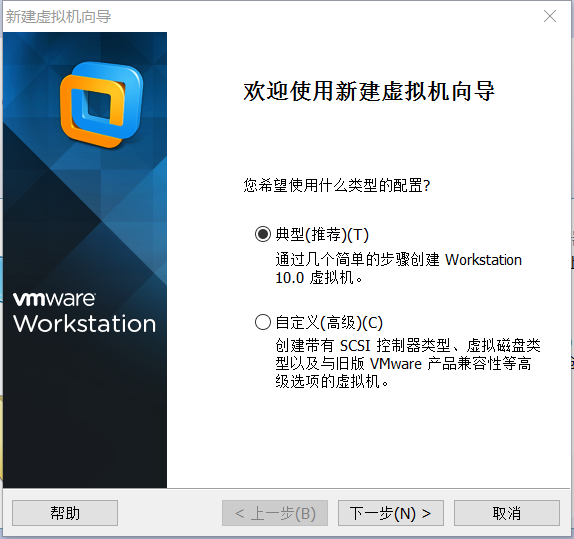


以上步骤选择“经典”就OK。

2、此步选择“安装程序光盘映射文件”，然后将centos的系统镜像文件找到

选择镜像文件之后，点击下一步

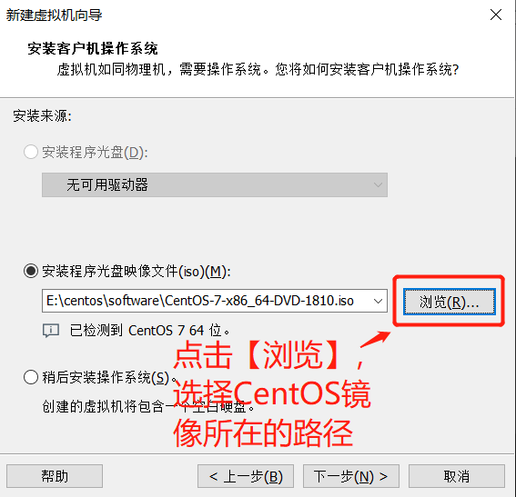

3、选择安装的系统类型和系统版本

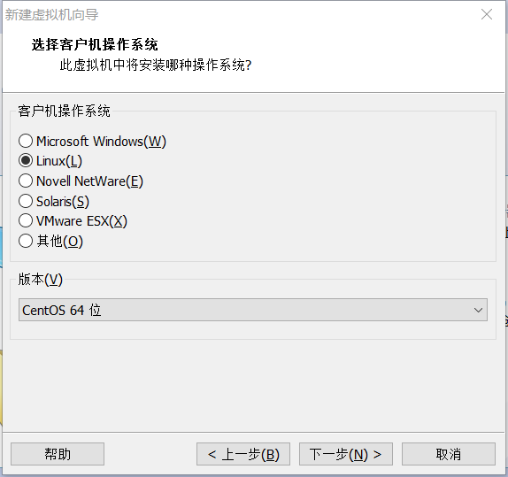

4、选择磁盘容量，默认是20G，选择50G也不会直接占用磁盘为50G，而是逐步增加的

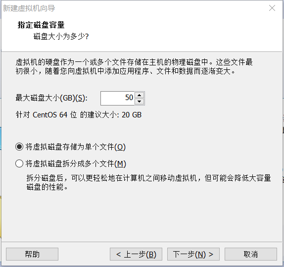

5、然后“下一步”，等待安装完成。

在自定义硬件中可以移除不需要的打印机和声卡

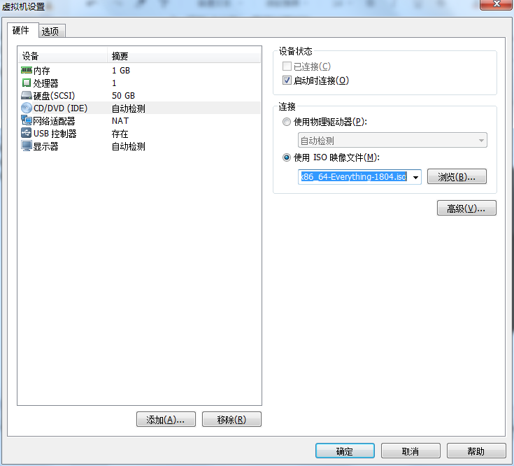

6、结束之后，启动刚刚创建的虚拟机，开始进行centos系统的安装

## 2.3 安装Centos系统

1、语言选择这一步，可以选择English，避免进行输入法的切换。

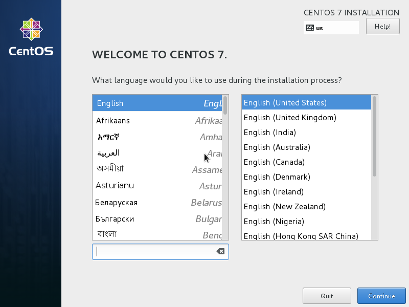

2、下一步，进入如下界面，选项比较多

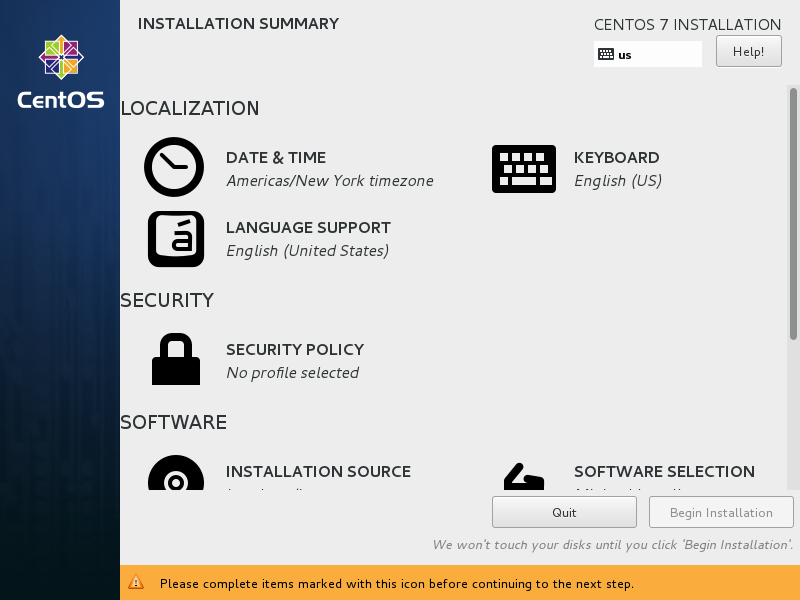

3、选择software selection。进入如下界面，选择如图选项，否则默认安装时没有用户桌面的

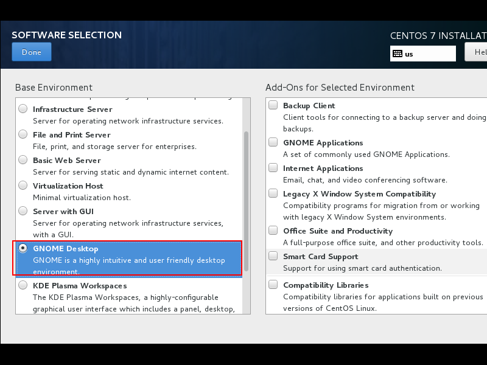

4、选择“INSTALLATION DESTINATION“，然后选择如下：

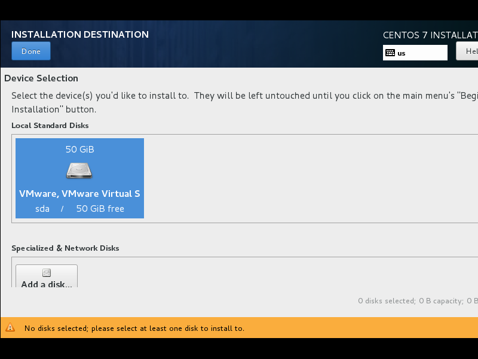

5、之后，点击”Begin Installation“按钮，开始下一步。进入如下界面：

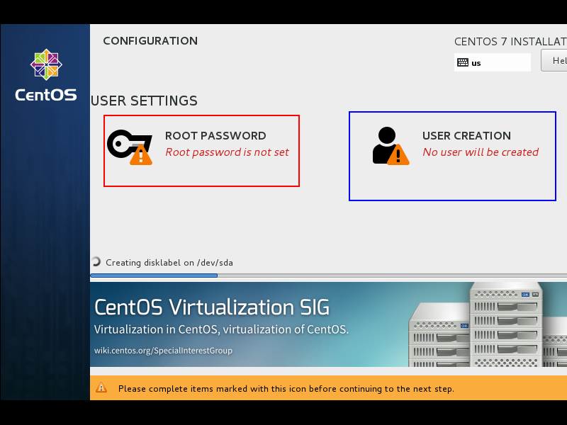

左边按钮配置root的密码，右边按钮新建一个普通用户

6、配置完成之后，等待系统安装完毕。

# 3、Linux的系统目录

刚接触Windows系统时，我们要了解每个盘都保存了什么东西，学习Linux也是一样

来看看Linux的目录结构：

| /            | 根目录                                                       |
| ------------ | ------------------------------------------------------------ |
| /root        | 系统管理员的目录                                             |
| /bin         | 存放Linux所有命令和工具的目录，类似tomcat下的bin目录的作用   |
| /sbin        | 系统管理员的命令                                             |
| /etc         | 存放系统配置方面的文件，比如java环境变量配置，就在此目录下的profile文件 |
| /dev         | 存放与外接设备有关的文件，比如打印机、鼠标驱动等都在此文件夹下 |
| /home        | 普通用户所在的目录，有点像windows中的user目录                |
| /tmp         | 用来存放系统或者软件的临时文件、linux系统会定期清理此文件夹  |
| /usr         | 存放跟用户相关的一些系统命令或者应用程序信息、用来存放应用程序，比如可以把安装软件存放在usr/bin下 |
| /opt         | 可选的应用程序安装目录，可以把只使用一次的软件，安装到此目录下 |
| /var         | 存放系统执行过程中经常变化的配置文件                         |
| /boot        | 系统启动时用来的一些文件                                     |
| /lib         | 系统执行过程中需要的一些函数库依赖文件                       |
| /srv         | 系统启动之后存放的数据目录                                   |
| /mnt、/media | 光盘或者移动存储默认的挂载点                                 |

# 4、Linux的常用命令
## 4.1 目录相关

### 4.1.1  切换\查看目录

```
切换目录
cd 目录名
查看目录
ls 目录名（不写就是查看当前目录）
    -l  详细列表
    -a  所有文件
查看目录详情
ll 目录名
```

### 4.1.2  创建\删除目录

```
创建目录
mkdir 目录名
删除目录
rm    目录名
    -r  遍历所有子目录
    -f  强制删除
```
## 4.2 文件操作
### 4.2.1 编辑文件
CentOS自带vi命令来编辑文件
```
创建\打开文件
vi  文件名
三种模式：
    命令模式    能删除、复制、粘贴，无法编辑
    输入模式    编辑内容
    命令行模式  退出、保存文件
    操作方式：默认进入命令模式，按i进入输入模式，按esc回到命令模式，按：进入命令行模式
命令模式
    x   删除一个字符
    dd  删除一行
    yy  复制一行
    p   粘贴
    u   撤销
命令行模式
    wq  保存退出
    q   退出 （如果有修改，此方式退出会出错）
    q!  强制退出
```

### 4.2.2 查阅文件

```
cat  显示整个文件内容（不支持分页）
more 分页显示（只能向前分页查询）
less 分页显示，功能比more强大。（支持前后分页查询）
	支持文本查找，/查找内容  向下查询 ；  ？查找内容   向上查找内容
	退出less模式，点击q
	
	对比vi命令：cat、more、less仅仅是用来进行文本阅读命令，vi用来进行文本编辑的命令。
	
	查询当前文件中是否包含有java单词，如果包含有Java单词的所有行全部显示出来。
	cat 文件名 | grep 查询文字
```

### 4.2.3 查询文件或者文本内容

```
find 查找目录 -name 文件名称  
find 查找目录 | grep 名称  
```

### 4.2.4 查看命令所在目录

```
which 命令名称
```

### 4.2.5 移动/复制文件

```
移动文件
mv 原文件 目标文件
复制文件
cp 原文件 目标文件
```

### 4.2.6 压缩与解压缩

```
解压指令：tar -zxvf  
压缩指令：tar -zcvf 
-z：表示压缩和解压缩的格式为gz压缩文件（gzip）
-c:：表示压缩
-x：表示解压缩
-v：表示显示压缩或者解压缩的详细过程。
-f：表示指定压缩或者解压缩的文件，只能放在命令的最后
tar -zcvf demo.tar.gz demo2.txt 
tar -cvf 压缩后的文件名称  待压缩的文件 
tar -xvf 待解压的解压包名 
```

### 4.2.7 查看端口和进程号

```
通过端口查看进程：netstat –apn | grep 8080
通过端口查看进程：lsof -i:3306
通过进程名称查询进程：ps -ef | grep redis
杀死进程：kill -9 PID（进程ID，-9表示强制杀死）
```

## 4.3 用户和用户组

### 4.3.1 添加用户

```
useradd -g 用户组 用户名
-g  group
```
### 4.3.2 修改用户密码

```
passwd 用户名
```
### 4.3.3 添加用户组

```
groupadd 用户组
```
### 4.3.4 查看当前用户的用户组

```
groups
```
### 4.3.5 删除用户

```
userdel -rf  用户名  
```
### 4.3.6 切换用户

```
su 用户名
```
## 4.4 权限控制
### 4.4.1 权限介绍
Linux有一套非常严格的权限机制，来保证文件使用的安全性

```
输入ll可以看到当前文件夹下文件详情
ll
-rw-r--r--   1 root  root  49698463 Dec 25 21:08 oasys.jar
drwxr-xr-x   6 root  root      4096 Dec 25 20:55 oa_web
```
最前面10个字符表示文件的权限，具体的含义是：

- 第1位： d代表目录，-代表文件
- 2~10位都由wrx-四个字符组成，w代表写，r代表读，x代表执行，-代表空
  其中每3位代表的用户类型是不同的：
  - 2~4位：拥有该文件的用户的权限
  - 5~7位：文件拥有者同组其他用户的权限
  - 8~10位：其他用户的权限

以oasys.jar文件为例，第一个- 代表它是一个文件，rw-代表所有者用户有读写权限，r--代表同组用户只有读权限，r--代表其他用户只有读权限，后面的1代表文件链接数，root/root 代表所有者用户和所在组的名称

### 4.4.2 修改文件权限
```
chmod 777 文件名称
```

777的含义：

- 第一个7：文件所有者
- 第二个7：文件所有者同组其他用户
- 第三个7：其他用户

7的含义，7代表可读可写可执行，7=4+2+1

每个数字代表一个权限：

- r=4
- w=2
- x=1
- -=0

# 5、Linux网络配置

接下来需要配置Linux系统的网络，这样才能保证软件能够正常安装上去

## 5.1 配置连接外网

进入etc/sysconfig/network-scripts目录，使用vi打开 ifcfg-ensXXX文件，进行编辑

```
cd /etc/sysconfig/network-scripts
vi ifcfg-ens33
```

修改如下：

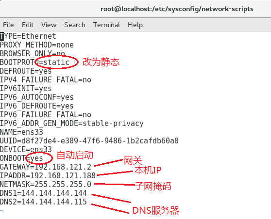


网关和子网掩码通过下面方法查看，本机IP最后数字可以自己配置，前面3位数字要和网关一致。

点击VMware编辑菜单中的虚拟网络编辑器，可以查看子网掩码

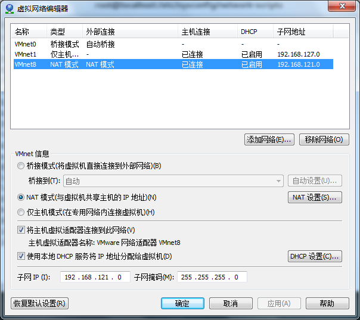

点击NAT设置，可以查看网关

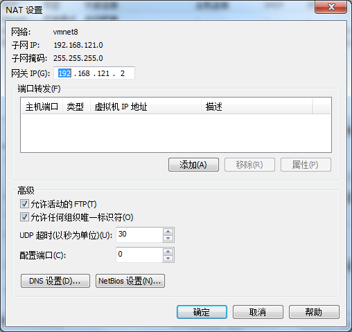

配置完成后，重启网络：

```
service network restart
```

使用ping 测试网络能否连接

```
ping www.baidu.com
```

## 5.2 配置主机连接虚拟机Linux

在Windows的网络配置中找到VMnet8，如果是禁用，就启动该网络

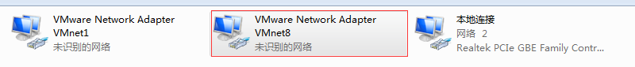

查看其IP，保证和虚拟机是同一个网段

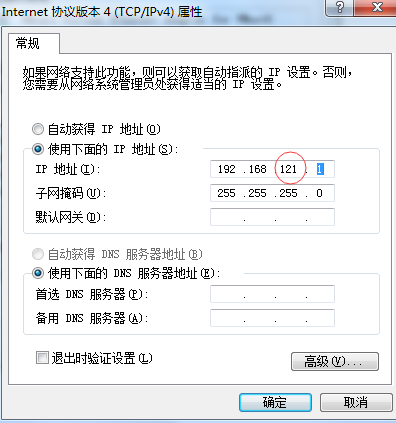

关闭虚拟机的防火墙

```
systemctl stop firewalld
```

控制防火墙的命令

```
开启防火墙：systemctl start firewalld
关闭自启动：systemctl disable firewalld
开启自启动：systemctl enable firewalld
查看状态  ：systemctl status firewalld
```

启动主机命令行测试

```
ping 虚拟机IP
```

# 6、Linux安装软件

## 6.1 安装Java

1、下载JDK的Linux版本

2、用SSH工具上传到usr/local目录

3、解压jdk

```
tar -xvf jdk文件名
```

4、配置环境变量

打开文件进行配置

```
vim /etc/profile
```

在文件末尾添加

```
export JAVA_HOME=/usr/local/jdk1.8.0_181
export PATH=$JAVA_HOME/bin:$PATH
```

5、保存并刷新文件, 让环境变量生效

```
source /etc/profile
```

6、测试

```
java -version
```

## 6.2 安装Tomcat

1、下载Tomcat的Linux版本

2、上传到usr/local目录

3、解压

```
tar -xvf Tomcat文件
```

4、cd 进入bin目录

```
cd /usr/local/tomcat8/bin
```

5、启动Tomcat

```
./startup.sh
```

6、关闭防火墙

```
systemctl stop firewalld
```

## 6.3 安装MySQL

1、下载MySQL的Linux版本

2、上传到usr/local目录

3、解压

```
tar -xvf Mysql文件
```

4、移动到mysq目录中

```
mv  解压后的MySQL目录名   mysql
```

5、在mysql目录中创建data目录

```
cd mysql
mkdir data
```

6、创建 mysql 用户组和 mysql 用户

```
groupadd mysql

useradd -g mysql mysql
```

7、改变 mysql 目录权限

```
chown -R mysql.mysql /usr/local/mysql/
```

8、初始化数据库

1）创建mysql_install_db安装文件

```
mkdir mysql_install_db
chmod 777 ./mysql_install_db
```

2）初始化 

```
bin/mysqld --initialize --user=mysql --basedir=/usr/local/mysql --datadir=/usr/local/mysql/data 
```

3）初始化成功后，要记录自己的原始密码： 

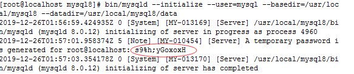

9、配置MySQL

打开Mysql配置文件

```
vi /etc/my.cnf
```

添加以下内容：

```
[mysqld]
basedir=/usr/local/mysql 
datadir=/usr/local/mysql/data
socket=/usr/local/mysql/mysql.sock
character-set-server=utf8
port=3306
[mysql]
socket=/usr/local/mysql/mysql.sock
port=3306
```

10、建立MySQL服务

1）复制服务文件

```
cp /usr/local/mysql/support-files/mysql.server /etc/init.d/mysql
```

2）加执行权限

```
chmod +x /etc/init.d/mysql
```

3）添加到系统服务

```
chkconfig --add mysql
```

4）检查服务

```
chkconfig  --list mysql
```

11、配置全局环境变量

1）打开配置文件

```
vi /etc/profile
```

2）在配置文件底部添加：

```
export PATH=$PATH:/usr/local/mysql/bin:/usr/local/mysql/lib
export PATH
```

3）使文件生效

```
source /etc/profile
```

12、启动服务

```
service mysql start
```

13、登录MySQL

```
mysql -u账号 -p密码
输入原始密码
```

14、修改原始密码

```
ALTER USER 'root'@'localhost' IDENTIFIED BY '新密码';
或
set password for root@localhost = password('新密码'); 
```

# 7、 MySQL主从复制

## 7.1 为什么要主从复制

随着软件系统的用户量逐渐递增，MySQL数据库的压力会越来越大，有时候一台数据库就扛不住了，这是就需要多台数据库来一起分工合作。

- 主从架构

  一台MySQL作为主数据库，其它MySQL作为从数据库

- 读写分离

  主数据库主要负责写操作，从数据库负责读操作

- 主从复制

  对主数据库的结构或数据的修改，都会同步到每台从数据库上

## 7.2 主从复制的原理

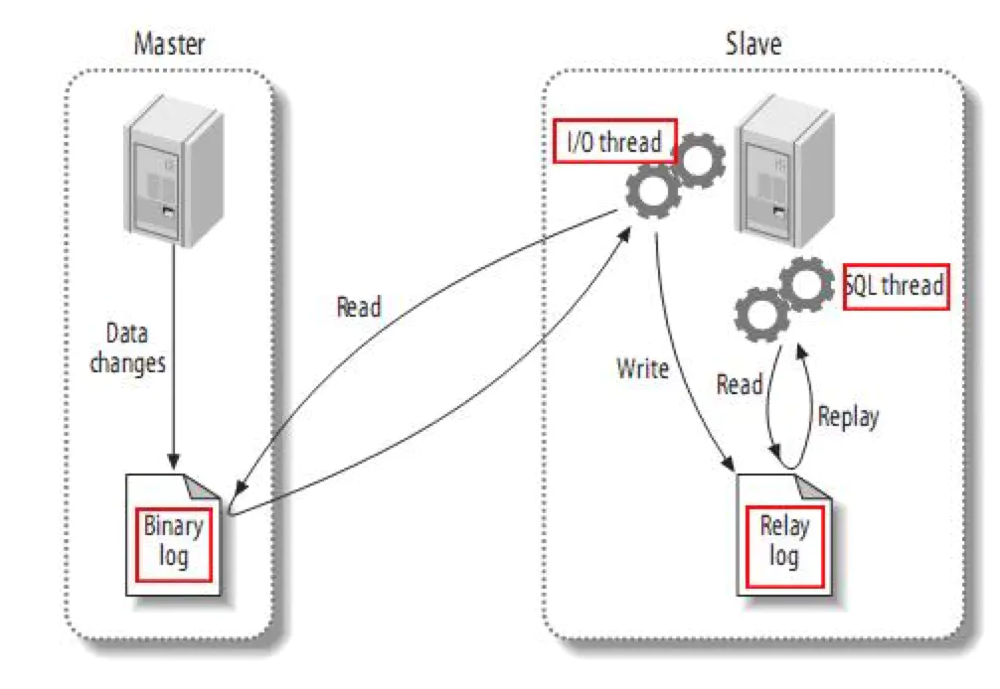

1） 主数据库的写操作都会记录到一个二进制日志文件bin-log中

2） 从数据库会启动一个IO线程，不断去读取日志文件中的内容

3） 如果有写操作，IO线程会写到自己的 Relay日志中

4） 从数据库同时还会启动一个SQL 线程，不断去读取Relay日志中的操作

5） 如果读到写操作，再转换为SQL语句，更新从数据库的对应数据

## 7.3 主从复制的实现

1） 克隆虚拟机

这里需要两台数据库服务器测试，为了方便起见，把原来的虚拟机克隆一台新虚拟机出来，原虚拟机作为主数据库，克隆机作为从数据库。

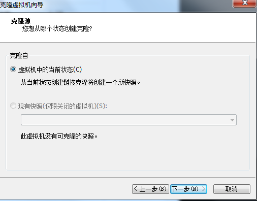

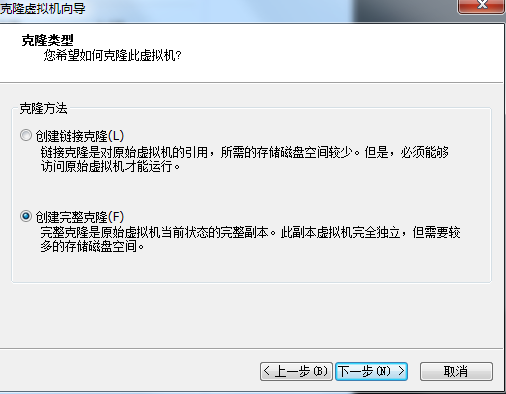

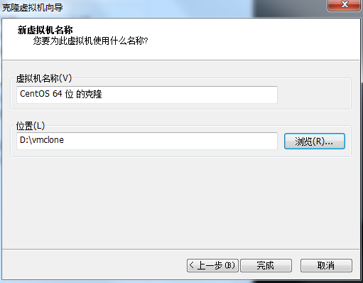

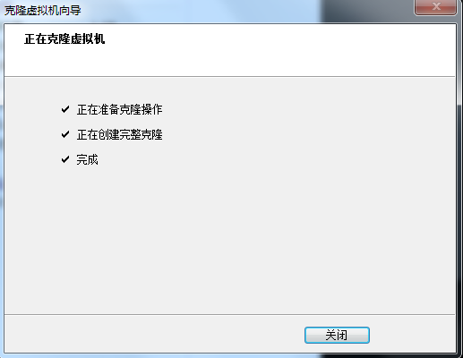

2） 进入克隆的虚拟机，把ip地址改一下，和原虚拟机不同就行，然后重启网络

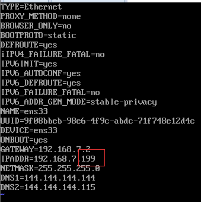

3） 修改克隆机MySQL的UUID

UUID是每个MySQL实例的标识，不能一样，位置在mysql/data/auto.cnf

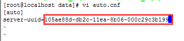

4） 修改原虚拟机的mysql配置

在/etc/my.cnf中[mysqld]下添加：

```
server-id=188
log-bin=mysql-bin
binlog_format=mixed
```

重启mysql

```
service restart mysql
```

5） 添加主从复制账号

登录主机的MySQL，添加主从复制的账号

```
create user 'guest'@'%' identified by '123456';
```

授权

```
grant replication slave on *.* to 'guest'@'%';
```

6） 查看日志

把日志文件名和位置记下来

```
show master status;
```


7） 配置从机的mysql

在/etc/my.cnf中[mysqld]下添加：

```
server-id=199
log-bin=mysql-bin
binlog_format=mixed
```

重启MySQL

如果重启失败提示没有设置serser-id，则需要删除mysql中的几张表，然后重新初始化MySQL，再重启。

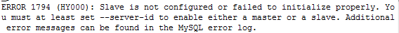

```
use mysql
drop table slave_master_info;
drop table slave_relay_log_info;
drop table slave_worker_info;
drop table innodb_index_stats;
drop table innodb_table_stats;
```

8） 启动主从复制

```
stop slave;
change master to master_host = '主机ip',master_port = 主机端口, master_user = '主从复制用户',master_password='密码',master_log_file='文件名',master_log_pos=位置;
start slave;
show slave status \G;
```

下面两个Yes代表IO、SQL线程启动了

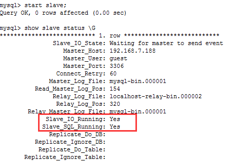

9） 测试

在主机上创建一个数据库，从机上马上就能够看到了

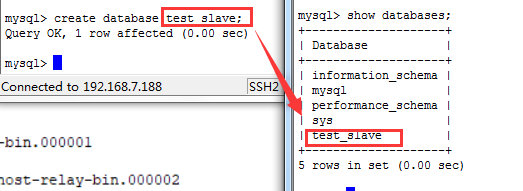

# 8、Shell编程

## 8.1 Shell是什么

Shell位于操作系统和应用程序之间，是他们二者的接口，负责把应用程序的输入命令信息解释给操作系统，将操作系统指令处理后的结果解释给应用程序。

总结：shell就是在操作系统和应用程序之间的一个命令翻译工具。

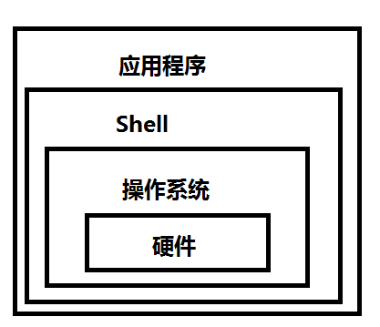

## 8.2 Shell可以做什么

Shell可以完成大量重复的工作，如我们部署项目时，要把打包文件上传到服务器上，然后移动到对应的目录中，可能还需要停止之前运行的程序，然后启动新的程序等，这一系列操作编写成Shell脚本，就可以一键完成了。

Shell是Linux自动化测试和运维必不可少的利器。

## 8.3 Shell编程入门

1） 直接输入命令
```
echo 'hello world!'
```
2） 编写脚本
使用vi编辑脚本文件
hello.sh
```
#!/bin/bash 
echo 'hello world!'
```
运行脚本
```
sh hello.sh  
或
chmod +x hello.sh 
./hello.sh
```
3） 使用变量
修改脚本，添加变量

```
#!/bin/bash 
name="zhangsan";
echo 'hello' $name;
```

运行脚本

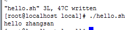