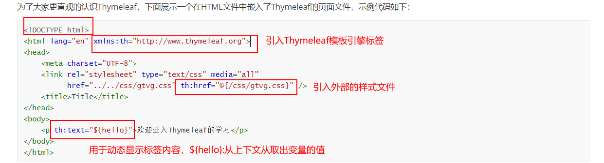
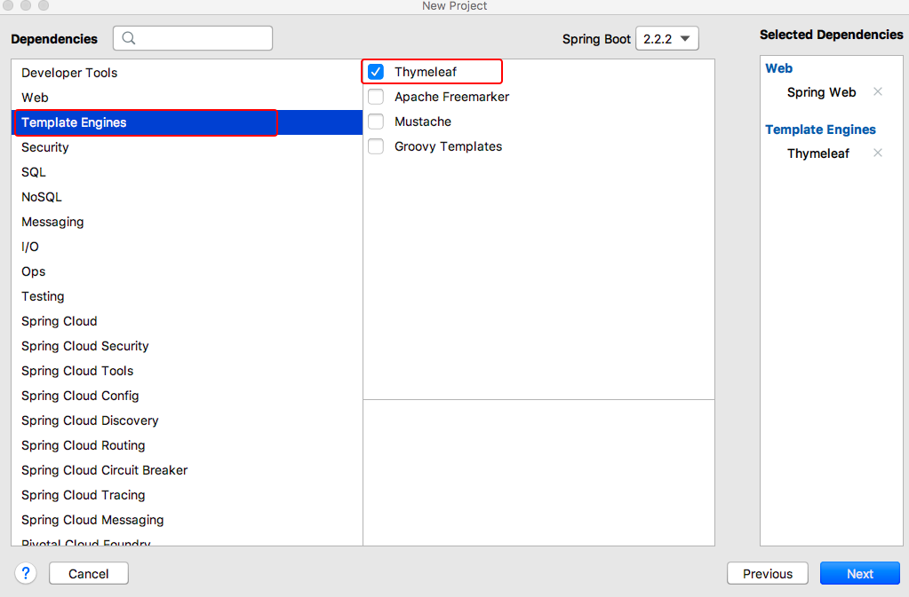
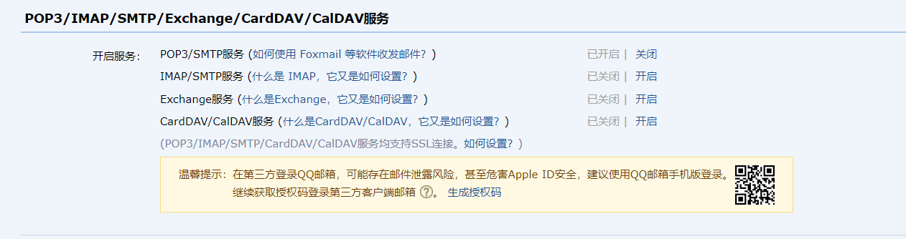
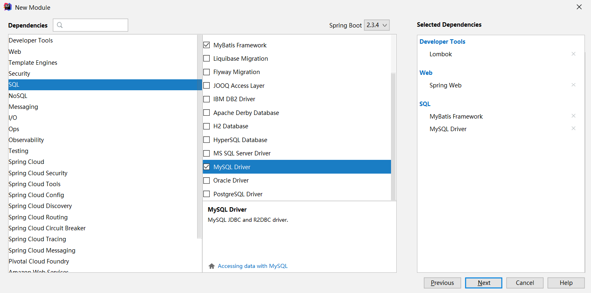
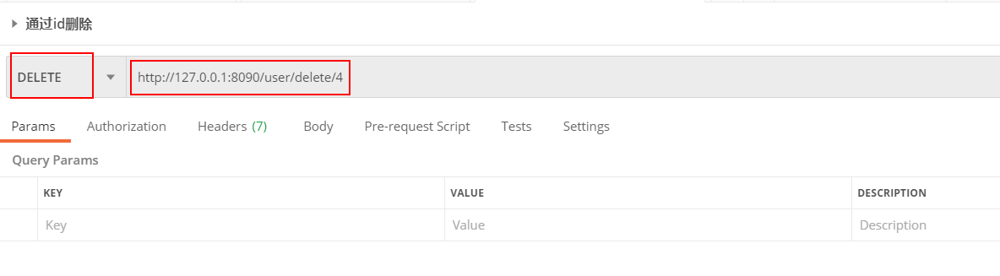
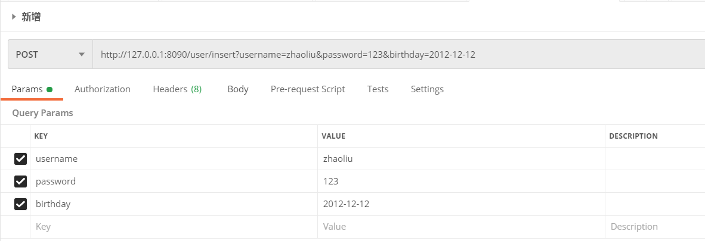
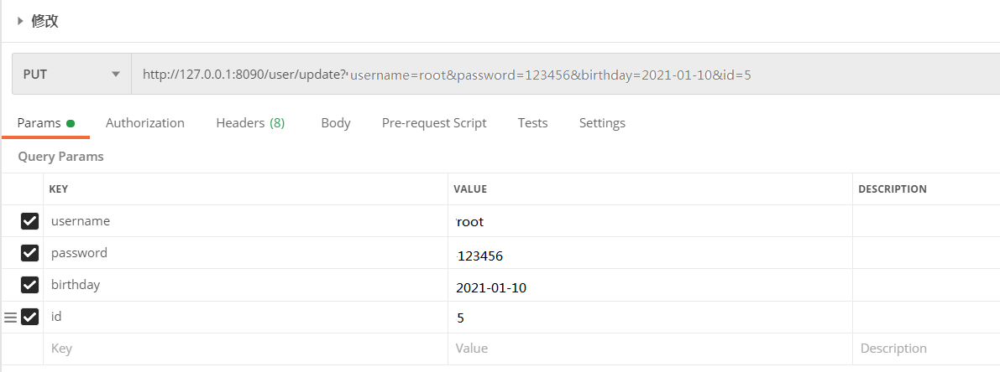

# 目录

[toc]

## 1. SpringBoot视图技术

### 1.1 支持的视图技术  

​	前端模板引擎技术的出现，使前端开发人员无需关注后端业务的具体实现，只关注自己页面的呈现效果即可，并且解决了前端代码错综复杂的问题、实现了前后端分离开发。Spring Boot框架对很多常用的模板引擎技术（如：FreeMarker、Thymeleaf、Mustache等）提供了整合支持

​     Spring Boot不太支持常用的JSP模板，并且没有提供对应的整合配置，这是因为使用嵌入式Servlet容器的Spring Boot应用程序对于JSP模板存在一些限制 ：

*  在Jetty和Tomcat容器中，Spring Boot应用被打包成war文件可以支持JSP。但Spring Boot默认使用嵌入式Servlet容器以JAR包方式进行项目打包部署，这种JAR包方式不支持JSP。

*  如果使用Undertow嵌入式容器部署Spring Boot项目，也不支持JSP模板。（Undertow 是红帽公司开发的一款基于 NIO 的高性能 Web 嵌入式服务器）

*  Spring Boot默认提供了一个处理请求路径“/error”的统一错误处理器，返回具体的异常信息。使用JSP模板时，无法对默认的错误处理器进行覆盖，只能根据Spring Boot要求在指定位置定制错误页面。

​         上面对Spring Boot支持的模板引擎进行了介绍，并指出了整合JSP模板的一些限制。接下来，对其中常用的Thymeleaf模板引擎进行介绍，并完成与Spring Boot框架的整合实现  

### 1.2 Thymeleaf  

​         Thymeleaf是一种现代的基于服务器端的Java模板引擎技术，也是一个优秀的面向Java的XML、XHTML、HTML5页面模板，它具有丰富的标签语言、函数和表达式，在使用Spring Boot框架进行页面设计时，一般会选择Thymeleaf模板

#### 1.2.1 Thymeleaf语法

 **常用标签**

在HTML页面上使用Thymeleaf标签，Thymeleaf 标签能够动态地替换掉静态内容，使页面动态展示。

为了大家更直观的认识Thymeleaf，下面展示一个在HTML文件中嵌入了Thymeleaf的页面文件，示例代码如下：

```html
<!DOCTYPE html>
<html lang="en" xmlns:th="http://www.thymeleaf.org">
<head>
    <meta charset="UTF-8">
    <link rel="stylesheet" type="text/css" media="all"
          href="../../css/gtvg.css" th:href="@{/css/gtvg.css}" />
    <title>Title</title>
</head>
<body>
    <p th:text="${hello}">欢迎进入Thymeleaf的学习</p>
</body>
</html>
```

         

上述代码中，“xmlns:th="http://www.thymeleaf.org"“ 用于引入Thymeleaf模板引擎标签，使用关键字“th”标注标签是Thymeleaf模板提供的标签，其中，“th:href”用于引入外联样式文件，“th:text”用于动态显示标签文本内容。

除此之外，Thymeleaf模板提供了很多标签，接下来，通过一张表罗列Thymeleaf的常用标签  

| th：标签   | 说明                                   |
| ---------- | -------------------------------------- |
| th:insert  | 布局标签，替换内容到引入的文件         |
| th:replace | 页面片段包含（类似JSP中的include标签） |
| th:each    | 元素遍历（类似JSP中的c:forEach标签）   |
| th:if      | 条件判断，如果为真                     |
| th:unless  | 条件判断，如果为假                     |
| th:switch  | 条件判断，进行选择性匹配               |
| th:case    | 条件判断，进行选择性匹配               |
| th:value   | 属性值修改，指定标签属性值             |
| th:href    | 用于设定链接地址                       |
| th:src     | 用于设定链接地址                       |
| th:text    | 用于指定标签显示的文本内容             |


**标准表达式**

​    Thymeleaf模板引擎提供了多种标准表达式语法，在正式学习之前，先通过一张表来展示其主要语法及说明  

| 说明           | 表达式语法 |
| -------------- | ---------- |
| 变量表达式     | ${...}     |
| 选择变量表达式 | *{...}     |
| 消息表达式     | \#{...}    |
| 链接URL表达式  | @{...}     |
| 片段表达式     | ~{...}     |

**1．变量表达式 ${...}**

​         变量表达式${...}主要用于获取上下文中的变量值，示例代码如下：

```html
<p th:text="${title}">这是标题</p>
```

 示例中使用了Thymeleaf模板的变量表达式${...}用来动态获取P标签中的内容，如果当前程序没有启动或者当前上下文中不存在title变量，该片段会显示标签默认值“这是标题”；如果当前上下文中存在title变量并且程序已经启动，当前P标签中的默认文本内容将会被title变量的值所替换，从而达到模板引擎页面数据动态替换的效果  

  同时，Thymeleaf为变量所在域提供了一些内置对象，具体如下所示  

```properties
 # ctx：上下文对象
 # vars：上下文变量
 # locale：上下文区域设置
 # request：（仅限Web Context）HttpServletRequest对象
 # response：（仅限Web Context）HttpServletResponse对象
 # session：（仅限Web Context）HttpSession对象
 # servletContext：（仅限Web Context）ServletContext对象
```

​         结合上述内置对象的说明，假设要在Thymeleaf模板引擎页面中动态获取当前国家信息，可以使用#locale内置对象，示例代码如下  

```html
The locale country is: <span th:text="${#locale.country}">US</span>.
```

​         上述代码中，使用th:text="${#locale.country}"动态获取当前用户所在国家信息，其中<span>标签内默认内容为US（美国），程序启动后通过浏览器查看当前页面时，Thymeleaf会通过浏览器语言设置来识别当前用户所在国家信息，从而实现动态替换  

**2．选择变量表达式 *{...}**

​         选择变量表达式和变量表达式用法类似，一般用于从被选定对象而不是上下文中获取属性值，如果没有选定对象，则和变量表达式一样，示例代码如下  

```html
<div th:object="${book}">
  <p>titile: <span th:text="*{title}">标题</span>.</p>
</div>
```

*{title} 选择变量表达式获取当前指定对象book的title属性值。

**3．消息表达式 #{...}**

​         消息表达式#{...}主要用于Thymeleaf模板页面国际化内容的动态替换和展示，使用消息表达式#{...}进行国际化设置时，还需要提供一些国际化配置文件。

**4．链接表达式 @{...}  **

链接表达式@{...}一般用于页面跳转或者资源的引入，在Web开发中占据着非常重要的地位，并且使用也非常频繁，示例代码如下：

```html
<a  th:href="@{http://localhost:8080/order/details(orderId=${o.id})}">view</a> 
<a  th:href="@{/order/details(orderId=${o.id},pid=${p.id})}">view</a>
```

​          上述代码中，链接表达式@{...}分别编写了绝对链接地址和相对链接地址。在有参表达式中，需要按照@{路径(参数名称=参数值，参数名称=参数值...)}的形式编写，同时该参数的值可以使用变量表达式来传递动态参数值  

**5．片段表达式 ~{...}  **

片段表达式~{...}用来标记一个片段模板，并根据需要移动或传递给其他模板。其中，最常见的用法是使用th:insert或th:replace属性插入片段，示例代码如下：

```html
<div th:insert="~{thymeleafDemo::title}"></div>
```

​         上述代码中，使用th:insert属性将title片段模板引用到该<div>标签中。thymeleafDemo为模板名称，Thymeleaf会自动查找“/resources/templates/”目录下的thymeleafDemo模板，title为片段名称  


#### 1.2.2 基本使用

（1） Thymeleaf模板基本配置

​        首先 在Spring Boot项目中使用Thymeleaf模板，首先必须保证引入Thymeleaf依赖，示例代码如下：

```html
<dependency>
   <groupId>org.springframework.boot</groupId>
   <artifactId>spring-boot-starter-thymeleaf</artifactId>
 </dependency>
```

其次，在全局配置文件中配置Thymeleaf模板的一些参数。一般Web项目都会使用下列配置，示例代码如：

```properties
spring:
  thymeleaf:
    cache: false
    encoding: UTF-8
    mode: HTML5
    prefix: classpath:/templates/
    suffix: .html
```

​         上述配置中，spring.thymeleaf.cache表示是否开启Thymeleaf模板缓存，默认为true，在开发过程中通常会关闭缓存，保证项目调试过程中数据能够及时响应；spring.thymeleaf.prefix指定了Thymeleaf模板页面的存放路径，默认为classpath:/templates/；spring.thymeleaf.suffix指定了Thymeleaf模板页面的名称后缀，默认为.html  

（2）静态资源的访问

开发Web应用时，难免需要使用静态资源。Spring boot默认设置了静态资源的访问路径。

使用Spring Initializr方式创建的Spring Boot项目，默认生成了一个resources目录，在resources目录中新建public、resources、static三个子目录下，Spring boot默认会挨个从public、resources、static里面查找静态资源  


#### 1.2.3   完成数据的页面展示

1. 创建Spring Boot项目，引入Thymeleaf依赖 

​                          


2. 编写配置文件  

​         打开application.properties全局配置文件，在该文件中对Thymeleaf模板页面的数据缓存进行设置

```properties
spring:
  thymeleaf:
    cache: false
```

  使用“spring.thymeleaf.cache=false”将Thymeleaf默认开启的缓存设置为了false，用来关闭模板页面缓存  


3. 创建web控制类

​         在项目中创建名为com.demo.controller的包，并在该包下创建一个用于前端模板页面动态数据替换效果测试的访问实体类LoginController  

```java
@Controller
public class LoginController {

    /**
         * 获取并封装当前年份跳转到登录页login.html
   	     */

    @RequestMapping("/toLoginPage")
    public String toLoginPage(Model model){
        model.addAttribute("currentYear", Calendar.getInstance().get(Calendar.YEAR));
        return "login";
    }
```

toLoginPage()方法用于向登录页面login.html跳转，同时携带了当前年份信息currentYear。

4．创建模板页面并引入静态资源文件

​         在“classpath:/templates/”目录下引入一个用户登录的模板页面login.html  

```html
<!DOCTYPE html>
<html lang="en" xmlns:th="http://www.thymeleaf.org">
<head>
    <meta http-equiv="Content-Type" content="text/html; charset=UTF-8">
    <meta name="viewport" content="width=device-width, initial-scale=1,shrink-to-fit=no">
    <title>用户登录界面</title>
    <link th:href="@{/login/css/bootstrap.min.css}" rel="stylesheet">
    <link th:href="@{/login/css/signin.css}" rel="stylesheet">
</head>
<body class="text-center">
<!--  用户登录form表单 -->
<form class="form-signin">
    
    <h1 class="h3 mb-3 font-weight-normal">请登录</h1>
    <input type="text" class="form-control"
           th:placeholder="用户名" required="" autofocus="">
    <input type="password" class="form-control"
           th:placeholder="密码" required="">
    <div class="checkbox mb-3">
        <label>
            <input type="checkbox" value="remember-me"> 记住我
        </label>
    </div>
    <button class="btn btn-lg btn-primary btn-block" type="submit" >登录</button>
    <p class="mt-5 mb-3 text-muted">© <span th:text="${currentYear}">2019</span>-<span th:text="${currentYear}+1">2020</span></p>
</form>
</body>
</html>
```

通过“xmlns:th="http://www.thymeleaf.org"”引入了Thymeleaf模板标签；

使用“th:href”和“th:src”分别引入了两个外联的样式文件和一个图片；

使用“th:text”引入了后台动态传递过来的当前年份currentYear  

**5．效果测试**


​         可以看出，登录页面login.html显示正常，在文件4-3中使用“th:*”相关属性引入的静态文件生效，并且在页面底部动态显示了当前日期2020-2021，而不是文件中的静态数字2019-2020。这进一步说明了Spring Boot与Thymeleaf整合成功，完成了静态资源的引入和动态数据的显示 

## 2. 邮件处理

### 2.1 SMTP协议简介

 SMTP是一种提供可靠且有效的**电子邮件传输**的协议。SMTP是建立在**FTP**文件传输服务上的一种邮件服务，主要用于系统之间的邮件信息传递，并提供有关来信的通知。SMTP独立于特定的传输子系统，且只需要可靠有序的数据流信道支持，SMTP的重要特性之一是其能**跨越网络传输邮件**，即“SMTP邮件中继”。使用SMTP，可实现相同网络处理进程之间的邮件传输，也可通过中继器或网关实现某处理进程与其他网络之间的邮件传输。

 简单来说：我们使用的这些邮件发送功能，他们之间都有一个专门的电子邮件的服务器，类似于邮局，你将邮件发给邮局，邮局又会根据你的邮寄地址发送给相应的邮局，然后接收方去邮局取邮件。而邮件服务器呢，就是互联网之间的一个邮局，不同的网络之间也能实现电子邮件的发送。

 Spring框架在java邮件服务的基础上进行了封装，SpringBoot在Spring的基础上对邮件服务进一步的封装，让SpringBoot发送邮件更为便利，灵活。

### 2.2 开启SMTP服务并获取授权码

 这里我们以**QQ邮箱**为例，要想在SpringBoot发送QQ邮件必须先打开QQ邮箱的SMTP功能，默认是关闭的，具体操作如下。进入邮箱→设置→账户，然后找到下面这个：


 将第一个开启，这里我已经开启了，就不用再开启了，至于那个POP3协议,这是一种从邮件服务器上读取邮件的协议，通过POP3协议，收信人不需要参与到与邮件服务器之间的邮件读取过程，简化了用户操作. 收信人可以“离线”地进行邮件处理，很方便地接收，阅读邮件。

 然后我们开启之后还需要获取一个授权码，这个授权码我们后面编写邮件配置需要用到。获取授权码可能需要验证身份什么的。将授权码保存下来。

### 2.3依赖导入与配置说明

 **依赖导入**：

```xml
<dependency>
    <groupId>org.springframework.boot</groupId>
    <artifactId>spring-boot-starter-mail</artifactId>
</dependency>
```

 为了方便测试我们也需要将**starter-web**的依赖导入进来。

 **配置文件**：

```properties
spring:
  mail:
    host: smtp.qq.com
    username: 517022877@qq.com
    password: zxcvbnmkj
    properties:
      mail:
        smtp:
          socketFactory:
            class: javax.net.ssl.SSLSocketFactory
##         ssl:
##           enable :true
    default-encoding: utf-8
```

 **配置说明**：

- host就是你的邮件服务器地址,
- username就是你的邮箱账号，带上后缀
- password就是你刚刚复制的授权码，我这里是乱写的；
- default-encoding 设置邮件的编码为utf-8；
- properties：额外的配置，这里我写了两个，只用其中一个就行了，开启ssl加密，保证安全连接。

### 2.4 邮件发送

#### 2.4.1简单邮件发送

 编写controller，或者是直接在测试模块添加测试就行

```java
@RestController
public class MailController {
    @Autowired
    JavaMailSenderImpl javaMailSender;
    @RequestMapping("/mail")
    public String sendMail(){
        SimpleMailMessage message = new SimpleMailMessage();
        //邮件设置
        message.setSubject("邮件主题");
        message.setText("邮件内容");
        message.setTo("xxxxxxx@139.com","111111111@qq.com");
        message.setFrom("qzstudynote@qq.com");
        javaMailSender.send(message);
        return "简单邮件发送成功！"
    }
}
```

**代码说明**：**JavaMailSenderImpl**就是一个SpringBoot中用来发送邮件的一个实现类，我们需要将它注入到bean中，以供使用。它里面有一些方法，这里只展示了简单的几个，其他的也很简单，比如说发送日期，抄送人等等。接受者可以设置多个，如上。

#### 2.4.2 带附件内容和正文带图片的邮件发送

```java
@RequestMapping("/mineMail")
public String sendMineMail() throws MessagingException {
     //1、创建一个复杂的邮件
        MimeMessage mimeMessage = javaMailSender.createMimeMessage();
        MimeMessageHelper helper = new MimeMessageHelper(mimeMessage, true);
        //邮件主题
        helper.setSubject("这是一个邮件啊");
        //文本中添加图片
        helper.addInline("image1",new FileSystemResource("D:\\images\\spring\\1.jpg"));
        //邮件内容
        helper.setText("<a href='https://www.cnblogs.com/swzx-1213/'>百度一下</a>    </img>",true);
        helper.setTo("xxxxx@139.com");
        helper.setFrom("517022877@qq.com");
        //附件添加图片
        helper.addAttachment("1.jpg",new File("D:\\images\\spring\\1.jpg"));
        //附件添加word文档
        helper.addAttachment("哈哈哈.docx",new File("D:\\images\\spring\\哈哈哈.docx"));

        javaMailSender.send(mimeMessage);
       return "复杂邮件发送！";
}
```

 **代码说明**：

- 创建一个MimeMessage 邮件，但是我们也需要创建一个工具类MimeMessageHelper，相当于代理类吧，邮件的属性配置就由这个工具类来实现。
- **addInline()**,第一个参数是一个contentId,String类型的，相当于是一个key,第二个参数是一个Resource对象，资源对象，这里我们传了一个本地的图片就用的FileSystemResource对象。当然这里是说的我们用的这个addInline方法的参数是这样，还有其他的参数类型，所谓重载。
- **setText()**，这里用到的第一个参数就是文本字符串，第二个就是是否解析文本中的html语法。
- **addAttachment()** 这个方法是用来添加附件的，附件和我们之前添加的图片不一样，附件作为一种未下载的文件，而资源文件则是直接显示到正文中。

#### 2.4.3 thymeleaf模板作为邮件发送

 项目中需要引入thymeleaf依赖，并且要在新建的html文件中加入：xmlns:th="[http://www.thymeleaf.org](http://www.thymeleaf.org/)" ,不会thymeleaf的请移步之前的文章。

```xml
<dependency>
    <groupId>org.springframework.boot</groupId>
    <artifactId>spring-boot-starter-thymeleaf</artifactId>
</dependency>
```

 这里在templates下面创建了一个email的html5文件。

```html
<!DOCTYPE html>
<html lang="en" xmlns:th="http://www.thymeleaf.org">
<head>
    <meta charset="UTF-8">
    <title>Title</title>
</head>

<p th:text="${name}"></p>
<a th:text="这是一个链接" th:href="${link}"></a>

</body>
</html>
```

 controller中再添加一个方法。

```java
@RequestMapping("/thyMail")
    public String sendThymeleafMail() throws MessagingException {
        MimeMessage mimeMessage = javaMailSender.createMimeMessage();
        MimeMessageHelper messageHelper = new MimeMessageHelper(mimeMessage);
        messageHelper.setSubject("这是一个thymeleaf模板邮件");
        messageHelper.setTo("xxxxxxxx@139.com");
        messageHelper.setFrom("517022877@qq.com");
        Context context = new Context();
        context.setVariable("name","这是一个新建的thymeleaf模板");
        context.setVariable("link","https://www.baidu.com");
        context.setVariable("image1","http://img12.360buyimg.com/babel/s1180x940_jfs/t1/155480/1/2178/40498/5f86d482E94d83a6e/1be5e41a4caf106b.jpg.webp");
        String value = templateEngine.process("email.html",context);
        messageHelper.setText(value,true);
        javaMailSender.send(mimeMessage);
        return "模板邮件发送成功";
    }
```

 **代码说明：**

- **Context** 属于org.thymeleaf.context这个包。
- **context.setVariable()**,第一个参数是String,第二个是Object类型。第一个参数就对应thymeleaf模板上面相同名字的参数。
- **templateEngine.process()**将指定路径的html文件转换成String类型返回。

## 3. 短信处理

### 3.1注册阿里云账号

并且开通短信功能，在控制台创建签名，模板，accessKey，后面要用到，此处不多赘述，不懂请自行百度查询

### 3.2在pom.xml加入依赖

```xml
<!-- 阿里短信依赖 -->
<dependency>
    <groupId>com.aliyun</groupId>
    <artifactId>aliyun-java-sdk-core</artifactId>
    <version>4.4.6</version>
</dependency>
<dependency>
    <groupId>com.aliyun</groupId>
    <artifactId>aliyun-java-sdk-dysmsapi</artifactId>
    <version>2.1.0</version>
</dependency>

<!-- fastjson -->
<dependency>
    <groupId>com.alibaba</groupId>
    <artifactId>fastjson</artifactId>
    <version>1.2.73</version>
</dependency>
```

### 3.3 配置application.yml

```bash
server:
  port: 8081

spring:
  application:
    name: sms-demo-server

sms:
  aliyun:
    accessKeyID:  xxx # 你的accessKeyID
    accessKeySecret:  xxx # 你的accessKeySecret
    domain: dysmsapi.aliyuncs.com # 固定不变
    regionId: cn-hangzhou # 固定不变
    templateCode: xxx # 你的模板code
    signName: xxx # 你的签名
```

### 3.4 创建类服务类

#### AliYunSmsService

```dart
public interface AliYunSmsService {

    /**
     * 发送短信的接口
     *
     * @param phoneNum 手机号
     * @param message     消息
     * @return
     */
    boolean sendSms(String phoneNum, String message);

}
```

#### AliYunSmsServiceImpl

```dart
import com.alibaba.fastjson.JSON;
import com.aliyuncs.CommonRequest;
import com.aliyuncs.CommonResponse;
import com.aliyuncs.DefaultAcsClient;
import com.aliyuncs.IAcsClient;
import com.aliyuncs.exceptions.ClientException;
import com.aliyuncs.exceptions.ServerException;
import com.aliyuncs.http.MethodType;
import com.aliyuncs.profile.DefaultProfile;
import com.luoyu.sms.service.AliYunSmsService;
import lombok.extern.slf4j.Slf4j;
import org.springframework.beans.factory.annotation.Value;
import org.springframework.stereotype.Service;

import java.util.HashMap;
import java.util.Map;

@Slf4j
@Service
public class AliYunSmsServiceImpl implements AliYunSmsService {

    //aliyuncs的参数
    @Value("${sms.aliyun.accessKeyID}")
    private String accessKeyID;

    @Value("${sms.aliyun.accessKeySecret}")
    private String accessKeySecret;

    //短信api的请求地址  固定
    @Value("${sms.aliyun.domain}")
    private String domain;

    //指定地域名称 短信API的就是 cn-hangzhou 不能改变
    @Value("${sms.aliyun.regionId}")
    private String regionId;

    //您的申请签名
    @Value("${sms.aliyun.signName}")
    private String signName;

    //你的模板
    @Value("${sms.aliyun.templateCode}")
    private String templateCode;

    /**
     * 发送短信接口
     *
     * @param phoneNum 手机号
     * @param message     消息
     * @return
     */
    @Override
    public boolean sendSms(String phoneNum, String message) {

        // 指定地域名称 短信API的就是 cn-hangzhou 不能改变  后边填写您的  accessKey 和 accessKey Secret
        DefaultProfile profile = DefaultProfile.getProfile(regionId, accessKeyID, accessKeySecret);
        IAcsClient client = new DefaultAcsClient(profile);

        // 创建通用的请求对象
        CommonRequest request = new CommonRequest();
        // 指定请求方式
        request.setSysMethod(MethodType.POST);
        // 短信api的请求地址  固定
        request.setSysDomain(domain);
        //签名算法版本  固定
        request.setSysVersion("2017-05-25");
        //请求 API 的名称
        request.setSysAction("SendSms");
        //指定地域名称
        request.putQueryParameter("RegionId", regionId);
        // 要给哪个手机号发送短信  指定手机号
        request.putQueryParameter("PhoneNumbers", phoneNum);
        // 您的申请签名
        request.putQueryParameter("SignName", signName);
        // 您申请的模板 code
        request.putQueryParameter("TemplateCode", templateCode);

        Map<String, Object> params = new HashMap<>();
        //这里的key就是短信模板中的 ${xxxx}
        params.put("password", message);

        // 放入参数  需要把 map转换为json格式  使用fastJson进行转换
        request.putQueryParameter("TemplateParam", JSON.toJSONString(params));

        try {
            CommonResponse response = client.getCommonResponse(request);
            log.info(JSON.parseObject(response.getData(), Map.class).get("Message").toString());
            return response.getHttpResponse().isSuccess();
        } catch (ServerException e) {
            e.printStackTrace();
        } catch (ClientException e) {
            e.printStackTrace();
        }

        return false;
    }
}
```

### 3.5 创建类单元测试类

```java
import com.luoyu.sms.service.AliYunSmsService;
import lombok.extern.slf4j.Slf4j;
import org.junit.jupiter.api.AfterEach;
import org.junit.jupiter.api.BeforeEach;
import org.junit.jupiter.api.Test;
import org.springframework.beans.factory.annotation.Autowired;
import org.springframework.boot.test.context.SpringBootTest;

@Slf4j
// 获取启动类，加载配置，确定装载 Spring 程序的装载方法，它回去寻找 主配置启动类（被 @SpringBootApplication 注解的）
@SpringBootTest
class SmsApplicationTests {

    @Autowired
    private AliYunSmsService aliYunSmsService;

    @Test
    void aliYunSendSmsTest() {
        String phone = "xxx";
        String code = "10086";
        aliYunSmsService.sendSms(phone, code);
    }

    @BeforeEach
    void testBefore(){
        log.info("测试开始!!!!!!!!!!!!!!!!!!!!!!!!!!!!!!");
    }

    @AfterEach
    void testAfter(){
        log.info("测试结束!!!!!!!!!!!!!!!!!!!!!!!!!!!!!!");
    }

}
```

### 注意

1. 如果使用短信验证码格式的签名：code只能是 符合规则[a-zA-Z0-9] ，否则报错信息：params must be [a-zA-Z0-9] for verification sms。
2. 短信服务里面选择不同的签名格式，请求的模板也可以不同，具体情况具体对待。
3. 如果控制台返回信息：短信所使用签名场景非法，那么说明：签名的试用场景与短信类型不匹配。解决：检查下创建签名时选择的适用场景是验证码还是通用，如果是验证码，把场景改为通用即可。
4. 如果控制台返回信息：账户余额不足。则需要充值一点钱。

## 4. SpringBoot实战演练

**实战技能补充：lombok**

```xml
        <dependency>
            <groupId>org.projectlombok</groupId>
            <artifactId>lombok</artifactId>
            <version>1.18.12</version>
            <!--只在编译阶段生效-->
            <scope>provided</scope>
        </dependency>
```


**需求：实现用户的CRUD功能**

#### （1）创建springboot工程




#### （2）导入pom.xml

```xml
 <dependency>
        <groupId>com.alibaba</groupId>
        <artifactId>druid</artifactId>
        <version>1.1.3</version>
 </dependency>
```


#### （3）User实体类编写

```java
@Data
public class User implements Serializable {
    private Integer id;

    private String username;

    private String password;

    private String birthday;

    private static final long serialVersionUID = 1L;
}
```


#### （4）UserMapper编写及Mapper文件

```java
public interface UserMapper {
    int deleteByPrimaryKey(Integer id);

    int insert(User record);

    int insertSelective(User record);

    User selectByPrimaryKey(Integer id);

    int updateByPrimaryKeySelective(User record);

    int updateByPrimaryKey(User record);

    List<User> queryAll();
}
```

```xml
<?xml version="1.0" encoding="UTF-8"?>
<!DOCTYPE mapper PUBLIC "-//mybatis.org//DTD Mapper 3.0//EN" "http://mybatis.org/dtd/mybatis-3-mapper.dtd">
<mapper namespace="com.example.base.mapper.UserMapper">
  <resultMap id="BaseResultMap" type="com.example.base.pojo.User">
    <id column="id" jdbcType="INTEGER" property="id" />
    <result column="username" jdbcType="VARCHAR" property="username" />
    <result column="password" jdbcType="VARCHAR" property="password" />
    <result column="birthday" jdbcType="VARCHAR" property="birthday" />
  </resultMap>
  <sql id="Base_Column_List">
    id, username, password, birthday
  </sql>
  <select id="selectByPrimaryKey" parameterType="java.lang.Integer" resultMap="BaseResultMap">
    select 
    <include refid="Base_Column_List" />
    from user
    where id = #{id,jdbcType=INTEGER}
  </select>
    <select id="queryAll" resultType="com.example.base.pojo.User">
      select <include refid="Base_Column_List" />
      from user
    </select>
   .......
</mapper>
```


#### （5）UserService接口及实现类编写

```java
package com.demo.service.impl;

import com.demo.mapper.UserMapper;
import com.demo.pojo.User;
import com.demo.service.UserService;
import org.springframework.beans.factory.annotation.Autowired;
import org.springframework.stereotype.Service;

import java.util.List;

@Service
public class UserServiceImpl implements UserService {

    @Autowired
    private UserMapper userMapper;

    @Override
    public List<User> queryAll() {
        return userMapper.queryAll();
    }

    @Override
    public User findById(Integer id) {
        return userMapper.selectByPrimaryKey(id);
    }

    @Override
    public void insert(User user) {
        //userMapper.insert(user);        //将除id所有的列都拼SQL
        userMapper.insertSelective(user); //只是将不为空的列才拼SQL
    }

    @Override
    public void deleteById(Integer id) {
        userMapper.deleteByPrimaryKey(id);
    }

    @Override
    public void update(User user) {
        userMapper.updateByPrimaryKeySelective(user);
    }
}
```


#### （6）UserController编写

```java
package com.demo.controller;

import com.demo.pojo.User;
import com.demo.service.UserService;
import org.springframework.beans.factory.annotation.Autowired;
import org.springframework.web.bind.annotation.*;
import org.yaml.snakeyaml.events.Event;

import java.util.List;

@RestController
@RequestMapping("/user")
public class UserController {

    @Autowired
    private UserService userService;

    /**
     * restful格式进行访问
     * 查询：GET
     * 新增: POST
     * 更新：PUT
     * 删除: DELETE
     */
    /**
     * 查询所有
     * @return
     */
    @GetMapping("/query")
    public List<User> queryAll(){
        return userService.queryAll();
    }

    /**
     * 通过ID查询
     */
    @GetMapping("/query/{id}")
    public User queryById(@PathVariable Integer id){
        return userService.findById(id);
    }

    /**
     * 删除
     * @param id
     * @return
     */
    @DeleteMapping("/delete/{id}")
    public String delete(@PathVariable Integer id){
        userService.deleteById(id);
        return "删除成功";
    }

    /**
     * 新增
     * @param user
     * @return
     */
    @PostMapping("/insert")
    public String insert(User user){
        userService.insert(user);
        return "新增成功";
    }

    /**
     * 修改
     * @param user
     * @return
     */
    @PutMapping("/update")
    public String update(User user){
        userService.update(user);
        return "修改成功";
    }
}

```


#### （7）application.yml

```yaml
##服务器配置
server:
  port: 8090
  servlet:
    context-path: /

##数据源配置
spring:
  datasource:
    name: druid
    type: com.alibaba.druid.pool.DruidDataSource
    url: jdbc:mysql://localhost:3306/springbootdata?characterEncoding=utf-8&serverTimezone=UTC
    username: root
    password: wu7787879

#整合mybatis
mybatis:
  mapper-locations: classpath:mapper/*Mapper.xml #声明Mybatis映射文件所在的位置
```


#### （8）启动类

```java
@SpringBootApplication
//使用的Mybatis,扫描com.demo.mapper
@MapperScan("com.demo.mapper")
public class Springbootdemo5Application {

    public static void main(String[] args) {
        SpringApplication.run(Springbootdemo5Application.class, args);
    }

}
```


#### （9）使用Postman测试







## 5. Spring Boot项目部署

需求：将Spring Boot项目使用maven指令打成jar包并运行测试

#### **分析**：

1. 需要添加打包组件将项目中的资源、配置、依赖包打到一个jar包中；可以使用maven的`package`；
2. 部署：java -jar 包名

#### 步骤实现：

* **添加打包组件**

```xml
    <build>
        <plugins>
           <!-- 打jar包时如果不配置该插件，打出来的jar包没有清单文件 -->
            <plugin>
                <groupId>org.springframework.boot</groupId>
                <artifactId>spring-boot-maven-plugin</artifactId>
            </plugin>
        </plugins>
    </build>
```


* **部署运行**

```sh
java -jar 包名
```


