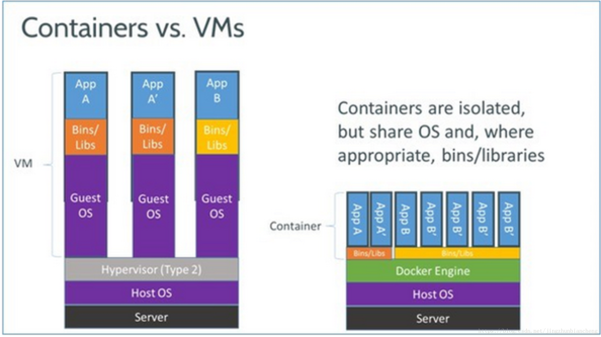
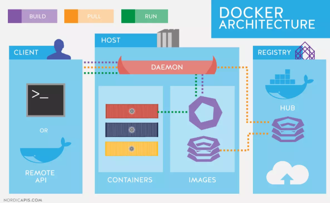
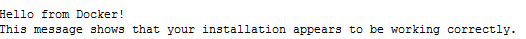
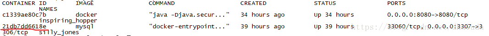
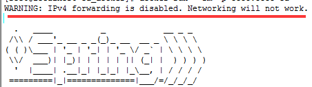
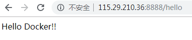

# 学习目标

```
1、为什么要使用Docker
2、Docker简介
3、安装Docker
4、部署SpringBoot应用到Docker
```

# 1、为什么要使用Docker

开发小明看到测试提交的bug，说：程序在我机器上跑得好好的，怎么到你那就不行了呢？

测试小王看到运维小刘发的问题报告，说：程序在这边测试得好好的，怎么到客户那边就不行了呢？

这其实是软件开发的日常，软件开发的一大麻烦问题就是：环境配置。

一个项目要跑起来，需要大量程序的支持，包括：jdk、tomcat、mysql、redis、nginx等等... 每个程序的环境配置都可能不同，这就很容易导致：在你的机器可以运行，在他的机器上就跑不起来。

那怎么解决这个难题呢？

## 1.1 容器化

答案就是：容器化

容器化就是把程序包装起来放到容器中，需要的时候再将容器复制出来，这样容器中的程序环境配置就能保持一致，从根本上解决了环境配置不一致的问题。

## 1.2 虚拟机和容器

想到容器化，有同学可能会想到我们前面使用过的虚拟机，虚拟机克隆后，里面的软件环境配置也是一样的。

虚拟机和容器的架构



可以看到虚拟机和容器最大的区别是：

虚拟机里面多了一个操作系统，而容器和宿主机共享操作系统，更加轻量级。

容器和虚拟机对比

| 特性       | 容器               | 虚拟机       |
| ---------- | ------------------ | ------------ |
| 启动时间   | 秒级               | 分钟级       |
| 硬盘使用   | 一般为MB           | 一般为GB     |
| 性能       | 接近原生           | 弱于原生     |
| 系统支持量 | 单机支持上千个容器 | 一般是几十个 |

容器在资源占用和性能方面比虚拟机更有优势，而虚拟机在系统功能和安全性方面要强于容器。

#  2、Docker简介


## 2.1 Docker是什么

Docker是一个开源的应用容器引擎，让开发者可以打包他们的应用以及依赖包到一个可移植的容器中，然后发布到任何流行的Linux机器上，也可以实现虚拟化，容器是完全使用沙箱机制，相互之间不会有任何接口。

Docker很像集装箱的运作系统，集装箱就是容器，里面就是我们需要的程序，这些集装箱彼此隔离，需要它们的时候，就从货轮上运过来，由码头工人装配到汽车、火车上，然后发往每个项目所在地。

## 2.2 Docker的架构



重要概念：

- Host		  		主机（运行Docker的服务器）

- Daemon	  	 守护进程（在后台执行Docker的操作）

- Registry	  	  仓库服务注册（远程服务器，保存大量仓库）

- Repository 	  仓库（保存镜像文件的位置）

- Image	  		  镜像（保存进程或软件的文件）

- Container	     容器（镜像运行后的进程）

```
Docker采用C/S模式（客户端/服务器模式），主要操作有build（构建）、pull（拉取）、run（运行），如用户需要使用mysql，就通过客户端连接主机，主机中的守护进程就会到远程服务注册中拉取mysql，保存到主机中镜像文件中，然后对mysql镜像进行构建，构建完成的镜像就可以创建出mysql容器，运行中的mysql容器就可以为用户提供服务。
```

# 3、安装Docker

1、删除旧版本的docker

```
yum remove docker \
    docker-client \
    docker-client-latest \
    docker-common \
    docker-latest \
    docker-latest-logrotate \
    docker-logrotate \
    docker-selinux \
    docker-engine-selinux \
    docker-engine
```

2、安装依赖包

```
yum install -y yum-utils \
    device-mapper-persistent-data \
    lvm2
```

3、安装docker

```
yum install docker
```

4、启动docker

```
systemctl enable docker
systemctl start docker
```

5、查看安装结果

```
docker version
```

6、配置镜像

加速镜像下载，创建或修改 /etc/docker/daemon.json 文件，修改为如下形式

```
{
  "registry-mirrors": [
    "https://registry.docker-cn.com",
    "http://hub-mirror.c.163.com",
    "https://docker.mirrors.ustc.edu.cn"
  ]
}
```

7、重启

```
systemctl restart docker
```

# 4、Docker的基本使用

常用Docker命令

```
docker images			  查看镜像
docker search 镜像名称	    搜索镜像
docker ps				   查看容器
docker stop 容器id		 停止容器
docker rm 容器id			 删除容器
docker rmi 镜像id			 删除镜像
docker run 镜像id			 运行镜像
docker pull 镜像名			拉取镜像
docker build 镜像名 .		创建镜像
```

1） 抓取仓库

```
docker pull library/hello-world
```

2） 查看镜像

```
docker images
```

4） 运行镜像

```
docker run hello-world
```



# 5、Docker安装MySQL

1）安装MySQL

```
docker pull mysql:5.7	
```

2）运行MySQL镜像

```
docker run  -p 3306:3306 -e MYSQL_ROOT_PASSWORD=123456 -d mysql镜像ID
```

-p 后面的端口是本机端口，映射到docker中MySQL的3306端口，后面设置了root密码

-d 是后台运行 

3）查看容器ID

```
docker ps
```



4）上传数据库脚本到Linux，然后将脚本复制到docker的root目录中

```
docker cp bookdb.sql 21db7dd6618e:\root
```

5）进入docker容器

```
docker exec -it  21db7dd6618e bash
```

6）进入MySQL

```
mysql -uroot -p123456
```

7）设置编码、创建数据库

```
set names utf8;
create database bookdb;
use bookdb;
```

8）导入sql脚本

```
source /root/bookdb.sql;
```

9）修改远程访问权限：

```
select host,user,plugin,authentication_string from mysql.user;
ALTER USER 'root'@'%' IDENTIFIED WITH mysql_native_password BY '123456';
flush privileges;
```

10) 退出mysql和docker

```
exit
```


# 6、在Docker上部署Springboot项目

1）修改pom文件

首先在springboot项目的pom.xml文件中添加Docker镜像名称：

```
<properties>
    <docker.image.prefix>springboot</docker.image.prefix>
</properties>
```

在plugin中添加docker构建插件：

```
<build>
    <plugins>
        <plugin>
            <groupId>org.springframework.boot</groupId>
            <artifactId>spring-boot-maven-plugin</artifactId>
        </plugin>
        <!-- Docker maven plugin -->
        <plugin>
            <groupId>com.spotify</groupId>
            <artifactId>docker-maven-plugin</artifactId>
            <version>1.0.0</version>
            <configuration>
                <imageName>${docker.image.prefix}/${project.artifactId}</imageName>
                <dockerDirectory>src/main/docker</dockerDirectory>
                <resources>
                    <resource>
                        <targetPath>/</targetPath>
                        <directory>${project.build.directory}</directory>
                        <include>${project.build.finalName}.jar</include>
                    </resource>
                </resources>
            </configuration>
        </plugin>
        <!-- Docker maven plugin -->
    </plugins>
</build>
```

2） 创建Dockerfile文件

```
FROM java:8
VOLUME /tmp
COPY jar文件名 app.jar
RUN bash -c "touch /app.jar"
EXPOSE 8080
ENTRYPOINT ["java", "-jar", "app.jar", "--spring.profiles.active=test", "--server.port=8080", "> /log/app.log"]
```

内容讲解：

```
FROM java:8是获取到远程仓库的jdk1.8镜像。

VOLUME指向了一个/tmp的目录，由于Spring Boot使用内置的Tomcat容器，Tomcat默认使用/tmp作为工作目录。效果就是在主机的/var/lib/docker目录下创建了一个临时文件，并连接到容器的/tmp。

将项目的jar文件复制为app.jar添加到容器

RUN表示在新创建的镜像中执行一些命令，然后把执行的结果提交到当前镜像。这里使用touch命令来改变文件的修改时间，Docker创建的所有容器文件默认状态都是“未修改”。这对于简单应用来说不需要，不过对于一些静态内容（比如：index.html）的文件就需要一个“修改时间”。

EXPOSE 容器暴露端口

ENTRYPOINT 应用启动命令 参数设定
```

3） 创建docker文件夹，将jar包与Dockerfile移动到该文件夹，进入该文件夹，运行命令：

```
docker build -t 镜像名称  .
```

4） 查看镜像

```
docker images
```

5）运行镜像

```
docker run --rm -p 8080:8080 --link mysql容器ID:localhost docker镜像名称或ID
```

--rm 表示容器会自动删除 

-p表示端口映射，冒号左边为docker容器外的端口号，右边为容器内的端口号

-d表示后台运行

--link 表示连接mysql容器（如果项目不需要数据库，可以去掉），冒号左边是mysql容器的id后面是容器的别名，这样jdbcUrl中配置的localhost会转换到mysql的docker容器上


6） 解决Docker不能联网问题

启动项目后如果出现下面提示，表示Docker的网络出现问题



解决方法

```
vi /etc/sysctl.conf
```

添加ipv4转发

```
net.ipv4.ip_forward=1
```

重启网络

```
service network restart
```

重新启动Docker镜像后通过浏览器测试



7） 保存镜像到远程仓库

登录Docker hub，输入账号、密码

```
docker login
```

推送镜像到docker hub

```
docker push 镜像名称
```

