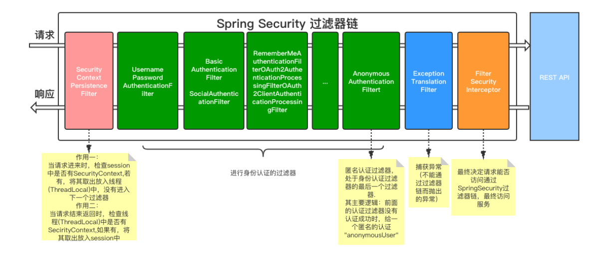
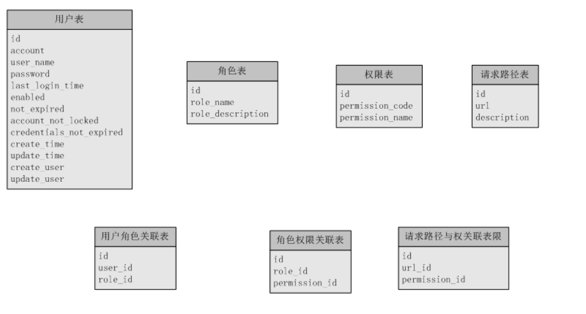
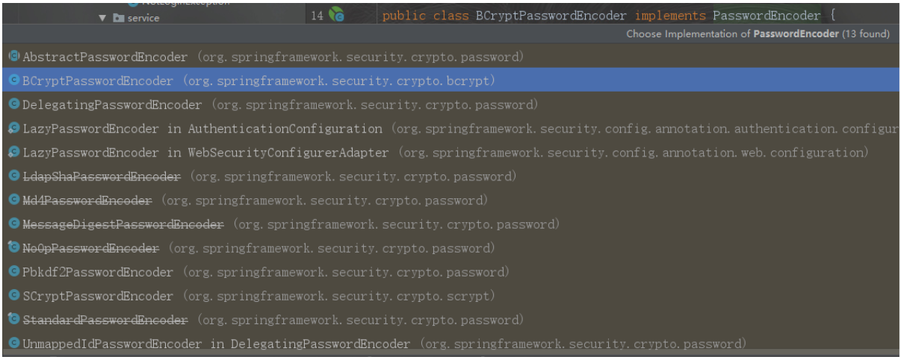
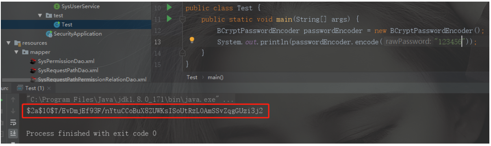
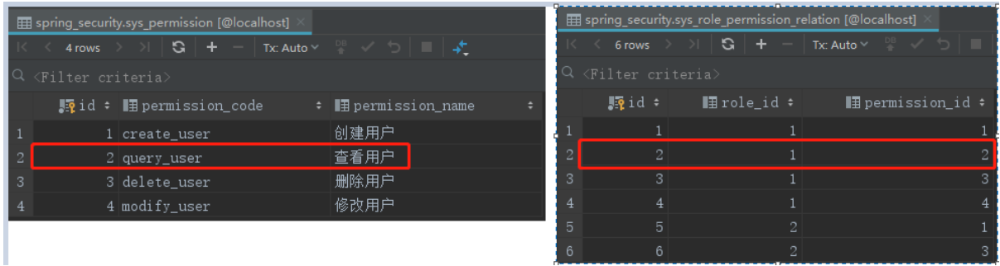
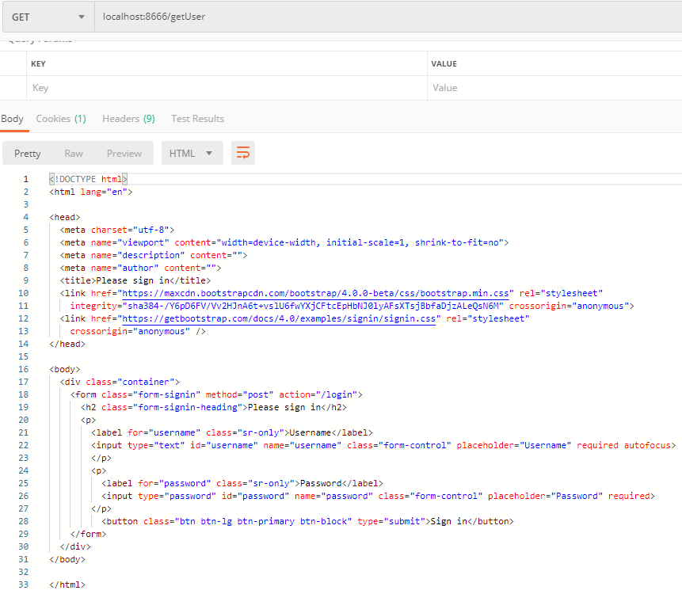
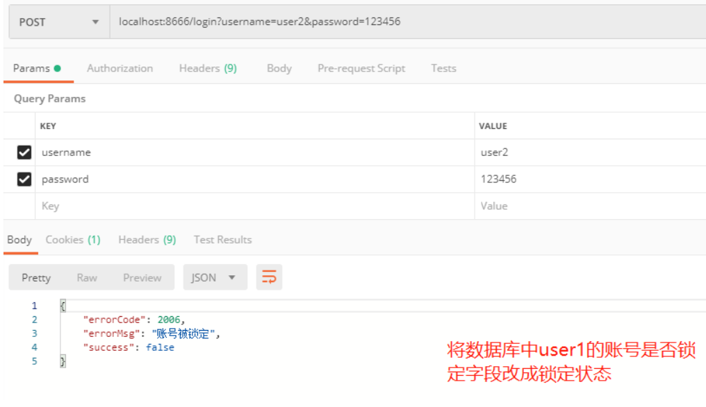
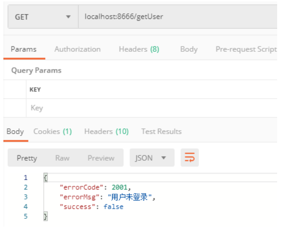
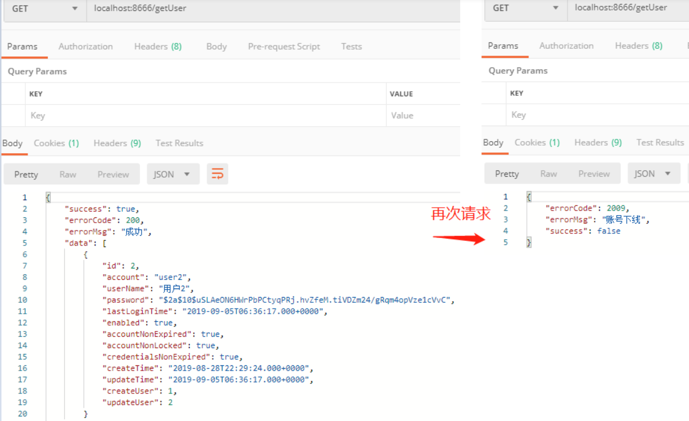

[TOC]

## 前言

Spring Security是一个功能强大且高度可定制的身份验证和访问控制框架。提供了完善的**认证机制**和方法级的**授权功能**。是一款非常优秀的权限管理框架。它的核心是一组过滤器链，不同的功能经由不同的过滤器。这篇文章就是想通过一个小案例将Spring Security整合到SpringBoot中去。要实现的功能就是在认证服务器上登录，然后获取Token，再访问资源服务器中的资源。



## 一、准备工作

### 1、统一错误码枚举

```
/**
 * @Author:  
 * @Description: 返回码定义
 * 规定:
 * #1表示成功
 * #1001～1999 区间表示参数错误
 * #2001～2999 区间表示用户错误
 * #3001～3999 区间表示接口异常
 * @Date Create in  
 */
public enum ResultCode {
    /* 成功 */
    SUCCESS(200, "成功"),

    /* 默认失败 */
    COMMON_FAIL(999, "失败"),

    /* 参数错误：1000～1999 */
    PARAM_NOT_VALID(1001, "参数无效"),
    PARAM_IS_BLANK(1002, "参数为空"),
    PARAM_TYPE_ERROR(1003, "参数类型错误"),
    PARAM_NOT_COMPLETE(1004, "参数缺失"),

    /* 用户错误 */
    USER_NOT_LOGIN(2001, "用户未登录"),
    USER_ACCOUNT_EXPIRED(2002, "账号已过期"),
    USER_CREDENTIALS_ERROR(2003, "密码错误"),
    USER_CREDENTIALS_EXPIRED(2004, "密码过期"),
    USER_ACCOUNT_DISABLE(2005, "账号不可用"),
    USER_ACCOUNT_LOCKED(2006, "账号被锁定"),
    USER_ACCOUNT_NOT_EXIST(2007, "账号不存在"),
    USER_ACCOUNT_ALREADY_EXIST(2008, "账号已存在"),
    USER_ACCOUNT_USE_BY_OTHERS(2009, "账号下线"),

    /* 业务错误 */
    NO_PERMISSION(3001, "没有权限");
    private Integer code;
    private String message;

    ResultCode(Integer code, String message) {
        this.code = code;
        this.message = message;
    }

    public Integer getCode() {
        return code;
    }

    public void setCode(Integer code) {
        this.code = code;
    }

    public String getMessage() {
        return message;
    }

    public void setMessage(String message) {
        this.message = message;
    }

    /**
     * 根据code获取message
     *
     * @param code
     * @return
     */
    public static String getMessageByCode(Integer code) {
        for (ResultCode ele : values()) {
            if (ele.getCode().equals(code)) {
                return ele.getMessage();
            }
        }
        return null;
    }
}

```

### 2、统一json返回体

```
/**
 * @Author 
 * @Description: 统一返回实体
 * @Date Create in  
 */
public class JsonResult<T> implements Serializable {
    private Boolean success;
    private Integer errorCode;
    private String errorMsg;
    private T data;

    public JsonResult() {
    }

    public JsonResult(boolean success) {
        this.success = success;
        this.errorCode = success ? ResultCode.SUCCESS.getCode() : ResultCode.COMMON_FAIL.getCode();
        this.errorMsg = success ? ResultCode.SUCCESS.getMessage() : ResultCode.COMMON_FAIL.getMessage();
    }

    public JsonResult(boolean success, ResultCode resultEnum) {
        this.success = success;
        this.errorCode = success ? ResultCode.SUCCESS.getCode() : (resultEnum == null ? ResultCode.COMMON_FAIL.getCode() : resultEnum.getCode());
        this.errorMsg = success ? ResultCode.SUCCESS.getMessage() : (resultEnum == null ? ResultCode.COMMON_FAIL.getMessage() : resultEnum.getMessage());
    }

    public JsonResult(boolean success, T data) {
        this.success = success;
        this.errorCode = success ? ResultCode.SUCCESS.getCode() : ResultCode.COMMON_FAIL.getCode();
        this.errorMsg = success ? ResultCode.SUCCESS.getMessage() : ResultCode.COMMON_FAIL.getMessage();
        this.data = data;
    }

    public JsonResult(boolean success, ResultCode resultEnum, T data) {
        this.success = success;
        this.errorCode = success ? ResultCode.SUCCESS.getCode() : (resultEnum == null ? ResultCode.COMMON_FAIL.getCode() : resultEnum.getCode());
        this.errorMsg = success ? ResultCode.SUCCESS.getMessage() : (resultEnum == null ? ResultCode.COMMON_FAIL.getMessage() : resultEnum.getMessage());
        this.data = data;
    }

    public Boolean getSuccess() {
        return success;
    }

    public void setSuccess(Boolean success) {
        this.success = success;
    }

    public Integer getErrorCode() {
        return errorCode;
    }

    public void setErrorCode(Integer errorCode) {
        this.errorCode = errorCode;
    }

    public String getErrorMsg() {
        return errorMsg;
    }

    public void setErrorMsg(String errorMsg) {
        this.errorMsg = errorMsg;
    }

    public T getData() {
        return data;
    }

    public void setData(T data) {
        this.data = data;
    }
}
```

### 3、返回体构造工具

```
/**
 * @Author 
 * @Description:
 * @Date Create in 
 */
public class ResultTool {
    public static JsonResult success() {
        return new JsonResult(true);
    }

    public static <T> JsonResult<T> success(T data) {
        return new JsonResult(true, data);
    }

    public static JsonResult fail() {
        return new JsonResult(false);
    }

    public static JsonResult fail(ResultCode resultEnum) {
        return new JsonResult(false, resultEnum);
    }
}

```

### 4、pom

```
<?xml version="1.0" encoding="UTF-8"?>
<project xmlns="http://maven.apache.org/POM/4.0.0" xmlns:xsi="http://www.w3.org/2001/XMLSchema-instance"
         xsi:schemaLocation="http://maven.apache.org/POM/4.0.0 https://maven.apache.org/xsd/maven-4.0.0.xsd">
    <modelVersion>4.0.0</modelVersion>
    <parent>
        <groupId>org.springframework.boot</groupId>
        <artifactId>spring-boot-starter-parent</artifactId>
        <version>2.1.7.RELEASE</version>
        <relativePath/> <!-- lookup parent from repository -->
    </parent>
    <groupId>com.spring</groupId>
    <artifactId>security</artifactId>
    <version>0.0.1-SNAPSHOT</version>
    <name>security</name>
    <description>测试spring-security工程</description>

    <properties>
        <java.version>1.8</java.version>
        <spring.security.version>5.1.6.RELEASE</spring.security.version>
        <fastjson.version>1.2.46</fastjson.version>
    </properties>

    <dependencies>
        <dependency>
            <groupId>org.springframework.boot</groupId>
            <artifactId>spring-boot-starter-web</artifactId>
        </dependency>

        <dependency>
            <groupId>org.springframework.boot</groupId>
            <artifactId>spring-boot-starter-test</artifactId>
            <scope>test</scope>
        </dependency>
        <!-- spring-security -->
        <dependency>
            <groupId>org.springframework.security</groupId>
            <artifactId>spring-security-web</artifactId>
            <version>${spring.security.version}</version>
        </dependency>
        <dependency>
            <groupId>org.springframework.security</groupId>
            <artifactId>spring-security-config</artifactId>
            <version>${spring.security.version}</version>
        </dependency>
        <!-- Hikari连接池-->
        <dependency>
            <groupId>com.zaxxer</groupId>
            <artifactId>HikariCP</artifactId>
        </dependency>
        <dependency>
            <groupId>org.springframework.boot</groupId>
            <artifactId>spring-boot-starter-jdbc</artifactId>
            <exclusions>
                <!-- 排除 tomcat-jdbc 以使用 HikariCP -->
                <exclusion>
                    <groupId>org.apache.tomcat</groupId>
                    <artifactId>tomcat-jdbc</artifactId>
                </exclusion>
            </exclusions>
        </dependency>
        <dependency>
            <groupId>mysql</groupId>
            <artifactId>mysql-connector-java</artifactId>
            <version>${mysql.version}</version>
        </dependency>
        <!-- Mybatis-plus-->
        <dependency>
            <groupId>com.baomidou</groupId>
            <artifactId>mybatisplus-spring-boot-starter</artifactId>
            <version>1.0.5</version>
        </dependency>
        <dependency>
            <groupId>com.baomidou</groupId>
            <artifactId>mybatis-plus</artifactId>
            <version>2.1.9</version>
        </dependency>
        <dependency>
            <groupId>org.projectlombok</groupId>
            <artifactId>lombok</artifactId>
        </dependency>
        <!--JSON-->
        <dependency>
            <groupId>com.alibaba</groupId>
            <artifactId>fastjson</artifactId>
            <version>${fastjson.version}</version>
        </dependency>
        <dependency>
            <groupId>org.apache.commons</groupId>
            <artifactId>commons-lang3</artifactId>
            <version>3.8.1</version>
        </dependency>
    </dependencies>

    <build>
        <plugins>
            <plugin>
                <groupId>org.springframework.boot</groupId>
                <artifactId>spring-boot-maven-plugin</artifactId>
            </plugin>
        </plugins>
    </build>

</project>
```

### 5、配置文件

```
spring:
  application:
    name: isoftstone-security
  datasource:
    type: com.zaxxer.hikari.HikariDataSource
    driver-class-name: com.mysql.cj.jdbc.Driver
    url: jdbc:mysql://localhost:3306/spring_security?useUnicode=true&characterEncoding=utf-8&useSSL=false&serverTimezone=CTT
    username: root
    password: root
    hikari:
      minimum-idle: 5
      idle-timeout: 600000
      maximum-pool-size: 10
      auto-commit: true
      pool-name: MyHikariCP
      max-lifetime: 1800000
      connection-timeout: 30000
      connection-test-query: SELECT 1
server:
  port: 8666

mybatis-plus:
  # 如果是放在src/main/java目录下 classpath:/com/yourpackage/*/mapper/*Mapper.xml
  # 如果是放在resource目录 classpath:/mapper/*Mapper.xml
  mapper-locations: classpath:mapper/*.xml, classpath:mybatis/mapping/**/*.xml
  #实体扫描，多个package用逗号或者分号分隔
  typeAliasesPackage: com.spring.**
  global-config:
    #主键类型  0:"数据库ID自增", 1:"用户输入ID",2:"全局唯一ID (数字类型唯一ID)", 3:"全局唯一ID UUID";
    id-type: 0
    #字段策略 0:"忽略判断",1:"非 NULL 判断"),2:"非空判断"
    field-strategy: 1
    #驼峰下划线转换
    db-column-underline: true
    #刷新mapper 调试神器
    refresh-mapper: true
    #数据库大写下划线转换
    #capital-mode: true
    #序列接口实现类配置,不在推荐使用此方式进行配置,请使用自定义bean注入
    #key-generator: com.baomidou.mybatisplus.incrementer.H2KeyGenerator
    #逻辑删除配置（下面3个配置）
    logic-delete-value: 0
    logic-not-delete-value: 1
    #自定义sql注入器,不在推荐使用此方式进行配置,请使用自定义bean注入
    #sql-injector: com.baomidou.mybatisplus.mapper.LogicSqlInjector
    #自定义填充策略接口实现,不在推荐使用此方式进行配置,请使用自定义bean注入
    # meta-object-handler: com.baomidou.springboot.MyMetaObjectHandler
    #自定义SQL注入器
    #sql-injector: com.baomidou.springboot.xxx
    # SQL 解析缓存，开启后多租户 @SqlParser 注解生效
    sql-parser-cache: true
  configuration:
    map-underscore-to-camel-case: true
    cache-enabled: false

```

## 二、数据库表设计



### 建表语句

```
create table sys_user
(
    id                      int auto_increment
        primary key,
    account                 varchar(32)          not null comment '账号',
    user_name               varchar(32)          not null comment '用户名',
    password                varchar(64)          null comment '用户密码',
    last_login_time         datetime             null comment '上一次登录时间',
    enabled                 tinyint(1) default 1 null comment '账号是否可用。默认为1（可用）',
    not_expired             tinyint(1) default 1 null comment '是否过期。默认为1（没有过期）',
    account_not_locked      tinyint(1) default 1 null comment '账号是否锁定。默认为1（没有锁定）',
    credentials_not_expired tinyint(1) default 1 null comment '证书（密码）是否过期。默认为1（没有过期）',
    create_time             datetime             null comment '创建时间',
    update_time             datetime             null comment '修改时间',
    create_user             int                  null comment '创建人',
    update_user             int                  null comment '修改人'
)
    comment '用户表';

```

```
create table sys_role
(
    id               int auto_increment comment '主键id'
        primary key,
    role_name        varchar(32) null comment '角色名',
    role_description varchar(64) null comment '角色说明'
)
    comment '用户角色表';

```

```
create table sys_permission
(
    id              int auto_increment comment '主键id'
        primary key,
    permission_code varchar(32) null comment '权限code',
    permission_name varchar(32) null comment '权限名'
)
    comment '权限表';

```

```
create table sys_user_role_relation
(
    id      int auto_increment comment '主键id'
        primary key,
    user_id int null comment '用户id',
    role_id int null comment '角色id'
)
    comment '用户角色关联关系表';

```

```
create table sys_role_permission_relation
(
    id            int auto_increment comment '主键id'
        primary key,
    role_id       int null comment '角色id',
    permission_id int null comment '权限id'
)
    comment '角色-权限关联关系表';

```

```
create table sys_request_path
(
    id          int auto_increment comment '主键id'
        primary key,
    url         varchar(64)  not null comment '请求路径',
    description varchar(128) null comment '路径描述'
)
    comment '请求路径';

```

```
create table sys_request_path_permission_relation
(
    id            int auto_increment comment '主键id' primary key,,
    url_id        int null comment '请求路径id',
    permission_id int null comment '权限id'
)
    comment '路径权限关联表';

```

### 初始化表数据语句

```
-- 用户
INSERT INTO sys_user (id, account, user_name, password, last_login_time, enabled, account_non_expired, account_non_locked, credentials_non_expired, create_time, update_time, create_user, update_user) VALUES (1, 'user1', '用户1', '$2a$10$47lsFAUlWixWG17Ca3M/r.EPJVIb7Tv26ZaxhzqN65nXVcAhHQM4i', '2019-09-04 20:25:36', 1, 1, 1, 1, '2019-08-29 06:28:36', '2019-09-04 20:25:36', 1, 1);
INSERT INTO sys_user (id, account, user_name, password, last_login_time, enabled, account_non_expired, account_non_locked, credentials_non_expired, create_time, update_time, create_user, update_user) VALUES (2, 'user2', '用户2', '$2a$10$uSLAeON6HWrPbPCtyqPRj.hvZfeM.tiVDZm24/gRqm4opVze1cVvC', '2019-09-05 00:07:12', 1, 1, 1, 1, '2019-08-29 06:29:24', '2019-09-05 00:07:12', 1, 2);
-- 角色
INSERT INTO sys_role (id, role_code, role_name, role_description) VALUES (1, 'admin', '管理员', '管理员，拥有所有权限');
INSERT INTO sys_role (id, role_code, role_name, role_description) VALUES (2, 'user', '普通用户', '普通用户，拥有部分权限');
-- 权限
INSERT INTO sys_permission (id, permission_code, permission_name) VALUES (1, 'create_user', '创建用户');
INSERT INTO sys_permission (id, permission_code, permission_name) VALUES (2, 'query_user', '查看用户');
INSERT INTO sys_permission (id, permission_code, permission_name) VALUES (3, 'delete_user', '删除用户');
INSERT INTO sys_permission (id, permission_code, permission_name) VALUES (4, 'modify_user', '修改用户');
-- 请求路径
INSERT INTO sys_request_path (id, url, description) VALUES (1, '/getUser', '查询用户');
-- 用户角色关联关系
INSERT INTO sys_user_role_relation (id, user_id, role_id) VALUES (1, 1, 1);
INSERT INTO sys_user_role_relation (id, user_id, role_id) VALUES (2, 2, 2);
-- 角色权限关联关系
INSERT INTO sys_role_permission_relation (id, role_id, permission_id) VALUES (1, 1, 1);
INSERT INTO sys_role_permission_relation (id, role_id, permission_id) VALUES (2, 1, 2);
INSERT INTO sys_role_permission_relation (id, role_id, permission_id) VALUES (3, 1, 3);
INSERT INTO sys_role_permission_relation (id, role_id, permission_id) VALUES (4, 1, 4);
INSERT INTO sys_role_permission_relation (id, role_id, permission_id) VALUES (5, 2, 1);
INSERT INTO sys_role_permission_relation (id, role_id, permission_id) VALUES (6, 2, 2);
-- 请求路径权限关联关系
INSERT INTO sys_request_path_permission_relation (id, url_id, permission_id) VALUES (null, 1, 2);

```

## 三、Spring Security核心配置：WebSecurityConfig

    创建WebSecurityConfig继承WebSecurityConfigurerAdapter类，并实现configure(AuthenticationManagerBuilder auth)和 configure(HttpSecurity http)方法。后续我们会在里面加入一系列配置，包括配置认证方式、登入登出、异常处理、会话管理等。

```
@Configuration
@EnableWebSecurity
public class WebSecurityConfig extends WebSecurityConfigurerAdapter {
    @Override
    protected void configure(AuthenticationManagerBuilder auth) throws Exception {
        //配置认证方式等
        super.configure(auth);
    }

    @Override
    protected void configure(HttpSecurity http) throws Exception {
        //http相关的配置，包括登入登出、异常处理、会话管理等
        super.configure(http);
    }
}

```

## 四、用户登录认证逻辑：UserDetailsService

### 1、创建自定义UserDetailsService

  这是实现自定义用户认证的核心逻辑，loadUserByUsername(String username)的参数就是登录时提交的用户名，返回类型是一个叫UserDetails 的接口，需要在这里构造出他的一个实现类User，这是Spring security提供的用户信息实体。

```
public class UserDetailsServiceImpl  implements UserDetailsService {
    @Override
    public UserDetails loadUserByUsername(String username) throws UsernameNotFoundException {
        //需要构造出 org.springframework.security.core.userdetails.User 对象并返回
        return null;
    }
}

```

这里我们使用他的一个参数比较详细的构造函数，源码如下

```
User(String username, String password, boolean enabled, boolean accountNonExpired, boolean credentialsNonExpired, boolean accountNonLocked, Collection<? extends GrantedAuthority> authorities)

```

其中参数：

> String username：用户名
> String password： 密码
> boolean enabled： 账号是否可用
> boolean accountNonExpired：账号是否过期
> boolean credentialsNonExpired：密码是否过期
> boolean accountNonLocked：账号是否锁定
> Collection<? extends GrantedAuthority> authorities)：用户权限列表

   这就与我们的创建的用户表的字段对应起来了，Spring security都为我们封装好了，如果用户信息的状态异常，登录时则会抛出相应的异常，根据捕获到的异常判断是什么原因（账号过期/密码过期/账号锁定等等…），进而就可以提示前台了。
    我们就按照该参数列表构造出我们所需要的数据，然后返回，就完成了基于JDBC的自定义用户认证。
    首先用户名密码以及用户状态信息都是从用户表里进行单表查询来的，而权限列表则是通过用户表、角色表以及权限表等关联查出来的，那么接下来就是准备service和dao层方法了

### 2、准备service和dao层方法

#### （1）根据用户名查询用户信息

映射文件

```
    <!--根据用户名查询用户-->
    <select id="selectByName" resultMap="SysUserMap">
        select * from sys_user where account = #{userName};
    </select>

```

service层

```
    /**
     * 根据用户名查询用户
     *
     * @param userName
     * @return
     */
    SysUser selectByName(String userName);

```

#### （2）根据用户名查询用户的权限信息

映射文件

```
    <select id="selectListByUser" resultMap="SysPermissionMap">
        SELECT
        p.*
        FROM
        sys_user AS u
        LEFT JOIN sys_user_role_relation AS ur
        ON u.id = ur.user_id
        LEFT JOIN sys_role AS r
        ON r.id = ur.role_id
        LEFT JOIN sys_role_permission_relation AS rp
        ON r.id = rp.role_id
        LEFT JOIN sys_permission AS p
        ON p.id = rp.permission_id
        WHERE u.id = #{userId}
    </select>

```

service层

```
    /**
     * 查询用户的权限列表
     *
     * @param userId
     * @return
     */
    List<SysPermission> selectListByUser(Integer userId);

```

  这样的话流程我们就理清楚了，首先根据用户名查出对应用户，再拿得到的用户的用户id去查询它所拥有的的权限列表，最后构造出我们需要的org.springframework.security.core.userdetails.User对象。
接下来改造一下刚刚自定义的UserDetailsService

```
public class UserDetailsServiceImpl implements UserDetailsService {
    @Autowired
    private SysUserService sysUserService;
    @Autowired
    private SysPermissionService sysPermissionService;

    @Override
    public UserDetails loadUserByUsername(String username) throws UsernameNotFoundException {
        if (username == null || "".equals(username)) {
            throw new RuntimeException("用户不能为空");
        }
        //根据用户名查询用户
        SysUser sysUser = sysUserService.selectByName(username);
        if (sysUser == null) {
            throw new RuntimeException("用户不存在");
        }
        List<GrantedAuthority> grantedAuthorities = new ArrayList<>();
        if (sysUser != null) {
            //获取该用户所拥有的权限
            List<SysPermission> sysPermissions = sysPermissionService.selectListByUser(sysUser.getId());
            // 声明用户授权
            sysPermissions.forEach(sysPermission -> {
                GrantedAuthority grantedAuthority = new SimpleGrantedAuthority(sysPermission.getPermissionCode());
                grantedAuthorities.add(grantedAuthority);
            });
        }
        return new User(sysUser.getAccount(), sysUser.getPassword(), sysUser.getEnabled(), sysUser.getAccountNonExpired(), sysUser.getCredentialsNonExpired(), sysUser.getAccountNonLocked(), grantedAuthorities);
    }
}

```

    然后将我们的自定义的基于JDBC的用户认证在之前创建的WebSecurityConfig 中得configure(AuthenticationManagerBuilder auth)中声明一下，到此自定义的基于JDBC的用户认证就完成了

```
    @Bean
    public UserDetailsService userDetailsService() {
        //获取用户账号密码及权限信息
        return new UserDetailsServiceImpl();
    }

    @Override
    protected void configure(AuthenticationManagerBuilder auth) throws Exception {
        //配置认证方式
        auth.userDetailsService(userDetailsService());
    }

```

## 五、用户密码加密

    新版本的Spring security规定必须设置一个默认的加密方式，不允许使用明文。这个加密方式是用于在登录时验证密码、注册时需要用到。
    我们可以自己选择一种加密方式，Spring security为我们提供了多种加密方式，我们这里使用一种强hash方式进行加密。


    在WebSecurityConfig 中注入（注入即可，不用声明使用），这样就会对提交的密码进行加密处理了，如果你没有注入加密方式，运行的时候会报错"There is no PasswordEncoder mapped for the id"错误。

```
    @Bean
    public BCryptPasswordEncoder passwordEncoder() {
        // 设置默认的加密方式（强hash方式加密）
        return new BCryptPasswordEncoder();
    }

```

 	同样的我们数据库里存储的密码也要用同样的加密方式存储，例如我们将123456用BCryptPasswordEncoder 加密后存储到数据库中（注意：即使是同一个明文用这种加密方式加密出来的密文也是不同的，这就是这种加密方式的特点）



## 六、屏蔽Spring Security默认重定向登录页面以实现前后端分离功能

    在演示登录之前我们先编写一个查询接口"/getUser"，并将"/getUser"接口规定为需要拥有"query_user"权限的用户可以访问，并在角色-权限关联关系表中给user1用户所属角色（role_id = 1）添加权限"query_user"


  然后规定接口"/getUser"只能是拥有"query_user"权限的用户可以访问。后面我们基本都用这个查询接口作为演示，就叫它"资源接口"吧。

```
http.authorizeRequests().
       antMatchers("/getUser").hasAuthority("query_user").

```

​		演示登录时，如果用户没有登录去请求资源接口就会提示未登录
    在前后端不分离的时候当用户未登录去访问资源时Spring security会重定向到默认的登录页面，返回的是一串html标签，这一串html标签其实就是登录页面的提交表单。如图所示



  	而在前后端分离的情况下（比如前台使用VUE或JQ等）我们需要的是在前台接收到"用户未登录"的提示信息，所以我们接下来要做的就是屏蔽重定向的登录页面，并返回统一的json格式的返回体。而实现这一功能的核心就是实现AuthenticationEntryPoint并在WebSecurityConfig中注入，然后在configure(HttpSecurity http)方法中。AuthenticationEntryPoint主要是用来处理匿名用户访问无权限资源时的异常（即未登录，或者登录状态过期失效）

```
/**
 * @Author 
 * @Description: 匿名用户访问无权限资源时的异常
 * @Date Create in  
 */
@Component
public class CustomizeAuthenticationEntryPoint implements AuthenticationEntryPoint {
    @Override
    public void commence(HttpServletRequest httpServletRequest, HttpServletResponse httpServletResponse, AuthenticationException e) throws IOException, ServletException {
        JsonResult result = ResultTool.fail(ResultCode.USER_NOT_LOGIN);
        httpServletResponse.setContentType("text/json;charset=utf-8");
        httpServletResponse.getWriter().write(JSON.toJSONString(result));
    }
}

```

在WebSecurityConfig中的configure(HttpSecurity http)方法中声明

```
 //异常处理(权限拒绝、登录失效等)
 and().exceptionHandling().
 authenticationEntryPoint(authenticationEntryPoint).//匿名用户访问无权限资源时的异常处理

```

再次请求资源接口


前台拿到这个错误时就可以做一些处理了，主要是退出到登录页面。

### 1、实现登录成功/失败、登出处理逻辑

 首先需要明白一件事，对于登入登出我们都不需要自己编写controller接口，Spring Security为我们封装好了。默认登入路径:/login，登出路径:/logout。当然我们可以也修改默认的名字。登录成功失败和登出的后续处理逻辑如何编写会在后面慢慢解释。
    当登录成功或登录失败都需要返回统一的json返回体给前台，前台才能知道对应的做什么处理。
而实现登录成功和失败的异常处理需要分别实现AuthenticationSuccessHandler和AuthenticationFailureHandler接口并在WebSecurityConfig中注入，然后在configure(HttpSecurity http)方法中然后声明

#### （1）登录成功

```
/**
 * @Author 
 * @Description: 登录成功处理逻辑
 * @Date Create in  
 */
@Component
public class CustomizeAuthenticationSuccessHandler implements AuthenticationSuccessHandler {
    @Autowired
    SysUserService sysUserService;

    @Override
    public void onAuthenticationSuccess(HttpServletRequest httpServletRequest, HttpServletResponse httpServletResponse, Authentication authentication) throws IOException, ServletException {
        //更新用户表上次登录时间、更新人、更新时间等字段
        User userDetails = (User)SecurityContextHolder.getContext().getAuthentication().getPrincipal();
        SysUser sysUser = sysUserService.selectByName(userDetails.getUsername());
        sysUser.setLastLoginTime(new Date());
        sysUser.setUpdateTime(new Date());
        sysUser.setUpdateUser(sysUser.getId());
        sysUserService.update(sysUser);
        
        //此处还可以进行一些处理，比如登录成功之后可能需要返回给前台当前用户有哪些菜单权限，
        //进而前台动态的控制菜单的显示等，具体根据自己的业务需求进行扩展

        //返回json数据
        JsonResult result = ResultTool.success();
       //处理编码方式，防止中文乱码的情况
        httpServletResponse.setContentType("text/json;charset=utf-8");
       //塞到HttpServletResponse中返回给前台
        httpServletResponse.getWriter().write(JSON.toJSONString(result));
    }
}

```

#### （2）登录失败

​		登录失败处理器主要用来对登录失败的场景（密码错误、账号锁定等…）做统一处理并返回给前台统一的json返回体。还记得我们创建用户表的时候创建了账号过期、密码过期、账号锁定之类的字段吗，这里就可以派上用场了.

```
/**
 * @Author: Hutengfei
 * @Description: 登录失败处理逻辑
 * @Date Create in 2019/9/3 15:52
 */
@Component
public class CustomizeAuthenticationFailureHandler implements AuthenticationFailureHandler {


    @Override
    public void onAuthenticationFailure(HttpServletRequest httpServletRequest, HttpServletResponse httpServletResponse, AuthenticationException e) throws IOException, ServletException {
        //返回json数据
        JsonResult result = null;
        if (e instanceof AccountExpiredException) {
            //账号过期
            result = ResultTool.fail(ResultCode.USER_ACCOUNT_EXPIRED);
        } else if (e instanceof BadCredentialsException) {
            //密码错误
            result = ResultTool.fail(ResultCode.USER_CREDENTIALS_ERROR);
        } else if (e instanceof CredentialsExpiredException) {
            //密码过期
            result = ResultTool.fail(ResultCode.USER_CREDENTIALS_EXPIRED);
        } else if (e instanceof DisabledException) {
            //账号不可用
            result = ResultTool.fail(ResultCode.USER_ACCOUNT_DISABLE);
        } else if (e instanceof LockedException) {
            //账号锁定
            result = ResultTool.fail(ResultCode.USER_ACCOUNT_LOCKED);
        } else if (e instanceof InternalAuthenticationServiceException) {
            //用户不存在
            result = ResultTool.fail(ResultCode.USER_ACCOUNT_NOT_EXIST);
        }else{
            //其他错误
            result = ResultTool.fail(ResultCode.COMMON_FAIL);
        }
       //处理编码方式，防止中文乱码的情况
        httpServletResponse.setContentType("text/json;charset=utf-8");
       //塞到HttpServletResponse中返回给前台
        httpServletResponse.getWriter().write(JSON.toJSONString(result));
    }
}

```

#### （3）登出

​		同样的登出也要将登出成功时结果返回给前台，并且登出之后进行将cookie失效或删除	

```
/**
 * @Author: Hutengfei
 * @Description: 登出成功处理逻辑
 * @Date Create in 2019/9/4 10:17
 */
@Component
public class CustomizeLogoutSuccessHandler implements LogoutSuccessHandler {
    @Override
    public void onLogoutSuccess(HttpServletRequest httpServletRequest, HttpServletResponse httpServletResponse, Authentication authentication) throws IOException, ServletException {
        JsonResult result = ResultTool.success();
        httpServletResponse.setContentType("text/json;charset=utf-8");
        httpServletResponse.getWriter().write(JSON.toJSONString(result));
    }
}

```

### 2、在WebSecurityConfig中的configure(HttpSecurity http)方法中声明

```
//登入
and().formLogin().
	permitAll().//允许所有用户
	successHandler(authenticationSuccessHandler).//登录成功处理逻辑
	failureHandler(authenticationFailureHandler).//登录失败处理逻辑

```

```
//登出
and().logout().
	permitAll().//允许所有用户
	logoutSuccessHandler(logoutSuccessHandler).//登出成功处理逻辑
	deleteCookies("JSESSIONID").//登出之后删除cookie

```

效果如图：
**登录时密码错误**


**登录时账号被锁定**



**退出登录之后再次请求资源接口**



## 七、会话管理（登录过时、限制单用户或多用户登录等）

### 1、限制登录用户数量

```
and().sessionManagement().
                    maximumSessions(1)

```

### 2、处理账号被挤下线处理逻辑

同样的，当账号异地登录导致被挤下线时也要返回给前端json格式的数据，比如提示"账号下线"、"您的账号在异地登录，是否是您自己操作"或者"您的账号在异地登录,可能由于密码泄露，建议修改密码"等。这时就要实现SessionInformationExpiredStrategy（会话信息过期策略）来自定义会话过期时的处理逻辑。

```
/**
 * @Author 
 * @Description: 会话信息过期策略
 * @Date Create in  
 */
@Component
public class CustomizeSessionInformationExpiredStrategy implements SessionInformationExpiredStrategy {
    @Override
    public void onExpiredSessionDetected(SessionInformationExpiredEvent sessionInformationExpiredEvent) throws IOException, ServletException {
        JsonResult result = ResultTool.fail(ResultCode.USER_ACCOUNT_USE_BY_OTHERS);
        HttpServletResponse httpServletResponse = sessionInformationExpiredEvent.getResponse();
        httpServletResponse.setContentType("text/json;charset=utf-8");
        httpServletResponse.getWriter().write(JSON.toJSONString(result));
    }
}

```

### 3、在WebSecurityConfig中声明

然后需要在WebSecurityConfig中注入，并在configure(HttpSecurity http)方法中然后声明，在配置同时登录用户数的配置下面再加一行 expiredSessionStrategy(sessionInformationExpiredStrategy)

```
//会话管理
and().sessionManagement().
	maximumSessions(1).//同一账号同时登录最大用户数
	expiredSessionStrategy(sessionInformationExpiredStrategy);//会话信息过期策略会话信息过期策略(账号被挤下线)

```

效果演示步骤
**我电脑上用postman登录
我电脑上请求资源接口，可以请求，如下左图
在旁边电脑上再登录一次刚刚的账号
在我电脑上再次请求资源接口，提示"账号下线"，如右下图**



## 八、实现基于JDBC的动态权限控制

在之前的章节中我们配置了一个

```
antMatchers("/getUser").hasAuthority("query_user")

```

   其实我们就已经实现了一个所谓的基于RBAC的权限控制，只不过我们是在WebSecurityConfig中写死的，但是在平时开发中，难道我们每增加一个需要访问权限控制的资源我们都要修改一下WebSecurityConfig增加一个antMatchers(…)吗，肯定是不合理的。因此我们现在要做的就是将需要权限控制的资源配到数据库中，当然也可以存储在其他地方，比如用一个枚举，只是我觉得存在数据库中更加灵活一点。
    我们需要实现一个AccessDecisionManager（访问决策管理器），在里面我们对当前请求的资源进行权限判断，判断当前登录用户是否拥有该权限，如果有就放行，如果没有就抛出一个"权限不足"的异常。不过在实现AccessDecisionManager之前我们还需要做一件事，那就是拦截到当前的请求，并根据请求路径从数据库中查出当前资源路径需要哪些权限才能访问，然后将查出的需要的权限列表交给AccessDecisionManager去处理后续逻辑。那就是需要先实现一个SecurityMetadataSource，翻译过来是"安全元数据源"，我们这里使用他的一个子类FilterInvocationSecurityMetadataSource。
    在自定义的SecurityMetadataSource编写好之后，我们还要编写一个拦截器，增加到Spring security默认的拦截器链中，以达到拦截的目的。
    同样的最后需要在WebSecurityConfig中注入，并在configure(HttpSecurity http)方法中然后声明

### 1、权限拦截器

```
/**
 * @Author 
 * @Description: 权限拦截器
 * @Date Create in  
 */
@Service
public class CustomizeAbstractSecurityInterceptor extends AbstractSecurityInterceptor implements Filter {

    @Autowired
    private FilterInvocationSecurityMetadataSource securityMetadataSource;

    @Autowired
    public void setMyAccessDecisionManager(CustomizeAccessDecisionManager accessDecisionManager) {
        super.setAccessDecisionManager(accessDecisionManager);
    }

    @Override
    public Class<?> getSecureObjectClass() {
        return FilterInvocation.class;
    }

    @Override
    public SecurityMetadataSource obtainSecurityMetadataSource() {
        return this.securityMetadataSource;
    }

    @Override
    public void doFilter(ServletRequest servletRequest, ServletResponse servletResponse, FilterChain filterChain) throws IOException, ServletException {
        FilterInvocation fi = new FilterInvocation(servletRequest, servletResponse, filterChain);
        invoke(fi);
    }

    public void invoke(FilterInvocation fi) throws IOException, ServletException {
        //fi里面有一个被拦截的url
        //里面调用MyInvocationSecurityMetadataSource的getAttributes(Object object)这个方法获取fi对应的所有权限
        //再调用MyAccessDecisionManager的decide方法来校验用户的权限是否足够
        InterceptorStatusToken token = super.beforeInvocation(fi);
        try {
        //执行下一个拦截器
            fi.getChain().doFilter(fi.getRequest(), fi.getResponse());
        } finally {
            super.afterInvocation(token, null);
        }
    }
}

```

### 2、安全元数据源FilterInvocationSecurityMetadataSource

```
/**
 * @Author:  
 * @Description:
 * @Date Create in 
 */
@Component
public class CustomizeFilterInvocationSecurityMetadataSource implements FilterInvocationSecurityMetadataSource {
    AntPathMatcher antPathMatcher = new AntPathMatcher();
    @Autowired
    SysPermissionService sysPermissionService;
    @Override
    public Collection<ConfigAttribute> getAttributes(Object o) throws IllegalArgumentException {
        //获取请求地址
        String requestUrl = ((FilterInvocation) o).getRequestUrl();
        //查询具体某个接口的权限
        List<SysPermission> permissionList =  sysPermissionService.selectListByPath(requestUrl);
        if(permissionList == null || permissionList.size() == 0){
            //请求路径没有配置权限，表明该请求接口可以任意访问
            return null;
        }
        String[] attributes = new String[permissionList.size()];
        for(int i = 0;i<permissionList.size();i++){
            attributes[i] = permissionList.get(i).getPermissionCode();
        }
        return SecurityConfig.createList(attributes);
    }

    @Override
    public Collection<ConfigAttribute> getAllConfigAttributes() {
        return null;
    }

    @Override
    public boolean supports(Class<?> aClass) {
        return true;
    }
}

```

### 3、访问决策管理器AccessDecisionManager

```
/**
 * @Author: 
 * @Description: 访问决策管理器
 * @Date Create in  
 */
@Component
public class CustomizeAccessDecisionManager implements AccessDecisionManager {
    @Override
    public void decide(Authentication authentication, Object o, Collection<ConfigAttribute> collection) throws AccessDeniedException, InsufficientAuthenticationException {
        Iterator<ConfigAttribute> iterator = collection.iterator();
        while (iterator.hasNext()) {
            ConfigAttribute ca = iterator.next();
            //当前请求需要的权限
            String needRole = ca.getAttribute();
            //当前用户所具有的权限
            Collection<? extends GrantedAuthority> authorities = authentication.getAuthorities();
            for (GrantedAuthority authority : authorities) {
                if (authority.getAuthority().equals(needRole)) {
                    return;
                }
            }
        }
        throw new AccessDeniedException("权限不足!");
    }

    @Override
    public boolean supports(ConfigAttribute configAttribute) {
        return true;
    }

    @Override
    public boolean supports(Class<?> aClass) {
        return true;
    }
}

```

### 4、在WebSecurityConfig中声明

先在WebSecurityConfig中注入，并在configure(HttpSecurity http)方法中然后声明

```
        http.authorizeRequests().
                withObjectPostProcessor(new ObjectPostProcessor<FilterSecurityInterceptor>() {
                    @Override
                    public <O extends FilterSecurityInterceptor> O postProcess(O o) {
                        o.setAccessDecisionManager(accessDecisionManager);//访问决策管理器
                        o.setSecurityMetadataSource(securityMetadataSource);//安全元数据源
                        return o;
                    }
                });
        http.addFilterBefore(securityInterceptor, FilterSecurityInterceptor.class);//增加到默认拦截链中

```

## 九、最终的WebSecurityConfig配置

```
/**
 * @Author: 
 * @Description:
 * @Date Create in  
 */
@Configuration
@EnableWebSecurity
public class WebSecurityConfig extends WebSecurityConfigurerAdapter {
    //登录成功处理逻辑
    @Autowired
    CustomizeAuthenticationSuccessHandler authenticationSuccessHandler;

    //登录失败处理逻辑
    @Autowired
    CustomizeAuthenticationFailureHandler authenticationFailureHandler;

    //权限拒绝处理逻辑
    @Autowired
    CustomizeAccessDeniedHandler accessDeniedHandler;

    //匿名用户访问无权限资源时的异常
    @Autowired
    CustomizeAuthenticationEntryPoint authenticationEntryPoint;

    //会话失效(账号被挤下线)处理逻辑
    @Autowired
    CustomizeSessionInformationExpiredStrategy sessionInformationExpiredStrategy;

    //登出成功处理逻辑
    @Autowired
    CustomizeLogoutSuccessHandler logoutSuccessHandler;

    //访问决策管理器
    @Autowired
    CustomizeAccessDecisionManager accessDecisionManager;

    //实现权限拦截
    @Autowired
    CustomizeFilterInvocationSecurityMetadataSource securityMetadataSource;

    @Autowired
    private CustomizeAbstractSecurityInterceptor securityInterceptor;

    @Bean
    public UserDetailsService userDetailsService() {
        //获取用户账号密码及权限信息
        return new UserDetailsServiceImpl();
    }

    @Bean
    public BCryptPasswordEncoder passwordEncoder() {
        // 设置默认的加密方式（强hash方式加密）
        return new BCryptPasswordEncoder();
    }

    @Override
    protected void configure(AuthenticationManagerBuilder auth) throws Exception {
        auth.userDetailsService(userDetailsService());
    }

    @Override
    protected void configure(HttpSecurity http) throws Exception {
        http.cors().and().csrf().disable();
        http.authorizeRequests().
                //antMatchers("/getUser").hasAuthority("query_user").
                //antMatchers("/**").fullyAuthenticated().
                withObjectPostProcessor(new ObjectPostProcessor<FilterSecurityInterceptor>() {
                    @Override
                    public <O extends FilterSecurityInterceptor> O postProcess(O o) {
                        o.setAccessDecisionManager(accessDecisionManager);//决策管理器
                        o.setSecurityMetadataSource(securityMetadataSource);//安全元数据源
                        return o;
                    }
                }).
                //登出
                and().logout().
                    permitAll().//允许所有用户
                    logoutSuccessHandler(logoutSuccessHandler).//登出成功处理逻辑
                    deleteCookies("JSESSIONID").//登出之后删除cookie
                //登入
                and().formLogin().
                    permitAll().//允许所有用户
                    successHandler(authenticationSuccessHandler).//登录成功处理逻辑
                    failureHandler(authenticationFailureHandler).//登录失败处理逻辑
                //异常处理(权限拒绝、登录失效等)
                and().exceptionHandling().
                    accessDeniedHandler(accessDeniedHandler).//权限拒绝处理逻辑
                    authenticationEntryPoint(authenticationEntryPoint).//匿名用户访问无权限资源时的异常处理
                //会话管理
                and().sessionManagement().
                    maximumSessions(1).//同一账号同时登录最大用户数
                    expiredSessionStrategy(sessionInformationExpiredStrategy);//会话失效(账号被挤下线)处理逻辑
        http.addFilterBefore(securityInterceptor, FilterSecurityInterceptor.class);
    }
}

```