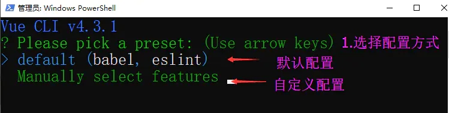
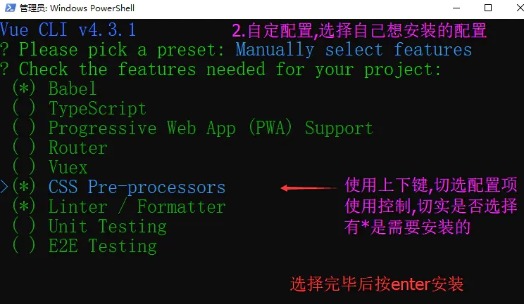
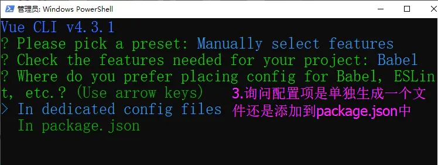
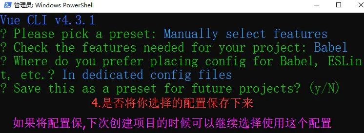
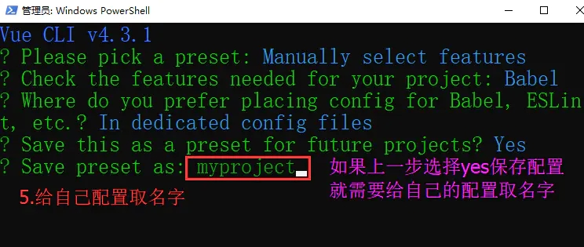
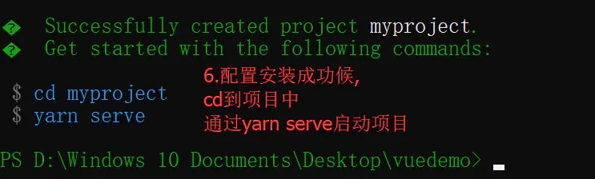
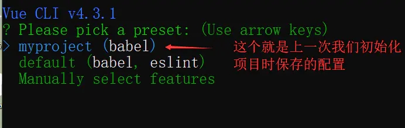
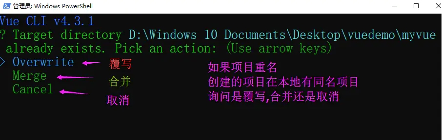
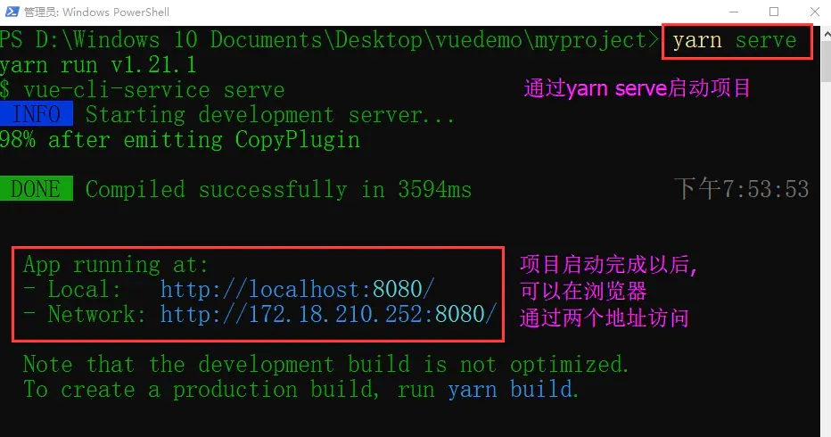
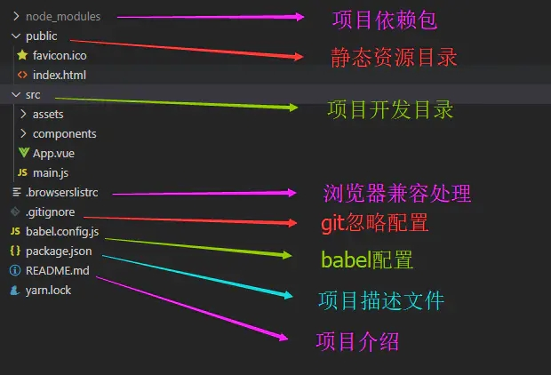

## 学习目标

- 了解Vue CLI的作用
- 掌握Vue CLI的安装
- 了解CLI3与CLI2的区别
- 掌握CLI3的安装
- 掌握CLI3的使用
- 掌握CLI3的各项配置

> 关于旧版本
>
> Vue CLI 的包名称由 `vue-cli` 改成了 `@vue/cli`。 如果你已经全局安装了旧版本的 `vue-cli` (1.x 或 2.x)，你需要先通过 `npm uninstall vue-cli -g` 或 `yarn global remove vue-cli` 卸载它。

> Node 版本要求
>
> Vue CLI 需要 [Node.js](https://links.jianshu.com/go?to=https%3A%2F%2Fnodejs.org%2F) 8.9 或更高版本 (推荐 8.11.0+)。你可以使用 [nvm](https://links.jianshu.com/go?to=https%3A%2F%2Fgithub.com%2Fcreationix%2Fnvm) 或 [nvm-windows](https://links.jianshu.com/go?to=https%3A%2F%2Fgithub.com%2Fcoreybutler%2Fnvm-windows) 在同一台电脑中管理多个 Node 版本。

## 1. Vue CLI的了解

Vue CLI 是一个基于 Vue.js 进行快速开发的完整系统.

### 1.1 Vue CLI 说明

1. CLI 全称就是 Command-Line Interface, 翻译为命令行界面,俗称脚手架
2. Vue CLI就是一个官网发布的vue.js项目的脚手
3. 使用vue-cli可以帮我们快速的搭建Vue开发环境以及对应的webpack配置

用现实生活中的例子:

比如你要盖一栋大楼,大楼外侧的脚手架是必须要搭建的, 每一栋大楼都需要这些脚手架,这些脚手架如果每一次都需要一点一点搭建的话就会非常繁琐和耗时,如果,有人提前帮你把这些必要的脚手架搭建好了,你只需要注重点关注在大楼建设上就可以了

同样的,我们开发vue项目,需要一些诸如webpack这样的配置,如果每次都要自己从头处理就很繁琐,那么官方就帮我们把这些必要的配置好,生成了脚手架模板,  我们直接拿过来使用,这就是脚手架,在脚手架上直接搭建自己的项目,如果发现脚手架有些不能满足我们的需要,也可以自己手动修改脚手架配置

一言以蔽之: 脚手架就是搭建项目的基础模板

### 1.2 什么时候需要用到脚手架

如果你的项目比较简单,就是一些基本的将数据渲染到页面上,那么你不要Vue CLI脚手架

只有当你开发大型项目时,就必须要用到Vue CLI脚手架了

因为大型项目需要考虑代码目录结构,项目结构,部署以及热更新等很多琐碎的事情,那么这些事情都交给脚手架来配置好, 我们直接使用脚手架就可以了

## 2. 安装vue CLI

> 注意在安装Vue CLI是一定要提前安装node.

### 2.1 安装 Vue CLi

可以使用下列任一命令全局安装最新的CLI：

```shell
npm install -g @vue/cli
# or
yarn global add @vue/cli
```

如果需要安装指定版本的的CLI,则需要使用命令：

```
npm install -g @vue/cli@版本号
# or
yarn global add @vue/cli@版本号
```

### 2.2 查看版本号命令

使用下面命令打印版本号.

```shell
vue --version
# or 简写
vue -V
```

如果可以正常打印版本号说明vue CLI 脚手架安装成功

如果不能识别vue命令，则执行npm config list查看全局安装路径，并把路径配置到系统环境变量中

```
npm config list
```

## 3.  Vue CLI3

### 3.1 CLI3 和 CLI2 版本的区别

1. cli3 是基于webpack4开发的,cli2是还是基于webpack3开发的
2. cli3 的设计原则是'0配置',移除了根目录下build和config的webpack 配置文件目录
3. cli3 提供了`vue ui`命令,提供可视化配置,更加人性化
4. 移出了static 文件夹,增加了 public文件夹,并且将index.html移动到public目录中

### 3.2 CLI3的安装命令

通过下面的命令初始化Vue CLI3的工程项目

```shell
vue create myproject
```

### 3.3 CLI3初始化项目中的配置介绍

#### 3.3.1 选择配置方式

可以使用默认的配置,也可以自己配置需要安装的内容

自己配置后还可以保存,下次在初始化项目时就可以使用上一次配置



#### 3.3.2 自定义配置

自定义配置项目,选择自己要安装的配置来初始化项目



#### 3.3.3 配置保存选择

配置选择完毕后,会询问你是将配置单独生成文件,还是追加到package.json 文件中

建议使用单独配置文件,这样会比较方便修改配置



#### 3.3.4 是否保存配置

是否将本次初始化项目的配置保存起来,以便下次初始化项目时直接使用



#### 3.3.5 给保存的配置命名

如果选择保存本次配置,就给配置命名



#### 3.3.6 初始化完成

当项目配置初始化完毕后,提示你进入项目,并且告知启动项目的终端命令



#### 3.3.7 有保存配置的初始化项目

如果之前有保存过配置,那么在你初始化项目的时候,就会让你自己选择,

可以使用默认配置,或者自定义配置,也可以使用上一次保存的自定义配置



#### 3.3.8 项目重名

项目重名就会提示,

有三种选择: 覆盖原来的项目, 与原理的项目合并,或者取消本次初始化项目



#### 3.3.9 启动项目

通过`yarn serve`命令启动项目
 

### 3.4 CLI3工程项目目录



我们会发现CLI3的项目目录中看不到webpack的配置

## 4. CLI3 的配置

默认在CLI3的项目目录中是看不到配置文件的,那么有的时候我们需要修改配置文件怎么办呢,

接下来就看看如何修改配置

### 4.1 在项目中修改配置

在根文件下创建`vue.config.js`文件, 就可以在这个文件中定义需要修改的配置

cli3会自动将`vue.config.js`文件中的配置和默认的配置进行合并

例如:配置示例:

```js
module.exports = {
    baseUrl: "/" , //根路径
    outputDir : "dist"， //构建输出目录 ，在npm run build 打包生成的文件夹的名字
    assetsDir: "assets", //静态资源目录（js,css,img）
    lintOnSave ： false, // 是否开启eslint保存检测，true | false | error  默认使用false 不打开
    devServer: {
        open: false,    // npm run server 运行时是否自动在浏览器中打开
        host: "localhost"，  //主机名字
        port: 8080,    //端口号 默认时8080
        https: false， //是否启用https协议，最好不使用 默认使用http协议
        hotOnly: false, //热更新，就用false
    
        //重点时这里跨域
        proxy: {
            '/api': {
                target: "http://localhost:5000/api/",
                ws: true,
                changOrigin: true,
                pathRewrite: { 
                    "^/api": ""
                }
            }
        }，
        
        //before 在所有的其他中间件之前，提供自定义中间件功能，这可以用来配置自定义处理程序
        before(app) {
            app.get("/api/goods",(req,res) => {
                res.json(goods);
            })
        }
    }
    
}
```

