## 学习目标

- 掌握elementui的安装环境搭建
- 掌握时间选择器使用
- 掌握动画使用
- 掌握导航使用
- 掌握axios使用
- 掌握mock使用
- 掌握页面渲染
- 掌握报个分页

## 安装环境搭建

Element-Ul是饿了么前端团队推出的一款基于Vue.js 2.0 的桌面端UI框架，一套为开发者、设计师和产品经理准备的基于 Vue 2.0 的桌面端组件库，手机端有对应框架是Mint UI 。

中文文档：[http://element-cn.eleme.io/#/zh-CN](https://links.jianshu.com/go?to=http%3A%2F%2Felement-cn.eleme.io%2F%23%2Fzh-CN)
 github地址：[https://github.com/ElemeFE/element](https://links.jianshu.com/go?to=https%3A%2F%2Fgithub.com%2FElemeFE%2Felement)

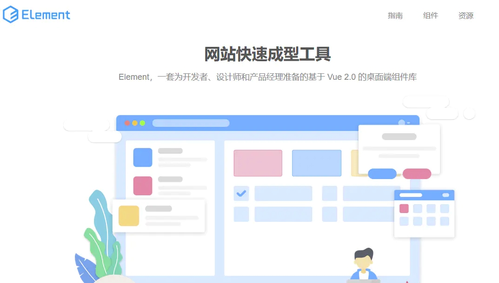

### 1：安装node

端开发框架和环境都是需要 Node.js ，先安装node.js开发环境，vue的运行是要依赖于node的npm的管理工具来实现，下载[https://nodejs.org/en/](https://links.jianshu.com/go?to=https%3A%2F%2Fnodejs.org%2Fen%2F)，安装完成之后，打开cmd开始输入命令。（我用的是win10系统，所以需要管理员权限，右键点击以管理员身份运行cmd），不然会出现很多报错。


### 2：查看node的版本号

下载好node之后，以管理员身份打开cmd管理工具，，输入 node -v ，回车，查看node版本号，出现版本号则说明安装成功。

```undefined
输入命令： node -v
```


### 3：安装淘宝npm镜像

由于npm是国外的，使用起来比较慢，我们这里使用淘宝的cnpm镜像来安装vue.
 淘宝的cnpm命令管理工具可以代替默认的npm管理工具。

```cpp
输入命令：npm install -g cnpm --registry=https://registry.npm.taobao.org
```


### 4：安装全局vue-cli脚手架

淘宝镜像安装成功之后，我们就可以全局vue-cli脚手架，输入命令：cnpm install --global vue-cli 回车；验证是否安装成功，在命令输入vue，出来vue的信息，及说明安装成功；

```csharp
输入命令：cnpm install --global vue-cli
```

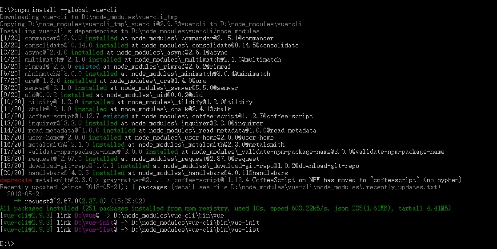

### 5：开始进入主题，初始化一个vue项目

我这里是在d盘里面新建一个项目，先用`d:`的命令，回车键进入d盘；回车键默认创建项目信息。

```kotlin
vue init webpack itemname
```

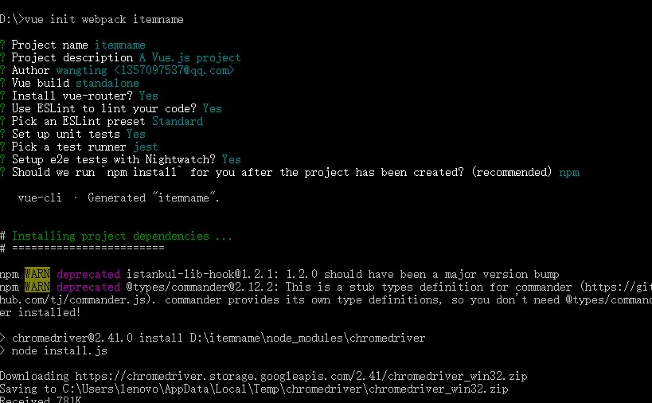

出现这样的提示，初始化成功

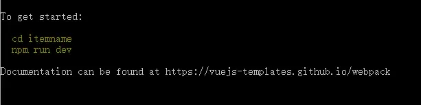

运行初始化demo，输入命令npm run dev；运行一下初始后的demo，弹出访问地址，如果没有问题则进行安装elementUI；准备好好之后，开始引入饿了么elementUI组件。

### 6：安装 elementUI

```undefined
npm i element-ui -S
```

快捷键ctrl+c,终止批处理操 作吗(Y/N)，在输入命令npm i element-ui -S

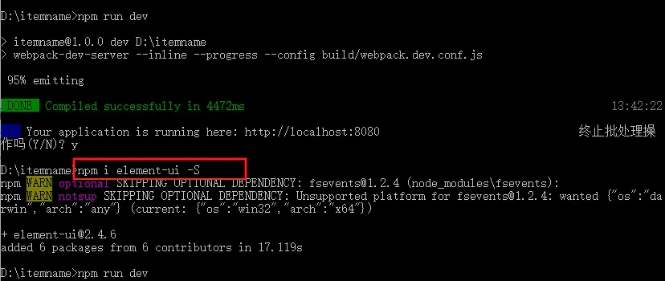

> ###### 注意：安装过程中出现这样的bug的时候，需要解决
>

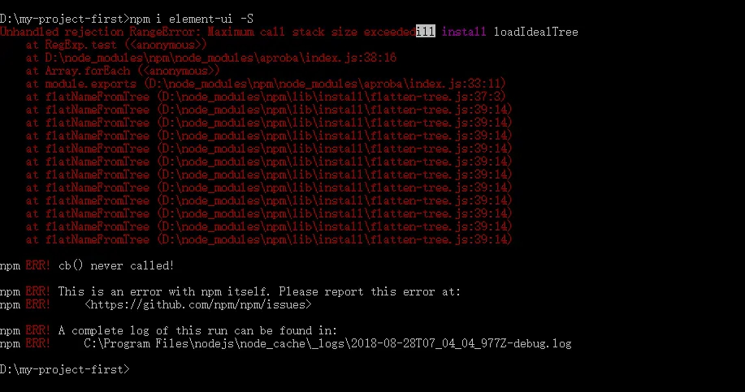

解决办法：尝试 删除项目中的 package-lock.json 文件 和 node_modules 文件夹，然后再尝试 npm install.

成功安装组件显示如下

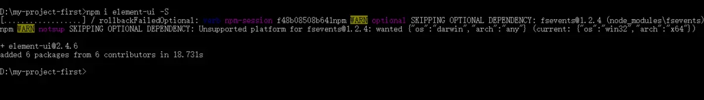

### 7：在components文件夹下面创建test.vue文件，复制一段elementUI官方文档的代码，进行测试

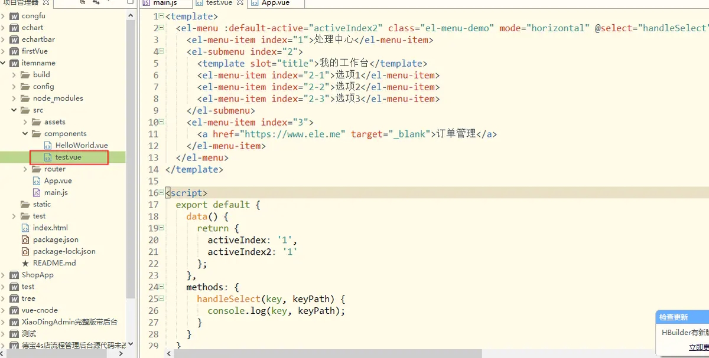

```xml
<template>
    <el-menu :default-active="activeIndex2" class="el-menu-demo" mode="horizontal" @select="handleSelect" background-color="#545c64" text-color="#fff" active-text-color="#ffd04b">
        <el-menu-item index="1">处理中心</el-menu-item>
        <el-submenu index="2">
            <template slot="title">我的工作台</template>
            <el-menu-item index="2-1">选项1</el-menu-item>
            <el-menu-item index="2-2">选项2</el-menu-item>
            <el-menu-item index="2-3">选项3</el-menu-item>
        </el-submenu>
        <el-menu-item index="3">
            <a href="https://www.ele.me" target="_blank">订单管理</a>
        </el-menu-item>
    </el-menu>
</template>

<script>
    export default {
        data() {
            return {
                activeIndex: '1',
                activeIndex2: '1'
            };
        },
        methods: {
            handleSelect(key, keyPath) {
                console.log(key, keyPath);
            }
        }
    }
</script>
```

### 8：在App.vue中引入test.vue


```xml
<template>
  <div id="app">
    
    <router-view/>
    <Test></Test>
  </div>
</template>

<script>
    import Test from './components/test.vue'
    
export default {
    components:{
  Test,
 },
  name: 'App'
}
</script>

<style>
#app {
  font-family: 'Avenir', Helvetica, Arial, sans-serif;
  -webkit-font-smoothing: antialiased;
  -moz-osx-font-smoothing: grayscale;
  text-align: center;
  color: #2c3e50;
  margin-top: 60px;
}
</style>
```

### 9：打开main.js,加入element-ui的js和css

```jsx
import ElementUI from 'element-ui' //element-ui的全部组件
import 'element-ui/lib/theme-chalk/index.css'//element-ui的css
Vue.use(ElementUI) //使用elementUI
```

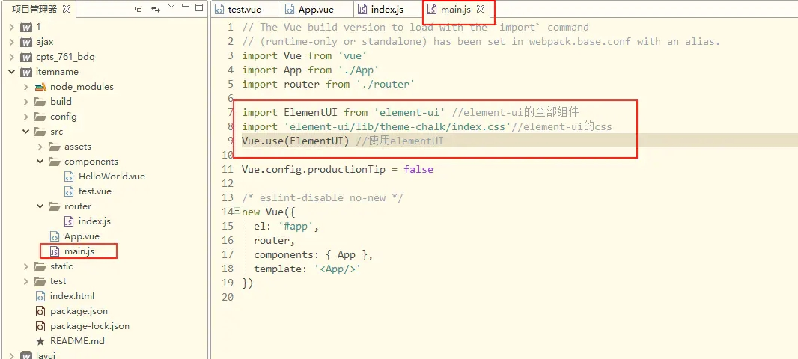

### 10：再次运行，组件中的效果如下：

输入命令：

```undefined
npm run dev
```

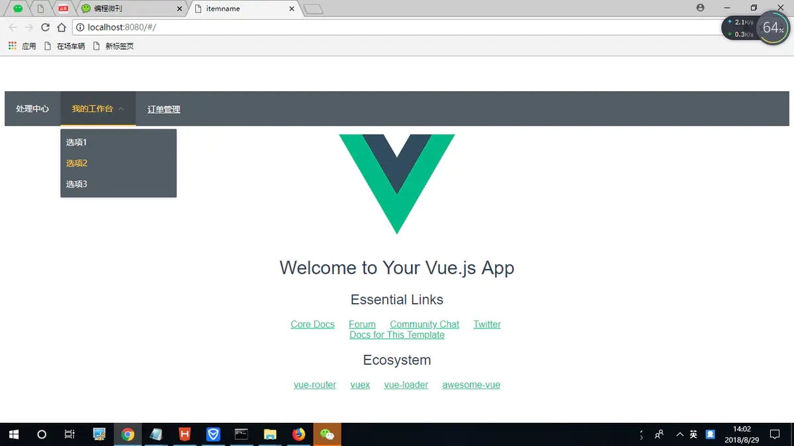

## 时间选择器

打开test.vue文件，开始写代码

```xml
<template>
  <div>
  <el-time-picker
    is-range
    v-model="value"
    range-separator="-"
    start-placeholder="开始时间"
    end-placeholder="结束时间"
    placeholder="选择时间范围">
  </el-time-picker>
  </div>
</template>
<script>
  export default {
    data() {
      return {
        value: [new Date(2016, 9, 10, 8, 40), new Date(2016, 9, 10, 9, 40)],
      
      };
    }
  }
</script>
```

npm  run  dev 运行，浏览器显示如下,实现了一个简单的时间选择器

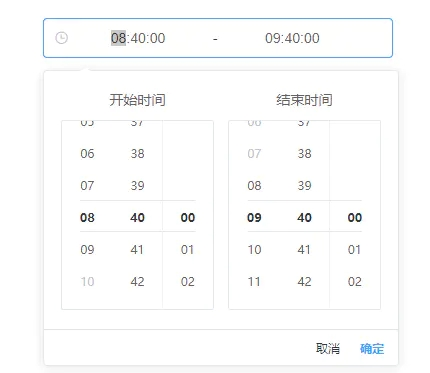

## 出现和隐藏动画

点击按钮的时候，元素会呈现一个出现和隐藏的动画功能。

```xml
<template>
  <div>
    <el-button @click="show = !show">点击按钮</el-button>
    <div style="display: flex; margin-top: 20px; height: 100px;">
      <transition name="el-fade-in-linear">
        <div v-show="show" class="transition-box">我会消失在人海之中</div>
      </transition>
    </div>
  </div>
</template>
<script>
    export default {
    data: () => ({
      show: true
    })
  }
</script>
<style>
  .transition-box {
    margin-bottom: 10px;
    width: 300px;
    height: 100px;
    border-radius: 4px;
    background-color: #42B983;
    text-align: center;
    color: #fff;
    padding: 40px 20px;
    box-sizing: border-box;
    margin-left: 520px;
  }
</style>
```

效果大家可以自行尝试。


## 左侧导航栏

在用Element UI框架的时候

```xml
<template>
  <div>
   <el-row class="tac">
   <el-col :span="4">   
    <el-menu
      default-active="2"
      class="el-menu-vertical-demo"
      @open="handleOpen"
      @close="handleClose"
      background-color="#545c64"
      text-color="#fff"
      active-text-color="#ffd04b">
      <el-submenu index="1">
        <template slot="title">
          <i class="el-icon-s-platform"></i>
          <span>服务大厅</span>
        </template>
        <el-menu-item-group>
          <el-menu-item index="1-1">在场服务</el-menu-item>
          <el-menu-item index="1-2">历史服务</el-menu-item>
        </el-menu-item-group>
      </el-submenu>
       <el-submenu index="2">
        <template slot="title">
          <i class="el-icon-s-tools"></i>
          <span>系统设置</span>
        </template>
        <el-menu-item-group>
          <el-menu-item index="1-1">权限管理</el-menu-item>
          <el-menu-item index="1-2">角色管理</el-menu-item>
        </el-menu-item-group>
      </el-submenu>
      <el-submenu index="3">
        <template slot="title">
          <i class="el-icon-user-solid"></i>
          <span>人员数据</span>
        </template>
        <el-menu-item-group>        
          <el-menu-item index="1-1">人员数量</el-menu-item>
          <el-menu-item index="1-2">人员位置</el-menu-item>
        </el-menu-item-group>
      </el-submenu>      
      <el-submenu index="4">
        <template slot="title">
          <i class="el-icon-message-solid"></i>
          <span>健康报警</span>
        </template>
        <el-menu-item-group>       
          <el-menu-item index="1-1">心率报警</el-menu-item>
          <el-menu-item index="1-2">血压报警</el-menu-item>
        </el-menu-item-group>
      </el-submenu>     
    </el-menu>
  </el-col>
</el-row>
  </div>
</template>
<script>
  export default {
    methods: {
      handleOpen(key, keyPath) {
        console.log(key, keyPath);
      },
      handleClose(key, keyPath) {
        console.log(key, keyPath);
      }
    }
  }
</script>
```

导航菜单效果如下所示

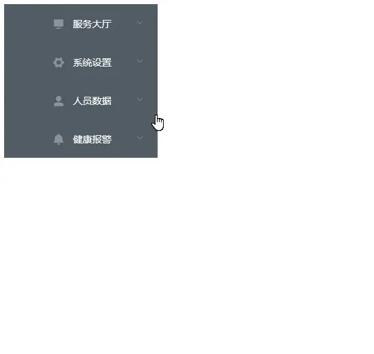

## 导航栏跳转路由

### 1：components 新建页面

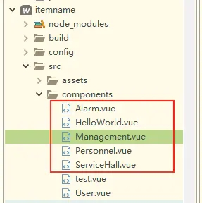

### 2：打开app.vue写代码

```xml
<template>
  <div>
   <el-col :span="2">   
    <el-menu
      :default-active="this.$route.path" 
      router mode="horizontal"
      class="el-menu-vertical-demo"
      @open="handleOpen"
      @close="handleClose"
      background-color="#545c64"
      text-color="#fff"
      active-text-color="#ffd04b">
      <el-menu-item v-for="(item,i) in navList" :key="i" :index="item.name">
        <template slot="title">
          <i class="el-icon-s-platform"></i>
          <span> {{ item.navItem }}</span>
        </template>

      </el-menu-item>
       
        
    </el-menu>
  </el-col>
  
  <router-view     class="menu-right"/>

  </div>
</template>
<script>
  export default {
    data() { 
        return { 
            navList:[ 
            {name:'/components/ServiceHall',navItem:'服务大厅'}, 
            {name:'/components/Management',navItem:'权限管理'},
            {name:'/components/User',navItem:'用户管理'}, 
            {name:'/components/Personnel',navItem:'人员数据'}, 
            {name:'/components/Alarm',navItem:'报警中心'}, 
            ] } 
    },
    methods: {
      handleOpen(key, keyPath) {
        console.log(key, keyPath);
      },
      handleClose(key, keyPath) {
        console.log(key, keyPath);
      }
    }
  }
</script>

<style>
    .menu-right{
        margin-left:200px;
    }
    
</style>
```

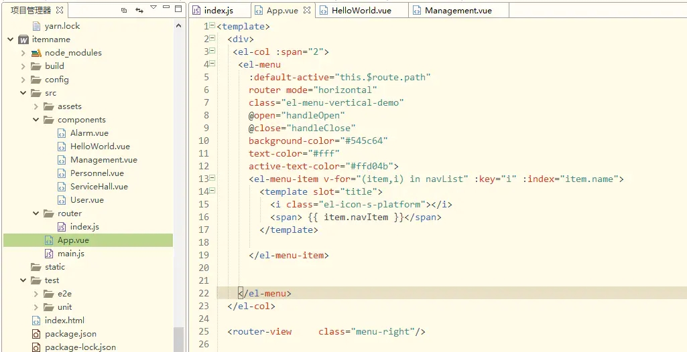

### 3：路由index.js

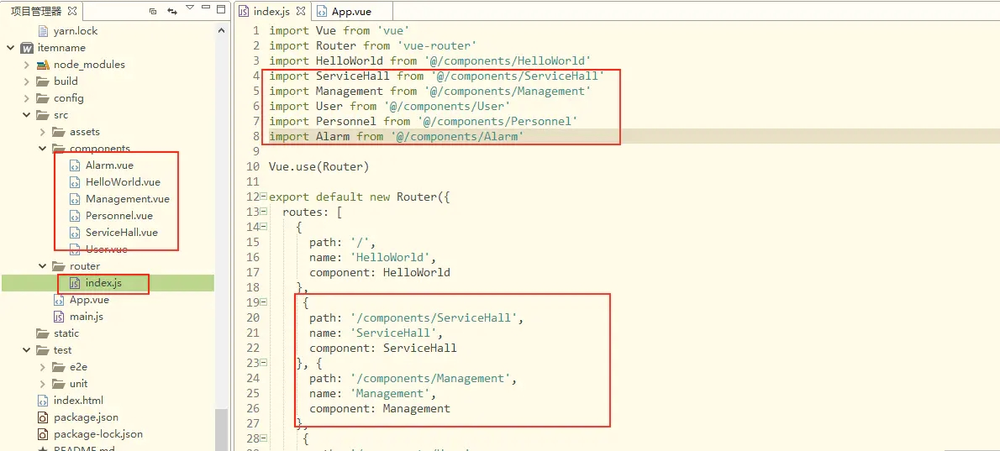

```jsx
import Vue from 'vue'
import Router from 'vue-router'
import HelloWorld from '@/components/HelloWorld'
import ServiceHall from '@/components/ServiceHall'
import Management from '@/components/Management'
import User from '@/components/User'
import Personnel from '@/components/Personnel'
import Alarm from '@/components/Alarm'

Vue.use(Router)

export default new Router({
  routes: [
    {
      path: '/',
      name: 'HelloWorld',
      component: HelloWorld
    },
     {
      path: '/components/ServiceHall',
      name: 'ServiceHall',
      component: ServiceHall
    }, {
      path: '/components/Management',
      name: 'Management',
      component: Management
    },
     {
      path: '/components/User',
      name: 'User',
      component: User
    },{
      path: '/components/Personnel',
      name: 'Personnel',
      component: Personnel
    },{
      path: '/components/Alarm',
      name: 'Alarm',
      component: Alarm
    }
  ]
})
```

### 4：新页面的内容

```xml
<template>  
    <div>
    我是权限管理页面
    </div>  
</template>
<script>
</script>
<style>
</style>
```

### 5：效果就可以看了

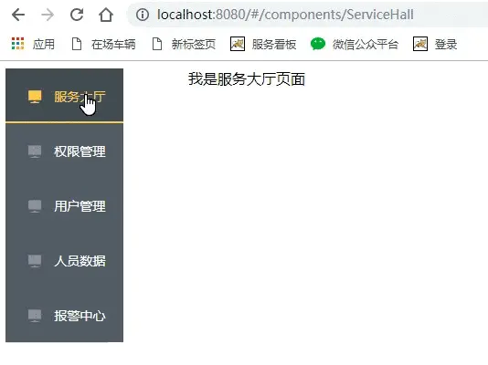

## axios请求数据

### 1：进入项目，npm安装

```undefined
   npm install axios --save
```

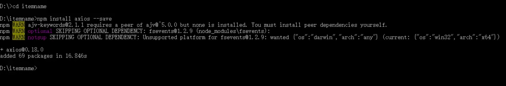

### 2.在main.js下引用axios

```jsx
  import axios from 'axios'
```

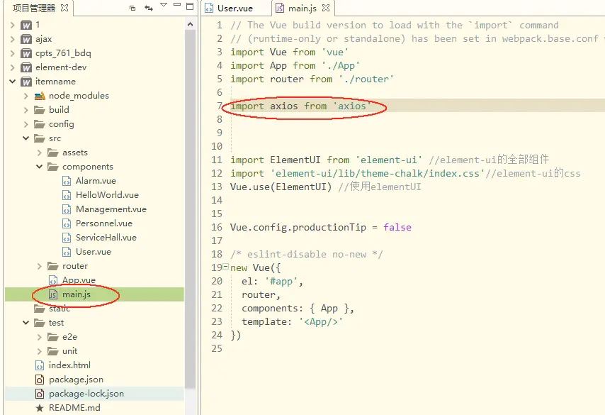

### 3:准备json数据

 自己写了一个json数据，放在服务器上，现在要通过vue项目调用数据
 [http://www.intmote.com/test.json](https://links.jianshu.com/go?to=http%3A%2F%2Fwww.intmote.com%2Ftest.json)

### 4：跨域问题，设置代理，利用proxyTable属性实现跨域请求

 在config/index.js 里面找到proxyTable ：{} ，然后在里面加入以下代码

```csharp
   proxyTable: {
  '/api': {
    target: 'http://www.intmote.com',//设置你调用的接口域名和端口号 别忘了加http
    changeOrigin: true,//允许跨域
    pathRewrite: {
      '^/api': '' //这个是定义要访问的路径，名字随便写 
    }
  }
},
```

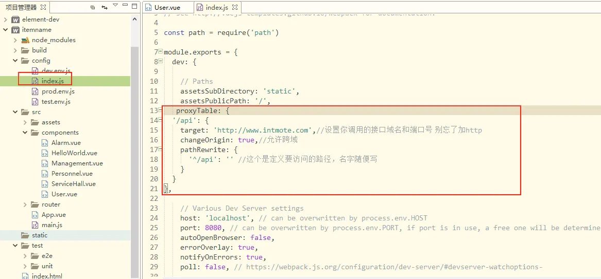

### 5:打开一个界面User.vue，开始写请求数据的方法


```tsx
 methods: {
            getData() {
                axios.get('/api/test.json').then(response => {
                    console.log(response.data);
                }, response => {
                    console.log("error");
                });
            }
        }
```

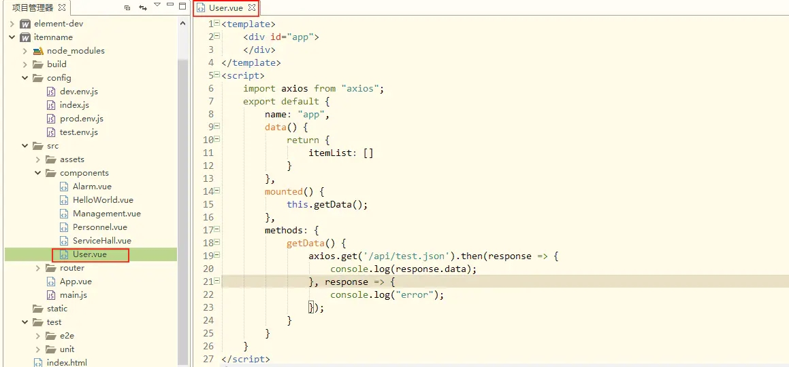

User.vue参考代码：

```xml
<template>
    <div id="app">
    </div>
</template>
<script>
    import axios from "axios";
    export default {
        name: "app",
        data() {
            return {
                itemList: []
            }
        },
        mounted() {
            this.getData();
        },
        methods: {
            getData() {
                axios.get('/api/test.json').then(response => {
                    console.log(response.data);
                }, response => {
                    console.log("error");
                });
            }
        }
    }
</script>
```

### 6：再次运行npm run dev

这个时候，我们可以看见，请求的数据

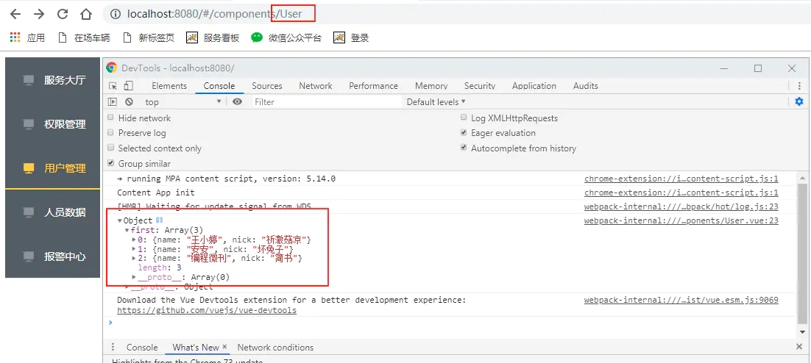

## Mock的使用

### 1：在项目里面新建一个mock文件夹，在mock文件夹里面新建一个test.json文件

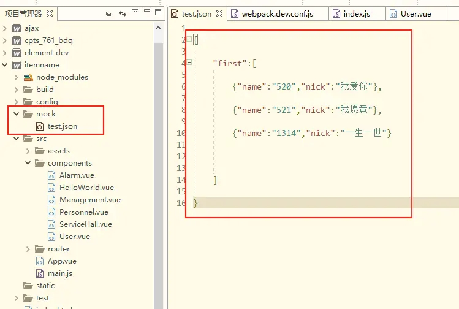

test.json:

```json
{
    "first":[

        {"name":"520","nick":"我爱你"},

        {"name":"521","nick":"我愿意"},

        {"name":"1314","nick":"一生一世"}
    ]

}
```

### 2：在build目录下找到webpack.dev.conf.js文件，编写以下代码

```tsx
// mock code
const express = require('express')
const app = express()
const posts = require('../mock/test.json') 
const routes = express.Router()
app.use('/api', routes)

// 如果是post请求，那么将get改为post即可
devServer: {
 ...
 before(app){
 app.get('/api/test', (req, res) => {
  res.json(posts)
 })

 }
}
```

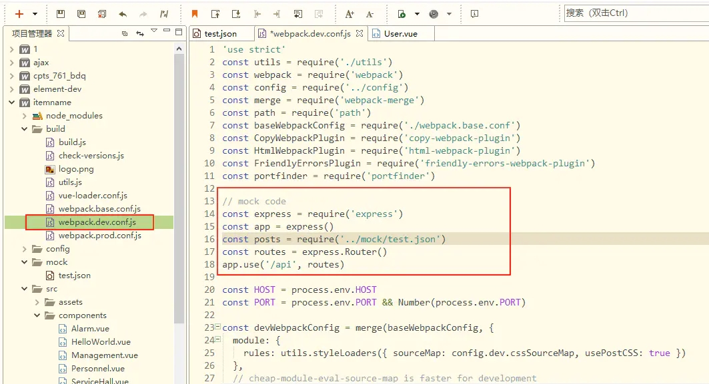

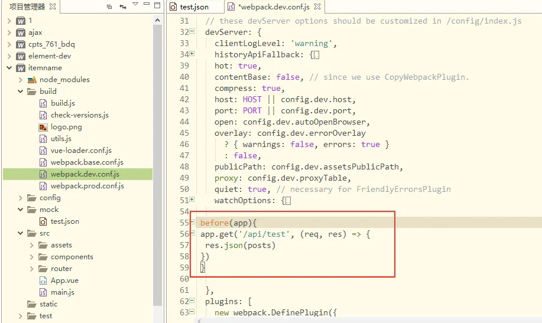

### 3：浏览器输入[http://localhost:8080/api/test](https://links.jianshu.com/go?to=http%3A%2F%2Flocalhost%3A8080%2Fapi%2Ftest)

 成功看到模拟数据

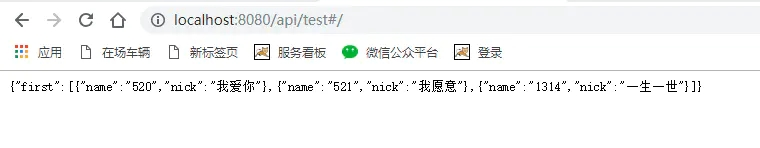

### 4：使用第三方http请求库axios进行ajax请求

```tsx
 methods: {
            getData() {
                axios.get('http://localhost:8080/api/test').then(response => {
                    console.log(response.data);
                }, response => {
                    console.log("error");
                });
            }
        }
```

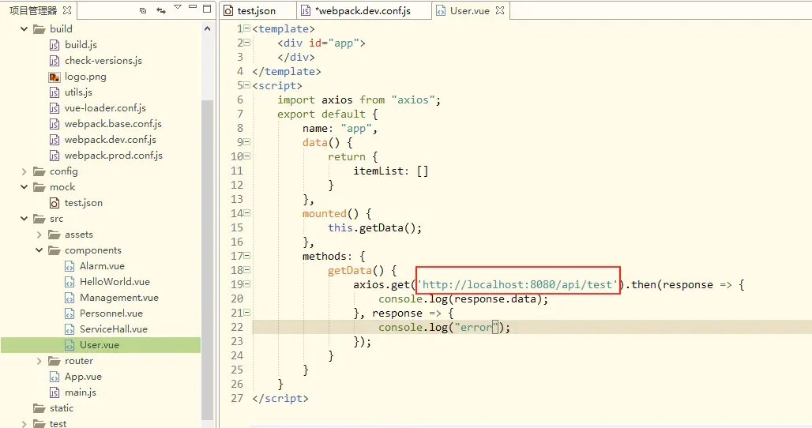

vue页面代码参考

```xml
<template>
    <div id="app">
    </div>
</template>
<script>
    import axios from "axios";
    export default {
        name: "app",
        data() {
            return {
                itemList: []
            }
        },
        mounted() {
            this.getData();
        },
        methods: {
            getData() {
                axios.get('http://localhost:8080/api/test').then(response => {
                    console.log(response.data);
                }, response => {
                    console.log("error");
                });
            }
        }
    }
</script>
```

5:在浏览器里面，我们可以看到，mock里面的数据请求成功显示如下

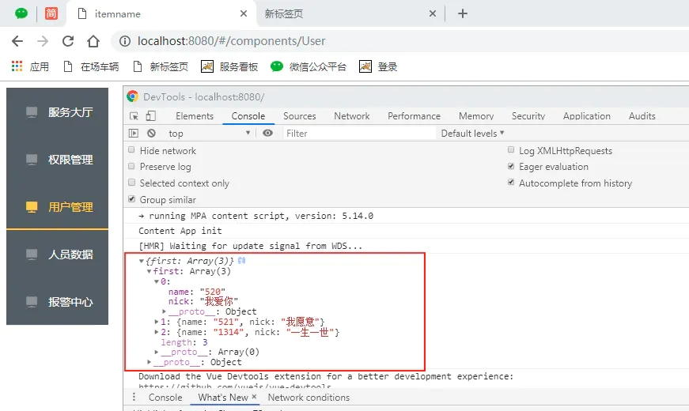

## 页面渲染

其实步骤很简单，代码如下

```xml
<template>
    <div id="app">
  <div v-for="item in itemList">
    <span>{{item.name}}</span>
    <span>{{item.nick}}</span>
  </div>
    </div>
</template>
<script>
    import axios from "axios";
    export default {
        name: "app",
        data() {
            return {
                itemList: []
            }
        },
        mounted() {
            this.getData();
        },
        methods: {
            getData() {
                axios.get('http://localhost:8080/api/test').then(response => {
                    console.log(response.data);
                   this.itemList =response.data.first;
                }, response => {
                    console.log("error");
                });
            }
        }
    }
</script>
```

打开界面，既可以看到，所需要的数据一家展示在前端的界面了


## axios表格分页

接着之前的项目继续写，打开一个vue界面，在里面写如下代码：

```xml
<template>
    <div>
        <el-table :data="tableData.slice((currentPage-1)*pagesize,currentPage*pagesize)" style="width: 100%">
            <el-table-column prop="id" label="日期" width="180">
            </el-table-column>
            <el-table-column prop="name" label="姓名" width="180">
            </el-table-column>
            <el-table-column prop="price" label="地址">
            </el-table-column>
        </el-table>
        <div class="pagination">
            <el-pagination 
                @size-change="handleSizeChange" 
                @current-change="handleCurrentChange" 
                :current-page="currentPage" 
                :page-sizes="[5, 10, 20, 40]" 
                :page-size="pagesize" 
                layout="total, sizes,prev, pager, next" 
                :total="tableData.length" 
                prev-text="上一页" 
                next-text="下一页">
            </el-pagination>
        </div>
    </div>
</template>
<script>
    import axios from "axios";
    export default {
        name: "app",
        data() {
            return {        
                currentPage: 1, //默认显示页面为1
                pagesize: 5, //    每页的数据条数
                tableData: [], //需要data定义一些，tableData定义一个空数组，请求的数据都是存放这里面
            }
        },
        mounted() {
            this.getData();
        },
        methods: {
            getData() {
                axios.get('http://localhost:8080/api/test').then(response => {
                    console.log(response.data);
                    this.tableData = response.data;
                }, response => {
                    console.log("error");
                });
            },
            //每页下拉显示数据
            handleSizeChange: function(size) {
                this.pagesize = size;
                /*console.log(this.pagesize) */
            },
            //点击第几页
            handleCurrentChange: function(currentPage) {
                this.currentPage = currentPage;
                /*console.log(this.currentPage) */
            },

        }
    }
</script>
```

test.json

```json
 [  
        {  
            "id": 0,  
            "name": "Item 0",  
            "price": "徐家汇"  
        },  
        {  
            "id": 1,  
            "name": "Item 1",  
            "price": "$1"  
        },  
        {  
            "id": 2,  
            "name": "Item 2",  
            "price": "$2"  
        },  
        {  
            "id": 3,  
            "name": "Item 3",  
            "price": "徐家汇"  
        },  
        {  
            "id": 4,  
            "name": "Item 4",  
            "price": "徐家汇"  
        },  
        {  
            "id": 5,  
            "name": "Item 5",  
            "price": "$5"  
        },  
        {  
            "id": 6,  
            "name": "Item 6",  
            "price": "$6"  
        },  
        {  
            "id": 7,  
            "name": "Item 7",  
            "price": "$7"  
        },  
        {  
            "id": 8,  
            "name": "Item 8",  
            "price": "徐家汇"  
        },  
        {  
            "id": 9,  
            "name": "Item 9",  
            "price": "$9"  
        },  
        {  
            "id": 10,  
            "name": "Item 10",  
            "price": "$10"  
        },  
        {  
            "id": 11,  
            "name": "Item 11",  
            "price": "$11"  
        },  
        {  
            "id": 12,  
            "name": "Item 12",  
            "price": "徐家汇"  
        },  
        {  
            "id": 13,  
            "name": "Item 13",  
            "price": "$13"  
        },  
        {  
            "id": 14,  
            "name": "Item 14",  
            "price": "$14"  
        },  
        {  
            "id": 15,  
            "name": "Item 15",  
            "price": "$15"  
        },  
        {  
            "id": 16,  
            "name": "Item 16",  
            "price": "徐家汇"  
        },  
        {  
            "id": 17,  
            "name": "Item 17",  
            "price": "$17"  
        },  
        {  
            "id": 18,  
            "name": "Item 18",  
            "price": "$18"  
        },  
        {  
            "id": 19,  
            "name": "Item 19",  
            "price": "徐家汇"  
        },
        
        {  
            "id": 20,  
            "name": "Item 20",  
            "price": "$20"  
        }  
    ]  
```

效果如下


到这里就成功的实现了一个表格和分页了，数据是用mock模拟的，实际中换成后端的接口就可以了。
