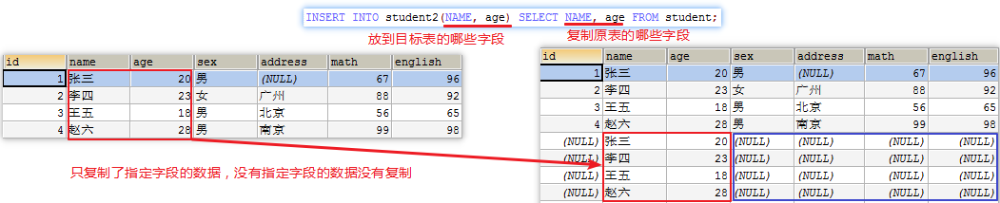
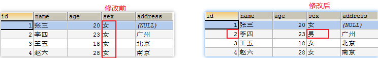
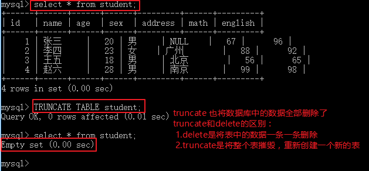
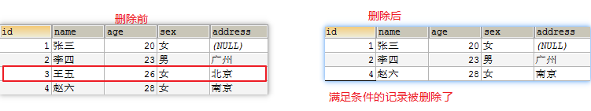

# Java第二阶段_day02_MySQL语句

# 0. 学习目标

- 能够使用SQL语句操作数据库
- 掌握MYSQL支持的数据类型
- 能够使用SQL语句操作表结构
- 能够使用SQL语句进行数据的添加修改和删除的操作
- 能够使用SQL语句简单查询数据
- 能够使用SQL关联查询


## 1. 数据操作语言-DML

### 插入记录

#### 插入全部字段

* 所有的字段名都写出来
  `INSERT INTO 表名 (字段名1, 字段名2, 字段名3…) VALUES (值1, 值2, 值3);`
* 不写字段名
  `INSERT INTO 表名 VALUES (值1, 值2, 值3…);`

#### 插入部分数据

   `INSERT INTO 表名 (字段名1, 字段名2, ...) VALUES (值1, 值2, ...);`
   没有添加数据的字段会使用NULL

1. 关键字说明

   ```sql
   INSERT INTO 表名 – 表示往哪张表中添加数据
   (字段名1, 字段名2, …)  --  要给哪些字段设置值
   VALUES (值1, 值2, …); -- 设置具体的值
   ```

2. 注意

   >* 值与字段必须对应，个数相同，类型相同
   >* 值的数据大小必须在字段的长度范围内
   >* 除了数值类型外，其它的字段类型的值必须使用引号引起。（建议单引号）
   >* 如果要插入空值，可以不写字段，或者插入null

3. 具体操作:

   * 插入部分数据，往学生表中添加 id, name, age, sex数据

   ```sql
   INSERT INTO student (id, NAME, age, sex) VALUES (1, '张三', 20, '男');
   ```

   

   * 向表中插入所有字段

     * 所有的字段名都写出来

     ```sql
      INSERT INTO student (NAME, id, age, sex, address) VALUES ('李四', 2, 23, '女', '广州');
     ```

     

     * 不写字段名

     ```sql
     INSERT INTO student VALUES (3, '王五', 18, '男', '北京');
     ```

     


#### 操作日期时间类型字段

在MySQL中，操作日期时间类型，需要注意以下几个方面


**第一种：YEAR（了解）**

1、数字或字符形式的值insert到表中YEAR字段后都是变成数字形式显示；

2、字符的'0'与'00'会转化为2000，字符‘0000’和数字的0与00则直接是0000；

3、不论字符还是数字形式的1~99都可以转化为对应年份，<70转成20XX，>=70转成19XX。

4、大于0，小于1901或超过2155是无法写入YEAR类型字段的。


**第二种：TIME**

1、尽量还是用字符形式做参数；

2、只有一个数字则表示秒，如果有两个数字和一个“：”则自动补充“00”作为秒；

3、前面一个数字加空格后跟着带“：”串，则前面数字要乘以24加上第一个“：”前的数字作为第一个“：”前的结果，其他不变。


**第三种：DATE**

1、YYYYMMDD与YYMMDD格式不论数字还是字符，都可以写入到DATE类型字段中；

2、YYMMDD格式中表示YY数字00~69转化为2000~2069，而70~99则转化为1970~1999。


**第四与第五种：DATETIME与TIMESTAMP**

1、TIMESTAMP未指定值的情况下会自动填充系统时间；

2、TIMESTAMP超出范围的值不能写入；

3、YYYY-MM-DD HH:MM:SS与YYYYMMDDHHMMSS格式都可以表示DATETIME与TIMESTAMP。


虽然MySQL支持直接在sql里写字符串形式的日期时间，但是这依赖于系统自带的日期数据格式，如果跟提供的日期时间串不匹配则不能正确解析，建议使用日期时间转换函数

```
select str_to_date('08.09.2008 08:09:30', '%m.%d.%Y %h:%i:%s'); -- 2008-08-09 08:09:30
select maketime(12,15,30); -- '12:15:30'
select date_format('2008-08-08 22:23:01', '%Y-%m-%d %H:%i:%s');  -- 20080808222301
```


#### DOS命令窗口操作数据乱码问题的解决

>当我们使用DOS命令行进行SQL语句操作如有有中文会出现乱码，导致SQL执行失败
>
>错误原因:因为MySQL的客户端设置编码是utf8,而系统的DOS命令行编码是gbk，编码不一致导致的乱码
>

查看 MySQL 内部设置的编码
`show variables like 'character%';`


解决方案：修改client、connection、results的编码为GBK，保证和DOS命令行编码保持一致

1. 单独设置

   ```sql
   set character_set_client=gbk; 
   set character_set_connection=gbk;
   set character_set_results=gbk;
   ```

2. 快捷设置

   ```sql
   set names gbk;
   ```

   > 注意：以上2种方式为临时方案，退出DOS命令行就失效了，需要每次都配置

3. 修改MySQL安装目录下的my.ini文件，重启服务所有地方生效。此方案将所有编码都修改了
   

#### 蠕虫复制

什么是蠕虫复制：在已有的数据基础之上，将原来的数据进行复制，插入到对应的表中
语法格式：`INSERT INTO 表名1 SELECT * FROM 表名2;`
作用:将`表名2`中的数据复制到`表名1`中

具体操作:

* 创建student2表，student2结构和student表结构一样

```sql
CREATE TABLE student2 LIKE student;
```

* 将student表中的数据添加到student2表中

```sql
INSERT INTO student2 SELECT * FROM student;
```

>注意：如果只想复制student表中name,age字段数据到student2表中使用如下格式
>`INSERT INTO student2(NAME, age) SELECT NAME, age FROM student;`
>

### 更新表记录

1. 不带条件修改数据
   `UPDATE 表名 SET 字段名=值;`

2. 带条件修改数据
   `UPDATE 表名 SET 字段名=值 WHERE 字段名=值;`

3. 关键字说明

   ```sql
   UPDATE: 修改数据
   SET: 修改哪些字段
   WHERE: 指定条件
   ```

4. 具体操作：

   * 不带条件修改数据，将所有的性别改成女

     ```sql
     UPDATE student SET sex='女';
     ```

     

   * 带条件修改数据，将id号为2的学生性别改成男

     ```sql
     UPDATE student SET sex='男' WHERE id=2;
     ```

     

   * 一次修改多个列，把id为3的学生，年龄改成26岁，address改成北京

     ```sql
     UPDATE student SET age=26, address='北京' WHERE id=3;
     ```

     

### 删除表记录

1. 不带条件删除数据
   `DELETE FROM 表名;`

2. 带条件删除数据
   `DELETE FROM 表名 WHERE 字段名=值;`

3. truncate删除表记录
   `TRUNCATE TABLE 表名;`

   >truncate和delete的区别：
   >
   >* delete是将表中的数据一条一条删除
   >* truncate是将整个表摧毁，重新创建一个新的表,新的表结构和原来表结构一模一样

>  

4. 具体操作：

   * 带条件删除数据，删除id为3的记录

     ```sql
     DELETE FROM student WHERE id=3;
     ```

     

   * 不带条件删除数据,删除表中的所有数据

     ```sql
     DELETE FROM student;
     ```

     

* 

  ```sql
  DROP TABLE IF EXISTS s1;
  ```

  


## 2. SQL约束

**数据完整性**
数据完整性是为了保证插入到数据库中的数据是正确的,防止用户可能的错误输入。
数据完整性分为实**体完整性、域完整性、参照完整性。**

**实体(行)完整性**

(实体完整性中的实体指的是表中的行,因为一行记录对应一个实体)
实体完整性规定表的一行在表中是唯一的实体,不能出现重复。
实体完整性通过表的主键来实现。


**域(列)完整性**

指数据库表的列（即字段）必须符合某种特定的数据类型或约束
非空约束：NOT NULL
唯一约束：UNIQUE


**参照完整性**

参照完整性指的就是多表之间的关系设计，主要使用外键约束。


约束英文：**constraint**

​		约束实际上就是表中数据的限制条件

​		表在设计的时候加入约束的目的就是为了保证表中的记录完整和有效。

​		**约束分类：**
1）not null ：非空约束，保证字段的值不能为空

2）default：默认约束，保证字段总会有值，即使没有插入值，都会有默认值！

3）unique：唯一，保证唯一性但是可以为空，比如座位号

4）primary key ：主建约束，同时保证唯一性和非空

5）foreign key：外键约束，用于限制两个表的关系，保证从表该字段的值来自于主表相关联的字段的值(此节与表之间的关系一起讲)。

6）check：检查性约束，限制字段输入值的范围

### 非空约束

​		用**not null**约束的字段不能为null值，**必须给定具体的数据**

​		创建非空约束的方法：

1、建表时创建

```sql
create table tc_1(
  aaa int not null,
  bbb varchar(20) not null,
  ccc datetime not null
);
```

2、在已创建好的表的字段上去除、添加非空约束

```
alter table tc_1 modify aaa int;
alter table tc_1 modify bbb varchar(20) not null;
```

​		非空约束不可以指定约束名称，在系统约束列表中也找不到对应的记录。

```sql
SELECT * FROM information_schema.TABLE_CONSTRAINTS where table_schema='test';
```

3、删除表时会删除表上全部的非空约束。

### 唯一性约束

​		**unique约束的字段，具有唯一性，不可重复，但可以为null。**

​		创建唯一性约束的方法：

1、建表时创建

```sql
--列约束定义模式
create table tc_2(
  aaa int unique,
  bbb varchar(20) unique,
  ccc datetime unique
);
--表约束定义模式
--表级约束可以给约束起名字(方便以后通过这个名字来删除这个约束)
create table tc_3(
  aaa int,
  bbb varchar(20),
  ccc datetime,
  unique(aaa),
  unique(bbb),
  constraint u_ccc unique(ccc)
);
--组合约束模式
create table tc_4(
  aaa int,
  bbb varchar(20),
  ccc datetime,
  unique(aaa, bbb),
  unique(ccc)
);
```

2、在已创建好的表的字段上去除唯一约束

```sql
-- 找到对应的唯一约束名称
SELECT * FROM information_schema.TABLE_CONSTRAINTS where table_schema='test'
  and table_name='tc_3';
-- 唯一约束同时也是索引，还可以用索引方式找到
show index from tc_3;
-- 用删除索引的方法来删除唯一约束
drop index u_ccc on tc_3;
-- 在删除表时会自动删除表上全部的唯一约束
```

3、在已创建好的表的字段上追加唯一约束  

```sql
--以约束模式添加
ALTER TABLE tc_3 ADD unique(ccc);
--以索引模式添加
create unique index u_ccc on tc_3 (ccc);
```


### 默认值约束

​		“默认值（Default）”的完整称呼是“默认值约束（Default Constraint）”。MySQL默认值约束用来指定某列的默认值。

​		创建默认值约束

```sql
create table tc_5(
  aaa int default 0,
  bbb varchar(20) default 'aaa',
  ccc datetime default '2020-1-1'
);
insert into tc_5 values();
```

​		在已存在的表字段上添加、修改默认值约束

```
alter table tc_5 modify aaa int default 5;
alter table tc_5 modify bbb varchar(20) default 'bbb';
```

​		删除已存在的默认值约束

```sql
alter table tc_5 modify aaa int default null;
alter table tc_5 modify bbb varchar(20) default null;
-- 在删除表时会自动删除表上全部的默认约束
```

​		与非空约束类似，默认值约束也无法指定名称，也无法在 information_schema.TABLE_CONSTRAINTS 表中查到。


### 主键约束

​		表中的某个字段添加**主键约束(primary key)**后，该字段为主键字段，主键字段中出现的每一个数据都称为主键值

​		1、主键约束（PRIMARY KEY）

​		1) 主键用于唯一地标识表中的每一条记录，可以定义一列或多列为主键。 
​		2) 是不可能（或很难）更新． 
​		3) 主键列上没有任何两行具有相同值（即重复值），不允许空（NULL）．
​		4) 主健可作外健，唯一索引不可；

​		2、唯一性约束（UNIQUE）
​		1) 唯一性约束用来限制不受主键约束的列上的数据的唯一性，用于作为访问某行的可选手段，一个表上可以放置多个唯一性约束．
​		2) 只要唯一就可以更新． 
​		3) 即表中任意两行在 指定列上都不允许有相同的值，允许空（NULL）．
​		4) 一个表上可以放置多个唯一性约束

 		3、唯一性约束和主键约束的区别：
  	（1）.唯一性约束允许在该列上存在NULL值，而主键约束的限制更为严格，不但不允许有重复，而且也不允许有空值。
  	（2）.在创建唯一性约束和主键约束时可以创建聚集索引和非聚集索引，但在 默认情况下主键约束产生**聚集索引**，而唯一性约束产生**非聚集索引**。


​		在建表时创建主键约束

```sql
-- 在列数据库类型后加入主键关键字
create table tc_6(
  aaa int primary key,
  bbb varchar(20),
  ccc datetime
);
-- 在所有字段声明完毕后，加入主键声明
create table tc_6(
  aaa int,
  bbb varchar(20),
  ccc datetime,
  primary key(aaa)
);
-- 第2种模式下，可以创建成联合主键（复合主键）
create table tc_6(
  aaa int,
  bbb varchar(20),
  ccc datetime,
  primary key(aaa， bbb)
);
```

​		在已创建的表上建立主键约束

```sql
create table tc_7(
  aaa int,
  bbb varchar(20),
  ccc datetime
);
alter table tc_7 add primary key(aaa);
alter table tc_7 add primary key(aaa, bbb);
```

​		主键约束可以在 information_schema.TABLE_CONSTRAINTS 表中查找到，其约束名称固定为 PRIMARY。

​		删除已存在主键约束

```
alter table tc_7 drop primary key;
-- 在删除表时会自动删除表上的主键约束
```

​		MySQL不支持直接修改主键索引，想要重定义一个表的主键索引，只能先删除原来的索引，再加入新的索引。


### 检查约束

​		检查约束可以限制新增 、修改字段值，使得其符合约束指定的规则

​		在创建表时建立检查约束

```sql
create table tc_9(
  aaa int primary key,
  bbb varchar(20),
  ccc datetime,
  check(aaa > 100 and aaa<1000)
);
create table tc_9(
  aaa int primary key,
  bbb varchar(20),
  ccc datetime,
  constraint c_tc_9 check(aaa > 100 and aaa<1000)
);
```

​		可以指定约束的名称，否则数据库管理系统将自行定义约束名称。

```sql
insert into tc_9 values(123, 'aaa', '1-2-3');
-- 不满足约束的数据，无法插入记录表
insert into tc_9 values(23, 'aaa', '1-2-3');
insert into tc_9 values(1234, 'aaa', '1-2-3');
```

​		检查约束可以作用于数值类型、日期类型、字符串类型

```sql
create table tc_9(
  aaa int primary key,
  bbb varchar(20),
  ccc datetime,
  constraint c_tc_9a check(aaa > 100 and aaa<1000),
  constraint c_tc_9b check(bbb in ('男', '女')),
  constraint c_tc_9c check(ccc > '2000-1-1')
);

insert into tc_9 values(123, '男', '2001-2-3');
-- 不满足约束的数据，无法插入记录表
insert into tc_9 values(223, 'aaa', '2001-2-3');
insert into tc_9 values(223, '女', '1995-2-3');
```

​		在已创建的表上追加检查约束 

```sql
alter table tc_9 add constraint c_tc_9d check(ccc < '2020-1-1');
insert into tc_9 values(223, '女', '2025-2-3');
```

​	   **注意：追加检查约束时，会检查相应字段的值，如果不满足检查约束的限制，检查约束无法创建。**

​		MySQL不支持修改已存在的检查约束，但是可以删除这个约束，再重新添加。

```sql
alter table tc_9 drop check c_tc_9d;
alter table tc_9 add constraint c_tc_9d check(ccc < '2020-1-1');
```


###   自动增长

​        当对应的字段不给值，或者说默认值，或者给null的时候会自动地被系统触发，系统会从当前字段中已有的最大值再进行+1，得到一个新的不同的值，通常和主键搭配。

​		自增长的特点 ：

　　　　a)、任何一个字段做自增长前提 自身是一个索引(key一栏有值)。

　　　　b)、自增长字段通常是整形。

　　　　c)、一个表中只能有1个自增长。

```sql
create table if not exists my_auto_increment(
  id int primary key auto_increment,
  name varchar(10) not null
) charset utf8;
```

**自增长如果对应的字段输入了值，那么自增长失效，但是下一次还是能够正确的自增长(从最大值+1)。**


​		**修改自增长。**

　　		自增长如果是涉及到字段改变，必须先删除自增长，后增加，一张表中只能有1个自增长。

　　　　 修改当前已存在自增长的值，修改只能比当前已有的自增长的最大值大，不能小(小则不生效)。


​		**删除自增增长。**

​		自增长是字段的一个属性，可以通过modify属性来修改(字段没有自增长)。

​		**语法：alter table 表名字 modify 字段名 数据类型**

```
alter table my_auto_increment modify id int;
```


​		**自增长为什么从1开始？又为什么每次都是自增1呢？**

​		所有系统的表现(如字符集、校对集)都是由系统的内部变量进行控制的。

　　**查看自增长对应的变量的语法：show variables like 'auto_increment%';** 

​		可以修改变量实现不同的效果。如果对整个数据修改(而不是但张表)，这种方式是修改时会话级(当前客户端，当此连接有效，关闭失效)。

```sql
--修改成一次自增为5
set auto_increment_increment = 5;
```

#### 


## 3. 关联查询

​		在实际运用数据的场景中，往往我们使用的数据并不是来自一个表，而需要从多个表中抽取数据来形成我们需要的结果集。		

​		SQL 连接子句用于把来自两个或多个表的行结合起来，基于这些表之间的共同字段。连接的结果可以在逻辑上看作是由SELECT语句指定的列组成的新表。


### 等值连接与非等值连接

​		连接条件是使用等式控制限定，就是等值连接。使用 !=、>、<等非=号来控制里连接条件的，就是非等值连接。


### 交叉连接 -- 笛卡尔乘积  cross join

​		当两个表或多个表，没有通过连接字段进行关联，而直接进行连接，这时会形成笛卡尔积，结果集会是所有参与连接的表的条数的乘积。


```sql
select a.teacher_name, b.student_name
from teacher a, student b;
select a.teacher_name, b.student_name, c.bbb
from teacher a, student b, test01 c order by a.teacher_name;
select a.teacher_name, b.student_name from teacher a
	cross join student b;
```

​		笛卡尔积通常是没有意义的，不满足业务需求，实际运用中应避免笛卡尔积的形成。

​				**不要漏写关联字段！！！		不要漏写关联字段！！！	不要漏写关联字段！！！**


### 内连接 inner join

​		内连接使用比较运算符对两个表中的数据进行比较，并列出与连接条件匹配的数据行，组合成新的纪录。结果只保留满足条件的记录。

​		我们来重新创建教师表和学生表，建立一对多的关系。

```sql
drop table teacher;
create table teacher(
	id int primary key auto_increment,
	teacher_name varchar(20),
	teacher_city varchar(20)
);
drop table student;
create table student(
	id int primary key auto_increment,
	student_name varchar(20),
	student_city varchar(20),
	teacher_id int
	-- CONSTRAINT fk_t_s foreign key (teacher_id) references teacher(id) on update cascade on delete cascade
    -- 单行注释用 "-- " 注意这个风格下"--【空格】" 也就是说“--" 与注释之间是有空格的
);
```

```
insert into teacher(teacher_name, teacher_city) values
	('赵大', '武汉'), ('陈二', '鄂州'), ('张三', '襄阳');
insert into student(student_name, student_city, teacher_id ) values
	('李四', '宜昌', 1), ('王五', '恩施', 1), ('钱六', '黄石', 1),
	('周七', '孝感', 2), ('胡八', '武汉', 2);
```

数据准备完成后，我们来看看如何内连接两个表。

```sql
select a.teacher_name, b.student_name
	from teacher a, student b where a.id = b.teacher_id;
-- 或者是
select a.teacher_name, b.student_name
from teacher a
	INNER JOIN student b on a.id = b.teacher_id;
```

​		得到的结果是左边的表，去匹配右边的表，只取得左右两边都能匹配上的数据，匹配不上的数据抛弃。

​		左表中一条记录，对应右表中多条记录的，左表记录重复多次，每次匹配右表中的一条独立的记录。

​		我们再插入一些不构成关联的教师和学生的数据，来看看内关联如何处理。

```
insert into teacher(teacher_name, teacher_city) values
	('王胖', '武汉');
insert into student(student_name, student_city, teacher_id ) values
	('大金牙', '武汉', 20);
```


### 左外连接 left out join

​		是指以左边的表的数据为基准，去匹配右边的表的数据，如果匹配到就显示，匹配不到就显示为null。关键字是left outer join，等效于left join。

```sql
select a.teacher_name, b.student_name
from teacher a
	left outer join student b on a.id = b.teacher_id;
select a.teacher_name, b.student_name
from teacher a
	left join student b on a.id = b.teacher_id;
	
select a.teacher_name, b.student_name
from teacher a
	left join student b on a.id = b.teacher_id
where b.teacher_id is not null;
-- 这句sql等效于内连接
select a.teacher_name, b.student_name
from teacher a
	left join student b on a.id = b.teacher_id
where b.teacher_id is null;
-- 这句sql取出没有学生对应的老师
```

​		得到的结果是左边的表，完整的全表数据，去匹配右边的表，取得右边能匹配上的数据，匹配不上的数据填null。

​		左表中一条记录，对应右表中多条记录的，左表记录重复多次，每次匹配右表中的一条独立的记录。

### 右外连接 right outer join

​		是指以右边的表的数据为基准，去匹配左边的表的数据，如果匹配到就显示，匹配不到就显示为null。关键字是right outer join，等效于right join。

```sql
select a.teacher_name, b.student_name
from teacher a
	right outer join student b on a.id = b.teacher_id;
select a.teacher_name, b.student_name
from teacher a
	right join student b on a.id = b.teacher_id;
	
	
select a.teacher_name, b.student_name
from teacher a
	right join student b on a.id = b.teacher_id
where a.id is not null;
-- 这句sql等效于内连接
select a.teacher_name, b.student_name
from teacher a
	right outer join student b on a.id = b.teacher_id
where a.id is null;
-- 这句sql取出没有老师对应的学生
```

​		得到的结果是右边的表，取完整的全表数据，去匹配左边的表，取得左边能匹配上的数据，匹配不上的数据填null。

​		右表中一条记录，对应左表中多条记录的，右表记录重复多次，每次匹配左表中的一条独立的记录。

### 全外连接 full outer join

​		全外连接是在内连接的基础上将左表和右表的未匹配数据都加上。

```sql
SELECT * 
FROM TESTA 
FULL OUTER JOIN TESTB
ON TESTA.A=TESTB.A
```

​		注意：MySQL不支持全外连接，但是Oracle支持全外连接。

​		其等效于

```sql
select a.teacher_name, b.student_name
from teacher a
	left outer join student b on a.id = b.teacher_id
union  -- 注意这里需要使用去重，而不是union all
select a.teacher_name, b.student_name
from teacher a
	right outer join student b on a.id = b.teacher_id;
```


### 自然连接 natural join

​		通过mysql自己判断完成连接过程,不需要指定连接条件，mysql会根据多个表内的相同字段作为连接条件。

​		自然连接分为两种：**内自然连接(natural join)**和外自然连接，其中外自然连接又分为**左外自然连接(natural left join)**和**右外自然连接(rnatural right join)**。**注意：自然连接没有判断语句。**

​		内自然连接如下：

```sql
select a.teacher_name, b.student_name
from teacher a
	natural join student b;
-- 这实际等效于以下sql
select a.teacher_name, b.student_name
from teacher a
	inner join student b on a.id = b.id;
```

​		所以使用自然连接的前提条件是连接字段必须同名。

​		我们来重新创建教师表和学生表

```sql
drop table teacher;
create table teacher(
	teacher_id int primary key auto_increment,
	teacher_name varchar(20),
	teacher_city varchar(20)
);
drop table student;
create table student(
	student_id int primary key auto_increment,
	student_name varchar(20),
	student_city varchar(20),
	teacher_id int
);
insert into teacher(teacher_name, teacher_city) values
	('赵大', '武汉'), ('陈二', '鄂州'), ('张三', '襄阳');
insert into student(student_name, student_city, teacher_id ) values
	('李四', '宜昌', 1), ('王五', '恩施', 1), ('钱六', '黄石', 1),
	('周七', '孝感', 2), ('胡八一', '武汉', 2);
insert into teacher(teacher_name, teacher_city) values
	('王胖子', '武汉');
insert into student(student_name, student_city, teacher_id ) values
	('大金牙', '武汉', 20);
```


左外自然连接：

```sql
select a.teacher_name, b.student_name
from teacher a
	natural left outer join student b;
-- 其等效于以下sql
select a.teacher_name, b.student_name
from teacher a
	left join student b on a.teacher_id = b.teacher_id;
```


右外自然连接：

```sql
select a.teacher_name, b.student_name
from teacher a
	natural right outer join student b;
-- 其等效于以下sql
select a.teacher_name, b.student_name
from teacher a
	right join student b on a.teacher_id = b.teacher_id;
```

### 自连接

​		**自连接**是连接的一种用法，但并不是连接的一种类型，因为他的本质是把一张表当成两张表来使用。 处理业务是有时在信息查询时需要进行对自身连接（自连接），所以我们需要为表定义别名。

```
select ta.student_name, tb.student_city
from studnet ta， student tb
where ta.student_id = tb.student_id;
```

