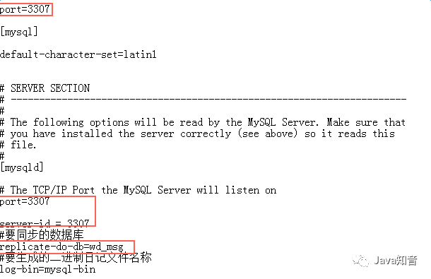

# Java第二阶段_day03_MySQL进阶

## 0. 学习目标

- 掌握数据库子查询的概念
- 掌握数据库子查询的使用方法及场景
- 掌握MySQL常用函数与分页查询方法
- 掌握数据库事务的概念，及事务的特性
- 掌握开启事务的方法
- 掌握数据库事务隔离的等级划分，各种事务隔离等级下的数据表现
- 掌握MySQL的默认事务隔离等级及设置MySQL事务隔离等级的方法
- 了解悲观锁、乐观锁、行级锁、表级锁的概念
- 掌握数据库设计范式
- 掌握ER图基本设计方法
- 掌握基本数据库对象（索引、视图、存储过程、触发器）管理方法
- 了解数据库主从复制方法


## 第1章 子查询

### 子查询是什么

​		子查询就是在查询中嵌套**另外一个查询**的查询。子查询需要使用**括号**括起来。

​		为了满足业务上的特定的要求，我们往往很难，或者不能在一个查询中得到需要的结果。这时通过嵌套另外一个查询，获取中间结果，然后再在这个结果上加工，就可以比较方便地得到想要的结果。

​	    按照子查询出现的位置，我们可以将子查询分成4类，**select型子查询、where型子查询、from型子查询、exists型子查询**。

​		安装子查询返回的结果集，我们可以将子查询分成

​				**标量子查询：返回单一值的标量，最简单的形式。**

​				**列子查询：返回的结果集是 N 行一列。**

​				**行子查询：返回的结果集是一行 N 列。**

​				**表子查询：返回的结果集是 N 行 N 列。**	

​		同时一个需求，往往可以用不同方式的子查询来实现。子查询不仅可以出现在select语句中、还可以出现在insert、update、delete、create table语句中。


### select型子查询

​		select型子查询就是子查询出现在主查询的select字段列表中。

​		例如有一个部门表、和员工表，部门表的部门ID字段与员工表中的部门ID字段存在1对多的关联。

```
drop table if exists dept;
create table dept (
  dept_id int primary key auto_increment,
	dept_name varchar(20)
);

drop table if exists empl;
create table empl (
  empl_id int primary key auto_increment,
	empl_name varchar(20),
	dept_id int
);

insert into dept(dept_name) values('开发部'), ('测试部'), ('实施运维部');
insert into empl(empl_name, dept_id) values('赵大',1), ('钱二',2), ('张三',3), ('李四', 1);
```

​		需求：要查出每个部门的员工数有多少。

```
SELECT d.dept_name, ( 
    SELECT COUNT(*)
    FROM empl e
    WHERE e.dept_id = d.dept_id
 ) empl_num
 FROM dept d;
```

​		当然，我们可以使用关联查询来处理，多数使用子查询的场合都可以使用关联查询来替代，具体使用哪种方式，取决于哪种方式更加清晰直观、运行速度更快。

​		select型子查询只支持标量子查询，子查询的数量没有限制。

```sql
select dept_name, (select 1) as a1, (select 2) as a2 from dept;
select dept_name, (select 1,2) as a1, (select 2) as a2 from dept;
-- 第2句sql是错的，Operand should contain 1 column(s)
```


### where型子查询

​		顾名思义，where型子查询就是子查询出现在主查询的where条件子句中。

​		比如说where条件中，需要某字段值=从子查询中查出来的某一个值（标量子查询）；某字段的值，在子查询查出来的值区段内，**in / not in** 列子查询。 

​		需求：列出开发部的员工列表

```
select empl_id, empl_name from empl
where dept_id = (select dept_id from dept where dept_name like '%开发部%');
```

​		需求，列出开发部与测试部的员工列表

```sql
select empl_id, empl_name from empl
where dept_id in (select dept_id from dept
  where dept_name like '%开发部%' or dept_name like '%测试部%');
```

​		需求，列出不是开发部与测试部的员工列表

```sql
select empl_id, empl_name from empl
where dept_id not in (select dept_id from dept
  where dept_name like '%开发部%' or dept_name like '%测试部%');
```

​	**where 型子查询，如果是 where 列 =（内层 sql） 则内层 sql 返回的必须是单行单列，单个值（标量子查询）。**

​	**where 型子查询，如果是 where 列 in / not in（内层 sql） 则内层 sql 返回的必须是单列，可以多行（列子查询）。**

​	**in / not in 不能使用索引，大数据量下通常会严重影响性能，慎重使用。**


### from型子查询

​		需要理解一个概念：**查询结果集在结构上可以当成表看**，那就可以当成临时表对他进行再次查询：

​		需求：列出开发部和测试部的姓李的员工列表

```
select empl_id, empl_name
from (select empl_id, empl_name from empl, dept
      where empl.dept_id = dept.dept_id
        and dept_name in('开发部','测试部') ) ta
where ta.empl_name like '李%';
```

​		某些时候，单个sql无法完成的结果集，通过from型子查询，可以比较简明清晰地逼近需求结果，最终完成。

​		在上面的例子中，from型子查询，是表子查询。但也可以是标量子查询。

```
select aaa from (select 1 as aaa) ta;
```

​		也可以列子查询和行子查询。

​		**注意：将子查询结果充当一张表，要求必须起别名。**


### exists型子查询

​		exists型子查询，又叫**相关子查询**。

​		例如，查询存在实际员工的部门名称

```sql
SELECT dept_name
FROM dept d
WHERE EXISTS(
    SELECT *
    FROM empl e
    WHERE d.dept_id=e.dept_id
);
```

​		其语法是在where子句中，exists(完整的查询语句）。这时外层父查询先执行，在处理每一条记录时，执行子查询，子查询有结果返回，不是0条时，则此记录进入返回的结果集，否则将被剔除。

​		又如：查询没有女朋友的男神信息

```
SELECT b.*
FROM boys b
WHERE NOT EXISTS(
    SELECT boyfriend_id
    FROM girls g
    WHERE b.b_id=g.boyfriend_id
);
```


​		

### any、some和all关键字

​		我们在where型子查询中，使用了 in 与 not in 关键字。这是一种集合处理。还有集合处理的关键字，也经常用到子查询中，就是 any 和 all 关键字（some是 any的同义词，较少使用）。

| 运算符\关键字 | ANY    | ALL    |
| ------------- | ------ | ------ |
| > 、>=        | 最小值 | 最大值 |
| <、<=         | 最大值 | 最小值 |
| =             | 任意值 |        |
| <>、!=        |        | 任意值 |

​		我们来看个例子

```
-- 创建一个职位表
CREATE TABLE salary_table(
  id SMALLINT UNSIGNED NOT NULL PRIMARY KEY AUTO_INCREMENT,
  position VARCHAR(40) NOT NULL,
  salary INT);
insert salary_table(position,salary) values('JAVA',8000),('Java',8400),('Java',9000),('Python',6500),('Python',10000),('Python',8900);
select *  from salary_table;
```

​		需求：查找出高于 Python  职位任一职位工资的其它职位

```
SELECT * FROM salary_table
  WHERE salary > ANY( SELECT salary FROM salary_table WHERE position = 'Python')
    and position not like '%Python%';
```

​		需求：查找出高于 Python  职位任何职位工资的其它职位

```
SELECT * FROM salary_table
  WHERE salary > all( SELECT salary FROM salary_table WHERE position = 'Python')
    and position not like '%Python%';
```

​	需求：查找出等于Python  职位任何职位工资的其它职位

```
SELECT * FROM salary_table
  WHERE salary = any( SELECT salary FROM salary_table WHERE position = 'Python')
    and position not like '%Python%';
```

**注意：= any 等价于 in，!= all 等价于 not in，= all 是没有 意义的。**


## 第2章 常用函数与分页查询

​		函数存储着一系列sql语句，调用函数就是一次性执行这些语句。所以函数可以降低语句重复。

​		函数与存储过程的区别：函数只会返回一个值，不允许返回一个结果集。存储过程没有返回值，只是可以带返回参数。

### 数学函数

数学函数是MySQL中常用的一类函数。其主要用于处理数字，包括整型和浮点数等等。

| 函数                 | 说明                                                         |
| -------------------- | ------------------------------------------------------------ |
| ABS(X)               | 返回X的绝对值。                                              |
| FLOOR(X)             | 返回不大于X的最大整数。                                      |
| CEIL(X)、CEILING(X)  | 返回不小于X的最小整数。                                      |
| TRUNCATE(X,D)        | 返回数值X保留到小数点后D位的值，截断时不进行四舍五入。       |
| ROUND(X)             | 返回离X最近的整数，截断时要进行四舍五入。                    |
| ROUND(X,D)           | 保留X小数点后D位的值，截断时要进行四舍五入。                 |
| **RAND()**           | 返回0~1的随机数。                                            |
| SIGN(X)              | 返回X的符号(负数，零或正)对应-1，0或1。                      |
| PI()                 | 返回圆周率的值。默认的显示小数位数是6位。                    |
| POW(x,y)、POWER(x,y) | 返回x的y次乘方的值。                                         |
| SQRT(x)              | 返回非负数的x的二次方根。                                    |
| EXP(x)               | 返回e的x乘方后的值。                                         |
| MOD(N,M)             | 返回N除以M以后的余数。                                       |
| LOG(x)               | 返回x的自然对数，x相对于基数2的对数。                        |
| LOG10(x)             | 返回x的基数为10的对数。                                      |
| RADIANS(x)           | 返回x由角度转化为弧度的值。                                  |
| DEGREES(x)           | 返回x由弧度转化为角度的值。                                  |
| SIN(x)、ASIN(x)      | 前者返回x的正弦，其中x为给定的弧度值；后者返回x的反正弦值，x为正弦。 |
| COS(x)、ACOS(x)      | 前者返回x的余弦，其中x为给定的弧度值；后者返回x的反余弦值，x为余弦。 |
| TAN(x)、ATAN(x)      | 前者返回x的正切，其中x为给定的弧度值；后者返回x的反正切值，x为正切。 |
| COT(x)               | 返回给定弧度值x的余切。                                      |

```
-- rand获取到的是一个 0 ~ 1 之间的小数
select rand() from dual;
-- 如果要特定范围的随机整数，可以将此小数乘以特定值后取整
select round(rand()*100) from dual;
```


### 字符串函数

字符串函数是MySQL中最常用的一类函数。字符串函数主要用于处理表中的字符串。

| 函数                                                     | 说明                                                         |
| -------------------------------------------------------- | ------------------------------------------------------------ |
| CHAR_LENGTH(str)                                         | 计算字符串字符个数。                                         |
| LENGTH(str)                                              | 返回值为字符串str的长度，单位为字节。                        |
| **CONCAT(s1,s2，...)**                                   | 返回连接参数产生的字符串，一个或多个待拼接的内容，任意一个为NULL则返回值为NULL。 |
| **SUBSTRING(s,n,len)**、MID(s,n,len)                     | 两个函数作用相同，从字符串s中返回一个第n个字符开始、长度为len的字符串。 |
| CONCAT_WS(x,s1,s2,...)                                   | 返回多个字符串拼接之后的字符串，每个字符串之间有一个x。      |
| INSERT(s1,x,len,s2)                                      | 返回字符串s1，其子字符串起始于位置x，被字符串s2取代len个字符。 |
| INSTR(s1, s2)                                            | 返回字符串s2，在字符串s1中开始的位置，下标从1开始，没有找到返回0。 |
| LOWER(str)、LCASE(str)                                   | 将str中的字母全部转换成小写。                                |
| UPPER(str)、UCASE(str)                                   | 将字符串中的字母全部转换成大写。                             |
| LEFT(s,n)、RIGHT(s,n)                                    | 前者返回字符串s从最左边开始的n个字符，后者返回字符串s从最右边开始的n个字符。 |
| LPAD(s1,len,s2)、RPAD(s1,len,s2)                         | 前者返回s1，其左边由字符串s2填补到len字符长度，假如s1的长度大于len，则返回值被缩短至len字符；前者返回s1，其右边由字符串s2填补到len字符长度，假如s1的长度大于len，则返回值被缩短至len字符。 |
| LTRIM(s)、RTRIM(s)                                       | 前者返回字符串s，其左边所有空格被删除；后者返回字符串s，其右边所有空格被删除。 |
| TRIM(s)                                                  | 返回字符串s删除了两边空格之后的字符串。                      |
| TRIM(s1 FROM s)                                          | 删除字符串s两端所有子字符串s1，未指定s1的情况下则默认删除空格。 |
| REPEAT(s,n)                                              | 返回一个由重复字符串s组成的字符串，字符串s的数目等于n。      |
| SPACE(n)                                                 | 返回一个由n个空格组成的字符串。                              |
| REPLACE(s,s1,s2)                                         | 返回一个字符串，用字符串s2替代字符串s中所有的字符串s1。      |
| STRCMP(s1,s2)                                            | 若s1和s2中所有的字符串都相同，则返回0；根据当前分类次序，第一个参数小于第二个则返回-1，其他情况返回1。 |
| LOCATE(str1,str)、POSITION(str1 IN str)、INSTR(str,str1) | 三个函数作用相同，返回子字符串str1在字符串str中的开始位置（从第几个字符开始）。 |
| REVERSE(s)                                               | 将字符串s反转。                                              |
| ELT(N,str1,str2,str3,str4,...)                           | 返回第N个字符串。                                            |
| FIELD(s,s1,s2,...)                                       | 返回第一个与字符串s匹配的字符串的位置。                      |
| FIND_IN_SET(s1,s2)                                       | 返回在字符串s2中与s1匹配的字符串的位置。                     |
| MAKE_SET(x,s1,s2,...)                                    | 按x的二进制数从s1，s2...，sn中选取字符串                     |

重要的函数示例 

```sql
SELECT CONCAT('aaa', 'bbb', 'ccc');
-- concat是连接字符串，mysql中concat支持3个参数，oracle中只有2个参数的版本
select substring('12345', 2) from dual;
-- substring带两个参数时，表示从第一个参数字符串中截取，从第二个参数位置字符开始（包含第二个参数位置的字符），到字符串尾

select substring('12345', 2,2) from dual;
-- substring带两个参数时，表示从第一个参数字符串中截取，从第二个参数位置字符开始（包含第二个参数位置的字符）
-- 截取第三个参数所指长度的字符
```


### 日期和时间函数

日期和时间函数是MySQL中另一最常用的函数。其主要用于对表中的日期和时间数据的处理。

| 函数                                                         | 说明                                                         |
| ------------------------------------------------------------ | ------------------------------------------------------------ |
| CURDATE()、CURRENT_DATE()                                    | 返回当前日期，格式：yyyy-MM-dd。                             |
| CURTIME()、CURRENT_TIME()                                    | 返回当前时间，格式：HH:mm:ss。                               |
| **NOW()、CURRENT_TIMESTAMP()、**LOCALTIME()、SYSDATE()、LOCALTIMESTAMP() | 返回当前日期和时间，格式：yyyy-MM-dd HH:mm:ss。              |
| DATEDIFF(d1,d2)                                              | 计算日期d1与d2之间相隔的天数。                               |
| ADDDATE(d,n)                                                 | 计算起始日期d加上n天的日期，n为正数向后推，负数向前。        |
| **DATE_FORMAT(d,f)**                                         | 按照表达式 f 的要求显示日期d。                               |
| TIME_FORMAT(t,f)                                             | 按照表达式 f 的要求显示时间t。                               |
| STR_TO_DATE(s,f)                                             | 按照表达式 f 的要求，转换字符串s成日期时间类型。             |
| UNIX_TIMESTAMP()                                             | 返回一个格林尼治标准时间1970-01-01 00:00:00到现在的秒数。    |
| UNIX_TIMESTAMP(date)                                         | 返回一个格林尼治标准时间1970-01-01 00:00:00到指定时间的秒数。 |
| FROM_UNIXTIME(date)                                          | 和UNIX_TIMESTAMP互为反函数，把UNIX时间戳转换为普通格式的时间。 |
| UTC_DATE()                                                   | 返回当前UTC（世界标准时间）日期值，其格式为"YYYY-MM-DD"或"YYYYMMDD"。 |
| UTC_TIME()                                                   | 返回当前UTC时间值，其格式为"YYYY-MM-DD"或"YYYYMMDD"。具体使用哪种取决于函数用在字符串还是数字语境中 |
| MONTH(d)                                                     | 返回日期d中的月份值，范围是1~12。                            |
| MONTHNAME(d)                                                 | 返回日期d中的月份名称，如：January、February等。             |
| DAYNAME(d)                                                   | 返回日期d是星期几，如：Monday、Tuesday等。                   |
| DAYOFWEEK(d)                                                 | 返回日期d是星期几，如：1表示星期日，2表示星期一等。          |
| WEEKDAY(d)                                                   | 返回日期d是星期几，如：0表示星期一，1表示星期二等。          |
| WEEK(d)                                                      | 计算日期d是本年的第几个星期，范围是0~53。                    |
| WEEKOFYEAR(d)                                                | 计算日期d是本年的第几个星期，范围是1~53。                    |
| DAYOFYEAR(d)                                                 | 计算日期d是本年的第几天。                                    |
| DAYOFMONTH(d)                                                | 计算日期d是本月的第几天。                                    |
| YEAR(d)                                                      | 返回日期d中的年份值。                                        |
| QUARTER(d)                                                   | 返回日期d是第几季度，范围是1~4。                             |
| HOUR(t)                                                      | 返回时间t中的小时值。                                        |
| MINUTE(t)                                                    | 返回时间t中的分钟值。                                        |
| SECOND(t)                                                    | 返回时间t中的秒钟值。                                        |
| EXTRACT(type FROM date)                                      | 从日期中提取一部分，type可以是YEAR、YEAR_MONTH、DAY_HOUR、DAY_MICROSECOND、DAY_MINUTE、DAY_SECOND |
| TIME_TO_SEC(t)                                               | 将时间t转换为秒。                                            |
| SEC_TO_TIME(s)                                               | 将以秒为单位的时间s转换为时分秒的格式。                      |
| TO_DAYS(d)                                                   | 计算日期d至0000年1月1日的天数。                              |
| FROM_DAYS(n)                                                 | 计算从0000年1月1日开始n天后的日期。                          |
| ADDDATE(d,INTERVAL expr type)                                | 计算起始日期d加上一个时间段后的日期。                        |
| DATE_ADD(d,INTERVAL expr type)                               | 同ADDDATE(d,INTERVAL expr type)                              |
| SUBDATE(d,n)                                                 | 计算起始日期d减去n天的日期。                                 |
| SUBDATE(d,INTERVAL expr type)                                | 计算起始日期d减去一个时间段后的日期。                        |
| ADDTIME(t,n)                                                 | 计算起始时间t加上n秒的时间。                                 |
| SUBTIME(t,n)                                                 | 计算起始时间t减去n秒的时间。                                 |
| **DATE_FORMAT(d,f)**                                         | 按照表达式 f 的要求显示日期d。                               |
| TIME_FORMAT(t,f)                                             | 按照表达式 f 的要求显示时间t。                               |
| GET_FORMAT(type, s)                                          | 根据字符串s获取type类型数据的显示格式。                      |

参数说明：

type格式：

SECOND 秒 SECONDS

MINUTE 分钟 MINUTES

HOUR 时间 HOURS

DAY 天 DAYS

MONTH 月 MONTHS

YEAR 年 YEARS

MINUTE_SECOND 分钟和秒 "MINUTES:SECONDS"

HOUR_MINUTE 小时和分钟 "HOURS:MINUTES"

DAY_HOUR 天和小时 "DAYS HOURS"

YEAR_MONTH 年和月 "YEARS-MONTHS"

HOUR_SECOND 小时, 分钟， "HOURS:MINUTES:SECONDS"

DAY_MINUTE 天, 小时, 分钟 "DAYS HOURS:MINUTES"

DAY_SECOND 天, 小时, 分钟, 秒 "DAYS HOURS:MINUTES:SECONDS"


重要的函数示例

```sql
SELECT DATE_FORMAT(NOW(),'%Y年%m月%d日 %H时%i分%s秒');  -- 输出结果：2019年01月17日 19时18分08秒
```


### 条件判断函数

条件函数用来在SQL语句中进行条件判断。根据不同的条件，执行不同的SQL语句。MySQL支持的条件判断函数及作用。

| 函数               | 说明                                         |
| ------------------ | -------------------------------------------- |
| **IF(expr,v1,v2)** | 如果表达式expr成立，则执行v1；否则执行v2。   |
| **IFNULL(v1,v2)**  | 如果v1不为空，则显示v1的值；否则显示v2的值。 |
|                    |                                              |
|                    |                                              |


重要函数示例

```
SELECT IF(TRUE,'A','B'); -- 输出结果：A
SELECT IFNULL(NULL,'B'); -- 输出结果：B
SELECT IFNULL('pan_junbiao的博客','B'); -- 输出结果：pan_junbiao的博客
```


### 系统信息函数

系统信息函数用来查询MySQL数据库的系统信息。

| 函数                                  | 说明                             |
| ------------------------------------- | -------------------------------- |
| VERSION()                             | 获取数据库的版本号。             |
| CONNECTION_ID()                       | 获取服务器的连接数。             |
| DATABASE()、SCHEMA()                  | 获取当前数据库名。               |
| USER()、SYSTEM_USER()、SESSION_USER() | 获取当前用户名。                 |
| CURRENT_USER()、CURRENT_USER          | 获取当前用户名。                 |
| CHARSET(str)                          | 获取字符串str的字符集。          |
| COLLATION(str)                        | 获取字符串str的字符排序方法。    |
| LAST_INSERT_ID()                      | 获取最近生成的AUTO_INCREMENT值。 |


### 加密函数

加密函数是MySQL中用来对数据进行加密的函数。因为数据库中有些很敏感的信息不希望被其他人看到，所以就可以通过加密的方式来使这些数据变成看似乱码的数据。

| 函数                       | 说明                                                         |
| -------------------------- | ------------------------------------------------------------ |
| PASSWORD(str)              | 对字符串str进行加密。经此函数加密后的数据是不可逆的。其经常用于对普通数据进行加密。 |
| MD5(str)                   | 对字符串str进行MD5加密。经常用于对普通数据进行加密。         |
| ENCODE(str,pass_str)       | 使用字符串pass_str来加密字符串str。加密后的结果是一个二进制数，必须使用BLOB类型的字段来保存它。 |
| DECODE(crypt_str,pass_str) | 使用字符串pass_str来为crypt_str解密。                        |

 

### 其他函数

MySQL中除了上述内置函数以外，还包含很多函数。例如，数字格式化函数FORMAT(x,n)，IP地址与数字的转换函数INET_ATON(ip)，还有加锁函数GET_LOCT(name,time)、解锁函数RELEASE_LOCK(name)等等。

| 函数                       | 说明                                                         |
| -------------------------- | ------------------------------------------------------------ |
| FORMAT(X,D)                | 将数字X格式化，将X保留到小数点后D位，截断时要进行四舍五入。  |
| CONV(N,from_base,to_base)  | 不同进制数之间的转换，返回值为数值N的字符串表示，由from_base进制转换为to_base进制。 |
| INET_ATON(expr)            | 给出一个作为字符串的网络地址的点地址表示，返回一个代表该地址数值的整数，地址可以使4或8比特。 |
| INET_NTOA(expr)            | 给定一个数字网络地址（4或8比特），返回作为字符串的该地址的点地址表示。 |
| BENCHMARK(count,expr)      | 重复执行count次表达式expr，它可以用于计算MySQL处理表达式的速度，结果值通常是0（0只是表示很快，并不是没有速度）。另一个作用是用它在MySQL客户端内部报告语句执行的时间。 |
| CONVERT(str USING charset) | 使用字符集charset表示字符串str。                             |


### limit关键字与分页查询

在我们使用查询语句的时候，经常要返回前几条或者中间某几行数据，这个时候怎么办呢？不用担心，mysql已经为我们提供了这样一个功能。

​		语法：

```sql
SELECT * FROM table LIMIT [offset,] rows | rows OFFSET offset  
```

​		LIMIT 子句可以被用于强制 SELECT 语句返回指定的记录数。LIMIT 接受一个或两个数字参数。参数必须是一个整数常量。如果给定两个参数，第一个参数指定第一个返回记录行的偏移量，第二个参数指定返回记录行的最大数目。初始记录行的偏移量是 0(而不是 1)： 为了与 PostgreSQL 兼容，MySQL 也支持句法： LIMIT # OFFSET #。

​		我们先看看一个参数的情况。

```
select * from emp limit 3;
select * from emp order by emp_id desc limit 3;
select * from emp order by hiredate limit 3;
```

 		两个参数的情况下，第1个参数为结果集中需返回的起始记录位置（从1开始，到第n条记录后开始算），第2个参数是从开始返回的记录起，需返回的条数。

```
select * from emp limit 3,2;
select * from emp order by emp_id desc limit 3,2;
select * from emp order by hiredate limit 3;
```

​		早起版本，5.5以前，为了检索从某一个偏移量到记录集的结束所有的记录行，可以指定第二个参数为 -1： 

```
SELECT * FROM emp LIMIT 3,-1;
```

​		但是现在8的版本已经不支持这种写法了。


​		limit子句最常用的地方是做分页。

```
select ... from 表名 where ... order by ... limit (页号*每页记录条数), 每页记录条数
```


## 第3章 数据库事务

### 什么是数据库事务

​		**事务(Transaction)**，一般是指要做的或所做的事情。在计算机术语中是指访问并可能更新数据库中各种数据项的一个程序执行单元(unit)。在计算机术语中，事务通常就是指数据库事务。

​		一个数据库事务通常包含对数据库进行读或写的一个操作序列。它的存在包含有以下两个目的：

> 1、为数据库操作提供了一个从失败中恢复到正常状态的方法，同时提供了数据库即使在异常状态下仍能保持一致性的方法。
> 2、当多个应用程序在并发访问数据库时，可以在这些应用程序之间提供一个隔离方法，以防止彼此的操作互相干扰。

​		当一个事务被提交给了DBMS（数据库管理系统），则DBMS需要确保该事务中的所有操作都成功完成且其结果被永久保存在数据库中，如果事务中有的操作没有成功完成，则事务中的所有操作都需要被回滚，回到事务执行前的状态（要么全执行，要么全都不执行）;同时，该事务对数据库或者其他事务的执行无影响，所有的事务都好像在独立的运行。

​		在一个数据库事务的执行过程中，有可能会遇上事务操作失败、数据库系统/操作系统失败，甚至是存储介质失败等情况。这便需要DBMS对一个执行失败的事务执行恢复操作，将其数据库状态恢复到一致状态（数据的一致性得到保证的状态）。为了实现将数据库状态恢复到一致状态的功能，DBMS通常需要维护事务日志以追踪事务中所有影响数据库数据的操作。


### 数据库事务的特性

​		事务具有4个属性：原子性、一致性、隔离性、持久性。这四个属性通常称为**ACID**特性。

> **原子性（Atomicity）**：事务作为一个整体被执行，包含在其中的对数据库的操作要么全部被执行，要么都不执行。
> **一致性（Consistency）**：事务应确保数据库的状态从一个一致状态转变为另一个一致状态。一致状态的含义是数据库中的数据应满足完整性约束。
> **隔离性（Isolation）**：多个事务并发执行时，一个事务的执行不应影响其他事务的执行。
> **持久性（Durability）**：一个事务一旦提交，他对数据库的修改应该永久保存在数据库中。

​		以银行转账举例，说明如何通过数据库事务保证数据的准确性和完整性。熟悉关系型数据库事务的都知道从帐号A到帐号B需要6个操作：


用一个常用的“A账户向B账号汇钱”的例子来说明如何通过数据库事务保证数据的准确性和完整性。熟悉关系型数据库事务的都知道从帐号A到帐号B需要6个操作：

1、从A账号中把余额读出来（500）。
2、对A账号做减法操作（500-100）。
3、把结果写回A账号中（400）。
4、从B账号中把余额读出来（500）。
5、对B账号做加法操作（500+100）。
6、把结果写回B账号中（600）。

在这个过程中可能会出现以下问题:

- 1.转账操作的第一步执行成功,A账户上的钱减少了100元,但是第二步执行失败或者未执行便发生系统崩溃,导致B账户并没有相应增加100元。
- 2.转账操作刚完成就发生系统崩溃,系统重启恢复时丢失了崩溃前的转账记录。
- 3.同时又另一个用户转账给B账户,由于同时对B账户进行操作,导致B账户金额出现异常。

#### 原子性：

保证1-6所有过程要么都执行，要么都不执行。一旦在执行某一步骤的过程中发生问题，就需要执行回滚操作。 假如执行到第五步的时候，B账户突然不可用（比如被注销），那么之前的所有操作都应该回滚到执行事务之前的状态。

#### 一致性

在转账之前，A和B的账户中共有500+500=1000元钱。在转账之后，A和B的账户中共有400+600=1000元。也就是说，数据的状态在执行该事务操作之后从一个状态改变到了另外一个状态。同时一致性还能保证账户余额不会变成负数等。

#### 隔离性

在A向B转账的整个过程中，只要事务还没有提交（commit），查询A账户和B账户的时候，两个账户里面的钱的数量都不会有变化。
如果在A给B转账的同时，有另外一个事务执行了C给B转账的操作，那么当两个事务都结束的时候，B账户里面的钱应该是A转给B的钱加上C转给B的钱再加上自己原有的钱。

#### 持久性

一旦转账成功（事务提交），两个账户的里面的钱就会真的发生变化（会把数据写入数据库做持久化保存）！


​		关于事务的定义有几点需要注意：

- 1.数据库事务可以包含一个或多个数据库操作,但这些操作构成一个逻辑上的整体。
- 2.构成逻辑整体的这些数据库操作,要么全部执行成功,要么全部不执行。
- 3.构成事务的所有操作,要么全都对数据库产生影响,要么全都不产生影响,即不管事务是否执行成功,数据库总能保持一致性状态。
- 4.以上即使在数据库出现故障以及并发事务存在的情况下依然成立。


#### 如何实现数据库事务

在事务的ACID特性中,C即一致性是事务的根本追求,而对数据一致性的破坏主要来自两个方面

- 1.事务的并发执行
- 2.事务故障或系统故障

数据库系统是通过并发控制技术和日志恢复技术来避免这种情况发生的。

并发控制技术保证了**事务的隔离性**,使数据库的一致性状态不会因为并发执行的操作被破坏。
日志恢复技术保证了**事务的原子性**,使一致性状态不会因事务或系统故障被破坏。同时使已提交的对数据库的修改不会因系统崩溃而丢失,保证了事务的持久性。


### MySQL中如何开启、提交 、回滚事务

MYSQL 事务处理主要有两种方法：

1、用 BEGIN/start transaction, ROLLBACK, COMMIT来实现

- begin/start transaction 开始一个事务

- rollback 事务回滚

- commit 事务确认

  ```
  begin;
  update student set sname='王军' where id=;
  rollback;
  commit;
  ```

  

2、直接用 SET 来改变 MySQL 的自动提交模式:

- **SET AUTOCOMMIT=0** 禁止自动提交

- **SET AUTOCOMMIT=1** 开启自动提交

  ```
  show session variables like 'autocommit';  --查看自动提交状态
  set session autocommit = 0;  --关闭自动提交
  set session autocommit = off;  --关闭自动提交
  update student set sname='王军';
  rollback;
  commit;
  ```

  


### 事务的隔离等级

**并发事务处理带来的问题**

- **更新丢失（Lost Update）**
  当两个或多个事务选择同一行，然后基于最初选定的值更新改行时，有于每个事务都不知道其他事务的存在，就会发生更新问题：最后的更新覆盖了由其他事务所做的更新。
- **脏读（Dirty Reads）**
  一个事务正在对一条记录做修改，在这个事务完成并提交前，这条记录的数据就处于不一致的状态；这时，另一个事务也来读取同一条记录，如果不加控制，第二个事务读取了这些“脏”数据，并据此进一步的处理，就会产生未提交的数据依赖关系。这种现象被称为“脏读”。
  事务A读取到事务B已经修改但未提交的数据，还在这个数据基础上做了修改。此时，如果事务B回滚了，事务A的数据无效，不符合一致性要求。
- **不可重读（Non-Repetable Reads）**
  一个事务在读取某些数据后的某个时间，再次读取以前读过的数据，却发现起读出的数据已经发生了改变、或某些记录已经被删除。这种现象叫做“不可重读”。
  事务A读取到了事务B已经提交的修改数据，不符合隔离性。
- **幻读（Phantom Reads）**
  一个事务按照相同的查询条件读取以前检索过的数据，却发现某些事务插入了满足其查询条件的新数据，这种现象称为“幻读”。
  事务A读取了事务B提交的新增数据，不符合隔离性。


**事务的隔离等级**

1. 事务具有隔离性,理论上来说事务之间的执行不应该相互产生影响,其对数据库的影响应该和它们串行执行时一样。
2. 然而完全的隔离性会导致系统并发性能很低,降低对资源的利用率,因而实际上对隔离性的要求会有所放宽,这也会一定程度造成对数据库一致性要求降低
3. SQL标准为事务定义了不同的隔离级别,从低到高依次是

- **读未提交(READ UNCOMMITTED)**

- **读已提交(READ COMMITTED)**

- **可重复读(REPEATABLE READ)**

- **串行化(SERIALIZABLE)**

  事务的隔离级别越低,可能出现的并发异常越多,但是通常而言系统能提供的并发能力越强。

​		不同的隔离级别与可能的并发异常的对应情况如下表所示,有一点需要强调,这种对应关系只是理论上的,对于特定的数据库实现不一定准确，mysql的Innodb存储引擎通过Next-Key Locking技术在可重复读级别就消除了幻读的可能。


实验一下，首先做数据准备

```
select @@transaction_isolation;  --查看当前隔离级别
```

MySQL默认的事务隔离等级，可重复读（repeatable reads）。

```sql
--首先我们创建一个表作为测试表
drop table if exists test_trac;
create table if not exists test_trac (
    t_id varchar(16) primary key,
    t_name varchar(32)
);

--我们开两个会话，一个用客户端(会话A)，一个用命令行(会话B)，会话A开启事务
insert into test_trac values('aaa', 'bbb');  --在会话A上执行
--在会话B上读取，会发现无法读取未提交的数据，会话A执行commit后，会话B可以正常读取。

--将会话B的事务隔离级别设为“读未提交”
sessionB: set session transaction isolation level read uncommitted;
sessionB: start transaction;
sessionB: select * from test_trac;
--显示会话A插入之前的值
sessionA: start transaction;
sessionA: insert into test_trac values('ccc0', 'aaa');
--在sessionA未提交的情况下，会话B可读取：会话A的未提交的insert（脏读）；查询过后被修改（不可重读）；查询过被新增（幻读）。


--将会话B的事务隔离级别设为“读已提交”
sessionB: set session transaction isolation level read committed;
sessionB: start transaction;  --开启事务
sessionB: select * from test_trac where t_name='aaa';
--会话A也开启事务
sessionA: start transaction;
sessionA: insert into test_trac values('ccc1', 'aaa');
--在sessionA未提交的情况下，sessionB读不到这条记录，除非sessionA已提交
sessionA: commit;
sessionB: select * from test_trac where t_name='aaa';
--关键是会话B的自己的事务未办结提交过程中，读取到了会话A提交的数据。

--现在把会话B的隔离基本设为“可重复读”
sessionB: set session transaction isolation level repeatable read;
sessionB: start transaction;  --开启事务
sessionB: select * from test_trac where t_name='bbb';
--可重复读的例子
sessionA: start transaction;  --开启事务
sessionA: insert into test_trac values('ddd0', 'bbb');
sessionA: commit;
--虽然会话A已提交事务，会话B查询，得不到新的值，除非会话B也提交。
sessionB: commit;
sessionB: select * from test_trac where t_name='bbb';
--幻读的例子
sessionA: start transaction; 
sessionB: start transaction;
sessionA: select * from test_trac where t_name='bbb';
sessionB: select * from test_trac where t_name='bbb';
--会话A和B开启事务后，读取的结果集。会话A发现可以插入某个值，插入并提交。会话B也要插入同样的值，结果发现主键冲突，也就是数据库库在查询之后，新增了对应的数据。但是会话B的事务中不知道这个改变。
sessionA: insert into test_trac values('ddd1', 'bbb');
sessionA: commit;
sessionB: insert into test_trac values('ddd1', 'bbb');
sessionB: ERROR 1062 (23000): Duplicate entry 'ddd1' for key 'PRIMARY'
--如果会话A插入一个主键值，未提交。会话B插入同样的主键值，在会话A未提交的情况下被阻塞，指导会话A提交或回滚。

--现在把会话B的隔离基本设为“串行化”
sessionB: set session transaction isolation level serializable;
sessionB: start transaction;  --开启事务
--在此隔离等级下，一旦有某个事务进行了insert、update、delete操作更新类数据，所有其他会话的select操作会被阻塞，除非更新的会话被提交。
--如果两个会话都更新过了，第一个会话select被阻塞，第二个会话进行select直接报错
ERROR 1213 (40001): Deadlock found when trying to get lock; try restarting transaction

```


### 行锁与表锁

​		所有的事务实现，处理并发冲突，都需要依赖锁来实现。

​		一般可以分为两类，一个是**悲观锁**，一个是**乐观锁**，悲观锁一般就是我们通常说的数据库锁机制，乐观锁一般是指用户自己实现的一种锁机制，比如hibernate实现的乐观锁甚至编程语言也有乐观锁的思想的应用。

**悲观锁**：顾名思义，就是很悲观，它对于数据被外界修改持保守态度，认为数据随时会修改，所以整个数据处理中需要将数据加锁。悲观锁一般都是依靠关系数据库提供的锁机制，事实上关系数据库中的行锁，表锁不论是读写锁都是悲观锁。

#### 1.表级锁定（table-level）

表级别的锁定是MySQL各存储引擎中最大颗粒度的锁定机制。该锁定机制最大的特点是实现逻辑非常简单。所以获取锁和释放锁的速度很快。由于**表级锁一次会将整个表锁定**，所以可以很好的避免困扰我们的死锁问题。
当然，锁定颗粒度大所带来**最大的负面影响就是出现锁定资源争用的概率也会最高**，致使并大度大打折扣。
使用表级锁定的主要是MyISAM，MEMORY，CSV等一些非事务性存储引擎。

#### 2.行级锁定（row-level）

行级锁定最大的特点就是**锁定对象的颗粒度很小**，也是目前各大数据库管理软件所实现的锁定颗粒度最小的。由于锁定颗粒度很小，所以发**生锁定资源争用的概率也最小**，**能够给予应用程序尽可能大的并发处理能力**而提高一些需要高并发应用系统的整体性能。
虽然能够在并发处理能力上面有较大的优势，但是行级锁定也因此带来了不少弊端。由于锁定资源的颗粒度很小，所以**每次获取锁和释放锁需要做的事情也更多，带来的消耗自然也就更大了**。此外，行级锁定也最容易发生死锁。
使用行级锁定的主要是InnoDB存储引擎。

**表级锁：开销小，加锁快；较难出现死锁；锁定粒度大，发生锁冲突的概率最高，并发度最低；**
**行级锁：开销大，加锁慢；容易出现死锁；锁定粒度最小，发生锁冲突的概率最低，并发度也最高；**


## 第4章 数据库表设计

### 数据库三大范式

​		设计关系数据库时，遵从不同的规范要求，设计出合理的关系型数据库，这些不同的规范要求被称为不同的范式，各种范式呈递次规范，越高的范式数据库冗余越小。

​		但是有些时候一昧的追求范式减少冗余，反而会降低数据读写的效率，这个时候就要反范式，利用空间来换时间。

​		严格第说，数据库有五范式，但是四、BC范式是对第三范式的补充，所以我们一般说三范式。


#### 第一范式（1NF）

- **第一范式（1NF）要求数据库表的每一列都是不可分割的基本数据项，同一列中不能有多个值。**

  比方说学生信息：

  | 字段名 | 值   | 字段名 | 值   | 字段名 | 值   | 字段名   | 值           |
  | ------ | ---- | ------ | ---- | ------ | ---- | -------- | ------------ |
  | 姓名   | 张三 | 性别   | 男   | 民族   | 汉   | 出生日期 | 1999年x月x日 |

  

  又比方说用户地址栏，一般情况下我们用一个varchar列来表示，其中值如下

  | 字段名   | 值                             |
  | -------- | ------------------------------ |
  | 家庭住址 | 湖北省武汉市武昌区某某街某某号 |

  如果有相应的业务要求，这个字段就可以按第一范式进行拆分，这样在针对地址进行检索时更加精确方便

  | 字段名 | 值     | 字段名 | 值     | 字段名 | 值     | 字段名 | 值       |
  | ------ | ------ | ------ | ------ | ------ | ------ | ------ | -------- |
  | 省份   | 湖北省 | 地市   | 武汉市 | 区名   | 武昌区 | 街道名 | 某某街道 |

  

- **若某一列有多个值，可以将该列单独拆分成一个实体，新实体和原实体间是一对多的关系。**

  比如：学生选课

  张三选了计算机、高数、英语三门课。使用一个字段存放，这就违反了范式。

  

  | 字段名 | 值   | 字段名 | 值                       |
  | ------ | ---- | ------ | ------------------------ |
  | 姓名   | 张三 | 成绩   | 计算机80，英语90，高数70 |

  应该设计学生选课表，并对学生信息表产生1对多的关联

  | 字段名   | 值   | 字段名   | 值   |
  | -------- | ---- | -------- | ---- |
  | 学生编号 | 123  | 学生姓名 | 张三 |

  | 字段名   | 值   | 字段名   | 值     |
  | -------- | ---- | -------- | ------ |
  | 学科编号 | s1   | 学科名称 | 计算机 |
  | 学科编号 | s2   | 学科名称 | 英语   |
  | 学科编号 | s3   | 学科名称 | 高数   |

  | 字段名   | 值   | 字段名   | 值   | 字段名 |      |
  | -------- | ---- | -------- | ---- | ------ | ---- |
  | 学生编号 | 123  | 学科编号 | s1   | 成绩   | 80   |
  | 学生编号 | 123  | 学科编号 | s2   | 成绩   | 90   |
  | 学生编号 | 123  | 学科编号 | s3   | 成绩   | 70   |

- 在任何一个关系数据库中，第一范式（1NF）是对关系模式的基本要求，不满足第一范式（1NF）的数据库就不是关系数据库。

  

  


#### 第二范式（2NF）

- 满足第二范式（2NF）必须先满足第一范式（1NF）。
- 第二范式要求实体中每一行的所有非主属性都必须完全依赖于主键；即：非主属性必须完全依赖于主键。
- 完全依赖：主键可能由多个属性构成，完全依赖要求不允许存在非主属性依赖于主键中的某一部分属性。
- 若存在哪个非主属性依赖于主键中的一部分属性，那么要将发生部分依赖的这一组属性单独新建一个实体，并且在旧实体中用外键与新实体关联，并且新实体与旧实体间是一对多的关系。


​		比方说：

​		比如要设计一个订单信息表，因为订单中可能会有多种商品多次订货信息，所以要将订单编号和商品编号作为数据库表的联合主键。

​		这样就产生一个问题：这个表中是以订单编号和商品编号作为联合主键。这样在该表中商品名称、单位、商品价格等信息不与该表的主键相关，而仅仅是与商品编号相关。所以在这里违反了第二范式的设计原则。而如果把这个订单信息表进行拆分，把商品信息分离到另一个表中，订单表的商品编号与商品表的商品编号产生多对1的关联，即可满足第二范式。


#### 第三范式（3NF）

- 满足第三范式必须先满足第二范式。

- 第三范式要求：实体中的属性不能是其他实体中的非主属性。因为这样会出现冗余。即：属性不依赖于其他非主属性。

- 如果一个实体中出现其他实体的非主属性，可以将这两个实体用外键关联，而不是将另一张表的非主属性直接写在当前表中。

  

  第三范式需要确保数据表中的每一列数据都和主键直接相关，而不能间接相关。

比如在设计一个订单数据表的时候，可以将客户编号作为一个外键和订单表建立相应的关系。而不可以在订单表中添加关于客户其它信息（比如姓名、所属公司等）的字段。


### ER图与实体

ER图是我们建立概念数据模型的工具
​		数据模型是现实世界中数据特征的抽象。数据模型应该满足三个方面的要求：
​				1）能够比较真实地模拟现实世界
​				2）容易为人所理解
​				3）便于计算机实现

​		概念数据模型也称信息模型，它以实体－联系(**Entity-RelationShip**,简称E-R)理论为基础，并对这一理论进行了扩充。它从用户的观点出发对信息进行建模，主要用于数据库的概念级设计。	


#### ER图图例

​		ER图分为实体、属性、关系三个核心部分。实体是长方形体现，而属性则是椭圆形，关系为菱形。

​		ER图的**实体（entity）**即数据模型中的数据对象，例如人、学生、音乐都可以作为一个数据对象，用长方体来表示，每个实体都有自己的实体成员（entity member）或者说实体对象（entity instance），例如学生实体里包括张三、李四等，实体成员（entity member）/实体实例（entity instance） 不需要出现在ER图中。

​		ER图的**属性（attribute）**即数据对象所具有的属性，例如学生具有姓名、学号、年级等属性，属性分为唯一属性（ unique attribute）和非唯一属性，唯一属性指的是唯一可用来标识该实体实例或者成员的属性，用下划线表示，一般来讲实体都至少有一个唯一属性。

​		ER图的**关系（relationship）**用来表现数据对象与数据对象之间的联系，例如学生的实体和成绩表的实体之间有一定的联系，每个学生都有自己的成绩表，这就是一种关系。


​		ER图中关联关系有三种：

​		**1对1（1:1）** ：1对1关系是指对于实体集A与实体集B，A中的每一个实体至多与B中一个实体有关系；反之，在实体集B中的每个实体至多与实体集A中一个实体有关系。

​		**1对多（1:N）** ：1对多关系是指实体集A与实体集B中至少有N(N>0)个实体有关系；并且实体集B中每一个实体至多与实体集A中一个实体有关系。

​		**多对多（M:N）** ：多对多关系是指实体集A中的每一个实体与实体集B中至少有M(M>0)个实体有关系，并且实体集B中的每一个实体与实体集A中的至少N（N>0）个实体有关系。


ER的实		实体还会细分为**弱实体**和**强实体**：

​		弱实体：一个实体必须依赖于另一个实体存在，那么前者是弱实体，后者是强实体，弱实体必须依赖强实体存在，例如上图的学生实体和成绩单实体，成绩单依赖于学生实体而存在，因此学生是强实体，而成绩单是弱实体。


​		弱实体和强实体的联系必然只有1：N或者1：1，这是由于弱实体完全依赖于强实体，强实体不存在，那么弱实体就不存在，所以弱实体是完全参与联系的，因此弱实体与联系之间的联系也是用的双线菱形。


​		**复合实体：**复合实体也称联合实体或桥接实体，常常用于实现两个或多个实体间的M：N联系，它由每个关联实体的主玛组成，用长方体内加一个菱形来表示。

​		下图就是一个典型的复合实体，因为只是举例，相对粗糙，用户和商品两个实体是M：N的关系，中间又订单这个实体联系，因此订单这个实体是一个复合实体，同时如果用户 实体不存在，就没有订单实体的存在，因此对于用户实体来讲订单是弱实体，同理商品实体如果不存在，同样不存在订单实体，因此对商品实体而言订单是弱实体，具体如图：


#### ER物理模型与数据建模		

​		上面说的原生ER图，主要用于模型分析，实际上我们更常用的ER图的物理模型。

​		这里是一个在线免费ER图绘制网站，https://www.freedgo.com/erd-index.html，我们用这个工具来讲解一下ER图的分析绘制、及导出成SQL的过程。

​		进入页面，可以点击“格式”按钮，展现图例菜单。


​		我们可以选择实体关系/MySQL下的图标来完成学生班级课程模型模型。


##### 建立学生表模型

​		表名：student

| 字段名 | 数据类型      | 字段描述       |
| ------ | ------------- | -------------- |
| s_id   | int           | 主键，自动增长 |
| s_name | varchar（20） | 学生姓名       |
| s_code | varchar(20)   | 学号           |

点击对应的表图标，将之拖入到主体图纸上。


双击表头“MySQL Table”，可以编辑表名。


在字段上点击右键，选“列修改”，可以设置列属性。


改成以下样子


点击"应用"。

编辑完成后


在其上点击右键，选择“选中sql”，可以看到弹出窗口自动生成建表语句

```
CREATE TABLE IF NOT EXISTS student (	s_id INT UNSIGNED NOT NULL AUTO_INCREMENT PRIMARY KEY,
	s_name VARCHAR(20) NOT NULL default  ‘’,
	s_code VARCHAR(20) NOT NULL default  ‘’
);
```

##### 建立学生辅助信息表模型

表名：studentAdd

| 字段名    | 数据类型    | 字段描述       |
| --------- | ----------- | -------------- |
| a_id      | int         | 主键，自动增长 |
| s_id      | int         | 学生id         |
| s_address | varchar(60) | 学生住址       |

仿照上面流程，完成此表的模型。


然后点击“1对1关系”图标。


将两个端点分别拖动到student.s_id和studentAdd.s_id上去。


点击 数据库 -> MySQL -> 全部SQL 就可以看到完整的sql建表语句。

```
CREATE TABLE IF NOT EXISTS student (	s_id INT UNSIGNED NOT NULL AUTO_INCREMENT PRIMARY KEY,
	s_name VARCHAR(20) NOT NULL default  ‘’,
	s_code VARCHAR(20) NOT NULL default  ‘’
);
CREATE TABLE IF NOT EXISTS studentAdd (	a_id INT UNSIGNED NOT NULL AUTO_INCREMENT PRIMARY KEY,
	s_id INT(10) UNSIGNED NOT NULL default  0,
	s_address VARCHAR(60) NOT NULL default  ‘’
);
alter table studentAdd add constraint studentAdd_s_id_fk0  foreign key (s_id) references student (s_id);

```

在这里针对1对1关系，建立了外键关联。

##### 建立班级信息表模型

表名：class

| 字段名 | 数据类型    | 字段描述       |
| ------ | ----------- | -------------- |
| c_id   | int         | 主键，自动增长 |
| c_name | varchar(60) | 班级名称       |
|        |             |                |


表名：classStudent

| 字段名 | 数据类型 | 字段描述       |
| ------ | -------- | -------------- |
| cs_id  | int      | 主键，自动增长 |
| c_id   | int      | 班级ID         |
| s_id   | int      | 学生ID         |

仿照上面流程，完成此表的模型。

并建立class.c_id 与 classStudent.c_id 的1对多关联，及student.s_id 与 classStudent.s_id的关联


再看完整的建表sql

```
CREATE TABLE IF NOT EXISTS student (	s_id INT UNSIGNED NOT NULL AUTO_INCREMENT PRIMARY KEY,
	s_name VARCHAR(20) NOT NULL default  ‘’,
	s_code VARCHAR(20) NOT NULL default  ‘’
);
CREATE TABLE IF NOT EXISTS studentAdd (	a_id INT UNSIGNED NOT NULL AUTO_INCREMENT PRIMARY KEY,
	s_id INT(10) UNSIGNED NOT NULL default  0,
	s_address VARCHAR(60) NOT NULL default  ‘’
);
alter table studentAdd add constraint studentAdd_s_id_fk0  foreign key (s_id) references student (s_id);
CREATE TABLE IF NOT EXISTS class (	c_id INT UNSIGNED NOT NULL AUTO_INCREMENT PRIMARY KEY,
	c_name VARCHAR(20) NOT NULL default  ''
);
CREATE TABLE IF NOT EXISTS classStudent (	cs_id INT UNSIGNED NOT NULL AUTO_INCREMENT PRIMARY KEY,
	c_id INT(10) NOT NULL,
	s_id INT(10) NOT NULL
);
alter table classStudent add constraint classStudent_c_id_fk0  foreign key (c_id) references class (c_id);
alter table classStudent add constraint classStudent_s_id_fk0  foreign key (s_id) references student (s_id);

```

##### 建立课程班级信息表模型

表名：course

| 字段名  | 数据类型    | 字段描述       |
| ------- | ----------- | -------------- |
| co_id   | int         | 主键，自动增长 |
| co_name | varchar(60) | 课程名称       |
|         |             |                |

表名：courseClass

| 字段名 | 数据类型 | 字段描述       |
| ------ | -------- | -------------- |
| cc_id  | int      | 主键，自动增长 |
| co_id  | int      | 课程ID         |
| c_id   | int      | 班级ID         |

仿照上面流程，完成此表的模型。

并建立course.co_id 与 courseClass.co_id 的1对多关联，及class.c_id 与 courseClass.c_id的关联。


##### 导出完整建表sql

```
CREATE TABLE IF NOT EXISTS student (	s_id INT UNSIGNED NOT NULL AUTO_INCREMENT PRIMARY KEY,
	s_name VARCHAR(20) NOT NULL default  ‘’,
	s_code VARCHAR(20) NOT NULL default  ‘’
);
CREATE TABLE IF NOT EXISTS studentAdd (	a_id INT UNSIGNED NOT NULL AUTO_INCREMENT PRIMARY KEY,
	s_id INT(10) UNSIGNED NOT NULL default  0,
	s_address VARCHAR(60) NOT NULL default  ‘’
);
alter table studentAdd add constraint studcentAdd_s_id_fk0  foreign key (s_id) references student (s_id);
CREATE TABLE IF NOT EXISTS class (	c_id INT UNSIGNED NOT NULL AUTO_INCREMENT PRIMARY KEY,
	c_name VARCHAR(20) NOT NULL default  ''
);
CREATE TABLE IF NOT EXISTS classStudent (	cs_id INT UNSIGNED NOT NULL AUTO_INCREMENT PRIMARY KEY,
	c_id INT(10) UNSIGNED NOT NULL,
	s_id INT(10) UNSIGNED NOT NULL
);
alter table classStudent add constraint classStudent_c_id_fk0  foreign key (c_id) references class (c_id);
alter table classStudent add constraint classStudent_s_id_fk0  foreign key (s_id) references student (s_id);
CREATE TABLE IF NOT EXISTS course (	co_id INT UNSIGNED NOT NULL AUTO_INCREMENT PRIMARY KEY,
	co_name VARCHAR(20) NOT NULL default  ''
);
CREATE TABLE IF NOT EXISTS courseClass (	cc_id INT UNSIGNED NOT NULL AUTO_INCREMENT PRIMARY KEY,
	co_id INT(20) UNSIGNED NOT NULL default  '',
	c_id INT(20) UNSIGNED NOT NULL default  ''
);
alter table courseClass add constraint courseClass_co_id_fk0  foreign key (co_id) references course (co_id);
alter table courseClass add constraint courseClass_c_id_fk0  foreign key (c_id) references class (c_id);

```


### 外键约束与级联操作

外键约束（FOREIGN KEY）用来在两个表的数据之间建立链接，它可以是一列或者多列。一个表可以有一个或多个外键。

​		**外键是表的一个字段，不是本表的主键，但对应另一个表的主键。**定义外键后，不允许删除另一个表中具有关联关系的行。

​		外键对应的是**参照完整性**，一个表的外键可以为空值，若不为空值，则每一个外键的值必须等于另一个表中主键的某个值。

​		外键的主要作用是保持数据的一致性、完整性。例如，部门表 tb_dept 的主键是 id，在员工表 tb_emp5 中有一个键 deptId 与这个 id 关联。

- **主表（父表）**：对于两个具有关联关系的表而言，相关联字段中主键所在的表就是主表。
- **从表（子表）**：对于两个具有关联关系的表而言，相关联字段中外键所在的表就是从表。
- 

#### 选取设置 MySQL 外键约束的字段

​		定义一个外键时，需要遵守下列规则：

- 主表必须已经存在于数据库中，或者是当前正在创建的表。如果是后一种情况，则主表与从表是同一个表，这样的表称为自参照表，这种结构称为自参照完整性。
- MySQL支持外键的存储引擎只有InnoDB，在创建外键的时候，要求主表必须有对应的索引，从表在创建外键的时候也会自动创建对应的索引。
- **必须为主表定义主键**。
- 主键不能包含空值，但允许在外键中出现空值。也就是说，**只要外键的每个非空值出现在指定的主键中，这个外键的内容就是正确的。**
- 在主表的表名后面指定列名或列名的组合。**这个列或列的组合必须是主表的主键或候选键（唯一键、复合主键）。**
- 外键中列的数目必须和主表的主键中列的数目相同。
- 外键中列的数据类型必须和主表主键中对应列的数据类型相同。


#### 在创建表时设置外键约束

在数据表中创建外键使用 **FOREIGN KEY** 关键字，具体的语法规则如下：

```sql
[CONSTRAINT <外键名>] FOREIGN KEY 字段名 [，字段名2，…]
REFERENCES <主表名> 主键列1 [，主键列2，…]
```

其中：外键名为定义的外键约束的名称，一个表中不能有相同名称的外键；字段名表示子表需要添加外健约束的字段列；主表名即被子表外键所依赖的表的名称；主键列表示主表中定义的主键列或者列组合。

```
drop table 成绩;
drop table 学生;
drop table 科目;
CREATE TABLE IF NOT EXISTS 学生 (	id int PRIMARY KEY,
	name varchar(10),
);
CREATE TABLE IF NOT EXISTS 科目 (	id int PRIMARY KEY,
	name varchar(10)
);
CREATE TABLE IF NOT EXISTS 成绩 (	id int PRIMARY KEY,
	学生ID INT(10),
	科目ID INT(10),
	成绩 DECIMAL(10,2),
	CONSTRAINT fk_c_s FOREIGN KEY(学生ID) REFERENCES 学生(id),
	CONSTRAINT fk_c_k FOREIGN KEY(科目ID) REFERENCES 科目(id)
);

show indexes from 成绩;
```

提示：关联指的是关系数据库中，相关表之间的联系。它是通过相同的属性或属性组来表示的。子表的外键必须关联父表的主键，且关联字段的数据类型必须匹配，如果类型不一样，则创建子表时会出现错误

```
ERROR 3780 (HY000): Referencing column '学生ID' and referenced column 'id' in foreign key constraint 's' are incompatible.
```


#### 建立外键关联以后的影响

​		在向从表中插入数据时：

```sql
insert into 成绩 values(1, null, null, 12.3);
insert into 成绩(id, 成绩) values (2, 12.3);
insert into 成绩 values(3, 2, 3, 12.3);
Cannot add or update a child row: a foreign key constraint fails (`test`.`成绩`, CONSTRAINT `fk_c_s` FOREIGN KEY (`学生ID`) REFERENCES `学生` (`id`))

insert into 学生 values(2, 'aaa');
insert into 科目 values(3, 'bbb');
```

​		**如果外键字段插入的值，在不为null时，必须在关联的主表字段中存在，才能插入成功，否则报错。**


​		在向从表中更新数据时：

```
update 成绩 set 学生ID=3 where id=3;
 Cannot add or update a child row: a foreign key constraint fails (`test`.`成绩`, CONSTRAINT `fk_c_s` FOREIGN KEY (`学生ID`) REFERENCES `学生` (`id`))
 update 成绩 set 学生ID=null where id=3;
```

​		**如果外键字段更新后的值，在不为null时，必须在关联的主表字段中存在时，才能更新成功，否则报错。**

​		

​		在向主表中更新存在已关联从表的字段数据时：

```
update 学生 set id=3 where id=2;
delete from 学生 where id=2;
Cannot delete or update a parent row: a foreign key constraint fails (`test`.`成绩`, CONSTRAINT `fk_c_s` FOREIGN KEY (`学生ID`) REFERENCES `学生` (`id`))
```

​		**无法更新主表中，存在已关联到从表的字段数据，只能更无关联的数据。**


​		在主表删除存在已关联从表的字段数据时：

```
delete from 学生 where id=2;
Cannot delete or update a parent row: a foreign key constraint fails (`test`.`成绩`, CONSTRAINT `fk_c_s` FOREIGN KEY (`学生ID`) REFERENCES `学生` (`id`))
```

​		**如果存在关联到将被删除的主表记录，的从表记录时，无法删除。必须先删除从表中对应记录后，才能删除主表记录。**


​		在删除从表记录时：

​		**无影响**

​		在删除主表时：

```sql
drop table 学生;
 Cannot drop table '学生' referenced by a foreign key constraint 'fk_c_s' on table '成绩'.
```

​		**当外键关系还存在时，不能删除主表。必须先删除外键后，才能删除主表。**

​		在删除从表时：

​		**无影响**


#### 在修改表时添加外键约束

在修改数据表时添加外键约束的语法规则为：

```
ALTER TABLE <数据表名> ADD CONSTRAINT <索引名> FOREIGN KEY(<列名>) REFERENCES <主表名> (<列名>);
```

我们还是来看看学生成绩表的例子。

```
drop table 成绩;
drop table 学生;
drop table 科目;
CREATE TABLE IF NOT EXISTS 学生 (	id int PRIMARY KEY,
	name varchar(10)
);
CREATE TABLE IF NOT EXISTS 科目 (	id int PRIMARY KEY,
	name varchar(10)
);
CREATE TABLE IF NOT EXISTS 成绩 (	id int PRIMARY KEY,
	学生ID INT(10),
	科目ID INT(10),
	成绩 DECIMAL(10,2)
);
alter table 成绩 add constraint 成绩_学生ID_fk0  foreign key (学生ID) references 学生 (id);
alter table 成绩 add constraint 成绩_科目ID_fk0  foreign key (科目ID) references 科目 (id);
```


#### 删除外键约束

对于数据库中定义的外键，如果不再需要，可以将其删除。外键一旦删除，就会解除主表和从表间的关联关系，MySQL 中删除外键的语法格式如下：

```
ALTER TABLE <表名> DROP FOREIGN KEY <外键约束名>;
```

去除外键约束后，对应创建在从表上的索引，还继续存在，除非直接drop相关索引。


#### 级联操作

​		在创建外键的时候，可以指定在删除、更新父表时，对子表进行的相应操作，包括**RESTRICT、NO ACTION、SET NULL和CASCADE**。

​		其中RESTRICT和NO ACTION相同，是指在子表有关联记录的情况下父表不能更新；CASCADE表示父表在更新或者删除时，更新或者删除子表对应记录；SET NULL则是表示父表在更新或者删除的时候，子表的对应字段被SET NULL。

##### 不允许级联操作

```
CREATE TABLE IF NOT EXISTS 成绩 (	id int PRIMARY KEY,
	学生ID INT(10),
	科目ID INT(10),
	成绩 DECIMAL(10,2),
	CONSTRAINT fk_c_s FOREIGN KEY(学生ID) REFERENCES 学生(id) ON DELETE RESTRICT ON UPDATE RESTRICT,
	CONSTRAINT fk_c_k FOREIGN KEY(科目ID) REFERENCES 科目(id)
);
--或者如下
CREATE TABLE IF NOT EXISTS 成绩 (	id int PRIMARY KEY,
	学生ID INT(10),
	科目ID INT(10),
	成绩 DECIMAL(10,2),
	CONSTRAINT fk_c_s FOREIGN KEY(学生ID) REFERENCES 学生(id) ON DELETE NO ACTION ON UPDATE NO ACTION,
	CONSTRAINT fk_c_k FOREIGN KEY(科目ID) REFERENCES 科目(id)
);
```

进行no action设置之后，与未设置级联操作一致（no action实际是默认模式），删除和更新会报错。

##### 级联更新

```
CREATE TABLE IF NOT EXISTS 成绩 (	id int PRIMARY KEY,
	学生ID INT(10),
	科目ID INT(10),
	成绩 DECIMAL(10,2),
	CONSTRAINT fk_c_s FOREIGN KEY(学生ID) REFERENCES 学生(id) ON UPDATE CASCADE,
	CONSTRAINT fk_c_k FOREIGN KEY(科目ID) REFERENCES 科目(id)
);
```

进行了on update cascade设置之后，update操作主表，将主表数据和从表中关联的数据字段都一并更新。

```
 update 学生 set id=3 where id=2;
 select * from 学生;
 select * from 成绩;
```


##### 级联删除

```
CREATE TABLE IF NOT EXISTS 成绩 (	id int PRIMARY KEY,
	学生ID INT(10),
	科目ID INT(10),
	成绩 DECIMAL(10,2),
	CONSTRAINT fk_c_s FOREIGN KEY(学生ID) REFERENCES 学生(id) ON delete CASCADE,
	CONSTRAINT fk_c_k FOREIGN KEY(科目ID) REFERENCES 科目(id)
);
```

进行了on delete cascade设置之后，delete操作主表，将主表数据和从表中关联的数据都一并删除。

```
 delete from 学生 where id=2;
 select * from 学生;
 select * from 成绩;
```

on update cascade 与 on delete cascade 可以连起来写。

##### 级联设置为null

```
CREATE TABLE IF NOT EXISTS 成绩 (	id int PRIMARY KEY,
	学生ID INT(10),
	科目ID INT(10),
	成绩 DECIMAL(10,2),
	CONSTRAINT fk_c_s FOREIGN KEY(学生ID) REFERENCES 学生(id) ON delete set null,
	CONSTRAINT fk_c_k FOREIGN KEY(科目ID) REFERENCES 科目(id)
);
```

进行了on delete set null 或 on update set null 设置之后，delete 或 update 操作主表，将主表数据和从表中关联的数据字段都一并设为null。

```
 delete from 学生 where id=2;
 select * from 学生;
 select * from 成绩;
```


## 第5章 常用数据库对象（视图、索引、存储过程、触发器）

### 视图操作

#### 视图是什么

​		视图（view）是一种虚拟存在的表，是一个逻辑表，本身并不包含数据。作为一个select语句保存在数据字典中的。

　　通过视图，可以展现基表的部分数据；视图数据来自定义视图的查询中使用的表，使用查询动态生成。

​		基表：用来创建视图的表叫做基表 base table。


#### 为什么要使用视图

​		因为视图的诸多优点，如下

　　1）简单：使用视图的用户完全不需要关心后面对应的表的结构、关联条件和筛选条件，对用户来说已经是过滤好的复合条件的结果集。

　　2）安全：使用视图的用户只能访问他们被允许查询的结果集，对表的权限管理并不能限制到某个行某个列，但是通过视图就可以简单的实现。

　　3）数据独立：一旦视图的结构确定了，可以屏蔽表结构变化对用户的影响，源表增加列对视图没有影响；源表修改列名，则可以通过修改视图来解决，不会造成对访问者的影响。

总而言之，使用视图的大部分情况是为了**保障数据安全性，提高查询效率。**


#### 如何创建视图

```
CREATE [OR REPLACE] [ALGORITHM = {UNDEFINED | MERGE | TEMPTABLE}]
VIEW view_name [(column_list)]
AS select_statement
[WITH [CASCADED | LOCAL] CHECK OPTION]
```

1）OR REPLACE：表示替换已有视图

2）ALGORITHM：表示视图选择算法，默认算法是UNDEFINED(未定义的)：MySQL自动选择要使用的算法 ；merge合并；temptable临时表

3）select_statement：表示select语句

4）[WITH [CASCADED | LOCAL] CHECK OPTION]：表示视图在更新时保证在视图的权限范围之内

　　cascade是默认值，表示更新视图的时候，要满足视图和表的相关条件

　　local表示更新视图的时候，要满足该视图定义的一个条件即可。


例子：创建单表视图

```
create view v_stu1 as select * from student;
select * from v_stu1;
create view v_stu2 as select sid, sname from student;
select * from v_stu2;
create view v_stu3(学生编号, 学生姓名) as select sid, sname from student;
select * from v_stu3;
```


例子：创建多表关联视图

```
create view v_tc1 as
select tname, cname from teacher, course where tid=teacher_id;
create view v_tc2(教师名称，担任课程) as
select tname, cname from teacher, course where tid=teacher_id;
```


​		视图将我们不需要的数据过滤掉，将相关的列名用我们自定义的列名替换。视图作为一个访问接口，不管基表的表结构和表名有多复杂。

 　	如果创建视图时不明确指定视图的列名，那么列名就和定义视图的select子句中的列名完全相同；

　　如果显式的指定视图的列名就按照指定的列名。

**注意：显示指定视图列名，要求视图名后面的列的数量必须匹配select子句中的列的数量。**

​		视图存在2种执行算法。

​		marge：合并的执行方式，指在执行视图时，将视图的sql语句与外部查询视图的sql混合在一起，一次执行。

​		temptable：临时表模式，在执行视图时，先执行视图的sql语句，生成一个临时表，再在临时表的基础上执行查询视图的sql。

​		undefined：未定义模式，mysql会在创建时，自动确定使用哪种执行算法。


#### 查看视图

​		视图一旦创建完毕，就可以像一个普通表那样使用，视图主要用来查询

```
select * from view_name;
```

​		还可以使用 show create view 语句查看视图信息。

​		查看库中存在哪些视图。

```
SELECT * FROM information_schema.views where table_schema='test';
```


#### 更改视图

​		CREATE OR REPLACE VIEW语句修改视图

​		基本格式：

```
create or replace view view_name as select语句;
```

​		**在视图存在的情况下可对视图进行修改，视图不存在的情况下可创建视图。**


​		还可以使用ALTER语句修改视图

```
ALTER
    [ALGORITHM = {UNDEFINED | MERGE | TEMPTABLE}]
    [DEFINER = { user | CURRENT_USER }]
    [SQL SECURITY { DEFINER | INVOKER }]
VIEW view_name [(column_list)]
AS select_statement
    [WITH [CASCADED | LOCAL] CHECK OPTION]
```

​		注意：修改视图是指修改数据库中已存在的表的定义，当基表的某些字段发生改变时，可以通过修改视图来保持视图和基本表之间一致。


#### 操作视图数据

​		**因为视图本身没有数据，因此对视图进行的dml操作最终都体现在基表中**

​		当然，视图的DML操作，不是所有的视图都可以做DML操作。

有下列内容之一，视图不能做DML操作：

　　①select子句中包含distinct

　　②select子句中包含组函数

　　③select语句中包含group by子句

　　④select语句中包含order by子句

　　⑤select语句中包含union 、union all等集合运算符

　　⑥where子句中包含相关子查询

　　⑦from子句中包含多个表

　　⑧如果视图中有计算列，则不能更新

　　⑨如果基表中有某个具有非空约束的列未出现在视图定义中，则不能做insert操作

```
create view v_stu4 as select * from student;
insert into v_stu4 values(18,'男', '3', '赵四','2002-2-3');
delete from v_stu4 where sid=18;
select * from student;
```


#### drop删除视图

　　删除视图是指删除数据库中已存在的视图，删除视图时，只能删除视图的定义，不会删除数据，也就是说不动基表：

```
DROP VIEW [IF EXISTS] view_name [, view_name] ...
```

#### 使用WITH CHECK OPTION约束 

​		对于可以执行DML操作的视图，定义时可以带上WITH CHECK OPTION约束

​		作用：对视图所做的DML操作的结果，不能违反视图的WHERE条件的限制。

​		示例：

```
create view v_stu5 as select * from student where birthday > '2005-1-1' with check option;
insert into v_stu5 values(19,'男', '3', '孙五','2002-2-3');
select * from student;
```


### 索引

​		MySQL的索引主要分为**主键索引(PRIMARY KEY)，唯一索引(UNIQUE) ，普通索引(INDEX)和全文索引(FULLTEXT)** 。

​		MySQL索引的建立对于MySQL的高效运行是很重要的，索引可以大大提高MySQL的检索速度。

​		索引分**单列索引**和**组合索引**。单列索引，即一个索引只包含单个列，组合索引，即一个索引包含多个列。一个表可以有多个单列索引与这组合索引。

​		创建索引时，你需要确保该索引是应用在SQL 查询语句的条件(一般作为 WHERE 子句的条件)。

​		实际上，索引也是一张表，该表保存了主键与索引字段，并指向实体表的记录。

​		但过多的使用索引将会造成滥用。因此索引也会有它的缺点：虽然索引大大提高了查询速度，同时却会降低更新表的速度，如对表进行INSERT、UPDATE和DELETE。因为更新表时，MySQL不仅要保存数据，还要保存一下索引文件。

​		建立索引会占用磁盘空间的索引文件。


#### 创建普通索引

这是最基本的索引，它没有任何限制。它有以下几种创建方式：

```sql
CREATE INDEX i_tc9_a ON tc_9(bbb(15));
CREATE INDEX i_tc9_a ON tc_9(bbb(15), ccc)
```

如果是CHAR，VARCHAR类型，length可以小于字段实际长度。

​		在已存在的表上追加普通索引

```
ALTER table tc_9 ADD INDEX i_tc_9b(bbb);
ALTER table tc_9 ADD INDEX i_tc_9b(bbb, ccc);
```

创建表的时候直接指定

```sql
create table tc_9(
  aaa int primary key,
  bbb varchar(20),
  ccc datetime,
  index i_tc_9a (bbb)
);
create table tc_9(
  aaa int primary key,
  bbb varchar(20),
  ccc datetime,
  index i_tc_9a (bbb, ccc)
);
```

​		以这种模式定义的索引，可以不指定索引名称。


#### 查看表上的索引

```
show index from tc_9;
```

​		可以查看到创建在表上的所有索引名称。


#### 删除索引

```
drop index i_tc_9a on tc_9;
```

​		删除表时，会一并删除表上的全部索引。


#### 唯一索引

​		它与前面的普通索引类似，不同的就是：索引列的值必须唯一，但允许有空值。如果是组合索引，则列值的组合必须唯一。它有以下几种创建方式

​		创建索引

```
CREATE UNIQUE INDEX i_tc_9b ON tc_9(bbb); 
```

​		在已存在的表上追加唯一索引

```
ALTER table tc_9 ADD UNIQUE i_tc_9c (bbb)
```

​		创建表的时候直接指定

```
create table tc_9(
  aaa int primary key,
  bbb varchar(20),
  ccc datetime,
  unique i_tc_9a (bbb)
);
```


​		**删除唯一索引的方法与删除普通索引相同。**


#### 主键索引

​		主键索引：它是一种特殊的唯一索引，不允许有空值。一般是在建表的时候指定了主键，就会创建主键索引， CREATE INDEX不能用来创建主键索引，使用 ALTER TABLE来代替。

​		创建主键索引

```sql
drop table if exists tc_10;
create table tc_10(
  aaa int primary key,
  bbb varchar(20),
  ccc datetime
);
create table tc_10(
  aaa int,
  bbb varchar(20),
  ccc datetime,
  primary key(aaa)
);
create table tc_10(
  aaa int,
  bbb varchar(20),
  ccc datetime
);
alter table tc_10 add primary key(aaa);
```


​		删除主键

​		可以使用 ALTER 命令删除主键：

```
ALTER TABLE tc_10 DROP PRIMARY KEY;
```

​		删除主键时只需指定PRIMARY KEY，但在删除索引时，你必须知道索引名。而不能使用删除普通索引的方法来删除主键索引。

```sql
-- 这都是错误的。
drop index PRIMARY on tc_10;
drop primary key on tc_10;
```


#### 全文索引

​		全文索引：FULLTEXT索引用于全文搜索。只有InnoDB和 MyISAM存储引擎支持，FULLTEXT索引仅适用于 CHAR， VARCHAR和 TEXT列。

​		创建全文索引

```sql
drop table if exists tc_10;
create table tc_10(
  aaa int primary key,
  bbb varchar(20),
  ccc datetime,
  fulltext i_tc10_a(bbb)
);
alter table tc_10 add fulltext i_tc10_b(bbb);
```

​		删除全文索引，与删除普通索引一致。

```
drop index i_tc10_b on tc_10;
```


### 存储过程

​		MySQL 5.0 版本开始支持存储过程。

​		**存储过程（Stored Procedure）**是一种在数据库中存储的复杂程序，以便外部程序调用的一种数据库对象。

​		存储过程是为了完成特定功能的SQL语句集，经编译创建并保存在数据库中，用户可通过指定存储过程的名字并给定参数(需要时)来调用执行。

​		存储过程思想上很简单，就是数据库 SQL 语言层面的**代码封装与重用**。


​		**存储过程通常有以下优点：**

​		存储过程增强了SQL语言的功能和灵活性。存储过程可以用流控制语句编写，有很强的灵活性，可以完成复杂的判断和较复杂的运算。

​		存储过程允许标准组件是编程。存储过程被创建后，可以在程序中被多次调用，而不必重新编写该存储过程的SQL语句。而且数据库专业人员可以随时对存储过程进行修改，对应用程序源代码毫无影响。

​		存储过程能实现较快的执行速度。如果某一操作包含大量的Transaction-SQL代码或分别被多次执行，那么存储过程要比批处理的执行速度快很多。因为存储过程是预编译的。在首次运行一个存储过程时查询，优化器对其进行分析优化，并且给出最终被存储在系统表中的执行计划。而批处理的Transaction-SQL语句在每次运行时都要进行编译和优化，速度相对要慢一些。

​		存储过程能过减少网络流量。针对同一个数据库对象的操作（如查询、修改），如果这一操作所涉及的Transaction-SQL语句被组织程存储过程，那么当在客户计算机上调用该存储过程时，网络中传送的只是该调用语句，从而大大增加了网络流量并降低了网络负载。

​		存储过程可被作为一种安全机制来充分利用。系统管理员通过执行某一存储过程的权限进行限制，能够实现对相应的数据的访问权限的限制，避免了非授权用户对数据的访问，保证了数据的安全。

​		**存储过程的缺点**

​		存储过程，往往定制化于特定的数据库上，因为支持的编程语言不同。当切换到其他厂商的数据库系统时，需要重写原有的存储过程。

​		存储过程的性能调校与撰写，受限于各种数据库系统。


#### 创建语法

```sql
CREATE
    [DEFINER = { user | CURRENT_USER }]
　PROCEDURE sp_name ([proc_parameter[,...]])
    [characteristic ...] routine_body
-- 声明过程名称、参数列表
 
proc_parameter:
    [ IN | OUT | INOUT ] param_name type
 
characteristic:
    COMMENT 'string'
  | LANGUAGE SQL
  | [NOT] DETERMINISTIC
  | { CONTAINS SQL | NO SQL | READS SQL DATA | MODIFIES SQL DATA }
  | SQL SECURITY { DEFINER | INVOKER }
-- 这是附加的一些存储过程描述信息，一般很少使用，这里不做详解
 
routine_body:
　　Valid SQL routine statement
-- SQL路由描述，一般也很少使用
 
[begin_label:] BEGIN
-- 开始存储过程标记
　　[statement_list]
-- 存储过程主体
　　　　……　　　
END [end_label]
-- 结束存储过程标记
```


#### 一个最简单的无参数存储过程示例

​		我们来创建一个最简单的存储过程，没有入参出参、内部只有一条语句，向测试表中插入一条语句。

​		数据准备:

```sql
create table ptest_01(
  pid int primary key auto_increment,
	pname varchar(20)
);
```

​		创建存储过程

```sql
delimiter $
create procedure p_01()
begin
  insert into ptest_01(pname) value('bbb');
end$
delimiter ;
```

​		创建完成后，我们调用一下此存储过程，查看效果。

```
call p_01();
```


#### 带有入参的存储过程示例

​		在存储过程中传参分 **in ,out , inout** 三种

​		**in 可以输出从外部传入的变量 不会改变传进变量本来的值**

​		创建存储过程

```sql
delimiter $
create procedure p_02(in name varchar(20))
begin
  insert into ptest_01(pname) value(name);
  select name as name1;
  set name='hahaha';
  select name as name2;
end$
delimiter ;
```

​		创建完成后，我们调用一下此存储过程，查看效果。

```
set @name='www';
call p_02(@name);
select @name;
select * from ptest_01;
```

​		可以发现，**in 参数在过程体中被改变后，改变的值不能带出过程体，过程体外还是原值。**


#### 带有出参的存储过程示例

​		**out 不能输出从外部传进的值 会改变传进变量本来的值**

​		创建存储过程

```sql
delimiter $
create procedure p_03(out name varchar(20))
begin
  insert into ptest_01(pname) value(name);
  select name as name1;
  set name='hahaha';
  select name as name2;
end$
delimiter ;
```

​		创建完成后，我们调用一下此存储过程，查看效果。

```
set @name='rrr';
call p_03(@name);
select @name;
select * from ptest_01;
```

​		


#### 带有出入参的存储过程示例

**inout 既可以从外部传进的值，也可以改变传进变量本来的值**

​		创建存储过程

```sql
delimiter $
create procedure p_04(inout name varchar(20))
begin
  insert into ptest_01(pname) value(name);
  select name as name1;
  set name='hahaha';
  select name as name2;
end$
delimiter ;
```

​		创建完成后，我们调用一下此存储过程，查看效果。

```
set @name='rrr';
call p_04(@name);
select @name;
select * from ptest_01;
```

​		可以发现，**inout 参数可以传值进入过程体，过程题内部被赋值后的值可以带出过程体。**


#### 查看存储过程

​		查看某个数据库中建立的存储过程

```sql
show procedure status where db='test';
select * from information_schema.routines
where routine_schema='test' and routine_type='PROCEDURE';
```

​		查看创建存储过程的语句

```sql
show create procedure p_06;
```


#### 删除存储过程

```
drop procedure p_05; 
drop procedure if exists p_06; 
```


#### 存储过程体语法

##### 变量的声明、引用、赋值

​		在MySQL编程中，存在两种变量：

​		**用户变量（可以在过程体内外声明，生存周期为当前会话，两个不同会话之间，同名的变量，不会互相覆盖）。**

​		**局部变量（只能在过程体中声明，离开过程体之后，变量被销毁）。**

​		用户变量不需要声明，可以直接通过赋值来创建变量

```sql
mysql> set @aaa = 'aaa';
Query OK, 0 rows affected (0.00 sec)
```

​        局部变量使用 declare 关键字声明，使用 set 关键字赋值

```sql
DECLARE variable_name [,variable_name...] datatype [DEFAULT value];
```

```sql
delimiter $
create procedure p_05()
begin
	declare abc int default 5;
	set abc = 8;
	select abc;
end$
delimiter ;
select abc;
```

​		除了使用 set 赋值，还可以通过 select 语句赋值；

```
select pname from ptest_01 limit 1 into @n1;
select pname into @n2 from ptest_01 limit 1;
select @n1, @n2;

delimiter $
create procedure p_06()
begin
	declare n3, n4 varchar(20) default '000';
	select pname from ptest_01 limit 1 into n3;
    select pname into n4 from ptest_01 limit 1;
    select n3, n4;
end$
delimiter ;
call p_06();
```

​		**注意：使用 select 语句赋值时，返回结果集必须是单行单值。**


##### 程序控制结构 - 分支结构

###### if-then-else 语句

```sql
delimiter $
create procedure p_07(in n1 int)
begin
	if(n1 >= 0) then
	   insert into ptest_01(pname) value('n1 >= 0');
	else
	   insert into ptest_01(pname) value('n1 < 0');
	end if;
end$
delimiter ;
call p_07();
```

​		**跟js中的语法类似，但是分支判断开始时，if的判断逻辑后面要加入 then ，结束时需要加入 end if;**

###### case语句

```
delimiter $
create procedure p_08(in n1 int)
begin
	case(n1)
	  when(1) then
	    insert into ptest_01(pname) value('n1 = 1');
	    insert into ptest_01(pname) value('1111');
	    insert into ptest_01(pname) value('11111');
	  when(2) then
	    insert into ptest_01(pname) value('n1 = 2');
	    insert into ptest_01(pname) value('2222');
	    insert into ptest_01(pname) value('22222');
	  when(3) then
	    insert into ptest_01(pname) value('n1 = 3');
	    insert into ptest_01(pname) value('3333');
	    insert into ptest_01(pname) value('33333');
	  else
	    insert into ptest_01(pname) value('n1 = other');
	end case;
end$
delimiter ;
call p_08();
```

​		**与 js 相比，没有  switch 关键字，由 case 代替 switch，when 后面加枚举值，在后面加 then。同时不需要break。结束时加入 end case。**

##### 程序控制结构 - 循环结构

###### while...end while 循环

```
delimiter $
create procedure p_11(in n1 int)
begin
	declare n2 int;
	set n2 = 0;
	while(n2 < n1 ) do
	  insert into ptest_01(pname) value(concat('n2 = ',n2));
	  set n2 = n2 + 1;
	end while;
	insert into ptest_01(pname) value('while is over.');
end$
delimiter ;
call p_11(3);
```

​		**while(判断逻辑表达式) 后面要加 do，结束时写 end while; 类似 js 中的 while 循环 。**

###### repeat···· end repea 循环

```
delimiter $
create procedure p_12(in n1 int)
begin
	declare n3 int;
	set n3 = 0;
	repeat
	  insert into ptest_01(pname) value(concat('n3 = ',n3));
	  set n3 = n3 + 1;
	  until(n3 > n1)
	end repeat;
	insert into ptest_01(pname) value('repeat is over.');
end$
delimiter ;
call p_12(3);
```

​		**类型 js 中的 do ... while 循环，不判断条件，直接进循环体，在 until 时判断条件，为逻辑真时退出循环。结束时写 end repeat; 关键字。**

###### loop ·····endloop 循环

```
delimiter $
create procedure p_13(in n1 int)
begin
	declare n4 int;
	set n4 = 0;
	loop_lable: loop
	  insert into ptest_01(pname) value(concat('n4 = ',n4));
	  set n4 = n4 + 1;
	  if(n4 > n1) then leave loop_lable;
	  end if;
	end loop;
	insert into ptest_01(pname) value('loop is over.');
end$
delimiter ;
call p_13(3);
```

​		**loop 循环本质上是一个死循环，靠循环体中加入强制跳出循环语句，配合标号语句来标记 loop 头部，来结束循环。**


### 触发器

​		触发器（trigger）：监视某种情况，并触发某种操作，它是提供给程序员和数据分析员来保证数据完整性的一种方法，它是与表事件相关的特殊的存储过程，**它的执行不是由程序调用**，也不是手工启动，而是由事件来触发，例如当对一个表进行操作（ **insert，delete， update**）时就会激活它执行。

#### 触发器的作用

​	触发器经常用于加强数据的完整性约束和业务规则等。 触发器依赖于四个要素：
​		1.监视地点(table)
​		2.监视事件(insert/update/delete) 
​		3.触发时间(after/before) 
​		4.触发事件(内部执行逻辑)


​	完成作用是：

​		**在写入数据前后，强制检验或者转换数据(保证护数据安全)**

​	错误处理时：

​		**触发器发生错误时，前面用户已经执行成功的操作会被撤销，类似事务的回滚**


#### 创建触发器

##### 创建语法

```
delimiter $ //设置MySQL执行结束标志，默认为;
create trigger tg_name  -- 触发器名称
  after|before  -- 触发时间
  insert|update|delete  -- 监视事件 
  on table_name -- 监控表名
  for each row  -- 固定写法
  begin  -- 开始触发器内部逻辑
    update goods set num=num-2 where gid = 1;
end$  -- 结束触发器内部逻辑
delimiter ;  //重新将MySQL执行结束标志设置为;
```

​		**注意：**因为mysql的执行结束标识默认是;。如果运行以上的sql语句，mysql碰到;时会自动停止执行，然后end语句就执行不到了。所以我们需要先将mysql的结束标识符改为其他的字符，一般都选用$或者$$，这里选用$来作为执行的结束标识。

​	触发时间：当 SQL 指令发生时，会令行中数据发生变化，而每张表中对应的行有两种状态：数据操作前和操作后

**before**：表中数据发生改变前的状态
**after**：表中数据发生改变后的状态
**PS：如果 before 触发器失败或者语句本身失败，将不执行 after 触发器(如果有的话)**

​	触发事件：触发器是针对数据发送改变才会被触发，对应的操作只有

**INSERT**
**DELETE**
**UPDATE**

注意事项：
		触发器名必须在每个表中唯一，但不是在每个数据库中唯一，即同一数据库中的两个表可能具有相同名字的触发器，每个表的每个事件每次只允许一个触发器，因此，每个表最多支持 **6** 个触发器，**before/after insert、before/after delete、before/after update**


##### 简单触发器示例1

​		订单货品示例，数据准备

```
create table goods(
  gid int,
  name varchar(20),
  num smallint
);
create table ord(
  oid int,
  gid int,
  much smallint
);
insert into goods values(1,'cat',40);
insert into goods values(2,'dog',63);
insert into goods values(3,'pig',87);
```

​		业务目标

​				在ord订单表新增一条时，将goods表中 gid=1 的货品数量减少2。

​		触发器逻辑分析

```
监视谁：ord（订单表）
监视动作：insert（插入操作）
触发时间：after（在插入操作后触发）
触发事件：update（触发更新操作）
```

​		创建触发器

```
delimiter $
create trigger t1 
  after insert
  on ord
  for each row
  begin
    update goods set num=num-2 where gid = 1;
end$
```

​		我们来检查触发器有没有生效。


##### 简单触发器示例2

​		学生成绩示例，数据准备

```
create table stu (
  stu_id int PRIMARY key auto_increment,
  stu_code int,
  stu_name varchar(20)
);
create  table sc (
  sc_id int primary key auto_increment,
  stu_code int,
  stu_score decimal(8,2)
);
```

​	业务目标 ：

​		在插入学生表一条记录的时候，插入成绩表一条记录，写入学生编号，成绩为80

​	触发器逻辑分析

```
监视谁：stu（学生表）
监视动作：insert（插入操作）
触发时间：after（在插入操作后触发）
触发事件：insert（触发更新操作）
```

​	创建触发器

​		**触发器针对的是数据库中的每一行记录，每行数据在操作前后都会有一个对应的状态，触发器将没有操作之前的状态保存到 old 关键字中，将操作后的状态保存到 new 中**。

需要注意的是，old 和 new 不是所有触发器都有
**INSERT型触发器	没有 old，只有 new，new 表示将要(插入前)或者已经增加(插入后)的数据**
**UPDATE型触发器	既有 old 也有 new，old 表示更新之前的数据，new 表示更新之后的数据**
**DELETE型触发器	没有 new，只有 old，old 表示将要(删除前)或者已经被删除(删除后)的数据**

```sql
create  table sc_h (
  sc_id int primary key auto_increment,
	stu_code int,
  before_update_code int,
	after_update_code int,
  before_update_score decimal(8,2),
	after_update_score decimal(8,2)
);

delimiter $
create trigger t2
  after insert
	on stu for each row
	begin
	  insert into sc(stu_code,stu_score) values(new.stu_code, 80.0);
end$

delimiter $
create trigger t2a
  after update
	on sc for each row
	begin
	  insert into sc_h(stu_code, before_update_code, after_update_code,
		before_update_score,  after_update_score)
		values(new.stu_code, old.stu_code, new.stu_code,
		old.stu_score, new.stu_score);
end$
```

​		检查一下触发器是否正常工作。


#### 带传值的触发器

##### 升级简单触发器1

​		在 2.2 简单触发器1 中，我们将固定商品的数量减少2，现在我们将升级这个逻辑，将订单中对应商品的数量建少订单中对应的数据。

```
delimiter $
create trigger t3
  after insert
  on ord
  for each row
  begin
    -- new 代表 ord 表中新增的数据
    update goods set num = num - new.much where gid = new.gid;
end$
```


##### 进一步升级简单触发器1

​     如果在订单数量大于商品库存数量时，该怎么办？

​     这里需要检查库存量与订货数量，当订货量大于库存量时，放弃订单。

```
delimiter $
create trigger t4
  before insert
  on ord
  for each row
  begin
    -- 取出 goods 表中对应 id 的库存
    -- new 代表 orders 表中新增的数据
    select num from goods where gid = new.gid into @num;    
    -- 用即将插入的 orders 表中的库存和 goods 表中的库存进行比较
    -- 如果库存不够，中断操作
    if @num < new.num then
        -- 中断操作：暴力解决，主动出错
        insert into xxx values(xxx);
    end if;
end$
```

**如果在触发器中出现错误，那么前面的已经执行的操作也会全部回滚**


##### 升级简单触发器1的另一种方法

如果在订单数量大于商品库存数量时，我们还可以强制修改订单订货 数量为库存数量。

```
delimiter $
create trigger t5
  before insert
  on ord
  for each row
  begin
    declare restNum int;
    select num into restNum from goods where gid = new.gid;
    if new.much > restNum then
      set new.much = restNum;
    end if;
    update goods set num=num-new.much where gid=new.gid;
end$
```

​		**注意**：这里如果使用的是after就会报错，如果使用的是after，就会先执行insert操作，也就是插入订单操作，然后在进行判断下单数量和库存量，得出新的下单数量，可是已经执行了下单操作了，所以就会报错。这里必须使用before操作。


#### 管理触发器

##### 查看触发器

```sql
show triggers;
select * from information_schema.TRIGGERS;
```

​	还可以带上数据库名、表名的条件查询

```
select * from information_schema.TRIGGERS where trigger_schema='test' and event_object_table='ord';
```

   查看创建触发器的语句

```
show create trigger 触发器名称;
```


##### 删除触发器

```
drop trigger 触发器名称;
```


##### 触发器的使用限制

​		**触发器不是程序员手工调用的，是DBMS自动调用，由对应语句触发。**

​        **MySQL 的触发器中不能对本表进行 insert、update 和 delete 操作，否则会报错**

​        **for each row是干什么的？**

在oracle触发器中，触发器分为行触发器和语句触发器

比如：

```
create trigger tn
    after update
    on xxtable
    for each row
    #每一行受影响，触发事件都执行，叫做行触发器
    begin
      sqlN;
end$
```

执行：

```
update` `xxtable ``set` `xxx=xxx ``where` `id>100;
```

该修改操作假设100行，那么sqlN，会触发100次。


在oracle中，for each row如果不写，无论update语句一次影响了多少行，都只执行一次触发事件。 
比如：1人下了订单，买了5件商品，insert 5次，可以用行级触发器，修改5次库存；用语句级触发器触发，insert一条发货提醒。 
遗憾的是mysql目前不支持语句级触发器。

**优点**

- 触发器可以通过数据库中的关联表实现级联更改，即一张表数据的改变会影响其他表的数据
- 可以保证数据安全，并进行安全校验

**缺点**

- 过分依赖触发器，影响数据库的结构，增加数据库的维护成本


## 第6章 MySQL的主从复制

​       mysql数据库提供了一种主从备份的机制，其实就是把主数据库的所有的数据同时写到备份的数据库中。实现mysql数据库的热备份。  
​       热备份与冷备份的区别：冷备份必须在关停服务下备份数据，热备份可以在服务上线时备份数据。

​       要实现热备mysql的版本都高于3.2。还有一个基本的原则就是作为从数据库的数据版本可以高于主服务器数据库的版本，但是不可以低于主服务器的数据库版本。

​		做数据的热备，作为后备数据库，主数据库服务器故障后，可切换到从数据库继续工作，避免数据丢失。

​		随着架构的扩展。业务量越来越大,I/O访问频率过高，单机无法满足，此时做多库的存储，降低磁盘I/O访问的评率，提高单个机器的I/O性能。
读写分离，使数据库能支持更大的并发。在报表中尤其重要。由于部分报表sql语句非常的慢，导致锁表，影响前台服务。如果前台使用master，报表使用slave，那么报表sql将不会造成前台锁，保证了前台速度。


​       主从复制热备份的好处

 1--在从服务器可以执行查询工作(即我们常说的读功能)，降低主服务器压力;（主库写，从库读，降压）
 2--在从服务器进行备份，避免备份期间影响主服务器服务;（确保数据安全）
 3--当主服务器出现问题时，可以切换到从服务器。（提升安全性）


### 		**主从复制的具体操作方法**

​		首先至少安装两个MySQL数据库。

​		然后配置主服务器的 my.ini 文件。


​		**3306是mysql默认端口号，这里master实例中可以不用修改；server-id用来指定唯一id，不同的mysql实例不重复即可；binlog-do-db指定需要复制的数据库；log-bin用来开启二进制日志文件**


​		再来配合从服务器的 my.ini 文件。



​		**replicate-do-db：需要同步的数据库名称，与master上的配置保持一致。**


在从服务器上进行设置


在从服务器上start slave


在从服务器上查看主从状态 show slave status （/G,将内容竖向显示）


### 验证

主库File和position与从库一致，则证明主从同步了


 


**在master上创建一个专门用于复制的账户，并给它授予主从复制权限**


授权完成后，注意执行 flush privileges。

主从配置完成后，所有对主服务器的操作，都会复制到从服务器上。