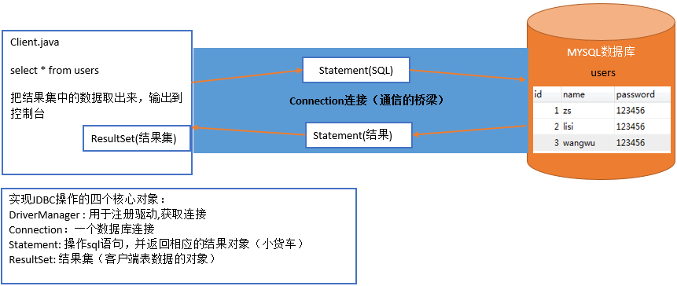

#Java第二阶段_day04_JDBC基础

## 0. 学习目标

- 掌握JDBC的概念
- 掌握JDBC操作单表CRUD的方法
- 掌握JDBC操作数据库事务的方法
- 掌握数据库操作工具类的实现方法


# 第1章  JDBC的概述

## 1.1.JDBC介绍

客户端操作MySQL数据库的方式

1. 使用第三方客户端来访问MySQL：SQLyog、Navicat、SQLWave、MyDB Studio、EMS SQL Manager for MySQL
2. 使用MySQL自带的命令行方式
3. **通过Java来访问MySQL数据库，今天要学习的内容**

**什么是JDBC**：`Java DataBase Connectivity`(Java数据库连接) JDBC是Java访问数据库的`标准规范`
**JDBC的作用**：JDBC是用于执行SQL语句的Java API(**Java语言通过JDBC可以操作数据库**)


## 1.2.JDBC的由来

1. **直接写代码操作数据库**
   
   **直接写代码操作数据库存在的问题：**
   1. 不知道MySQL数据库的操作方式，解析方式
   2. 代码繁琐，写起来麻烦
   3. MySQL和Oracle等其他数据库的操作方式和解析方式不同，每个数据库都要写一套代码
   4. MySQL和Oracle等其他数据库相互切换麻烦

2. **JDBC规范定义接口，具体的实现由各大数据库厂商来实现**
   JDBC是Java访问数据库的标准规范。真正怎么操作数据库还需要具体的实现类，也就是数据库驱动。每个数据库厂商根据自家数据库的通信格式编写好自己数据库的驱动。所以我们只需要会调用JDBC接口中的方法即可。数据库驱动由数据库厂商提供。
   

**JDBC的好处：**

1. 我们只需要会调用JDBC接口中的方法即可，使用简单
2. 使用同一套Java代码，进行少量的修改就可以访问其他JDBC支持的数据库

**JDBC会用到的包：**

1. java.sql：JDBC访问数据库的基础包，在JavaSE中的包。如：java.sql.Connection
2. javax.sql： JDBC访问数据库的扩展包
3. 数据库的驱动，各大数据库厂商来实现。如：MySQL的驱动：com.mysql.jdbc.Driver

**JDBC四个核心对象**
这几个类都是在java.sql包中

1. DriverManager: 用于注册驱动
2. Connection: 表示与数据库创建的连接
3. Statement: 执行SQL语句的对象
4. ResultSet: 结果集或一张虚拟表
   


# 第2章 JDBC的快速入门

今天我们将使用JDBC对分类表进行增删改查操作 . 接下来我们先做一个快速入门案例 : 使用JDBC来查询表中的所有分类.

## 2.1 数据准备

```sql
-- 创建数据库
CREATE DATABASE dayxx;

-- 切换数据库 
USE dayxx;

-- 创建分类表
CREATE TABLE category (
  cid INT PRIMARY KEY AUTO_INCREMENT,
  cname VARCHAR(100)
);
-- 初始化数据
INSERT INTO category (cname) VALUES('家电');
INSERT INTO category (cname) VALUES('服饰');
INSERT INTO category (cname) VALUES('化妆品');
```

## 2.2 创建项目,导入驱动

**1、创建Java项目**


**注意：选择项目类型，与JDK版本。**


**注意：不要指定任何模板**

设置项目位置：


**2、项目初始化设置**

创建lib目录：


效果：


导入jdbc驱动jar包：

将资料中提供的mysql-connector-java-8.0.11.jar复制到刚才创建好的lib目录下：


然后，右键单击添加的java包，将其加为库jar包：


效果如下：


操作完成后，效果如下：


## 2.3 JDBC操作步骤

1. 加载驱动
2. 获得连接
3. 编写sql
4. 获得执行sql语句的对象
5. 执行sql语句，并返回结果
6. 处理结果
7. 释放资源

## 2.4 代码实现

在项目src目录下，新建com.day01包，然后编写快速入门代码MySQL_QuickStart：

```java
import java.sql.Connection;
import java.sql.DriverManager;
import java.sql.ResultSet;
import java.sql.Statement;

public class MySQL_QuickStart {

    public void hello() throws Exception {
        //1. 加载驱动
        Class.forName("com.mysql.jdbc.Driver");
        //2. 获得连接
        Connection conn = DriverManager.getConnection
               ("jdbc:mysql://localhost:3306/dayxx", "root", "root");
        //3. 编写sql
        String sql = "select * from category";
        //4. 获得执行sql语句的对象
        Statement st = conn.createStatement();
        //5. 执行sql语句，并返回结果
        ResultSet rs = st.executeQuery(sql);
        //6. 处理结果
        //判断是否还有下一条记录
        while (rs.next()) {
            //若有下一条,获取此条记录
            Integer cid = rs.getInt("cid");
            String cname = rs.getString("cname");
            System.out.println(cid + " , " + cname);
        }
        //7. 释放资源
        rs.close();
        st.close();
        conn.close();
    }

    public static void main(String[] args) throws Exception {
        MySQL_QuickStart t = new MySQL_QuickStart();
        t.hello();
    }
}
```

注意：各个步骤中会有不同的异常抛出，这里我们先抛出到上层。用完的结果集、语句、连接对象，需要确保关闭。

如果关闭连接时抛出异常 **closing inbound before receiving peer's close_notify**

需要在JDBC连接串中加入 useSSL=false

```
jdbc:mysql://localhost:3306/dayxx?useSSL=false
```


# 第3章 API介绍

## 3.1 获取连接相关API

`Connection`表示Java程序与数据库之间的连接，只有拿到Connection才能操作数据库。

**JDBC获取连接步骤**
1.导入驱动Jar包
2.加载驱动
3.获取连接

### 3.1.1 加载驱动

我们Java程序需要通过数据库驱动才能连接到数据库，因此需要加载驱动。
MySQL的驱动的入口类是：`com.mysql.jdbc.Driver`


#### API介绍

Class.forName()方法用于加载驱动。方法如下

```java
Class.forName("com.mysql.jdbc.Driver");
向 JVM 中加载指定的驱动程序。
mysql5 以上驱动版本连接，需使用 com.mysql.cj.jdbc.Driver
```

#### 注意事项

```java
public class MySQL_QuickStart {
	public static void main(String[] args) throws Exception {
		// 加载驱动
		Class.forName("com.mysql.jdbc.Driver");
	}
}
```

通过查询com.mysql.jdbc.Driver源码，我们发现Driver类“主动”将自己进行注册


> 注意：使用`DriverManager.registerDriver(new com.mysql.jdbc.Driver());`，存在两方面不足
>
> 1. 硬编码，后期不易于程序扩展和维护
> 2. 驱动被注册两次

使用`Class.forName("com.mysql.jdbc.Driver");`加载驱动，这样驱动只会注册一次

```sql
public class Demo01 {
	public static void main(String[] args) throws Exception {
		Class.forName("com.mysql.jdbc.Driver"); 
		// 后期可以将"com.mysql.jdbc.Driver"字符串写在文件中.
	}
}
```


通常开发我们使用Class.forName() 加载驱动。`Class.forName("com.mysql.jdbc.Driver");`会走Driver类的静态代码块。在静态代码块中注册一次驱动。


> 总结：注册MySQL驱动使用`Class.forName("com.mysql.jdbc.Driver");`

### 3.1.2 获取连接

#### API介绍

`java.sql.DriverManager`类中有如下方法获取数据库连接

```java
static Connection getConnection(String url, String user, String password) 
连接到给定数据库 URL ，并返回连接。 
```

#### 参数说明

1. `String url`：连接数据库的URL，用于说明连接数据库的位置
2. `String user`：数据库的账号
3. `String password`：数据库的密码

连接数据库的URL地址格式：`协议名:子协议://服务器名或IP地址:端口号/数据库名?参数=参数值`

MySQL写法：`jdbc:mysql://localhost:3306/dayxx
如果是本地服务器，端口号是默认的3306，则可以简写：`jdbc:mysql:///dayxx

#### 注意事项

> 如果数据出现乱码需要加上参数: ?characterEncoding=utf8，表示让数据库以UTF-8编码来处理数据。
> 如: jdbc:mysql://localhost:3306/dayxx?characterEncoding=utf8

若出现以下内容,代表数据库服务没有启动


若出现以下内容,代表连接失败,请查看是否用户名和密码错误


### 3.1.3 获取语句执行对象

在`java.sql.Connection`接口中有如下方法获取到`Statement`对象

```java
Statement createStatement() 
创建一个 Statement 对象来将 SQL 语句发送到数据库
```

## 3.2 Statement对象相关API

```java
   boolean execute(String sql)  (了解)
   此方法可以执行任意sql语句。返回boolean值，表示是否返回ResultSet结果集。仅当执行select语句，且有返回结果时返回true, 其它语句都返回false;

```

```java
   int executeUpdate(String sql)
   根据执行的DML（INSERT、UPDATE、DELETE）语句，返回受影响的行数

```

```java
   ResultSet executeQuery(String sql)
   根据查询语句返回结果集,只能执行SELECT语句

```

> 注意：在MySQL中，只要不是查询就是修改。
>
> executeUpdate：用于执行增删改
>
> executeQuery：用于执行查询

## 3.3 ResultSet对象相关API

`ResultSet`用于保存执行查询SQL语句的结果。
我们不能一次性取出所有的数据，需要一行一行的取出。

**ResultSet的原理：**

1. ResultSet内部有一个指针,刚开始记录开始位置
2. 调用next方法, ResultSet内部指针会移动到下一行数据
3. 我们可以通过ResultSet得到一行数据 getXxx得到某列数据
   

**ResultSet获取数据的API**
其实ResultSet获取数据的API是有规律的get后面加数据类型。我们统称`getXXX()`


同时，我们还可以使用getObject()方法来获取字段数据。


# 第4章 JDBC实现对单表数据增、删、改、查

我们要对数据库进行增、删、改、查，需要使用`Statement`对象来执行SQL语句。

## 4.1 JDBC实现对单表数据增、删、改

**案例代码**

```java
public class Demo03 {
	public static void main(String[] args) throws Exception {
		Class.forName("com.mysql.jdbc.Driver");

		Connection conn = DriverManager.getConnection("jdbc:mysql:///mysqltest", "root", "root");
		System.out.println(conn);

		// 从连接中拿到一个Statement对象
		Statement stmt = conn.createStatement();

		// 1.插入记录
		String sql = "INSERT INTO category (cname) VALUES ('手机');";
		int i = stmt.executeUpdate(sql);
		System.out.println("影响的行数:" + i);

		// 2.修改记录
		sql = "UPDATE category SET cname='汽车' WHERE cid=4;";
		i = stmt.executeUpdate(sql);
		System.out.println("影响的行数:" + i);

		// 3.删除记录
		sql = "DELETE FROM category WHERE cid=1;";
		i = stmt.executeUpdate(sql);
		System.out.println("影响的行数:" + i);
		
		// 释放资源
		stmt.close();
		conn.close();
	}
}
```

**案例效果**


## 4.2 JDBC实现对单表数据查询

**使用JDBC查询数据库中的数据的步骤**

1. 注册驱动
2. 获取连接
3. 获取到Statement
4. 使用Statement执行SQL
5. ResultSet处理结果
6. 关闭资源

**案例代码**

```java
public class Demo04 {
	public static void main(String[] args) throws Exception {
		Class.forName("com.mysql.jdbc.Driver");
		
		Connection conn = DriverManager.getConnection("jdbc:mysql:///mysqltest", "root", "root");
		Statement stmt = conn.createStatement();
		
		String sql = "SELECT * FROM category;";
		ResultSet rs = stmt.executeQuery(sql);
		
		// 内部有一个指针,只能取指针指向的那条记录
		while (rs.next()) { // 指针移动一行,有数据才返回true
			// 取出数据
			int cid = rs.getInt("cid");
			String cname = rs.getString("cname");
			
			System.out.println(cid + " == " + cname);
		}
		
		// 关闭资源
		rs.close();
		stmt.close();
		conn.close();
	}
}
```

>注意：
>
>1. 如果光标在第一行之前，使用rs.getXXX()获取列值，报错：Before start of result set
>2. 如果光标在最后一行之后，使用rs.getXXX()获取列值，报错：After end of result set

**案例效果**


>总结：其实我们使用JDBC操作数据库的步骤都是固定的。不同的地方是在编写SQL语句
>
>1. 注册驱动
>2. 获取连接
>3. 获取到Statement
>4. 使用Statement执行SQL
>5. ResultSet处理结果
>6. 关闭资源


## 4.3 预处理语句

​       **预处理语句（prepareStatement）**

​       平常的Statement每次执行SQL，数据库管理系统（DBMS）都会解析编译SQL成可执行代码，然后执行并返回结果。
​       预处理语句，就是将SQL中可变的参数抽取出来替换，数据库管理系统（DBMS）会把SQL不变的部分编译成可执行代码，每次运行时，将参数代入代码，直接执行。

​       在需要反复执行特定SQL时，使用预处理语句的优势是：

- 预处理语句大大减少了分析时间，只做了一次查询（虽然语句多次执行）。
- 绑定参数减少了服务器带宽，你只需要发送查询的参数，而不是整个语句。
- 预处理语句针对SQL注入是非常有用的，因为参数值发送后使用不同的协议，保证了数据的合法性。


​      **SQL注入攻击**

​      由于程序员的水平及经验也参差不齐，相当大一部分程序员在编写代码的时候，没有对用户输入数据的合法性进行判断，使应用程序存在安全隐患。用户可以提交一段数据库查询代码，根据程序返回的结果，获得某些他想得知的数据，这就是所谓的SQL Injection，即SQL注入。

```
某个网站的登录验证的SQL查询代码为：

strSQL = "SELECT * FROM users WHERE (name = '" + userName + "') and (pw = '" + passWord` + "');"

如果登录者恶意填入
1' OR '1'='1
与
1' OR '1'='1

时，将导致原本的SQL字符串被填为
strSQL = "SELECT * FROM users WHERE (name = '1' OR '1'='1') and (pw = '1' OR '1'='1');"

也就是实际上运行的SQL命令会变成下面这样的
strSQL = "SELECT * FROM users;"
因此达到无账号密码，亦可登录网站。所以SQL注入攻击被俗称为黑客的填空游戏。
```

​        **当运行时动态地把参数传给PreprareStatement时， 即使参数里有敏感字符如 or’1=1’也数据库会作为一个参数一个字段的属性值来处理而不会作为一个SQL指令， 如此，就起到了SQL注入的作用了！**


​       **预处理语句操作**

```
  String sql = "select sid,sname,sage from student where sage=? and sname=?";
  PrepareStatement ps=con.prepareStatement(sql);//封装sql指令
  ps.setString(1, "22");//1为下标 22 为要插入的值
  ps.setString(2, "小志");
  rs=ps.executeQuery();//执行查询操作
  while(rs.next()){
      System.out.println(rs.getString("sid")+rs.getString("sname")+rs.getString("sage"));
  }
  
  String sql1 = "insert into student values(?,?,?)";
  ps=con.prepareStatement(sql1);
  ps.setString(1, "6");
  ps.setString(2, "韩雪");
  ps.setString(3, "26");
  ps.executeUpdate();//执行更新操作
```

 

​    预处理语句常用API

| 返回值    | 调用方式                                      |
| --------- | --------------------------------------------- |
| void      | setDate(int parameterIndex, Date x)           |
| void      | setDouble(int parameterIndex, double x)       |
| void      | setFloat(int parameterIndex, float x)         |
| void      | setInt(int parameterIndex, int x)             |
| void      | setObject(int parameterIndex, Object x)       |
| void      | setString(int parameterIndex, String x)       |
| void      | setTime(int parameterIndex, Time x)           |
| void      | setTimestamp(int parameterIndex, Timestamp x) |
| ResultSet | executeQuery()                                |
| int       | executeUpdate()                               |


# 第5章 JDBC事务

之前我们是使用MySQL的命令来操作事务。接下来我们使用JDBC来操作银行转账的事务。

## 5.1 准备数据

```sql
CREATE TABLE account (
	id INT PRIMARY KEY AUTO_INCREMENT,
	NAME VARCHAR(10),
	balance DOUBLE
);
-- 添加数据
INSERT INTO account (NAME, balance) VALUES ('张三', 1000), ('李四', 1000);
```

## 5.2 API介绍

`Connection`接口中与事务有关的方法

1. ```java
   void setAutoCommit(boolean autoCommit) throws SQLException;
   false：开启事务， ture：关闭事务
   ```

2. ```java
   void commit() throws SQLException;
   提交事务
   ```

3. ```java
   void rollback() throws SQLException;
   回滚事务
   ```

## 5.3 使用步骤

1. 注册驱动
2. 获取连接
3. 获取到Statement
4. **开启事务**
5. 使用Statement执行SQL
6. **提交或回滚事务**
7. 关闭资源

## 5.4 案例代码

```java
public class Demo05 {
	public static void main(String[] args) {
		Connection conn = null;
		try {
			// 拿到连接
			Class.forName("com.mysql.jdbc.Driver");
			conn = DriverManager.getConnection("jdbc:mysql:///dayxx", "root", "root");
			
			// 开启事务
			conn.setAutoCommit(false);			
			Statement pstmt = conn.createStatement();			
			// 张三减500
			String sql = "UPDATE account SET balance = balance - 500 WHERE id=1;";
			pstmt.executeUpdate(sql);
			// 模拟异常
			// int i = 10 / 0;
			
			// 李四加500
			sql = "UPDATE account SET balance = balance + 500 WHERE id=2;";
			pstmt.executeUpdate(sql);
			
			pstmt.close();
			// 成功,提交事务
			System.out.println("成功,提交事务");
			conn.commit();
		} catch (Exception e) {
			// 失败,回滚事务
			try {
				System.out.println("出了异常,回滚事务");
				conn.rollback();
			} catch (SQLException e1) {
				e1.printStackTrace();
			}
		} finally {
			try {
				conn.close();
			} catch (SQLException e) {
				e.printStackTrace();
			}
		}
	}
}
```

## 5.5 案例效果


**说明：**JDBC操作MySQL默认是自动提交事务的，事务不安全；可以手动开启事务管理，进行事务提交和回滚。


# 第6章 JDBC获取连接与关闭连接工具类实现

​	通过上面案例需求我们会发现每次去执行SQL语句都需要注册驱动，获取连接，得到Statement，以及释放资源。发现很多重复的劳动，我们可以将重复的代码定义到某个类的方法中。直接调用方法，可以简化代码。
​	那么我们接下来定义一个`JDBCUtil`类。把注册驱动，获取连接，得到Statement，以及释放资源的代码放到这个类的方法中。以后直接调用方法即可。

## 6.1 编写JDBC工具类步骤

1. 将固定字符串定义为常量
2. 在静态代码块中注册驱动(只注册一次)
3. 提供一个获取连接的方法`static Connection getConneciton();`
4. 定义关闭资源的方法`close(Connection conn, Statement stmt, ResultSet rs)`
5. 重载关闭方法`close(Connection conn, Statement stmt)`

## 6.2 案例代码

`JDBCUtil.java`

```java
public class JDBCUtil {
	// 1.将固定字符串定义为常量
	private static String DRIVER_CLASS = "com.mysql.jdbc.Driver";
	private static String URL = "jdbc:mysql:///dayxx";
	private static String USER = "root";
	private static String PASSWORD = "root";
	
	// 2.在静态代码块中注册驱动(只注册一次)
	// 当这个类加载到内存的时候就走这个静态代码块,再去触发Driver类中的静态代码块,主动注册
	static {
        /* 可以将四个参数抽取为一个jdbc.properties文件，放置在src目录下，
      	   然后通过Properties对象getProperty()方法获取每个值 */
      	InputStream is = JDBCUtil.class.getClassLoader()
            .getResourceAsStream("jdbc.properties");
		Properties pp = new Properties();
		pp.load(is);
        String driver_class = pp.getProperty("DRIVER_CLASS");
        //如果dirver_class确实配置了值，则
        if(driver_class != null && !driver_class.trim().equals("")) {
            DRIVER_CLASS = driver_class;
        }        
		try {
			Class.forName(DRIVER_CLASS);
		} catch (ClassNotFoundException e) {}
	}
	
	// 3.提供一个获取连接的方法static Connection getConneciton();
	// 我们面向JDBC编程
	public static Connection getConnection() throws SQLException {
		Connection conn = DriverManager.getConnection(URL, USER, PASSWORD);      
      	/* 可以将四个参数抽取为一个jdbc.properties文件，放置在src目录下，
      		然后通过Properties对象getProperty()方法获取每个值 */
      	InputStream is = JDBCUtil.class.getClassLoader()
            .getResourceAsStream("jdbc.properties");
		Properties pp = new Properties();
		pp.load(is);
        String driver_name = properties.getProperty("DRIVER_NAME");
        if(driver_name != null && !driver_name.trim().equals("")) {
            DRIVER_NAME = driver_name;
        }
			
		return conn;
	}
	
	// 5.重载关闭方法close(Connection conn, Statement stmt)
	public static void close(Connection conn, Statement stmt) {
		close(conn, stmt, null);
	}
	
	// 4.定义关闭资源的方法close(Connection conn, Statement stmt, ResultSet rs)
	public static void close(Connection conn, Statement stmt, ResultSet rs) {
		if (rs != null) {
			try {
				rs.close();
			} catch (SQLException e) {}
		}
		
		if (stmt != null) {
			try {
				stmt.close();
			} catch (SQLException e) {}
		}
		
		if (conn != null) {
			try {
				conn.close();
			} catch (SQLException e) {}
		}
	}
}
```

`Demo06.java`

```java
public class Demo06 {
	public static void main(String[] args) throws Exception {
		createTable();
//		addEmployee();
//		updateEmployee();
//		deleteEmployee();
	}
	
	// 删除员工
	public static void deleteEmployee() throws Exception {
		Connection conn = JDBCUtil.getConnection();
		Statement stmt = conn.createStatement();
		
		// 删除id为3的员工
		String sql = "DELETE FROM employee WHERE id=3;";
		
		int i = stmt.executeUpdate(sql);
		System.out.println("影响的行数: " + i);
		
//		stmt.close();
//		conn.close();
//		JDBCUtil.close(conn, stmt, null);
		JDBCUtil.close(conn, stmt);
	}
	
	// 修改员工
	public static void updateEmployee() throws Exception {
		Connection conn = JDBCUtil.getConnection();
		Statement stmt = conn.createStatement();
		
		// 将id为3的员工姓名改成田七，地址改成天津
		String sql = "UPDATE employee SET address='天津', name='田七' WHERE id=3;";
		
		int i = stmt.executeUpdate(sql);
		System.out.println("影响的行数: " + i);
		
//		stmt.close();
//		conn.close();
//		JDBCUtil.close(conn, stmt, null);
		JDBCUtil.close(conn, stmt);
	}
	
	// 定义添加员工
	public static void addEmployee() throws Exception {
		Connection conn = JDBCUtil.getConnection();
		Statement stmt = conn.createStatement();
		
		// 添加4个员工
		String sql = "INSERT INTO employee VALUES (NULL, '张三4', 20, '北京'),"
				+ " (NULL, '李四4', 21, '南京'),"
				+ " (NULL, '王五4', 18, '东京'),"
				+ " (NULL, '赵六4', 17, '西安');";
		
		int i = stmt.executeUpdate(sql);
		System.out.println("影响的行数: " + i);
		
//		stmt.close();
//		conn.close();
//		JDBCUtil.close(conn, stmt, null);
		JDBCUtil.close(conn, stmt);
	}

	// 创建表
	public static void createTable() throws Exception {
		Connection conn = JDBCUtil.getConnection();
		Statement stmt = conn.createStatement();
		
		String sql = "CREATE TABLE IF NOT EXISTS employee ("
				+ " id INT PRIMARY KEY AUTO_INCREMENT,"
				+ " name VARCHAR(20) UNIQUE NOT NULL,"
				+ " age INT,"
				+ " address VARCHAR(50)"
				+ ");";
		
		int i = stmt.executeUpdate(sql);
		System.out.println("ok");
		
//		stmt.close();
//		conn.close();
//		JDBCUtil.close(conn, stmt, null);
		JDBCUtil.close(conn, stmt);
	}
}
```

## 6.3 案例效果


# 第7章 JDBC实现登录案例

## 7.1 案例需求

模拟用户输入账号和密码登录网站

## 7.2 案例效果

1. 输入正确的账号，密码，显示登录成功
   
2. 输入错误的账号，密码，显示登录失败
   


## 7.3 案例分析

1. 使用数据库保存用户的账号和密码
2. 让用户输入账号和密码
3. 使用SQL根据用户的账号和密码去数据库查询数据
4. 如果查询到数据，说明登录成功
5. 如果查询不到数据，说明登录失败

## 7.4 实现步骤

1. 创建一个用户表保存用户的账号和密码，并添加一些数据，SQL语句如下：

   ```sql
   CREATE TABLE USER (
     id INT AUTO_INCREMENT PRIMARY KEY,
     NAME VARCHAR(50),
     PASSWORD VARCHAR(50)
   );
   INSERT INTO USER (NAME, PASSWORD) VALUES('admin', '123'), ('test', '123'), ('张三', '123');
   ```

2. 编写代码让用户输入账号和密码

   ```java
   public class UserLogin {
      public static void main(String[] args) {
      Scanner sc = new Scanner(System.in);
      System.out.println("请输入账号: ");
      String name = sc.nextLine();
      System.out.println("请输入密码: ");
      String password = sc.nextLine();
   }
   ```


1. 使用SQL根据用户的账号和密码去数据库查询数据

   ```java
   public class UserLogin {
      public static void main(String[] args) throws Exception {
      // 让用户输入账号和密码
      Scanner sc = new Scanner(System.in);
      System.out.println("请输入账号: ");
      String name = sc.nextLine();
      System.out.println("请输入密码: ");
      String password = sc.nextLine();
      
      // 使用SQL根据用户的账号和密码去数据库查询数据
      Connection conn = JDBCUtil.getConnection();
      Statement stmt = conn.createStatement();
      String sql = "SELECT * FROM user WHERE name='" + name + "' AND password='" + password + "';";
      }
   }
   ```

2. 如果查询到数据，说明登录成功，如果查询不到数据，说明登录失败

```
public class UserLogin {
public static void main(String[] args) throws Exception {
   // 让用户输入账号和密码
   Scanner sc = new Scanner(System.in);
   System.out.println("请输入账号: ");
   String name = sc.nextLine();
   System.out.println("请输入密码: ");
   String password = sc.nextLine();

   // 使用SQL根据用户的账号和密码去数据库查询数据
   Connection conn = JDBCUtil.getConnection();
   Statement stmt = conn.createStatement();
   String sql = "SELECT * FROM user WHERE name='" + name + "' AND password='" + password + "';";

   // 如果查询到数据，说明登录成功，如果查询不到数据，说明登录失败
   ResultSet rs = stmt.executeQuery(sql);
if (rs.next()) {
      //能进来查询到了数据.
      System.out.println("欢迎您," + name);
   } else {
      //查询不到数据，说明登录失败
      System.out.println("账号或密码错误...");
   }
   // 关闭连接	
   JDBCUtil.close(conn, stmt, rs);
}
}
```

