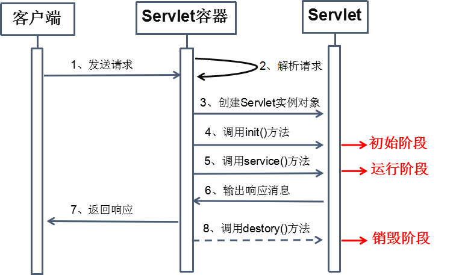
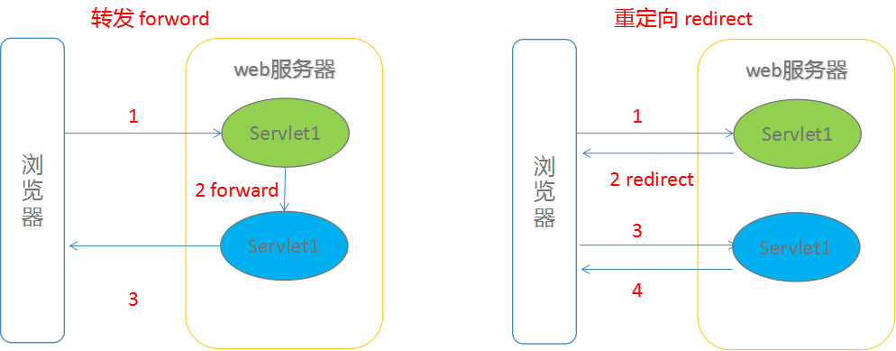

# Servlet高级&请求&响应

## 学习目标

- 掌握Servlet的执行原理和生命周期
- 掌握Servlet的体系结构，了解其他Servlet配置
- 掌握Servlet3.0注解配置
- 理解HTTP协议及HTTP请求和响应
- 熟练掌握Request和Response核心API
- 熟练掌握登陆案例

## 一、Servlet高级

### 1.1 Servlet生命周期



#### 1.1.1 Servlet生命周期方法详解：

##### 被创建：执行init方法，只执行一次

Servlet什么时候被创建？

默认情况下，第一次被访问时，Servlet被创建，可以配置执行Servlet的创建时机。

- 在`<servlet>`标签下配置
  - 第一次被访问时创建：`<load-on-startup>`的值为负数
  - 在服务器启动时创建：`<load-on-startup>`的值为0或正整数


Servlet的`init`方法只执行一次，说明一个Servlet在内存中只存在一个对象，Servlet是单例的，多个用户同时访问时可能存在线程安全问题。

- 解决：尽量不要在Servlet中定义成员变量。即使定义了成员变量，也不要对修改值


##### 提供服务：执行service方法，执行多次

* 每次访问Servlet时，`service`方法都会被调用一次。

##### 被销毁：执行destroy方法，只执行一次

* Servlet被销毁时执行。服务器关闭时，Servlet被销毁
  * 只有服务器正常关闭时，才会执行`destroy`方法。
  * `destroy`方法在Servlet被销毁之前执行，一般用于释放资源

#### 案例1：

创建一个Servlet,理解Servlet的生命周期。

```java
package com.bailiban.servlet;

import java.io.IOException;

import javax.servlet.Servlet;
import javax.servlet.ServletConfig;
import javax.servlet.ServletException;
import javax.servlet.ServletRequest;
import javax.servlet.ServletResponse;

/*
 * Servlet的生命周期
 */
public class Demo2Servlet implements Servlet {

	/*
	 * 初始化方法
	 * 在servlet创建时执行，只会执行一次
	 */
	@Override
	public void init(ServletConfig config) throws ServletException {
		
		System.out.println("我出生了...");
		
	}
	/*
	 * 提供服务的方法  ，每访问一次servlet就会执行一次  多次执行
	 */
	@Override
	public void service(ServletRequest req, ServletResponse res) throws ServletException, IOException {

		System.out.println("我响应请求了...");
	}
	/*
	 * 销毁方法
	 * 在服务器正常关闭执行   只执行一次
	 */
	@Override
	public void destroy() {

		System.out.println("我挂了...  ");
	}
	@Override
	public ServletConfig getServletConfig() {
		// TODO Auto-generated method stub
		return null;
	}

	@Override
	public String getServletInfo() {
		// TODO Auto-generated method stub
		return null;
	}


}
```

### 1.2 Servlet3.0 注解配置

Servlet3.0开始支持注解配置，通过WebServlet注解来实现映射，web.xml不再是必需的组件。

**步骤：**

1. 创建JavaEE项目，选择Servlet的版本3.0以上，可以不创建web.xml
2. 定义一个类，实现Servlet接口
3. 复写方法
4. 在类上使用`@WebServlet`注解，进行配置
   * `@WebServlet("资源路径")`

下面是`@WebServlet`的源码实现

```java
@Target({ElementType.TYPE})
@Retention(RetentionPolicy.RUNTIME)
@Documented
public @interface WebServlet {
    
	String name() default "";//相当于<Servlet-name>
			
	String[] value() default {};//代表urlPatterns()属性配置
			
	String[] urlPatterns() default {};//相当于<url-pattern>
			
	int loadOnStartup() default -1;//相当于<load-on-startup>
			
	 WebInitParam[] initParams() default {};
			
	 boolean asyncSupported() default false;
			
	 String smallIcon() default "";
			
	 String largeIcon() default "";
			
	 String description() default "";
			
	 String displayName() default "";
}
```

### 1.3 Servlet体系结构

 ` Servlet `-- 接口
		|

`GenericServlet` -- 抽象类
		|

`HttpServlet`  -- 抽象类

-  GenericServlet：将Servlet接口中其他的方法做了默认空实现，只将service()方法作为抽象
   - 定义Servlet类时，可以继承GenericServlet，实现service()方法即可

  ```java
  package com.bailiban.servlet;
  import java.io.IOException;
  import javax.servlet.GenericServlet;
  import javax.servlet.ServletException;
  import javax.servlet.ServletRequest;
  import javax.servlet.ServletResponse;
  import javax.servlet.annotation.WebServlet;
  
  /*
   * 继承 GenericServlet 方式 创建Servlet
   */
  @WebServlet("/demo1")
  public class Demo1Servlet extends GenericServlet {
  
  	@Override
  	public void service(ServletRequest req, ServletResponse res) throws ServletException, IOException {
  
           System.out.println("继承 GenericServlet 方式 创建Servlet");
  		
  	}
  
  }
  ```

- 
  HttpServlet：对http协议的一种封装，简化操作 （我们一般使用这个）

  1. 定义类继承HttpServlet
  2. 复写doGet/doPost方法

  ```java
  package com.bailiban.servlet;
  import java.io.IOException;
  import javax.servlet.ServletException;
  import javax.servlet.annotation.WebServlet;
  import javax.servlet.http.HttpServlet;
  import javax.servlet.http.HttpServletRequest;
  import javax.servlet.http.HttpServletResponse;
  
  /**
   * 继承 HttpServlet方式创建servlet
   */
  @WebServlet("/demo2")
  public class Demo2Servlet extends HttpServlet {
  
  
  	private static final long serialVersionUID = 1L;
  
  	//如果请求方式为get执行该方法
  	@Override
  	protected void doGet(HttpServletRequest req, HttpServletResponse resp) throws ServletException, IOException {
  	
  		System.out.println("get方式~~~~~");
  	}
      //如果请求方式为post执行该方法
  	@Override
  	protected void doPost(HttpServletRequest req, HttpServletResponse resp) throws ServletException, IOException {
  		System.out.println("post方式~~~~~");
  	}
  
  }
  
  ```

#### 案例2：

分别以继承GenericServlet和HttpServlet方式 创建Servlet。

## 二、HTTP协议

### 2.1 HTTP协议概念

- 什么是协议
  - 生活中协议：双方进行交流的一个标准 和约束
  - 协议：协议的甲乙双方，就是客户端（浏览器）和服务器！理解成双方通信的格式！
- HTTP概念：Hyper Text Transfer Protocol 超文本传输协议
  - 传输协议：定义了，客户端和服务器端通信时，发送数据的格式

  * HTTP协议特点：

      1. 基于TCP/IP的高级协议
      2. 默认端口号:80
         3. 基于请求/响应模型的:一次请求对应一次响应
         4. 无状态的：每次请求之间相互独立，不能交互数据

  * 历史版本：
         * 1.0：每一次请求响应都会建立新的连接
         * 1.1：复用连接 

http协议是一个重要的协议，他是贯穿整合B/S架构的核心协议。因此学习http协议的时候一定要从请求和响应两个角度思考。

> 注意方向性（请求：浏览器->服务器；响应：服务器->浏览器）。
>

### 2.2 HTTP 请求

客户端连上服务器后，向服务器请求某个web资源，称之为客户端向服务器发送了一个HTTP请求。

一个完整的HTTP请求包括如下内容：

1. 请求行：

   请求方式 请求url 请求协议/版本

2. 请求头：客户端浏览器告诉服务器一些信息

   请求头名称: 请求头值

 3. 请求空行：

    空行，就是用于分割POST请求的请求头，和请求体的。

 4. 请求体(正文)：

    封装POST请求消息的请求参数的

请求字符串格式：

```http
POST /servlet_demo/demo2 HTTP/1.1
Host: localhost:8080
User-Agent: Mozilla/5.0 (Windows NT 6.1; Win64; x64; rv:78.0) Gecko/20100101 Firefox/78.0
Accept: text/html,application/xhtml+xml,application/xml;q=0.9,image/webp,*/*;q=0.8
Accept-Language: zh-CN,zh;q=0.8,zh-TW;q=0.7,zh-HK;q=0.5,en-US;q=0.3,en;q=0.2
Accept-Encoding: gzip, deflate
Content-Type: application/x-www-form-urlencoded
Content-Length: 16
Origin: http://localhost:8080
Connection: keep-alive
Referer: http://localhost:8080/servlet_demo/demo2.html
Upgrade-Insecure-Requests: 1
		
username=wangcai
```

### 2.3 HTTP请求方式

请求行中的包含请求方式信息，请求方式有：
 POST、GET、HEAD、OPTIONS、DELETE、TRACE、PUT

常用的有： GET、 POST

#### 2.3.1 GET请求方式

- 通过浏览器地址栏访问的方式
- 使用超链接方式
- 使用js中的location.href 方式
- 表单的方式设置method="get"

 特点：

- 数据直接跟在URL地址后面明文显示的格式 ?key1=value1&key2=value2...
- 请求的url长度有限制的
- 安全性较低，数据可以直接在地址栏看到

#### 2.3.2 post方式

-  将表单的提交方式设为method="post"

 特点：

- 数据是隐藏在请求体里面的不是明文的也是key/value的形式 
- 数据大小没有限制
-  安全性高 

下面的表格比较了两种 HTTP 方法：GET 和 POST。

|                  | GET                                                          | POST                                                         |
| :--------------- | :----------------------------------------------------------- | :----------------------------------------------------------- |
| 后退按钮/刷新    | 无害                                                         | 数据会被重新提交（浏览器应该告知用户数据会被重新提交）。     |
| 书签             | 可收藏为书签                                                 | 不可收藏为书签                                               |
| 缓存             | 能被缓存                                                     | 不能缓存                                                     |
| 编码类型         | application/x-www-form-urlencoded                            | application/x-www-form-urlencoded 或 multipart/form-data。为二进制数据使用多重编码。 |
| 历史             | 参数保留在浏览器历史中。                                     | 参数不会保存在浏览器历史中。                                 |
| 对数据长度的限制 | 是的。当发送数据时，GET 方法向 URL 添加数据；URL 的长度是受限制的（URL 的最大长度是 2048 个字符）。 | 无限制。                                                     |
| 对数据类型的限制 | 只允许 ASCII 字符。                                          | 没有限制。也允许二进制数据。                                 |
| 安全性           | 与 POST 相比，GET 的安全性较差，因为所发送的数据是 URL 的一部分。在发送密码或其他敏感信息时绝不要使用 GET ！ | POST 比 GET 更安全，因为参数不会被保存在浏览器历史或 web 服务器日志中。 |
| 可见性           | 数据在 URL 中对所有人都是可见的。                            | 数据不会显示在 URL 中。                                      |

### 2.4 HTTP响应

一个HTTP响应代表服务器向客户端回送的数据，它包括：

1. 响应行：

   组成：协议/版本、响应状态码、状态码描述

   响应状态码：服务器告诉客户端浏览器本次请求和响应的一个状态

   - 状态码都是3位数字 

   -  分类：
     - `1xx`：服务器就收客户端消息，但没有接受完成，等待一段时间后，发送1xx多状态码
     - `2xx`：成功。代表：`200`
     - `3xx`：重定向。代表：`302(重定向)`，`304(访问缓存)`
     - `4xx`：客户端错误。代表：`404（请求路径没有对应的资源）` ，`405：请求方式没有对应的doXxx方法`
     - `5xx`：服务器端错误。代表：`500(服务器内部出现异常)`

2. 响应头：

   - 格式：头名称： 值

   - 常见的响应头：
     - Content-Type：服务器告诉客户端本次响应体数据格式以及编码格式
     - Content-disposition：服务器告诉客户端以什么格式打开响应体数据
       - in-line:默认值,在当前页面内打开
       - attachment;filename=xxx：以附件形式打开响应体。文件下载

3. 响应空行

4. 响应体:传输的数据

响应字符串格式

```http
HTTP/1.1 200 
Accept-Ranges: bytes
ETag: W/"309-1594050856290"
Last-Modified: Mon, 06 Jul 2020 15:54:16 GMT
Content-Type: text/html
Content-Length: 309
Date: Mon, 06 Jul 2020 16:02:39 GMT

<!DOCTYPE html>
<html>
<head>
<meta charset="UTF-8">
<title>demo2</title>
</head>
<body>
  <form action="/servlet_demo/demo2" method="post">
          用户名: <input type="text"  name = "username"  /><br/>
          <input type="submit" value="提交" />

    </form>
</body>
</html>
```

## 三、Request

### 3.1 Request概述

#### request对象和response对象的原理

- request和response对象是由服务器创建的。我们来使用它们
- request对象是来获取请求消息，response对象是来设置响应消息

####  request对象继承体系结构

`ServletRequest`--接口
	|	继承
`HttpServletRequest`--接口
	|	实现
`org.apache.catalina.connector.RequestFacade` 类(tomcat)

### 3.2 Request功能：

#### 3.2.1获取请求消息数据

#####  获取请求行数据

 `POST /servlet_demo/demo2 HTTP/1.1`

  方法：

   	1. 获取请求方式 ： `String getMethod()`  

 	2. 获取虚拟目录：`/servlet_demo`
     * `String getContextPath()`
 	3. 获取Servlet路径:`/demo2`
     * `String getServletPath()`
 	4. 获取get方式请求参数：`name=zhangsan`
     * `String getQueryString()`
 	5. 获取请求URI：
     * `String getRequestURI()`：`/servlet_demo/demo2`
     * `StringBuffer getRequestURL()`  :  `http://localhost/servlet_demo/demo2`

> URL:统一资源定位符 ：` http://localhost/servlet_demo/demo2`	中华人民共和国
>
> URI：统一资源标识符 : `/servlet_demo/demo2`	共和国

##### 获取请求头数据

* 方法：
  * 通过请求头的名称获取请求头的值： `String getHeader(String name)`
  * 获取所有的请求头名称： `Enumeration<String> getHeaderNames()`

##### 获取请求体数据

- 请求体：只有POST请求方式，才有请求体，在请求体中封装了POST请求的请求参数

- 步骤：

  - 获取流对象

    `BufferedReader getReader()`：获取字符输入流，只能操作字符数据

    `ServletInputStream getInputStream()`：获取字节输入流，可以操作所有类型数据

    > 在文件上传知识点后讲解

  - 再从流对象中拿数据

#### 3.2.2 获取请求参数通用方式(重点)

```java
1. String getParameter(String name):根据参数名称获取参数值    username=zs&password=123
2. String[] getParameterValues(String name):根据参数名称获取参数值的数组  hobby=xx&hobby=game
3. Enumeration<String> getParameterNames():获取所有请求的参数名称
4. Map<String,String[]> getParameterMap():获取所有参数的map集合
```

> 中文乱码问题：
>
> get方式：tomcat 8 已经将get方式乱码问题解决了
>
> post方式：会乱码
>
> 解决：在获取参数前，设置request的编码request.setCharacterEncoding("utf-8");

#### 3.2.3 请求转发 forward(重点)

一种在服务器内部的资源跳转方式

- 步骤 
  - 通过request对象获取请求转发器对象：`RequestDispatcher getRequestDispatcher(String path)`
  - 使用RequestDispatcher对象来进行转发：`forward(ServletRequest request, ServletResponse response) `

- 特点：
  - 浏览器地址栏路径不发生变化
  - 只能转发到当前服务器内部资源中。
  - 转发是一次请求

> 请求转发的应用场景：MVC设计模式

####  3.2.4 共享数据(重点)

域对象：一个有作用范围的对象，可以在范围内共享数据

request域：代表一次请求的范围，一般用于请求转发的多个资源中共享数据

方法：

1. `void setAttribute(String name,Object obj)`:存储数据
2. `Object getAttitude(String name)`:通过键获取值
3. `void removeAttribute(String name)`:通过键移除键值对

## 四、Response

### 4.1 response功能：

#### 4.1.1 设置响应消息

##### 设置响应行

 HTTP/1.1 200

设置状态码：`setStatus(int sc) `

##### 设置响应头

* 方法：`setHeader(String name, String value)`

#### 4.1.2 将数据输出到客户端浏览器(重点)

* 步骤：

  1. 获取字符输出流：`PrintWriter out= response.getWriter();`
  2. 输出数据：`out.write(数据);`

* 乱码问题：

  `PrintWriter out= response.getWriter();`获取的流的默认编码是`ISO-8859-1`

  告诉浏览器响应体使用的编码和响应的数据类型：`response.setContentType("text/html;charset=utf-8");`


#### 4.1.3 重定向 redirect (重点)

资源跳转的方式

-  代码实现
-  `response.sendRedirect(跳转地址);`
-  特点：
   -  地址栏发生变化
   -  重定向可以访问其他站点(服务器)的资源
   -  重定向是两次请求。不能使用request对象来共享数据

#### 4.1.4 forward 和  redirect 区别 ?

 	

- 重定向是两次请求,转发是一次请求。
- 重定向浏览器地址栏发生变化，转发浏览器地址栏路径不发生变化
- 重定向可以访问其他服务器的资源 ，转发只能转发到当前服务器内部资源中


#### 补充路径说明

路径分类

- 相对路径：通过相对路径不可以确定唯一资源
  -  如：`./index.html`
  -  不以`/`开头，以`.`开头路径
  -  规则：找到当前资源和目标资源之间的相对位置关系
  -  `./`：当前目录
  -  `../`:上一级目录

- 绝对路径：通过绝对路径可以确定唯一资源
  - 如：`http://localhost/day15/responseDemo2`
  - 以`/`开头的路径
  - 规则：判断定义的路径是给谁用的？判断请求将来从哪儿发出
    - 给客户端浏览器使用：需要加虚拟目录(项目的访问路径)
      - 建议虚拟目录动态获取：`request.getContextPath()`
      - `<a> , <form>` 重定向...
    - 给服务器使用：不需要加虚拟目录
      - 转发路径

### 案例3：

完成用户登录综合案例

需求：

1. 编写login.html登录页面

2. 用户输入用户名和密码，将数据提交到LoginServlet

3. 在LoginServlet中接收用户名和密码 

   - 登录成功重定向到SuccessServlet 显示欢迎信息

   - 登录失败将错误信息转发到ErrorServlet 显示

### 企业应用案例：

完善用户登录综合案例

需求：

在案例3的基础上，完善用户登录，根据输入的用户名和密码在数据库中查找对应的用户

- 如果用户存在登录成功
- 如果用户不存在登录失败

项目采用三层结构设计

