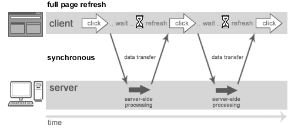
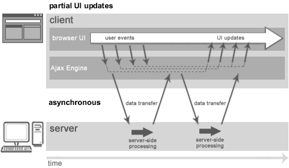
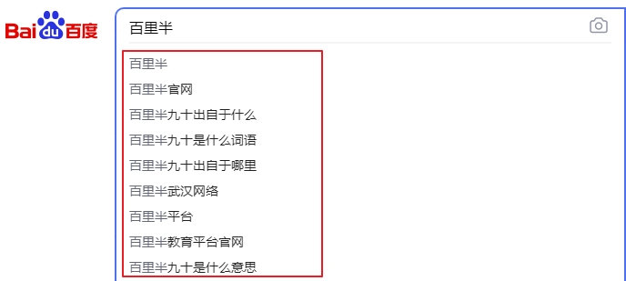
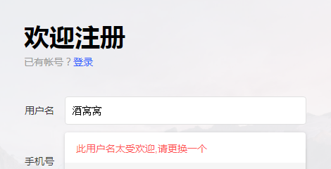

# Ajax异步技术

## 学习目标

- 了解Ajax的概念
-  了解原生JS实现Ajax的方式
- 理解并掌握Ajax的jQuery实现方式(重点)
-  理解并掌握JSON的语法(重点)
-  理解并掌握Jackson解析器的使用(重点)
-  完成校验用户名的案例

# 一、Ajax

## 1.1 Ajax概述

### 1.1.1 概念

**Ajax**：（Asynchronous JavaScript And XML）指 异步 JavaScript 及 XML

不是一种新的编程语言，而是一种用于创建更好更快以及交互性更强的 Web 应用程序的技术

是基于JavaScript、XML、HTML、CSS的新用法

### 1.1.2 异步和同步

建立在客户端和服务器端相互通信的基础上

- 同步：客户端必须等待服务器端的响应。在等待的期间客户端不能做其他操作。
- 异步：客户端不需要等待服务器端的响应。在服务器处理请求的过程中，客户端可以进行其他的操作。

传统 web交互方式 – 同步


web交互方式 – 异步


### 1.1.3 为什么使用Ajax

Ajax 是一种在无需重新加载整个网页的情况下，能够更新部分网页的技术。

通过在后台与服务器进行少量数据交换，Ajax 可以使网页实现异步更新。这意味着可以在不重新加载整个网页的情况下，对网页的某部分进行更新。传统的网页（不使用 Ajax）如果需要更新内容，必须重载整个网页页面。

提升用户的体验

### 1.1.4 Ajax在实际中的应用

搜索引擎根据用户输入的关键字，自动提示检索关键字




还有一个很重要的应用场景就是注册时候的用户名的查重




## 1.2 原生JS方式实现Ajax

JavaScript中`XMLHttpRequest`对象是整个Ajax技术的核心，它提供了异步发送请求的能力 

#### 步骤：

- 创建核心对象

    ```javascript
    var xmlhttp;
    if (window.XMLHttpRequest)
      {// code for IE7+, Firefox, Chrome, Opera, Safari
      xmlhttp=new XMLHttpRequest();
      }
    else
      {// code for IE6, IE5
         xmlhttp=new ActiveXObject("Microsoft.XMLHTTP");
      }
    ```

- 建立连接

     `XMLHttpRequest` 对象的 `open(*method*,*url*,*async*)`方法

    规定请求的类型、URL 以及是否异步处理请求。

    - *method*：请求的类型；GET 或 POST
    - *url*：文件在服务器上的位置
    - *async*：true（异步）或 false（同步）

    ```javascript
    xmlhttp.open("GET","ajaxServlet?username=wangcai",true);
    ```

- 发送请求

     send() 方法：

    ```javascript
    xmlhttp.send();
    ```

-  接受并处理来自服务器的响应结果

  使用 `XMLHttpRequest` 对象的 `responseText`  获得字符串形式的响应数据

   `XMLHttpRequest` 对象的三个重要的属性

  | 属性               | 描述                                                         |
  | :----------------- | :----------------------------------------------------------- |
  | onreadystatechange | 事件，每当 readyState 属性改变时，就会触发该事件函数。       |
  | readyState         | 存有 XMLHttpRequest 的状态。从 0 到 4 发生变化。`<br/>0: 请求未初始化<br/>1: 服务器连接已建立<br/>2: 请求已接收<br/>3: 请求处理中<br/>4: 请求已完成，且响应已就绪 |
  | status             | 200: "OK"404: 未找到页面                                     |

  ```javascript
  xmlhttp.onreadystatechange=function(){
      
      //判断readyState就绪状态是否为4，判断status响应状态码是否为200
      if (xmlhttp.readyState==4 && xmlhttp.status==200)
      {
         //获取服务器的响应结果
          var responseText = xmlhttp.responseText;
          alert(responseText);
      }
  }
  ```

### 案例1：

 使用JS原生方式实现Ajax

## 1.3 JQuery实现方式 Ajax

Jquery是一个优秀的javascript类库，自然对javascript原生的Ajax进行了封装，封装后的Ajax的操作方法更简洁，功能更强大，与ajax操作相关的jquery方法有很多，但开发中经常使用的有三种。

### $.ajax({键值对})

通过 HTTP 请求加载远程数据。

jQuery 底层 AJAX 实现。简单易用的高层实现见` $.get`, ​`$.post` 等。`$.ajax()` 返回其创建的` XMLHttpRequest ` 对象。

**常用键值对参数如下：**

- url：请求服务器端地址
- type：请求方式，POST/GET
- data：发送到服务器的参数，建议使用json格式
- success：成功响应执行的函数，对应的类型是function类型
- error：请求失败时调用此函数，对应的类型是function类型
- dataType：服务器端返回的数据类型，常用text和json
- async：是否异步，默认是true代表异步

```javascript
//使用$.ajax()发送异步请求
$.ajax({
    url:"ajaxServlet" , // 请求路径
    type:"POST" , //请求方式
    //请求参数  也可以这样写data: "username=jack&age=23",
    data:{"username":"wangcai","age":18},
    success:function (data) {//响应成功后的回调函数
         alert(data);
    },
    error:function () {//表示如果请求响应出现错误，会执行的回调函数
     alert("出错啦...")
    },
    dataType:"text"//设置接受到的响应数据的格式
});

```

### $.get(url, [data], [callback], [type])

通过远程 HTTP GET 请求载入信息。

这是一个简单的 GET 请求功能以取代复杂` $.ajax` 。请求成功时可调用回调函数。如果需要在出错时执行函数，请使用 ​`$.ajax`。

**参数:**

- **url**:待载入页面的URL地址
- **data**:待发送 Key/value 参数。
- **callback**:载入成功时回调函数。
- **type**:返回内容格式，xml, html, script, json, text, _default。

```javascript
  //使用$.get()发送ajax请求 
  $.get("ajaxServlet",{"username":"wangcai_get","age":18},function (data) {
      alert(data);
  },"text");
```


### $.post(url, [data], [callback], [type])

通过远程 HTTP POST 请求载入信息。

这是一个简单的 POST 请求功能以取代复杂` $.ajax` 。请求成功时可调用回调函数。如果需要在出错时执行函数，请使用 ​`$.ajax`。

**参数:**

- **url**:待载入页面的URL地址
- **data**:待发送 Key/value 参数。
- **callback**:载入成功时回调函数。
- **type**:返回内容格式，xml, html, script, json, text, _default。

```javascript
//使用$.post()发送异步请求
$.post("ajaxServlet",{"username":"wangcai_post"},function (data) {
  alert(data);
},"text");
```

### 案例2：

使用Jquery方式实现Ajax

# 二、JSON

## 2.1 什么是 JSON ？

- JSON 指的是 JavaScript 对象表示法（*J*ava*S*cript *O*bject *N*otation）
- JSON 是轻量级的文本数据交换格式
- JSON 独立于语言 *
- JSON 具有自我描述性，更易理解

举例

```java
Person p = new Person();
	p.setName("如花");
	p.setAge(18);
	p.setSex("男");

var p = {"name":"如花","age":18,"sex":"男"};
```

## 2.2 JSON语法

### JSON 语法规则

JSON 数据的书写格式是：键/值对。

```javascript
{"key1":value1, "key2":value2, "key3":value2...}
```

- 数据在键/值对中

  - 键用引号(单双都行)引起来，也可以不使用引号（最好统一用双引号，规范）
- 数据由逗号分隔：多个键值对由逗号分隔
- 大括号保存对象：使用{}定义json 格式
- 中括号保存数组：[ ]

### JSON 值

JSON 值可以是：

- 数字（整数或浮点数）
- 字符串（在双引号中）
- 逻辑值（true 或 false）
- 数组（在中括号中）   `{"persons":[{},{}]}`
- 对象（在大括号中）   `{"address":{"province"："湖北"....}}`
- null

### 获取数据:

1. 基本的JSON 对象

   - json对象.键名
   - json对象["键名"]

   ```javascript
   var person = {"name": "如花", age: 18, 'sex': true};
   //获取name的值
   //var name = person.name;
   var name = person["name"];
   ```

2. 嵌套 JSON 对象

   - json对象.键名.键名 ( 键名 可以使用 ["键名"])

   ```javascript
   var addr = {"address": {"province":"湖北","city":"武汉"}};
   var city =  addr.address.city;
   ```

3. 嵌套数组

   - JSON值为数组
     - json对象.键名[索引].键名

   ```javascript
   var persons = {
               "persons": [
                   {"name": "如花", "age": 18, "sex": true},
                   {"name": "旺财", "age": 19, "sex": true},
                   {"name": "小强", "age": 20, "sex": false}
                  ]
           };
   var name = persons.persons[2].name;
   ```

   - JSON对象数组（重点）
     - 数组[索引].键名

   ```javascript
   var ps = [{"name": "如花", "age": 18, "sex": true},
           {"name": "旺财", "age": 19, "sex": true},
           {"name": "小强", "age": 20, "sex": false}];
   var name =ps[1].name;
   ```

   4.遍历

   可以使用 `for-in` 来循环遍历JSON对象属性

   在` for-in `循环对象的属性时，使用中括号（[]）来访问属性的值：

   ```javascript
   //遍历json
   var  p ={"name": "如花", "age": 18, "sex": true};
   for(var key in p){
   
     alert("键:"+key+"-"+"值："+p[key]);
       
   }
   //遍历json数组
   var ps = [{"name": "如花", "age": 18, "sex": true},
           {"name": "旺财", "age": 19, "sex": true},
           {"name": "小强", "age": 20, "sex": false}];
    //获取ps中的所有值
   for (var i = 0; i < ps.length; i++) {
       var p = ps[i];
       for(var key in p){
           alert(key+":"+p[key]);
       }
   }
   ```

   

> 小提示：JSON 文件的文件类型是 ".json"
>
> ​				JSON 文本的 MIME 类型是 "application/json"

### 案例3:

演示JSON的语法：定义格式，数据获取

# 三、JSON和Java对象的相互转换

 常见JSON的解析器：Jsonlib，Gson，fastjson，jackson

> jacksons是springMVC框架内置JSON解析器

## 3.1 Java对象转换JSON

### 步骤：

1. 导入jackson的相关jar包
2. 创建Jackson核心对象 `ObjectMapper`
3. 调用`ObjectMapper`的相关方法进行转换
- 转换方法：
     - `writeValue(参数1，obj)`:
       - 参数1：
         - `File`：将obj对象转换为JSON字符串，并保存到指定的文件中
         - `Writer`：将obj对象转换为JSON字符串，并将json数据填充到字符输出流中
         - `OutputStream`：将obj对象转换为JSON字符串，并将json数据填充到字节输出流中
     - `writeValueAsString(obj)`:将对象转为json字符串

###  注解：

- `@JsonIgnore`：排除属性
- `@JsonFormat`：属性值的格式化
  - `@JsonFormat(pattern = "yyyy-MM-dd")`

### 复杂java对象转换

1. `List`：数组，数组中元素是json
2. `Map`：和对象格式一致

## 3.2  JSON转为Java对象

### 步骤：

1. 导入jackson的相关jar包

2. 创建Jackson核心对象 ObjectMapper

3. 调用ObjectMapper的相关方法进行转换

   ```java
    readValue (json字符串数据,Class)
   ```

### 案例4 ：

演示Java对象和JSON相互转换

**需求：**

1. java对象、List、Map 转换为JSON
2. JSON字符串转换为Java对象

### 案例5：

添加用户校验用户名是否存在

 需求：

1.添加时输入用户名，当失去焦点 Ajax异步验证 用户名是否已经存在

### 企业应用案例：

完善图书管理系统的图书添加，添加图书时异步验证图书名不能重复

