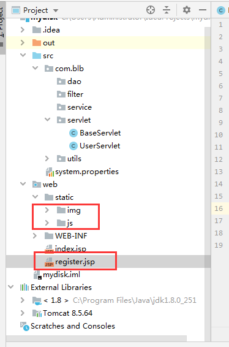
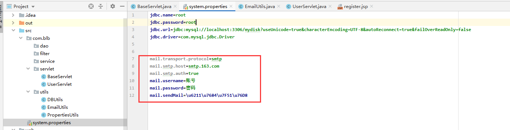
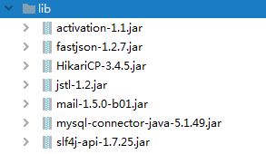
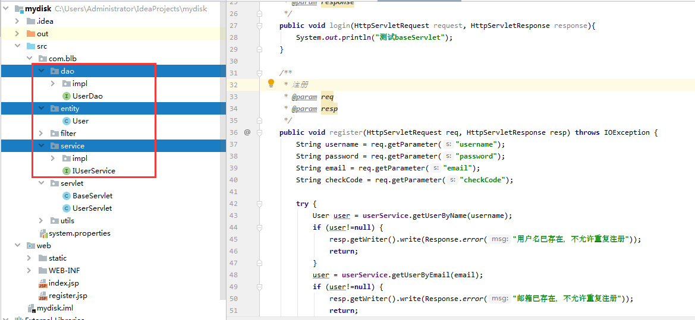
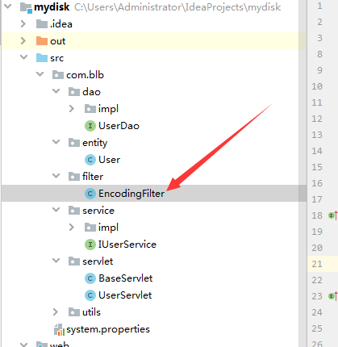
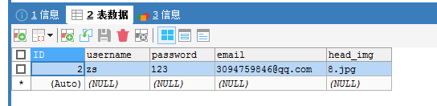

# day02

# 1 项目目标

- 完成项目中的注册与登录

# 2 注册

## 2.1 静态资源准备

将01_静态页面目录中的静态资源放到项目中的static目录中，同时将resgister.html复制到web目录下，将改为jsp

**注意：jsp文件最上面记得加上：<%@ page contentType="text/html;charset=UTF-8" language="java" %>**

 

访问http://localhost:8080/register.jsp，可以发现这里是需要邮箱的

 

## 2.2 邮箱验证码功能

这里使用的是Java mail这个包。使用邮件需要有这2步。

发件箱信息配置、发邮件的封装类

**发件箱信息配置**

 

在system.properties中加入下面发件箱配置信息

```properties
mail.transport.protocol=smtp
mail.smtp.host=smtp.163.com
mail.smtp.auth=true
mail.username=账号
mail.password=密码
mail.sendMail=\u6211\u7684\u7F51\u76D8
```

**发邮件的封装类**

**EmailUtils.java**

```java
package com.blb.utils;

import javax.mail.Session;
import javax.mail.Transport;
import javax.mail.internet.InternetAddress;
import javax.mail.internet.MimeMessage;
import java.util.Date;

/**
 * 邮件工具类
 * @author huahao
 *
 */
public class EmailUtils {

	/**
	 * 异步发送邮件，优先体验
	 * @param title
	 * @param context
	 * @param receiveMail
	 */
	public static void send(final String title, final String context, final String receiveMail) {
		new Thread(new Runnable() {
			public void run() {
				try {
					Session session = Session.getInstance(PropertiesUtils.getProperties());
					// 设置为debug模式, 可以查看详细的发送 log
					session.setDebug(false);
					MimeMessage message = createMimeMessage(session, title, context, receiveMail);
					Transport transport = session.getTransport();
					transport.connect(PropertiesUtils.getValue("mail.username"), PropertiesUtils.getValue("mail.password"));
					transport.sendMessage(message, message.getAllRecipients());
					transport.close();
				}catch (Exception e) {
					e.printStackTrace();
				}
			}
		}).start();
	}

	/**
	 * 创建邮件
	 * @param session 邮件会话
	 * @param title	标题
	 * @param context	内容
	 * @param receiveMail	收件人
	 * @return
	 * @throws Exception
	 */
	private static MimeMessage createMimeMessage(Session session, String title, String context, String receiveMail) throws Exception {
        // 1. 创建一封邮件
        MimeMessage message = new MimeMessage(session);
        // 2. From: 发件人
        message.setFrom(new InternetAddress(PropertiesUtils.getValue("mail.username"), PropertiesUtils.getValue("mail.sendMail"), "UTF-8"));
        // 3. To: 收件人（可以增加多个收件人、抄送、密送）
        message.setRecipient(MimeMessage.RecipientType.TO, new InternetAddress(receiveMail));
        // 4. Subject: 邮件主题
        message.setSubject(title, "UTF-8");
        // 5. Content: 邮件正文（可以使用html标签）
        message.setContent(context, "text/html;charset=UTF-8");
        // 6. 设置发件时间
        message.setSentDate(new Date());
        // 7. 保存设置
        message.saveChanges();
        return message;
	}
	
}

```

至此，发邮箱功能准备完毕。

## 2.3 补充其它Jar包

测试发现缺少Jar包，因为mail中用到了slf4j的包，所以这里把其它包全部导入

 


## 2.4 编写三层代码

 


**编写UserServlet.java**

```java
package com.blb.servlet;

import com.blb.entity.User;
import com.blb.service.IUserService;
import com.blb.service.impl.UserServiceImpl;
import com.blb.utils.EmailUtils;
import com.blb.utils.Response;

import javax.servlet.ServletException;
import javax.servlet.annotation.WebServlet;
import javax.servlet.http.HttpServletRequest;
import javax.servlet.http.HttpServletResponse;
import java.io.IOException;
import java.sql.SQLException;
import java.util.Random;

@WebServlet("/user/*")
public class UserServlet extends BaseServlet{

    private IUserService userService = new UserServiceImpl();

    /**
     * 登录
     * @param request
     * @param response
     */
    public void login(HttpServletRequest request, HttpServletResponse response){
        System.out.println("测试baseServlet");
    }

    /**
     * 注册
     * @param req
     * @param resp
     */
    public void register(HttpServletRequest req, HttpServletResponse resp) throws IOException {
        String username = req.getParameter("username");
        String password = req.getParameter("password");
        String email = req.getParameter("email");
        String checkCode = req.getParameter("checkCode");

        try {
            User user = userService.getUserByName(username);
            if (user!=null) {
                resp.getWriter().write(Response.error("用户名已存在，不允许重复注册"));
                return;
            }
            user = userService.getUserByEmail(email);
            if (user!=null) {
                resp.getWriter().write(Response.error("邮箱已存在，不允许重复注册"));
                return;
            }
            String code = (String) req.getSession().getAttribute("checkCode");
            if (!code.equals(checkCode)) {
                resp.getWriter().write(Response.error("验证码不正确"));
                return;
            }
            int n = new Random().nextInt(50);
            userService.add(new User(username, password, email, n + ".jpg"));
            resp.getWriter().write(Response.success());
        } catch (SQLException e) {
            e.printStackTrace();
            resp.getWriter().write(Response.error("操作失败，请稍后再试"));
        }
    }

    /**
     * 获取验证码
     * @param req
     * @param resp
     * @throws ServletException
     * @throws IOException
     */
    public void getCheckCode(HttpServletRequest req, HttpServletResponse resp) throws IOException {
        try {
            String email = req.getParameter("email");
            if (email.isEmpty()) {
                resp.getWriter().write(Response.error("邮箱不能为空"));
                return;
            }
            User user = userService.getUserByEmail(email);
            if (user!=null) {
                resp.getWriter().write(Response.error("邮箱已存在，不允许重复注册"));
                return;
            }

            int code = (int) ((Math.random()*9+1)*100000);
            req.getSession().setAttribute("checkCode", code+"");
            EmailUtils.send("【我的网盘】验证码", code+"", email);
            resp.getWriter().write(Response.success());
        } catch (Exception e) {
            e.printStackTrace();
        }
    }

}

```

## 2.5 测试编码过滤器

测试发现会发生乱码现象，于是加入编码过滤器

```java
package com.blb.filter;

import javax.servlet.*;
import javax.servlet.annotation.WebFilter;
import javax.servlet.http.HttpServletRequest;
import javax.servlet.http.HttpServletResponse;
import java.io.IOException;

/**
 * 编码过滤
 * @author huahao
 *
 */
@WebFilter("/*")
public class EncodingFilter implements Filter {

	@Override
	public void destroy() {

	}

	@Override
	public void doFilter(ServletRequest arg0, ServletResponse arg1, FilterChain chain)
			throws IOException, ServletException {
		HttpServletRequest request = (HttpServletRequest) arg0;
		HttpServletResponse response = (HttpServletResponse) arg1;
		
		request.setCharacterEncoding("utf-8");
		response.setCharacterEncoding("utf-8");
		response.setHeader("Content-type", "text/html;charset=UTF-8"); 
		chain.doFilter(request, response);
	}

	@Override
	public void init(FilterConfig arg0) throws ServletException {

	}

}

```

 

## 2.6 测试注册功能

邮箱使用正常

 

注册也正常

 

# 3 登录

加入login.jsp

编写登录方法

```java
/**
* 登录
* @param req
* @param resp
* @throws IOException
*/
public void login(HttpServletRequest req, HttpServletResponse resp) throws IOException {
    String username = req.getParameter("username");
    String password = req.getParameter("password");
    String remember = req.getParameter("remember");

    try {
        User user = userService.getUserByName(username);
        if (user==null) {
        resp.getWriter().write(Response.error("用户名不存在"));
        return;
    }
    if (!user.getPassword().equals(password)) {
        resp.getWriter().write(Response.error("密码错误"));
        return;
    }
    if (remember!=null) {

    }
        req.getSession().setAttribute("user", user);
        resp.getWriter().write(Response.success());
    } catch (SQLException e) {
        e.printStackTrace();
        resp.getWriter().write(Response.error("操作失败，请稍后再试"));
    }
}
```

# 4 退出登录

```java
/**
* 退出登录
* @param req
* @param resp
* @throws IOException
*/
public void logout(HttpServletRequest req, HttpServletResponse resp) throws IOException {
    req.getSession().removeAttribute("user");
    resp.sendRedirect("login.jsp");
}
```


