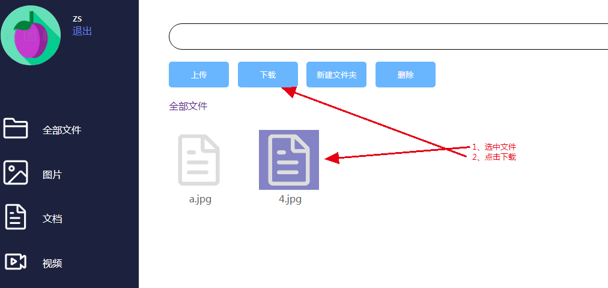

# day04

# 项目目标

- 文件下载
- 新建目录

# 文件下载

文件下载思路：

选中一个文件时，把选中文件的文件名（保存的文件名，而非上传时的文件名）拿到，点击下载按钮时，能过get请求把文件名和当前目录名带到后台，后台编写一个通过的接口，指定文件名和目录名，就能下载指定文件。

 

编写后台下载方法，在**FileServlet.java**中添加如下方法。

```java
    /**
     * 文件下载
     * @param req
     * @param resp
     * @throws ServletException
     * @throws IOException
     */
    public void download(HttpServletRequest req, HttpServletResponse resp) throws ServletException, IOException {
        try {
            String id = req.getParameter("id");
            UserFile userFile = userFileService.getById(Integer.parseInt(id));
            FileInputStream fileInputStream = new FileInputStream(SessionUtils.getUploadPath(req) + userFile.getPathName() + userFile.getFileName());
            ServletOutputStream outputStream = resp.getOutputStream();

            resp.setContentLength(fileInputStream.available());
            resp.setContentType("application/octet-stream");
            resp.setHeader("content-disposition","attachment;filename="+ URLEncoder.encode(userFile.getSubmitFileName(),"UTF-8"));

            byte[] data = new byte[1024];
            int len;
            while ((len=fileInputStream.read(data))!=-1){
                outputStream.write(data, 0, len);
            }
        } catch (SQLException e) {
            e.printStackTrace();
        }
    }
```

前台代码

```js
//下载
$('#download').click(function () {
    var id = $('.file.click').attr("data");
    if (id != undefined) {
	    window.location.href = "/file/download?id=" + id;
    }
})
```

# 新建目录

新建目录流程如下

 

因此编写前台代码：

