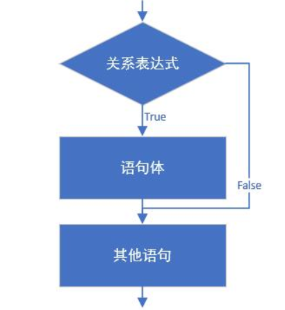
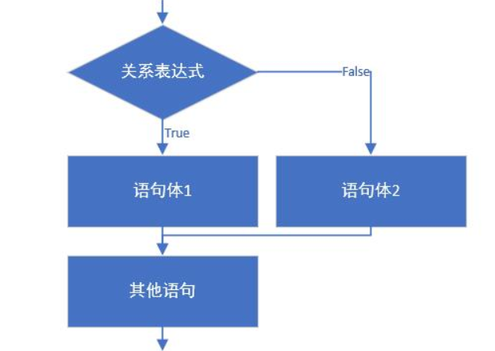
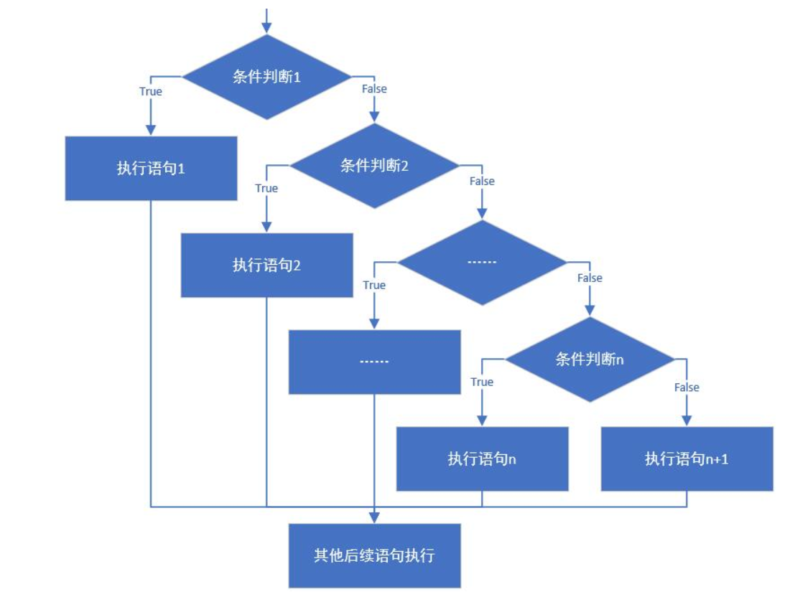
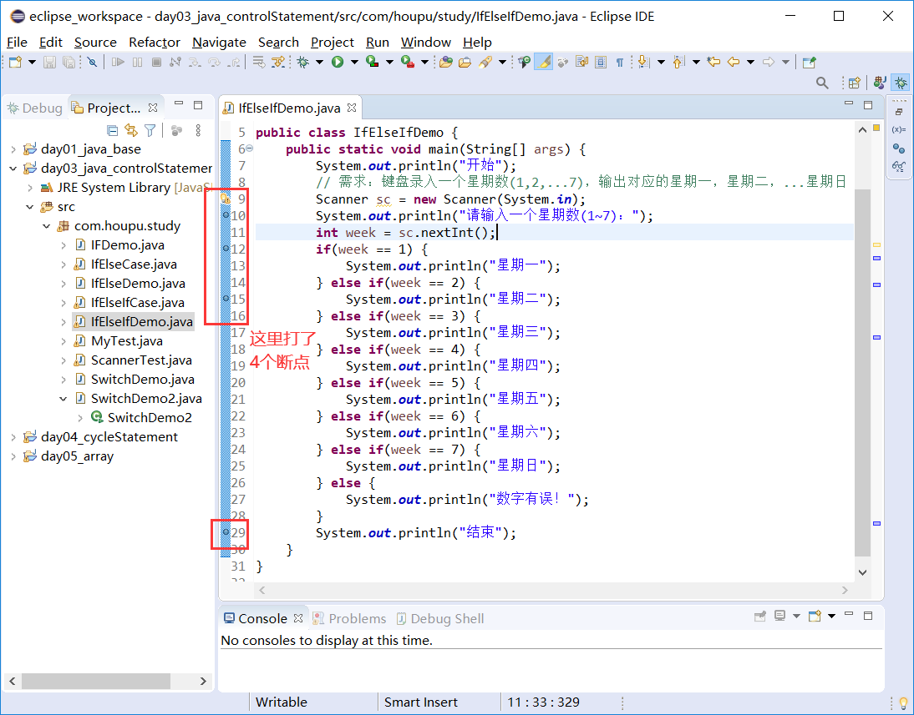
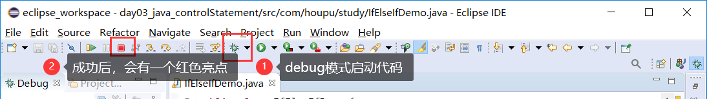
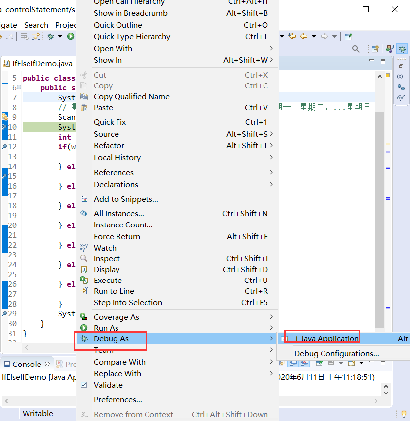
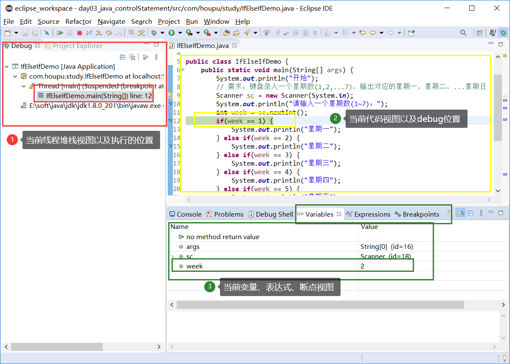
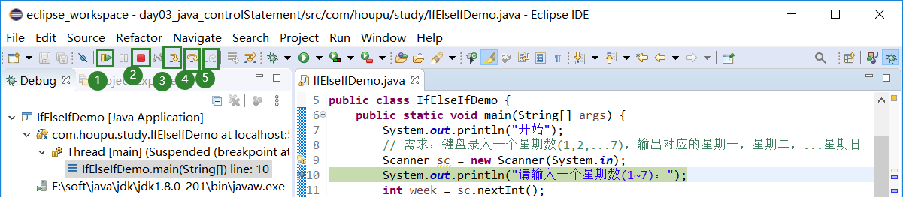

# 学习目标

```
1、掌握键盘录入类Scanner的基本使用
2、掌握三种if分支语句结构、执行流程以及使用
3、掌握switch分支语句结构、执行流程以及使用
4、掌握Eclipse工具的debug调试使用
```


# 第1章 数据输入

数据输入是程序获取指获取用户键盘录入的数据，那么在java语言中，怎样实现呢？

我们可以通过 Scanner 类来获取用户的输入。  

## 1.1 Scanner类的使用

### 1.1.1 导包

使用import关键字导包，在类的所有代码之前导包，引入要使用的类型，java.lang包下的所有类无需导入。

Scanner 类在java.util包下，所以需要将该类导入。

**格式：**

```
import 包名.类名;
```

### 1.1.2 创建对象

**格式：**

```
数据类型  变量名  =  new 数据类型(参数列表);
```

### 1.1.3 调用方法

**格式：**

```
变量名.方法名();
```


**示例：**

获取键盘录入的整数。

```java
import java.util.Scanner;
public class ScannerDemo {
  	public static void main(String[] args) {  		
		//创建对象
		Scanner sc= new Scanner(System.in);
		
		// 友情提示
		System.out.println("请输入一个整数：");
		
		//接收数据
		int n = sc.nextInt();
		
		//输出数据
		System.out.println("n= " + n);
  	}
}
```


## 1.2 Scanner练习

**需求：**

使用键盘录入三个学员的成绩90分、94分、82分，然后使用运算符进行比较获取成绩最高的分数并打印结果。

**示例：**

```java
import java.util.Scanner;
public class ScannerTest {
    public static void main(String[] args) {
        // 创建键盘录入对象Scanner
        Scanner sc = new Scanner(System.in);
        
        //键盘录入三个学员成绩分别赋值给三个变量。
        System.out.println("请输入第一个学员成绩：");
        int score1 = sc.nextInt();
        System.out.println("请输入第二个学员成绩：");
        int score2 = sc.nextInt();
        System.out.println("请输入第三个学员成绩：");
        int score3 = sc.nextInt();
        
        // 用三元运算符获取前两个学员的较高成绩值，并用临时变量保存起来。
        int tempScore = score1 > score2 ? score1 : score2;
        //用三元运算符获取临时成绩值和第三个学员成绩较高值，并用最高分数变量保存。
        int maxScore = tempScore > score3 ? tempScore : score3;
        
        // 输出结果
        System.out.println("这三个学生中成绩最高的是：" + maxScore +"分");
    }
}
```


# 第2章 分支结构

在一个程序执行的过程中，各条语句的执行顺序对程序的结果是有直接影响的。所以，我们必须清楚每条语句的执行流程。而且，很多时候我们要通过控制语句的执行顺序来实现我们要完成的功能。

在Java中，流程控制语句大概可以分以下三类：

- 顺序结构

- 分支结构(if, switch)

- 循环结构(for, while, do…while)

其中，所谓的顺序结构，即程序进入main()方法入口后，从上往下依次执行。如下所示：

```java
// main()方法入口
public static void main(String[] args){
    //顺序执行，根据编写的顺序，从上到下运行
    System.out.println(1);
    System.out.println(2);
    System.out.println(3);
}
```

这种顺序结构很常见，而且我们之前的练习都是这种结构。但在实际开发中，可能存在一些判断或其他因素需要控制语句执行，因此出现了分支结构和循环结构。

接下来，我们先对分支结构进行详解。


## 2.1 if条件分支语句

根据实际业务需求，if条件分支语句又分为以下三种形式：

```
1、if单分支语句

2、if...else... 双分支语句

3、if...else if ...else...多分支语句
```

我们之前学习的三元运算符，就都可以使用if语句进行转换。

### 2.1.1 if单分支语句

#### 1、if语句介绍

- **语法格式：**

```
if(条件表达式)｛
  	语句体;
｝
//其它语句
```

- **伪代码示例：**

```
if(小明的高考成绩超过700分)｛
  	小明就可以上哈佛;
｝
//其它语句
再看看其他人的成绩
```

#### 2、if语句执行流程



(1) 首先计算条件表达式的值；

(2) 如果条件表达式的值为true就执行语句体；

(3) 如果条件表达式的值为false就不执行语句体；

(4) 继续执行后面的其他语句。

#### 3、if语句练习

```java
public static void main(String[] args){
    System.out.println("开始");
    // 定义两个变量
    int a = 10;
    int b = 20;
    //变量使用if判断
    if (a == b){
      	System.out.println("a等于b");
    }
    int c = 10;
    if(a == c){
      	System.out.println("a等于c");
    }
    System.out.println("结束");
}
```


### 2.1.2 if...else双分支语句

上面的if单分支语句只关心如果条件成立了，会怎么样。有时候，我们还会关心如果不成立，怎么样。因此，就诞生了if...else双分支语句。

#### 1、if...else语句介绍

- **语法格式：**

```
if(条件表达式) { 
  	语句体1;
} else（） {
  	语句体2;
}
//其它语句
```

- **伪代码示例：**

```
if(小明的高考成绩超过700分)｛
  	小明就可以上哈佛;
｝else{
	小明选择重读一次;
}
//其它语句
再看看其他人的成绩
```

#### 2、if...else语句执行流程



(1) 首先计算条件表达式的值；

(2) 如果条件表达式的值为true就执行语句体1；

(3) 如果条件表达式的值为false就执行语句体2；

(4) 继续执行后面的其他语句。


#### 3、if...else语句练习

```
public static void main(String[] args) {
    System.out.println("开始");
    //定义两个变量
    int a = 10;
    int b = 20;
    //需求：判断a是否大于b，如果是，在控制台输出：a的值大于b，否则，在控制台输出：a的值不大于b
    if(a > b) {
    	System.out.println("a的值大于b");
    } else {
    	System.out.println("a的值不大于b");
    }
    System.out.println("结束");
}
```

#### 4、if...else案例

- **需求：**让用户任意给出一个整数，请用程序实现判断该整数是奇数还是偶数，并在控制台输出该整数是奇数还是偶数。

- **分析:**

  ①为了体现任意给出一个整数，采用键盘录入一个数据；
  ②判断整数是偶数还是奇数要分两种情况进行判断，使用if..else结构；
  ③判断是否偶数需要使用取余运算符实现该功能 number % 2 == 0；
  ④根据判定情况，在控制台输出对应的内容。

- **代码实现**

```java
public static void main(String[] args) {
    //为了体现任意给出一个整数，采用键盘录入一个数据。(导包，创建对象，接收数据)
    Scanner sc = new Scanner(System.in);
    System.out.println("请输入一个整数：");
    int number = sc.nextInt();
    //判断整数是偶数还是奇数要分两种情况进行判断，使用if..else结构
    //判断是否偶数需要使用取余运算符实现该功能 number % 2 == 0
    //根据判定情况，在控制台输出对应的内容
    if(number%2 == 0) {
    	System.out.println(number + "是偶数");
    } else {
    	System.out.println(number + "是奇数");
    }
}
```


### 2.1.3 if...else if ...else多分支语句

if单分支条件是针对只关心一个条件成立了如何如何，if...else双分支语句则是为了关注一个条件成立了如何，同时在失败是又如何的情况。又有情况下，我们的条件可能是多样的，而且我们也要关注不同情况下的不同执行，因此衍生出了if..else if..else的多分支语句。

#### 1、if..else if...else语句介绍

- **语法格式：**

```
if (条件表达式1) {
  	语句体1;
} else if (条件表达式2) {
  	语句体2;
}
...
}else if (条件表达式n) {
 	语句体n;
} else {
  	语句体n+1;
}
//其它语句
```

- **伪代码示例**

```
if(小明的高考成绩超过700分)｛
  	小明就可以上哈佛;
｝else if(小明的高考成绩超过600，但不超过700){
	小明选择上武大;
} 
else {
	// 连600分都没考到
	小明真的就重读了;
}
//其它语句
再看看其他人的成绩
```

#### 2、if..else if...else执行流程



(1) 首先计算条件表达式1的值,判断其结果是true还是false；

(2) 如果是true就执行语句体1，然后执行最下面的其他语句；

(3) 如果是false就继续计算条件表达式2,判断其结果是true还是false；

(4) 如果是true就执行语句体2，然后执行最下面的其他语句；

(5) 如果是false就继续计算条件表达式…,判断其结果是true还是false；

(6) …

(7) 如果没有任何条件表达式为true，就执行else中的语句体n+1。

#### 3、if..else if...else练习

键盘录入一个星期数(1,2,...7)，输出对应的星期一，星期二，...星期日

- 输入  1      输出	星期一
  输入  2      输出	星期二
    输入  3      输出	星期三
    输入  4      输出	星期四
    输入  5      输出	星期五
    输入  6      输出	星期六
    输入  7      输出	星期日
- 输入  其它数字   输出      数字有误。

```java
public static void main(String[] args) {
    System.out.println("开始");
    // 需求：键盘录入一个星期数(1,2,...7)，输出对应的星期一，星期二，...星期日
    Scanner sc = new Scanner(System.in);
    System.out.println("请输入一个星期数(1~7)：");
    int week = sc.nextInt();
    if(week == 1) {
    	System.out.println("星期一");
    } else if(week == 2) {
    	System.out.println("星期二");
    } else if(week == 3) {
    	System.out.println("星期三");
    } else if(week == 4) {
    	System.out.println("星期四");
    } else if(week == 5) {
    	System.out.println("星期五");
    } else if(week == 6) {
    	System.out.println("星期六");
    } else if(week == 7) {
    	System.out.println("星期日");
    } else {
    	System.out.println("数字有误！");
    }
    System.out.println("结束");
}
```


#### 4、if..else if...else案例

- **需求:** 小明快要期末考试了，小明爸爸对他说，会根据他不同的考试成绩，送他不同的礼物，假如你可以控制小明的得分，请用程序实现小明到底该获得什么样的礼物，并在控制台输出。

- **奖励规则:**

  95~100		山地自行车一辆
  90~94		  游乐场玩一次
  80~89		 变形金刚玩具一个
  80以下		胖揍一顿

- **分析:** 

  (1) 小明的考试成绩未知，可以使用键盘录入的方式获取值；

  (2) 由于奖励种类较多，属于多种判断，采用if...else if...else格式实现；

  (3) 为每种判断设置对应的条件；

  (4) 为每种判断设置对应的奖励。

- **代码实现**

```java
public static void main(String[] args) {
    //小明的考试成绩未知，可以使用键盘录入的方式获取值
    Scanner sc = new Scanner(System.in);
    System.out.println("请输入一个分数：");
    int score = sc.nextInt();
    //由于奖励种类较多，属于多种判断，采用if...else if...else格式实现
    //为每种判断设置对应的条件
    //为每种判断设置对应的奖励
    //数据测试：正确数据，边界数据，错误数据
    if(score>100 || score<0) {
    	System.out.println("你输入的分数有误");
    } else if(score>=95 && score<=100) {
    	System.out.println("山地自行车一辆");
    } else if(score>=90 && score<=94) {
    	System.out.println("游乐场玩一次");
    } else if(score>=80 && score<=89) {
    	System.out.println("变形金刚玩具一个");
    } else {
    	System.out.println("胖揍一顿");
    }
}
```


## 2.2 switch选择分支语句

在上一小节中，我们处理用户输入的星期数、以及学生的成绩，使用的是if...else if...else这个多条件分支语句来处理的。在这每一个条件判断中，都需要执行表达式语句判断是否成立。除此之外，Java提供了一个更便捷的多条件分支语句switch。

### 2.2.1 switch介绍

- **switch语句格式：**


```java
switch(表达式) {
  case 常量值1:
    语句体1;
    break;
  case 常量值2:
    语句体2;
    break;
  ...
  default:
    语句体n+1;
    break;
}
```

- **伪代码示例**

```
switch(1) {
  case 1:
    这是星期一;
    break;
  case 2:
    这是星期二;
    break;
  ...
  default:
    你输入的星期数用问题！;
    break;
}
```

### 2.2.2 switch执行流程


- 首先计算出表达式的值；
- 接着，自上而下和case依次比较，一旦有对应的值匹配，就会执行相应的语句，在执行的过程中，遇到break就会结束。
- 最后，如果所有的case都和表达式的值不匹配，就会执行default语句体部分，然后程序结束掉。


### 2.2.3 switch练习

- **switch语句练习-春夏秋冬**

  - 需求：一年有12个月，分属于春夏秋冬4个季节，键盘录入一个月份，请用程序实现判断该月份属于哪个季节，并输出。

  - 演示效果

    输入： 1、2、12	输出：冬季

    输入： 3、4、5	输出：春季

    输入： 6、7、8	输出：夏季

    输入： 9、10、11	输出：秋季

    输入：其它数字	输出：数字有误

- **代码实现**

```java
public static void main(String[] args) {
    //定义月份变量，判断季节
    int month = 6;
    //switch语句实现选择
    switch(month) {
        case 1:
            System.out.println("冬季");
            break;
        case 2:
            System.out.println("冬季");
            break;
        case 3:
            System.out.println("春季");
            break;
        case 4:
            System.out.println("春季");
            break;
        case 5:
            System.out.println("春季");
            break;
        case 6:
            System.out.println("夏季");
            break;
        case 7:
            System.out.println("夏季");
            break;
        case 8:
            System.out.println("夏季");
            break;
        case 9:
            System.out.println("秋季");
            break;
        case 10:
            System.out.println("秋季");
            break;
        case 11:
            System.out.println("秋季");
            break;
        case 12:
            System.out.println("冬季");
            break;
        default:
            System.out.println("你输入的月份数字有误！");
            break;
    }
}
```

**注意：**switch语句中，表达式的数据类型，可以是byte，short，int，char，enum（枚举类，JDK5开始支持），String（字符串，JDK7开始支持）。


### 2.2.4 case的穿透性

在switch语句中，如果case的后面不写break，将出现穿透现象，也就是不会在判断下一个case的值，直接向后运行，直到遇到break，或者整体switch结束。

```java
public static void main(String[] args) {
    //定义月份变量，判断季节
    int month = 6;
    //switch语句实现选择
    switch(month) {
        case 12:
        case 1:
        case 2:
            System.out.println("冬季");
            break;
        case 3:
        case 4:
        case 5:
            System.out.println("春季");
            break;
        case 6:
        case 7:
        case 8:
            System.out.println("夏季");
            break;
        case 9:
        case 10:
        case 11:
            System.out.println("秋季");
            break;
        default:
            System.out.println("你输入的月份数字有误");
            break;
    }
}
```


# 第3章 Eclipse工具的debug调试

前面的代码测试过程中，我们都是直接使用在代码启动类的main()方法中直接Run As运行的，这种方式的程序会直接启动并执行完成。但有时候，程序执行可能报错，我们想要知道代码的执行过程、顺序，以及执行过程中相关变量、数据的变化，因此，这就需要我们使用Debug模式启动运行项目。

这里，我们以之前编写号的if...else if...else案例代码进行演示说明。

## 3.1 eclipse工具Debug启动介绍

**第一步：打开java代码文件，在左侧双击鼠标设置断点，或者在左侧右键点击Toggle Breakpoint**



**第二步：点击eclipse上方的“蜘蛛”按钮，debug调试开始或者是main()方法右键Debug As运行。**



或者：




**第三步：显示debug图框。debug模式的界面，分为5个区域。**

（1）Debug(调试)区域，显示当前正在调试代码是什么，在第多少行；
（2）Variables(变量)区域，显示变量的值。
（3）Console(控制台)区域。



## 3.2 eclipse工具Debug按钮执行介绍



```
1.表示当前实现继续运行直到下一个断点，快捷键为F8。

2.表示打断整个进程，就是结束程序运行

3.表示进入当前方法，快捷键为F5。

4.表示运行下一行代码，快捷键为F6。

5.表示退出当前方法，返回到调用层，快捷键为F7。
```

　　　