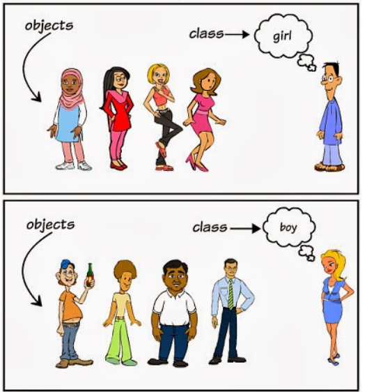
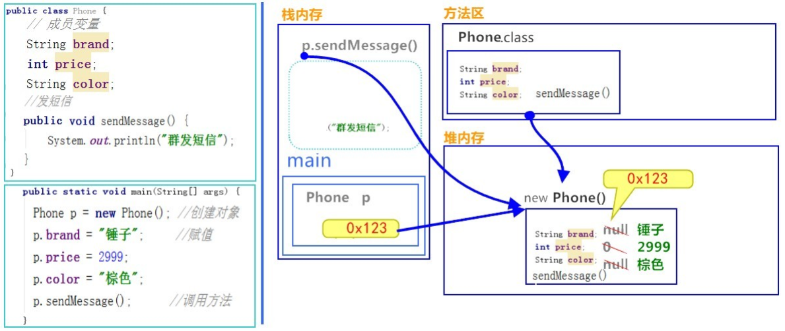
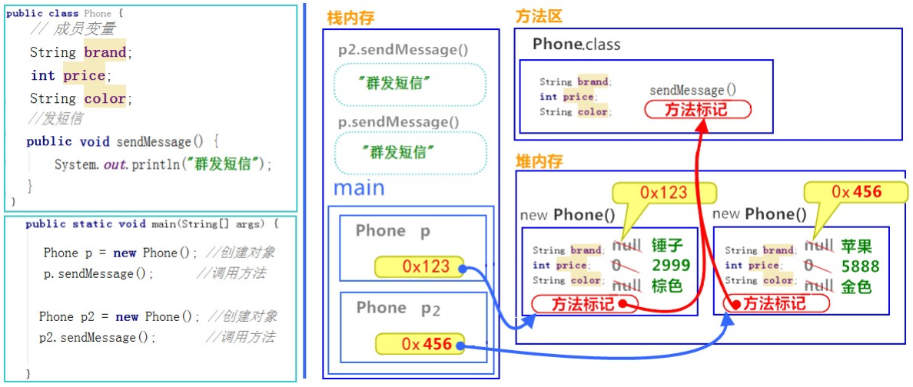
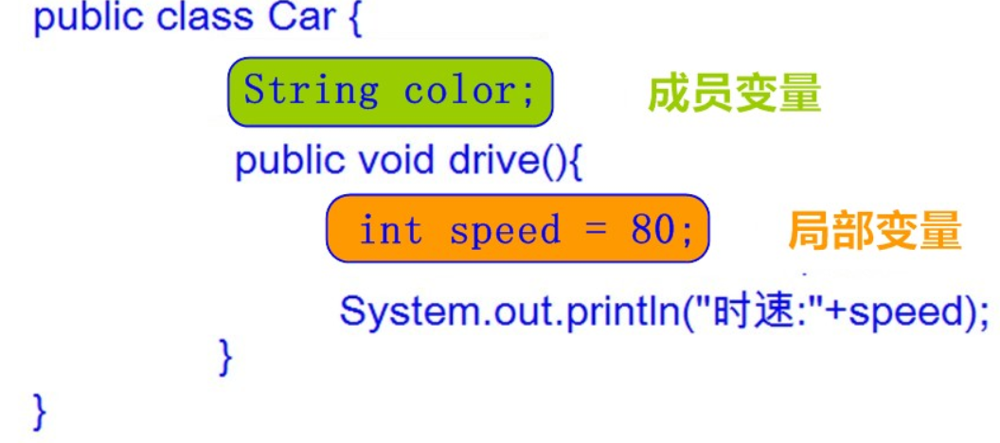
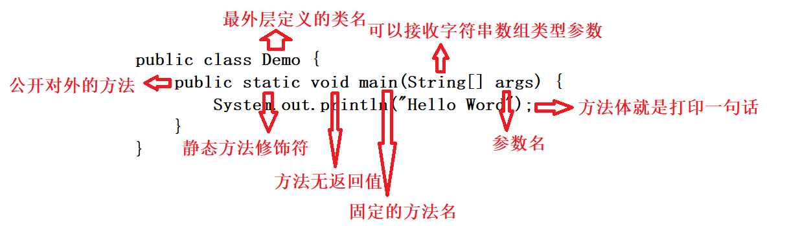
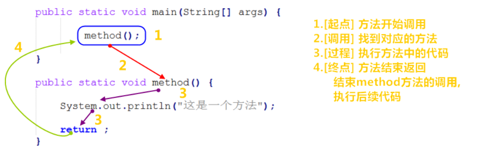
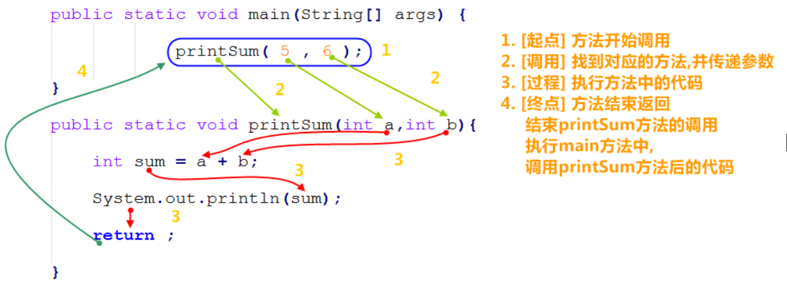
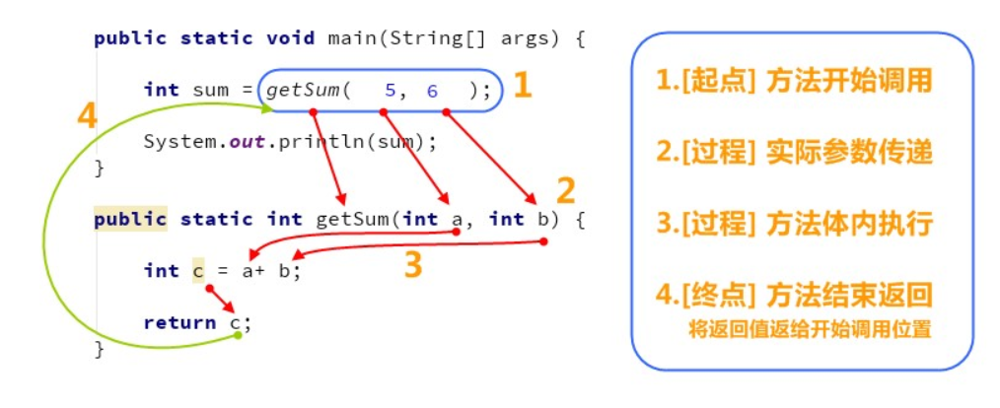
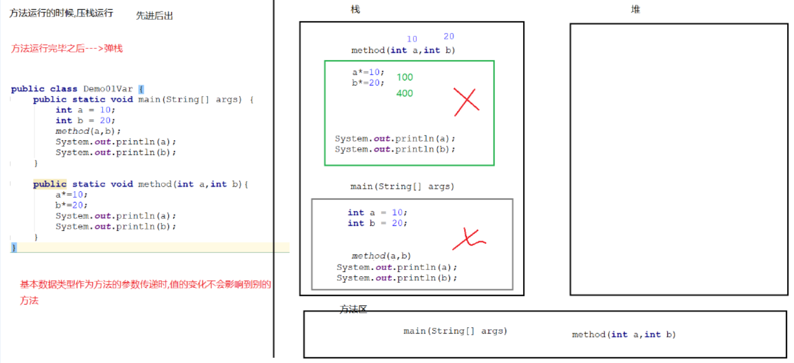

# 学习目标

```
1、理解Java面向对象的思想
2、掌握类与对象的定义和使用
3、掌握成员变量与局部变量的区别
4、掌握方法的定义与使用
5、掌握方法的参数传递
6、掌握方法重载的定义与使用
```


# 第1章 面向对象思想

## 1.1 面向对象思想介绍

Java语言是一种面向对象的程序设计语言，而面向对象思想是一种程序设计思想，我们在面向对象思想的指引下，使用Java语言去设计、开发计算机程序。
这里的**对象**泛指现实中一切事物，每种事物都具备自己的**属性**和**行为**。面向对象思想就是在计算机程序设计过程中，参照现实中事物，将事物的属性特征、行为特征抽象出来，描述成计算机事件的设计思想。
它区别于面向过程思想，强调的是通过调用对象的行为来实现功能，而不是自己一步一步的去操作实现。

```
面向对象思想总结:
    1.面向过程:当要实现一个功能时,需要亲力亲为,处理每个细节
    2.面向对象:当要实现一个功能时,不关心具体的实现步骤,只关心结果,找一个具有该功能的类,帮我们做事
    3.面向对象的思想
        (1)面向对象是基于面向过程的编程思想.
        (2)面向过程:强调的是每一个功能的步骤
        (3)面向对象:强调的是对象,然后由对象去调用功能
    4.特点
        (1)是一种更符合我们思考习惯的思想
        (2)可以将复杂的事情简单化
        (3)角色发生了转换,将我们从执行者变成了指挥者
```

## 1.2 面向对象举例说明

**洗衣服:**

* 面向过程：把衣服脱下来-->找一个盆-->放点洗衣粉-->加点水-->浸泡10分钟-->揉一揉-->清洗衣服-->拧干-->晾起来
* 面向对象：把衣服脱下来-->打开全自动洗衣机-->扔衣服-->按钮-->晾起来

**区别:**

* 面向过程：强调步骤。


* 面向对象：强调对象，这里的对象就是洗衣机。

**特点：**

面向对象思想是一种更符合我们思考习惯的思想，它可以将复杂的事情简单化，并将我们从执行者变成了指挥者。面向对象的语言中，包含了三大基本特征，即封装、继承和多态。


## 1.3 类和对象引入

环顾周围，你会发现很多对象，比如桌子，椅子，同学，老师等。桌椅属于办公用品类，师生都是人类。那么什么是类呢？什么是对象呢？

### 1.3.1 什么是类

* **类**：是一组具有类似**属性和行为**的集合。可以看成是一类事物的模板，使用事物的属性特征和行为特征来描述该类事物。

现实中，描述一类事物：

* **属性**：就是该事物的状态信息。
* **行为**：就是该事物能够做什么。

举例：人类。

```
属性：名字、年龄、性别、身高等等。
行为：吃饭、睡觉、工作等等。
```

### 1.3.2 什么是对象

* **对象**：是一类事物的具体体现。对象是类的一个**实例**（对象并不是找个女朋友），必然具备该类事物的属性和行为。

现实中，一类事物的一个实例：一个人。

举例：一个人。

```
属性：张三丰、120、男、175。
行为：吃饭、睡觉、练武。
```


### 1.3.3 类与对象的关系

- 类是对一类事物的描述，是**抽象的**。

- 对象是一类事物的实例，是**具体的**。

- **类是对象的模板，对象是类的实体**。

  

下图中**男孩（boy）**、**女孩（girl）**为**类（class）**，而具体的每个人为该类的**对象（object）：**




# 第2章 类与对象

在Java语言中，参考现实世界的类与对象并以面向对象的思想进行了语言设计，把一些事物按类划分，再以对象的形式进行管理。

## 2.1 类的定义

**语法：**

```java
访问权限修饰符 class 类名 {
   //成员变量   属性特征
   //成员方法   行为特性
}
```

**说明：**

* **定义类**：就是对业务或者现实中的某一实实在在的分类物以Java语言中的类进行定义并分类管理，参考现实类有属性和行为两个关键特征，所以Java中的类也包括属性和行为。
* **访问权限修饰符：**就是Java中控制当前类是否可见，被谁可见的关键字，包括有public、protected、default  、private（具体功能后续会进行说明），通常类的权限修饰符都为public。
* **class：**定义Java类的关键字。
* **类名：**就是我们要创建具体的什么类，给取个见名知意名字。比如，学生类Student、老师类Teacher等。
* **成员变量：**和以前定义变量几乎是一样的（可以类比现实对象的属性）。只不过位置发生了改变。在类中，方法外。
* **成员方法**：可以类比显示对象的行为动作，描述了此类的所有对象可以有什么行为，以及怎么行动（之前的main()方法就是一个例子）。


**示例：**

```java
public class Student {
  	// 成员变量
  	String username;//姓名
    int age; //年龄

    //成员方法
    //学习的方法
    public static void study() {
       System.out.println("好好学习，天天向上");
    }
    // 跑步的方法
    public void run(String username,int distance) {
       System.out.println(username+" 今天跑了"+distance+"m");
    }
}
```


## 2.2 对象的创建

Java类有了，但还只是一个抽象的概念的东西，如果要使用，必须创造出一个个具体的对象。

**语法：**

```
类名 对象名 = new 类名();
```

目前，Java中只要是创建类对象，就使用到new关键字即可。


**使用对象访问类中的成员:**

```
对象名.成员变量；
对象名.成员方法()；
```

**示例：**

```
public class StudentTest {
  public static void main(String[] args) {
    // 创建对象格式：类名 对象名 = new 类名();
    Student s = new Student();
    System.out.println(s); //com.hopu.classobject.Student@15db9742
  }	
}
```


**对象的创建及基本使用：**

```java
public class StudentTest {
	  public static void main(String[] args) {
	    // 创建对象格式：类名 对象名 = new 类名();
	    Student s = new Student();
	    System.out.println(s); //com.hopu.classobject.Student@15db9742

	    // 直接输出成员变量值
	    System.out.println("姓名："+s.username); //null
	    System.out.println("年龄："+s.age); //0
	    System.out.println("----------");

	    //给成员变量赋值
	    s.username = "佐佐木希";
	    s.age = 32;

	    // 再次输出成员变量的值
	    System.out.println("姓名："+s.username); //佐佐木希
	    System.out.println("年龄："+s.age); //32
	    System.out.println("----------");

	    // 调用成员方法
	    s.study(); // "好好学习，天天向上"
	    s.run("tom",123); // 跑步
	  }	
}
```


从上面的示例结果可以看出，对象创建后直接输出对象的成员变量没有报错，有一些默认初始化值。具体见如下表，这个与之前讲解的数组的默认初始化值是一样的。

|          | 数据类型                       | 默认值   |
| -------- | ------------------------------ | -------- |
| 基本类型 | 整数（byte，short，int，long） | 0        |
|          | 浮点数（float，double）        | 0.0      |
|          | 字符（char）                   | '\u0000' |
|          | 布尔（boolean）                | false    |
| 引用类型 | 数组，类，接口                 | null     |


## 2.3 类与对象练习

定义手机类：

```java
public class Phone {
  // 成员变量
  String brand; //品牌
  int price; //价格
  String color; //颜色

  // 成员方法
  //打电话
  public void call(String name) {
    System.out.println("给"+name+"打电话");
  }

  //发短信
  public void sendMessage() {
    System.out.println("群发短信");
  }
}
```

定义测试类：

```java
public class PhoneTest {
  public static void main(String[] args) {
    //创建对象
    Phone p = new Phone();

    //输出成员变量值
    System.out.println("品牌："+p.brand);//null
    System.out.println("价格："+p.price);//0
    System.out.println("颜色："+p.color);//null
    System.out.println("------------");

    //给成员变量赋值
    p.brand = "锤子";
    p.price = 2999;
    p.color = "棕色";

    //再次输出成员变量值
    System.out.println("品牌："+p.brand);//锤子
    System.out.println("价格："+p.price);//2999
    System.out.println("颜色："+p.color);//棕色
    System.out.println("------------");

    //调用成员方法
    p.call("紫霞");
    p.sendMessage();
  }
}
```


## 2.4 对象内存分析

**1、一个对象，调用一个方法内存图：** 




> 通过上图，我们可以理解，在栈内存中运行的方法，遵循"先进后出，后进先出"的原则。变量p指向堆内存中的空间，寻找方法信息，去执行该方法。
>
> 但是，这里依然有问题存在。创建多个对象时，如果每个对象内部都保存一份方法信息，这就非常浪费内存了，因为所有对象的方法信息都是一样的。那么如何解决这个问题呢？请看如下图解。


**2、两个对象，调用同一方法内存图：**



> 对象调用方法时，根据对象中方法标记（地址值），去类中寻找方法信息。这样哪怕是多个对象，方法信息只保存一份，节约内存空间。

## 2.5 成员变量与局部变量

在前面介绍类的定义时，介绍了Java类中包括有成员变量与方法两个核心部分。而Java中变量根据定义**位置的不同**，我们给变量起了不同的名字。如下图所示：



**说明：**

- 在类中的位置不同 `重点` 
  - 成员变量：类中，方法外
  - 局部变量：方法中或者方法声明上(形式参数)
- 作用范围不一样 `重点` 
  - 成员变量：类中
  - 局部变量：方法中
- 初始化值的不同 `重点` 
  - 成员变量：有默认值
  - 局部变量：没有默认值。必须先定义，赋值，最后使用
- 在内存中的位置不同 `了解` 
  - 成员变量：堆内存
  - 局部变量：栈内存
- 生命周期不同 `了解` 
  - 成员变量：随着对象的创建而存在，随着对象的消失而消失
  - 局部变量：随着方法的调用而存在，随着方法的调用完毕而消失


**总结：**

```
局部变量和成员变量的区别
1.在类中的位置不同【重点】
	成员变量：类中，方法外
	局部变量：方法中或者方法声明上(形式参数)
2.在内存中的位置不同（了解）
	成员变量：堆内存
	局部变量：栈内存
3.生命周期不同（了解）
	成员变量：随着对象的创建而存在，随着对象的消失而消失
	局部变量：随着方法的调用而存在，随着方法的调用完毕而消失
4.初始化值的不同【重点】
	成员变量：有默认值
	局部变量：没有默认值。必须先定义，赋值，最后使用
5.作用范围不一样【重点】
	成员变量：类中
	局部变量：方法中
```


# 第3章 方法

## 3.1 方法概述

### 3.1.1 Java方法引入

我们在学习运算符的时候，都为每个运算符单独的创建一个新的类和main方法，我们会发现这样编写代码非常的繁琐，而且重复的代码过多。能否避免这些重复的代码呢，就需要使用方法来实现。

同时，结合前面介绍的Java语言面向对象的设计思想，一个类中会包括有行为，而这个行为就是一个动态的实现，因此，也可以使用方法来实现。

- **方法：**就是将具有**独立功能**的代码块组织成为一个整体，使其具有特殊功能的代码集。

当需要这个功能的时候，就可以去调用。这样即实现了代码的复用性，也解决了代码冗余的现象，同时还封装了一个类应有的行为特性。


### 3.1.2 方法定义

**语法：**

```
访问权限修饰符 静态修饰符 返回值类型 方法名（参数类型 参数名,参数类型 参数名...）｛
    执行代码...	
   	return 返回语句;
｝
```

**说明：**

- **访问权限修饰符：** 与之前类定义时使用的权限修饰符类似，指定方法的可用范围。
- **静态修饰符：**定义了该方法可以被如何访问，其关键字为static（静态的意思）。如果方法前有static关键字，不用创建类对象直接使用类就可以直接访问；如果没有static关键字，必须创建出具体的对象，使用对象才能访问该方法。
- **返回值类型：** 方法执行完成后的返回结果类型。如果方法没有返回值，使用 `void`关键字即可；如果有返回值，要根据返回值的类型来确定，是什么返回值类型就用什么类型。
- **方法名：**为我们定义的方法起名，满足标识符的规范，用来调用方法。
- **参数类型：** 定义的方法可能需要传递一个动态的数据，可以用方法参数进行接收。其中，参数类型表示限定了当前方法允许接收的参数类型。
- **参数名：**与参数类型是一一对应的，用来接收调用方法时传递的参数值。参数类型与参数名统称为参数列表，多个参数列表直接可以用逗号“，”分隔。
- **执行代码：**就是一个方法里面具体干的事。
- **return：**方法中的执行代码执行后要返回的结果。如果有返回值，就用“return 返回的结果”来表示；如果没有要返回的结果，可以直接用一个return关键字即可，甚至可以省略。


**示例：**

```java
public class MethodTest {
	//1、普通无参、无返回值方法
	public void print() {
		System.out.println("这是一个普通的无参、无返回值方法");
		return;  // 无返回值方法，return关键字可以省略
	}
	// 2、普通有参、无返回值方法
	public void printSum(int a,int b) {
		int sum=a+b;
		System.out.println(a+"与"+"b的和为："+sum);
	}
	// 3、普通有参数、有返回值的方法
	public int getMax(int a,int b) {
		int max=a>b ? a : b;
		return max;
	}
	// 4、静态有参数、有返回值的方法
	public int getAbs(int a) {
		if(a<0) {
			return -a;
		}else {
			return a;
		}
	}
}
```

### 3.1.3 方法练习

**1、定义一个无参无返回值的方法**

- **需求：**定义一个普通方法，方法中打印“hello world”语句。
- **实现：**

```java
public class MethodTest2 {
	public void print() {
		System.out.println("hello world");
	}
}
```


**2、定义一个静态有参有返回值的方法**

- **需求：**定义一个静态方法，接收两个int类型参数，通过该方法实现求a的n次方，并返回结果（这里只计算a和n为正整数即可）。
- **实现：**

```java
	// 2、静态有参有返回值方法
	public static int pow(int a,int n) {
		int result=1;
		for (int i = 0; i < n; i++) {
			result*=a;
		}
		return result;
	}
```


### 3.1.4 定义方法的注意事项

- **方法不能嵌套定义**

方法只能定义在类中，不支持在方法中再嵌套定义方法。

```
public class MethodDemo {
    public static void main(String[] args) {

    }
    public static void methodOne() {
		public static void methodTwo() {
       		// 这里会引发编译错误!!!
    	}
    }
}
```

- **返回值类型，必须要和`return`语句返回的类型相同或者比返回值类型范围小，否则编译失败 。**

```
// 返回值类型要求是int
public static int getSum() {
    return 5;// 正确，int类型
    return 1.2;// 错误，类型不匹配
    return true;// 错误，类型不匹配
}
```

- **不能在`return` 后面写代码，`return` 意味着方法结束，所有后面的代码永远不会执行，属于无效代码。**

```
public static int getSum(int a,int b) {
  	return a + b;
  	System.out.println("Hello World");// 错误，return已经结束，这里不会执行，无效代码
}
```

- **void表示无返回值，可以省略return，也可以单独的书写return，后面不加数据**

```
public class MethodDemo {
    public static void main(String[] args) {

    }
    public static void methodTwo() {
        return;	 // 也可以省略return，后续不能编写其他代码
    }
}
```


## 3.2 main()方法详解

在Java中，main()方法是Java应用程序的入口方法，也就是说，程序在运行的时候，第一个执行的方法就是main()方法，这个方法和其他的方法有很大的不同，比如方法的名字必须是main，方法必须是public static void 类型的，方法必须接收一个字符串数组的参数等等。

**main方法的定义格式通常固定如下：**

```java
public class Demo {
	public static void main(String[] args) {
		System.out.println("Hello Word");
	}
}
```

**图解：**



**说明：**

- **为什么是公共的（public）**

  Java设计了几个访问修饰符，包括：private、default 、protected、public。 在Java中声明为public的任何方法或变量都可以从该类的外部访问。 而JVM访问main方法显然不是在类的内部访问，因此main方法需要定义为public的方法。

- **为什么是静态的（static）**

  静态可以让JVM调用main方法的时候更加方便，不需要通过对象调用。关于static关键字我们知道的是，static关键字修饰的方法，可以不用通过创建一个实例去访问，而是可以通过类名直接访问。并且static修饰的方法以及变量存储在虚拟机当中的方法区当中，而非堆内存当中。那么，对于虚拟机来说也是一样的道理。main方法定义为static的，则对于虚拟机来说，在程序启动之后并不需要创建一个实例，就可以去调用这个main方法。

- **为什么没有返回值（void）**

  void表示main方法没有返回值，没有返回值的原因是因为Java不需要main方法向操作系统返回退出信息。如果main方法正常退出，那么Java应用层序的退出代码为0，表示成功的运行了程序。

- **main**

  main的名称不能变是为了JVM能够识别程序运行的起点，main方法可以被重载，重载的main方法不会被执行。main方法作为程序初始线程的起点，任何其他线程均由该线程启动。JVM内部有两种线程，非守护线程和守护线程，main方法属于非守护线程，守护线程通常由JVM自己使用，Java程序也可以表明自己的线程是守护线程。当程序中所有的非守护线程终止时，JVM退出。也可以用Runtime类或者System.exit()来退出。

- **String [] args**

  String[] args,是main方法中唯一可以改变的地方！args是arguments的缩写，只是一个变量默认名，习惯性写作它，但是也可以改变的，只要符合命名规则随便你写成什么。在使用集成开发工具的今天，String[] args更像是一种摆设了，很多初学者都不知道它的作用，其实它是程序运行传入的一个参数组。


## 3.3 方法调用

上面小节，只是在在类中定义了各种类型的方法，但是没法执行并查看效果，因此，这里需要进一步解释方法的调用。

### 3.3.1 方法调用基本介绍

方法在前面介绍过，其实就是类的一个行为，所以，要调用具体的一个行为，就需要说明执行哪个具体对象的方法。因此，标准的方法调用，应该是先创建对象，然后使用对象来调用具体的方法。

**示例：**

```
// 先创建具体的Student对象
Student s = new Student();
// 接着，使用对象来调用具体方法
s.run("tom",123);
```

**注意：**

在前面介绍了，我们在定义方法时可以使用static关键字将方法定义为静态方法（关于static关键字后面会详细说明），此时，如果再要调用类中的方法，可以省略创建对象的步骤，直接用类名调用即可。

```
// 对于类中的static静态方法，直接使用类名调用即可
Student.study();
```


下面几个小节中，为了方便不同参数、返回值的方法调用的演示讲解，我们就直接默认在当前类中定义的static静态方法进行说明，如果是其他类中的普通方法，则需要提前创建对象，然后使用对象调用方法。

### 3.3.2 无参无返回值的方法调用

**调用格式：**

- 不同类的方法调用

```
对象名.普通方法名();
类名.静态方法名();
```

- 同类方法方法调用

```
this.方法名();   // this关键字可以省略
```

**示例：**

```
// 1、调用其他类的具体方法
Student s = new Student();
s.run("tom",123);
Student.study();

// 2、调用本类中的相关方法
method();
```

**图解：**

```java
public static void main(String[] args) {
    //调用定义的方法method
    method();
}
//定义方法，被main方法调用
public static void method() {
  	System.out.println("这是一个方法");
}
```



**总结：**每个方法在被调用执行的时候，都会进入栈内存，并且拥有自己独立的内存空间，方法内部代码调用完毕之后，会从栈内存中弹栈消失。


### 3.3.3 有参无返回值的方法调用

**调用格式：**

- 不同类的方法调用

```
对象名.普通方法名(参数1,参数2)；
类名.静态方法名(参数1,参数2);
```

- 同类方法方法调用

```
this.方法名(参数1,参数2);   // this关键字可以省略
```

**示例：**

```
printSum(5,6);
```

**图解：**

```java
public static void main(String[] args) {
    //调用定义的方法method
    printSum(5,6);
}
//定义方法，被main方法调用
public static void printSum(int a,int b){
	int sum = a + b;
    System.out.println(sum);
}
```



### 3.3.4 有返回值的方法调用

**调用格式：**

```
数据类型 变量名 = 方法名 ( 参数 ) ;
```

**示例：**

```
int result = getSum(5,6);
```

**注意：**

方法的返回值通常会使用变量接收，否则该返回值将无意义。

**图解：**




## 3.4 方法的参数传递

可以理解当我们要调用一个方法时，我们会把指定的数值，传递给方法中的参数，这样方法中的参数就拥有了这个指定的值，可以使用该值，在方法中运算了。这种传递方式，我们称为参数传递。

- 在这里，定义方法时，参数列表中的变量，我们称为形式参数
- 调用方法时，传入给方法的数值，我们称为实际参数


### 3.4.1 基本数据类型作为方法参数

**示例：**

```java
public class Demo01Args {
	public staticvoid main(String[] args) {
		// 定义变量
		inta = 10;
		intb = 20;
		System.out.println("a:" + a + ",b:" + b);// a:10,b:20
		change(a, b);
		System.out.println("a:" + a + ",b:" + b);// a:10,b:20
	}

	public static void change(int a, int b) { // a=10,b=20
		System.out.println("a:" + a + ",b:" + b);// a:10,b:20
		a *= 10; // a=100;
		b *= 10;// b=200;
		System.out.println("a:" + a + ",b:" + b);// a:100,b:200
	}
}
```

**注意：**形式参数的改变不影响实际参数。

**图解：**




### 3.4.2 引用数据类型作为方法参数

**示例：**

```java
public class Demo02Args {
	public static void main(String[] args) {
		// 定义数组
		int[] arr = { 10, 20};
		System.out.println(arr[0]);
        System.out.println(arr[1]);
		System.out.println("----------------");
		change(arr);
		System.out.println(arr[0]);
        System.out.println(arr[1]);
	}

	public static void change(int[] arr) {
		arr[0] = arr[0]*10;
        arr[1] = arr[1]*10;
	}
}
```

**注意：**引用类型，作为方法参数，形式参数的改变会影响实际参数。

**图解：**


# 第4章 方法重载

## 4.1 重载概念

- **方法重载**：指在同一个类中，允许存在一个以上的同名方法，只要它们的参数列表不同即可，与修饰符和返回值类型无关。
  - 多个方法在同一个类中
  - 多个方法具有相同的方法名
  - 多个方法的参数不相同，类型不同或者数量不同
- **注意**
  - 参数列表：个数不同，数据类型不同，顺序不同。
  - 重载方法调用：JVM通过方法的参数列表，调用不同的方法。


**练习：判断哪些方法是重载关系。**

```
public static void method(){}
public static void method(int a){}
static void method(int a,int b){}
public static void method(double a,int b){}
public static void method(int a,double b){}
public void method(int i,double d){}
public void method(){}
public static void method(int i,int j){}
```


## 4.2 方法重载练习

- **需求：**在一个类中定义三个方法，一个方法接收2个int类型的参数并返回求和结果；一个方法接收2个double类型并直接打印求和结果；一个方法接收3个int类型的参数并返回求和结果。 
- **代码：** 

```java
public class MethodOverloadTest {
	// 1、2个int类型参数的方法求和
	public int getSum(int a,int b) {
		return a+b;
	}
	// 2、2个double类型参数的方法求和
	public void getSum(double a,double b) {
		System.out.println(a+b);
	}
	// 2、3个int类型参数的方法求和
	public int getSum(int a,int b,int c) {
		return a+b+c;
	}
}
```


