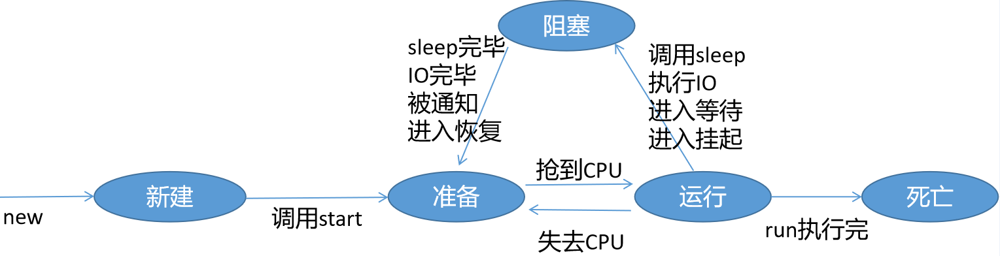

# 学习目标
```
1. 线程基本概念
2. 线程的实现
3. 线程的生命周期
4. 线程安全问题
5. synchronized和Lock
6. ThreadLocal
7. 乐观锁和悲观锁
8. 原子类
9. 生产者和消费者模式
10.阻塞队列
11.线程池
```


# 线程基本概念

## 进程和线程

- 进程：正在运行的程序，需要内存和CPU资源进行运算执行，
  一个程序包含一个或多个进程
- 线程：是进程的组成单元，一个进程包含一个或多个线程，每个线程负责单独执行一个任务

## 进程和线程的区别

1. 一个进程包含一个或多个线程
2. 每个进程都有自己独立的内存空间，线程没有自己独立的内存空间，线程共享所在进程的内存空间
3. 进程是重量级的单元，需要系统资源比较多，线程是轻量级单元，需要资源比较少

## 多进程和多线程

- 多进程是操作系统可以同时运行多个进程。一个CPU内核一个时间只能执行一个进程，CPU会在多个进程之间进行来回切换，因为速度特别快，用户感觉不到。
- 多线程是一个进程里面有多个线程，CPU执行进程时会来回切换里面所有的线程，每个线程会分配到一定的CPU的执行时间（CPU时间片）

## 多线程的应用场景

- JAVAEE企业级开发：大量的用户需要同时访问网站的服务器，如：双十一、秒杀等。如果服务器只有一个线程，多个用户需要排队和服务器通信，效率非常低；多线程就是一个用户连接服务器后，服务器就会开一个新线程负责用户的通信，用户之间就不会相互影响。
- 游戏开发：同时进行网络通信、游戏角色控制、图形绘制等操作，必须每个用一个线程执行。

## 并行和并发

- 并发：一个CPU在多个线程之间快速切换，达到同时执行多个任务的目的
- 并行：多个CPU可以同时执行一个进程中的多个线程

# 线程的实现

## 继承Thread类

1. 继承Thread类
2. 重写run方法
3. 创建线程对象，调用start方法

```
/**
 * 自定义线程类
 * @author xray
 *
 */
public class MyThread extends Thread{

	/**
	 * 执行线程任务的方法
	 */
	public void run(){
		//Thread.currentThread()是获得系统当前执行的线程
		System.out.println(Thread.currentThread().getName()+"线程执行了！！！");
	}
	
	public static void main(String[] args) {
		//主线程中执行
		System.out.println(Thread.currentThread().getName()+"线程执行了！！！");
		//创建线程对象
		MyThread thread1 = new MyThread();
		MyThread thread2 = new MyThread();
		//启动线程
		thread1.start();
		thread2.start();
	}
}

```

## 实现Runnable接口

1. 实现Runnable接口
2. 实现run方法
3. 创建自定义线程对象，作为参数传入Thread对象
4. 调用start方法

```
/**
 * 自定义线程类
 * @author xray
 *
 */
public class MyRunnable implements Runnable{

	/**
	 * 实现run方法
	 */
	@Override
	public void run() {
		System.out.println("当前执行的线程是："+Thread.currentThread().getName());
	}
	
	
	public static void main(String[] args) {
		//创建Thread对象，传入Runnable对象
		Thread thread1 = new Thread(new MyRunnable());
		//调用start方法
		thread1.start();
		//使用匿名内部类实现Runnable
		Thread thread2 = new Thread(new Runnable(){
			@Override
			public void run() {
				System.out.println("匿名内部类，当前执行的线程是："+Thread.currentThread().getName());
			}
		});
		thread2.start();
		//使用Lambda实现Runnable
		Thread thread3 = new Thread(()->{
			System.out.println("Lambda，当前执行的线程是："+Thread.currentThread().getName());
			});
		thread3.start();
	}

}
```

## 实现Callable接口

前面两种方法都不能返回结果，Callable的方法可以返回值

1. 实现Callable接口，实现call方法
2. 创建FutureTask对象，传入Callable对象
3. 创建Thread对象，传入FutureTask对象
4. 调用Thread对象的start方法
5. 调用FutureTask对象的get方法，获得返回值

```
/**
 * Callable的实现类
 * @author xray
 *
 */
public class MyCallable implements Callable<Long>{

	@Override
	public Long call() throws Exception {
		System.out.println("执行call的线程是："+Thread.currentThread().getName());
		//模拟执行耗时运算
		Long sum = 0L;
		for(int i = 0;i < 100000000L;i++){
			sum += i;
		}
		//返回结果
		return sum;
	}
	
	
	public static void main(String[] args) {
		//创建FutureTask对象，传入Callable对象
		FutureTask<Long> task = new FutureTask<>(new MyCallable());
		//创建Thread，传入FutureTask对象
		Thread thread = new Thread(task);
		//启动线程
		thread.start();
		//获得结果
		try {
//			long result = task.get();
			long result = task.get(5,TimeUnit.SECONDS);
			System.out.println("获得计算结果："+result);
		} catch (InterruptedException e) {
			e.printStackTrace();
		} catch (ExecutionException e) {
			e.printStackTrace();
		} catch (TimeoutException e) {
			e.printStackTrace();
		}
	}
}

```

# 线程的生命周期

1. 新建
   线程new出来，没有调用start方法，CPU没有分配时间片
2. 就绪
   线程调用了start方法，CPU准备分配时间片，但是没有真正分配
3. 运行
   线程抢到了CPU，开始执行run方法
4. 阻塞<br>
   进入阻塞状态：
   - 调用sleep方法
   - 线程的锁调用wait方法
   - 调用suspend（挂起）方法
   - 流的IO操作<br>
     从阻塞恢复：
   - sleep的时间完毕
   - 锁调用notify或notifyAll方法
   - 调用resume（恢复）方法
   - IO操作完毕

阻塞状态结束后，回到就绪状态

5. 死亡,run方法执行完毕后线程进入死亡状态




# 线程安全问题

## 什么是线程安全问题

多个线程同时访问同一个资源(变量、对象、文件等)时就可能出现线程安全问题。

多个线程执行时是抢占式的，一个线程在执行一个操作时（调用方法，更新变量），可能会被其他线程打断，导致操作没有完全完成，可能会造成数据出现不一致的情况。

## 线程安全问题案例
银行转账

```
/**
 * 银行类
 * @author xray
 *
 */
public class Bank {

	//模拟100个账户的余额
	int[] accounts = new int[100];
	
	//初始化每个余额为1000
	{
		for(int i = 0;i < accounts.length;i++){
			accounts[i] = 1000;
		}
	}
	
	/**
	 * 统计总余额
	 * @return
	 */
	public int getTotalAccounts(){
		int sum = 0;
		for(int i = 0;i < accounts.length;i++){
			sum += accounts[i];
		}
		return sum;
	}
	
	/**
	 * 转账
	 * @param from 转出账户
	 * @param to 转入账户
	 * @param money 金额
	 */
	public void transfer(int from,int to,int money){
		//转出金额
		accounts[from] -= money;
		System.out.printf("从%d转出%d到%d%n",from,money,to);
		//转入金额
		accounts[to] += money;
		//输出总金额
		System.out.println("银行的总金额是："+getTotalAccounts());
	}
}

public class TestBank {

	public static void main(String[] args) {
		Random random = new Random();
		Bank bank = new Bank();
		//模拟100次转账
		for(int i = 0;i < 100;i++){
			//每次转账用新线程执行
			new Thread(()->{				
				//产生转出和转入账户的下标
				int from = random.nextInt(bank.accounts.length);
				int to = random.nextInt(bank.accounts.length);
				//随机金额
				int money = 100+random.nextInt(500);
				//转账
				bank.transfer(from, to, money);
			}).start();
		}
	}
}
```

执行效果：

```
账户88向账户90转了142,银行现在的总金额是：98322
账户21向账户27转了61,银行现在的总金额是：98383
账户88向账户23转了150,银行现在的总金额是：98533
账户33向账户45转了128,银行现在的总金额是：97910
账户95向账户34转了92,银行现在的总金额是：98002
....
```
原因分析

多个线程同时执行transfer方法，一个线程执行转出金额代码，还没执行转入金额，就被其他线程抢占执行了，这样其它线程调用getTotalAccounts方法进行统计时金额就少了。

线程同步问题的解决方法

线程同步问题可以通过上锁机制解决，主要是将资源上锁，让线程将业务完整的完成，不让其他线程介入。

## 锁机制

1、同步代码块

```
synchronized(锁对象){
    需要同步执行的代码
}
```

注意：任何对象都可以作为锁，必须是成员变量<br>
原理：一旦线程进入了该代码块，就持有锁，JVM会有监视器监视进入锁的线程，其它线程想进入代码，监视器会拒绝访问；一旦持有锁的线程执行代码完毕，锁就被释放，其它线程就可以进入。<br>

使用同步块修改transfer方法：

```
	public void transfer(int from,int to,int money){
		synchronized(this){
			//转出金额
			accounts[from] -= money;
			System.out.printf("从%d转出%d到%d%n",from,money,to);
			//转入金额
			accounts[to] += money;
			//输出总金额
			System.out.println("银行的总金额是："+getTotalAccount());
		}
	}
```

执行效果：

```
从93转出198到31 银行的总金额是：100000
从5转出164到57  银行的总金额是：100000
从83转出62到57  银行的总金额是：100000
从22转出58到3   银行的总金额是：100000
```

2、同步方法

```
public synchronized 返回值 方法名(参数..){
    方法的代码
}
```

同步块和同步方法的区别：

1. 同步块可以控制代码的范围，同步方法是整个方法上锁
2. 同步块可以将任意的成员变量作为锁，同步方法只能以this作为锁
3. 同步块的性能高于同步方法

使用同步方法修改transfer方法：

```
    public synchronized void transfer(int from,int to,int money){
		//转出金额
		accounts[from] -= money;
		System.out.printf("从%d转出%d到%d%n",from,money,to);
		//转入金额
		accounts[to] += money;
		//输出总金额
		System.out.println("银行的总金额是："+getTotalAccount());
	}
```

3、同步锁

Java1.5后出现的Lock包括：

- ReentrantLock 	重入锁，控制线程进入
- ReadLock		      读锁，控制线程读取
- WriteLock		     写锁，控制线程写入
- ReadWriteLock	读写锁，控制线程读写

用法：

```
    锁对象.lock();
    try{
        需要同步的代码
    }finally{
        锁对象.unlock();
    }
```

注意：锁对象不能是局部变量

使用同步锁修改transfer方法：

```
	//同步锁对象
	private ReentrantLock lock = new ReentrantLock();
	public void transfer(int from,int to,int money){
		//同步锁上锁
		lock.lock();
		try{
			//转出金额
			accounts[from] -= money;
			System.out.printf("从%d转出%d到%d%n",from,money,to);
			//转入金额
			accounts[to] += money;
			//输出总金额
			System.out.println("银行的总金额是："+getTotalAccount());
		}finally{
			//释放锁
			lock.unlock();
		}
	}

```

三种上锁机制的总结：

1. 同步块和同步方法出现早，同步锁在1.5后出现
2. 性能：同步锁 > 同步块 > 同步方法
3. 同步锁提供了大量的方法，也可以if配合使用，更加灵活

# ThreadLocal

ThreadLocal是实现线程同步的另外一种解决方案。
ThreadLocal对比锁机制：
- 锁机制是以时间换空间，让多个线程依次访问一个资源。
- ThreadLocal是以空间换时间，每个线程拥有资源的一个副本，不会相互影响。

ThreadLocal类常用方法：

- get			     获得线程局部变量中的值
- set			     设置值
- remove		 删除值
- initialValue	给值进行初始化

```
	//定义普通的变量
	private static int num1 = 0;
	//定义线程局部变量
	private static ThreadLocal<Integer> local = new ThreadLocal<Integer>(){
		//重写initialValue方法，如果不重写初始值为null
		protected Integer initialValue() {
			//返回初始值
			return new Integer(0);
		}
	};
	
	public static void main(String[] args) {
		//创建十个线程
		for(int i = 0;i < 10;i++){
			new Thread(new Runnable(){
				@Override
				public void run() {
					num1++;//分别修改普通变量
					System.out.println("普通变量="+num1);
					//修改线程局部变量的值
					local.set(local.get() + 1);
					System.out.println("线程局部变量="+local.get());
				}
			}).start();
		}
	}
```
执行结果：普通变量从1增长到10，线程局部变量一直是1

# 乐观锁和悲观锁

## 乐观锁和悲观锁的区别
- 悲观锁
想法悲观，认为当前的资源存在竞争，所以每次获得资源时都会上锁，阻塞住其它线程。
数据库中的行锁、表锁、读锁、写锁都属于悲观锁，Java的synchronized和ReentrantLock也属于悲观锁。
悲观锁会降低系统性能和吞吐量，提高数据的安全性，适用于多写少读的场景。
- 乐观锁
想法乐观，认为当前的资源不存在竞争，所以每次获得资源时都不上锁
乐观锁执行效率高，有利于提高系统吞吐量，适用于多读少写的场景。

## 乐观锁的实现
乐观锁常用的两种实现方式：
1. 版本号机制
   利用版本号version记录数据被修改的次数，当数据被修改时，version加一。当线程要更新数据值时，在读取数据的同时也会读取version值，在提交更新时，若刚才读取到的version值为当前version值相等时才更新，否则重试更新操作，直到更新成功。
2. CAS算法
   Compare and Swap（比较与交换）
   CAS涉及三个操作数：
   1. 读写变量的内存位置
   2. 预期值
   3. 写入的新值
   CAS实现过程是：先判断内存位置上的值是否和预期值一致，如果一致就修改为新值，否则不执行。

## 原子类

下面代码，启动10000个线程中对count执行自增,执行多次后发现，最后count的值出现9999或9997的结果。
```
static int count = 0;
public static void main(String[] args) {
	for(int i = 0;i < 10000;i++){
		new Thread(()->{count++;}).start();
	}
	try {
		Thread.sleep(1000);
	} catch (InterruptedException e) {
		e.printStackTrace();
	}
	System.out.println("count = " + count);
}
```
原因分析：
count++的操作分为三步：
1. 读取count的值
2. 计算count+1的值
3. 把新值存入count

假设count值为100，两个线程A和B都执行了操作1，再同时执行操作2，A先进行操作3，这时count值为101，B再执行操作3，之前B读取的值是100，执行完操作3后B的结果还是101，这样数据出现了问题。因为上面的操作不是原子的，可以分开执行。

java.util.concurrent包中的原子类就应用了CAS机制，以AtomicInteger（原子整数）为例。使用AtomicInteger的自增方法incrementAndGet无论执行多少次，结果都是10000

```
static AtomicInteger at = new AtomicInteger(0);
public static void main(String[] args) {
	for(int i = 0;i < 10000;i++){
		new Thread(()->{at.incrementAndGet();}).start();
	}
	try {
		Thread.sleep(1000);
	} catch (InterruptedException e) {
		e.printStackTrace();
	}
	System.out.println("count = " + at.get());
}	
```

AtomicInteger的incrementAndGet操作就是：通过内存偏移量offset将数据取出，和expected期待值进行比较，如果相等就代表此过程中没有其他线程修改此值，那么就把存储中的值修改掉，否则就放弃修改。

#  生产者消费者模式

在线程世界里，生产者就是生产数据的线程，消费者就是消费数据的线程。在多线程开发当中，如果生产者处理速度很快，而消费者处理速度很慢，那么生产者就必须等待消费者处理完，才能继续生产数据。同样的道理，如果消费者的处理能力大于生产者，那么消费者就必须等待生产者。为了解决这种生产消费能力不均衡的问题，所以便有了生产者和消费者模式。

## 线程的等待和通知

一旦线程进入同步块或同步方法，JVM会启动监视器监控线程的状态，线程都会持有锁，同步块持有是锁对象，同步方法的锁是this.

Object类的方法：

- void wait()		让持有锁的线程进入等待状态，直到被通知
- void wait(long time)	让线程等待，直到被通知或时间结束
- void notify()		随机选择一个等待的线程，进行通知
- void notifyAll()		通知所有等待的线程

注意：上面的方法只能是锁对象调用，否则出现异常IllegalMonitorStateException 

## 案例代码

以做包子为例，假设仓库里最多能放100个包子，这个保存包子的仓库可以看做缓冲区，生产者做好包子后会放到仓库里，消费者则会从仓库中取出包子吃掉，当生产者做包子太快，会把仓库装满，生产者就会等待；而消费者吃包子太快，仓库被取空了，消费者就会等待。

```
/**
 * 包子
 *
 */
public class Baozi {

	//包子编号
	private int id;
	public Baozi(int id){
		this.id = id;
	}
	
	public String toString(){
		return "包子#"+id;
	}
}

/**
 * 包子仓库
 * @author xray
 *
 */
public class BaoziStore {

	//最大数量
	public static final int MAX_NUM = 100;
	//包子集合
	private LinkedList<Baozi> baozis = new LinkedList<>();
	//锁对象
	private Object lock = new Object();
	
	/**
	 * 做包子
	 */
	public void makeBaozi(){
		//使用同步块
		synchronized (lock) {			
			//判断包子数量是否达到最大值
			if(baozis.size() == MAX_NUM){
				System.out.println("仓库满了，生产者等待："+Thread.currentThread().getName());
				try {
					//让生产者等待
					lock.wait();
				} catch (InterruptedException e) {
					e.printStackTrace();
				}
			}else{
				//如果仓库还有空间，让生产者继续生产
				System.out.println("仓库有空了，生产者继续做包子："+Thread.currentThread().getName());
				lock.notifyAll();
			}
			//创建包子，添加到集合中
			Baozi baozi = new Baozi(baozis.size());
			baozis.push(baozi);
			System.out.println(Thread.currentThread().getName()+"生产者，做了"+baozi);
		}
	}
	
	/**
	 * 吃包子
	 */
	public void takeBaozi(){
		synchronized (lock) {
			//判断如果仓库为空，就让消费者等待
			if(baozis.size() == 0){
				System.out.println("仓库空了，消费者等一下："+Thread.currentThread().getName());
				try {
					lock.wait();
				} catch (InterruptedException e) {
					e.printStackTrace();
				}
			}else{
				System.out.println("仓库有包子了，消费者快来："+Thread.currentThread().getName());
				//如果仓库有包子，就通知消费者来吃
				lock.notifyAll();
			}
			//从栈顶拿包子，然后删除掉
			if(baozis.size() > 0){
				Baozi baozi = baozis.pop();
				System.out.println(Thread.currentThread().getName()+"消费者吃掉了"+baozi);
			}
		}
	}
}

public class TestBaoziStore {

	public static void main(String[] args) {
		//仓库对象
		BaoziStore store = new BaoziStore();
		//创建生产者线程，生产100个包子
		Thread productor = new Thread(()->{
			for(int i = 0;i < 100;i++){
				store.makeBaozi();
			}
		});
		//启动生产者
		productor.start();
		//创建10个消费者，每个吃10个包子
		for(int i = 0;i < 10;i++){
			Thread consumer = new Thread(()->{
				for(int j = 0;j < 10;j++){
					store.takeBaozi();
				}
			});
			consumer.start();
		}
		
	}

}
```

上面的生产者消费者模式除了使用锁的等待和通知方式实现外，还可以使用阻塞队列，自动完成等待和通知功能。

# 阻塞队列

阻塞队列在java.util.concurrent（并发包）中，用于解决大并发量情况下，数据的生产和消费速度不一致问题。

## 阻塞队列主要API
主要API：

- BlockingQueue接口
  - void put(T t)	添加数据到末尾，队列满了会自动阻塞线程
  - T take()		从队列的头部取出数据并删除，队列空了会阻塞线程

BlockingQueue的主要实现类

- ArrayBlockingQueue	数组阻塞队列
- LinkedBlockingQueue	链表阻塞队列

## 案例代码

```
public class TestBaozi {

	public static void main(String[] args) {
		//创建链表阻塞队列
		LinkedBlockingQueue<Baozi> baozis = new LinkedBlockingQueue<>(10);
		//创建生产者线程，生产100个包子
		Thread productor = new Thread(()->{
			for(int i = 0;i < 100;i++){
				try {
					//创建包子，存入集合
					Baozi baozi = new Baozi(i);
					baozis.put(baozi);
					System.out.println(Thread.currentThread().getName()+"生产了"+baozi);
				} catch (Exception e) {
					e.printStackTrace();
				}
			}
		});
		productor.setName("生产者");
		productor.start();
		//创建5个消费者，每个吃20个包子
		for(int i = 0;i < 5;i++){
			Thread consumer = new Thread(()->{
				for(int j = 0;j < 20;j++){
					try {
						//从集合拿包子
						Baozi baozi = baozis.take();
						System.out.println(Thread.currentThread().getName()+"吃掉了"+baozi);
					} catch (Exception e) {
						e.printStackTrace();
					}
				}
			});
			consumer.setName("消费者"+i);
			consumer.start();
		}
		
	}

}
```

# 线程池

## 线程池的作用

一般情况下线程运行就死亡了，后面如果有新任务就必须创建新的线程，如果有大量的任务就需要创建大量线程，会降低服务器的性能，造成资源的浪费。
线程池的作用是：首先会在池中分配一定数量的线程，线程使用完后会回到池中，等待下一个任务，线程资源就得到回收利用，减少服务器资源的消耗，提高了性能。

## 线程池的API

- Executor接口
- ExecutorService接口
- AbstractExecutorService抽象类
- ThreadPoolExecutor线程池类
- Executors工具类

## Executors工具类

主要方法：

- ExecutorService newCachedThreadPool()
  返回线程数量无限的线程池
- ExecutorService newFixedThreadPool(int size)
  返回固定长度的线程池，好处是可以控制并发量
- ExecutorService newSingleThreadExecutor()
  返回单一线程的线程池
- ScheduledExecutorService newScheduledThreadPool(int size) 
  返回可以调度的线程池

```
	/**
	 * 测试长度不限的线程池
	 */
	public static void testCachedThreadPool(){
		//获得长度不限的线程池
		ExecutorService pool = Executors.newCachedThreadPool();
		//测试执行100个任务
		for(int i = 0;i < 100;i++){
			final int n = i;
			//使用线程池启动线程
			pool.execute(()->{
				System.out.println(Thread.currentThread().getName()+"执行了！ i --> "+n);
			});
			try {
				Thread.sleep(1);
			} catch (InterruptedException e) {
				e.printStackTrace();
			}
		}
		//关闭线程池
		pool.shutdown();
	}
	
	/**
	 * 测试长度固定的线程池
	 */
	public static void testFixedThreadPool(){
		//固定长度线程池
		ExecutorService pool = Executors.newFixedThreadPool(20);
		for(int i = 0;i < 100;i++){
			final int n = i;
			//使用线程池启动线程
			pool.execute(()->{
				System.out.println(Thread.currentThread().getName()+"执行了！ i --> "+n);
			});
		}
		//关闭线程池
		pool.shutdown();
	}
	
	/**
	 * 测试长度单一的线程池
	 */
	public static void testSingleThreadPool(){
		//单一长度线程池
		ExecutorService pool = Executors.newSingleThreadExecutor();
		for(int i = 0;i < 100;i++){
			final int n = i;
			//使用线程池启动线程
			pool.execute(()->{
				System.out.println(Thread.currentThread().getName()+"执行了！ i --> "+n);
			});
		}
		//关闭线程池
		pool.shutdown();
	}
	
	/**
	 * 测试可以调度的线程池
	 */
	public static void testScheduledThreadPool(){
		//可调度线程池
		ScheduledExecutorService pool = Executors.newScheduledThreadPool(10);
		//执行线程,1、线程任务 2、初始的延迟数 3、周期数 4、时间单位
		pool.scheduleAtFixedRate(()->{
			System.out.println(Thread.currentThread().getName()+"执行了，时间："+new Date());
		}, 2, 1, TimeUnit.SECONDS);
	}
```

## 自定义线程池的配置

ThreadPoolExecutor的构造方法：
```
public ThreadPoolExecutor(int corePoolSize,
                          int maximumPoolSize,
                          long keepAliveTime,
                          TimeUnit unit,
                          BlockingQueue<Runnable> workQueue)
```
参数说明：

1. corePoolSize		核心线程数
2. maximumPoolSize 	最大线程数
3. keepAliveTime		临时的线程能够存活的时间
4. unit				时间单位
5. workQueue		用于保存任务的阻塞队列

优化配置：

1. 核心线程数大于或等于CPU内核的数量（如果是CPU密集型任务，就需要尽量压榨CPU，参考值可以设为 NCPU+1，如果是IO密集型任务，参考值可以设置为2*NCPU）获得CPU的内核数：Runtime.getRuntime().availableProcessors()
2. 最大线程数和核心线程数配置一样，性能比较高，因为避免临时线程的创建和销毁
3. 如果临时线程比较多，可以将存活时间配置稍微长点，减少临时线程的创建和销毁
   4、阻塞队列LinkedBlockingQueue的性能比较高

```
	//cpu内核数
	public static final int CPU_NUM = Runtime.getRuntime().availableProcessors();
	
	/**
	 * 自定义配置线程池
	 */
	public static void testThreadPool(){
		//配置线程池
		ExecutorService pool = new ThreadPoolExecutor(CPU_NUM,CPU_NUM * 4 + 20,
				0,TimeUnit.SECONDS,new LinkedBlockingQueue<Runnable>());
		for(int i = 0;i < 100;i++){
			final int n = i;
			//使用线程池启动线程
			pool.execute(()->{
				System.out.println(Thread.currentThread().getName()+"执行了！ i --> "+n);
			});
		}
		//关闭线程池
		pool.shutdown();
	}
```