# Java第五阶段_day04_JVM高级

# 0. 学习目标

- 理解JVM的结构组成
- 理解JVM内存区域的类型的特点
- 理解JVM类加载器的分类与双亲委派机制
- 理解JVM垃圾收集机制
- 掌握JVM常见错误与参数调优


# 1. java虚拟机结构

​		**虚拟机（Virtual Machine）**指通过软件模拟的具有完整硬件系统功能的、运行在一个完全隔离环境中的完整计算机系统,在实体计算机中能够完成的工作在虚拟机中都能够实现。

​		**Java虚拟机（JVM）**是Java Virtual Machine的缩写，它是一个虚构出来的计算机，是通过在实际的计算机上仿真模拟各种计算机功能模拟来实现的。Java虚拟机有自己完善的硬件架构，如处理器、堆栈、寄存器等，还具有相应的指令系统。

​		Java语言的一个非常重要的特点就是与平台的无关性。而使用Java虚拟机是实现这一特点的关键。一般的高级语言如果要在不同的平台上运行，至少需要编译成不同的目标代码。而引入Java语言虚拟机后，Java语言在不同平台上运行时不需要重新编译。Java语言使用模式Java虚拟机屏蔽了与具体平台相关的信息，使得Java语言编译程序只需生成在Java虚拟机上运行的目标代码（字节码），就可以在多种平台上不加修改地运行。Java虚拟机在执行字节码时，把字节码解释成具体平台上的机器指令执行。 


**JVM由类加载器、内存空间、执行引擎，垃圾收集、本地方法接口组成。**

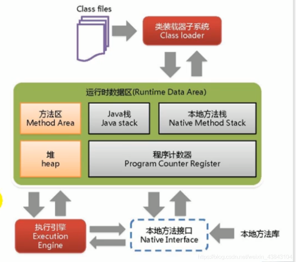


英文名称： **类加载器 Class Loader**

​                    **内存空间或运行时内存空间  Runtime Data Area**

​					**栈：Stack**

​					**堆：Heap**

Java的内存分为两类，一类是**栈内存**，一类是**堆内存**。

**栈内存**是指程序进入一个方法时，会为这个方法单独分配一块私属存储空间，用于存储这个方法内部的局部变量，当这个方法结束时，分配给这个方法的栈会释放，这个栈中的变量也将随之释放。

**堆是与栈作用不同的内存**，一般用于存放不放在当前方法栈中的那些数据，例如，使用new创建的对象都放在堆里，所以，它不会随方法的结束而消失。方法中的局部变量使用final修饰后，放在堆中，而不是栈中。

1.栈是用来存放基本类型的变量和引用类型的变量，堆用来存放new出来的对象和数组。

2.栈的存取速度快，但不灵活。堆的存取速度慢，但是存取灵活，空间动态分配。

3.栈在建立在连续的物理位置上，而堆只需要逻辑位置连续即可。

4.堆是JVM运行时最大的内存区域。


> stack的空间由操作系统自动分配和释放，heap的空间是手动申请和释放的，heap常用new关键字来分配。stack空间有限，heap的空间是很大的自由区。
>
> 在Java中，若只是声明一个对象，则先在栈内存中为其分配地址空间，若再new一下，实例化它，则在堆内存中为其分配地址。

业界三大JVM：

​		Oracle HotSpot，Sun出品，后来由Oracle接手，使用最广泛，支持特性全面，更新较快。

​		OpenJDK，HotSpot JDK的开源版本，比起HotSpot要少一些商业特性。openjdk采用GPL V2协议放出，而HotSpot JDK则采用BCL放出。两者协议虽然都是开放源代码的，但是在使用上的不同在于GPL V2允许在商业上自由使用，而BCL不允许修改源码，或封装JDK的API成第三方类库使用。

​		IBM JDK，p


# 2 JVM的内容区域

## 2.1 程序计数器

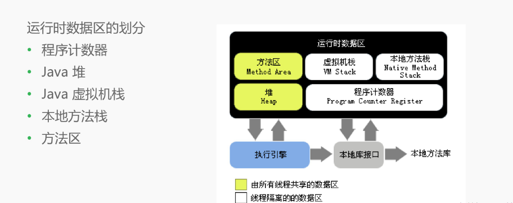


**程序计数器（Programe Counter Register）：**

程序计数器是一块较小的内存空间，它的作用可以看作是当前线程所执行的字节码的行号指示器。在虚拟机的概念模型里字节码解释器工作时就是通过改变这个计数器的值来选取下一条需要执行的字节码指令，分支、循环、跳转、异常处理、线程恢复等基础功能都需要依赖这个计数器来完成。

1. 如果线程正在执行的是Java 方法，则这个计数器记录的是正在执行的虚拟机字节码指令地址
2. 如果正在执行的是Native 方法，则这个技术器值为空（Undefined）
3. 此内存区域是唯一一个在Java虚拟机规范中没有规定任何OutOfMemoryError情况的区域

比方说这个代码

```
public class ShareCal {

    public int calc(){
        int a = 100;
        int b = 200;
        int c = 300;
        return ( a + b ) * c;
    }
}
```


## 2.2 Java栈

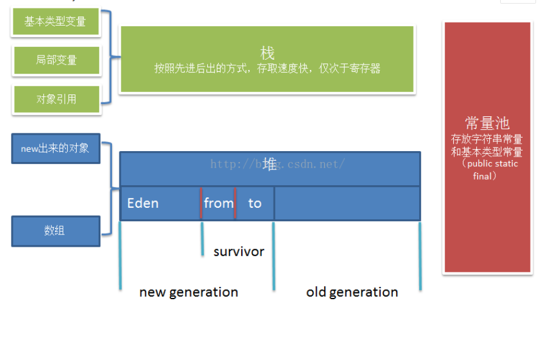

​		**2.2.1 java栈（虚拟机栈）的特点：**

​		**线程私有；速度很快，仅次于寄存器；后进先出（LIFO）；存储栈帧，支持java方法的执行，调用和退出；可能出现 OutOfMemoryError 错误和 StackOverflowError 错误；存储基本类型变量、局部变量、对象的引用**

​		函数中定义的基本类型变量，对象的引用变量都在函数的栈内存中分配。
​		函数一旦执行完毕，变量会立即释放，节约内存空间。
​		栈内存中的数据，没有默认初始化值，需要手动设置。


​		对于方法中**局部变量的引用**存储在java运行时数据区的栈中，而对于实例变量则存储在java运行时数据区的堆中。

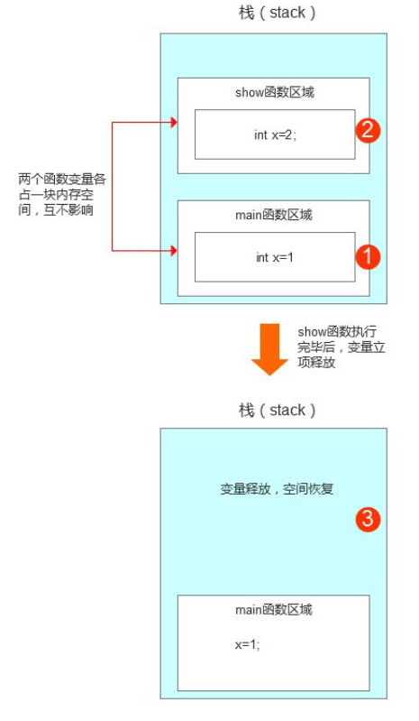

## 2.3 栈帧（Stack Frame）的概念（了解）

栈帧(Stack Frame)是用来支持虚拟机进行方法调用和方法执行的数据结构，它是虚拟机运行时数据区中的虚拟机栈的栈元素。

栈帧(Stack Frame)存储了方法的**局部变量表、操作数栈、动态连接信息、和方法返回地址、方法正常完成信息、方法异常完成信息**。

每个方法在执行的同时，都会创建一个栈帧(Stack Frame)。每一个方法从调用开始至执行完成的过程，都对应着一个栈帧在虚拟机栈里面从入栈到出栈的过程。


**局部变量表(Local Variable Table)**是一组变量值存贮空间，用于存放方法参数和方法内定义的局部变量。在Java程序编译为Class文件时候，就在方法的Code属性的max_locals数据项中确定了该方法所需要分配的局部变量表的最大容量。单位为Slot

​		局部变量表的容量以变量槽(Variable Slot)为最小单位。每个变量槽都可以存储32位长度的内存空间，例如boolean、byte、char、short、int、float、reference。


**操作数栈(operand Stack)**也常称为操作栈，它是一个后入先出栈。和局部变量表一样，操作数栈的最大深度也在编译的时候写入到Code属性的max_stacks中。

​		操作数栈的每一个元素可用是任意的Java数据类型，包括long和double。32位数据类型所占的栈容量为1，64位数据类型占用的栈容量为2。

​		当一个方法刚刚开始执行的时候，这个方法的操作数栈是空的，在方法执行的过程中，会有各种字节码指令往操作数栈中写入和提取内容，也就是出栈 / 入栈操作。例如，在做算术运算的时候是通过操作数栈来进行的，又或者在调用其它方法的时候是通过操作数栈来进行参数传递的。

​		每个栈帧都包含一个指向运行时常量池中该栈帧所属方法的引用，持有这个引用是为了支持方法调用过程中的**动态连接(Dynamic Linking)**。

​		Class文件的常量池中存在大量符号引用，字节码中的方法调用指令就以常量池中指向方法的符号引用作为参数，这些符号引用一部分在类加载阶段中的解析阶段会转为直接引用，这种转化也称为静态解析。另外的一部分将在每一次运行时期转化为直接引用。这部分称为动态连接。

**方法返回地址**

当一个方法开始执行后，只有2种方式可以退出这个方法 ：

方法返回指令 ： 执行引擎遇到一个方法返回的字节码指令，这时候有可能会有返回值传递给上层的方法调用者，这种退出方式称为正常完成出口。

异常退出 ： 在方法执行过程中遇到了异常，并且没有处理这个异常，就会导致方法退出。

无论采用任何退出方式，在方法退出之后，都需要返回到方法被调用的位置，程序才能继续执行，方法返回时可能需要在栈帧中保存一些信。用来帮助恢复它的上层方法的执行状态。

方法退出的过程实际上就等于把当前栈帧出栈，因此退出可能执行的操作有：

1.恢复上层方法的局部变量表和操作数栈

2.把返回值(如果存在返回值)压入调用者栈帧的操作数栈中

3.调整PC计数器的值以指向方法调用指令后面的一条指令

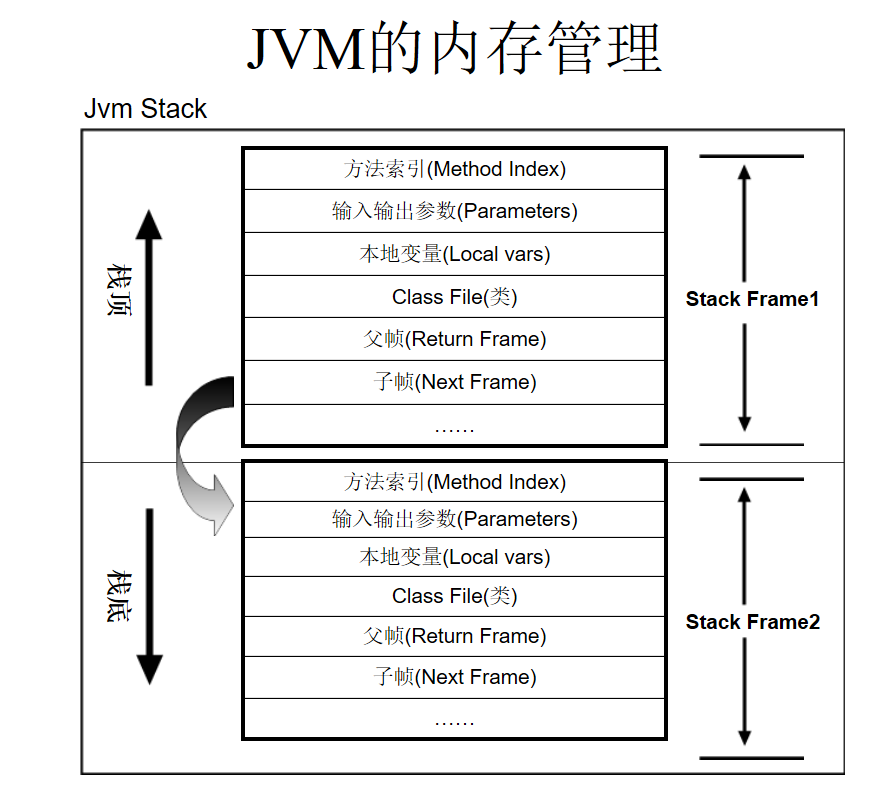

## 2.4 本地方法栈(Native Method Stack)

​		并不是所有的 JVM都支持本地方法, 因为 Java虚拟机规范上, 并没有明确要求本地方法的使用语言和具体实现方法. Hotspot VM是本地方法栈和虚拟机栈合二为一的虚拟机

​		本地方法栈是管理本地方法运行的, 本地方法是通过 C语言实现的, 在 Execution Engine执行时加载本地方法库(Native Method Library)，与虚拟机站相同: 没有 GC, 不同线程间是隔离的(线程私有的)

​		当调用了一个本地方法时, 就会进入不再受虚拟机限制的环境, 级别与虚拟机一样, 所以可以访问任何虚拟机内部的运行时数据区，可以直接使用本地处理器的寄存器，可以直接使用本地内存。

​		本地方法的作用是融合不同的编程语言为Java所用，目前该类方法用的越来越少，除非是与硬件有关的应用，比如通过java程序调用打印机打印，在企业级应用中很少见。因为现在的异构领域间通信技术很发达，比如Socket，WebService等等。


## 2.5  Java堆

​		 Java的堆是一个运行时数据区,类的(对象从中分配空间。这些对象通过new、newarray、anewarray和multianewarray等指令建立，它们不需要程序代码来显式的释放。堆是由垃圾回收来负责的，堆的优势是可以动态地分配内存大小，生存期也不必事先告诉编译器，因为它是在运行时动态分配内存的，Java的垃圾收集器会自动收走这些不再使用的数据。但缺点是，由于要在运行时动态分配内存，存取速度较慢。 
​         栈的优势是，存取速度比堆要快，仅次于寄存器，栈数据可以共享。但缺点是，存在栈中的数据大小与生存期必须是确定的，缺乏灵活性。栈中主要存放一些基本类型的变量（,int, short, long, byte, float, double, boolean, char）和对象句柄。

​		Java堆的特点：

- 全局共享
- 通常是JVM中最大的内存区域
- 作为Java对象的主要存储区域
- 实现自动内存管理（GC），无需向C、C++那样有程序员手工分配内存与释放内存
- 可能出现 OutOfMemoryError 错误


### 堆内存的结构

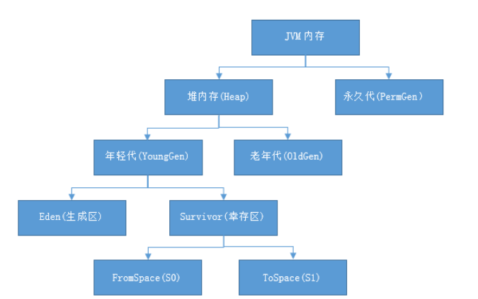

1. JVM内存划分为堆内存和非堆内存，堆内存分为年轻代（Young Generation）、老年代（Old Generation），非堆内存就一个永久代（Permanent Generation）。
2. 年轻代又分为Eden和Survivor区。Survivor区由FromSpace和ToSpace组成。Eden区占大容量，Survivor两个区占小容量，默认比例是8:1:1。
3. 堆内存用途：存放的是对象，垃圾收集器就是收集这些对象，然后根据GC算法回收。
4. 非堆内存用途：永久代，也称为方法区，存储程序运行时长期存活的对象，比如类的元数据、方法、常量、属性等。

在JDK1.8版本废弃了永久代，替代的是元空间（MetaSpace），元空间与永久代上类似，都是方法区的实现，他们最大区别是：元空间并不在JVM中，而是使用本地内存。

​		新生成的对象首先放到年轻代Eden区，当Eden空间满了，触发Minor GC，存活下来的对象移动到Survivor0区，Survivor0区满后触发执行Minor GC，Survivor0区存活对象移动到Suvivor1区，这样保证了一段时间内总有一个survivor区为空。经过多次Minor GC仍然存活的对象移动到老年代。
​		老年代存储长期存活的对象，占满时会触发Major GC=Full GC，GC期间会停止所有线程等待GC完成，所以对响应要求高的应用尽量减少发生Major GC，避免响应超时。
Minor GC ： 清理年轻代 
Major GC ： 清理老年代
Full GC ： 清理整个堆空间，包括年轻代和永久代


### 方法区

​		方法区是所有线程共享的内存，在java8以前是放在JVM内存中的，由永久代实现，受JVM内存大小参数的限制，在java8中移除了永久代的内容，**方法区由元空间(Meta Space)实现，并直接放到了本地内存中，不受JVM参数的限制(当然，如果物理内存被占满了，方法区也会报OOM)，并且将原来放在方法区的字符串常量池和静态变量都转移到了Java堆中**，方法区与其他区域不同的地方在于，方法区在编译期间和类加载完成后的内容有少许不同，不过总的来说分为这两部分：

​		类元信息(Klass)类元信息在类编译期间放入方法区，里面放置了类的基本信息，包括类的版本、字段、方法、接口以及常量池表(Constant Pool Table)，这些信息在类加载完后会被解析到运行时常量池中。

​		运行时常量池(Runtime Constant Pool)运行时常量池主要存放在类加载后被解析的字面量与符号引用，但不止这些运行时常量池具备动态性，可以添加数据，比较多的使用就是String类的intern()方法。


- 方法区（Method Area）与 Java 堆一样，是所有线程共享的内存区域。
- JDK7 之前（永久代）用于存储已被虚拟机加载的类信息、常量、字符串常量、类静态变量、即时编译器编译后的代码等数据。
- Java 虚拟机规范把方法区描述为堆的一个逻辑部分，但是它却有一个别名叫做 Non-Heap（非堆），目的应该是与 Java 堆区分开来。


**随JDK版本变迁的方法区（了解）**

JDK6

- Klass 元数据信息
- 每个类的运行时常量池（字段、方法、类、接口等符号引用）、编译后的代码
- 静态字段（无论是否有final）在 instanceKlass 末尾（位于 PermGen 内）
- oop（Ordinary Object Pointer（普通对象指针）） 其实就是 Class 对象实例
- 全局字符串常量池 StringTable，本质上就是个 Hashtable
- 符号引用（类型指针是 SymbolKlass）

JDK7

- Klass 元数据信息
- 每个类的运行时常量池（字段、方法、类、接口等符号引用）、编译后的代码
- 静态字段从 instanceKlass 末尾移动到了 java.lang.Class 对象（oop）的末尾（位于 Java Heap 内）
- oop 与全局字符串常量池移到 Java Heap 上
- 符号引用被移动到 Native Heap 中

JDK8

- 移除永久代
- Klass 元数据信息
- 每个类的运行时常量池、编译后的代码移到了另一块与堆不相连的本地内存 -- 元空间（Metaspace）

### 常量池

​		常量池(constant_pool)指的是在编译期被确定，并被保存在已编译的.class文件中的一些数据，用于存放编译期生成的各种**字面量和符号引用**，这部分内容将类在加载后进入方法区的运行时常量池中存放。运行期间也可能将新的常量放入池中。在jvm规范中，每个类型都有自己的常量池。

​		Java中八种基本类型的包装类的大部分都实现了常量池技术，它们是Byte、Short、Integer、Long、Character、Boolean，另外两种浮点数类型的包装类(Float、Double)则没有实现。并且Byte,Short,Integer,Long,Character这5种整型的包装类也只是在对应值在-128到127时才可使用对象池。另外String类 也实现了常量池技术。       
​    

​		对于final修饰的变量，它在编译时被解析为常量值的一个本地拷贝存储到自己的常量池中或嵌入到它的字节码流中。


**什么是字面量？什么是符号引用？**

​		字面量java代码在编译过程中是无法构建引用的，字面量就是在编译时对于数据的一种表示:

```
		int a=1;  //这个1便是字面量
		String b="iloveu";  //iloveu便是字面量 12
```

​		符号引用由于在编译过程中并不知道每个类的地址，因为可能这个类还没有加载，所以如果你在一个类中引用了另一个类，那么你完全无法知道他的内存地址，那怎么办，我们只能用他的类名作为符号引用，在类加载完后用这个符号引用去获取他的内存地址。例子：我在com.demo.Solution类中引用了com.test.Quest，那么我会把com.test.Quest作为符号引用存到类常量池，等类加载完后，拿着这个引用去方法区找这个类的内存地址。


## 2.6 Java对象是如何创建的

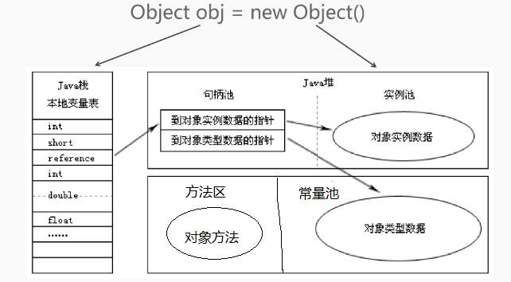

一般情况下

基本类型，直接在栈中创建并赋值

对象类型，在栈中创建对象的引用，在堆中划分内存存放对象实例数据，并与早在类加载时就加载到元空间中的实例或类成员方法、加载到常量池中的类的静态成员变量、发生引用连接。


**成员变量、局部变量、类变量分别存储在内存的什么地方？**

类变量类变量是用static修饰符修饰，定义在方法外的变量，随着java进程产生和销毁在java8之前把静态变量存放于方法区，在java8时存放在堆中

成员变量成员变量是定义在类中，但是没有static修饰符修饰的变量，随着类的实例产生和销毁，是类实例的一部分由于是实例的一部分，在类初始化的时候，从运行时常量池取出直接引用或者值，与初始化的对象一起放入堆中

局部变量局部变量是定义在类的方法中的变量在所在方法被调用时放入虚拟机栈的栈帧中，方法执行结束后从虚拟机栈中弹出，所以存放在虚拟机栈中


# 3. 垃圾收集（GC）

**垃圾收集GC（Garbage Collection）**是Java语言的核心技术之一， 在Java中，程序员不需要去关心内存动态分配和垃圾回收的问题，这一切都交给了JVM来处理。 


#### 什么样的对象才是垃圾？

对于Java对象来讲，如果说这个**对象没有被其他对象**所引用，该对象就是无用的，此对象就被称为垃圾，其占用的内存也就要被销毁。

```
Student a = new Student("aaa");
Student b = a;
Studnet c = a;
 栈里面a变量 -> 堆里面的字符串对象
 a = null;
 a = new Student("bbbb");
```


#### 标记垃圾的算法

Java中标记垃圾的算法主要有两种， 引用计数法和可达性分析算法。


#### 引用计数法

引用计数法就是给对象中添加一个引用计数器。

每当有一个地方引用它，计数器就加 1；当引用失效，计数器就减 1；任何时候计数器为 0 的对象就是不可能再被使用的，可以当做垃圾收集。这种方法实现起来很简单而且优缺点都很明显。

- **优点 执行效率高，程序执行受影响较小**
- **缺点 无法检测出循环引用的情况，导致内存泄露**

什么是循环引用，我们来看看一下代码

```java
public class MyObject {
    public MyObject childNode;
}

		MyObject object1 = new MyObject();
        MyObject object2 = new MyObject();
        object1.childNode = object2;
        object2.childNode = object1;

        object1 = null;
		object2 = null;
```

这时，引用计数非0，但是实际上这两个对象已无法访问，属于垃圾对象，但是无法清理。


#### 可达性分析算法

这个算法的基本思想就是通过一系列的称为 “GC Roots” 的对象作为起点，从这些节点开始向下搜索，节点所走过的路径称为引用链，当一个对象到 GC Roots 没有任何引用链相连的话，则证明此对象是不可用的。

```
main() {
	aaa a = new aaa();
	aaa{
		new bbb();
	}
}
main() -> aaa() -> bbb()
main() -> aaa() 
```

**那么什么对象可以作为GCRoot？**

- 虚拟机栈中的引用对象
- 方法区中的常量引用对象
- 方法区中的类静态属性引用对象
- 本地方法栈中的引用对象
- 活跃线程中的引用对象


**那么不可达的对象是否是必死之局呢？答案也是否定的**

在可达性分析法中不可达的对象，它们暂时处于“缓刑阶段”，要真正宣告一个对象死亡，至少要经历两次标记过程；可达性分析法中不可达的对象被第一次标记并且进行一次筛选，筛选的条件是此对象是否有必要执行 finalize 方法。当对象没有覆盖 finalize 方法，或 finalize 方法已经被虚拟机调用过时，虚拟机将这两种情况视为没有必要执行。被判定为需要执行的对象将会被放在一个队列中进行第二次标记，除非这个对象与引用链上的任何一个对象建立关联，否则就会被真的回收。


#### 如何将垃圾回收？

在Java中存在着四种垃圾回收算法，**标记清除算法**、**复制算法**、**标记整理算法**以及**分代回收算法**。我们接下来会分别介绍他们。

**标记清除算法**

该算法分为“标记”和“清除”两个阶段：标记阶段的任务是标记出所有需要被回收的对象，清除阶段就是回收被标记的对象所占用的空间。它是最基础的收集算法，效率也很高，但是会带来两个明显的问题：

- **效率问题**

- **空间问题（标记清除后会产生大量不连续的碎片）**

  

**复制算法**

它可以将内存分为大小相同的两块，每次使用其中的一块。当第一块的内存使用完后，就将还存活的对象复制到另一块去，然后再把使用的空间一次清理掉。这样就使每次的内存回收都是对内存区间的一半进行回收。

简单来说就是该对象分为对象面以及空闲面，对象在对象面上创建，对象面上存活的对象会被复制到空闲面，接下来就可以清除对象面的内存。

这种算法的优缺点也比较明显

- **优点：解决碎片化问题，顺序分配内存简单高效**
- **缺点：只适用于存活率低的场景，如果极端情况下如果对象面上的对象全部存活，就要浪费一半的存储空间。**


**标记整理算法**

为了解决复制算法的缺陷，充分利用内存空间，提出了标记整理算法。该算法标记阶段和标记清除一样，但是在完成标记之后，它不是直接清理可回收对象，而是将存活对象都向一端移动，然后清理掉端边界以外的内存。


## 垃圾回收算法（GC，Garbage Collection）

红色是标记的非活动对象，绿色是活动对象。

- **标记-清除（Mark-Sweep）**
  GC分为两个阶段，标记和清除。首先标记所有可回收的对象，在标记完成后统一回收所有被标记的对象。同时会产生不连续的内存碎片。碎片过多会导致以后程序运行时需要分配较大对象时，无法找到足够的连续内存，而不得已再次触发GC。

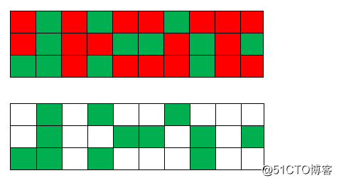

- **复制（Copy）**
  将内存按容量划分为两块，每次只使用其中一块。当这一块内存用完了，就将存活的对象复制到另一块上，然后再把已使用的内存空间一次清理掉。这样使得每次都是对半个内存区回收，也不用考虑内存碎片问题，简单高效。缺点需要两倍的内存空间。

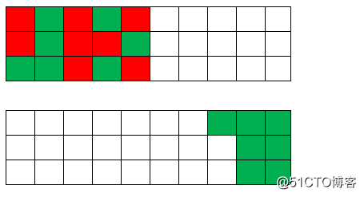

- **标记-整理（Mark-Compact）**
  也分为两个阶段，首先标记可回收的对象，再将存活的对象都向一端移动，然后清理掉边界以外的内存。此方法避免标记-清除算法的碎片问题，同时也避免了复制算法的空间问题。
  一般年轻代中执行GC后，会有少量的对象存活，就会选用复制算法，只要付出少量的存活对象复制成本就可以完成收集。而老年代中因为对象存活率高，没有额外过多内存空间分配，就需要使用标记-清理或者标记-整理算法来进行回收。

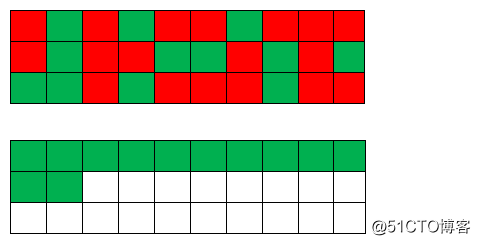

**分代收集算法**

当前虚拟机的垃圾收集都采用分代收集算法，这种算法就是根据具体的情况选择具体的垃圾回收算法。一般将 java 堆分为新生代和老年代，这样我们就可以根据各个年代的特点选择合适的垃圾收集算法。

比如在新生代中，每次收集都会有大量对象死去，所以可以选择复制算法，只需要付出少量对象的复制成本就可以完成每次垃圾收集。而老年代的对象存活几率是比较高的，而且没有额外的空间对它进行分配担保，所以我们必须选择“标记-清除”或“标记-整理”算法进行垃圾收集。


1. JVM内存划分为堆内存和非堆内存，堆内存分为年轻代（Young Generation）、老年代（Old Generation），非堆内存就一个永久代（Permanent Generation）。
2. 年轻代又分为Eden和Survivor区。Survivor区由FromSpace和ToSpace组成。Eden区占大容量，Survivor两个区占小容量，默认比例是8:1:1。
3. 堆内存用途：存放的是对象，垃圾收集器就是收集这些对象，然后根据GC算法回收。
4. 非堆内存用途：永久代，也称为方法区，存储程序运行时长期存活的对象，比如类的元数据、方法、常量、属性等。

在JDK1.8版本废弃了永久代，替代的是元空间（MetaSpace），元空间与永久代上类似，都是方法区的实现，他们最大区别是：元空间并不在JVM中，而是使用本地内存。
元空间有注意有两个参数：

- MetaspaceSize ：初始化元空间大小，控制发生GC阈值
- MaxMetaspaceSize ： 限制元空间大小上限，防止异常占用过多物理内存

### 为什么移除永久代？

移除永久代原因：为融合HotSpot JVM与JRockit VM（新JVM技术）而做出的改变，因为JRockit没有永久代。
有了元空间就不再会出现永久代OOM问题了！

### 分代概念

新生成的对象首先放到年轻代Eden区，当Eden空间满了，触发Minor GC，存活下来的对象移动到Survivor0区，Survivor0区满后触发执行Minor GC，Survivor0区存活对象移动到Suvivor1区，这样保证了一段时间内总有一个survivor区为空。经过多次Minor GC仍然存活的对象移动到老年代。
老年代存储长期存活的对象，占满时会触发Major GC=Full GC，GC期间会停止所有线程等待GC完成，所以对响应要求高的应用尽量减少发生Major GC，避免响应超时。
Minor GC ： 清理年轻代 
Major GC ： 清理老年代
Full GC ： 清理整个堆空间，包括年轻代和永久代
所有GC都会停止应用所有线程。

### 为什么分代？

将对象根据存活概率进行分类，对存活时间长的对象，放到固定区，从而减少扫描垃圾时间及GC频率。针对分类进行不同的垃圾回收算法，对算法扬长避短。

### 为什么survivor分为两块相等大小的幸存空间？

主要为了解决碎片化。如果内存碎片化严重，也就是两个对象占用不连续的内存，已有的连续内存不够新对象存放，就会触发GC。

### JVM堆内存常用参数

| 参数                   | 描述                                                      |
| :--------------------- | :-------------------------------------------------------- |
| -Xms                   | 堆内存初始大小，单位m、g                                  |
| -Xmx（MaxHeapSize）    | 堆内存最大允许大小，一般不要大于物理内存的80%             |
| -XX:PermSize           | 非堆内存初始大小，一般应用设置初始化200m，最大1024m就够了 |
| -XX:MaxPermSize        | 非堆内存最大允许大小                                      |
| -XX:NewSize（-Xns）    | 年轻代内存初始大小                                        |
| -XX:MaxNewSize（-Xmn） | 年轻代内存最大允许大小，也可以缩写                        |
| -XX:SurvivorRatio=8    | 年轻代中Eden区与Survivor区的容量比例值，默认为8，即8:1    |
| -Xss                   | 堆栈内存大小                                              |


## 垃圾收集器

- **串行收集器（Serial）**
  比较老的收集器，单线程。收集时，必须暂停应用的工作线程，直到收集结束。

- **并行收集器（Parallel）**
  多条垃圾收集线程并行工作，在多核CPU下效率更高，应用线程仍然处于等待状态。

- CMS收集器（Concurrent Mark Sweep）

  CMS收集器是缩短暂停应用时间为目标而设计的，是基于标记-清除算法实现，整个过程分为4个步骤，包括：

  - 初始标记（Initial Mark）
  - 并发标记（Concurrent Mark）
  - 重新标记（Remark）
  - 并发清除（Concurrent Sweep）

其中，初始标记、重新标记这两个步骤仍然需要暂停应用线程。初始标记只是标记一下GC Roots能直接关联到的对象，速度很快，并发标记阶段是标记可回收对象，而重新标记阶段则是为了修正并发标记期间因用户程序继续运作导致标记产生变动的那一部分对象的标记记录，这个阶段暂停时间比初始标记阶段稍长一点，但远比并发标记时间段。
由于整个过程中消耗最长的并发标记和并发清除过程收集器线程都可以与用户线程一起工作，所以，CMS收集器内存回收与用户一起并发执行的，大大减少了暂停时间。

- G1收集器（Garbage First）

  G1收集器将堆内存划分多个大小相等的独立区域（Region），并且能预测暂停时间，能预测原因它能避免对整个堆进行全区收集。G1跟踪各个Region里的垃圾堆积价值大小（所获得空间大小以及回收所需时间），在后台维护一个优先列表，每次根据允许的收集时间，优先回收价值最大的Region，从而保证了再有限时间内获得更高的收集效率。

  G1收集器工作工程分为4个步骤，包括：

  - 初始标记（Initial Mark）
  - 并发标记（Concurrent Mark）
  - 最终标记（Final Mark）
  - 筛选回收（Live Data Counting and Evacuation）

初始标记与CMS一样，标记一下GC Roots能直接关联到的对象。并发标记从GC Root开始标记存活对象，这个阶段耗时比较长，但也可以与应用线程并发执行。而最终标记也是为了修正在并发标记期间因用户程序继续运作而导致标记产生变化的那一部分标记记录。最后在筛选回收阶段对各个Region回收价值和成本进行排序，根据用户所期望的GC暂停时间来执行回收。

### 垃圾收集器参数

| 参数                                   | 描述                                                         |
| :------------------------------------- | :----------------------------------------------------------- |
| -XX:+UseSerialGC                       | 串行收集器                                                   |
| -XX:+UseParallelGC                     | 并行收集器                                                   |
| -XX:+UseParallelGCThreads=8            | 并行收集器线程数，同时有多少个线程进行垃圾回收，一般与CPU数量相等 |
| -XX:+UseParallelOldGC                  | 指定老年代为并行收集                                         |
| -XX:+UseConcMarkSweepGC                | CMS收集器（并发收集器）                                      |
| -XX:+UseCMSCompactAtFullCollection     | 开启内存空间压缩和整理，防止过多内存碎片                     |
| -XX:CMSFullGCsBeforeCompaction=0       | 表示多少次Full GC后开始压缩和整理，0表示每次Full GC后立即执行压缩和整理 |
| -XX:CMSInitiatingOccupancyFraction=80% | 表示老年代内存空间使用80%时开始执行CMS收集，防止过多的Full GC |
| -XX:+UseG1GC                           | G1收集器                                                     |
| -XX:MaxTenuringThreshold=0             | 在年轻代经过几次GC后还存活，就进入老年代，0表示直接进入老年代 |

## 为什么会堆内存溢出？

在年轻代中经过GC后还存活的对象会被复制到老年代中。当老年代空间不足时，JVM会对老年代进行完全的垃圾回收（Full GC）。如果GC后，还是无法存放从Survivor区复制过来的对象，就会出现OOM（Out of Memory）。

**OOM（Out of Memory）异常常见有以下几个原因：**
1）老年代内存不足：java.lang.OutOfMemoryError:Javaheapspace
2）永久代内存不足：java.lang.OutOfMemoryError:PermGenspace
3）代码bug，占用内存无法及时回收。
OOM在这几个内存区都有可能出现，实际遇到OOM时，能根据异常信息定位到哪个区的内存溢出。
可以通过添加个参数-XX:+HeapDumpOnOutMemoryError，让虚拟机在出现内存溢出异常时Dump出当前的内存堆转储快照以便事后分析。

熟悉了JAVA内存管理机制及配置参数，下面是对JAVA应用启动选项调优配置：

```
JAVA_OPTS="-server -Xms512m -Xmx2g -XX:+UseG1GC -XX:SurvivorRatio=6 -XX:MaxGCPauseMillis=400 -XX:G1ReservePercent=15 -XX:ParallelGCThreads=4 -XX:ConcGCThreads=1 -XX:InitiatingHeapOccupancyPercent=40 -XX:+PrintGCDetails  -XX:+PrintGCTimeStamps -Xloggc:../logs/gc.log"
```

- 设置堆内存最小和最大值，最大值参考历史利用率设置
- 设置GC垃圾收集器为G1
- 启用GC日志，方便后期分析

## 小结

- 选择高效的GC算法，可有效减少停止应用线程时间。

- 频繁Full GC会增加暂停时间和CPU使用率，可以加大老年代空间大小降低Full GC，但会增加回收时间，根据业务适当取舍。

  

#### **什么时候发生垃圾回收**

由于对象进行了分代处理，因此垃圾回收区域、时间也不一样。GC有两种类型：Scavenge GC和Full GC。

**Scavenge GC**

  一般情况下，当新对象生成，并且在Eden申请空间失败时，就会触发Scavenge GC，对Eden（伊甸）区域进行GC，清除非存活对象，并且把尚且存活的对象移动到Survivor（幸存者）区。然后整理Survivor的两个区。这种方式的GC是对年轻代的Eden区进行，不会影响到年老代。因为大部分对象都是从Eden区开始的，同时Eden区不会分配的很大，所以Eden区的GC会频繁进行。因而，一般在这里需要使用速度快、效率高的算法，使Eden去能尽快空闲出来。

**Full GC**

  对整个堆进行整理，包括Young、Tenured和Perm。Full GC因为需要对整个堆进行回收，所以比Scavenge GC要慢，因此应该尽可能减少Full GC的次数。在对JVM调优的过程中，很大一部分工作就是对于Full GC的调节。有如下原因可能导致Full GC：

a) 年老代（Tenured）被写满；

b) 持久代（Perm）被写满；

c) System.gc()被显式调用；

d) 上一次GC之后Heap的各域分配策略动态变化；

# 4 类加载过程

类的生命周期

**问题：java类的生命周期由几个阶段组成**

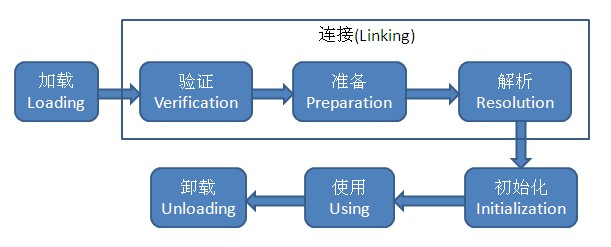

 类加载机制主要就是**加载、验证、准备、解析、初始化**这些过程 


**问题：类加载（Loading）的过程中做了哪些处理**

- **通过一个类的全限定名来获取定义此类的二进制字节流**
- **将获取到的二进制字节流转化成一种数据结构并放进方法区**
- **在内存中生成一个代表此类的java.lang.Class对象，作为访问方法区中各种数据的接口**

 被加载的类的信息存储在方法区中，可以被线程所共享，也就是说，加载阶段完成后，虚拟机外部的二进制字节流就按照虚拟机所需的格式存储在了方法区之中。  Class对象虽然是在内存中，但并未明确规定是在Java堆中，对于HotSpot来说，Class对象存储在方法区中。它作为程序访问方法区中二进制字节流中所存储各种数据的接口。 


### 验证阶段

 这一阶段的目的主要是为了确保Class文件的字节流中包含的信息符合当前虚拟机的要求，从而不会危害虚拟机自身安全。也就是说，当加载阶段将字节流加载进方法区之后，JVM需要做的第一件事就是**对字节流进行安全校验**，以保证格式正确，使自己之后能正确的解析到数据并保证这些数据不会对自身造成危害。 

验证阶段主要分成四个子阶段：

> - 文件格式验证
> - 元数据验证
> - 字节码验证
> - 符号引用验证


### 准备阶段

1.准备阶段的目的：正式**为类变量分配内存并设置类变量初始值****的阶段，这些变量所使用的内存将在方法区中分配。

注意我的重点：是类变量（static）不是实例变量，还有，我们又知道了在JVM的方法区中不仅存储着Class字节流（按照运行时方法区的数据结构进行存储，上述的二进制字节流是不严谨的说法，只是为了大家好理解），还有我们的类变量。

2.这里的类变量初始值通常是指数据类型的零值。比如int的零值为0，long为0L，boolean为false… …真正的初始化赋值是在初始化阶段进行的。

额外一点，如果你设置的类变量还具有final字段，如下：

```java
public static final int value = 123;
```

那么在准备阶段变量的初始值就会被直接初始化为123，具体原因是由于拥有final字段的变量在它的字段属性表中会出现ConstantValue属性。


### 解析阶段

解析阶段的目的：**虚拟机将常量池内的符号引用替换为直接引用**。

 **常量池(constant pool)指的是在编译期被确定，并被保存在已编译的.class文件中的一些数据。它包括了关于类、方法、接口等中的常量，也包括字符串常量。** 

 **符号引用**：总的来说就是常量池中存储的那些描述类、方法、接口的字面量，你可以简单的理解为就是那些所需要信息的全限定名，目的就是为了虚拟机在使用的时候可以定位到所需要的目标。 

 **直接引用**：直接指向目标的指针、相对偏移量或能间接定位到目标的句柄。 

 重新解读：虚拟机将运行时常量池中那些仅代表其他信息的符号引用解析为直接指向所需信息所在地址的指针。 


- 在解析阶段主要有以下不同的动作

  > - 类或接口的解析（注意数组类和非数组类）
  > - 字段（简单名称+字段描述符）解析（注意递归搜索）
  > - 类方法解析（注意递归搜索）
  > - 接口方法解析（注意递归搜索）

**动态连接**

大部分JVM的实现都是延迟加载或者叫做动态连接。它的意思就是JVM装载某个类A时，如果类A中有引用其他类B，虚拟机并不会将这个类B也同时装载进JVM内存，而是等到执行的时候才去装载。

而这个被引用的B类在引用它的类A中的表现形式主要被登记在了符号表中，而解析的过程就是当需要用到被引用类B的时候，将引用类B在引用类A的符号引用名改为内存里的直接引用。


### 初始化阶段

**问题：给出 ...... 代码，会输出什么？**

初始化过程，将按照类文件中初始化代码，依次执行。

虚拟机规范定义了5种情况，会触发类的初始化阶段，也正是这个阶段，JVM才真正开始执行类中定义的Java程序代码：

> - new一个对象、读取一个类静态字段、调用一个类的静态方法的时候
> - 对类进行反射调用的时候
> - 初始化一个类，发现父类还没有初始化，则先初始化父类
> - main方法开始执行时所在的类
> - 用动态语言支持时，如果一个java.lang.invoke.MethodHandle实例后解析结果REF_putStatic,REF_getStatic,REF_invokeStatic的方法句柄时，当该方法句柄对应的类没有初始化时，需要初始化该类 。

另外有三种引用类的方式不会触发初始化（也就是类的加载），为以下三种：

> - 通过子类（类名）引用父类的静态字段，不会导致子类初始化（会引发父类的初始化、不会引发子类的初始化）
> - 通过数组定义来引用类，不会触发此类的初始化
> - 引用另一个类中的常量不会触发另一个类的初始化，原因在于“**常量传播优化**”

常量传播优化的例子

```java
public class ConstClass {
    static {
        System.out.println("ConstClass init!");
    }
	public static final String HELLOWORLD = "hello world";
}

public class NotInitialization {
    public static void main(String[] args) {
        System.out.println(ConstClass.HELLOWORLD);
    }
}
```

 常量“hello world”已经被存储到了NotInitialization类的常量池中，以后NotInitialization对常量ConstClass.HELLOWORLD的引用实际上都被转化为NotInitialization对自身常量池的引用。 


通过数组定义来引用类的子类

```java
 public class SuperClass {
     static {
         System.out.println("SuperClass init!");
     }
     public static int value = 123;
 } 

 public class NotInitialization {
     public static void main(String[] args) {
         SuperClass[] sca = new SuperClass[10];
     }
 }  
```


# 5. 类加载器

需要了解、掌握的知识只有两点：

> 1.类加载器的命名空间 
> 2.双亲委派模型

**问题：java有几种类加载器**

**问题：类加载的双亲委派机制是什么**

**类加载器的命名空间**：对于任意一个类，都需要**由加载它的类加载器和这个类本身一同确立其在Java虚拟机中的唯一性，每一个类加载器，都拥有一个独立的类命名空间**。也就是说，你现在要比较两个类是否相等，只有在这两个类是同一个类加载器加载的前提下才有意义。


## **双亲委派模型**：

​		首先你得知道在JVM中有三种系统提供的类加载器：**启动类加载器，扩展类加载器、应用程序类加载器**。


java的三种类加载器存在父子关系，子 加载器保存着附加在其的引用，当一个类加载器需要加载一个目标类时，会先委托父加载器去加载，然后父加载器会在自己的加载路径中搜索目标类，父加载器在自己的加载范围中找不到时，才会交给子加载器加载目标类。

采用双亲委托模式可以避免类加载混乱，而且还将类分层次了，例如java中lang包下的类在jvm启动时就被启动类加载器加载了，而用户一些代码类则由应用程序类加载器(AppClassLoader)加载，基于双亲委托模式，就算用户定义了与lang包中一样的类，最终还是由应用程序类加载器委托给启动类加载器去加载，这个时候启动类加载器发现已经加载过了lang包下的类了，所以两者都不会再重新加载。当然，如果使用者通过自定义的类加载器可以强行打破这种双亲委托模型，但也不会成功的，java安全管理器抛出将会抛出java.lang.SecurityException异常。

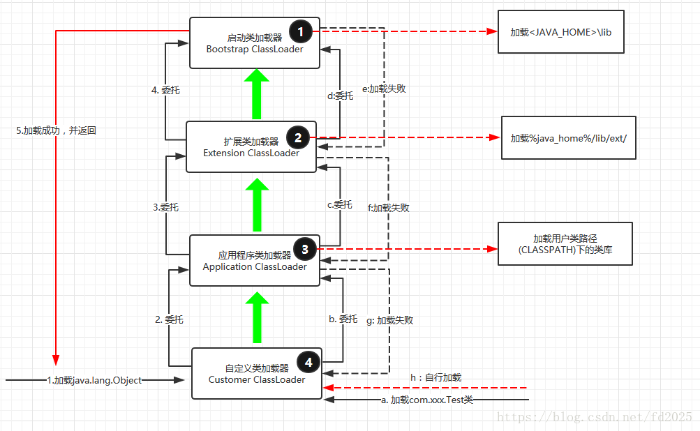


## 线程上下文类加载器

**双亲委派模型的破坏者-线程上下文类加载器**
  	在Java应用中存在着很多服务提供者接口（Service Provider Interface，SPI），这些接口允许第三方为它们提供实现，如常见的 SPI 有 JDBC、JNDI等，这些 SPI 的接口属于 Java 核心库，一般存在rt.jar包中，由Bootstrap类加载器加载，而 SPI 的第三方实现代码则是作为Java应用所依赖的 jar 包被存放在classpath路径下，由于SPI接口中的代码经常需要加载具体的第三方实现类并调用其相关方法，但SPI的核心接口类是由引导类加载器来加载的，而Bootstrap类加载器无法直接加载SPI的实现类，同时由于双亲委派模式的存在，Bootstrap类加载器也无法反向委托AppClassLoader加载器SPI的实现类。在这种情况下，我们就需要一种特殊的类加载器来加载第三方的类库，而线程上下文类加载器就是很好的选择。
   	线程上下文类加载器（contextClassLoader）是从 JDK 1.2 开始引入的，我们可以通过java.lang.Thread类中的getContextClassLoader()和 setContextClassLoader(ClassLoader cl)方法来获取和设置线程的上下文类加载器。如果没有手动设置上下文类加载器，线程将继承其父线程的上下文类加载器，初始线程的上下文类加载器是系统类加载器（AppClassLoader）,在线程中运行的代码可以通过此类加载器来加载类和资源，如下图所示，以jdbc.jar加载为例
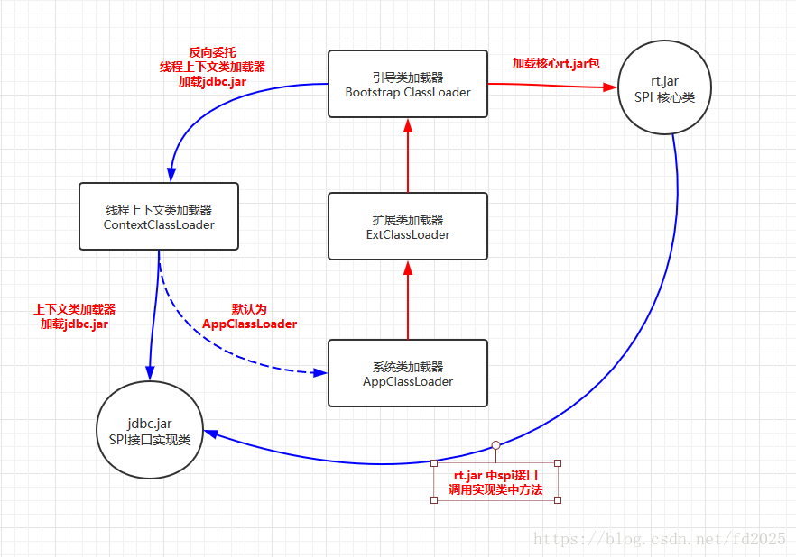

