# 学习目标

```
1、了解JAVA中有哪些常用的数据结构
2、掌握数组结构的使用
3、掌握栈跟队列的特性以及使用
4、掌握单向链表跟双向链表的使用
5、掌握常见的树型结构
6、掌握哈希表的存储结构跟使用
```


# 第1章 数据结构

## 1.1 概述

​	数据结构是计算机存储、组织数据的方式。数据结构是指相互之间存在一种或多种特定关系的数据元素的集合。通常情况下，精心选择的数据结构可以带来更高的运行或者存储效率。数据结构往往同高效的检索算法和索引技术有关。

​	JAVA中常见的数据结构有

- 数组
- 栈（Stack）
- 队列（Queue）
- 链表（LinkedList）
- 树（Tree）
- 哈希表（Hash）

  


## 1.2 数组

​		数组是内存中连续保存的多个相同类型的元素的数据结构。通过下标索引访问数组中的元素，索引从0开始。根据维度可以分为1维数组、2维数组……N维数组。

- 优点

  通过下标直接定位元素位置，查找效率高。

- 缺点

  - 长度固定
  - 数据类型都必须相同
  - 插入跟删除元素时效率比较低。


适合场景：大量查询，很少删除和插入。

 

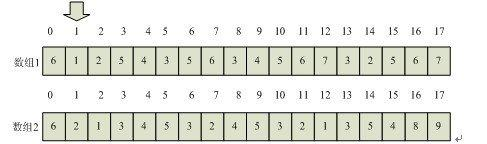

​	

## 1.3 栈

### 1.3.1 概述

​		栈结构只能在一端操作，该操作端叫做栈顶，另一端叫做栈底。栈结构按照“后进先出”（Last In First Out, LIFO）的方式处理结点数据。


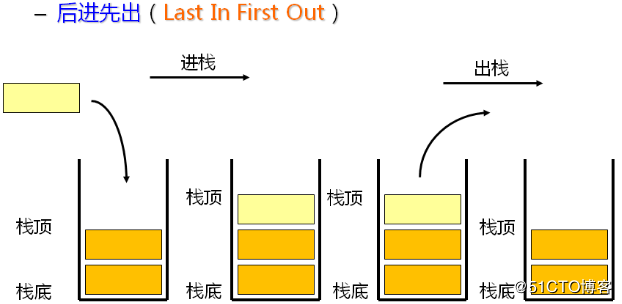


### 1.3.2 API

​	Java中提供了对于栈结构的实现，路径为`java.util.Stack`，它继承了`Vector`类。常用`API`如下：

- `public boolean empty()`: 测试堆栈是否为空。 

- `public E peek()`: 查看堆栈顶部的对象，但不从堆栈中移除它。

- `public E pop()`: 除堆栈顶部的对象，并作为此函数的值返回该对象。 

- `public E push(E item)`: 把项压入堆栈顶部。

  

**代码演示**

```java
public class Demo01Stack {

    public static void main(String[] args) {
//      创建栈结构
        Stack<String> stack=new Stack<String>();
//      检测栈中是否是空
        System.out.println(stack.empty());

//      压栈
        stack.push("刘备");
        stack.push("关羽");
        stack.push("张飞");
        stack.push("赵云");
        stack.push("黄忠");

//      出栈，将栈顶元素弹出
        stack.pop();

//      查看栈顶元素
        System.out.println(stack.peek());
    }
}
```


## 1.4 队列

​		队列是一种特殊的线性表，特殊之处在于它只允许在表的前端（front）进行删除操作，而在表的后端（rear）进行插入操作，和栈一样，队列是一种操作受限制的线性表。进行插入操作的端称为队尾，进行删除操作的端称为队头。

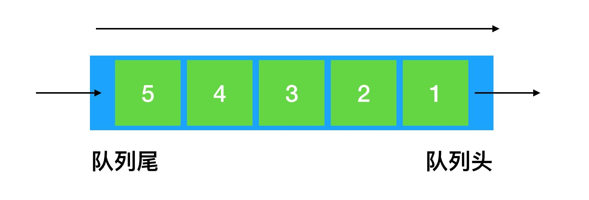


### 1.4.2 API

​	Java中提供了对于队列结构的接口，路径为`java.util.Queue`，`LinkedList`是它的一个实现类。常用`API`如下：

- `boolean add(E e)`:  将指定的元素插入此队列。
- `E element()`: 获取，但是不移除此队列的头。
- `boolean offer(E e)`: 将指定的元素插入此队列。 
- `E peek()`: 获取但不移除此队列的头。
- `E poll()`: 获取并移除此队列的头，如果此队列为空，则返回 null。
- `E remove()`:获取并移除此队列的头。


**代码演示**

```java
public class Demo02Queue {

    public static void main(String[] args) {
//      创建队列
        Queue<String> queue = new LinkedList<String>();
//      使用add或者offer方法添加元素
        queue.add("刘备");
        queue.add("关羽");
        queue.add("张飞");
        queue.offer("赵云");
        queue.offer("黄忠");

//       删除队头元素
        System.out.println(queue.poll());
//        System.out.println(queue.remove());

//       获取队头元素
        System.out.println(queue.element());
        System.out.println(queue.peek());

    }
}
```


## 1.5 链表

​		链表是一种物理存储单元上非连续、非顺序的存储结构，数据元素的逻辑顺序是通过链表中的指针连接次序实现的。每一个链表都包含多个节点，节点又包含两个部分，一个是数据域（储存节点含有的信息），一个是引用域（储存下一个节点或者上一个节点的地址）。


**链表的特点**：

- 获取数据麻烦，需要遍历查找，比数组慢
- 插入、删除的效率比较高


链表从结构上分为**单向链表**跟**双向链表**。


### 1.5.1 单向链表


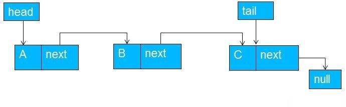

**代码实现**

```java
//单向链表的代码实现
public class LinkDemo {

    public static void main(String[] args) {

        LinkList theList = new LinkList(); // make new list
        theList.insertFirst(22);
        theList.insertFirst(44);
        theList.insertFirst(66);
        theList.insertFirst(88);
        System.out.println(theList.isEmpty());
        theList.displayList();
        theList.deleteFirst();
        theList.displayList();

    }

}

//链表中的节点对象
class Node{
    public int data;
    public Node next;

    public Node(int data) {
        this.data = data;
    }

    public void display() {
        System.out.print("{" + data + "} ");
    }
}

class LinkList{

    private Node first;

    public LinkList() {
        first = null;
    }

    public boolean isEmpty() {
        return (first == null);
    }

    public void insertFirst(int data) { // make new link
        Node newNode = new Node(data);
        newNode.next = first; // newLink --> old first
        first = newNode; // first --> newLink
    }

    public Node deleteFirst(){     // delete first item
        if(!isEmpty()) {
            Node temp = first;          // save reference to link
            first = first.next;         // delete it: first-->old next
            return temp;                // return deleted link
        }
        return null;

    }
    public void displayList() {
        System.out.print("List (first-->last): ");
        Node current = first; // start at beginning of list
        while (current != null) // until end of list,
        {
            current.display(); // print data
            current = current.next; // move to next link
        }
        System.out.println("");
    }

}
```


### 1.5.2 双向链表


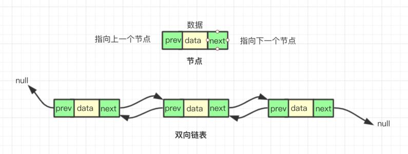

JAVA已经提供了双向链表的实现`java.util.LinkedList` 。

**代码演示**

```java
public class LinkDemo02 {

    public static void main(String[] args) {

        LinkedList<String> list = new LinkedList<String>();
//        添加元素
        list.add("100");
        list.add("200");
        list.add("300");
        list.add("400");
        list.add("500");
//        位置2的地方插入
        list.add(2, "150");
        System.out.println(list);
//      获取索引3位置的元素
        System.out.println(list.get(3));
//      删除元素
        System.out.println(list.remove(2));
        System.out.println(list);

//       获取首节点
        System.out.println("链表的第一个元素是：" + list.getFirst());
//       获取尾节点
        System.out.println("链表的最后一个元素是：" + list.getLast());
    }
}
```


## 1.6 树

### 1.6.1 树

​	树(Tree)是n(n≥0)个结点的有限集T，并且当n＞0时满足下列条件：
​     （1）有且仅有一个特定的称为根(Root)的结点；
​     （2）当n＞1时，其余结点可以划分为m(m＞0)个互不相交的有限集T1、T2 、…、Tm，每个集Ti(1≤i≤m)均为树，且称为树T的子树(SubTree)。
​    特别地，不含任何结点(即n＝0)的树，称为空树。

如下就是一棵树的结构：

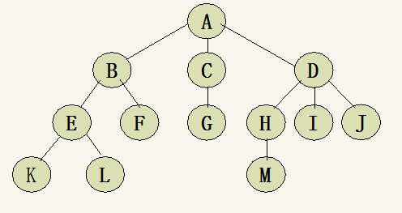


**基本术语**

- **结点：**存储数据元素和指向子树的链接，由数据元素和构造数据元素之间关系的引用组成。
- **孩子结点：**树中一个结点的子树的根结点称为这个结点的孩子结点，如图1中的A的孩子结点有B、C、D
  **双亲结点：**树中某个结点有孩子结点(即该结点的度不为0)，该结点称为它孩子结点的双亲结点，也叫前驱结点。双亲结点和孩子结点是相互的，如图1中，A的孩子结点是B、C、D，B、C、D的双亲结点是A。
  **兄弟结点：**具有相同双亲结点(即同一个前驱)的结点称为兄弟结点，如图1中B、B、D为兄弟结点。
  **结点的度：**结点所有子树的个数称为该结点的度，如图1，A的度为3，B的度为2.
  **树的度：**树中所有结点的度的最大值称为树的度，如图1的度为3.
  **叶子结点：**度为0的结点称为叶子结点，也叫终端结点。如图1的K、L、F、G、M、I、J
  **分支结点：**度不为0的结点称为分支结点，也叫非终端结点。如图1的A、B、C、D、E、H
  **结点的层次：**从根结点到树中某结点所经路径的分支数称为该结点的层次。根结点的层次一般为1(也可以自己定义为0)，这样，其它结点的层次是其双亲结点的层次加1.
  **树的深度：**树中所有结点的层次的最大值称为该树的深度(也就是最下面那个结点的层次)。

 

### 1.6.2 二叉树

​	二叉树（Binary Tree）是有限个节点的集合，这个集合可以是空集，也可以是一个根节点和**两**颗不相交的子二叉树组成的集合，其中一颗树叫根的左子树，另一颗树叫右子树。所以二叉树是一个递归地概念。


**二叉树的实现**

```java
public class TreeListDemo01 {

    public static void main(String[] args) {
        BinaryTreeNode a = new BinaryTreeNode('A');
        BinaryTreeNode b = new BinaryTreeNode('B');
        BinaryTreeNode c = new BinaryTreeNode('C');
        BinaryTreeNode d = new BinaryTreeNode('D');
        BinaryTreeNode e = new BinaryTreeNode('E');
        BinaryTreeNode f = new BinaryTreeNode('F');

        a.setLeftChirld(b);
        a.setRightChirld(c);
        b.setLeftChirld(d);
        c.setLeftChirld(e);
        c.setRightChirld(f);

        BinaryTree tree = new BinaryTree(a);
//       先序遍历
        tree.preOrderTreeNode(tree.getRoot());
//       中序遍历
        tree.inOrderTreeNode(tree.getRoot());
//       后序遍历
        tree.postOrderTreeNode(tree.getRoot());
    }

}
/**
 * 二叉树节点
 */
class BinaryTreeNode  {
    private char data;  //数据
    private BinaryTreeNode leftChirld;  //左孩子
    private BinaryTreeNode rightChirld; //右孩子

    public BinaryTreeNode(char data) {
        this.data = data;
    }

    public char getData() {
        return data;
    }
    public void setData(char data) {
        this.data = data;
    }
    public BinaryTreeNode getLeftChirld() {
        return leftChirld;
    }
    public void setLeftChirld(BinaryTreeNode leftChirld) {
        this.leftChirld = leftChirld;
    }
    public BinaryTreeNode getRightChirld() {
        return rightChirld;
    }
    public void setRightChirld(BinaryTreeNode rightChirld) {
        this.rightChirld = rightChirld;
    }

    @Override
    public String toString() {
        return " {" + data + '}';
    }
}

/**
 * 二叉树
 */
class BinaryTree {
    private BinaryTreeNode root;

    //初始化二叉树
    public BinaryTree(){}

    public BinaryTree(BinaryTreeNode root){
        this.root = root;
    }

    public void setRoot(BinaryTreeNode root){
        this.root = root;
    }

    public BinaryTreeNode getRoot(){
        return root;
    }

    //   先序遍历
    public void preOrderTreeNode(BinaryTreeNode node){
        if(node == null){
            return ;
        }
        System.out.println(node);
        preOrderTreeNode(node.getLeftChirld());
        preOrderTreeNode(node.getRightChirld());
    }

    //    中序遍历
    public void inOrderTreeNode(BinaryTreeNode node){
        if(node == null){
            return ;
        }
        inOrderTreeNode(node.getLeftChirld());
        System.out.println(node);
        inOrderTreeNode(node.getRightChirld());
    }

    //    后序遍历
    public void postOrderTreeNode(BinaryTreeNode node){
        if(node == null){
            return ;
        }
        postOrderTreeNode(node.getLeftChirld());
        postOrderTreeNode(node.getRightChirld());
        System.out.println(node);
    }
}
```


### 1.6.3 满二叉树

​	一棵满二叉树就是高度为k，且拥有(2^k)-1个节点的二叉树，一棵满二叉树每个节点，要么都有两棵子树，要么都没有子树；而且每一层所有的节点之间必须要么都有两棵子树，要么都没子树。


### 1.6.4 完全二叉树

完全二叉树是一颗特殊的二叉树，它遵循以下规则：

假设完全二叉树高度为k，则完全二叉树需要符合以下两点：

- 所有叶子节点都出现在k层或k-1层，并且从1~k-1层必须达到最大节点数。
- 第k层可以是不满的，但是第k层的所有节点必须集中在最左边。

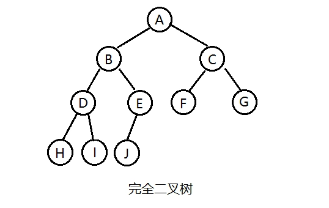


### 1.6.5 二叉查找树

​	二叉查找树(BinarySearch Tree，也叫二叉搜索树，或二叉排序树BinarySort Tree)或者是一棵空树，或者是具有下列性质的二叉树：

​	1、若任意结点的左子树不空，则左子树上所有结点的值均小于它的根结点的值；

​	2、若任意结点的右子树不空，则右子树上所有节点的值均大于它的根结点的值；

​	3、任意结点的左右子树也分别为二叉查找树；

​	4、没有键值相等的结点。

在实际应用中，二叉查找树的使用比较多。


### 1.6.6 平衡二叉树

​		平衡二叉树（AVL）是一种特殊的二叉查找树，其中每一个节点的左子树和右子树的高度差至多等于1。从平衡二叉树的名字中可以看出来，它是一种高度平衡的二叉排序树。那么什么叫做高度平衡呢？意思就是要么它是一颗空树，要么它的左子树和右子树都是平衡二叉树，且左子树和右子树的深度只差的绝对值绝对不超过1。

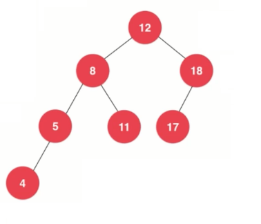


### 1.6.7 红黑树

​		红黑树（Red Black Tree） 是一种自平衡二叉查找树。

**红黑树的特性**
 （1）每个节点或者是黑色，或者是红色。
 （2）根节点是黑色。 
 （3）每个叶子节点（NIL）是黑色。 
 （4）如果一个节点是红色的，则它的子节点必须是黑色的。**[注意：这里叶子节点，是指为空(NIL)的虚节点！]** 
 （5）从一个节点到该节点的子孙节点的所有路径上包含相同数目的黑节点。


​		红黑树是自平衡的，当插入元素导致不满足红黑树的特性时，需要通过**旋转**跟**变色**来重新满足红黑树的特性，旋转分为左旋跟右旋。

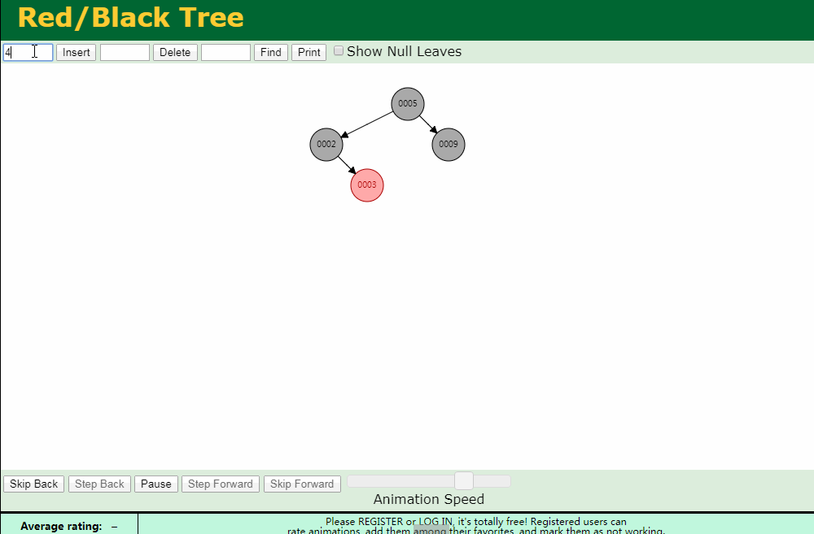


**红黑树跟平衡二叉树的区别**

1. 红黑树放弃了追求完全平衡，追求大致平衡，保证每次插入最多只需要三次旋转就能达到平衡，实现起来也更为简单。

2. 平衡二叉树追求绝对平衡，条件比较苛刻，实现起来比较麻烦，每次插入新节点之后需要旋转的次数不能预知。


## 1.7 哈希表

​		哈希表（Hash table，也叫散列表），是根据关键码值(Key)而直接进行访问的数据结构。也就是说，它通过把关键码值映射到表中一个位置来访问记录，以加快查找的速度。这个映射函数叫做散列（哈希）函数，存放记录的数组叫做散列表。

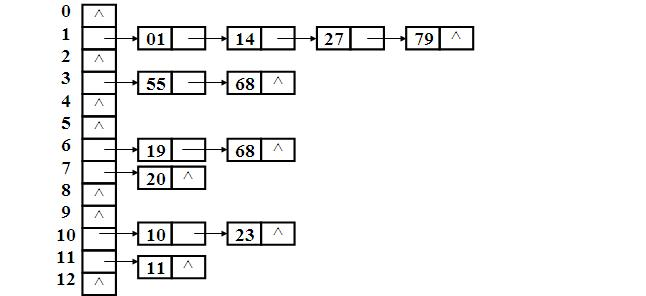


### 1.7.1 散列函数

​	一个好的散列函数应该让Key均匀的散列在数组中，常用的散列函数有：

- 直接定址法

  ​	取关键字或者关键字的某个线性函数为Hash地址，即address(key)=a*key+b;如知道学生的学号从2000开始，最大为4000，则可以将address(key)=key-2000作为hash地址。

- 平方取中法

  ​	对关键字进行平方运算，然后取结果中的中间几位作为hash地址，加入有以下关键字{421，423，436}，平方之后的结果为{177241，178929，190096}，那么可以取中间的两位数{ 72, 89, 00 }作为Hash地址。

- 折叠法

  ​	将关键字拆分成几部分，然后将这几部分组合在一起，以特定的方式进行转化形成Hash地址，假如知道图书的ISBN号为8903-241-23，可以将address(key)=89+03+24+12+3作为hash地址。


### 1.7.2 哈希冲突

​		对应不同的关键字可能获得相同的hash地址，即 key1≠key2，但是f(key1)=f(key2)。这种现象就是冲突，而且这种冲突只能尽可能的减少，不能完全避免。

常用的冲突解决办法：

- 开放地址法（线性探测法）

  当冲突法生时，继续往后查找数组的下一个空位，并将数据填入。比如1和101,1占据了一个位置，101进入时候就向下查找，找到下面的一个空位插入， 如果没有继续查找空位，直到找到为止并进行插入。

- 链地址法（拉链法）

  将产生冲突的值以链表的形式连起来。

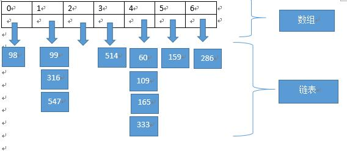


## 1.8 对比

每种数据结构有自己的特点跟优缺点，见如下表

| 数据结构 |                 优 点                  |                        缺 点                         |
| :------: | :------------------------------------: | :--------------------------------------------------: |
|   数组   |                 插入快                 |      查找慢，删除慢，大小固定，只能存储单一元素      |
|    栈    |         提供后进先出的存取方式         |                    存取其他项很慢                    |
|   队列   |         提供先进先出的存取方式         |                    存取其他项很慢                    |
|   链表   |             插入快，删除快             |                        查找慢                        |
|  二叉树  | 如果树是平衡的，则查找、插入、删除都快 |                     删除算法复杂                     |
|  红黑树  |    查找、删除、插入都快。树总是平衡    |                       算法复杂                       |
|  哈希表  |        如果关键字已知则存取极快        | 删除慢，如果不知道关键字存取慢，对存储空间使用不充分 |
