# 学习目标

- 掌握Oracle常用查询
- 掌握Oracle常用函数
- 掌握group by分组
- 掌握having分组后筛选
- 掌握DML语句

# 1. Oracle常用查询

查询是数据库中最常用的操作，熟练的掌握它是非常必要的。

创建商品表

```sql
create table S_PRODUCT(
  id           NUMBER(11) not null,
  name         VARCHAR2(255) not null,
  type         VARCHAR2(255) not null,
  origin_place VARCHAR2(255) not null,
  price        NUMBER(10) not null
)
```

## 1.1 常归查询

### 1.1.1 全部查询

通常情况下，使用*代替要查询的列，会比指定列的方式速度要慢，因为oracle需要对星号进行解析成具体的列再进行查询

```sql
-- 查询全部商品
select * from s_product;
```

### 1.1.2 全部查询（指定列）

```sql
-- 查询全部商品（指定列）
select name from s_product;
```

### 1.1.3 全部查询（别名）

建议写sql带上别名，养成良好的sql习惯

```sql
-- 查询全部商品（使用别名）
select p.* from s_product p;
```

### 1.1.4 查询总条数

```sql
-- 查询商品总条数
select count(*) from s_product p;
```

**注意：如果count（字段），且字段存在空值，则不会参与总条数计算**

例如：数据库中存在下面2条数据

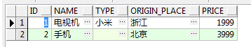 

使用count(*)或者count(name)，得到的结果是2

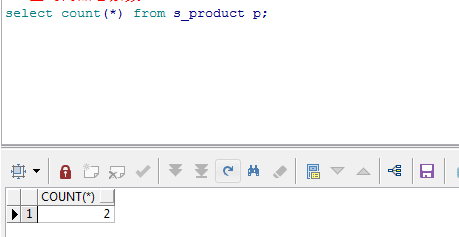 

如果使用count(type)，则结果为1，因为第2条记录的type是空值，不会被算进来

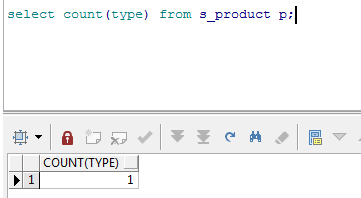 

- **查询带行号**

rownum是oracle中的特殊列，用来记录查询结果的行数。

```sql
select p.*,rownum from s_product p;
```

## 1.2 where条件查询

### 1.2.1 where条件

```sql
-- where条件
select * from s_product p where p.name = '手机'
```

### 1.2.2 and连接

```sql
-- and连接
select * from s_product p where p.name = '手机' and id = '2'
```

### 1.2.3 or连接

```sql
-- or连接
select * from s_product p where p.name = '手机' or p.name = '电视机'
```

### 1.2.4 between and

```sql
-- between and
select * from s_product p where p.price between 1000 and 4000
```

### 1.2.5 大于

```sql
-- 大于
select * from s_product p where p.price > 2000
```

### 1.2.6 大于等于

```sql
-- 大于等于
select * from s_product p where p.price >= 2000
```

### 1.2.7 小于

```sql
-- 小于
select * from s_product p where p.price < 5000
```

### 1.2.8 小于等于

```sql
-- 小于等于
select * from s_product p where p.price < 5000
```

### 1.2.9 使用大于小于代替between and

```sql
-- 使用大于小于代替between and
select * from s_product p where p.price >= 1000 and p.price <= 4000
```

### 1.2.10 模糊查询

```sql
-- 模糊查询
select * from s_product p where p.price like '%1%'
```

### 1.2.11 模糊查询（匹配前缀）

```sql
-- 模糊查询（匹配前缀）
select * from s_product p where p.name like '%机'
```

### 1.2.12 模糊查询（匹配后缀）

```sql
-- 模糊查询（匹配后缀）
select * from s_product p where p.name like '手%'
```

## 1.3 去重查询

如何将重复的结果或相同的列去重呢？可以使用关键字distinct来进行去重

```sql
select distinct(name) from s_product p;
```

# 2. Oracle常用函数

## 2.1 字符函数

### 2.1.1  INITCAP（ 首字母大写 ）

注意：dual是一张临时表

```sql
select initcap('hello') from dual;
```

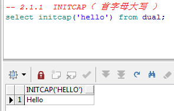 

### 2.1.2  LOWER（ 转换为小写）

```sql
select LOWER('HELLO') from dual;
```

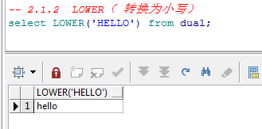 

### 2.1.3  UPPER（转换为大写）

```sql
select UPPER('hello') from dual;
```

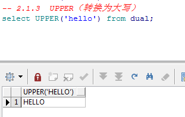 

### 2.1.4  REPLACE（ 字符串替换 ）

```sql
select REPLACE('hello', 'h', '123') from dual;
```

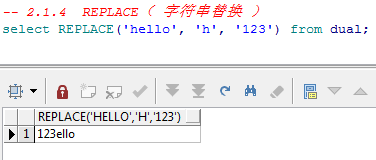 

### 2.1.5  INSTR（ 查找子串位置 ）

```sql
select INSTR('hello', 'o') from dual;
```

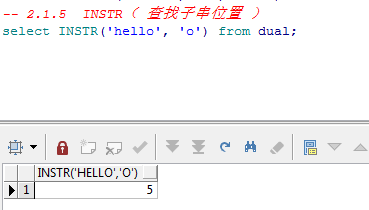 

### 2.1.6  SUBSTR（ 取子字符串 ）

```sql
--语法： SUBSTR('hello', 起始位置, 结束位置)
select SUBSTR('hello', 0, 3) from dual;
```

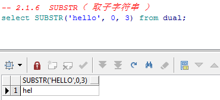 

### 2.1.7  CONCAT（ 连接字符串 ）

```sql
select CONCAT('hello', 'world') from dual;
```

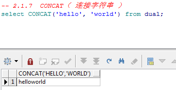 

## 2.2 数值函数

### 2.2.1  ABS（ 取绝对值 ）

```sql
select abs(-15) from dual;
```

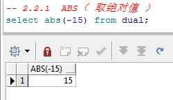 

### 2.2.2  CEIL（ 向上取整 ）

```sql
select CEIL(44.778) from dual;
```

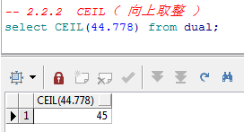 

### 2.2.3  FLOOR（向下取整）

```sql
select FLOOR(44.778) from dual;
```

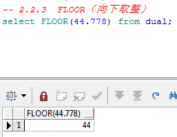 

### 2.2.4  MOD（取余）

```sql
select MOD(10,3) from dual;
```

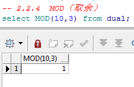 

### 2.2.5  ROUND（ 四舍五入 ）

```sql
select ROUND(100.256, 2) from dual;
```

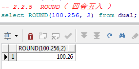 

### 2.2.6  TRUNC（截断）

```sql
select TRUNC(100.256, 2) from dual;
```

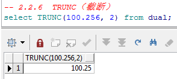 

## 2.3 转换函数

### 2.3.1 to_char()日期转字符串

```sql
--当前日期
select sysdate from dual;

-- 转换（默认），结果31-1月 -21
select to_char(sysdate) from dual;

-- 转换（指定日期格式），结果2021-01-31 19:52:57
select to_char(sysdate,'yyyy-MM-dd HH24:mi:ss') from dual;

```

### 2.3.2 to_date字符串转日期

注意，to_date的第1个参数和第2个参数的格式必须相同，否则会报错

```sql
-- 将字符串转成日期，格式为yyyy-MM-dd HH24:mi:ss
select to_date('2021-01-31 19:53:46', 'yyyy-MM-dd HH24:mi:ss') from dual;

-- 将字符串转成日期，格式为yyyy-MM-dd
select to_date('2021-01-31', 'yyyy-MM-dd') from dual;
```

# 3. Oracle分组函数

​		group by分组函数是对数据进行分组，再按分组的结果进行展示，每组数据只显示一条，多出的不显示，但多出的数据不是消失了，而是隐藏了，仍然可以使用聚合函数查询出来。

创建部门表，建表语句如下：

```sql
-- Create table
create table s_emp(
  id      number,
  name    varchar2(255),
  age     number,
  money   varchar2(255),
  dept    varchar2(255),
  address varchar2(255)
);
-- Add comments to the columns 
comment on column s_emp.name is '名称';
comment on column s_emp.age is '年龄';
comment on column s_emp.money is '工资';
comment on column s_emp.dept is '部门';
comment on column s_emp.address is '住址';

insert into S_EMP (ID, NAME, AGE, MONEY, DEPT, ADDRESS)values (3, '王五', 26, '4000', '测试部', '武汉');
insert into S_EMP (ID, NAME, AGE, MONEY, DEPT, ADDRESS)values (4, '赵六', 40, '2000', '保洁部', '武汉');
insert into S_EMP (ID, NAME, AGE, MONEY, DEPT, ADDRESS)values (5, '田七', 25, '7000', '设计部', '北京');
insert into S_EMP (ID, NAME, AGE, MONEY, DEPT, ADDRESS)values (6, '陈八', 30, '4000', '人事部', '南京');
insert into S_EMP (ID, NAME, AGE, MONEY, DEPT, ADDRESS)values (7, '石九', 35, '5000', '财务', '北京');
insert into S_EMP (ID, NAME, AGE, MONEY, DEPT, ADDRESS)values (8, '曹十', 20, '9000', '研发部', '上海');
```

1. 查出各部门的总人数

```sql
select e.dept ,count(e.dept) from s_emp e group by e.dept
```

2. 查出各部门的平均工资

```sql
select e.dept ,avg(e.money) from s_emp e group by e.dept
```

3. 查询部门平均工资大于6000的部门

```sql
select e.dept from s_emp e group by e.dept having avg(money)>6000
```

# 4. Oracle分页

Oracle没有直接的分页函数，但它有rownum字段，可以使用rownum来进行分页

下面案例表示查询前2条数据。

```sql
--第1页
select * from(select e.*,rownum rn from s_emp e) where rn >= 0 and rn < = 2
--第2页
select * from(select e.*,rownum rn from s_emp e) where rn >= 3 and rn < = 4
```

# 5. DML语句

## 5.1 insert

```sql
insert into S_EMP (ID, NAME, AGE, MONEY, DEPT, ADDRESS)values (3, '王五', 26, '4000', '测试部', '武汉');
```

## 5.2 update

```sql
update s_emp set name = '666' where id = '3'
```

## 5.3 delete

```sql
delete from s_emp where id = '8'
```

