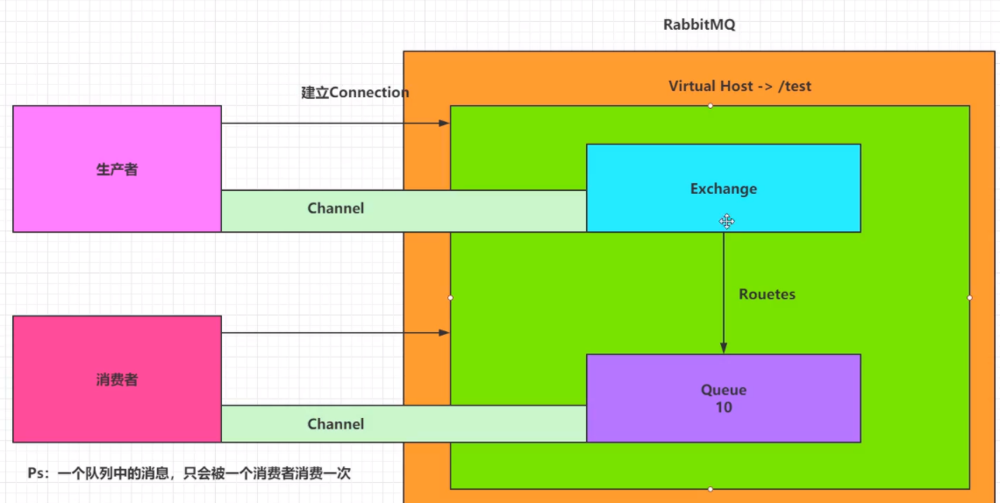
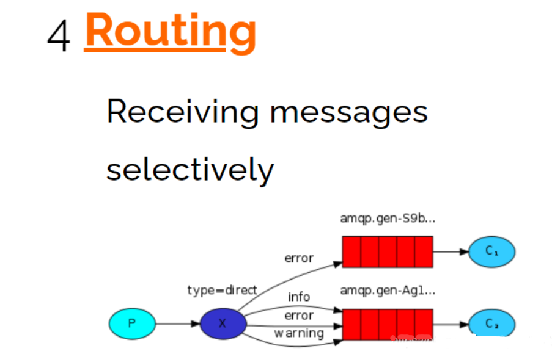

## 学习目标

- 了解RabbitMQ的作用及架构
- 掌握RabbitMQ安装及基本使用
- 掌握Springboot整合RabbitMQ

## 一.RabbitMQ安装

### 1.1 为什么使用RabbitMQ

> 1.降低耦合度
>
> 2.RabbitMQ速度快，微秒级别
>
> 3.学习成本低
>
> 4.支持多种语言

### 1.2 什么是RabbitMQ

> 1. RabbitMQ是一个由erlang开发的AMQP（Advanced Message Queue 高级消息队列协议）的开源实现
> 2. 能够实现异步消息处理

### 1.3 安装RabbitMQ

```
#在线安装
docker pull rabbitmq:management
#使用官方定义的端口号启动
docker run -d --hostname my-rabbit --name rabbit -p 15672:15672 -p 5672:5672 rabbitmq:management
```

## 二.RabbitMQ架构

### 2.1官方简单架构图

> 1.Publish-生产者（发布消息到RabbitMQ中的Exchange）
>
> 2.Exchange-交换机（与生产者建立连接并接收生产者的消息）
>
> 3.Routes-路由（交换机以什么样的策略消息发布到Queue）
>
> 4.Queue-队列（Exchange会将消息分发到指定的Queue，Queue和消费者进行交互）
>
> 5.Consumer-消费者（监听RabbitMQ中的Queue中的消息）


### 2.2Rabbit完整架构图



### 2.3查看图形化界面并创建一个Virtual Host

> Virtual Host:相当于RabbitMQ上的虚拟机，建立connection连接的时Virtual Host！
>
> 创建一个全新的用户和全新的Virtual Host,并且将test用户设置上可以操作/test-1的权限！


## 三.RabbitMQ使用

### 3.1RabbitMQ通讯方式


### 3.2 Java连接RabbitMQ

```
 public static Connection getConnection(){
        //创建Connection工厂
        ConnectionFactory factory = new ConnectionFactory();
        factory.setHost("192.168.61.134");
        factory.setPort(5672);
        factory.setVirtualHost("/test-1");
        factory.setPassword("test");
        factory.setUsername("test");

        Connection connection = null;
        //拿到连接
        try {
            connection  = factory.newConnection();
        } catch (IOException e) {
            e.printStackTrace();
        } catch (TimeoutException e) {
            e.printStackTrace();
        }

        return connection;
    }

```

### 3.3Hello-world


> 一个生产者，一个默认的交换机，一个队列，一个消费者

> 1、创建生产者，创建一个channel，发送消息到exchange，指定路由规则

```
//生产者
public static void publish() throws Exception {
    //1、获取connection
    Connection connection = RabbitConfig.getConnection();
    //2、创建channel
    Channel channel = connection.createChannel();
    //3、发送消息到exchange
      String msg = "hello world!!!";
    /**
     * 参数1：指定exchange，使用“”。默认的exchange
     * 参数2：指定路由的规则，使用具体的队列名称。exchange为""时，消息直接发送到队列中
     * 参数3：制动传递的消息携带的properties
     * 参数4：指定传递的消息，byte[]类型
     */
    channel.basicPublish("", "helloworld", null,msg.getBytes());
    //PS:exchange是不会将消息持久化的，Queue可以持久化，得配置

    System.out.println("生产者发布消息成功！");
    //4、关闭管道和连接
    channel.close();
    connection.close();

}
```

> 2、创建一个消费者，创建一个channel，创建一个队列，并且消费队列

```
//消费者  
public static void consumer() throws Exception{
    //1、获取连对象、
    Connection connection = RabbitConfig.getConnection();

    //2、创建channel
    Channel channel = connection.createChannel();

    //3、创建队列-helloworld
    /**
         * 参数1：queue 指定队列名称
         * 参数2：durable 是否开启持久化（true）
         * 参数3：exclusive 是否排外（conn.close()-》当前对列自动删除，当前队列只能被一个 消费者消费）
         * 参数4：autoDelete 如果这个队列没有其他消费者在消费，队列自动删除
         * 参数5：arguments 指定队列携带的信息
         *
         */
    channel.queueDeclare("helloworld",true,false,false,null);


    //4.开启监听Queue
    DefaultConsumer consumer = new DefaultConsumer(channel){
        @Override
        public void handleDelivery(String consumerTag, Envelope envelope, AMQP.BasicProperties properties, byte[] body) throws IOException {
            System.out.println("接收到消息:"+new String(body,"UTF-8"));
        }
    };
    /**
         * 参数1：queue 指定消费哪个队列
         * 参数1：deliverCallback 指定是否ACK（true:收到消息会立即告诉RabbiMQ，false：手动告诉）
         * 参数1：cancelCallback 指定消费回调
         *
         */
    channel.basicConsume("helloworld",true,consumer);
    System.out.println("消费者开始监听队列");

    //5、键盘录入，让程序不结束！
    System.in.read();

    //6、释放资源
    channel.close();
    connection.close();

}
```

### 3.4 Work


> 一个生产者，一个默认的交换机，一个队列，两个消费者

> 只需要在consumer消费者端，添加Qos能力以及更改为ACK手动即可让消费者根据自己的能力消费，不是RabbitMQ默认的平均分配了

```
//1指定当前消费者一次能消费多少条消息
channel.basicQos(1);

//2.开启监听Queue
DefaultConsumer consumer = new DefaultConsumer(channel){
    @Override
    public void handleDelivery(String consumerTag, Envelope envelope, AMQP.BasicProperties properties, byte[] body) throws IOException {
        System.out.println("消费者1号接收到消息:"+new String(body,"UTF-8"));
        try {
            Thread.sleep(100);
        } catch (InterruptedException e) {
            e.printStackTrace();
        }
        //手动ACK（接收信息，指定书否批量操作）
        channel.basicAck(envelope.getDeliveryTag(),false);
    }
};
//3.关闭自动ACK
    channel.basicConsume("work",false,consumer);

```

### 3.5 Publish/Subscribe


> 一个生产者，一个交换机，两个队列，两个消费者

> 声明一个Fanout类型的exchange，并且将exchange和queue绑定在一起，绑定规则直接绑定。

> 1、让生产者创建一个exchange并且指定类型，和一个或多个队列绑定在一起。当生产者发送消息是会发送到exchange中，再由exchange到绑定的队列中

```
//3、通过channel创建自己的exchange 并且绑定队列
    /**
     * 参数1：exchange的名称
     * 参数2：指定exchange的类型
     * FANOUT-Publish/Subscribe
     * DIRECT-Routing
     * TOPIC-Topics
     */

    channel.exchangeDeclare("publish-exchange", BuiltinExchangeType.FANOUT);
    channel.queueBind("pubsub-queue1","publish-exchange","");
    channel.queueBind("pubsub-queue2","publish-exchange","");

```

> 2、消费者还是监听指定队列即可。

### 3.6 Routing



> 一个生产者，一个交换机，两个队列，两个消费者

> 声明一个DIRECT类型的exchange，并且根据Routingkey绑定指定的队列
>
> 绑定生产者和消费者都可以做，因为两边都有channel

> 1、生产者在创建DIRECT类型的exchange后绑定相应的队列，并且指定Routingkey。在发送消息是也要指定消息的Routingkey

```
//3、创建exchange并且指定类型
channel.exchangeDeclare("routing-exchange", BuiltinExchangeType.DIRECT);

//4、绑定队列 routing-queue-error routing-queue-info
channel.queueBind("routing-queue-error", "routing-exchange", "ERROR");
channel.queueBind("routing-queue-info", "routing-exchange", "INFO");

//5、发送消息并且指定接收的队列的routingkey
channel.basicPublish("routing-exchange", "ERROR", null, "ERROR-MSG".getBytes());
channel.basicPublish("routing-exchange", "INFO", null, "INFO-1".getBytes());
channel.basicPublish("routing-exchange", "INFO", null, "INFO-2".getBytes());
channel.basicPublish("routing-exchange", "INFO", null, "INFO-3".getBytes());

```

> 2、消费者没变化，监听自己的队列即可

### 3.7 Topics


> 一个生产者，一个交换机，两个队列，两个消费者

> 1、生产者创建Topic的exchange并且并且指定队列，这次绑定可以通过*和#匹配关键字，对指定RoutingKey内容进行匹配。
>
> *（星号）可以代替一个单词。
>
> ＃（哈希）可以替代零个或多个单词。

```
//3、创建exchange
channel.exchangeDeclare("topics-exchange", BuiltinExchangeType.TOPIC);

//4、绑定队列 topics-queue-1 topics-queue-2
channel.queueBind("topics-queue-1", "topics-exchange", "zhang.*");
channel.queueBind("topics-queue-2", "topics-exchange", "wang.*");
channel.queueBind("topics-queue-2", "topics-exchange", "wang.#;");

//3、发送消息到exchange
channel.basicPublish("topics-exchange", "zhang.sna", null, "张三".getBytes());
channel.basicPublish("topics-exchange", "zhang.sna.sna", null, "张三三".getBytes());
channel.basicPublish("topics-exchange", "wang.wu", null, "王五".getBytes());
channel.basicPublish("topics-exchange", "wang.ergou", null, "王二狗".getBytes());
System.out.println("生产者发布消息成功！");

```

> 2、消费者无变化，监听指定的队列即可

## 四. Springboot整合RabbitMQ

### 4.1 helloword 模型

#### 配置文件

```
spring:
  # 配置虚拟主机
  rabbitmq:
    host: 127.0.0.1
    port: 5672
    username: test
    password: test
    virtual-host: test
```


#### 引入依赖

```
<?xml version="1.0" encoding="UTF-8"?>
<project xmlns="http://maven.apache.org/POM/4.0.0"
         xmlns:xsi="http://www.w3.org/2001/XMLSchema-instance"
         xsi:schemaLocation="http://maven.apache.org/POM/4.0.0 http://maven.apache.org/xsd/maven-4.0.0.xsd">
    <modelVersion>4.0.0</modelVersion>

    <parent>
        <groupId>org.springframework.boot</groupId>
        <artifactId>spring-boot-starter-parent</artifactId>
        <version>2.4.1</version>
        <relativePath/> <!-- lookup parent from repository -->
    </parent>
    <groupId>org.example</groupId>
    <artifactId>demo1</artifactId>
    <version>1.0-SNAPSHOT</version>

    <properties>
        <java.version>8</java.version>
    </properties>
    <dependencies>

        <!-- https://mvnrepository.com/artifact/org.springframework.boot/spring-boot-starter-amqp -->
        <dependency>
            <groupId>org.springframework.boot</groupId>
            <artifactId>spring-boot-starter-amqp</artifactId>
        </dependency>

        <dependency>
            <groupId>org.springframework.boot</groupId>
            <artifactId>spring-boot-starter-test</artifactId>
        </dependency>

    </dependencies>

    <build>
        <plugins>
            <plugin>
                <groupId>org.springframework.boot</groupId>
                <artifactId>spring-boot-maven-plugin</artifactId>
            </plugin>
        </plugins>
    </build>

</project>

```

#### 创建生产者

```
package com.ak.demo;

import org.junit.jupiter.api.Test;

import org.springframework.amqp.rabbit.core.RabbitTemplate;
import org.springframework.beans.factory.annotation.Autowired;
import org.springframework.boot.test.context.SpringBootTest;
import org.springframework.test.context.junit4.SpringRunner;

@SpringBootTest(classes = RabbitmqSpringApplication.class)
public class MyTest {
    @Autowired
    private RabbitTemplate rabbitTemplate;

    @Test
    public  void test(){
        rabbitTemplate.convertAndSend("hello","hello world");
    }
}

```

#### 创建消费者

```
package com.ak.demo.hello;

import org.springframework.amqp.rabbit.annotation.Queue;
import org.springframework.amqp.rabbit.annotation.RabbitHandler;
import org.springframework.amqp.rabbit.annotation.RabbitListener;
import org.springframework.stereotype.Component;

/**
 * 默认持久化队列
 */
@Component
@RabbitListener(queuesToDeclare =@Queue("hello"))
public class HelloCustomer {

    @RabbitHandler
    public void kk(String message){
        System.out.println(message);
    }
}

```

#### 目录结构


### 4.2 workquene 模型

#### 修改work 类

```
 @Test
    public  void test2(){
        for(int i=0;i<10;i++){
            rabbitTemplate.convertAndSend("work","work 模型");
        }
    }

```

#### 创建消费者

```
package com.ak.demo.work;

import org.springframework.amqp.rabbit.annotation.Queue;
import org.springframework.amqp.rabbit.annotation.RabbitListener;
import org.springframework.stereotype.Component;

@Component
public class WorkConsumer {

    @RabbitListener(queuesToDeclare =@Queue("work"))
    public void receive(String messaage){
        System.out.println("消费者1---"+messaage);
    }

    @RabbitListener(queuesToDeclare =@Queue("work"))
    public void receive2(String messaage){
        System.out.println("消费者2--"+messaage);
    }
}


```


### 4.3 广播模式

#### 创建生产者

```
 /**
     * 广播形式的发布信息
     */
    @Test
    public  void test3(){

        for(int i=0;i<10;i++){
            rabbitTemplate.convertAndSend("kk","","广播信息");
        }
    }

```

#### 创建消费者

```
package com.ak.demo.fanout;

import org.springframework.amqp.rabbit.annotation.Exchange;
import org.springframework.amqp.rabbit.annotation.Queue;
import org.springframework.amqp.rabbit.annotation.QueueBinding;
import org.springframework.amqp.rabbit.annotation.RabbitListener;
import org.springframework.stereotype.Component;

@Component
public class FanOutConsumer {

    @RabbitListener(bindings = {
            @QueueBinding(
                    value =@Queue,
                    exchange = @Exchange(value = "kk",type = "fanout")
            )
    })
    public void receive(String message){
        System.out.println("----");
        System.out.println("广播信息1"+message);
    }

    @RabbitListener(bindings = {
            @QueueBinding(
                    value =@Queue,
                    exchange = @Exchange(value = "kk",type = "fanout")
            )
    })
    public void receive2(String message){
        System.out.println("----");
        System.out.println("广播信息2"+message);
    }
}


```


### 4.4 直连模式

#### 创建生产者

```
/**
     * 测试路由模型
     */
    @Test
    public void testDirect(){
        String []routeKey={"error","info","waring","debug"};
        for(int i=0;i<10;i++){
            int temp=new Random().nextInt(100)%4;
            rabbitTemplate.convertAndSend("directs",routeKey[temp],routeKey[temp]+"的日志信息");
        }

    }

```

#### 创建消费者

```
package com.ak.demo.router;

import org.springframework.amqp.rabbit.annotation.Exchange;
import org.springframework.amqp.rabbit.annotation.Queue;
import org.springframework.amqp.rabbit.annotation.QueueBinding;
import org.springframework.amqp.rabbit.annotation.RabbitListener;
import org.springframework.stereotype.Component;

@Component
public class DirectConsumer {

    String []routeKey={"error","info","waring","debug"};
    @RabbitListener(bindings = {
            @QueueBinding(
                    value = @Queue,// 临时队列
                    exchange = @Exchange(value = "directs",type = "direct"),
                    key={"error","info","waring","debug"}
            )
    })
    public void receive(String message){
        System.out.println("接受全部信息--"+message);
    }


    @RabbitListener(bindings = {
            @QueueBinding(
                    value = @Queue,// 临时队列
                    exchange = @Exchange(value = "directs",type = "direct"),
                    key={"error"}
            )
    })
    public void receive2(String message){
        System.out.println("只接受error--"+message);
    }
}


```


### 4.5 Topic 模式

#### 创建生产者

```
@Test
    public void testFive(){
        String []routeKey={"user.save","user.add","admin.add","admin.save"};
        for(int i=0;i<10;i++){
            int temp=new Random().nextInt(100)%4;
            rabbitTemplate.convertAndSend("topics",routeKey[temp],routeKey[temp]+"信息");
        }
    }

```

#### 消费者

```
package com.ak.demo.topic;

import org.springframework.amqp.rabbit.annotation.Exchange;
import org.springframework.amqp.rabbit.annotation.Queue;
import org.springframework.amqp.rabbit.annotation.QueueBinding;
import org.springframework.amqp.rabbit.annotation.RabbitListener;
import org.springframework.stereotype.Component;

@Component
public class TopicConsumer {

    @RabbitListener(bindings = {
            @QueueBinding(
                    value = @Queue,
                    exchange = @Exchange(name = "topics",type = "topic"),
                    key={"user.*"}
            )
    })
    public void receive(String message){
        System.out.println("user类---"+message);
    }

    @RabbitListener(bindings = {
            @QueueBinding(
                    value = @Queue,
                    exchange = @Exchange(name = "topics",type = "topic"),
                    key={"admin.*"}
            )
    })
    public void receive2(String message){
        System.out.println("admin 类--"+message);
    }
}


```

