# 学习目标

```
1、持续集成/持续交付/持续部署
2、Jenkins简介
3、Jenkins安装
4、Jenkins配置
5、Jenkins部署SpringBoot项目
```

# 1、持续集成/持续交付/持续部署

持续集成（Continuous Integration）
软件开发团队更加频繁的集成他们的代码，通常每天一次或每天多次，这样能够尽早的发现问题。

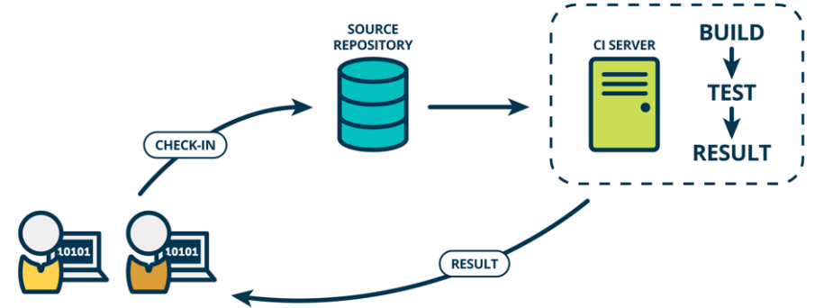

持续交付（Continuous Delivery）
一种能够使得软件在较短的循环中可靠的发布的软件工程方法，核心不在于代码，而在于交付的产品，在完成集成后，还要完成测试，再把产品发布到类生产（Staging）环境中，如果没有问题再手动部署到生产环境中。

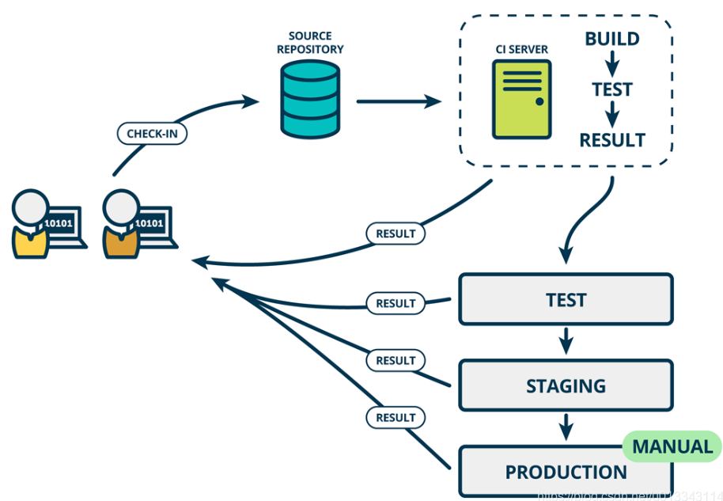

持续部署（Continuous deployment）
过程类似持续交付，就是最后部署到生产环境的过程，也改为了自动部署。

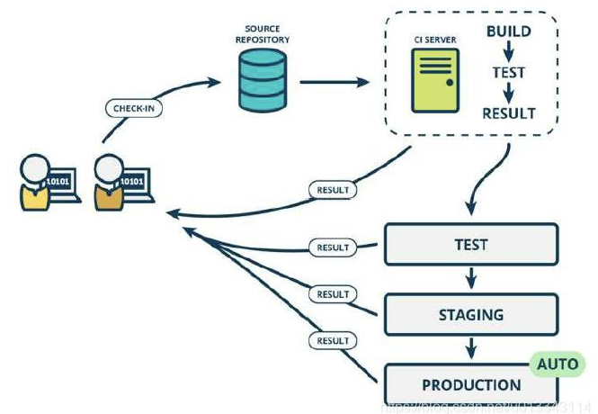


#  2、Jenkins简介


## 2.1 Jenkins是什么

Jenkins是一个开源的持续集成工具，基于Java开发，提供了大量的插件来支持构建、测试、部署各种项目。

# 3、安装Jenkins

首先要保证安装了JDK
在线安装Jenkins

```
wget -O /etc/yum.repos.d/jenkins.repo \
    https://pkg.jenkins.io/redhat-stable/jenkins.repo
rpm --import https://pkg.jenkins.io/redhat-stable/jenkins.io.key
dnf upgrade
dnf install jenkins java-devel
```

dnf是更新Jenkins，如果命令找不到的话，可以安装下

```
yum install epel-release
yum install dnf
```


启动Jenkins服务

```
systemctl start jenkins
```


查看Jenkins状态，出现running就代表启动成功

```
systemctl status jenkins
```

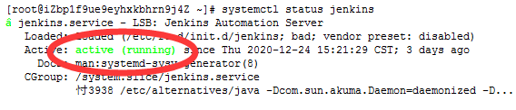

# 4、Jenkins初始化

在浏览器输入：http://你的电脑ip:8080
就可以看到解锁页面，在红字标记的文件位置找到密码，然后复制粘贴到密码框中


然后自定义Jenkins，新手就选择推荐的插件

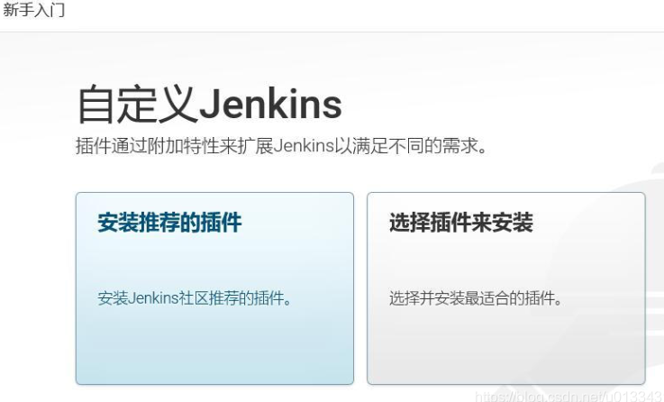

后面就是等Jenkins安装插件，最后就创建自己的管理员用户


# 5、简单测试Jenkins

创建一个简单的测试案例，来检验Jenkins的基本功能
1）点击新建Item菜单

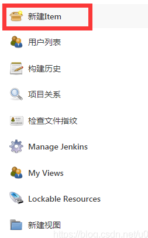

2）输入项目名字，然后选择自由风格的项目

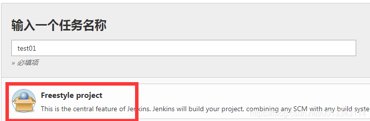

3）在配置页面中，添加构建步骤，选择执行shell

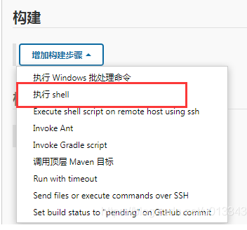

输入ifconfig，查看ip地址

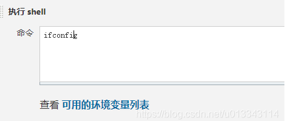

4）点击保存，回到控制面板就可以看到刚才新建的任务，点击名字下的立即构建


5）在后面可以看到构建结果，点击控制台输出

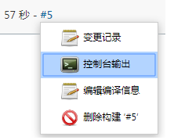

出现了ifconfig命令的结果

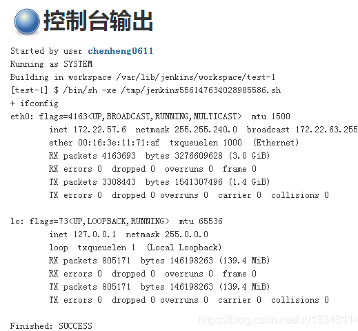

# 6、Jenkins部署SpringBoot项目

## 6.1 Jenkins的配置
Jenkins的配置文件在 /etc/sysconfig/jenkins
修改Jenkins的用户为root，这样会拥有更大的访问权限，方便使用

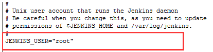

修改了端口，默认的8080端口，容易出现冲突


## 6.2 Jenkins的目录
介绍下Jenkins目录，在构建脚本中用得到
Jenkins的主目录在 /var/lib/jenkins中
主要的几个目录：

- jobs
  创建的任务目录
- logs
    存放日志
- nodes
    部署节点
- plugins
    插件目录
- secrets
    密钥目录
- workspace
    项目构建的工作空间

## 6.4 安装插件
Jenkins的一大特点是可以整合大量的插件，帮助管理代码、构建项目等。

我们需要安装Maven插件来帮助构建项目，整合Git插件帮助拉取代码、管理分支等。

点击Manage Jenkins > Mange Plugins

**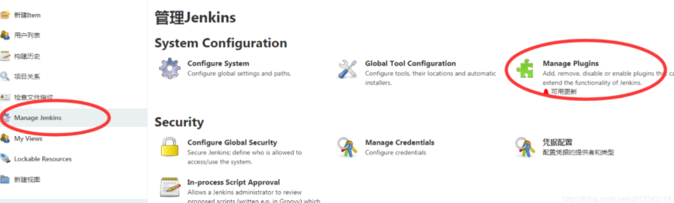**

在可选插件中搜索插件，安装后重新Jenkins就可以了

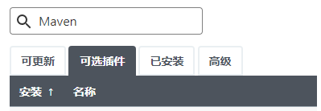

需要安装Git和Maven Integration plugin插件

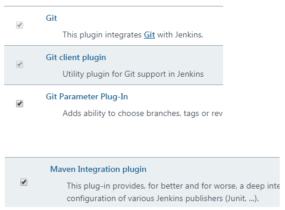

## 6.5 Webhook配置
我们需要实现项目的自动构建，也就是开发人员提交代码到git仓库后，jenkins自动拉取git上最新的代码，然后利用maven构建项目，最后部署到服务器上。

Webhook是Git服务器的一种通知机制，开发人员提交代码后，会通过Webhook配置的URL，给其它服务发送通知，如：通知Jenkins拉取最新的代码。

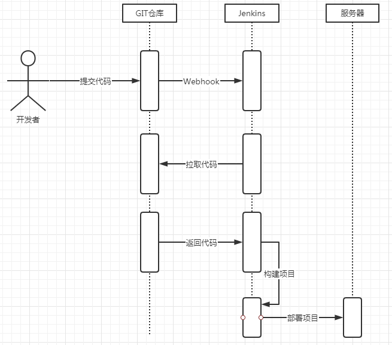

1） 进入到Github的项目仓库中，在settings中的Webhooks添加Webhook

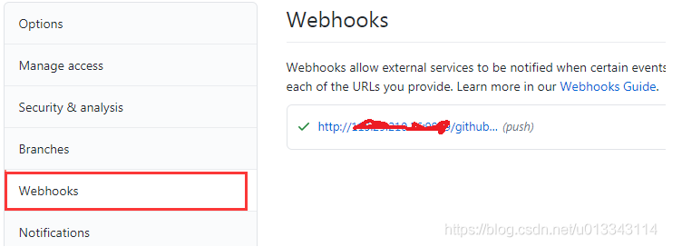

2） 配置如下

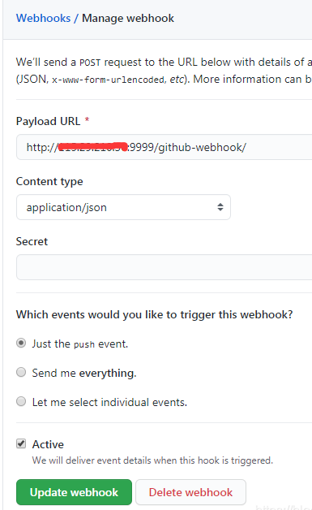

Payload URL中前面的IP和端口就是Jenkins的地址
3）添加凭据
在Gibhub的个人配置中，点击开发者配置

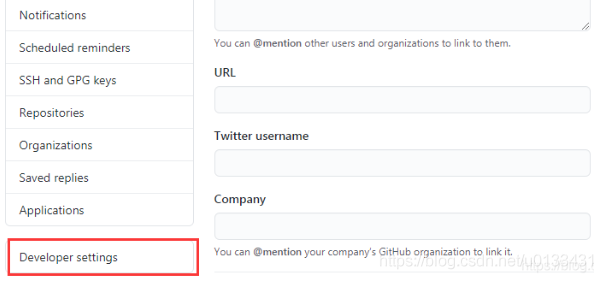

添加一个token

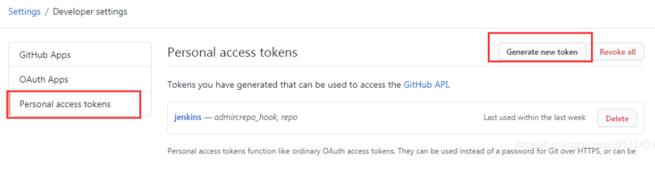

勾选下面的权限

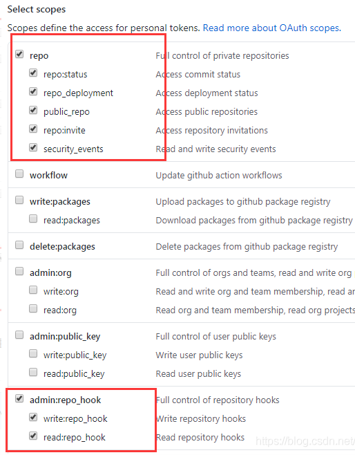

把生成的秘钥Copy下来，后面需要

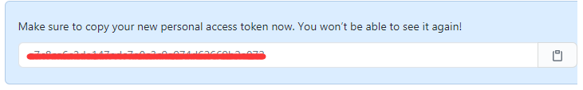

## 6.6 创建部署任务
1） 新建一个Maven项目

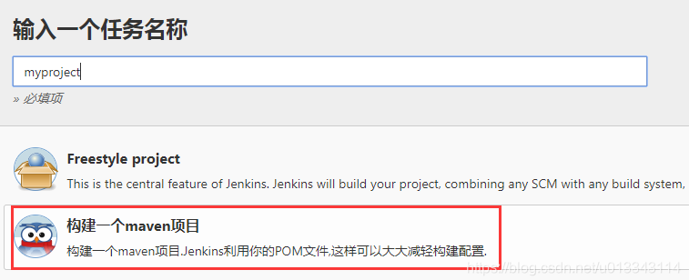

2） 添加项目的描述，可以选择丢弃旧的构建，以节约磁盘空间

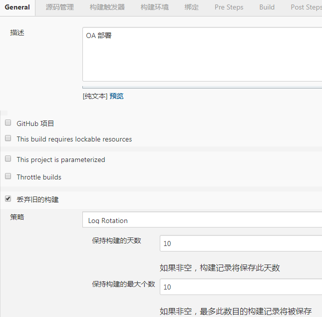

3） 源码管理里添加Git仓库地址

项目部署时，会从git拉取最新的代码

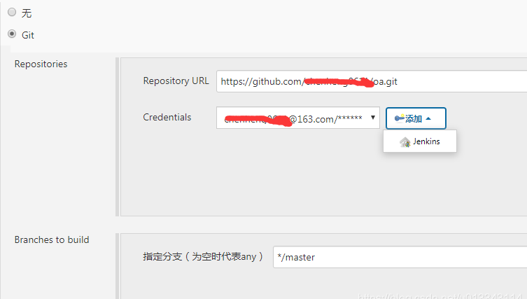

4） 然后Credentials里面添加凭据，这里是Github的账号、密码

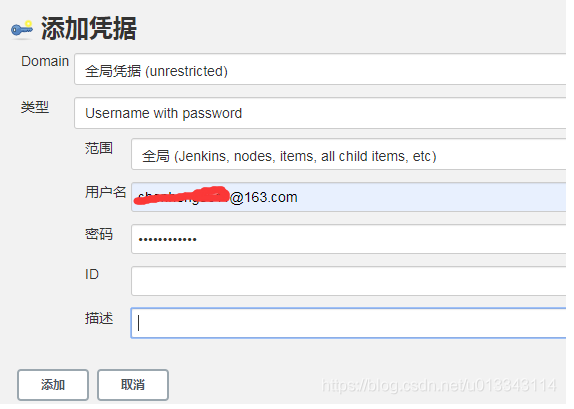

5）构建触发器，第一个是构建快照版本后触发，第二个是提交代码后由Webhook触发

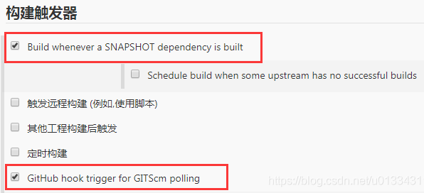

6）构建环境里面选择Use secret text，点击Secret Text，添加Secret text凭据

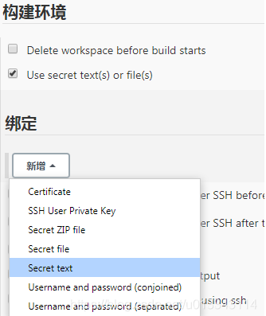

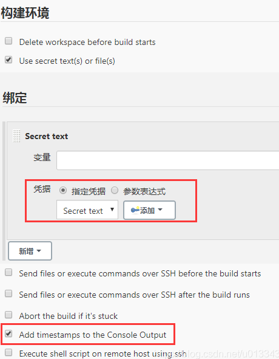

把GitHub生成的秘钥填到这里

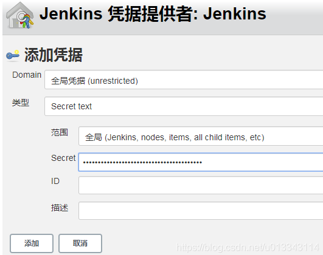

7） Pre Steps
添加一行命令，跳过了测试

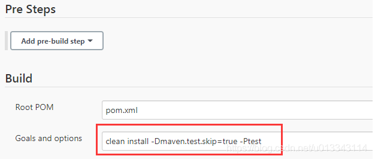

8） Post Steps
输入shell脚本

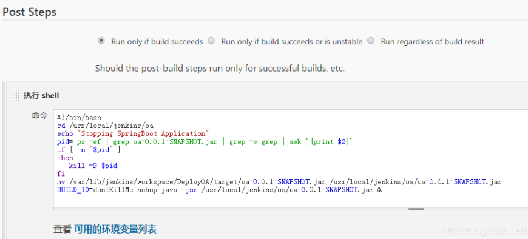

这个shell脚本就是部署的重点了
注意：本文案例中Jenkins和部署项目都在同一台服务器上。
首先在服务器的/usr/local下创建jenkins/oa目录作为部署项目的目录

```
#!/bin/bash
# 切换到部署目录
cd /usr/local/jenkins/oa
echo "Stopping SpringBoot Application"
# 查找到之前jar文件运行的pid，干掉之前的进程
pid=`ps -ef | grep oa-0.0.1-SNAPSHOT.jar | grep -v grep | awk '{print $2}'`
if [ -n "$pid" ]
then
   kill -9 $pid
fi
# 从jenkins的workspace中把刚生成的jar文件覆盖oa目录下原来的jar文件
mv /var/lib/jenkins/workspace/DeployOA/target/oa-0.0.1-SNAPSHOT.jar /usr/local/jenkins/oa/oa-0.0.1-SNAPSHOT.jar
# 重新运行新的jar文件
BUILD_ID=dontKillMe nohup java -jar /usr/local/jenkins/oa/oa-0.0.1-SNAPSHOT.jar &

```


9） 构建设置中可以配置邮箱，构建后会邮件通知

最后保存任务，就完成了配置

## 6.7 部署项目测试
在原来项目中添加一段简单的测试代码

```
@RestController
public class HelloController
{
    @GetMapping("/hello")
    public String hello(){
        return "Hello Jenkins!!";
    }
}
```


提交代码到Github上

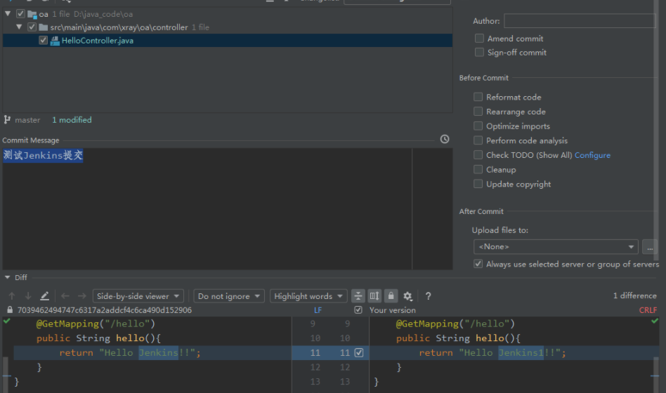

点到新建的构建任务里面，在左下方的构建历史中，可以看到最新的构建情况，点击控制台输出

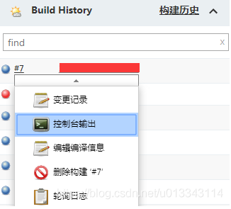

控制台输出可以看到shell脚本执行的情况，以及最后的状态

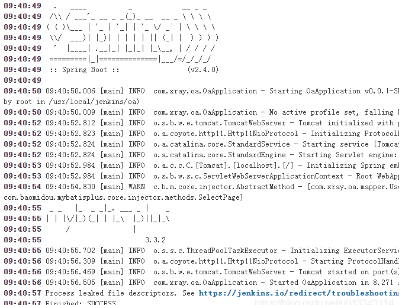

运行效果就是最新提交的代码


