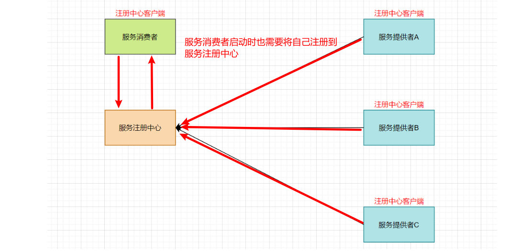
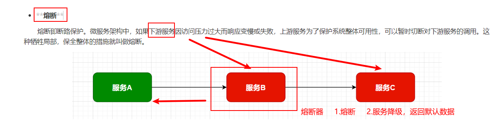
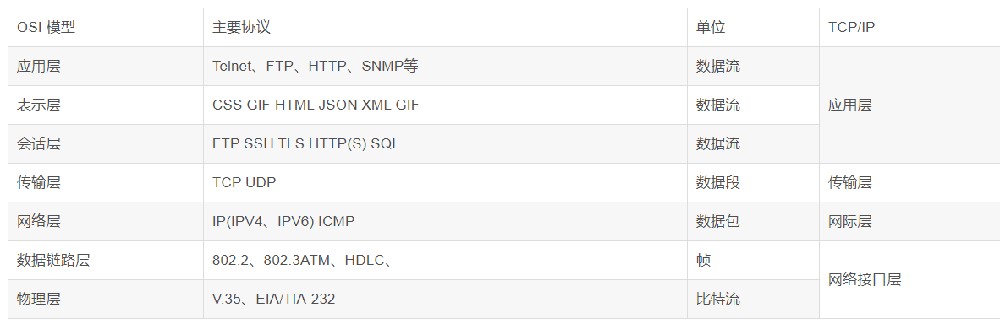
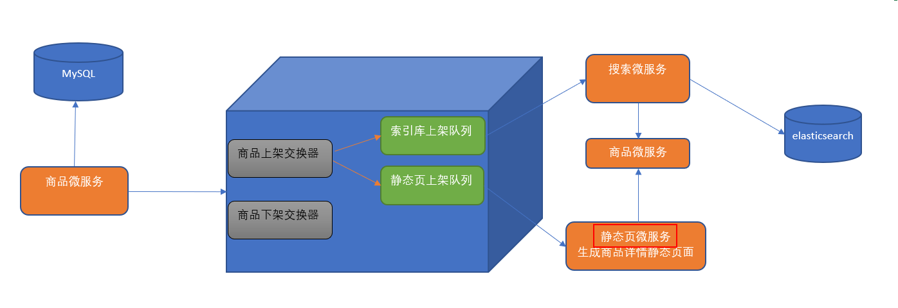
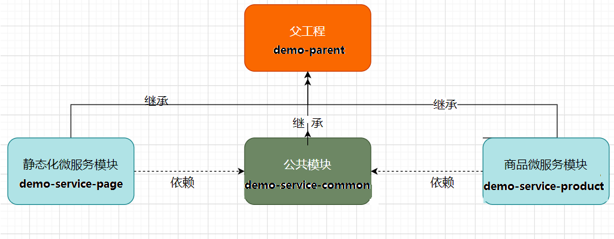
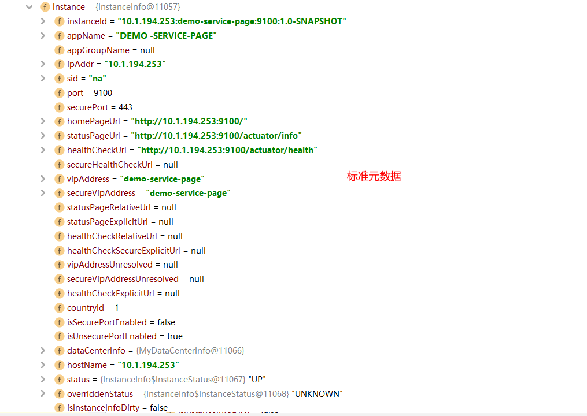
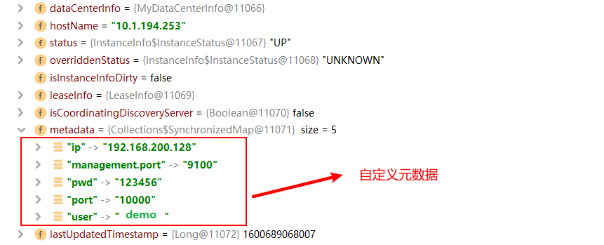
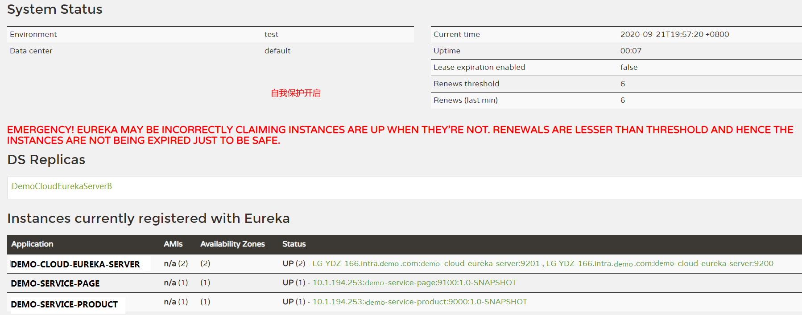

## 目录

[toc]

## 第一部分 微服务架构

### 第 1 节 互联网应用架构演进

​	随着互联网的发展，用户群体逐渐扩大，网站的流量成倍增长，常规的单体架构已无法满足请求压力和业务的快速迭代，架构的变化势在必行。下面我们就以系统网的架构演进为例，从最开始的单体架构分析，一步步的到现在的微服务架构。

​	淘宝：LAMP，Linux、Apache、MySQL、PHP

### 	1）单体应用架构

​		在诞生之初，系统的用户量、数据量规模都比较小，项目所有的功能模块都放在一个工程中编码、编译、打包并且部署在一个Tomcat容器中的架构模式就是单体应用架构，这样的架构既简单实用、便于维护，成本又低，成为了那个时代的主流架构方式。


**优点：**

* **高效开发**：项目前期开发节奏快，团队成员少的时候能够快速迭代
* **架构简单**：MVC架构，只需要借助IDE开发、调试即可
* **易于测试**：只需要通过单元测试或者浏览器完成
* **易于部署**：打包成单个可执行的jar或者打成war包放到容器内启动


​	单体架构的应用比较容易部署、测试， 在项目的初期，单体应用可以很好地运行。然而，随着需求的不断增加， 越来越多的人加入开发团队，代码库也在飞速地膨胀。慢慢地，单体应用变得越来越臃肿，可维护性、灵活性逐渐降低，维护成本越来越高。

**缺点：**

* **可靠性差**： 某个应用Bug，例如死循环、内存溢出等， 可能会导致整个应用的崩溃
* **复杂性高**： 以一个百万行级别的单体应用为例，整个项目包含的模块多、模块的边界模糊、 依赖关系不清晰、 代码质量参差不齐、 混乱地堆砌在一起。使得整个项目非常复杂。 
* **扩展能力受限**： 单体应用只能作为一个整体进行扩展，无法根据业务模块的需要进行伸缩。例如，应用中有的模块是计算密集型的，它需要强劲的CPU； 有的模块则是IO密集型的，需要更大的内存。 由于这些模块部署在一起，不得不在硬件的选择上做出妥协。

业务量上涨之后，单体应用架构进一步丰富变化，比如应用集群部署、使用Nginx进行负载均衡、增加缓存服务器、增加文件服务器、数据库集群并做读写分离等，通过以上措施增强应对高并发的能力、应对一定的复杂业务场景，但依然属于单体应用架构。


### 2）垂直应用架构

​		为了避免上面提到的那些问题，开始做模块的垂直划分，做垂直划分的原则是基于系统现有的业务特性来做，核心目标第一个是为了业务之间互不影响，第二个是在研发团队的壮大后为了提高效率，减少组件之间的依赖。


​		**优点**

* 系统拆分实现了流量分担，解决了并发问题 

* 可以针对不同模块进行优化 

* 方便水平扩展，负载均衡，容错率提高

* 系统间相互独立，互不影响，新的业务迭代时更加高效

  **缺点**

* 服务之间相互调用，如果某个服务的端扣或者ip地址发生改变，调用的系统得手动改变

* 搭建集群之后，实现负载均衡比较复杂，如：内网负载，在迁移机器时会影响调用方的路 由，导致线上故障

* 服务之间调用方式不统一，基于 httpclient 、 webservice ，接口协议不统一

* 服务监控不到位：除了依靠端口、进程的监控，调用的成功率、失败率、总耗时等等这些监 控指标是没有的


### 3）SOA应用架构

​		在做了垂直划分以后，模块随之增多，维护的成本在也变高，一些通用的业务和模块重复的越来越多，为了解决上面提到的接口协议不统一、服务无法监控、服务的负载均衡，引入了阿里巴巴开源的 Dubbo ，一款高性能、轻量级的开源Java RPC框架，可以和Spring框架无缝集成。它提供了三个核心能力：面向接口的远程方法调用，智能容错和负载均衡，以及服务自动注册和发现。

​		SOA (Service-Oriented Architecture)，即面向服务的架构。根据实际业务，把系统拆分成合适的、独立部署的模块，模块之间相互独立（通过Webservice/Dubbo等技术进行通信）。

​		优点：分布式、松耦合、扩展灵活、可重用。

​		缺点：服务抽取粒度较大、服务调用方和提供方耦合度较高（接口耦合度）


### 4）微服务应用架构

​		微服务架构可以说是SOA架构的一种拓展，这种架构模式下它**拆分粒度更小**、服务更独立。把应用拆分成为一个个微小的服务，不同的服务可以使用不同的开发语言和存储，服务之间往往通过Restful等轻量级通信。微服务架构关键在于**微小、独立、轻量级通信**。

​		微服务是在 SOA 上做的升华粒度更加细致，微服务架构强调的⼀个重点是**业务需要彻底的组件化和服务化**


微服务架构和SOA架构相似又不同

​		微服务架构和SOA架构很明显的一个区别就是**服务拆分粒度的不同**，但是对于系统的架构发展来说，我们所看到的SOA阶段其实服务拆分粒度相对来说已经比较细了（超前哦！），所以上述系统SOA到系统微服务，从服务拆分上来说变化并不大，只是引入了相对完整的新一代Spring Cloud微服务技术。自然，上述我们看到的都是系统架构演变的阶段结果，每一个阶段其实都经历了很多变化，系统的服务拆分其实也是走过了从粗到细，并非绝对的一步到位。

​		举个系统案例来说明SOA和微服务拆分粒度不同

​		我们在SOA架构的初期，“简历投递模块”和“人才搜索模块”都有简历内容展示的需求，只不过说可能略有区别，一开始在两个模块中各维护了一套简历查询和展示的代码；后期我们将服务更细粒度拆分，拆分出简历基础服务，那么不同模块调用这个基础服务即可。


### 第 2 节 微服务架构体现的思想及优缺点

​		微服务架构设计的核心思想就是**“微”**，拆分的粒度相对比较小，这样的话单一职责、开发的耦合度就会降低、微小的功能可以独立部署扩展、灵活性强，升级改造影响范围小。

**微服务架构的优点**:   微服务架构和微服务

* 微服务很小，便于特定业务功能的聚焦
* 微服务很小，每个微服务都可以被一个小团队单独实施（开发、测试、部署上线、运维），团队合作一定程度解耦，便于实施敏捷开发
* 微服务很小，便于重用和模块之间的组装
* 微服务很独立，那么不同的微服务可以使用不同的语言开发，松耦合
* 微服务架构下，我们更容易引入新技术

  

**微服务架构的缺点**

* 微服务架构下，分布式复杂难以管理，当服务数量增加，管理将越加复杂；

* 微服务架构下，分布式链路跟踪难等；

  

### 第 3 节 微服务架构中的核心概念

* **服务注册与服务发现**

  例如：职位搜索 ->简历服务

  ​	服务提供者：简历服务

  ​	服务消费者：职位搜索

​		**服务注册：**服务提供者将所提供服务的信息（服务器IP和端口、服务访问协议等）注册/登记到注册中心

​		**服务发现：**服务消费者能够从注册中心获取到较为实时的服务列表，然后根究一定的策略选择一个服务访问




- **负载均衡**

负载均衡即将请求压力分配到多个服务器（应用服务器、数据库服务器等），以此来提高服务的性能、可靠性	


* **熔断**

​		熔断即断路保护。微服务架构中，如果下游服务因访问压力过大而响应变慢或失败，上游服务为了保护系统整体可用性，可以暂时切断对下游服务的调用。这种牺牲局部，保全整体的措施就叫做熔断。





- **链路追踪**

微服务架构越发流行，一个项目往往拆分成很多个服务，那么一次请求就需要涉及到很多个服务。不同的微服务可能是由不同的团队开发、可能使用不同的编程语言实现、整个项目也有可能部署在了很多服务器上（甚至百台、千台）横跨多个不同的数据中心。所谓链路追踪，就是对一次请求涉及的很多个服务链路进行日志记录、性能监控


* **API 网关**

​		微服务架构下，不同的微服务往往会有不同的访问地址，客户端可能需要调用多个服务的接口才能完成一个业务需求，如果让客户端直接与各个微服务通信可能出现：

​		1）客户端需要调用不同的url地址，增加了维护调用难度

​		2）在一定的场景下，也存在跨域请求的问题（前后端分离就会碰到跨域问题，原本我们在后端采用Cors就能解决，现在利用网关，那么就放在网关这层做好了）

​		3）每个微服务都需要进行单独的身份认证

​		那么，API网关就可以较好的统一处理上述问题，API请求调用统一接入API网关层，由网关转发请求。API网关更专注在安全、路由、流量等问题的处理上（微服务团队专注于处理业务逻辑即可），它的功能比如

​		1）统一接入（路由）

​		2）安全防护（统一鉴权，负责网关访问身份认证验证，与“访问认证中心”通信，实际认证业务逻辑交移“访问认证中心”处理）

​		3）黑白名单（实现通过IP地址控制禁止访问网关功能，控制访问）

​		3）协议适配（实现通信协议校验、适配转换的功能）

​		4）流量管控（限流）

​		5）长短链接支持

​		6）容错能力（负载均衡）


## 第二部分 Spring Cloud 综述

### 第 1 节 Spring Cloud 是什么

​	**[百度百科]**Spring Cloud是一系列框架的有序集合。它利用Spring Boot的开发便利性巧妙地简化了分布式系统基础设施的开发，如服务发现注册、配置中心、消息总线、负载均衡、断路器、数据监控等，都可以用 Spring Boot的开发风格做到一键启动和部署。**Spring Cloud并没有重复制造轮子，它只是将目前各家公司开发的比较成熟、经得起实际考验的服务框架组合起来，通过Spring Boot风格进行再封装屏蔽掉了复杂的配置和实现原理，最终给开发者留出了一套简单易懂、易部署和易维护的分布式系统开发工具包**。

​		Spring Cloud是一系列框架的有序集合（Spring Cloud是一个规范）

​		开发服务发现注册、配置中心、消息总线、负载均衡、断路器、数据监控等

​		利用Spring Boot的开发便利性简化了微服务架构的开发（自动装配）


这里，我们需要注意，Spring Cloud其实是一套规范，是一套用于构建微服务架构的规范，而不是一个可以拿来即用的框架（所谓规范就是应该有哪些功能组件，然后组件之间怎么配合，共同完成什么事情）。在这个规范之下第三方的Netflix公司开发了一些组件、Spring官方开发了一些框架/组件，包括第三方的阿里巴巴开发了一套框架/组件集合Spring Cloud Alibaba，这些才是Spring Cloud规范的实现。

​		Netflix搞了一套 ，简称SCN

​		Spring Cloud 吸收了Netflix公司的产品基础之上自己也搞了几个组件 

​		阿里巴巴在之前的基础上搞出了一堆微服务组件,Spring Cloud Alibaba（SCA）


### 第 2 节 Spring Cloud 解决什么问题

​		Spring Cloud 规范及实现意图要解决的问题其实就是微服务架构实施过程中存在的一些问题，比如微服务架构中的服务注册发现问题、网络问题（比如熔断场景）、统一认证安全授权问题、负载均衡问题、链路追踪等问题。

- Distributed/versioned configuration （分布式/版本化配置）

- Service registration and discovery （服务注册和发现）

- Routing （智能路由）

- Service-to-service calls （服务调用）

- Load balancing （负载均衡）

- Circuit Breakers （熔断器）

- Global locks  （全局锁）

- Leadership election and cluster state （ 选举与集群状态管理）

- Distributed messaging  （分布式消息传递平台）

  

### 第 3 节 Spring Cloud 架构

​		如前所述，Spring Cloud是一个微服务相关规范，这个规范意图为搭建微服务架构提供一站式服务，**采用组件（框架）化机制**定义一系列组件，各类组件针对性的处理微服务中的特定问题，这些组件共同来构成**Spring Cloud微服务技术栈**


#### 3.1 Spring Cloud 核心组件

​		Spring Cloud 生态圈中的组件，按照发展可以分为第一代 Spring Cloud组件和第二代 Spring Cloud组件。

|                | 第一代 Spring Cloud（Netflix，SCN）                   | 第二代 Spring Cloud（主要就是Spring Cloud Alibaba，SCA） |
| :------------- | :---------------------------------------------------- | -------------------------------------------------------- |
| 注册中心       | Netflix Eureka                                        | 阿里巴巴 Nacos                                           |
| 客户端负载均衡 | Netflix Ribbon                                        | 阿里巴巴 Dubbo LB、Spring Cloud Loadbalancer             |
| 熔断器         | Netflix Hystrix                                       | 阿里巴巴 Sentinel                                        |
| 网关           | Netflix Zuul：性能一般，未来将退出Spring Cloud 生态圈 | **官方 Spring Cloud Gateway**                            |
| 配置中心       | 官方 Spring Cloud Config                              | 阿里巴巴 Nacos、携程 Apollo                              |
| 服务调用       | Netflix Feign                                         | 阿里巴巴 Dubbo RPC                                       |
| 消息驱动       | **官方 Spring Cloud Stream**                          |                                                          |
| 链路追踪       | **官方 Spring Cloud Sleuth/Zipkin**                   |                                                          |
|                |                                                       | **阿里巴巴 seata 分布式事务方案**                        |

#### 3.2 Spring Cloud 体系结构（组件协同工作机制）


Spring Cloud中的各组件协同工作，才能够支持一个完整的微服务架构。比如

* 注册中心负责服务的注册与发现，很好将各服务连接起来 

* API网关负责转发所有外来的请求

* 断路器负责监控服务之间的调用情况，连续多次失败进行熔断保护。 

* 配置中心提供了统一的配置信息管理服务,可以实时的通知各个服务获取最新的配置信息 

  

### 第 4 节 Spring Cloud 与 Dubbo 对比

​		Dubbo是阿里巴巴公司开源的一个高性能优秀的服务框架，基于RPC调用，对于目前使用率较高的Spring Cloud Netflix来说，它是基于HTTP的，所以效率上没有Dubbo高，但问题在于Dubbo体系的组件不全，不能够提供一站式解决方案，比如服务注册与发现需要借助于Zookeeper等实现，而Spring Cloud Netflix则是真正的提供了一站式服务化解决方案，且有Spring大家族背景。

​		前些年，Dubbo使用率高于SpringCloud，但目前Spring Cloud在服务化/微服务解决方案中已经有了非常好的发展趋势。




### 第 5 节 Spring Cloud 与 Spring Boot 的关系

​		Spring Cloud 只是利用了Spring Boot 的特点，让我们能够快速的实现微服务组件开发，否则不使用Spring Boot的话，我们在使用Spring Cloud时，每一个组件的相关Jar包都需要我们自己导入配置以及需要开发人员考虑兼容性等各种情况。所以Spring Boot是我们快速把Spring Cloud微服务技术应用起来的一种方式。


## 第三部分 案例准备

### 第 1 节 案例说明

本部分我们按照普通方式模拟一个微服务之间的调用，后续我们将一步步使用Spring Cloud的组件对案例进行改造。

需求：

​		


完整业务流程图：




### 第 2 节 案例数据库环境准备

本次课程数据库使用Mysql 5.7.x

商品信息表：

```sql
CREATE TABLE products(
    id INT PRIMARY KEY AUTO_INCREMENT,
    NAME VARCHAR(50),  --商品名称
    price DOUBLE,  
    flag VARCHAR(2),   --上架状态
    goods_desc VARCHAR(100),   --商品描述
    images VARCHAR(400),  --商品图片
    goods_stock INT,  --商品库存
    goods_type VARCHAR(20)  --商品类型 
);
```


### 第 3 节 案例工程

​		我们基于SpringBoot来构造工程环境，我们的工程模块关系如下所示：



#### 3.1 父工程 demo-parent

在Idea中新建module（maven模式），命名为demo-parent

**pom.xml**

```xml
    <!--父工程打包方式-->
    <packaging>pom</packaging>

    <!--spring boot 父启动器依赖-->
    <parent>
        <groupId>org.springframework.boot</groupId>
        <artifactId>spring-boot-starter-parent</artifactId>
        <version>2.1.6.RELEASE</version>
    </parent>


    <dependencies>
        <!--web依赖-->
        <dependency>
            <groupId>org.springframework.boot</groupId>
            <artifactId>spring-boot-starter-web</artifactId>
        </dependency>
        <!--日志依赖-->
        <dependency>
            <groupId>org.springframework.boot</groupId>
            <artifactId>spring-boot-starter-logging</artifactId>
        </dependency>
        <!--测试依赖-->
        <dependency>
            <groupId>org.springframework.boot</groupId>
            <artifactId>spring-boot-starter-test</artifactId>
            <scope>test</scope>
        </dependency>
        <!--lombok工具-->
        <dependency>
            <groupId>org.projectlombok</groupId>
            <artifactId>lombok</artifactId>
            <version>1.18.4</version>
            <scope>provided</scope>
        </dependency>
        <!-- Actuator可以帮助你监控和管理Spring Boot应用-->
        <dependency>
            <groupId>org.springframework.boot</groupId>
            <artifactId>spring-boot-starter-actuator</artifactId>
        </dependency>
        <!--热部署-->
        <dependency>
            <groupId>org.springframework.boot</groupId>
            <artifactId>spring-boot-devtools</artifactId>
            <optional>true</optional>
        </dependency>

    </dependencies>

    <build>
        <plugins>
            <!--编译插件-->
            <plugin>
                <groupId>org.apache.maven.plugins</groupId>
                <artifactId>maven-compiler-plugin</artifactId>
                <configuration>
                    <source>11</source>
                    <target>11</target>
                    <encoding>utf-8</encoding>
                </configuration>
            </plugin>
            <!--打包插件-->
            <plugin>
                <groupId>org.springframework.boot</groupId>
                <artifactId>spring-boot-maven-plugin</artifactId>
                <executions>
                    <execution>
                        <goals>
                            <goal>repackage</goal>
                        </goals>
                    </execution>
                </executions>
            </plugin>
        </plugins>
    </build>
```


#### 3.2 公共组件微服务

1) 在公共组件微服务中引入数据库驱动及mybatis-plus

```xml
<?xml version="1.0" encoding="UTF-8"?>
<project xmlns="http://maven.apache.org/POM/4.0.0"
         xmlns:xsi="http://www.w3.org/2001/XMLSchema-instance"
         xsi:schemaLocation="http://maven.apache.org/POM/4.0.0 http://maven.apache.org/xsd/maven-4.0.0.xsd">
    <parent>
        <artifactId>demo-parent</artifactId>
        <groupId>com.demo</groupId>
        <version>1.0-SNAPSHOT</version>
    </parent>
    <modelVersion>4.0.0</modelVersion>

    <artifactId>demo-service-common</artifactId>

    <dependencies>
        <dependency>
                <groupId>com.baomidou</groupId>
                <artifactId>mybatis-plus-boot-starter</artifactId>
                <version>3.3.2</version>
        </dependency>
        
		<!--pojo持久化使用-->
        <dependency>
            <groupId>javax.persistence</groupId>
            <artifactId>javax.persistence-api</artifactId>
            <version>2.2</version>
        </dependency>

        <dependency>
            <groupId>mysql</groupId>
            <artifactId>mysql-connector-java</artifactId>
            <scope>runtime</scope>
        </dependency>
    </dependencies>

</project>
```


2) 生成数据库实体类：com.demo.common.pojo.**Products**

```java
package com.demo.common.pojo;

import lombok.Data;

import javax.persistence.Id;
import javax.persistence.Table;

@Data
@Table(name = "products")
public class Products {

  @Id
  private Integer id;
  private String name;
  private double price;
  private String flag;
  private String goodsDesc;
  private String images;
  private long goodsStock;
  private String goodsType;

}

```


#### 3.3 商品微服务

商品微服务是服务提供者，页面静态化微服务是服务的消费者

创建商品微服务demo-service-product，继承demo-parent

1）在商品微服务的pom文件中，引入公共组件坐标

```xml
    <dependencies>
        <dependency>
            <groupId>org.example</groupId>
            <artifactId>demo-service-common</artifactId>
            <version>1.0-SNAPSHOT</version>
        </dependency>
    </dependencies>
```


2）在yml文件中配置端口、应用名、数据库连接等信息

```yaml
server:
  port: 9000  # 后期该微服务多实例，9000（10个以内）
Spring:
  application:
    name: demo-service-product
  datasource:
    driver-class-name: com.mysql.jdbc.Driver
    url: jdbc:mysql://localhost:3306/demodb?useUnicode=true&characterEncoding=utf8&serverTimezone=UTC
    username: root
    password: 123456
```


3) Mapper接口开发

```java
package com.demo.product.mapper;


import com.baomidou.mybatisplus.core.mapper.BaseMapper;
import com.baomidou.mybatisplus.core.mapper.Mapper;
import com.demo.common.pojo.Products;

/**
 * 现在使用的Mybatis-plus组件，该组件是Mybatis的加强版
 * 能够与SpringBoot进行非常友好的整合，对比Mybatis框架只有使用便捷的改变
 * 没有具体功能的改变
 * 具体使用：让具体的Mapper接口继承BaseMapper即可
 */
public interface ProductMapper extends BaseMapper<Products> {

}

```


4) serive层开发

- 接口

```
package com.demo.product.service;

import com.demo.common.pojo.Products;

public interface ProductService {
    public Products findById(Integer productId);
}

```

- 接口实现

```java
package com.demo.product.service.impl;

import com.demo.common.pojo.Products;
import com.demo.product.mapper.ProductMapper;
import com.demo.product.service.ProductService;
import org.springframework.beans.factory.annotation.Autowired;
import org.springframework.stereotype.Service;

@Service
public class ProductServiceImpl implements ProductService {

    @Autowired
    private ProductMapper productMapper;
	/**
	 * 根据商品ID查询商品对象
	 */
    @Override
    public Products findById(Integer productId) {
        return productMapper.selectById(productId);
    }
}

```


5) controller层开发

```java
package com.demo.product.controller;

import com.demo.common.pojo.Products;
import com.demo.product.service.ProductService;
import org.springframework.beans.factory.annotation.Autowired;
import org.springframework.web.bind.annotation.PathVariable;
import org.springframework.web.bind.annotation.RequestMapping;
import org.springframework.web.bind.annotation.RestController;

@RestController
@RequestMapping("/product")
public class ProductController {

    @Autowired
    private ProductService productService;

    @RequestMapping("/query/{id}")
    public Products query(@PathVariable Integer id){
        return productService.findById(id);
    }

}

```


6) 启动类

```java
package com.demo.product;

import org.mybatis.spring.annotation.MapperScan;
import org.springframework.boot.SpringApplication;
import org.springframework.boot.autoconfigure.SpringBootApplication;

@SpringBootApplication
@MapperScan("com.demo.product.mapper")
public class ProductApplication {
    public static void main(String[] args) {
        SpringApplication.run(ProductApplication.class,args);
    }
}
```


#### 3.4 页面静态化微服务

1） 在pom文件中，引入公共组件依赖

```xml
<?xml version="1.0" encoding="UTF-8"?>
<project xmlns="http://maven.apache.org/POM/4.0.0"
         xmlns:xsi="http://www.w3.org/2001/XMLSchema-instance"
         xsi:schemaLocation="http://maven.apache.org/POM/4.0.0 http://maven.apache.org/xsd/maven-4.0.0.xsd">
    <parent>
        <artifactId>demo-parent</artifactId>
        <groupId>com.demo</groupId>
        <version>1.0-SNAPSHOT</version>
    </parent>
    <modelVersion>4.0.0</modelVersion>

    <artifactId>demo-service-page</artifactId>

    <dependencies>
        <dependency>
            <groupId>org.example</groupId>
            <artifactId>demo-service-common</artifactId>
            <version>1.0-SNAPSHOT</version>
        </dependency>
        
    </dependencies>

</project>
```


2）在yml文件中配置端口、应用名、数据库连接等信息

```yaml
server:
  port: 9100   # 后期该微服务多实例，端口从9100递增（10个以内）
Spring:
  application:
    name: demo-service-page
  datasource:
    driver-class-name: com.mysql.jdbc.Driver
    url: jdbc:mysql://localhost:3306/demodb?useUnicode=true&characterEncoding=utf8&serverTimezone=UTC
    username: root
    password: 123456
```


3) 编写PageController，在PageController中调用商品微服务对应的URL

```java
package com.demo.page.controller;

import com.demo.common.pojo.Products;
import org.springframework.beans.factory.annotation.Autowired;
import org.springframework.http.ResponseEntity;
import org.springframework.web.bind.annotation.PathVariable;
import org.springframework.web.bind.annotation.RequestMapping;
import org.springframework.web.bind.annotation.RestController;
import org.springframework.web.client.RestTemplate;

@RestController
@RequestMapping("/page")
public class PageController {

    @Autowired
    private RestTemplate restTemplate;

    @GetMapping("/getData/{id}")
    public Products findDataById(@PathVariable Integer id){
        Products products = restTemplate.getForObject("http://localhost:9000/product/query/"+id, Products.class);
        System.out.println("从demo-service-product获得product对象:"+products);
        return products;
    }

}
```


4) 编写启动类，注入RestTemplate

```java
package com.demo.page;

import org.springframework.boot.SpringApplication;
import org.springframework.boot.autoconfigure.SpringBootApplication;
import org.springframework.context.annotation.Bean;
import org.springframework.web.client.RestTemplate;


@SpringBootApplication
public class PageApplication {

    public static void main(String[] args) {
        SpringApplication.run(PageApplication.class,args);
    }

    @Bean
    public RestTemplate restTemplate(){
        return new RestTemplate();
    }

}
```


### 第 4 节 案例代码问题分析

​		我们在页面静态化微服务中使用RestTemplate调用商品微服务的商品状态接口时（Restful API 接口）。在微服务**分布式集群环境**下会存在什么问题呢？怎么解决？

**存在的问题：**

1）在服务消费者中，我们把url地址硬编码到代码中，不方便后期维护。

2）服务提供者只有一个服务，即便服务提供者形成集群，服务消费者还需要自己实现负载均衡。

3）在服务消费者中，不清楚服务提供者的状态。

4）服务消费者调用服务提供者时候，如果出现故障能否及时发现不向用户抛出异常页面？

5）RestTemplate这种请求调用方式是否还有优化空间？能不能类似于Dubbo那样玩？

6）这么多的微服务统一认证如何实现？

7）配置文件每次都修改好多个很麻烦！？

8）....

上述分析出的问题，其实就是微服务架构中必然面临的一些问题：

1）服务管理：自动注册与发现、状态监管

2）服务负载均衡

3）熔断

4）远程过程调用

5）网关拦截、路由转发

6）统一认证

7）集中式配置管理，配置信息实时自动更新

这些问题，Spring Cloud 体系都有解决方案，后续我们会逐个学习。


## 第四部分 第一代 Spring Cloud 核心组件

​	说明：上面提到网关组件Zuul性能一般，未来将退出Spring Cloud 生态圈，所以我们直接讲解GateWay，在课程章节规划时，我们就把GateWay划分到第一代Spring Cloud 核心组件这一部分了。

​	各组件整体结构如下：


从形式上来说，Feign一个顶三，Feign = RestTemplate + Ribbon + Hystrix


### 第 1 节 Eureka服务注册中心

常用的服务注册中心：Eureka、Nacos、Zookeeper、Consul

#### 1.1 关于服务注册中心

​		**注意：服务注册中心本质上是为了解耦服务提供者和服务消费者。**

服务消费者  -->  服务提供者

服务消费者  --> 服务注册中心 -->  服务提供者

​		对于任何一个微服务，原则上都应存在或者支持多个提供者（比如商品微服务部署多个实例），这是由微服务的**分布式属性**决定的。

​		更进一步，为了支持弹性扩、缩容特性，一个微服务的提供者的数量和分布往往是动态变化的，也是无法预先确定的。因此，原本在单体应用阶段常用的静态LB机制就不再适用了，需要引入额外的组件来管理微服务提供者的注册与发现，而这个组件就是服务注册中心。

##### 1.1.1注册中心实现原理


​		

​		分布式微服务架构中，服务注册中心用于存储服务提供者地址信息、服务发布相关的属性信息，消费者通过主动查询和被动通知的方式获取服务提供者的地址信息，而不再需要通过硬编码方式得到提供者的地址信息。消费者只需要知道当前系统发布了那些服务，而不需要知道服务具体存在于什么位置，这就是透明化路由。

​		1）服务提供者启动

​		2）服务提供者将相关服务信息主动注册到注册中心

​		3）服务消费者获取服务注册信息：

​					pull模式：服务消费者可以主动拉取可用的服务提供者清单

​					push模式：服务消费者订阅服务（当服务提供者有变化时，注册中心也会主动推送更新后的服务清单给消费者

​		4）服务消费者直接调用服务提供者

​		另外，注册中心也需要完成服务提供者的健康监控，当发现服务提供者失效时需要及时剔除；

##### 	1.1.2主流服务中心对比

* **Zookeeper**

  ​	    Dubbo + Zookeeper

  ​		Zookeeper它是一个分布式服务框架，是Apache Hadoop 的一个子项目，它主要是用来解决分布式应用中经常遇到的一些数据管理问题，如：统一命名服务、状态同步服务、集群管理、分布式应用配置项的管理等。

  ​		简单来说zookeeper本质 = 存储 + 监听通知。

  ​		Zookeeper 用来做服务注册中心，主要是因为它具有节点变更通知功能，只要客户端监听相关服务节点，服务节点的所有变更，都能及时的通知到监听客户端，这样作为调用方只要使用 Zookeeper 的客户端就能实现服务节点的订阅和变更通知功能了，非常方便。另外，Zookeeper 可用性也可以，因为只要半数以上的选举节点存活，整个集群就是可用的，最少节点数为3。

* **Eureka**

  ​		由Netflix开源，并被Pivatal集成到SpringCloud体系中，它是基于 RestfulAPI 风格开发的服务注册与发现组件。

* **Consul**

  ​		Consul是由HashiCorp基于Go语言开发的支持多数据中心分布式高可用的服务发布和注册服务软件， 采用Raft算法保证服务的一致性，且支持健康检查。

* **Nacos**

  ​		Nacos是一个更易于构建云原生应用的动态服务发现、配置管理和服务管理平台。简单来说 Nacos 就是 注册中心 + 配置中心的组合，帮助我们解决微服务开发必会涉及到的服务注册 与发现，服务配置，服务管理等问题。Nacos 是 Spring Cloud Alibaba 核心组件之一，负责服务注册与发现，还有配置。

| 组件名    | 语言 | CAP                          | 对外暴露接口 |
| --------- | ---- | ---------------------------- | ------------ |
| Eureka    | Java | AP（自我保护机制，保证可用） | HTTP         |
| Consul    | Go   | CP                           | HTTP/DNS     |
| Zookeeper | Java | CP                           | 客户端       |
| Nacos     | Java | 支持AP/CP切换                | HTTP         |

CAP定理又称CAP原则，指的是在一个分布式系统中，Consistency（一致性）、 Availability（可用性）、Partition tolerance（分区容错性），最多只能同时三个特性中的两个，三者不可兼得。

P：分区容错性：分布式系统在遇到某节点或网络分区故障的时候，仍然能够对外提供满足一致性或可用性的服务（一定的要满足的）

C：数据一致性：all nodes see the same data at the same time

A：高可用：Reads and writes always succeed

**CAP不可能同时满足三个，要么是AP，要么是CP**

#### 1.2 服务注册中心组件 Eureka

​		服务注册中心的一般原理、对比了主流的服务注册中心方案，目光聚焦Eureka。

- Eureka 基础架构

  

  

- Eureka 交互流程及原理


Eureka 包含两个组件：Eureka Server 和 Eureka Client，Eureka Client是一个Java客户端，用于简化与Eureka Server的交互；Eureka Server提供服务发现的能力，各个微服务启动时，会通过Eureka Client向Eureka Server 进行注册自己的信息（例如网络信息），Eureka Server会存储该服务的信息；

​		1）图中us-east-1c、us-east-1d，us-east-1e代表不同的区也就是不同的机房

​		2）图中每一个Eureka Server都是一个集群。

​		3）图中Application Service作为服务提供者向Eureka Server中注册服务，Eureka Server接受到注册事件会在集群和分区中进行数据同步，Application Client作为消费端（服务消费者）可以从Eureka Server中获取到服务注册信息，进行服务调用。

​		4）微服务启动后，会周期性地向Eureka Server发送心跳（**默认周期为30秒**，默认Eureka Server 90S会将还没有续约的给剔除）以续约自己的信息

​		5）Eureka Server在一定时间内没有接收到某个微服务节点的心跳，**Eureka Server将会注销该微服务节点（默认90秒）**

​		6）每个Eureka Server同时也是Eureka Client，多个Eureka Server之间通过复制的方式完成服务注册列表的同步

​		7）Eureka Client会缓存Eureka Server中的信息。即使所有的Eureka Server节点都宕掉，服务消费者依然可以使用缓存中的信息找到服务提供者

​		**Eureka通过心跳检测、健康检查和客户端缓存等机制，提高系统的灵活性、可伸缩性和高可用性。** 


#### 1.3 搭建单例Eureka Server服务注册中心

**实现过程：**

1. 单实例Eureka Server—>访问管理界面

2. 服务提供者（商品微服务注册到集群）

3. 服务消费者（页面静态化微服务注册到Eureka/从Eureka Server获取服务信息）

4. 完成调用		

   

**1、搭建Eureka Server服务 demo-cloud-eureka**

​     **demo-parent**中引入Spring Cloud 依赖

​	Spring Cloud 是一个综合的项目，下面有很多子项目，比如eureka子项目

```xml
    <dependencyManagement>
        <dependencies>
            <dependency>
                <groupId>org.springframework.cloud</groupId>
                <artifactId>spring-cloud-dependencies</artifactId>
                <version>Greenwich.RELEASE</version>
                <type>pom</type>
                <scope>import</scope>
            </dependency>
        </dependencies>
    </dependencyManagement>
```


**2、demo-cloud-eureka工程pom.xml中引入依赖**

```xml
<dependencies>
  <!--Eureka server依赖-->
  <dependency>
    <groupId>org.springframework.cloud</groupId>
    <artifactId>spring-cloud-starter-netflix-eureka-server</artifactId>
  </dependency>
</dependencies>
```

**注意：在父工程的pom文件中手动引入jaxb的jar，因为Jdk9之后默认没有加载该模块，Eureka Server使用到，所以需要手动导入，否则Eureka Server服务无法启动**

父工程：

```xml
 <!--引入Jaxb，开始-->
 <dependency>
   <groupId>com.sun.xml.bind</groupId>
   <artifactId>jaxb-core</artifactId>
   <version>2.2.11</version>
 </dependency>
 <dependency>
   <groupId>javax.xml.bind</groupId>
   <artifactId>jaxb-api</artifactId>
 </dependency>
 <dependency>
   <groupId>com.sun.xml.bind</groupId>
   <artifactId>jaxb-impl</artifactId>
   <version>2.2.11</version>
 </dependency>
 <dependency>
   <groupId>org.glassfish.jaxb</groupId>
   <artifactId>jaxb-runtime</artifactId>
   <version>2.2.10-b140310.1920</version>
 </dependency>
 <dependency>
   <groupId>javax.activation</groupId>
   <artifactId>activation</artifactId>
   <version>1.1.1</version>
 </dependency>
 <!--引入Jaxb，结束-->
```


**3、在yml文件中配置Eureka server服务端口，服务名等信息**

```yml
  #Eureka server服务端口
server:
  port: 9200
spring:
  application:
    name: demo-cloud-eureka-server # 应用名称，会在Eureka中作为服务的id标识（serviceId）
eureka:
  instance:
    hostname: localhost
  client:
    service-url: # 客户端与EurekaServer交互的地址，如果是集群，也需要写其它Server的地址
      defaultZone: http://${eureka.instance.hostname}:${server.port}/eureka/
    register-with-eureka: false  # 自己就是服务不需要注册自己
    fetch-registry: false #自己就是服务不需要从Eureka Server获取服务信息,默认为true，置为false
```


**4、编写启动类，声明当前服务为Eureka注册中心**

```java
    package com.demo.eureka;

    import org.springframework.boot.SpringApplication;
    import org.springframework.boot.autoconfigure.SpringBootApplication;
    import org.springframework.cloud.netflix.eureka.server.EnableEurekaServer;

    @SpringBootApplication
    //// 声明本项目是一个Eureka服务
    @EnableEurekaServer
    public class EurekaApplication {
        public static void main(String[] args) {
            SpringApplication.run(EurekaApplication.class,args);
        }
    }
```


**5、访问http://127.0.0.1:9200，如果看到如下页面（Eureka注册中心后台），则表明Eureka Server发布成功**


**6、商品微服务和页面静态化微服务注册到Eureka**

pom文件中添加Eureka Client依赖

```xml
        <!--Eureka client-->
        <dependency>
            <groupId>org.springframework.cloud</groupId>
            <artifactId>spring-cloud-starter-netflix-eureka-client</artifactId>
        </dependency>
```


yml配置Eureka服务端信息

```yml
eureka:
  client:
    serviceUrl: # eureka server的路径
      defaultZone: http://localhost:9200/eureka/ 
  instance:
    #使用ip注册，否则会使用主机名注册了（此处考虑到对老版本的兼容，新版本经过实验都是ip）
    prefer-ip-address: true
    #自定义实例显示格式，加上版本号，便于多版本管理，注意是ip-address，早期版本是ipAddress
    instance-id: ${spring.cloud.client.ip-address}:${spring.application.name}:${server.port}:@project.version@
```


修改启动类

```java
@SpringBootApplication
@EnableDiscoveryClient //@EnableEurekaClient
public class PageApplication {

    public static void main(String[] args) {
        SpringApplication.run(PageApplication.class,args);
    }

    @Bean
    public RestTemplate restTemplate(){
        return new RestTemplate();
    }

}
```


#### **1.4 搭建Eureka Server 高可用集群**

​		在互联网应用中，服务实例很少有单个的。

​		如果EurekaServer只有一个实例，该实例挂掉，正好微服务消费者本地缓存列表中的服务实例也不可用，那么这个时候整个系统都受影响。

​		在生产环境中，我们会配置Eureka Server集群实现高可用。Eureka Server集群之中的节点通过点对点（P2P）通信的方式共享服务注册表。我们开启两台 Eureka Server 以搭建集群。

​	由于是在个人计算机中进行测试很难模拟多主机的情况，Eureka配置server集群时需要执行host地址。 所以需要修改个人电脑中host地址:

​	win10操作系统下：C:\Windows\System32\drivers\etc\host

```tex
127.0.0.1 demoCloudEurekaServerA
127.0.0.1 demoCloudEurekaServerB
```

​	将demo-cloud-eureka复制一份为demo-cloud-eureka9201

**1、修改 demo-cloud-eureka-server 工程中的yml配置文件**

**9200:**

```yaml
  #Eureka server服务端口
server:
  port: 9200
spring:
  application:
    name: demo-cloud-eureka-server # 应用名称，会在Eureka中作为服务的id标识（serviceId）
eureka:
  instance:
    hostname: demoCloudEurekaServerA
  client:
    register-with-eureka: true
    fetch-registry: true
    serviceUrl:
      defaultZone: http://demoCloudEurekaServerB:9201/eureka
```


**9201:**

```yaml
  #Eureka server服务端口
server:
  port: 9201
spring:
  application:
    name: demo-cloud-eureka-server # 应用名称，会在Eureka中作为服务的id标识（serviceId）
eureka:
  instance:
    hostname: demoCloudEurekaServerB
  client:
    register-with-eureka: true
    fetch-registry: true
    serviceUrl:
      defaultZone: http://demoCloudEurekaServerA:9200/eureka
```


**商品微服务：**

```yaml
server:
  port: 9000  # 后期该微服务多实例，9000（10个以内）
Spring:
  application:
    name: demo-service-product
  datasource:
    driver-class-name: com.mysql.jdbc.Driver
    url: jdbc:mysql://localhost:3306/demodb?useUnicode=true&characterEncoding=utf8&serverTimezone=UTC
    username: root
    password: 123456

eureka:
  client:
    serviceUrl: # eureka server的路径
      defaultZone: http://democloudeurekaservera:9200/eureka/,http://democloudeurekaserverb:9201/eureka/ #把 eureka 集群中的所有 url 都填写了进来，也可以只写一台，因为各个 eureka server 可以同步注册表
  instance:
    #使用ip注册，否则会使用主机名注册了（此处考虑到对老版本的兼容，新版本经过实验都是ip）
    prefer-ip-address: true
    #自定义实例显示格式，加上版本号，便于多版本管理，注意是ip-address，早期版本是ipAddress
    instance-id: ${spring.cloud.client.ip-address}:${spring.application.name}:${server.port}:@project.version@
```


**页面静态化微服务：**

```yaml
server:
  port: 9100   # 后期该微服务多实例，端口从9100递增（10个以内）
Spring:
  application:
    name: demo-service-page
  datasource:
    driver-class-name: com.mysql.jdbc.Driver
    url: jdbc:mysql://localhost:3306/demodb?useUnicode=true&characterEncoding=utf8&serverTimezone=UTC
    username: root
    password: 123456

eureka:
  client:
    serviceUrl: # eureka server的路径
      defaultZone: http://democloudeurekaservera:9200/eureka/,http://democloudeurekaserverb:9201/eureka/ #把 eureka 集群中的所有 url 都填写了进来，也可以只写一台，因为各个 eureka server 可以同步注册表
  instance:
    #使用ip注册，否则会使用主机名注册了（此处考虑到对老版本的兼容，新版本经过实验都是ip）
    prefer-ip-address: true
    #自定义实例显示格式，加上版本号，便于多版本管理，注意是ip-address，早期版本是ipAddress
    instance-id: ${spring.cloud.client.ip-address}:${spring.application.name}:${server.port}:@project.version@
```


**服务消费者调用服务提供者**

改造页面静态化微服务：之前是直接通过RestTemplate写死URL进行调用，现在通过Eureka方式进行调用。

```java
@RestController
@RequestMapping("/page")
public class PageController {
    @Autowired
    private RestTemplate restTemplate;
    @Autowired
    private DiscoveryClient discoveryClient;
    @RequestMapping("/getData/{id}")
    public Products findDataById(@PathVariable Integer id){
        //1.获得Eureka中注册的demo-service-product实例集合
        List<ServiceInstance> instances = discoveryClient.getInstances("demo-service-product");
        //2.获得实例集合中的第一个
        ServiceInstance instance = instances.get(0);
        //3.根据实例信息拼接IP地址
        String host = instance.getHost();
        int port = instance.getPort();
        String url = "http://"+host+":"+port+"/product/query/"+id;
        //4.调用
        Products products = restTemplate.getForObject(url, Products.class);
        System.out.println("从demo-service-product获得product对象:"+products);
        return products;
    }
}
```


#### 1.5 Eureka细节详解

##### 1.5.1 Eureka元数据详解

Eureka的元数据有两种：标准元数据和自定义元数据。

​		**标准元数据：**主机名、IP地址、端口号等信息，这些信息都会被发布在服务注册表中，用于服务之间的调用。 

​		**自定义元数据：**可以使用eureka.instance.metadata-map配置，符合KEY/VALUE的存储格式。这些元数据可以在远程客户端中访问。

类似于

```yaml
  instance:
    #使用ip注册，否则会使用主机名注册了（此处考虑到对老版本的兼容，新版本经过实验都是ip）
    prefer-ip-address: true
    #自定义实例显示格式，加上版本号，便于多版本管理，注意是ip-address，早期版本是ipAddress
    instance-id: ${spring.cloud.client.ip-address}:${spring.application.name}:${server.port}:@project.version@
    metadata-map:
      ip: 192.168.200.128
      port: 10000
      user: demo
      pwd: 123456
```


我们可以在程序中可以使用DiscoveryClient 获取指定微服务的所有元数据信息，在任何想注册中心注册的微服务都可以获取。

```java
package com.demo.page.controller;

import org.springframework.beans.factory.annotation.Autowired;
import org.springframework.cloud.client.ServiceInstance;
import org.springframework.cloud.client.discovery.DiscoveryClient;
import org.springframework.web.bind.annotation.RequestMapping;
import org.springframework.web.bind.annotation.RestController;

import java.util.List;
import java.util.Map;
import java.util.Set;

@RestController
@RequestMapping("/metadata")
public class MetadataController {

    @Autowired
    private DiscoveryClient discoveryClient;

    @RequestMapping("show")
    public String showMetadata(){
        String result = "";
        List<ServiceInstance> instances = discoveryClient.getInstances("demo-service-page");
        for (ServiceInstance instance:instances) {
            //获取服务元数据
            Map<String, String> metadata = instance.getMetadata();
            Set<Map.Entry<String, String>> entries = metadata.entrySet();
            for (Map.Entry<String,String> entry : entries){
                String key = entry.getKey();
                String value = entry.getValue();
                result+="key:"+key+",value:"+value;
            }
        }
        return result;
    }

}
```


debug下查看元数据：






##### 1.5.2 Eureka客户端详解

​		服务提供者（也是Eureka客户端）要向Eureka Server注册服务，并完成服务续约等工作

**服务注册详解（服务提供者）**

​		1）当我们导入了eureka-client依赖坐标，配置Eureka服务注册中心地址

​		2）服务在启动时会向注册中心发起注册请求，携带服务元数据信息

​		3）Eureka注册中心会把服务的信息保存在Map中。

**服务续约详解（服务提供者）**

​		服务每隔30秒会向注册中心续约(心跳)一次（也称为报活），如果没有续约，租约在90秒后到期，然后服务会被失效。每隔30秒的续约操作我们称之为心跳检测

- Eureka Client ：30S续约一次，在Eureka Server更新自己的状态 (Client端进行配置)

- Eureka Server： 90S还没有进行续约，将该微服务实例从服务注册表（Map）剔除 (Client端进行配置)

- Eureka Client： 30S拉取服务最新的注册表并缓存到本地 (Client端进行配置)

​		往往不需要我们调整这两个配置

```yaml
#向Eureka服务中心集群注册服务
eureka:
  instance:
    # 租约续约间隔时间，默认30秒
    lease-renewal-interval-in-seconds: 30 
  	# 租约到期，服务时效时间，默认值90秒,服务超过90秒没有发生心跳，EurekaServer会将服务从列表移除
    lease-expiration-duration-in-seconds: 90 
```


​	**获取服务列表（服务注册表）详解（服务消费者）**

​		每隔30秒服务会从注册中心中拉取一份服务列表，这个时间可以通过配置修改。往往不需要我们调整

```yaml
#向Eureka服务中心集群注册服务
eureka:
  client:
  	# 每隔多久拉取一次服务列表
    registry-fetch-interval-seconds: 30 
```

​		1）服务消费者启动时，从 EurekaServer服务列表获取只读备份，缓存到本地

​		2）每隔30秒，会重新获取并更新数据

​		3）每隔30秒的时间可以通过配置eureka.client.registry-fetch-interval-seconds修改

##### 1.5.3 Eureka服务端详解

​	**服务下线**：

​		1）当服务正常关闭操作时，会发送服务下线的REST请求给EurekaServer。

​		2）服务中心接受到请求后，将该服务置为下线状态


**失效剔除：**

​		Eureka Server会定时（间隔值是eureka.server.eviction-interval-timer-in-ms，默认60s）进行检查，如果发现实例在在一定时间（此值由客户端设置的eureka.instance.lease-expiration-duration-in-seconds定义，默认值为90s）内没有收到心跳，则会注销此实例。


**自我保护机制：**

​	**自我保护模式正是一种针对网络异常波动的安全保护措施，使用自我保护模式能使Eureka集群更加的健壮、稳定的运行。**

​	自我保护机制的工作机制是：**如果在15分钟内超过85%的客户端节点都没有正常的心跳，那么Eureka就认为客户端与注册中心出现了网络故障，Eureka Server自动进入自我保护机制**，此时会出现以下几种情况：

1. Eureka Server不再从注册列表中移除因为长时间没收到心跳而应该过期的服务。
2. Eureka Server仍然能够接受新服务的注册和查询请求，但是不会被同步到其它节点上，保证当前节点依然可用。
3. 当网络稳定时，当前Eureka Server新的注册信息会被同步到其它节点中。

因此Eureka Server可以很好的应对因网络故障导致部分节点失联的情况，而不会像ZK那样如果有一半不可用的情况会导致整个集群不可用而变成瘫痪。


**为什么会有自我保护机制？**

​		默认情况下，如果Eureka Server在一定时间内（默认90秒）没有接收到某个微服务实例的心跳，Eureka Server将会移除该实例。但是当网络分区故障发生时，微服务与Eureka Server之间无法正常通信，而微服务本身是正常运行的，此时不应该移除这个微服务，所以引入了自我保护机制。

​		服务中心页面会显示如下提示信息



我们在单机测试的时候很容易满足心跳失败比例在 15 分钟之内低于 85%，这个时候就会触发 Eureka 的保护机制，一旦开启了保护机制（**默认开启**），则服务注册中心维护的服务实例就不是那么准确了，此时我们通过修改Eureka Server的配置文件来关闭保护机制，这样可以确保注册中心中不可用的实例被及时的剔除（**不推荐**）。

```yml
eureka:
  server:
    enable-self-preservation: false # 关闭自我保护模式（缺省为打开）
```

**经验：建议生产环境打开自我保护机制**


