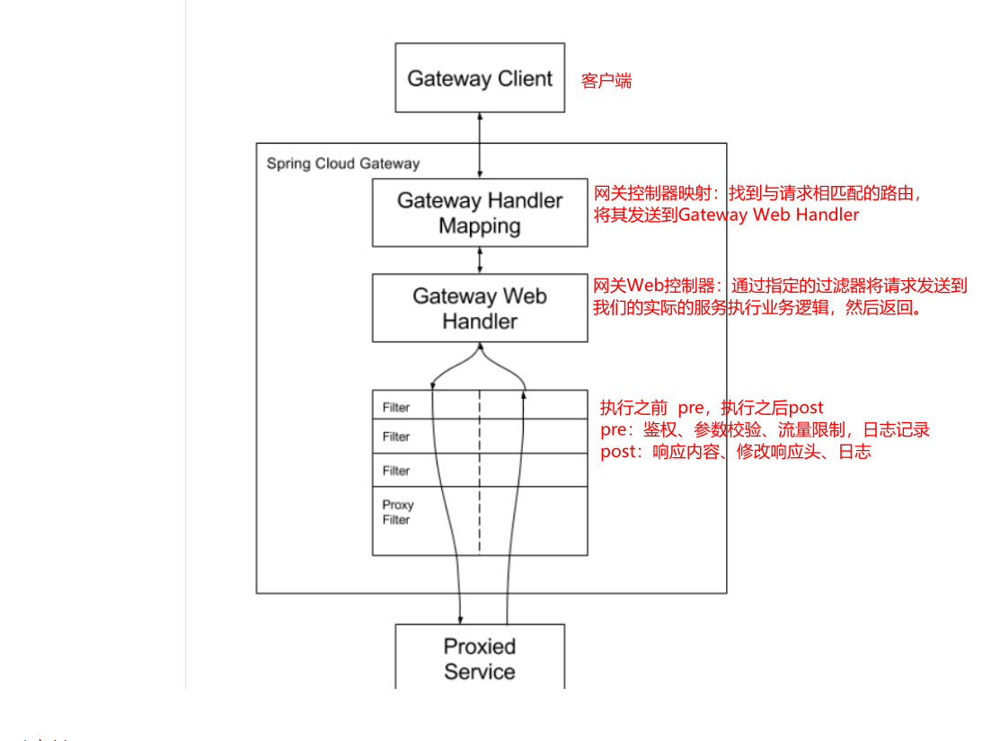
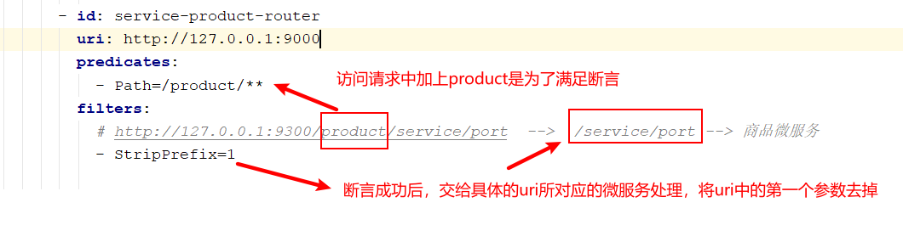
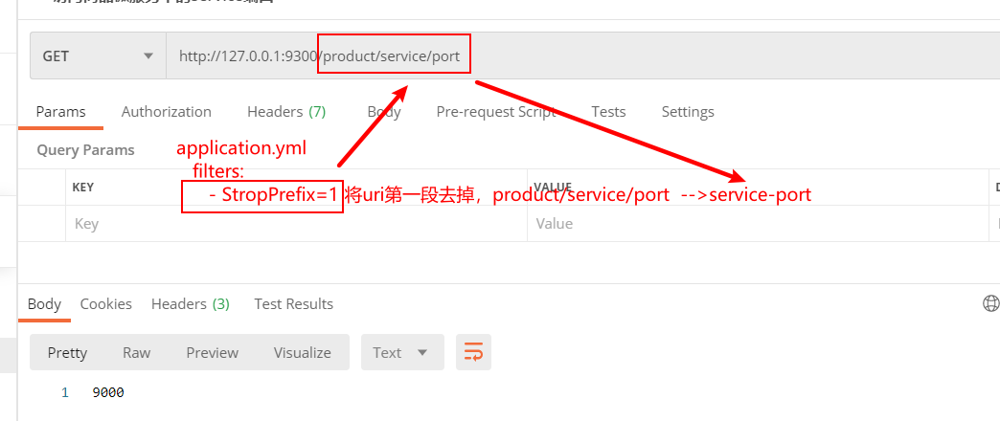
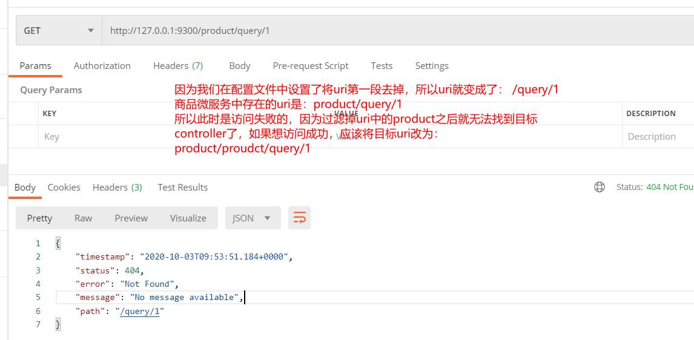
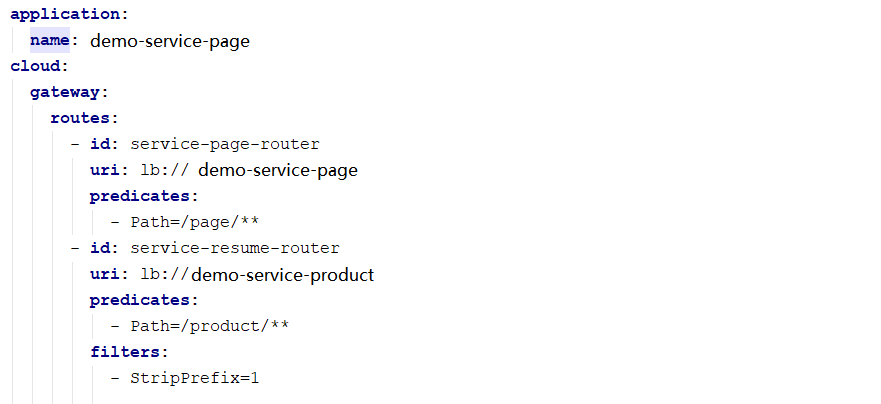

# 1 Feign远程调用组件

​		在之前的案例中，服务消费者调用服务提供者的时候使用RestTemplate技术。


## 1.1 Feign简介

​		Feign**是Netflix开发的一个轻量级RESTful的HTTP服务客户端（用它来发起请求，远程调用的）**，是以Java接口注解的方式调用Http请求，而不用像Java中通过封装HTTP请求报文的方式直接调用，Feign被广泛应用在Spring Cloud 的解决方案中。

​		类似于Dubbo，服务消费者拿到服务提供者的接口，然后像调用本地接口方法一样去调用，实际发出的是远程的请求。

* Feign可帮助我们更加便捷，优雅的调用HTTP API：不需要我们去拼接url然后呢调用restTemplate的api，在SpringCloud中，使用Feign非常简单，创建一个接口（在消费者--服务调用方这一端），并在接口上添加一些注解，代码就完成了
* SpringCloud对Feign进行了增强，使Feign支持了SpringMVC注解（OpenFeign）

​	**本质：封装了Http调用流程，更符合*面向接口化*的编程习惯，类似于Dubbo的服务调用**


## 1.2 Feign配置应用

​		在服务调用者工程（消费）创建接口（添加注解）

​		（效果）Feign = RestTemplate+Ribbon+Hystrix

* 服务消费者工程（页面静态化微服务）中引入Feign依赖（或者父类工程）

```xml
        <dependency>
            <groupId>org.springframework.cloud</groupId>
            <artifactId>spring-cloud-starter-openfeign</artifactId>
        </dependency>
```


- 服务消费者工程（静态化微服务）启动类使用注解@EnableFeignClients添加Feign支持

```java

@SpringBootApplication
@EnableDiscoveryClient  // 开启服务发现
@EnableFeignClients   // 开启Feign
public class PageApplication {

    public static void main(String[] args) {
        SpringApplication.run(PageApplication.class,args);
    }
   
}
```

**注意：**此时去掉Hystrix熔断的支持注解@EnableCircuitBreaker即可包括引入的依赖，因为Feign会自动引入


- 在消费者微服务中创建Feign接口

```java
@FeignClient(name = "demo-service-product")
public interface ProductFeign {

    /**
     * 通过id获取商品信息
     * @param id
     * @return
     */
    @RequestMapping("/product/query/{id}")
    public Products query(@PathVariable Integer id);

    /**
     * 获得端口号
     * @return
     */
    @RequestMapping("/server/query")
    public String findServerPort();

}
```

**注意：**

1）@FeignClient注解的name属性用于指定要调用的服务提供者名称，和服务提供者yml文件中spring.application.name保持一致

2）接口中的接口方法，就好比是远程服务提供者Controller中的Hander方法（只不过如同本地调用了），那么在进行参数绑定的时，可以使用@PathVariable、@RequestParam、@RequestHeader等，这也是OpenFeign对SpringMVC注解的支持，但是需要注意value必须设置，否则会抛出异常

3)  @FeignClient(name = "demo-service-product")，name在消费者微服务中只能出现一次。（升级Spring Boot 2.1.0 Spring Cloud Greenwich.M1 版本后，在2个Feign接口类内定义相同的名字，  @FeignClient(name = 相同的名字 就会出现报错，在之前的版本不会提示报错），所以最好**将调用一个微服务的信息都定义在一个Feign接口中**。


- 改造PageController中原有的调用方式

```java
@RestController
@RequestMapping("/page")
public class PageController {
    @Autowired
    private ProductFeign productFeign;
    @RequestMapping("/getData/{id}")
    public Products findDataById(@PathVariable Integer id) {
        return productFeign.query(id);
    }
    @RequestMapping("/getPort")
    public String getProductServerPort() {
        return productFeign.findServerPort();
    }
}
```


## 1.3 Feign对负载均衡的支持

​		Feign 本身已经集成了Ribbon依赖和自动配置，因此我们不需要额外引入依赖，可以通过 ribbon.xx 来进 行全局配置,也可以通过服务名.ribbon.xx 来对指定服务进行细节配置配置（参考之前，此处略）

Feign默认的请求处理超时时长1s，有时候我们的业务确实执行的需要一定时间，那么这个时候，我们就需要调整请求处理超时时长，Feign自己有超时设置，如果配置Ribbon的超时，则会以Ribbon的为准

```yaml
#针对的被调用方微服务名称,不加就是全局生效
demo-service-product:
  ribbon:
    #请求连接超时时间
    #ConnectTimeout: 2000
    #请求处理超时时间
    #ReadTimeout: 5000
    #对所有操作都进行重试
    OkToRetryOnAllOperations: true
    ####根据如上配置，当访问到故障请求的时候，它会再尝试访问一次当前实例（次数由MaxAutoRetries配置），
    ####如果不行，就换一个实例进行访问，如果还不行，再换一次实例访问（更换次数由MaxAutoRetriesNextServer配置），
    ####如果依然不行，返回失败信息。
    MaxAutoRetries: 0 #对当前选中实例重试次数，不包括第一次调用
    MaxAutoRetriesNextServer: 0 #切换实例的重试次数
    NFLoadBalancerRuleClassName: com.netflix.loadbalancer.RoundRobinRule #负载策略调整
```


## 1.4 Feign对熔断器的支持

1）在Feign客户端工程配置文件（application.yml）中开启Feign对熔断器的支持

```yml
# 开启Feign的熔断功能
feign:
  hystrix:
    enabled: true
```

Feign的超时时长设置那其实就上面Ribbon的超时时长设置

Hystrix超时设置（就按照之前Hystrix设置的方式就OK了）

注意：

1）开启Hystrix之后，Feign中的方法都会被进行一个管理了，一旦出现问题就进入对应的回退逻辑处理

2）针对超时这一点，当前有两个超时时间设置（Feign/hystrix），**熔断的时候是根据这两个时间的最小值来进行的**，即处理时长超过最短的那个超时时间了就熔断进入回退降级逻辑

```yaml
    hystrix:
      command:
        default:
          circuitBreaker:
            # 强制打开熔断器，如果该属性设置为true，强制断路器进入打开状态，将会拒绝所有的请求。 默认false关闭的
            forceOpen: false
            # 触发熔断错误比例阈值，默认值50%
            errorThresholdPercentage: 50
            # 熔断后休眠时长，默认值5秒
            sleepWindowInMilliseconds: 3000
            # 熔断触发最小请求次数，默认值是20
            requestVolumeThreshold: 2
          execution:
            isolation:
              thread:
                # 熔断超时设置，默认为1秒
                timeoutInMilliseconds: 5000
```


2）自定义FallBack处理类（需要实现FeignClient接口）


```java
package com.demo.page.feign.fallback;

import com.demo.common.pojo.Products;
import com.demo.page.feign.ProductFeign;
import org.springframework.stereotype.Component;

@Component
public class ProductFeignFallBack implements ProductFeign {
    @Override
    public Products query(Integer id) {
        return null;
    }

    @Override
    public String findServerPort() {
        return "-1";
    }
}
```


```java
@FeignClient(name = "demo-service-product",fallback = ProductFeignFallBack.class)
public interface ProductFeign {
    /**
     * 通过商品id查询商品对象
     * @param id
     * @return
     */
    @GetMapping("/product/query/{id}")
    public Products queryById(@PathVariable Integer id);


    @GetMapping("/service/port")
    public String getPort();
}
```


## 1.5 Feign对请求压缩和响应压缩的支持

Feign 支持对请求和响应进行GZIP压缩，以减少通信过程中的性能损耗。通过下面的参数 即可开启请求与响应的压缩功能：

```yaml
feign:
  hystrix:
    enabled: true
  #开启请求和响应压缩
  compression:
    request:
      enabled: true #默认不开启
      mime-types: text/html,application/xml,application/json # 设置压缩的数据类型，此处也是默认值
      min-request-size: 2048 # 设置触发压缩的大小下限，此处也是默认值
    response:
      enabled: true #默认不开启
```


# 2 GateWay网关组件

​		网关：微服务架构中的重要组成部分

​		局域网中就有网关这个概念，局域网接收或者发送数据出去通过这个网关，比如用Vmware虚拟机软件搭建虚拟机集群的时候，往往我们需要选择IP段中的一个IP作为网关地址。

我们学习的GateWay-->Spring Cloud GateWay（它只是众多网关解决方案中的一种）

## 2.1 GateWay简介

​		Spring Cloud GateWay是Spring Cloud的一个全新项目，目标是取代Netflix Zuul，它基于Spring5.0+SpringBoot2.0+WebFlux（基于高性能的Reactor模式响应式通信框架Netty，异步非阻塞模型）等技术开发，性能高于Zuul，官方测试，GateWay是Zuul的1.6倍，旨在为微服务架构提供一种简单有效的统一的API路由管理方式。

​		Spring Cloud GateWay不仅提供统一的路由方式（反向代理）并且基于 Filter(定义过滤器对请求过滤，完成一些功能) 链的方式提供了网关基本的功能，例如：鉴权、流量控制、熔断、路径重写 控等。

​		**网关在架构中的位置**


## 2.2 GateWay核心概念

​		Spring Cloud GateWay天生就是异步非阻塞的，基于Reactor模型（同步非阻塞的I/O多路复用机制）

​		一个请求—>网关根据一定的条件匹配—匹配成功之后可以将请求转发到指定的服务地址；而在这个过程中，我们可以进行一些比较具体的控制（限流、日志、黑白名单）

* 路由（route）： 网关最基础的部分，也是网关比较基础的工作单元。路由由一个ID、一个目标URL（最终路由到的地址）、一系列的断言（匹配条件判断）和Filter过滤器（精细化控制）组成。如果断言为true，则匹配该路由。

* 断言（predicates）：参考了Java8中的断言java.util.function.Predicate，开发人员可以匹配Http请求中的所有内容（包括请求头、请求参数等）（类似 于nginx中的location匹配一样），如果断言与请求相匹配则路由。

* 过滤器（filter）：一个标准的Spring webFilter，使用过滤器，可以在请求之前或者之后执行业务逻辑。


##  2.3 GateWay如何工作




Spring 官方介绍：

​	客户端向Spring Cloud GateWay发出请求，然后在GateWay Handler Mapping中找到与请求相匹配的路由，将其发送到GateWay Web Handler；Handler再通过指定的过滤器链来将请求发送到我们实际的服务执行业务逻辑，然后返回。过滤器之间用虚线分开是因为过滤器可能会在发送代理请求之前（pre）或者之后（post）执行业务逻辑。

​	Filter在“pre”类型过滤器中可以做参数校验、权限校验、流量监控、日志输出、协议转换等，在“post”类型的过滤器中可以做响应内容、响应头的修改、日志的输出、流量监控等。


## 2.4 GateWay应用

​      使用网关对静态化微服务进行代理（添加在它的上游，相当于隐藏了具体微服务的信息，对外暴露的是网关）

* 创建工程demo-cloud-gateway-server导入依赖

  GateWay不需要使用web模块，它引入的是WebFlux（类似于SpringMVC）

```xml
<?xml version="1.0" encoding="UTF-8"?>
<project xmlns="http://maven.apache.org/POM/4.0.0"
         xmlns:xsi="http://www.w3.org/2001/XMLSchema-instance"
         xsi:schemaLocation="http://maven.apache.org/POM/4.0.0 http://maven.apache.org/xsd/maven-4.0.0.xsd">

    <modelVersion>4.0.0</modelVersion>
    <groupId>com.demo</groupId>
    <artifactId>demo-cloud-gateway</artifactId>
    <version>1.0-SNAPSHOT</version>


    <!--spring boot 父启动器依赖-->
    <parent>
        <groupId>org.springframework.boot</groupId>
        <artifactId>spring-boot-starter-parent</artifactId>
        <version>2.1.6.RELEASE</version>
    </parent>

    <dependencies>
        <dependency>
            <groupId>org.springframework.cloud</groupId>
            <artifactId>spring-cloud-commons</artifactId>
        </dependency>
        <dependency>
            <groupId>org.springframework.cloud</groupId>
            <artifactId>spring-cloud-starter-netflix-eureka-client</artifactId>
        </dependency>
        <!--GateWay 网关-->
        <dependency>
            <groupId>org.springframework.cloud</groupId>
            <artifactId>spring-cloud-starter-gateway</artifactId>
        </dependency>
        <!--引入webflux-->
        <dependency>
            <groupId>org.springframework.boot</groupId>
            <artifactId>spring-boot-starter-webflux</artifactId>
        </dependency>
        <!--日志依赖-->
        <dependency>
            <groupId>org.springframework.boot</groupId>
            <artifactId>spring-boot-starter-logging</artifactId>
        </dependency>
        <!--测试依赖-->
        <dependency>
            <groupId>org.springframework.boot</groupId>
            <artifactId>spring-boot-starter-test</artifactId>
            <scope>test</scope>
        </dependency>
        <!--lombok工具-->
        <dependency>
            <groupId>org.projectlombok</groupId>
            <artifactId>lombok</artifactId>
            <version>1.18.4</version>
            <scope>provided</scope>
        </dependency>

        <!--引入Jaxb，开始-->
        <dependency>
            <groupId>com.sun.xml.bind</groupId>
            <artifactId>jaxb-core</artifactId>
            <version>2.2.11</version>
        </dependency>
        <dependency>
            <groupId>javax.xml.bind</groupId>
            <artifactId>jaxb-api</artifactId>
        </dependency>
        <dependency>
            <groupId>com.sun.xml.bind</groupId>
            <artifactId>jaxb-impl</artifactId>
            <version>2.2.11</version>
        </dependency>
        <dependency>
            <groupId>org.glassfish.jaxb</groupId>
            <artifactId>jaxb-runtime</artifactId>
            <version>2.2.10-b140310.1920</version>
        </dependency>
        <dependency>
            <groupId>javax.activation</groupId>
            <artifactId>activation</artifactId>
            <version>1.1.1</version>
        </dependency>
        <!--引入Jaxb，结束-->

        <!-- Actuator可以帮助你监控和管理Spring Boot应用-->
        <dependency>
            <groupId>org.springframework.boot</groupId>
            <artifactId>spring-boot-starter-actuator</artifactId>
        </dependency>
        <!--热部署-->
        <dependency>
            <groupId>org.springframework.boot</groupId>
            <artifactId>spring-boot-devtools</artifactId>
            <optional>true</optional>
        </dependency>

        <!--链路追踪-->
        <dependency>
            <groupId>org.springframework.cloud</groupId>
            <artifactId>spring-cloud-starter-sleuth</artifactId>
        </dependency>

        <dependency>
            <groupId>org.springframework.cloud</groupId>
            <artifactId>spring-cloud-starter-zipkin</artifactId>
        </dependency>

    </dependencies>

    <dependencyManagement>
        <!--spring cloud依赖版本管理-->
        <dependencies>
            <dependency>
                <groupId>org.springframework.cloud</groupId>
                <artifactId>spring-cloud-dependencies</artifactId>
                <version>Greenwich.RELEASE</version>
                <type>pom</type>
                <scope>import</scope>
            </dependency>
        </dependencies>
    </dependencyManagement>

    <build>
        <plugins>
            <!--编译插件-->
            <plugin>
                <groupId>org.apache.maven.plugins</groupId>
                <artifactId>maven-compiler-plugin</artifactId>
                <configuration>
                    <source>11</source>
                    <target>11</target>
                    <encoding>utf-8</encoding>
                </configuration>
            </plugin>
            <!--打包插件-->
            <plugin>
                <groupId>org.springframework.boot</groupId>
                <artifactId>spring-boot-maven-plugin</artifactId>
            </plugin>
        </plugins>
    </build>

</project>
```

**注意：不要引入starter-web模块，需要引入web-flux**


- application.yml 配置文件内容

```yaml
server:
  port: 9300
eureka:
  client:
    serviceUrl: # eureka server的路径
      defaultZone: http://demoCloudEurekaServerA:9200/eureka,http://demoCloudEurekaServerB:9201/eureka
  instance:
    prefer-ip-address: true
    instance-id: ${spring.cloud.client.ip-address}:${spring.application.name}:${server.port}:@project.version@
spring:
  application:
    name: demo-cloud-gateway
  #网关的配置
  cloud:
    gateway:
      routes: #配置路由
        - id: service-page-router
          uri: http://127.0.0.1:9100
          predicates: #当断言成功后，交给某一个微服务处理时使用的是转发
            - Path=/page/**
        - id: service-product-router
          uri: http://127.0.0.1:9000
          predicates:
            - Path=/product/**
          filters:
            # http://127.0.0.1:9300/product/service/port  -->  /service/port --> 商品微服务
            - StripPrefix=1  #去掉uri中的第一部分，所以就要求我们通过网关访问的时候，把uri的第一部分设置为product，从uri的第二部分开始才是真正的uri

```







- 启动类

```java
package com.demo.gateway;

import org.springframework.boot.SpringApplication;
import org.springframework.boot.autoconfigure.SpringBootApplication;
import org.springframework.cloud.client.discovery.EnableDiscoveryClient;

@SpringBootApplication
@EnableDiscoveryClient
public class GatewayApplication {

    public static void main(String[] args) {
        SpringApplication.run(GatewayApplication.class,args);
    }

}
```

- 测试

http://127.0.0.1:9300/page/getData/1

http://127.0.0.1:9300/product/product/query/1


## 2.5 GateWay路由规则详解

​		Spring Cloud GateWay 帮我们内置了很多 Predicates功能，实现了各种路由匹配规则（通过 Header、请求参数等作为条件）匹配到对应的路由。


**时间点后匹配**

```yml
spring:
  cloud:
    gateway:
      routes:
        - id: after_route
          uri: https://example.org
          predicates:
            - After=2017-01-20T17:42:47.789-07:00[America/Denver]
```

**时间点前匹配**

````yml
spring:
  cloud:
    gateway:
      routes:
      - id: before_route
        uri: https://example.org
        predicates:
        - Before=2017-01-20T17:42:47.789-07:00[America/Denver]
````

**时间区间匹配**

```yml
spring:
  cloud:
    gateway:
      routes:
      - id: between_route
        uri: https://example.org
        predicates:
        - Between=2017-01-20T17:42:47.789-07:00[America/Denver], 2017-01-21T17:42:47.789-07:00[America/Denver]
```

**指定Cookie正则匹配指定值**

```yml
spring:
  cloud:
    gateway:
      routes:
      - id: cookie_route
        uri: https://example.org
        predicates:
        - Cookie=chocolate, ch.p
```

**指定Header正则匹配指定值**

```yml
spring:
  cloud:
    gateway:
      routes:
      - id: header_route
        uri: https://example.org
        predicates:
        - Header=X-Request-Id, \d+
```

**请求Host匹配指定值**

```yml
spring:
  cloud:
    gateway:
      routes:
      - id: host_route
        uri: https://example.org
        predicates:
        - Host=**.somehost.org,**.anotherhost.org
```

**请求Method匹配指定请求方式**

```yml
spring:
  cloud:
    gateway:
      routes:
      - id: method_route
        uri: https://example.org
        predicates:
        - Method=GET,POST
```

**请求路径正则匹配**

```yml
spring:
  cloud:
    gateway:
      routes:
      - id: path_route
        uri: https://example.org
        predicates:
        - Path=/red/{segment},/blue/{segment}
```

**请求包含某参数**

```yml
spring:
  cloud:
    gateway:
      routes:
      - id: query_route
        uri: https://example.org
        predicates:
        - Query=green
```

**请求包含某参数并且参数值匹配正则表达式**

```yml
spring:
  cloud:
    gateway:
      routes:
      - id: query_route
        uri: https://example.org
        predicates:
        - Query=red, gree.
```

**远程地址匹配**

```yml
spring:
  cloud:
    gateway:
      routes:
      - id: remoteaddr_route
        uri: https://example.org
        predicates:
        - RemoteAddr=192.168.1.1/24
```

## 2.6 GateWay动态路由详解

​		GateWay支持自动从注册中心中获取服务列表并访问，即所谓的动态路由

​		实现步骤如下

1）pom.xml中添加注册中心客户端依赖（因为要获取注册中心服务列表，eureka客户端已经引入）

2）动态路由配置


**注意：动态路由设置时，uri以 lb: //开头（lb代表从注册中心获取服务），后面是需要转发到的服务名称**

## 2.7 GateWay过滤器

### 2.7.1 GateWay过滤器简介

​		从过滤器生命周期（影响时机点）的角度来说，主要有两个pre和post：

| 生命周期时机点 | 作用                                                         |
| -------------- | ------------------------------------------------------------ |
| pre            | 这种过滤器在请求被路由之前调用。我们可利用这种过滤器实现身份验证、在集群中选择 请求的微服务、记录调试信息等。 |
| post           | 这种过滤器在路由到微服务以后执行。这种过滤器可用来为响应添加标准的 HTTP Header、收集统计信息和指标、将响应从微服务发送给客户端等。 |

​		从过滤器类型的角度，Spring Cloud GateWay的过滤器分为GateWayFilter和GlobalFilter两种

| 过滤器类型    | 影响范围             |
| ------------- | -------------------- |
| GateWayFilter | 应用到单个路由路由上 |
| GlobalFilter  | 应用到所有的路由上   |

​		如Gateway Filter可以去掉url中的占位后转发路由，比如

```yml
predicates:
        - Path=/product/**
        filters:
        - StripPrefix=1  # 可以去掉product之后转发
```

​		**注意：GlobalFilter全局过滤器是程序员使用比较多的过滤器，我们主要讲解这种类型**

### 2.7.2 自定义全局过滤器实现IP访问限制（黑白名单）

​		请求过来时，判断发送请求的客户端的ip，如果在黑名单中，拒绝访问

​		自定义GateWay全局过滤器时，我们实现Global Filter接口即可，通过全局过滤器可以实现黑白名单、限流等功能。

```java
package com.demo.gateway;

import lombok.extern.slf4j.Slf4j;
import org.springframework.cloud.gateway.filter.GatewayFilterChain;
import org.springframework.cloud.gateway.filter.GlobalFilter;
import org.springframework.core.Ordered;
import org.springframework.core.io.buffer.DataBuffer;
import org.springframework.http.HttpStatus;
import org.springframework.http.server.reactive.ServerHttpRequest;
import org.springframework.http.server.reactive.ServerHttpResponse;
import org.springframework.stereotype.Component;
import org.springframework.web.server.ServerWebExchange;
import reactor.core.publisher.Mono;

import java.util.ArrayList;
import java.util.List;

/**
 * 定义全局过滤器，会对所有路由生效
 */
@Slf4j
@Component  // 让容器扫描到，等同于注册了
public class BlackListFilter implements GlobalFilter, Ordered {

    // 模拟黑名单（实际可以去数据库或者redis中查询）
    private static List<String> blackList = new ArrayList<>();

    static {
        blackList.add("0:0:0:0:0:0:0:1");  // 模拟本机地址
        blackList.add("127.0.0.1");
    }

    /**
     * 过滤器核心方法
     * @param exchange 封装了request和response对象的上下文
     * @param chain 网关过滤器链（包含全局过滤器和单路由过滤器）
     * @return
     */
    @Override
    public Mono<Void> filter(ServerWebExchange exchange, GatewayFilterChain chain) {
        System.out.println("....BlackListFilter....");
        // 思路：获取客户端ip，判断是否在黑名单中，在的话就拒绝访问，不在的话就放行
        // 从上下文中取出request和response对象
        ServerHttpRequest request = exchange.getRequest();
        ServerHttpResponse response = exchange.getResponse();

        // 从request对象中获取客户端ip
        String clientIp = request.getRemoteAddress().getHostString();
        // 拿着clientIp去黑名单中查询，存在的话就决绝访问
        if(blackList.contains(clientIp)) {
            // 决绝访问，返回
            response.setStatusCode(HttpStatus.UNAUTHORIZED); // 状态码
            log.info("=====>IP:" + clientIp + " 在黑名单中，将被拒绝访问！");
            String data = "Request be denied!";
            DataBuffer wrap = response.bufferFactory().wrap(data.getBytes());
            return response.writeWith(Mono.just(wrap));
        }

        // 合法请求，放行，执行后续的过滤器
        return chain.filter(exchange);
    }


    /**
     * 返回值表示当前过滤器的顺序(优先级)，数值越小，优先级越高
     * @return
     */
    @Override
    public int getOrder() {
        return 0;
    }
}

```

## 2.8 GateWay高可用

​		网关作为非常核心的一个部件，如果挂掉，那么所有请求都可能无法路由处理，因此我们需要做GateWay的高可用。

​		**GateWay的高可用很简单：**可以启动多个GateWay实例来实现高可用，在GateWay的上游使用Nginx等负载均衡设备进行负载转发以达到高可用的目的。

​		启动多个GateWay实例（假如说两个，一个端口9002，一个端口9003），剩下的就是使用Nginx等完成负载代理即可。示例如下：

```shell
#配置多个GateWay实例
upstream gateway {
	server 127.0.0.1:9002;
	server 127.0.0.1:9003; 
} 
location / {
	proxy_pass http://gateway; 
}
```


