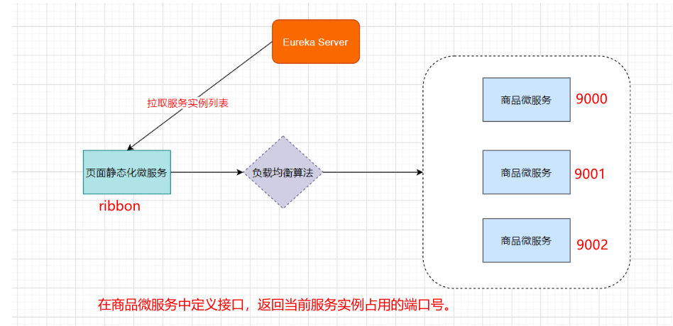
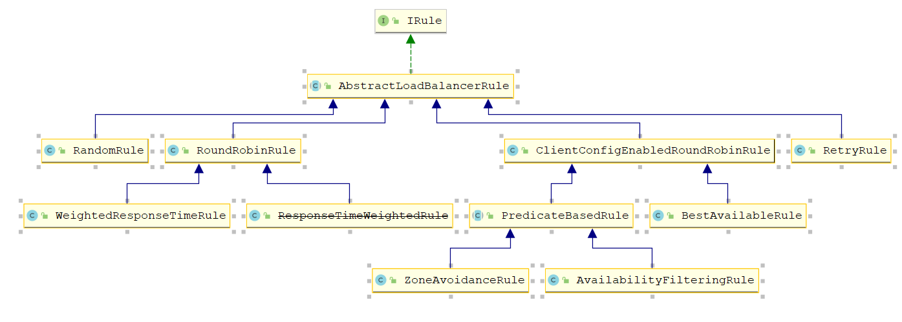
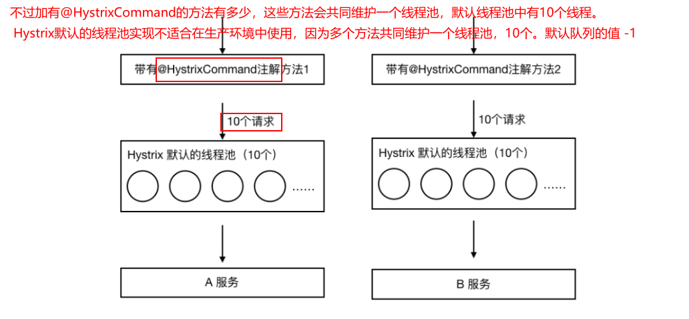

# 目录

[toc]

# 1 Ribbon负载均衡

## 1.1 关于负载均衡

​		负载均衡一般分为**服务器端负载均衡**和**客户端负载均衡**

​		所谓**服务器端负载均衡**，比如Nginx、F5这些，请求到达服务器之后由这些负载均衡器根据一定的算法将请求路由到目标服务器处理。

​		所谓**客户端负载均衡**，比如我们要说的Ribbon，服务消费者客户端会有一个服务器地址列表，调用方在请求前通过一定的负载均衡算法选择一个服务器进行访问，负载均衡算法的执行是在请求客户端进行。

​		Ribbon是Netflix发布的负载均衡器。Eureka一般配合Ribbon进行使用，Ribbon利用从Eureka中读取到服务信息，在调用服务提供者提供的服务时，会根据一定的算法进行负载。

​	


## 1.2 Ribbon高级应用

​	**需求：**

​		复制商品微服务9001，在9000和9001编写Controller，返回服务实例端口。

​		Page微服务中通过负载均衡策略调用demo-service-product的controller



​	

在微服务中使用Ribbon不需要额外导入依赖坐标，微服务中引入过eureka-client相关依赖，会自动引入Ribbon相关依赖坐标。

​	**代码中使用如下，在RestTemplate上添加对应注解即可**

````java
@SpringBootApplication
@EnableDiscoveryClient //@EnableEurekaClient
public class PageApplication {

    public static void main(String[] args) {
        SpringApplication.run(PageApplication.class,args);
    }

    @Bean
    //Ribbon负载均衡
    @LoadBalanced
    public RestTemplate restTemplate(){
        return new RestTemplate();
    }

}

````


**创建demo-serivce-product-9001微服务，创建ServerConfigController，定义方法返回当前微服务所使用的容器端口号**

修改服务提供者api返回值，返回当前实例的端口号，便于观察负载情况

```java
@RestController
@RequestMapping("/server")
public class ServerConfigController {

    @Value("${server.port}")
    private String serverPort;

    @requestMapping("query")
    public String findServerPort(){
        return serverPort;
    }

}

```


**在页面静态化微服务中调用demo-server-product下的资源路径：http://demo-server-product/server/query**

```java
    @RequestMapping("/getPort")
    public String getProductServerPort(){
        String url = "http://demo-service-product/server/query";
        return restTemplate.getForObject(url,String.class);
    }
```


## 1.3 Ribbon负载均衡策略

Ribbon内置了多种负载均衡策略，内部负责复杂均衡的顶级接口为 com.netflix.loadbalancer.IRule ，接口简介:

```java
package com.netflix.loadbalancer;

/**
 * Interface that defines a "Rule" for a LoadBalancer. A Rule can be thought of
 * as a Strategy for loadbalacing. Well known loadbalancing strategies include
 * Round Robin, Response Time based etc.
 * 
 * @author stonse
 * 
 */
public interface IRule{
    /*
     * choose one alive server from lb.allServers or
     * lb.upServers according to key
     * 
     * @return choosen Server object. NULL is returned if none
     *  server is available 
     */

    public Server choose(Object key);
    
    public void setLoadBalancer(ILoadBalancer lb);
    
    public ILoadBalancer getLoadBalancer();    
}
```



| 负载均衡策略                                    | 描述                                                         |
| ----------------------------------------------- | ------------------------------------------------------------ |
| RoundRobinRule：轮询策略                        | 默认超过10次获取到的server都不可用，会返回一个空的server     |
| RandomRule：随机策略                            | 如果随机到的server为null或者不可用的话，会while不停的循环选取 |
| RetryRule：重试策略                             | 一定时限内循环重试。默认继承RoundRobinRule，也支持自定义注入，RetryRule会在每次选取之后，对选举的server进行判断，是否为null，是否alive，并且在500ms内会不停的选取判断。而RoundRobinRule失效的策略是超过10次，RandomRule是没有失效时间的概念，只要serverList没都挂。 |
| BestAvailableRule：最小连接数策略               | 遍历serverList，选取出可用的且连接数最小的一个server。该算法里面有一个LoadBalancerStats的成员变量，会存储所有server的运行状况和连接数。如果选取到的server为null，那么会调用RoundRobinRule重新选取。 |
| AvailabilityFilteringRule：可用过滤策略         | 扩展了轮询策略，会先通过默认的轮询选取一个server，再去判断该server是否超时可用，当前连接数是否超限，都成功再返回。 |
| ZoneAvoidanceRule：区域权衡策略**（默认策略）** | 扩展了轮询策略，继承了2个过滤器：ZoneAvoidancePredicate和AvailabilityPredicate，除了过滤超时和链接数过多的server，还会过滤掉不符合要求的zone区域里面的所有节点， 在一个区域/机房内的服务实例中轮询。**先过滤再轮询** |


**修改负载均衡策略：**

```yml
#针对的被调用方微服务名称,不加就是全局生效
demo-service-product: 
  ribbon:
    NFLoadBalancerRuleClassName: com.netflix.loadbalancer.RandomRule    #随机策略
```

```yml
demo-service-product: 
  ribbon:
    NFLoadBalancerRuleClassName: com.netflix.loadbalancer.RoundRobinRule #轮询策略
```


## 1.4 Ribbon核心源码剖析

**Ribbon工作原理：**


- 老规矩：SpringCloud充分利用了SpringBoot的自动装配特点，找spring.factories配置文件

```properties
org.springframework.boot.autoconfigure.EnableAutoConfiguration=\
org.springframework.cloud.netflix.ribbon.RibbonAutoConfiguration
```


- LoadBalancerAutoConfiguration 类中配置

   **装配验证：**


   	**自动注入：**	

​     			


​			**注入restTemplate定制器：**

​				为retTemplate对象设置loadBalancerInterceptor

​		         

​                

到这里，我们明白，添加了注解的RestTemplate对象会被添加一个拦截器LoadBalancerInterceptor，该拦截器就是后续拦截请求进行负载处理的。


# 2 Hystrix熔断器

属于一种容错机制

## 2.1 微服务中的雪崩效应

​		当山坡积雪内部的内聚力抗拒不了它所受到的重力拉引时，便向下滑动，引起大量雪体崩塌，人们把这种自然现象称作雪崩。

​		微服务中，一个请求可能需要多个微服务接口才能实现，会形成复杂的调用链路。

​        **服务雪崩效应：**是一种因“服务提供者的不可用”（原因）导致“服务调用者不可用”（结果），并将不可用逐渐放大的现象。


​		


​		扇入：代表着该微服务被调用的次数，扇入大，说明该模块复用性好

​		扇出：该微服务调用其他微服务的个数，扇出大，说明业务逻辑复杂

​		扇入大是一个好事，扇出大不一定是好事


​		在微服务架构中，一个应用可能会有多个微服务组成，微服务之间的数据交互通过远程过程调用完成。这就带来一个问题，假设微服务A调用微服务B和微服务C，微服务B和微服务C又调用其它的微服务，这就是所谓的“扇出”。如果扇出的链路上某个微服务的调用响应时间过长或者不可用，对微服务A的调用就会占用越来越多的系统资源，进而引起系统崩溃，所谓的“雪崩效应”。		

​		如图中所示，最下游**商品微服务**响应时间过长，大量请求阻塞，大量线程不会释放，会导致服务器资源耗尽，最终导致上游服务甚至整个系统瘫痪。


**形成原因：**

服务雪崩的过程可以分为三个阶段：

1. 服务提供者不可用
2. 重试加大请求流量
3. 服务调用者不可用

服务雪崩的每个阶段都可能由不同的原因造成： 

​	


## 2.2 雪崩效应解决方案

​		从可用性可靠性着想，为防止系统的整体缓慢甚至崩溃，采用的技术手段； 

​		下面，我们介绍三种技术手段应对微服务中的雪崩效应，这三种手段都是从系统可用性、可靠性角度出发，尽量防止系统整体缓慢甚至瘫痪。


**服务熔断**

​		熔断机制是应对雪崩效应的一种微服务链路保护机制。我们在各种场景下都会接触到熔断这两个字。高压电路中，如果某个地方的电压过高，熔断器就会熔断，对电路进行保护。股票交易中，如果股票指数过高，也会采用熔断机制，暂停股票的交易。同样，在微服务架构中，熔断机制也是起着类似的作用。当扇出链路的某个微服务不可用或者响应时间太长时，熔断该节点微服务的调用，进行服务的降级，快速返回错误的响应信息。当检测到该节点微服务调用响应正常后，恢复调用链路。

​		**注意：**

​		1）服务熔断重点在**“断”**，切断对下游服务的调用

​		2）服务熔断和服务降级往往是一起使用的，Hystrix就是这样。


**服务降级**

​		通俗讲就是整体资源不够用了，先将一些不关紧的服务停掉（调用我的时候，给你返回一个预留的值，也叫做**兜底数据**），待渡过难关高峰过去，再把那些服务打开。

​		服务降级一般是从整体考虑，就是当某个服务熔断之后，服务器将不再被调用，此刻客户端可以自己准备一个本地的fallback回调，返回一个缺省值，这样做，虽然服务水平下降，但好歹可用，比直接挂掉要强。


**服务限流**		

​		服务降级是当服务出问题或者影响到核心流程的性能时，暂时将服务屏蔽掉，待高峰或者问题解决后再打开；但是有些场景并不能用服务降级来解决，比如秒杀业务这样的核心功能，这个时候可以结合服务限流来限制这些场景的并发/请求量

​		限流措施也很多，比如

* 限制总并发数（比如数据库连接池、线程池）
* 限制瞬时并发数（如nginx限制瞬时并发连接数）
* 限制时间窗口内的平均速率（如Guava的RateLimiter、nginx的limit_req模块，限制每秒的平均速率）
* 限制远程接口调用速率、限制MQ的消费速率等


## 2.3 Hystrix简介


​		**[来自官网]**Hystrix(豪猪)，宣言“defend your application”是由Netflix开源的一个延迟和容错库，用于隔离访问远程系统、服务或者第三方库，防止级联失败，从而提升系统的可用性与容错性。Hystrix主要通过以下几点实现延迟和容错。

* 包裹请求：使用HystrixCommand包裹对依赖的调用逻辑。   页面静态化微服务方法（@HystrixCommand 添加Hystrix控制）   
* 跳闸机制：当某服务的错误率超过一定的阈值时，Hystrix可以跳闸，停止请求该服务一段时间。 
* 资源隔离：Hystrix为每个依赖都维护了一个小型的线程池(舱壁模式)。如果该线程池已满， 发往该依赖的请求就被立即拒绝，而不是排队等待，从而加速失败判定。 
* 监控：Hystrix可以近乎实时地监控运行指标和配置的变化，例如成功、失败、超时、以及被拒绝 的请求等。 
* 回退机制：当请求失败、超时、被拒绝，或当断路器打开时，执行回退逻辑。回退逻辑由开发人员 自行提供，例如返回一个缺省值。 
* 自我修复：断路器打开一段时间后，会自动进入“半开”状态（探测服务是否可用，如还是不可用，再次退回打开状态）。


## 2.4 Hystrix应用

### 2.4.1.熔断处理

​		**目的：**商品微服务长时间没有响应，服务消费者—>**页面静态化微服务**快速失败给用户提示

- **引入依赖：**服务消费者工程（静态化微服务）中引入Hystrix依赖坐标（也可以添加在父工程中）

```xml
        <!--熔断器Hystrix-->
        <dependency>
            <groupId>org.springframework.cloud</groupId>
            <artifactId>spring-cloud-starter-netflix-hystrix</artifactId>
        </dependency>
```


- **开启熔断：**服务消费者工程（静态化微服务）的启动类中添加熔断器开启注解@EnableCircuitBreaker

  ```java
  /**
   * 注解简化写法
   * @SpringCloudApplication = @SpringBootApplication+@EnableDiscoveryClient+@EnableCircuitBreaker
   */
  @SpringBootApplication
  @EnableDiscoveryClient //@EnableEurekaClient
  @EnableCircuitBreaker   // 开启熔断
  public class PageApplication {
  
      public static void main(String[] args) {
          SpringApplication.run(PageApplication.class,args);
      }
      @Bean
      @LoadBalanced//Ribbon负载均衡
      public RestTemplate restTemplate(){
          return new RestTemplate();
      }
  }
  ```

  

- **定义服务降级处理方法：**业务方法上使用@HystrixCommand的fallbackMethod属性关联到服务降级处理方法

```java

    /**
     * 提供者模拟处理超时，调用方法添加Hystrix控制
     */
    // 使用@HystrixCommand注解进行熔断控制
    @HystrixCommand(
            // 线程池标识，要保持唯一，不唯一的话就共用了
            threadPoolKey = "getProductServerPort2",
            // 线程池细节属性配置
            threadPoolProperties = {
                    @HystrixProperty(name="coreSize",value = "1"), // 线程数
                    @HystrixProperty(name="maxQueueSize",value="20") // 等待队列长度
            },
            // commandProperties熔断的一些细节属性配置
            commandProperties = {
                    // 每一个属性都是一个HystrixProperty
                    @HystrixProperty(name="execution.isolation.thread.timeoutInMilliseconds",value="2000")
            }
    )
    @RequestMapping("/getPort2")
    public String getProductServerPort2(){
        String url = "http://demo-service-product/server/query";
        return restTemplate.getForObject(url,String.class);
    }
```


- 商品微服务模拟超时操作

```java
@RestController
@RequestMapping("/server")
public class ServerConfigController {

    @Value("${server.port}")
    private String serverPort;

    @RequestMapping("/query")
    public String findServerPort(){
        try {
            Thread.sleep(10000);
        } catch (InterruptedException e) {
            e.printStackTrace();
        }
        return serverPort;
    }
}
```


### 2.4.2降级处理

配置@HystrixCommand注解，定义降级处理方法

```java
    @HystrixCommand(
            // 线程池标识，要保持唯一，不唯一的话就共用了
            threadPoolKey = "getProductServerPort3TimeoutFallback",
            // 线程池细节属性配置
            threadPoolProperties = {
                    @HystrixProperty(name = "coreSize", value = "2"), // 线程数
                    @HystrixProperty(name = "maxQueueSize", value = "20") // 等待队列长度
            },
            // commandProperties熔断的一些细节属性配置
            commandProperties = {
                    // 每一个属性都是一个HystrixProperty
                    @HystrixProperty(name = "execution.isolation.thread.timeoutInMilliseconds", value = "2000"),
                    // hystrix高级配置，定制工作过程细节
                    // 统计时间窗口定义
                    @HystrixProperty(name = "metrics.rollingStats.timeInMilliseconds", value = "8000"),
                    // 统计时间窗口内的最小请求数
                    @HystrixProperty(name = "circuitBreaker.requestVolumeThreshold", value = "2"),
                    // 统计时间窗口内的错误数量百分比阈值
                    @HystrixProperty(name = "circuitBreaker.errorThresholdPercentage", value = "50"),
                    // 自我修复时的活动窗口长度
                    @HystrixProperty(name = "circuitBreaker.sleepWindowInMilliseconds", value = "3000")
            },
            fallbackMethod = "myFallBack"  // 回退方法
    )
    @RequestMapping("/getPort3")
    public String getProductServerPort3() {
        String url = "http://demo-service-product/server/query";
        return restTemplate.getForObject(url, String.class);
    }


    /**
     * 定义回退方法，返回预设默认值
     * 注意：该方法形参和返回值与原始方法保持一致
     */
    public String myFallBack() {
        return "-1"; // 兜底数据
    }
```


## 2.5 Hystrix舱壁模式

  	即：线程池隔离策略

如果不进行任何设置，所有熔断方法使用一个Hystrix线程池（10个线程），那么这样的话会导致问题，这个问题并不是扇出链路微服务不可用导致的，而是我们的线程机制导致的，如果方法A的请求把10个线程都用了，方法2请求处理的时候压根都没法去访问B，因为没有线程可用，并不是B服务不可用。




为了避免问题服务请求过多导致正常服务无法访问，Hystrix 不是采用增加线程数，而是单独的为每一个控制方法创建一个线程池的方式，这种模式叫做“舱壁模式"，也是线程隔离的手段。


## 2.6 Hystrix工作流程与高级应用


1）当调用出现问题时，开启一个时间窗（10s）

2）在这个时间窗内，统计调用次数是否达到最小请求数？

​	  如果没有达到，则重置统计信息，回到第1步

​	  如果达到了，则统计失败的请求数占所有请求数的百分比，是否达到阈值？

​				如果达到，则跳闸（不再请求对应服务）

​				如果没有达到，则重置统计信息，回到第1步

3）如果跳闸，则会开启一个活动窗口（默认5s），每隔5s，Hystrix会让一个请求通过,到达那个问题服务，看是否调用成功，如果成功，重置断路器回到第1步，如果失败，回到第3步

```java
/**
     * 8秒钟内，请求次数达到2个，并且失败率在50%以上，就跳闸
     * 跳闸后活动窗口设置为3s
     */
    @HystrixCommand(
            commandProperties = {
                     //统计窗口时间的设置
                    @HystrixProperty(name = "metrics.rollingStats.timeInMilliseconds",value = "8000"),
                    //统计窗口内的最小请求数
                    @HystrixProperty(name = "circuitBreaker.requestVolumeThreshold",value = "2"),
                    //统计窗口内错误请求阈值的设置  50%
                    @HystrixProperty(name = "circuitBreaker.errorThresholdPercentage",value = "50"),
                    //自我修复的活动窗口时间
                    @HystrixProperty(name = "circuitBreaker.sleepWindowInMilliseconds",value = "3000")

            }
    )
```


我们上述通过注解进行的配置也可以配置在配置文件中:

```yaml
# 配置熔断策略：
hystrix:
  command:
    default:
      circuitBreaker:
        # 强制打开熔断器，如果该属性设置为true，强制断路器进入打开状态，将会拒绝所有的请求。 默认false关闭的
        forceOpen: false
        # 触发熔断错误比例阈值，默认值50%
        errorThresholdPercentage: 50
        # 熔断后休眠时长，默认值3秒
        sleepWindowInMilliseconds: 3000
        # 熔断触发最小请求次数，默认值是20
        requestVolumeThreshold: 20
      execution:
        isolation:
          thread:
            # 熔断超时设置，默认为2秒
            timeoutInMilliseconds: 2000
```

基于springboot的健康检查观察跳闸状态（自动投递微服务暴露健康检查细节）

```yaml
# springboot中暴露健康检查等断点接口
management:
  endpoints:
    web:
      exposure:
        include: "*"
  # 暴露健康接口的细节
  endpoint:
    health:
      show-details: always
```

访问健康检查接口：http://localhost:9100/actuator/health


**Hystrix 线程池队列配置案例：**

​	有一次在生产环境，突然出现了很多笔还款单被挂起，后来排查原因，发现是内部系统调用时出现了Hystrix调用异常。在开发过程中，因为核心线程数设置的比较大，没有出现这种异常。放到了测试环境，偶尔有出现这种情况。

​	后来调整maxQueueSize属性，确实有所改善。可没想到在生产环境跑了一段时间后却又出现这种了情况，此时我第一想法就是去查看maxQueueSize属性，可是maxQueueSize属性是设置值了。

​	当时就比较纳闷了，为什么maxQueueSize属性不起作用，后来通过查看官方文档发现Hystrix还有一个queueSizeRejectionThreshold属性，这个属性是控制队列最大阈值的，而Hystrix默认只配置了5个，因此就算我们把maxQueueSize的值设置再大，也是不起作用的。两个属性必须同时配置

```yaml
hystrix:
  threadpool:
    default:
      coreSize: 10 #并发执行的最大线程数，默认10
      maxQueueSize: 1000 #BlockingQueue的最大队列数，默认值-1
      queueSizeRejectionThreshold: 800 #即使maxQueueSize没有达到，达到queueSizeRejectionThreshold该值后，请求也会被拒绝，默认值5
```


**正确的配置案例：**

- 将核心线程数调低，最大队列数和队列拒绝阈值的值都设置大一点：

```yml
hystrix:
  threadpool:
    default:
      coreSize: 10
      maxQueueSize: 1500
      queueSizeRejectionThreshold: 1000
```


