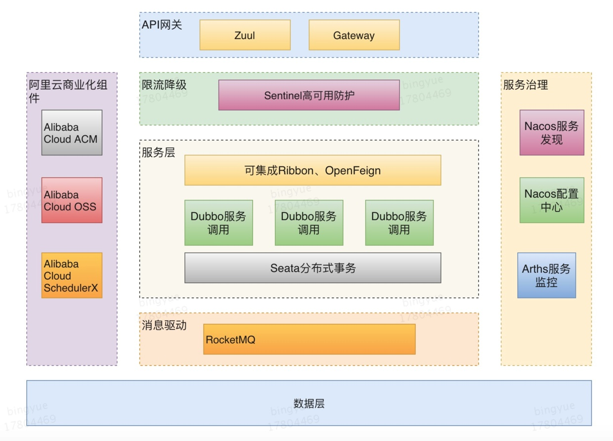
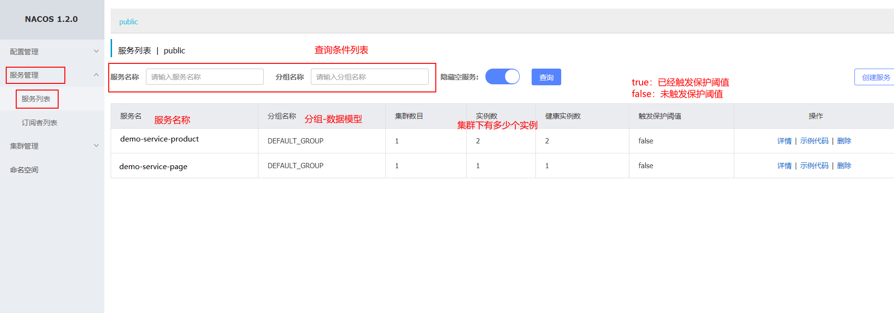
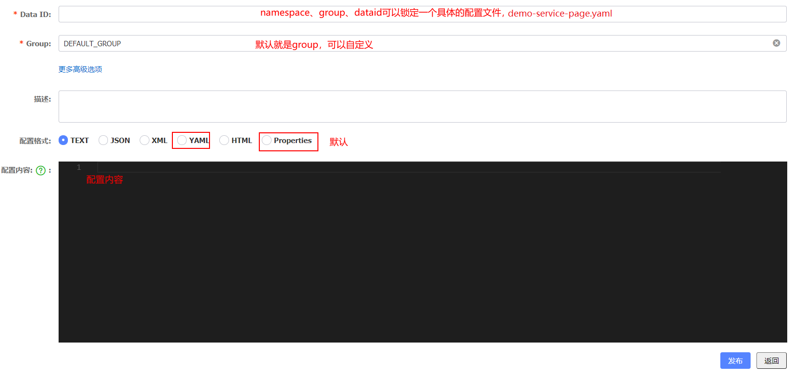

# 目录

[toc]


# 1 第二代 Spring Cloud 核心组件（SCA）

​		SpringCloud 是若干个框架的集合，包括 spring-cloud-config、spring-cloud-bus 等近 20 个子项目，提供了服务治理、服务网关、智能路由、负载均衡、断路器、监控跟踪、分布式消息队列、配置管理等领域的解决方案。Spring Cloud 通过 Spring Boot 风格的封装，屏蔽掉了复杂的配置和实现原理，最终给开发者留出了一套简单易懂、容易部署的分布式系统开发工具包。一般来说，Spring Cloud 包含以下组件，主要以 Netflix 开源为主。

​		同 Spring Cloud 一样，Spring Cloud Alibaba 也是一套微服务解决方案，包含开发分布式应用微服务的必需组件，方便开发者通过 Spring Cloud 编程模型轻松使用这些组件来开发分布式应用服务。依托 Spring Cloud Alibaba，您只需要添加一些注解和少量配置，就可以将 Spring Cloud 应用接入阿里微服务解决方案，通过阿里中间件来迅速搭建分布式应用系统。



## 1.1 阿里开源组件

Nacos：一个更易于构建云原生应用的动态服务发现、配置管理和服务管理平台。

Sentinel：把流量作为切入点，从流量控制、熔断降级、系统负载保护等多个维度保护服务的稳定性。

RocketMQ：开源的分布式消息系统，基于高可用分布式集群技术，提供低延时的、高可靠的消息发布与订阅服务。

Dubbo：这个就不用多说了，在国内应用非常广泛的一款高性能 Java RPC 框架。

Seata：阿里巴巴开源产品，一个易于使用的高性能微服务分布式事务解决方案。

Arthas：开源的Java动态追踪工具，基于字节码增强技术，功能非常强大。

## 1.2 阿里商业化组件

作为一家商业公司，阿里巴巴推出 Spring Cloud Alibaba，很大程度上市希望通过抢占开发者生态，来帮助推广自家的云产品。所以在开源社区，夹带了不少私货，阿里商业化组件，整体易用性和稳定性还是很高的。

Alibaba Cloud ACM：一款在分布式架构环境中对应用配置进行集中管理和推送的应用配置中心产品。

Alibaba Cloud OSS：阿里云对象存储服务（Object Storage Service，简称 OSS），是阿里云提供的云存储服务。

Alibaba Cloud SchedulerX：阿里中间件团队开发的一款分布式任务调度产品，提供秒级、精准的定时（基于 Cron 表达式）任务调度服务。


Spring Cloud Alibaba 作为整套的微服务解决组件，只依靠目前阿里的开源组件是不够的，更多的是集成当前的社区组件，所以 Spring Cloud Alibaba 可以集成 Zuul，GateWay等网关组件，也可集成Ribbon、OpenFeign等组件。


# 2 Nacos 服务注册和配置中心

## 2.1 Nacos 介绍

​		Nacos （Dynamic Naming and Configuration Service）是阿里巴巴开源的一个针对微服务架构中服务发现、配置管理和服务管理平台。

​		Nacos就是注册中心+配置中心的组合（Nacos=Eureka + Config + Bus）

​		官网：https://nacos.io     下载地址：https://github.com/alibaba/Nacos

​		**Nacos功能特性**

* 服务发现与健康检查
* 动态配置管理
* 动态DNS服务
* 服务和元数据管理（管理平台的角度，nacos也有一个ui页面，可以看到注册的服务及其实例信息（元数据信息）等），动态的服务权重调整、动态服务优雅下线，都可以去做

## 2.2 Nacos 单例服务部署

- 下载解压安装包，执行命令启动（我们使用最近比较稳定的版本 nacos-server-1.2.0.tar.gz）

  ```
  linux/mac：sh startup.sh -m standalone
  windows：cmd startup.cmd
  ```

- 访问nacos控制台：http://127.0.0.1:8848/nacos/#/login  或者  http://127.0.0.1:8848/nacos/index.html（默认端口8848，账号和密码 nacos/nacos）


## 2.3 微服务注册到Nacos

1. 在父pom中引入SCA依赖

```xml
   <dependencyManagement>
        <dependencies>
            <dependency>
                <groupId>org.springframework.cloud</groupId>
                <artifactId>spring-cloud-dependencies</artifactId>
                <version>Greenwich.RELEASE</version>
                <type>pom</type>
                <scope>import</scope>
            </dependency>
            <!--SCA -->
            <dependency>
                <groupId>com.alibaba.cloud</groupId>
                <artifactId>spring-cloud-alibaba-dependencies</artifactId>
                <version>2.1.0.RELEASE</version>
                <type>pom</type>
                <scope>import</scope>
            </dependency>
        </dependencies>
    </dependencyManagement>
```


2. 在商品服务提供者工程中引入nacos客户端依赖，**必须删除eureka-client依赖**

```xml
<dependency>
  <groupId>com.alibaba.cloud</groupId>
  <artifactId>spring-cloud-starter-alibaba-nacos-discovery</artifactId>
</dependency>
```


3. application.yml修改，添加nacos配置信息

   在yml文件中需要删除调用config和eureka相关的配置，否则启动失败

```yaml
  cloud:
    nacos:
      discovery:
        server-addr: 127.0.0.1:8848 #nacos server 地址
```


4. 启动商品微服务，观察nacos控制台


 


保护阈值：可以设置为0-1之间的浮点数，它其实是一个比例值（当前服务健康实例数/当前服务总实例数）

​		场景：

​        一般流程下，nacos是服务注册中心，服务消费者要从nacos获取某一个服务的可用实例信息，对于服务实例有健康/不健康状态之分，nacos在返回给消费者实例信息的时候，会返回健康实例。这个时候在一些高并发、大流量场景下会存在一定的问题

​		如果服务A有100个实例，98个实例都不健康了，只有2个实例是健康的，如果nacos只返回这两个健康实例的信息的话，那么后续消费者的请求将全部被分配到这两个实例，流量洪峰到来，2个健康的实例也扛不住了，整个服务A 就扛不住，上游的微服务也会导致崩溃，产生雪崩效应。

​		保护阈值的意义在于

​		当服务A健康实例数/总实例数   < 保护阈值 的时候，说明健康实例真的不多了，这个时候保护阈值会被触发（状态true）

​		nacos将会把该服务所有的实例信息（健康的+不健康的）全部提供给消费者，消费者可能访问到不健康的实例，请求失败，但这样也比造成雪崩要好，牺牲了一些请求，保证了整个系统的一个可用。

​		注意：阿里内部在使用nacos的时候，也经常调整这个保护阈值参数。


## 2.4 负载均衡

​		Nacos客户端引入的时候，会关联引入Ribbon的依赖包，我们使用OpenFiegn的时候也会引入Ribbon的依赖，Ribbon包括Hystrix都按原来方式进行配置即可

​		此处，我们将商品微服务，再启动了一个9001端口，注册到Nacos上，便于测试负载均衡，我们通过后台也可以看出。

​		**启动：**

​			demo-server-page

​			demo-server-product-9000

​			demo-server-proudct-9001

​		**测试：**

​			http://localhost:9100/page/getPort


## 2.5 Nacos 数据模型（领域模型）

​		Namespace命名空间、Group分组、集群这些都是为了进行归类管理，把**服务**和**配置文件**进行归类，归类之后就可以实现一定的效果，比如隔离

​		比如，对于服务来说，不同命名空间中的服务不能够互相访问调用


Namespace：命名空间，对不同的环境进行隔离，比如隔离开发环境、测试环境和生产环境

Group：分组，将若干个服务或者若干个配置集归为一组，通常习惯一个系统归为一个组（拉勾招聘、拉勾猎头、拉勾教育）

Service：某一个服务，比如商品微服务

DataId：配置集或者可以认为是一个配置文件

**Namespace + Group + Service   如同 Maven 中的GAV坐标，GAV坐标是为了锁定Jar，而这里是为了锁定服务**

**Namespace + Group + DataId   如同 Maven 中的GAV坐标，GAV坐标是为了锁定Jar，而这里是为了锁定配置文件**

**最佳实践**

​		Nacos抽象出了Namespace、Group、Service、DataId等概念，具体代表什么取决于怎么用（非常灵活），推荐用法如下

| 概念      | 描述                                              |
| --------- | ------------------------------------------------- |
| Namespace | 代表不同的环境，如开发dev、测试test、生产环境prod |
| Group     | 代表某项目，比如拉勾云项目                        |
| Service   | 某个项目中具体xxx服务                             |
| DataId    | 某个项目中具体的xxx配置文件                       |


## 2.6 Nacos 配置中心

​		之前：Spring Cloud Config + Bus（配置的自动更新）

​		1)   Github 上添加配置文件

​        2）创建Config Server 配置中心—>从Github上去下载配置信息

​		3）具体的微服务(最终使用配置信息的)中配置Config Client—>  ConfigServer获取配置信息


​		有Nacos之后，分布式配置就简单很多

​		Github不需要了（配置信息直接配置在Nacos server中），Bus也不需要了(依然可以完成动态刷新)

​		接下来

​		1、去Nacos server中添加配置信息

​		2、改造具体的微服务，使其成为Nacos Config Client，能够从Nacos Server中获取到配置信息

### 2.6.1 Nacos Server添加配置




### 2.6.2 微服务中开启 Nacos 配置管理

1）添加依赖

```xml
<dependency>
    <groupId>com.alibaba.cloud</groupId>
    <artifactId>spring-cloud-starter-alibaba-nacos-config</artifactId>
</dependency>
```

2）微服务中如何锁定 Nacos Server 中的配置文件（dataId）

​		通过 Namespace + Group + dataId 来锁定配置文件，Namespace不指定就默认public，Group不指定就默认 DEFAULT_GROUP

​		**dataId 的完整格式如下**

```shell
${prefix}-${spring.profile.active}.${file-extension}
```

* `prefix` 默认为 `spring.application.name` 的值，也可以通过配置项 `spring.cloud.nacos.config.prefix`来配置。

* `spring.profile.active` 即为当前环境对应的 profile。 **注意：当 `spring.profile.active` 为空时，对应的连接符 `-` 也将不存在，dataId 的拼接格式变成 `${prefix}.${file-extension}`**

* `file-exetension` 为配置内容的数据格式，可以通过配置项 `spring.cloud.nacos.config.file-extension` 来配置。目前只支持 `properties` 和 `yaml` 类型。

```yaml
  cloud:
    nacos:
      discovery:
        server-addr: 127.0.0.1:8848
      config:
        server-addr: 127.0.0.1:8848
        namespace: 26ae1708-28de-4f63-8005-480c48ed6510 #命名空间的ID
        group: DEFAULT_GROUP #如果使用的默认分组,可以不设置
        file-extension: yaml

```


3）通过 Spring Cloud 原生注解 `@RefreshScope` 实现配置自动更新

```java
package com.demo.page.controller;

import org.springframework.beans.factory.annotation.Value;
import org.springframework.cloud.context.config.annotation.RefreshScope;
import org.springframework.web.bind.annotation.RequestMapping;
import org.springframework.web.bind.annotation.RestController;

@RestController
@RequestMapping("/config")
@RefreshScope  //自动刷新
public class ConfigClientController {

    @Value("${demo.message}")
    private String message;

   @Value("${database.type}")
    private String dbType;

    @RequestMapping("/remote")
    public String findRemoteConfig() {
        return message + "  " + dbType;
    }

}

```

4）思考：一个微服务希望从配置中心Nacos server中获取多个dataId的配置信息，可以的，扩展多个dataId

```yaml
# nacos配置
  cloud:
    nacos:
      discovery:
        server-addr: 127.0.0.1:8848
      # nacos config 配置
      config:
        server-addr: 127.0.0.1:8848
        # 锁定server端的配置文件（读取它的配置项）
        namespace: 07137f0a-bf66-424b-b910-20ece612395a  # 命名空间id
        group: DEFAULT_GROUP  # 默认分组就是DEFAULT_GROUP，如果使用默认分组可以不配置
        file-extension: yaml   #默认properties
        # 根据规则拼接出来的dataId效果：demo-service-page.yaml
        ext-config[0]:
          data-id: abc.yaml
          group: DEFAULT_GROUP
          refresh: true  #开启扩展dataId的动态刷新
        ext-config[1]:
          data-id: def.yaml
          group: DEFAULT_GROUP
          refresh: true  #开启扩展dataId的动态刷新
```


