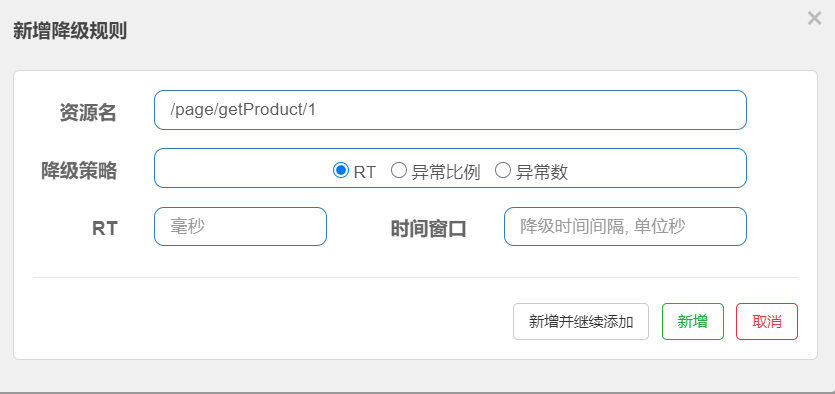
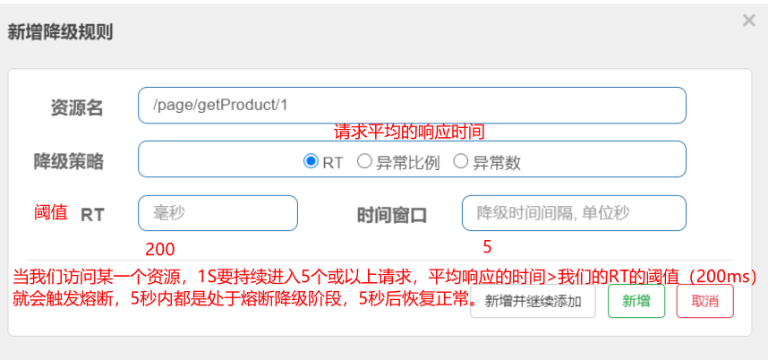

# 目录


# 第 1 节 SCA Sentinel 分布式系统的流量防卫兵

## 1.1 Sentinel 介绍

### 1.1.1 简介

​		Sentinel是一个面向云原生微服务的流量控制、熔断降级组件。

​		替代Hystrix，针对问题：服务雪崩、服务降级、服务熔断、服务限流

​		Hystrix：

​		服务消费者（静态化微服务）—>调用服务提供者（商品微服务）

​		在调用方引入Hystrix

​		1）自己搭建监控平台 dashboard

​		2）没有提供UI界面进行服务熔断、服务降级等配置（使用的是@HystrixCommand参数进行设置，代码入侵）


​		Sentinel：

​		1）独立可部署Dashboard/控制台组件（其实就是一个jar文件，直接运行即可）

​		2）减少代码开发，通过UI界面配置即可完成细粒度控制


Sentinel 分为两个部分:

- 核心库：（Java 客户端）不依赖任何框架/库，能够运行于所有 Java 运行时环境，同时对 Dubbo / Spring Cloud 等框架也有较好的支持。
- 控制台：（Dashboard）基于 Spring Boot 开发，打包后可以直接运行，不需要额外的 Tomcat 等应用容器。


Sentinel 具有以下特征:

- **丰富的应用场景**：Sentinel 承接了阿里巴巴近 10 年的双十一大促流量的核心场景，例如秒杀（即突发流量控制在系统容量可以承受的范围）、消息削峰填谷、集群流量控制、实时熔断下游不可用应用等。
- **完备的实时监控**：Sentinel 同时提供实时的监控功能。可以在控制台中看到接入应用的单台机器秒级数据，甚至 500 台以下规模的集群的汇总运行情况。
- **广泛的开源生态**：Sentinel 提供开箱即用的与其它开源框架/库的整合模块，例如与 Spring Cloud、Dubbo的整合。您只需要引入相应的依赖并进行简单的配置即可快速地接入 Sentinel。
- **完善的 SPI 扩展点**：Sentinel 提供简单易用、完善的 SPI 扩展接口。您可以通过实现扩展接口来快速地定制逻辑。例如定制规则管理、适配动态数据源等。

Sentinel 的主要特性：


Sentinel 的开源生态：


### 1.1.2 Sentinel 关键概念

| 概念名称 | 概念描述                                                     |
| -------- | ------------------------------------------------------------ |
| 资源     | 它可以是 Java 应用程序中的任何内容，例如，由应用程序提供的服务，或由应用程序调用的其它应用提供的服务，甚至可以是一段代码。**我们请求的API接口就是资源** |
| 规则     | 围绕资源的实时状态设定的规则，可以包括流量控制规则、熔断降级规则以及系统保护规则。所有规则可以动态实时调整。 |

### 1.1.3 Sentinel 部署

​		下载地址：https://github.com/alibaba/Sentinel/releases   我们使用[v1.7.1](https://github.com/alibaba/Sentinel/releases/tag/1.7.1)

​		启动：java -jar sentinel-dashboard-1.7.1.jar

​		用户名/密码：sentinel/sentinel


### 1.1.4 服务改造

​		在我们已有的业务场景中，“静态化微服务”调用了“商品微服务”，我们在静态化微服务进行的熔断降级等控制，那么接下来我们改造静态化微服务，引入Sentinel核心包。

​		为了不污染之前的代码，复制一个页面静态化微服务 demo-service-page-9101-sentinel

* pom.xml引入依赖

  ```xml
  <!--sentinel 核心环境 依赖-->
  <dependency>
  	<groupId>com.alibaba.cloud</groupId>
  	<artifactId>spring-cloud-starter-alibaba-sentinel</artifactId>
  </dependency>
  ```

* application.yml修改（配置sentinel dashboard，暴露断点依然要有，删除原有hystrix配置，删除原有OpenFeign的降级配置）

```yaml
server:
  port: 9101   # 后期该微服务多实例，端口从9100递增（10个以内）
Spring:
  #解决bean重复注册问题
  main:
    allow-bean-definition-overriding: true
  application:
    name: demo-service-page
  datasource:
    driver-class-name: com.mysql.jdbc.Driver
    url: jdbc:mysql://localhost:3306/demodb?useUnicode=true&characterEncoding=utf8&serverTimezone=UTC
    username: root
    password: 123456
  cloud:
    nacos:
      discovery:
        server-addr: 127.0.0.1:8848
      config:
        server-addr: 127.0.0.1:8848
        namespace: 26ae1708-28de-4f63-8005-480c48ed6510 #命名空间的ID
        group: DEFAULT_GROUP #如果使用的默认分组,可以不设置
        file-extension: yaml
    #sentinel配置
    sentinel:
      transport:
        dashboard: 127.0.0.1:8080
        port: 8719

# springboot中暴露健康检查等断点接口
management:
  endpoints:
    web:
      exposure:
        include: "*"
  # 暴露健康接口的细节
  endpoint:
    health:
      show-details: always

```

上述配置之后，启动静态化微服务，使用 Sentinel 监控静态化微服务

此时我们发现控制台没有任何变化，因为懒加载，我们只需要发起一次请求触发即可


## 1.2 Sentinel 流量规则模块

​			系统并发能力有限，比如系统A的QPS支持1个，如果太多请求过来，那么A就应该进行流量控制了，比如其他请求直接拒绝


资源名：默认请求路径

针对来源：Sentinel可以针对调用者进行限流，填写微服务名称，默认default（不区分来源）

阈值类型/单机阈值

​		QPS：（每秒钟请求数量）当调用该资源的QPS达到阈值时进行限流

​		线程数：当调用该资源的线程数达到阈值的时候进行限流（线程处理请求的时候，如果说业务逻辑执行时间很长，流量洪峰来临时，会耗费很多线程资源，这些线程资源会堆积，最终可能造成服务不可用，进一步上游服务不可用，最终可能服务雪崩）

是否集群：是否集群限流

流控模式：

​		直接：资源调用达到限流条件时，直接限流

​		关联：关联的资源调用达到阈值时候限流自己

​		链路：只记录指定链路上的流量

流控效果：

​		快速失败：直接失败，抛出异常

​		Warm Up：根据冷加载因子（默认3）的值，从阈值/冷加载因子，经过预热时长，才达到设置的QPS阈值

​		排队等待：匀速排队，让请求匀速通过，阈值类型必须设置为QPS，否则无效

流控模式之关联限流

​		关联的资源调用达到阈值时候限流自己，比如用户注册接口，需要调用身份证校验接口（往往身份证校验接口），如果身份证校验接口请求达到阈值，使用关联，可以对用户注册接口进行限流。


```java
package com.demo.edu.controller;

import com.demo.edu.controller.service.ResumeServiceFeignClient;
import org.springframework.beans.factory.annotation.Autowired;
import org.springframework.web.bind.annotation.GetMapping;
import org.springframework.web.bind.annotation.PathVariable;
import org.springframework.web.bind.annotation.RequestMapping;
import org.springframework.web.bind.annotation.RestController;

@RestController
@RequestMapping("/user")
public class UserController {

    /**
     * 用户注册接口
     * @return
     */
    @GetMapping("/register")
    public String register() {
        System.out.println("Register success!");
        return "Register success!";
    }


    /**
     *  验证注册身份证接口（需要调用公安户籍资源）
     * @return
     */
    @GetMapping("/validateID")
    public String validateID() {
        System.out.println("validateID");
        return "ValidateID success!";
    }
}
```

模拟密集式请求/user/validateID验证接口，我们会发现/user/register接口也被限流了


**流控模式之链路限流**

​		链路指的是请求链路（调用链：A-->B--C，D-->E-->C）

​		链路模式下会控制该资源所在的调用链路入口的流量。需要在规则中配置入口资源，即该调用链路入口的上下文名称。

​		一棵典型的调用树如下图所示：

```
machine-root
                    /       \
                   /         \
             Entrance1     Entrance2
                /              \
               /                \
      DefaultNode(nodeA)     DefaultNode(nodeA)
```

上图中来自入口 `Entrance1` 和 `Entrance2` 的请求都调用到了资源 `NodeA`，Sentinel 允许只根据某个调用入口的统计信息对资源限流。比如链路模式下设置入口资源为 `Entrance1` 来表示只有从入口 `Entrance1` 的调用才会记录到 `NodeA` 的限流统计当中，而不关心经 `Entrance2` 到来的调用。


**流控效果之Warm up**

​		当系统长期处于空闲的情况下，当流量突然增加时，直接把系统拉升到高水位可能瞬间把系统压垮，比如电商网站的秒杀模块。

​		通过 Warm Up 模式（预热模式），让通过的流量缓慢增加，经过设置的预热时间以后，到达系统处理请求速率的设定值。 

​		Warm Up 模式默认会从设置的 QPS 阈值的 1/3 开始慢慢往上增加至 QPS 设置值。


**流控效果之排队等待**

​		排队等待模式下会严格控制请求通过的间隔时间，即请求会**匀速**通过，允许部分请求排队等待，通常用于消息队列削峰填谷等场景。需设置具体的超时时间，当计算的等待时间超过超时时间时请求就会被拒绝。 

​		很多流量过来了，并不是直接拒绝请求，而是请求进行排队，一个一个匀速通过（处理），请求能等就等着被处理，不能等（等待时间>超时时间）就会被拒绝

​		例如，QPS 配置为 5，则代表请求每 200 ms 才能通过一个，多出的请求将排队等待通过。超时时间代表最大排队时间，超出最大排队时间的请求将会直接被拒绝。排队等待模式下，QPS 设置值不要超过 1000（请求间隔 1 ms）。


## 1.3 Sentinel 降级规则模块

​		流控是对外部来的大流量进行控制，熔断降级的视角是对内部问题进行处理。

​		Sentinel 降级会在调用链路中某个资源出现不稳定状态时（例如调用超时或异常比例升高），对这个资源的调用进行限制，让请求快速失败，避免影响到其它的资源而导致级联错误。当资源被降级后，在接下来的降级时间窗口之内，对该资源的调用都自动熔断，**这里的降级其实是Hystrix中的熔断**。

**策略**

​		Sentinel不会像Hystrix那样放过一个请求尝试自我修复，就是明明确确按照时间窗口来，熔断触发后，时间窗口内拒绝请求，时间窗口后就恢复。





* RT（平均响应时间 ）

  ​		当 1s 内持续进入 >=5 个请求，平均响应时间超过阈值（以 ms 为单位），那么在接下的时间窗口（以 s 为单位）之内，对这个方法的调用都会自动地熔断（抛出 DegradeException）。注意 Sentinel 默认统计的 RT 上限是 4900 ms，超出此阈值的都会算作 4900 ms，若需要变更此上限可以通过启动配置项 -Dcsp.sentinel.statistic.max.rt=xxx 来配置。


- 异常比例


​		当资源的每秒请求量 >= 5，并且每秒异常总数占通过量的比值超过阈值之后，资源进入降级状态，即在接下的时间窗口（以 s 为单位）之内，对这个方法的调用都会自动地返回。异常比率的阈值范围是 `[0.0, 1.0]`，代表 0% - 100%。


- 异常数


​		当资源近 1 分钟的异常数目超过阈值之后会进行熔断。注意由于统计时间窗口是分钟级别的，若 `timeWindow` 小于 60s，则结束熔断状态后仍可能再进入熔断状态，时间窗口 >= 60s。


## 1.4 SCA 小结

SCA实际上发展了三条线

* 第一条线：开源出来一些组件
* 第二条线：阿里内部维护了一个分支，自己业务线使用
* 第三条线：阿里云平台部署一套，付费使用

从战略上来说，SCA更是为了贴合阿里云。

目前来看，开源出来的这些组件，推广及普及率不高，社区活跃度不高，稳定性和体验度上仍需进一步提升，根据实际使用来看Sentinel的稳定性和体验度要好于Nacos。1


