[TOC]

## 一、分布式理解

### 1、理解CAP

cap定理（分布式系统的三个指标）：

- Consistency(一致性)：用户访问分布式系统中的任意节点，得到的数据必须一致。

- Avallabiry(可用性)：用户访问集群中的任意健康节点，必须能得到响应，而不是超时或拒绝。

- Partition tolerance(分区容错性)：
  - 分区：因为网络故障或其他原因导致分布式系统中的部分节点与其他节点失去连接，形成独立分区。
  - 容错：在集群出现分区时，整个系统也要持续对外提供服务。

分布式系统无法同时满足这三个指标,这个结论叫做CAP定理。

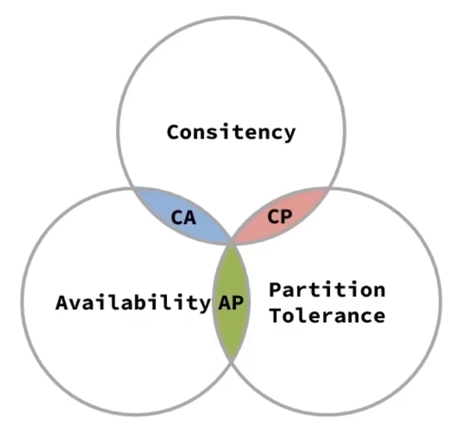

### 2、BASE理论

BASE理论是对CAP的一种解决思路，包含三个思想：

- Basically Available(基本可用):分布式系统在出现故障时，允许损失部分的可用性，即保证核心可用。
- Soft State(软状态)：在一定时间内，允许出现中间状态，比如临时的不一致状态。
- Eventually Consistent(最终一致性)：虽然无法保证一致性，但是在软状态结束后，最终达到数据一致。

而**分布式事务**最大的问题是各个子事务的一致性问题，因此可以借鉴CAP定理和BASE理论：

**AP模式**：各子事务分别执行和提交，允许出现结果不一致，然后采用弥补措施恢复数据即可，实现最终一致。
**CP模式**：各子事务执行后互相等待，同时提交，同时回滚，达成强一致。但事务等待过程中，处于弱可用状态。

### 3、分布式事务模型

解决分布式事务，各个子系统之间必须能感知到彼此的事务状态，才能保证状态一致，因此需要一个事务协调者来协调每一个事务的参与者（子系统事务）。

%5BPK%7B%60%7DG.png)

## 二、Seata架构

seata事务管理中有三个重要的角色：

- **TC(Transaction Coordinator) - 事务协调者**：维护全局和分支事务状态，协调全局事务提交或回滚。
- **TM(Transaction Manager) - 事务管理器**：定义全局事务的范围、开始全局事务、提交或回滚全局事务。
- **RM(Resource Manager) - 资源管理器**：管理分支事务处理的资源，与TC交谈以注册分支事务和报告分支事务的状态，并驱动分支事务提交或回滚。

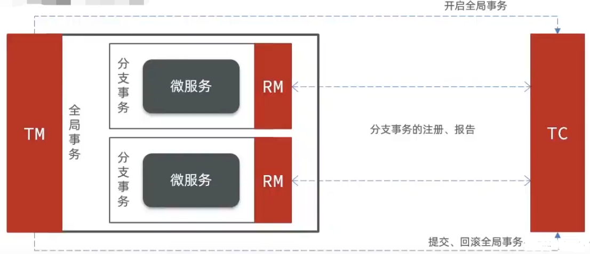

## 三、seata的部署与集成

- **下载seata-server包**http://seata.io/zh-cn/blog/download.html

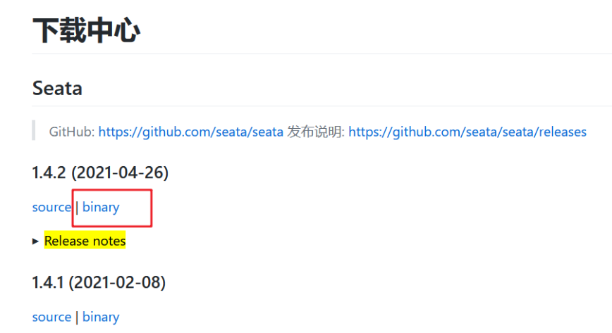

- **修改配置中心类型为nacos,根据自己配置nacos**

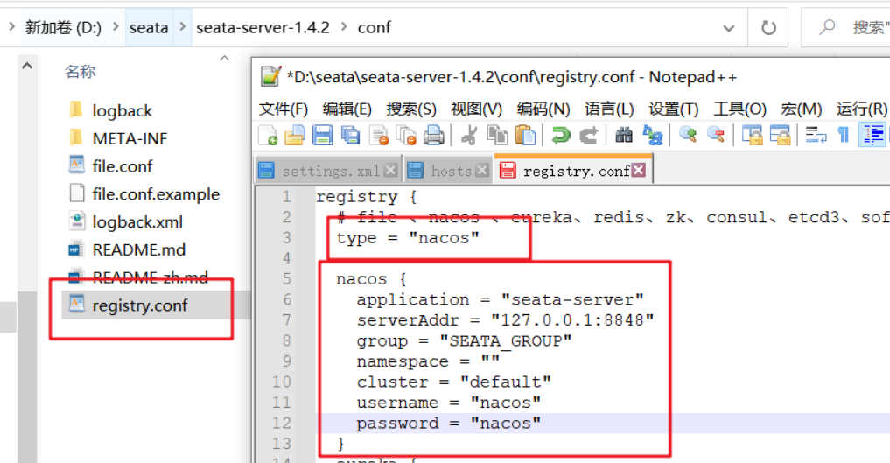

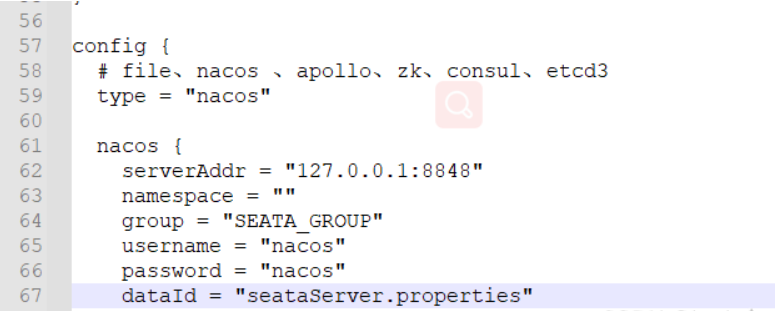

- **nacos新建seata配置**

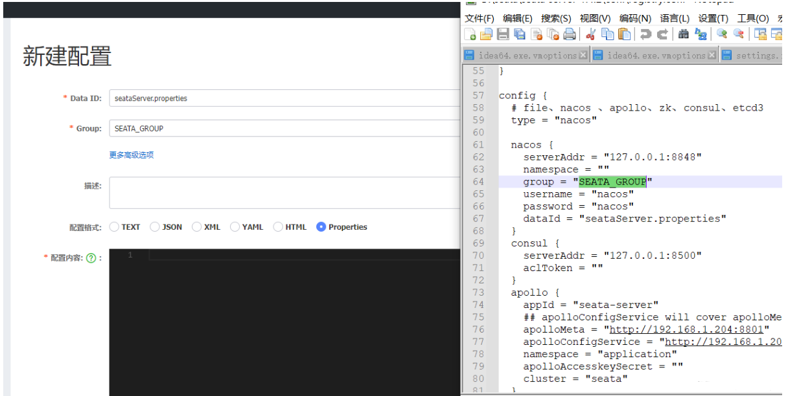

配置内容：

```
# 数据存储方式，db代表数据库
store.mode=db
store.db.datasource=druid
store.db.dbType=mysql
store.db.driverClassName=com.mysql.jdbc.Driver
store.db.url=jdbc:mysql://127.0.0.1:3306/seata?useUnicode=true&rewriteBatchedStatements=true
store.db.user=root
store.db.password=123
store.db.minConn=5
store.db.maxConn=30
store.db.globalTable=global_table
store.db.branchTable=branch_table
store.db.queryLimit=100
store.db.lockTable=lock_table
store.db.maxWait=5000
# 事务、日志等配置
server.recovery.committingRetryPeriod=1000
server.recovery.asynCommittingRetryPeriod=1000
server.recovery.rollbackingRetryPeriod=1000
server.recovery.timeoutRetryPeriod=1000
server.maxCommitRetryTimeout=-1
server.maxRollbackRetryTimeout=-1
server.rollbackRetryTimeoutUnlockEnable=false
server.undo.logSaveDays=7
server.undo.logDeletePeriod=86400000

# 客户端与服务端传输方式
transport.serialization=seata
transport.compressor=none
# 关闭metrics功能，提高性能
metrics.enabled=false
metrics.registryType=compact
metrics.exporterList=prometheus
metrics.exporterPrometheusPort=9898
```

- **mysql新建数据库**

  新建同配置一样的`seata`数据库导入两张表,(可以将这段新建个sql文件)

```

SET NAMES utf8mb4;
SET FOREIGN_KEY_CHECKS = 0;

-- ----------------------------
-- Table structure for branch_table
-- ----------------------------
DROP TABLE IF EXISTS `branch_table`;
CREATE TABLE `branch_table`  (
  `branch_id` bigint(20) NOT NULL,
  `xid` varchar(128) CHARACTER SET utf8 COLLATE utf8_general_ci NOT NULL,
  `transaction_id` bigint(20) NULL DEFAULT NULL,
  `resource_group_id` varchar(32) CHARACTER SET utf8 COLLATE utf8_general_ci NULL DEFAULT NULL,
  `resource_id` varchar(256) CHARACTER SET utf8 COLLATE utf8_general_ci NULL DEFAULT NULL,
  `branch_type` varchar(8) CHARACTER SET utf8 COLLATE utf8_general_ci NULL DEFAULT NULL,
  `status` tinyint(4) NULL DEFAULT NULL,
  `client_id` varchar(64) CHARACTER SET utf8 COLLATE utf8_general_ci NULL DEFAULT NULL,
  `application_data` varchar(2000) CHARACTER SET utf8 COLLATE utf8_general_ci NULL DEFAULT NULL,
  `gmt_create` datetime(6) NULL DEFAULT NULL,
  `gmt_modified` datetime(6) NULL DEFAULT NULL,
  PRIMARY KEY (`branch_id`) USING BTREE,
  INDEX `idx_xid`(`xid`) USING BTREE
) ENGINE = InnoDB CHARACTER SET = utf8 COLLATE = utf8_general_ci ROW_FORMAT = COMPACT;

-- ----------------------------
-- Records of branch_table
-- ----------------------------

-- ----------------------------
-- Table structure for global_table
-- ----------------------------
DROP TABLE IF EXISTS `global_table`;
CREATE TABLE `global_table`  (
  `xid` varchar(128) CHARACTER SET utf8 COLLATE utf8_general_ci NOT NULL,
  `transaction_id` bigint(20) NULL DEFAULT NULL,
  `status` tinyint(4) NOT NULL,
  `application_id` varchar(32) CHARACTER SET utf8 COLLATE utf8_general_ci NULL DEFAULT NULL,
  `transaction_service_group` varchar(32) CHARACTER SET utf8 COLLATE utf8_general_ci NULL DEFAULT NULL,
  `transaction_name` varchar(128) CHARACTER SET utf8 COLLATE utf8_general_ci NULL DEFAULT NULL,
  `timeout` int(11) NULL DEFAULT NULL,
  `begin_time` bigint(20) NULL DEFAULT NULL,
  `application_data` varchar(2000) CHARACTER SET utf8 COLLATE utf8_general_ci NULL DEFAULT NULL,
  `gmt_create` datetime NULL DEFAULT NULL,
  `gmt_modified` datetime NULL DEFAULT NULL,
  PRIMARY KEY (`xid`) USING BTREE,
  INDEX `idx_gmt_modified_status`(`gmt_modified`, `status`) USING BTREE,
  INDEX `idx_transaction_id`(`transaction_id`) USING BTREE
) ENGINE = InnoDB CHARACTER SET = utf8 COLLATE = utf8_general_ci ROW_FORMAT = COMPACT;

-- ----------------------------
-- Records of global_table
-- ----------------------------

-- ----------------------------
-- Table structure for lock_table
-- ----------------------------
DROP TABLE IF EXISTS `lock_table`;
CREATE TABLE `lock_table`  (
  `row_key` varchar(128) CHARACTER SET utf8 COLLATE utf8_general_ci NOT NULL,
  `xid` varchar(96) CHARACTER SET utf8 COLLATE utf8_general_ci NULL DEFAULT NULL,
  `transaction_id` bigint(20) NULL DEFAULT NULL,
  `branch_id` bigint(20) NOT NULL,
  `resource_id` varchar(256) CHARACTER SET utf8 COLLATE utf8_general_ci NULL DEFAULT NULL,
  `table_name` varchar(32) CHARACTER SET utf8 COLLATE utf8_general_ci NULL DEFAULT NULL,
  `pk` varchar(36) CHARACTER SET utf8 COLLATE utf8_general_ci NULL DEFAULT NULL,
  `gmt_create` datetime NULL DEFAULT NULL,
  `gmt_modified` datetime NULL DEFAULT NULL,
  PRIMARY KEY (`row_key`) USING BTREE,
  INDEX `idx_branch_id`(`branch_id`) USING BTREE
) ENGINE = InnoDB CHARACTER SET = utf8 COLLATE = utf8_general_ci ROW_FORMAT = DYNAMIC;

-- ----------------------------
-- Records of lock_table
-- ----------------------------

-- ----------------------------
-- Table structure for undo_log
-- ----------------------------
-- ----------------------------
-- Records of undo_log
-- ----------------------------

SET FOREIGN_KEY_CHECKS = 1;

```

在自己的`业务数据库`加上：

```
DROP TABLE IF EXISTS `undo_log`;
CREATE TABLE `undo_log`  (
  `id` bigint(20) NOT NULL AUTO_INCREMENT,
  `branch_id` bigint(20) NOT NULL,
  `xid` varchar(100) CHARACTER SET utf8 COLLATE utf8_general_ci NOT NULL,
  `context` varchar(128) CHARACTER SET utf8 COLLATE utf8_general_ci NOT NULL,
  `rollback_info` longblob NOT NULL,
  `log_status` int(11) NOT NULL,
  `log_created` datetime NOT NULL,
  `log_modified` datetime NOT NULL,
  `ext` varchar(100) CHARACTER SET utf8 COLLATE utf8_general_ci NULL DEFAULT NULL,
  PRIMARY KEY (`id`) USING BTREE,
  UNIQUE INDEX `ux_undo_log`(`xid`, `branch_id`) USING BTREE
) ENGINE = InnoDB AUTO_INCREMENT = 1 CHARACTER SET = utf8 COLLATE = utf8_general_ci ROW_FORMAT = DYNAMIC;

```

- **打开bin目录下的bat文件**

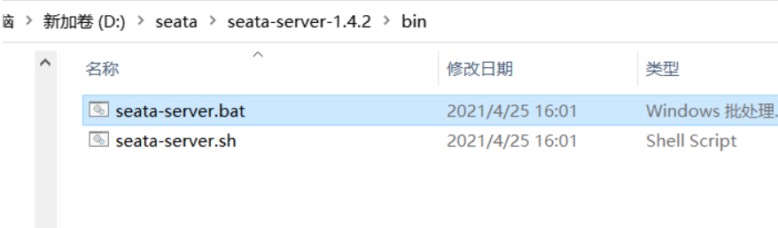

- **启动后，在nacos里就可以看到新增了服务**


## 四、微服务集成seata

- **引入依赖**

```
<dependency>
    <groupId>com.alibaba.cloud</groupId>
    <artifactId>spring-cloud-starter-alibaba-seata</artifactId>
</dependency>

```

- **修改yml配置**

```
seata:
  registry: # TC服务注册中心的配置，微服务根据这些信息去注册中心获取tc服务地址
    # 参考tc服务自己的registry.conf中的配置
    type: nacos
    nacos: # tc
      server-addr: 127.0.0.1:8848
      namespace: ""
      group: SEATA_GROUP
      application: seata-server # tc服务在nacos中的服务名称
      cluster: default #集群
  tx-service-group: seata-demo # 事务组，根据这个获取tc服务的cluster名称
  service:
  	grouplist:
  	  #指定seata的IP端口
  	  seata-server: localhost:8091
    vgroup-mapping: # 事务组与TC服务cluster的映射关系
      seata-demo: default
```

## 五、XA模式

### 1、理解

#### 1.1、源理

XA规范是X/open组织定义的分布式事务处理（DTP）标准，XA规范描述了全局的TM与局部之间的接口，几乎所有的主流的数据库都对XA规范提供了支持。

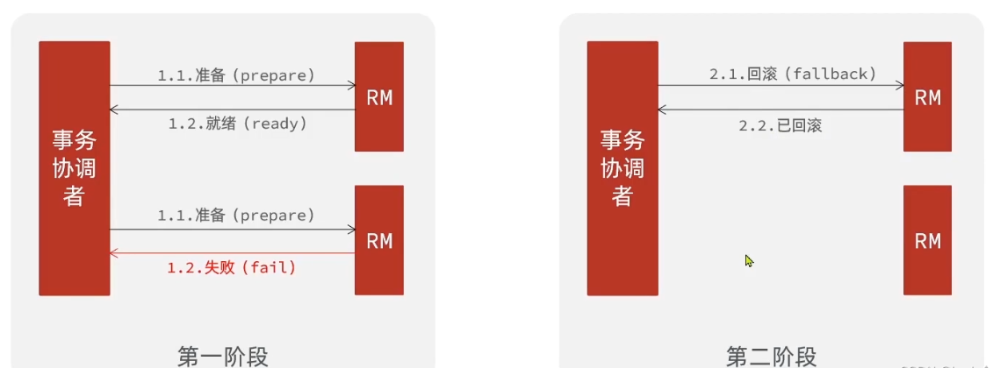

**seata的XA模式**

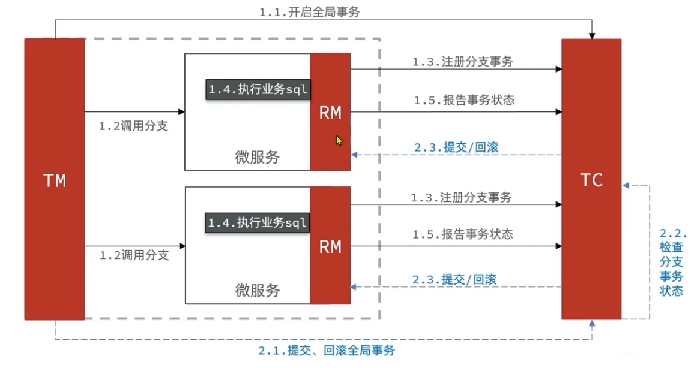

**RM一阶段工作：**

1、注册分支事务到TC
2、执行分支业务sql但不提交
3、报告执行状态到TC

**TC二阶段的工作：**

TC检测各分支事务执行状态
a、如果都成功，通知所有RM提交事务
b、如果有失败，通知所有RM回滚事务

**RM二阶段的工作：**

接收TC的指令，提交或回滚事务

#### 1.2、XA模式优缺点

`优点`:

- 事务的强一致性，满足ACID原则。
- 常用的数据库都支持，实现简单，并且没有代码侵入

`缺点`：

- 因为一阶段需要锁定数据库资源，等待二阶段结束才释放，性能极差。
- 依赖关系型数据库实现事务

### 2、实现XA模式

seata的starter已经完成了XA模式的自动装配，实现非常简单，步骤如下：

**1、修改yml文件（每个参与事务的微服务）**


**2、给发起全局事务的入口方法添加`@GlobalTransactional`**

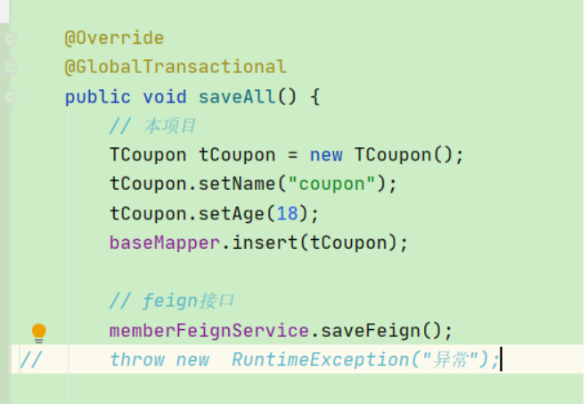

### **3、测试**

`没异常时`，两个数据都加进去

`异常时`，两个数据都未加进去

> 有遇到Could not found global transaction xid = 192.168.220.1:8091:2612312150612307969, may be has finished错误的 重启下seata

## 六、AT模式（最常用）

### 1、理解

#### 1.1、源理

AT模式同样是分阶段提交的事务模型，不过弥补了XA模型中资源锁定周期过长的缺陷。

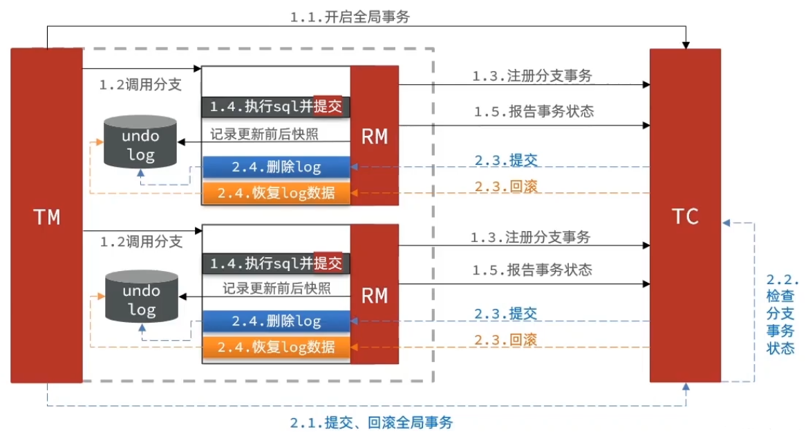

**阶段一RM的工作：**

- 注册分支事务
- `记录undo-log(数据快照)`
- 执行业务sql并`提交`
- 报告事务状态

**阶段二提交时RM的工作:**

- 删除undo-log即可

**阶段二回滚时RM的工作**：

- 根据undo-log恢复数据到更新前

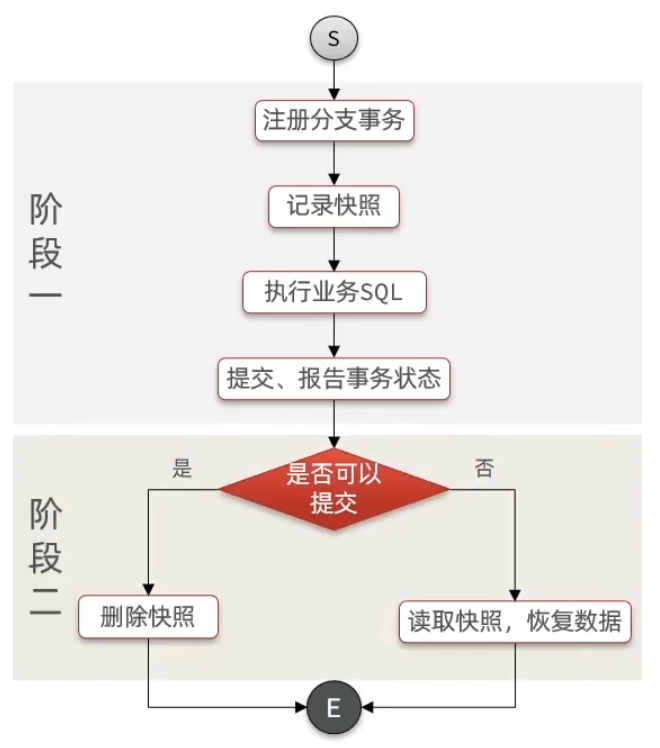

#### 1.2、与XA模式的最大区别

- XA模式一阶段不提交事务，锁定资源；AT模式一阶段直接提交，不锁定资源。
- XA模式依赖数据库机制实现回滚；AT模式利用数据快照实现数据回滚。
- XA模式强一致；AT模式最终一致

#### 1.3、全局锁

##### 1.3.1、AT模式脏写问题

两个事务同时进行时，没有做到事务隔离性，如下事务1已经减10，事务二也减10了，但是事务1异常回滚了，恢复快照，也只能恢复事务1的恢复成100。

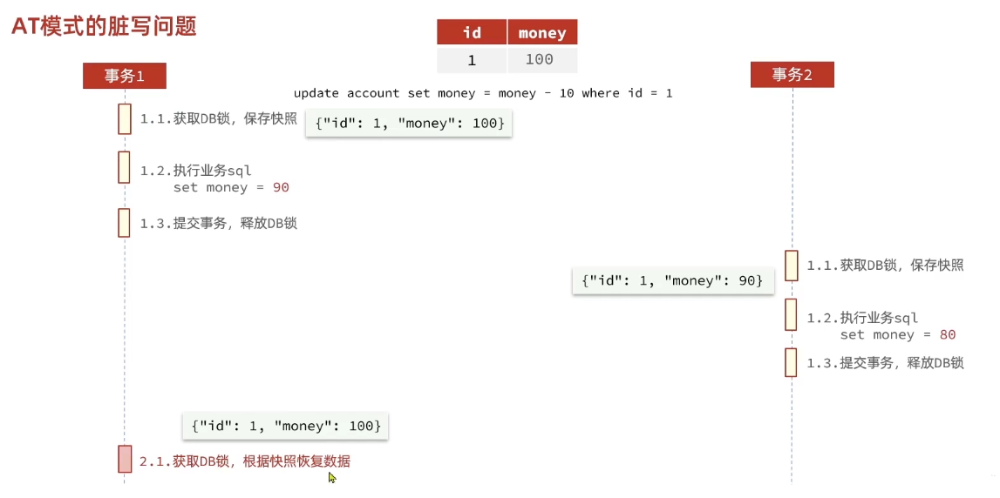

##### 1.3.2、全局锁

1、AT模式用全局锁来解决上方问题。两个事务同时处理时，先获取全局锁的事务1会等待事务2释放DB锁，事务2获取不到全局锁，会有300ms的时间重试，一直获取不到就释放DB锁，事务1就能获取到DB锁，恢复数据了。

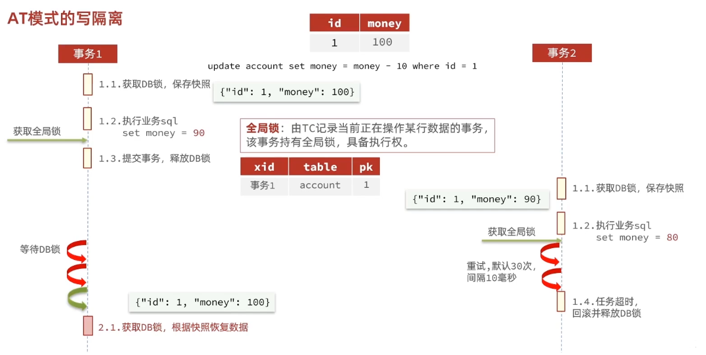

**2、极端模式**保存快照时会保存修改前和修改后的快照，万一事务一恢复数据时，发现现在的值和快照不一样，已经被动过，就会记录异常发送警告，由人工来处理

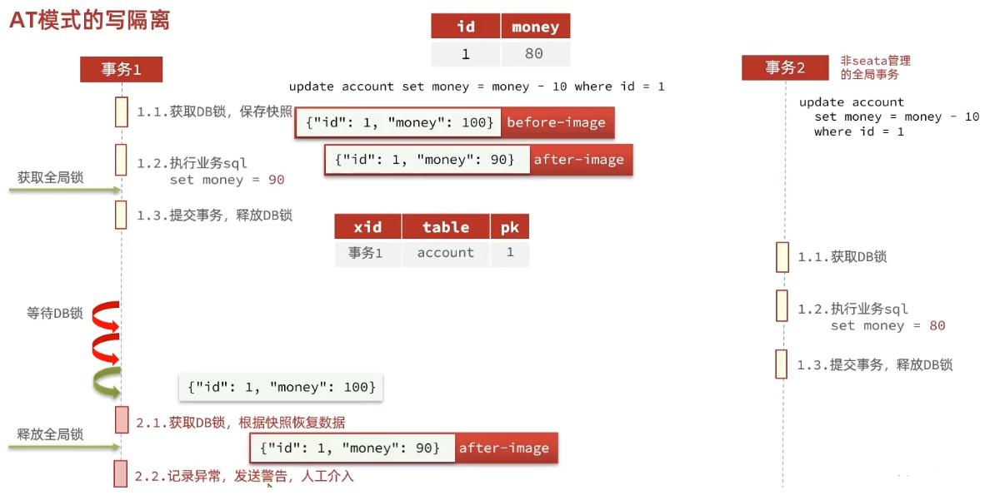

##### 1.3.3、AT模式优缺点

**AT模式的优点：**

- 一阶段完成直接提交事务，释放资源数据库资源，性能比较好
- 利用全局锁实现读写隔离
- 没有代码侵入，框架自动完成回滚和提交

**AT模式缺点：**

- 两阶段之间属于软状态，属于最终一致
- 框架的快照功能会影响性能，但比XA模式要好很多

### 2、实现AT模式

在XA模式配置基础下，只需修改data-source-proxy-mode: AT

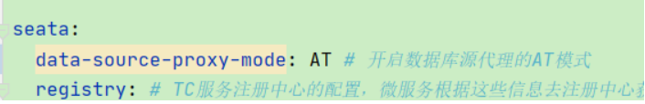

## 七、TCC模式

### 1、理解

#### 1.1、源理

TCC模式与AC模式非常相似，每阶段都是独立事务，不同的是TCC通过人工编码来实现数据恢复。需要实现三个方法：

- Try:资源的检测和预留
- Confirm:完成资源操作业务；要求Try成功Confirm一定要能成功。
- Cancel：预留资源释放，可以理解为try的反向操作

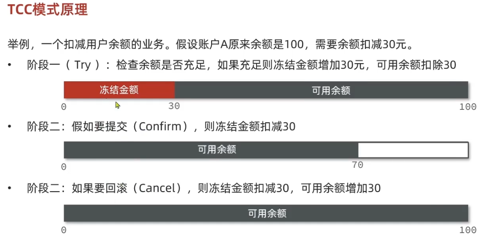

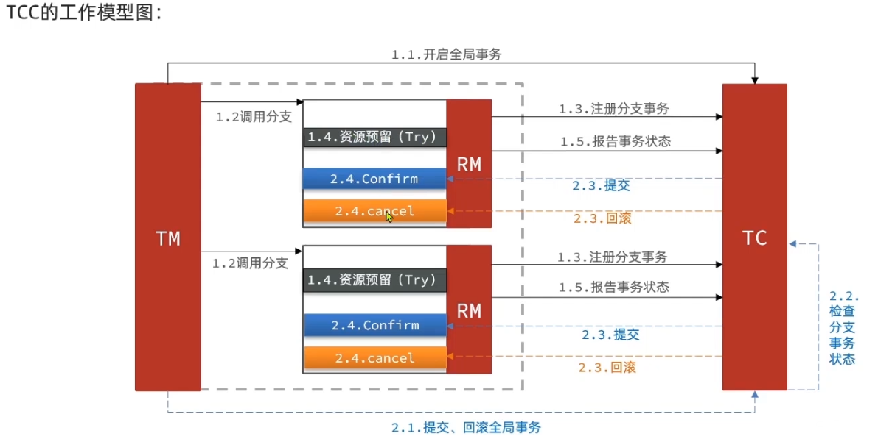

#### 1.2、TCC模式优缺点

**TCC模式优点：**

- 一阶段完成直接提交事务，释放数据库资源，性能好
- 相比AT模型，无需生产快照，无需使用全局锁，性能最强
- 不依赖数据库事务，而是依赖补偿操作，可以用于非事务型数据库

**TCC模式缺点：**

- 有代码侵入，需要人为编写try、Confirm和Cancel接口，太麻烦
- 软状态，事务是最终一致
- 需要考虑Confirm和Cancel的失败情况，失败seata会重试，可能重复处理，需要做好幂等处理

### 2、实现

**1、需修改如下**

- 修改方法，编写try、confim、cancel逻辑
- 保证confirm、cancel接口的`幂等性`

幂等处理就是防止重复处理

- 允许`空回滚`

当某分支事务的try阶段阻塞时，可能导致全局hi五超时而触发二阶段的cancel操作。在未执行try操作时先先执行了cancel操作，这时cancel不能做回滚，这就是空回滚。

- 拒绝`业务悬挂`

对于已将空回滚的业务，如果以后继续执行try,就永远不可能confirm和cancel,这就是业务悬挂。应当阻止执行空回滚后的try操作，避免悬挂。

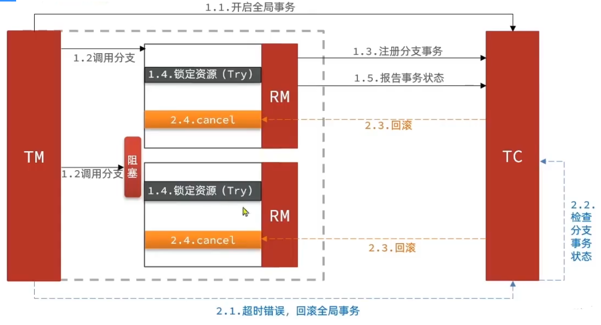

**增加表**

为了实现空回滚，防止业务悬挂，以及幂等性要求。我们必须在数据库操作的同时，记录当前事务id和执行状态，为此我们设计了一张表（自己根据业务设计，主要为了存事务状态，和业务表相关字段）

```
DROP TABLE IF EXISTS `tcc`;
CREATE TABLE `tcc`  (
  `xid` varchar(128) CHARACTER SET utf8 COLLATE utf8_bin NOT NULL,
  `business_id` varchar(255) CHARACTER SET utf8 COLLATE utf8_bin NULL DEFAULT NULL COMMENT '业务id',
  `state` tinyint(1) NULL DEFAULT NULL COMMENT '事务状态，0：try   , 1:confirm ,   2:cancel',
  PRIMARY KEY (`xid`) USING BTREE
) ENGINE = InnoDB CHARACTER SET = utf8 COLLATE = utf8_bin ROW_FORMAT = Dynamic;

```

**新建接口编写try、confirm、cancel接口**

```
@LocalTCC
public interface InsertTCCService {
	/**
	 * try逻辑，@TwoPhaseBusinessAction中的name属性要与当前方法名一致，用于指定try逻辑对应的方法
	 */
	@TwoPhaseBusinessAction(name = "insert",commitMethod = "confirm",rollbackMethod = "cancel")
	void insert(@BusinessActionContextParameter(paramName = "name") String name,
	            @BusinessActionContextParameter(paramName = "age")Integer age);

	/**
	 * 二阶段confirm确认方法，可以另命名，倒要保证与commitMethod一致
	 * @param context 上下文，可与i传递try方法的参数
	 * @return
	 */
	boolean confirm(BusinessActionContext context);

	/**
	 *  二阶段cancel回滚方法，可以另命名，倒要保证与rollbackMethod一致
	 * @param context
	 * @return
	 */
	boolean cancel(BusinessActionContext context);

}

```

**新建实现类，实现上方接口，编写业务**

```
@Service
public class InsertTCCServiceImpl extends ServiceImpl<InsertTCCMapper, Tcc>  implements InsertTCCService {
	@Autowired
	CouponService couponService;


	@Override
	public void insert(String name, Integer age) {
		// 防止业务悬挂，先判断有没有tcc表中有没有记录，如果有，一定是cancel执行过，要拒绝业务
		// 1、获取事务id
		String xid = RootContext.getXID();
		// 2、判断是否有记录
		Tcc byId = this.getById(xid);
		if (byId!=null){
			// cancel执行过，拒绝执行业务
			return;
		}

		// 业务
		TCoupon tCoupon = new TCoupon();
		tCoupon.setName(name);
		tCoupon.setAge(age);
		couponService.save(tCoupon);

		// 记录事务状态和业务id
		Tcc tcc = new Tcc();
		tcc.setBusinessId(tCoupon.getId());
		tcc.setState(0); // 0是try
		this.save(tcc);
	}

	@Override // 成功的方法
	public boolean confirm(BusinessActionContext context) {
		// 获取事务id
		String xid = context.getXid();
		// 根据id删除tcc记录
		boolean b = this.removeById(xid);
		return b;
	}

	@Override // try的反向，恢复业务修改的数据
	public boolean cancel(BusinessActionContext context) {
		// 获取事务id
		String xid = context.getXid();
		// 查询tcc表，获取我们寸的businessId
		Tcc tcc = this.getById(xid);

		// -----空回滚的判断，为null证明try没执行，需要空回滚,就是再添加一条tcc记录，state存cancel-----
		if (tcc == null){
			// 记录事务状态和业务id
			tcc = new Tcc();
			tcc.setBusinessId(context.getActionContext("name").toString()); // 从try传的参数获取，这个字段值要唯一
			tcc.setState(2); // 2是cancel
			this.save(tcc);
			return true;
		}

		// ----幂等处理，状态判断，防止重复处理-------
		if (tcc.getState() == 2){ // 已经提交过了
			return true;
		}


		// 根据businessId删除我们业务里新增的数据
		boolean b = couponService.removeById(tcc.getBusinessId());
		return b;
	}
}

```

## 八、Saga模式

### 1、理解

#### 1.1、源理

saga模式是seata提供的长事务解决方案，也分为两个阶段：

- 一阶段：直接提交本地事务
- 二阶段：成功则什么都不做；失败则通过编写补偿业务来回滚。

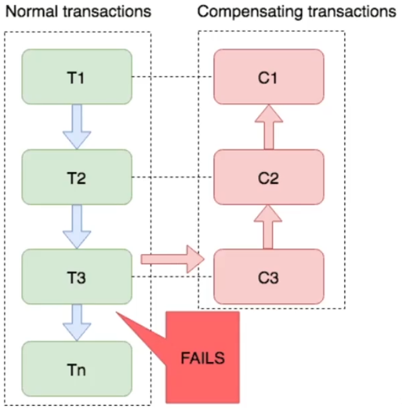

这种模型比较适合业务很大的场景，用的比较少.

#### 1.2、Saga模型优缺点

**Saga模式优点：**

- 事务参与者可以基于事件驱动实现异步调用，吞吐高
- 一阶段可以直接提交事务，无锁，性能好
- 不用编写TCC中的三个阶段，实现简单

**Saga缺点：**

- 软状态持续时间不长，失效性差
- 没有锁，没有事务隔离，会有脏写

## 九、四种模型对比

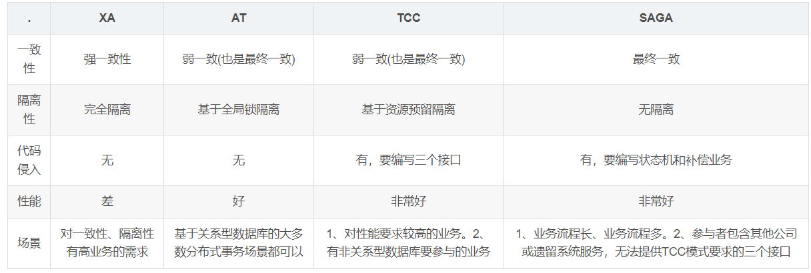