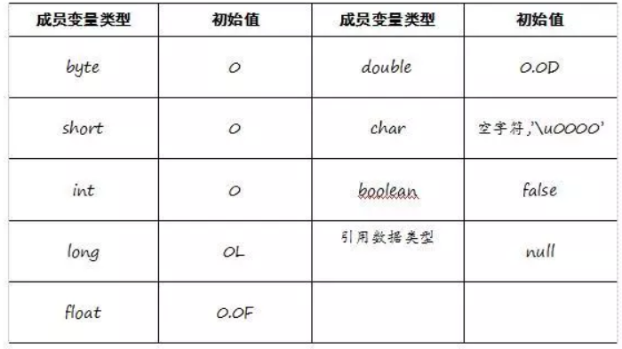
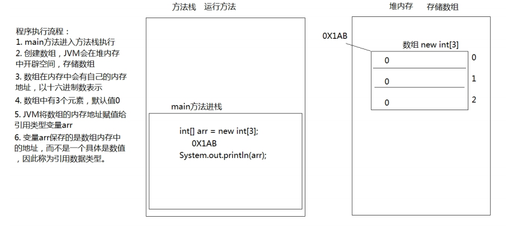

# 学习目标

```
1、掌握一维数组的定义和基本使用
2、理解数组的内存结构原理
3、掌握二维数组的定义和基本使用
4、掌握数组的基本算法和实现
5、掌握数组工具类Arrays的使用
```


# 第1章 数组概述

## 1.1 数组介绍

现在假如要统计我们班的学生姓名情况，用前面所学的知识，我们可能需要先声明n多个个变量来分别记住每个学生的姓名，这样做会显得很麻烦，而且容易出错。因此我们可以使用容器进行操作。将所有的数据全部存储到一个容器中，统一操作。

因此，这就引出了一个容器的概念。


**容器概念：**

- **容器：**是将多个数据存储到一起，每个数据称为该容器的元素。
- **生活中的容器：**水杯，衣柜，教室


Java从容器的角度衍生出了针对数据存储的Java容器：数组。

 **数组介绍：**

- **数组概念：** 数组就是数据类型一致、数据长度固定的用来存储数据的容器。


## 1.2 数组的分类

前面介绍了，数组就是存放数据类型一致、长度固定的容器，而我们的数据类型又分为基本数据类型和引用数据类型。因此，数组中可以存放一些基本数据类型数据，比如int、long，也可以存放引用数据类型，比如String、类、甚至是数组本身。也就是说，数组里面甚至可以嵌套数组，因此Java数组可以分为一维数组、二维数组、。。。多为数组。

开发中，最常用的还是一维数组以及二维数组。二维数组顾名思义，就是在一维数组中的每一个元素类型又是一个数组（类似之前学习的嵌套for循环）。


# 第2章 一维数组的基本操作

## 2.1 一维数组的定义

数组的定义有三种方式。

#### 1. 方式一

- **格式：**

```
 数据类型[] 数组名 = new 数据类型[长度];
```

- **数组定义格式详解：**
  - 数据类型： 创建的数组容器可以存储什么数据类型，所有数据类型都可以存储。
  - [] : 表示数组。
  - 数组名字：为定义的数组起个变量名，满足标识符规范，可以使用名字操作数组。
  - new：关键字，创建数组使用的关键字。
  - [长度]：数组的长度，表示数组容器中可以存储多少个元素。
  - **注意：数组有定长特性，长度一旦指定，不可更改。**
    - 和水杯道理相同，买了一个2升的水杯，总容量就是2升，不能多也不能少。
- **举例：**

定义可以存储6个整数的数组容器，代码如下：

```
int[] array = new int[6];
```


#### 2.方式二

- **格式：**

```
数据类型[] 数组名 = new 数据类型[]{元素1,元素2,元素3...};
```

- **举例：**

定义存储1，2，3，4，5，6整数的数组容器。

```
int[] arr = new int[]{1,2,3,4,5,6};
```


#### 3.方式三

- **格式：**

```
数据类型[] 数组名 = {元素1,元素2,元素3...};
```

- **举例：**

定义存储1，2，3，4，5，6整数的数组容器。

```
int[] arr = {1,2,3,4,5,6};
```


> **说明：**
>
> 上面定义数组并初始化的时候，都是使用int[] arr这种形式，Java数组还支持int arr[] 这种形式的定义。


## 2.2 数组的基本操作

数组是存储一类元素的，有了数组就方便进行元素统一管理，下面介绍一下数组的基本操作。

### 2.2.1 数组相关概念说明

- **索引：** 每一个存储到数组的元素，都会自动的拥有一个编号，从0开始，这个自动编号称为**数组索引(index)**，可以通过数组的索引访问到数组中的元素。
  - **格式：**

```
数组名[索引]
```

- **数组的长度属性：** 每个数组都具有长度，而且是固定的，Java中赋予了数组的一个属性，可以获取到数组的长度，语句为：`数组名.length` ，属性length的执行结果是数组的长度，int类型结果。由次可以推断出，数组的最大索引值为`数组名.length-1`。


### 2.2.2 数组基本操作

数组创建后，涉及到数组的对应位置元素的初始化、元素的修改、元素的获取。

```java
	public static void main(String[] args) {
		// 定义一个定长数组
		int[] array = new int[3];
		// 1、元素赋值
		array[0]=1;
		array[1]=2;
		array[2]=3;
		
		// 2、元素修改
		array[0]=11;
		
		// 3、元素获取
		int a=array[0];
		
		// 打印数组，Arrays先了解即可
		System.out.println(Arrays.toString(array));
	}
```

> **注意：**因为数组长度固定，因此数组本身无法添加或者移除元素，但是我们可以在原数组的基础上复制一份数组来改变其长度和元素。


### 2.2.3 数组初始化值介绍

在前面章节学习java变量的时候介绍过，定义的变量如果没有初始化赋值是不能使用的，否则编译报错。而今天学习的数组，内部可以存放各种数据类型，如果没有初始化赋值是否会报错呢？

```java
	public static void main(String[] args) {
		// 定义一个定长数组
		int[] array = new int[3];
		
		System.out.println(array[0]); // 0
	}
```

上面示例结果没有报错，且输出结果为0，测试发现没有初始化赋值的int类型数组每一个位置都有个默认值0。

所以，这里要强调的是数组作为一个引用数据类型，内部可以存放各种类型元素，如果没有进行初始化赋值，都会有一个默认初始化值。




## 2.3 数组原理分析

### 2.3.1 内存概述

内存是计算机中的重要原件，临时存储区域，作用是运行程序。我们编写的程序是存放在硬盘中的，在硬盘中的程序是不会运行的，必须放进内存中才能运行，运行完毕后会清空内存。

Java虚拟机要运行程序，必须要对内存进行空间的分配和管理。

### 2.3.2 Java虚拟机的内存划分

为了提高运算效率，就对空间进行了不同区域的划分，因为每一片区域都有特定的处理数据方式和内存管理方式。

**官方文档地址：**https://docs.oracle.com/javase/specs/jvms/se8/html/index.html


**内存区域说明：**

| 区域名称             | 作用                                                         | 说明                                                         |
| -------------------- | ------------------------------------------------------------ | ------------------------------------------------------------ |
| 程序计数器（寄存器） | 是一块较小的内存区域，可以看做是当前线程执行的字节码的行号指示器 | 给CPU使用，和我们开发无关                                    |
| 虚拟机栈             | 虚拟机栈描述的是Java方法执行的内存模型                       | JVM在使用操作系统功能的时候使用，和我们开发无关              |
| 堆                   | 该区域的唯一目的就是存放对象实例，几乎所有的对象实例都在这里分配内存 | 是Java虚拟机所管理的内存中最大的一块，被进程的所有线程共享，在虚拟机启动时被创建 |
| 方法区               | 存放的是被虚拟机加载的class类信息，常量，静态变量，即时编译器编译后的代码等数据 | 方法区也是线程共享的                                         |
| 本地方法栈           | 与虚拟机栈类似，为虚拟机使用到的Native方法服务               | 方法运行时使用的内存，比如main方法运行，进入方法栈中执行     |


### 2.3.3 数组在内存中的存储

先定义一个普通数组:

```java
	public static void main(String[] args) {
		// 定义一个定长数组
		int[] array = new int[3];

		System.out.println(array);  // [I@15db9742
	}
```

以上方法执行，输出的结果是[I@15db9742，这个是什么呢？是数组在内存中的地址。new出来的内容，都是在堆内存中存储的，而方法中的变量arr保存的是数组的地址，是在本地方法栈中存储的。




## 2.4 数组常见问题说明

初学者在进行数组操作过程中，经常遇到几个特别常见的错误，这里进行总结说明。

### 2.4.1 数组角标越界异常

观察一下代码，运行后会出现什么结果。

```java
public static void main(String[] args) {
    int[] arr = {1,2,3};
    System.out.println(arr[3]);
}
```

**运行效果：**


**说明：**创建数组，赋值3个元素，数组的索引就是0，1，2，没有3索引，因此我们不能访问数组中不存在的索引，程序运行后，将会抛出 `ArrayIndexOutOfBoundsException`  数组越界异常。


### 2.4.2 空指针异常

观察一下代码，运行后会出现什么结果。

```java
public static void main(String[] args) {
    int[] arr = {1,2,3};
    arr = null;
    System.out.println(arr[0]);
｝
```

**运行结果：**


**说明：**`arr = null`这行代码，意味着变量arr将不会在保存数组的内存地址，也就不允许再操作数组了，因此运行的时候会抛出`NullPointerException` 空指针异常。


# 第3章 二维数组介绍

数组除了包括有简单的一维数组还有嵌套的多维数组（类比嵌套for循环），这里我们就对开发中另一个常用的二维数组为例进行多维数组的讲解。

## 3.1 二维数组的定义

二维数组，本质就是在一维数组的基础上，每一个元素又由一个新的数组组成。


#### 1. 方式一

- **格式：**

```text
 数据类型[][] 数组名字 = new 数据类型[长度][长度];
```

- **举例：**

```text
int[][] array = new int[2][3];
```

这种方式只是设定了数组的一维和二维的长度，并没有赋值。

#### 2.方式二

- **格式：**

```text
数据类型[][] 数组名字 = new 数据类型[长度][];
```

- **举例：**

```text
int[][] array = new int[2][];
```

这种方式在定义的时候只规定了外层的一维数组个数，并未规定内部元素嵌套的二维数组的内容和长度。


#### 3.方式三

- **格式：**

```text
数据类型[][] 数组名字 = new 数据类型[][]{ {元素1},{元素2}...};
```

或者

```text
数据类型[][] 数组名字 = {{元素1},{元素2}...};
```

- **举例：**

```text
int[][] array = new int[][]{ {1,2},{3,4}};
int[][] array = { {1,2},{3,4}};
```

这种方式在定义的时候，直接对数组进行了初始化赋值。


## 3.2 二维数组的基本操作

二维数组同样，涉及到赋值、修改与获取。

```java
	public static void main(String[] args) {
		// 定义一个指定容量的二维数组
		int[][] array = new int[2][3];
		// 1、赋值
		array[0][0]=0;
		array[0][1]=1;
		array[0][2]=2;
		array[1][0]=3;
		array[1][1]=4;
		
		// 2、修改
		array[0][0]=110;
		
		// 3、获取
		int a=array[0][0];

		// 打印数组
	    System.out.println(Arrays.deepToString(array));
	}
```


# 第4章 数组练习

## 4.1 数组遍历

- **数组遍历：** 就是将数组中的每个元素分别获取出来，就是遍历。遍历也是数组操作中的基本操作。

```java
public static void main(String[] args) {
    int[] arr = { 1, 2, 3, 4, 5};
    System.out.println(arr[0]);
    System.out.println(arr[1]);
    System.out.println(arr[2]);
    System.out.println(arr[3]);
    System.out.println(arr[4]);
}
```

以上代码是可以将数组中每个元素全部遍历出来，但是如果数组元素非常多，这种写法肯定不行，因此我们需要改造成循环的写法。数组的索引是`0`到`lenght-1` ，可以作为循环的条件出现。 

**1、普通for循环遍历**

```java
public static void main(String[] args) {
    int[] arr = { 1, 2, 3, 4, 5 };
    for (int i = 0; i < arr.length; i++) {
      System.out.println(arr[i]);
    }
}
```

**2、增强for循环**

```java
	public static void main(String[] args) {
       int[] arr = { 1, 2, 3, 4, 5 };
	   for (int e : arr) {
		   System.out.println(e);
	   }
	}
```


## 4.2 数组获取最大值

- **最大值获取：**从数组的所有元素中找出最大值。
- **实现思路：**
  - 定义变量，保存数组0索引上的元素
  - 遍历数组，获取出数组中的每个元素
  - 将遍历到的元素和保存数组0索引上值的变量进行比较
  - 如果数组元素的值大于了变量的值，变量记录住新的值
  - 数组循环遍历结束，变量保存的就是数组中的最大值


**示例代码：**

```java
public static void main(String[] args) {
    int[] arr = { 5, 15, 2000, 10000, 100, 4000 };
    //定义变量，保存数组中0索引的元素
    int max = arr[0];
    //遍历数组，取出每个元素
    for (int i = 0; i < arr.length; i++) {
      //遍历到的元素和变量max比较
      //如果数组元素大于max
      if (arr[i] > max) {
        //max记录住大值
        max = arr[i];
      }
    }
    System.out.println("数组最大值是： " + max);
}
```


## 4.3 数组冒泡排序

- **数组排序：**就是对原数组中杂乱无序的元素按照从小到大或者从大到小的顺序排序。
- **实现思路：**
  - 参考上述获取数组元素最大值的方式，使用嵌套循环，循环一次获取最大值放在首位或者末尾，依次循环类推。


**数组排序2种常见的方式：**冒泡排序、选择排序。

- **原理：**
  - 比较相邻的元素。如果第一个比第二个大，就交换他们两个。
  - 对每一对相邻元素做同样的工作，从开始第一对到结尾的最后一对。在这一点，最后的元素应该会是最大的数。
  - 针对所有的元素重复以上的步骤，除了最后一个。
  - 持续每次对越来越少的元素重复上面的步骤，直到没有任何一对数字需要比较。


- **实现：**

```java
	public static void main(String[] args) {
		// 定义一个元素顺序杂乱的数组
		int[] arr = { 4, 1, 3, 6, 2, 5};
		// 外层循环表示比较轮数
		for (int i = 1; i <= arr.length-1; i++) {
			// 内层循环对比相邻两个数
			for (int j = 0; j < arr.length-i; j++) {
				// 定义一个临时变量
				int tempMax=0;
				// 进行元素位置交换
				if(arr[j]>arr[j+1]) {
					tempMax=arr[j];
					arr[j]=arr[j+1];
					arr[j+1]=tempMax;
				}
			}
		}
		// 打印
		System.out.println(Arrays.toString(arr));
	}
```


# 第5章 Arrays数组工具类

上一章，我们通过底层原始方式对数组完成了相关的遍历、排序、查找等操作，如果以后还有这种需求，我们再重复编写这种代码就显得比较麻烦，因此，我们可以自己把这些实现封装成一个工具类。鉴于此，Java为了方便开发，也提供了专门针对数组操作的工具类Arrays，这里面提供了很多实用方法，下面对这里一些常用方法进行介绍。

**常用Arrays工具类方法介绍：**

| 方法                                               | 说明                                                         |
| -------------------------------------------------- | ------------------------------------------------------------ |
| `toString(Object[] a)`                             | 将任意类型的数组的元素以字符串形式打印                       |
| `deepToString(Object[] a)`                         | 将任意类型的数组的深度元素以字符串形式打印（比如多维数组元素） |
| `asList(T... a)`                                   | 将任意类型数组转换为List集合形式                             |
| binarySearch(int[] a, int key)                     | 二分查找方法                                                 |
| sort(int[] a)                                      | 数组排序                                                     |
| fill(int[] a, int fromIndex, int toIndex, int val) | 替换数组指定角标位置元素                                     |
| copyOfRange(int[] original, int from, int to)      | 对原数组进行指定范围元素复制为一个新数组                     |


**示例演示：**

```java
	public static void main(String[] args) {
		// 定义一个元素顺序杂乱的数组
		int[] arr = { 4, 1, 3, 6, 2, 5};
		// 直接打印
		System.out.println(arr);
		// 1、将数组以字符串形式打印
		System.out.println(Arrays.toString(arr));

		// 2、数组排序
		Arrays.sort(arr);
		System.out.println(Arrays.toString(arr));
		
		// 3、数组二分查找
		int index =Arrays.binarySearch(arr, 1);
		System.out.println("元素1在有序数组arr中的索引位置为："+index);
		
		// 4、数组元素替换
		Arrays.fill(arr, 0, 2, 0);
		System.out.println(Arrays.toString(arr));
		
		// 5、数组的复制
		int[] copyArray =Arrays.copyOfRange(arr, 0, 3);
		System.out.println(Arrays.toString(copyArray));
	}
```


