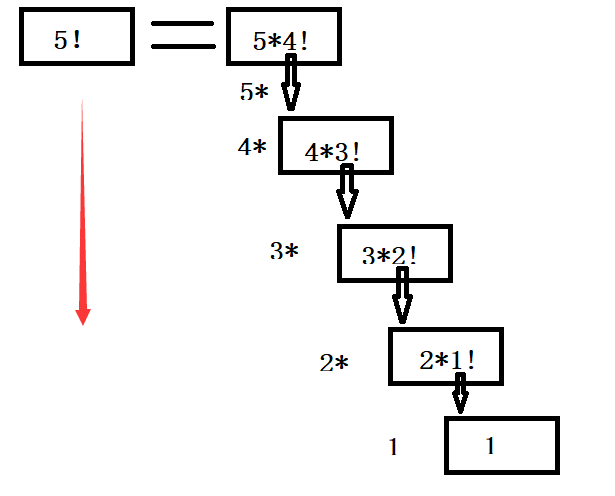
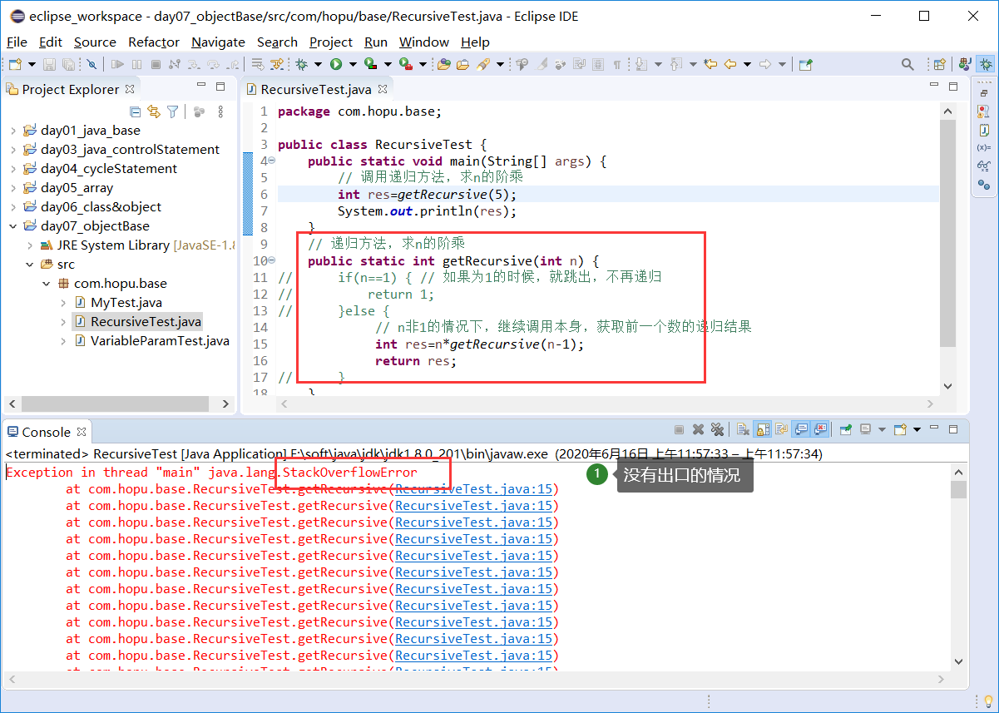
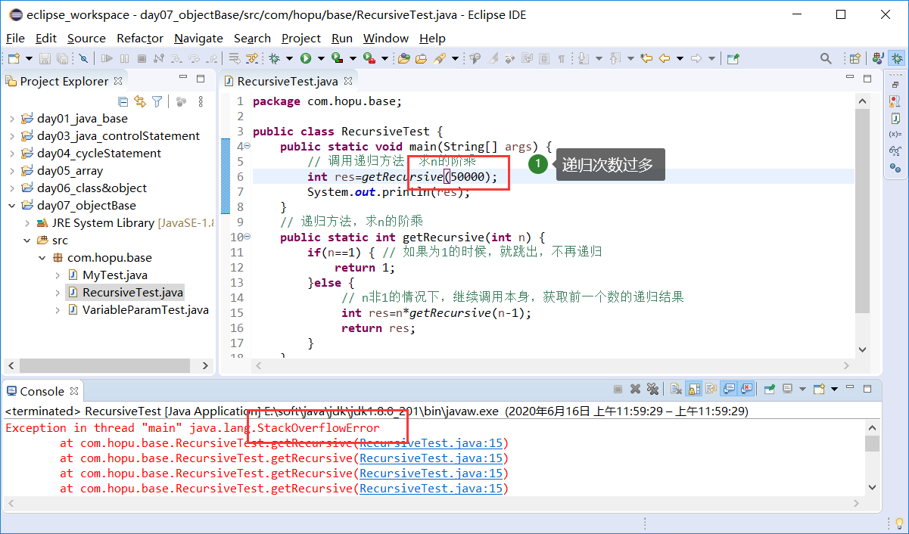
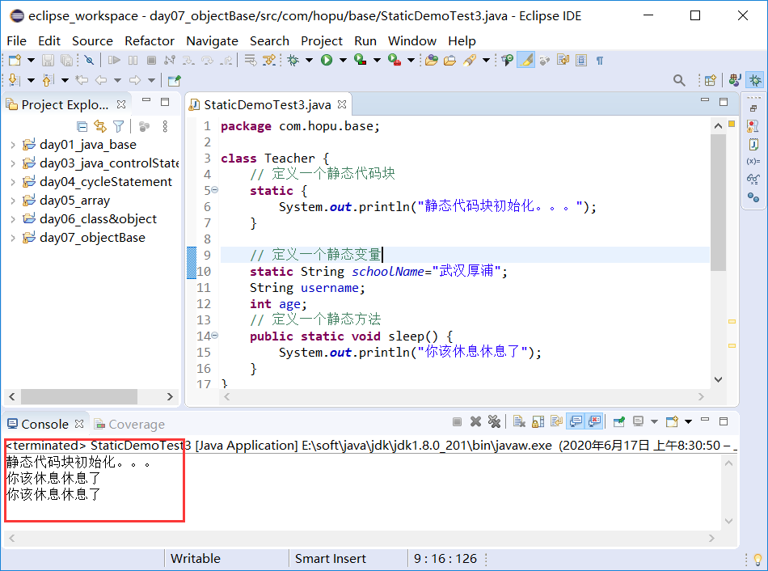
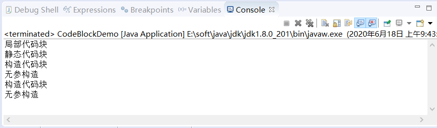
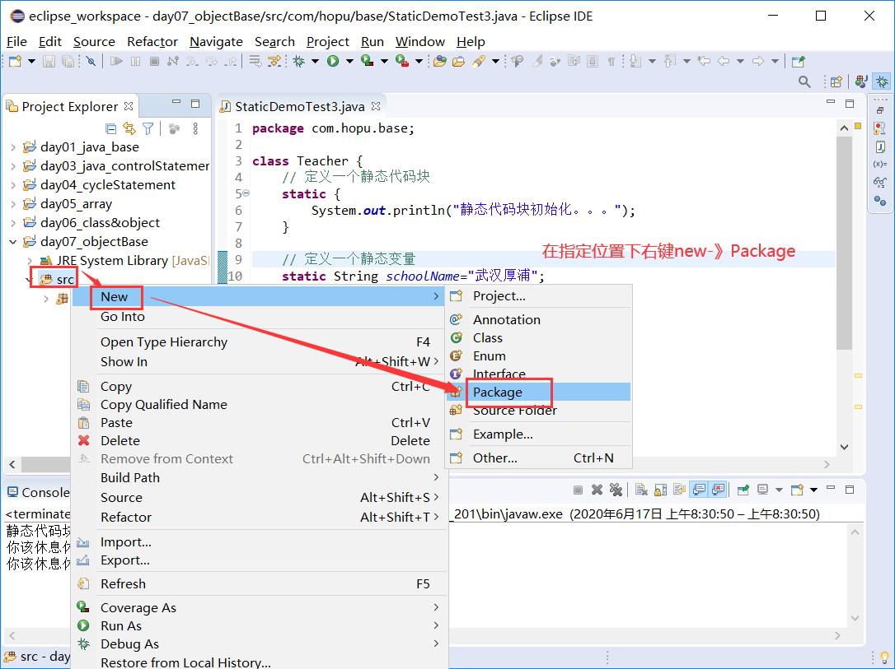
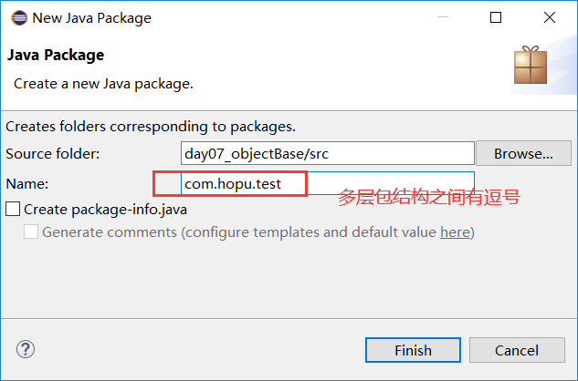
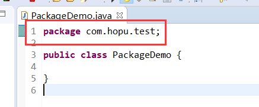
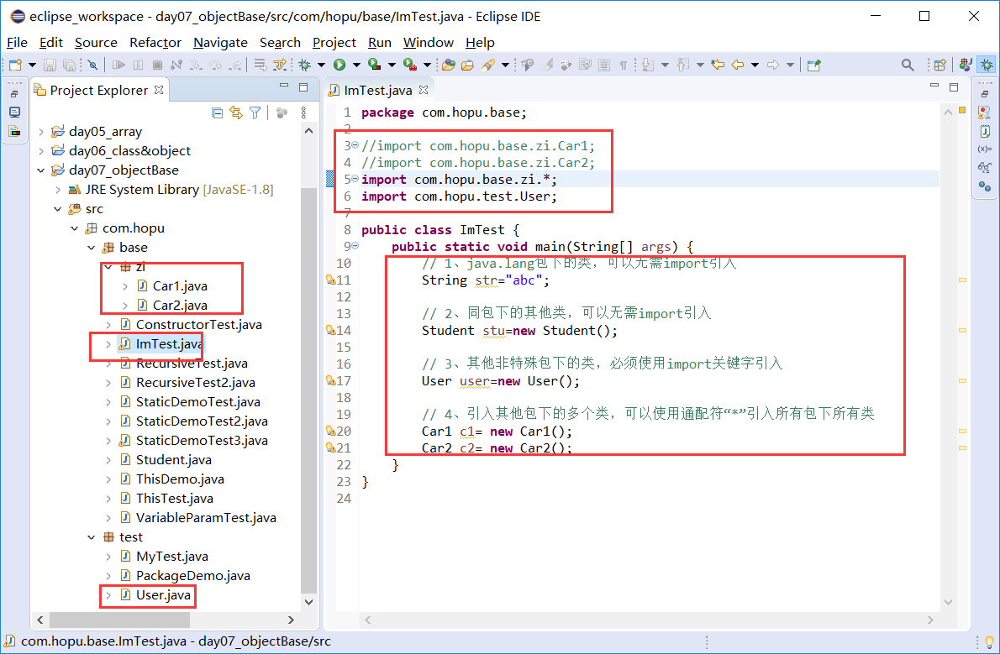

# 学习目标

```
1、掌握方法的可变参数定义及使用
2、掌握递归算法以及其他优缺点
3、掌握构造方法的定义及使用
4、掌握this、static、package、import关键字
5、熟练实现一些常用算法
```


# 第1章 方法的可变参数

## 1.1 方法的可变参数引入

**需求一：**

现在假如有这样一个设计需求，一个工具类中，要实现一个求2个整数之和的方法；接着，还需要实现一个求2个小数求和的方法。

针对上面这个需求，最开始我们可以定义两个方法getSum1()和getSum2()分别求和。但是，如果类似需求增多了呢？这种定义方法的方式就显得不够文雅了，因此，这里就可以用上我们前一天学习的方法重载了。

**需求二：**

接着，又有这样的需求改进：不但要实现2个整数之和，还要实现三个、甚至是四个、五个、。。。整数之和，怎么解决呢？难道，我们就定义n个这样的求和方法?

针对这种需求，即使用上方法重载也是不太好实现这个需求的，我们不知道到底有几个参数，也不知道到底要定义几个这样的方法。为此，Java设计出了方法的可变参数来实现这种需求。


## 1.2 方法的可变参数介绍

在实际开发过程中，有时方法中参数的个数是不确定，但是类型相同的。为了解决这个问题，在 J2SE 5.0 版本中引入了可变参数的概念。

**语法**

```
方法名([固定参数列表],可变参数类型… 可变参数形参名)
```

**示例：**

```
getSum(int... v);
getOrder(String a,int... ids);
```


**说明：**

- 当需求设计方法时，方法的部分参数类型一致且个数不定，就可以使用Java的可变参数定义方法；
- 定义可变参数方法时，允许加入其他类型的固定参数列表，且可变参数必须放在最后；
- 在方法中定义可变参数后，我们可以像操作数组一样操作该参数。


## 1.3 方法的可变参数使用

在方法中定义可变参数后，我们可以像操作数组一样操作该参数。

这里，我们就对前面小节的需求使用方法的可变参数进行实现。

```java
public class VariableParamTest {
	public static void main(String[] args) {
		int rs1= getSum();
		System.out.println(rs1);
		
		int rs2= getSum(1,2);
		System.out.println(rs2);	
	}
	
	// 定义一个可变参数方法，求取n个整数之和
	public static int getSum(int... numbers) {
		int sum=0;
		for (int i = 0; i < numbers.length; i++) {
			sum+=numbers[i];
		}
		return sum;
	}
}
```


# 第2章 递归方法

## 2.1 递归介绍

**递归算法**（英语：recursion algorithm）在[计算机科学](https://baike.baidu.com/item/计算机科学/9132)中是指一种通过重复将问题分解为同类的子问题而解决问题的方法。递归式方法可以被用于解决很多的计算机科学问题，因此它是计算机科学中十分重要的一个概念。绝大多数[编程语言](https://baike.baidu.com/item/编程语言/9845131)支持[函数](https://baike.baidu.com/item/函数/301912)的自调用，在这些语言中函数可以通过调用自身来进行递归。[计算理论](https://baike.baidu.com/item/计算理论/3729830)可以证明递归的作用可以完全取代[循环](https://baike.baidu.com/item/循环)，因此在很多[函数编程语言](https://baike.baidu.com/item/函数编程语言)（如[Scheme](https://baike.baidu.com/item/Scheme)）中习惯用递归来实现循环。

递归往往能给我们带来非常简洁非常直观的代码形势，从而使我们的编码大大简化，然而递归的思维确实很我们的常规思维相逆的，我们通常都是从上而下的思维问题， 而递归趋势从下往上的进行思维。这样我们就能看到我们会用很少的语句解决了非常大的问题，所以递归策略的最主要体现就是小的代码量解决了非常复杂的问题。


**场景说明：**

假设你在一个电影院，你想知道自己坐在哪一排，但是前面人很多，你懒得去数了，于是你问前一排的人「你坐在哪一排？」，这样前面的人 (代号 A) 回答你以后，你就知道自己在哪一排了——只要把 A 的答案加一，就是自己所在的排了，不料 A 比你还懒，他也不想数，于是他也问他前面的人 B「你坐在哪一排？」，这样 A 可以用和你一模一样的步骤知道自己所在的排。然后 B 也如法炮制，直到他们这一串人问到了最前面的一排（或者说问到了知道自己是哪一排的人，预示着调用结束），第一排的人告诉问问题的人「我在第一排」，最后大家就都知道自己在哪一排了。

**定义：** 一个方法在执行过程中调用自身, 就称为 “递归”。

递归，相当于数学上的 “数学归纳法”, 有一个起始条件, 然后有一个递推公式. 例如, 我们求 N! 起始条件: N = 1 的时候, N! 为 1. 这个起始条件相当于递归的结束条件。


## 2.2 递归使用

递归的思想就是，通过重复将问题分解为同类的子问题而解决问题的方法。也就是说，针对同样的工作，我们可以定义一个方法，然后重复调用即可。

这里，我们以一个求n的阶乘为例进行说明。


求 N! , 直接不好求, 可以把问题转换成 N! => N * (N-1)！，也就是可以用递归实现。(当前数*前一个数的阶乘)

**示例：**

```java
public class RecursiveTest {
	public static void main(String[] args) {
		// 调用递归方法，求n的阶乘
		int res=getRecursive(5);
		System.out.println(res);	
	}
	// 递归方法，求n的阶乘
	public static int getRecursive(int n) {
		if(n==1) { // 如果为1的时候，就跳出，不再递归
			return 1;
		}else {
			 // n非1的情况下，继续调用本身，获取前一个数的递归结果
			 int res=n*getRecursive(n-1);
			 return res;
		}
	}
}
```


**图解：**



如上图所以，n！其实就是n*(n-1)!，依次类推，只要找到出口n=1即可算出n的阶乘结果。


## 2.3 递归方法说明

### 2.3.1 递归方法优缺点

**关于Java递归方法需要注意以下几点：**

- 递归方法可以使用重复方法、少量代码，即可实现复杂功能的实现；
- 递归方法一定要有出口，否则无限递归调用，直到出现StackOverflowError（栈内存溢出）错误；
- 递归方法的递归次数也不能过多，否则同样出现StackOverflowError（栈内存溢出）错误；
- 递归方法都可以使用非递归方法解决，比如循环。


### 2.3.2 递归方法优缺点说明

**1、StackOverflowError**





​	从上图示例可以看出，递归方法没有出口、递归次数过多，都会产生StackOverflowError（栈内存溢出）错误。这是因为，在递归调用的过程当中系统为每一层的返回点、局部量等开辟了栈来存储。递归次数过多容易造成栈溢出等，所以一般不提倡用递归算法设计程序。


**2、使用循环替代递归方法**

这里，我们对前面的求n的阶乘方法使用循环的方式实现。

**示例：**

```java
public class RecursiveTest2 {
	public static void main(String[] args) {
		// 调用递归方法，求n的阶乘
		int res=getRecursive(6);
		System.out.println(res);	
	}
	// 使用循环实现n！
	public static int getRecursive(int n) {
		int res=1;
		for (int i = 1; i <=n; i++) {
			res*=i;
		}
		return res;
	}
}
```


# 第3章 构造方法

## 3.1 构造方法介绍

**定义：**就是类构造对象时调用的方法，主要用来实例化对象。构造方法分为无参构造方法、有参构造方法。

**说明：**

- 构造方法是类的一个特殊成员方法；
- 构造方法作用：（1）构造出来一个类的实例 （2）对构造出来个一个类的实例（对象）初始化；
- 构造方法的名字必须与定义他的类名完全相同，没有返回类型，甚至连void也没有；
- 类中必定有构造方法，若不写，系统自动提供一个无参构造方法；而一旦提供了有参构造方法，就不再提供默认的无参构造方法；
- 构造方法存在重载，比如无参构造方法和有参构造方法；
- 构造方法就是来创建对象的，使用new关键字，然后根据提供的构造方法进行选择构造即可。


**示例：**

```java
public class Student {
	// 成员变量
	String username; 
	int age;
	// 构造方法
	public Student() {
		System.out.println("这是一个无参构造方法");
	}
	public Student(String username, int age) {
		this.username = username;
		this.age = age;
		System.out.println("这是一个有参构造方法");
	}
	// 成员方法
	public void study(String username) {
		System.out.println(username+"在学习");
	}
}
```

这里，有参构造方法中this.username = username的this关键字大家可以先忽略，后面会详细说明。


## 3.2 构造方法练习

**构造方法使用语法：**

```
// 1、无参构造方法进行对象创建，创建的对象属性只有默认的初始化值
类名 对象名 = new 类名();

// 2、有参构造方法进行对象创建，创建时可以进行对象属性赋值
类名 对象名 = new 类名(属性值1,属性值2,...);
```

**示例：**

```java
public class ConstructorTest {
	public static void main(String[] args) {
		// 1、通过无参构造方法创建对象
		Student stu1 =new Student();
		System.out.println(stu1.username);
		System.out.println(stu1.age);

		System.out.println("========================");
        
		// 2、通过有参构造方法创建对象
		Student stu2 =new Student("李师师",20);
		System.out.println(stu2.username);
		System.out.println(stu2.age);
	}
}
```


# 第4章 this、static关键字

## 4.1 this关键字

### 4.1.1 this关键字介绍

**this关键字说明：**this是Java提供的关键字，表示当前实例化的对象本身。

**使用：**

- **this.属性名**：来访问类中的成员变量，用来区分成员变量和局部变量（重名问题，如前面章节的有参构造方法属性赋值）；
- **this.方法名(参数值...)**：用来访问本类的成员方法，通常直接省略；
- **this(参数值...)**：访问本类的构造方法。

**注意：**

```
1、this.属性名在同一个类的方法中，用来区分成员变量和局部变量用的比较常见，且不可以省略；

2、this.方法名(参数值...)这种用法的this可以省略，实际上通常都会省略；

3、this(参数值...)调用构造方法时，必须在构造方法内的第一条执行；多个构造方法内不要相互使用来调用。
```


### 4.1.2 this关键字使用

**1、this.属性名**

```java
public class Student {
	// 成员变量
	String username; 
	int age;
	// 构造方法
	public Student() {
		System.out.println("这是一个无参构造方法");
	}
	public Student(String username, int age) {
		this.username = username;
		this.age = age;
		System.out.println("这是一个有参构造方法");
	}
	// 成员方法
	public void study(String username) {
		System.out.println(username+"在学习");
	}
}
```

**2、this.方法名(参数值...)**

```java
public class ThisDemo {
	public void method1() {
		System.out.println("方法1执行");
		this.method2();
	}
	public void method2() {
		System.out.println("方法2执行");
	}
}
// 测试类
public class ThisTest {
	public static void main(String[] args) {
		ThisDemo t= new ThisDemo();
		t.method1();
	}
}
```


**3、this(参数值...)**

```java
public class Student {
	// 成员变量
	String username; 
	int age;
	// 构造方法
	public Student() {
		this("陈圆圆", 18); // 使用this(参数值)调用有参构造方法
		System.out.println("这是一个无参构造方法");
	}
	public Student(String username, int age) {
		this.username = username;
		this.age = age;
		System.out.println("这是一个有参构造方法");
	}
	// 成员方法
	public void study(String username) {
		System.out.println(username+"在学习");
	}
}
// 测试类
public class ThisTest {
	public static void main(String[] args) {
		Student s= new Student();
		System.out.println(s.username);
		System.out.println(s.age);
	}
}
```


## 4.2 static关键字

### 4.2.1 static关键字介绍

**static关键字说明：**static关键字是Java提供的，方便在没有创建对象的情况下进行调用(方法/变量)。static可以用来修饰类的成员方法、类的成员变量，另外也可以编写static代码块来优化程序性能。

**使用：**

- **static 成员变量**：static变量也称为静态变量。

  - 静态变量被所有对象共享，在内存中只有一个副本，在类初次加载的时候才会初始化；

  - 非静态变量是对象所拥有的，在创建对象的时候被初始化，存在多个副本，各个对象拥有的副本互不影响；

  - **语法：**

    ```
    static 数据类型 变量名;
    ```

    > static成员变量初始化顺序按照定义的顺序来进行初始化。

- **static 方法**：static方法也成为静态方法，主要用作一些工具类方法。

  - 由于静态方法不依赖于任何对象就可以直接访问，因此对于静态方法来说，是没有this的；

  - 静态方法中不能访问类的非静态成员，因为非静态成员变量和非静态方法都必须依赖于具体的对象才能被调用；

  - static方法通常作用一个工具类中统一对外提供的方法使用，比如之前学习的Arrays数组工具类中的方法都是static的。

  - **语法：**

    ```
    static 返回值类型 方法名(参数列表){}
    ```

    > 虽然在静态方法中不能访问非静态成员方法和非静态成员变量，但是在非静态成员方法中是可以访问静态成员方法和静态成员变量。

- **static代码块**：静态初始化块，用于类的初始化操作。

  - static代码块随着类的加载而加载，并且只初始化执行一次；

  - 静态初始化块中不能直接访问非static成员；

  - 静态初始化块可以置于类中的任何地方，类中可以有多个静态初始化块，多个静态代码块会按照书写顺序加载。

  - **语法：**

    ```
    static { 初始化语句 }
    ```

    

### 4.2.2 static关键字使用

**1、static成员变量**

```java
class Teacher {
	// 定义一个静态变量
	static String schoolName="武汉厚浦";
	String username;
	int age;
}

public class StaticDemoTest {
	public static void main(String[] args) {
		// 1、使用对象访问静态变量
		Teacher t= new Teacher();
		System.out.println(t.schoolName);
		t.schoolName="武汉厚浦教育科技有限公司";
		
		// 2、可以直接使用类访问静态变量
		System.out.println(Teacher.schoolName);
	}
}
```

**2、static方法**

```java
class Teacher {
	// 定义一个静态变量
	static String schoolName="武汉厚浦";
	String username;
	int age;
	// 定义一个静态方法
	public static void sleep() {
		System.out.println("你该休息休息了");
	}

}

public class StaticDemoTest2 {
	public static void main(String[] args) {
		// 1、使用对象访问静态方法
		Teacher t= new Teacher();
		t.sleep();
		
		// 2、可以直接使用类访问静态方法
		Teacher.sleep();
	}
}
```

**3、static代码块**

```java
class Teacher {
	// 定义一个静态代码块
	static {
		System.out.println("静态代码块初始化。。。");
	}
	
	// 定义一个静态变量
	static String schoolName="武汉厚浦";
	String username;
	int age;
	// 定义一个静态方法
	public static void sleep() {
		System.out.println("你该休息休息了");
	}
}

public class StaticDemoTest3 {
	public static void main(String[] args) {
		// 创建多个对象并执行相关方法
		Teacher t1= new Teacher();
		t1.sleep();
		
		Teacher t2= new Teacher();
		t2.sleep();
	}
}
```

**执行结果：**




### 4.2.3 单例模式

单例模式（Singleton Pattern）是 Java 中最简单的设计模式之一。这种类型的设计模式属于创建型模式，它提供了一种创建对象的最佳方式。

这种模式涉及到一个单一的类，该类负责创建自己的对象，同时确保只有单个对象被创建。这个类提供了一种访问其唯一的对象的方式，可以直接访问，不需要实例化该类的对象。

**注意：**

- 1、单例类只能有一个实例。
- 2、单例类必须自己创建自己的唯一实例。
- 3、单例类必须给所有其他对象提供这一实例。

**关键代码：**构造函数是私有的private。


**代码实现：**

**1、懒汉式，线程不安全**

```java
public class Singleton {  
    private static Singleton instance;  
    private Singleton (){}  
  
    public static Singleton getInstance() {  
    	if (instance == null) {  
        	instance = new Singleton();  // 创建对象是要消耗时间的  10s
    	}  
    	return instance;  
    }  
}
```


**3、饿汉式**

```java
public class Singleton {  
    private static Singleton instance = new Singleton();  
    private Singleton (){}  
    public static Singleton getInstance() {  
    	return instance;  
    }  
}
```


## 4.3 代码块介绍

在前面讲解构造方法、static关键字的时候，介绍了Java中的构造方法以及静态代码块，除此之外，Java中还可以定义局部代码块、构造代码块，下面分别对着几个代码块进行对比说明。

### 4.3.1 代码块对比说明

- **局部代码块**

　　基本概念：局部位置，用于限定变量的生命周期，提高内存利用率。

- **静态代码块**

　　基本概念：类中方法外，采用static修饰，用于对类进行初始化操作。

　　特点：只执行一次。

- **构造代码块**

　　基本概念：类中方法外(成员位置)，用"{}"括起来的java程序代码，每次在调用构造方法前，都会执行构造代码块，用于对对象进行初始化操作。

　　特点：每次创建对象，调用构造方法前都会执行。

- **构造方法**

　　基本概念：用于对类进行初始化，创建对象。

　　特点：每次创建对象，都会执行一遍。


### 4.3.2 代码块对比示例

```
class CodeBlock {
    //静态代码块：类中方法外，加static修饰，用于给类进行初始化
    static{
        System.out.println("静态代码块");
    }
     
    //构造代码块：类中方法外，用{}括起，每次调用构造方法前执行，用于给对象进行初始化
    {
        System.out.println("构造代码块");
    }
     
    // 构造方法
    public CodeBlock(){
        System.out.println("无参构造");
    }
}
 
public class CodeBlockDemo {
    public static void main(String[] args) {
        {
            System.out.println("局部代码块");
        }
        CodeBlock t2 = new CodeBlock();
        CodeBlock t3 = new CodeBlock();
    }
}
```

**结果：**



**总结：**执行顺序是：静态代码块->构造代码块->构造方法。特点：静态代码块只执行一次，构造代码块在每次调用构造方法之前都会执行！


# 第5章 package、import关键字

## 5.1 package关键字

**作用：**package包其实就是目录，通常情况下，我们会对文件进行分文别类来管理，在Java 中称为分包管理，包名称通常采用小写。

**语法：**

```
// package 包名;
package com.hopu.test;
```

**说明：**

- 为了解决同类的命名冲突问题，在类名前加命名空间(包机制)，进行分包管理；

- 在Java中使用package语句定义包，多级包名之间用逗号“.”分隔(单包，复包)；

- package语句只能出现在Java源文件的第一行；

- package定义的格式，通常采用公司域名倒叙方式，例如com.myhopu.oa。


**eclipse中定义包：**








## 5.2 import关键字

**作用：**import的作用就是导入不同包下的类（包名+类名）。也就是说，我们在某个类方法中，使用到了其他特殊包下的类，那么就需要先引入包包下的类，然后才可以使用，否则会编译错误。

**语法：**

```
// import 包名.类名;
import com.hopu.domain.Stuent;
```

**说明：**

- 一个类中使用其他包下的类时（特殊包java.lang除外），就需要使用import关键字引入对应的类（包名+类名形式）；
- 同包下的类使用时无需使用import引入，直接使用即可；

- 在使用java.lang包下的所有类时，无需使用import引入。java.lang包是Java的基础核心包，Java在编译期间会自动引入该包；

- import导包语句必须放在package语句与class类之间；

- 如果某个类下重复导入其他同一个包下的多个类，可以使用通配符“*”引入该包下的所有类。

  ```java
  import java.util.*;
  ```


**图例：**




# 第6章 练习

## 6.1 比赛打分

**案例需求：**

- 在编程竞赛中，有6个评委为参赛的选手打分，分数为0-100的整数分。
- 选手的最后得分为：去掉一个最高分和一个最低分后 的4个评委平均值 (不考虑小数部分)。

**思路：** 

- 定义一个数组，用动态初始化完成数组元素的初始化，长度为6；
- 键盘录入评委分数
- 由于是6个评委打分，所以，接收评委分数的操作，用循环改进；
- 定义方法实现获取数组中的所有元素的和(数组元素求和)，并除去最高分和最低分 ，调用方法
- 按照计算规则进行计算得到平均分
  

**代码实现：**

```java
public class ScoreTest {
	public static void main(String[] args) {
		 //定义一个数组，用动态初始化完成数组元素的初始化，长度为6
	    int[] arr = new int[6];
	
	    //键盘录入评委分数
	    Scanner sc =new Scanner(System.in);	
	    // 收评委分数的操作，用循环改进
	    for(int i=0; i<arr.length; i++) {
	        System.out.println("请输入第" + (i + 1) + "个评委的打分：");
	        arr[i] = sc.nextInt();
	    }
	    
	    // 获取最大值
	   int max =getMax(arr);
	    // 获取最小值
	   int min =getMin(arr);
	   
	   // 获取平均分
	   int avg =getAvg(arr,max,min);
	   
	   //输出平均分
       System.out.println("选手的最终得分是：" + avg);
	}
	// 定义获取最大值方法
	public static int getMax(int[] arr) {
        int max = arr[0];
        for(int x=1; x<arr.length; x++) {
            if(arr[x] > max) {
                max = arr[x];
            }
        }
        return max;
	}
	// 定义获取最小值方法
    public static int getMin(int[] arr) {
        int min = arr[0];
        for(int x=1; x<arr.length; x++) {
            if(arr[x] < min) {
                min = arr[x];
            }
        }
        return min;
    }
    // 定义求平均分方法
    public static int getAvg(int[] arr,int max,int min) {
        int total = 0;
        for(int i=0; i<arr.length; i++) {
           total+=arr[i];
        }
        int avg=(total-max-min)/(arr.length-2);
        return avg;
    }
}
```


## 6.2 递归实现二分查找

**案例需求：**

- 使用递归算法，完成一个有序数组的某个元素的二分查找，并打印结果。

**思路：**

- 定义有序数组；
- 定义二分查找方法，注意参数，在方法中控制出口，以及重复递归调用的条件；

**代码实现：**

```java
public class BinarySearchTest {
	 public static void main(String[] args) {
		 // 定义一个有序数组 
		 int[] arr = {1, 2, 3, 4, 5, 6, 7, 8, 9, 10};
		 // 调用递归算法查找元素位置
		 int key=4;
		 int index= binSearch(arr, 0, arr.length-1, key);
		 // 输出结果
		 System.out.println(key+"数字在数组的角标位置是："+index);
	 }
	 // 定义递归二分算法
 	 public static int binSearch(int arr[], int start, int end, int key) {
 		 int mid = start + (end - start) / 2;
 		 // 找到对应元素
 		 if (arr[mid] == key) {
 			 return mid;
		 }
 		 if (key > arr[mid]) {
 			 // 递归调用二分查找
 			 return binSearch(arr, mid + 1, end, key);
		 } else if (key < arr[mid]) {
			 // 递归调用二分查找
			 return binSearch(arr, start, mid - 1, key);			
		 }
 		 // 没有找到，返回-1标志
 		 if (start >= end) {
 			 return -1;
 		 }
 		 return -1;
     }
}
```


## 6.3 兔子数列

**案例需求：**

- 一般而言，兔子在出生两个月后，就有繁殖能力，一对兔子每个月能生出一对小兔子来。如果所有兔子都不死，那么一年以后可以繁殖多少对兔子？

**案例分析：**

-  第一个月小兔子没有繁殖能力，所以还是一对；
-  两个月后，生下一对小兔子，总数共有两对；
-  三个月以后，老兔子又生下一对，因为小兔子还没有繁殖能力，总数共是三对；
- 依次类推。

| 月数               | 1    | 2    | 3    | 4    | 5    | 6    | 7    | 8    | 9    | 10   | 11   | 12   |
| ------------------ | ---- | ---- | ---- | ---- | ---- | ---- | ---- | ---- | ---- | ---- | ---- | ---- |
| 当月新出生兔子对数 | 0    | 0    | 1    | 1    | 2    | 3    | 5    | 8    | 13   | 21   | 34   | 55   |
| 当月总数量         | 1    | 1    | 2    | 3    | 5    | 8    | 13   | 21   | 34   | 55   | 89   | 144  |

从上述规律可以看出，每个月的兔子对数为：1、1、2、3、5、8、13、21、……，而这个数列就是有名的斐波纳契数列，又称黄金分割数列。


**思路：**

- 这个数列的第1和2项属于固定值，*F*(1)=1，*F*(2)=1,；
- 从第三项开始，*F*(n)=*F*(n - 1)+*F*(n - 2)，可以使用递归实现，并要有一个出口；


**代码实现：**

```java
public class FibonacciSequenceTest {
	public static void main(String[] args) {
		// 调用方法，获取12个月后的对数
		int total =fun(12);
		
        System.out.println("一年后兔子总对数是："+total);
	}
	// 定义递归放获取对应月数的兔子总对数
	public static int fun(int m){
		if(m==1 || m==2) {
			return 1;
		}else {
			// 递归调用，求取前2个月对数之和
			return fun(m-1)+fun(m-2);
		}
	}
}
```

