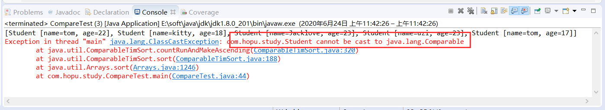
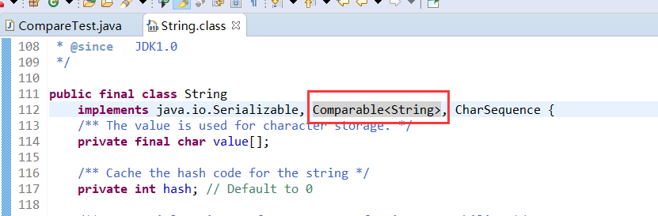
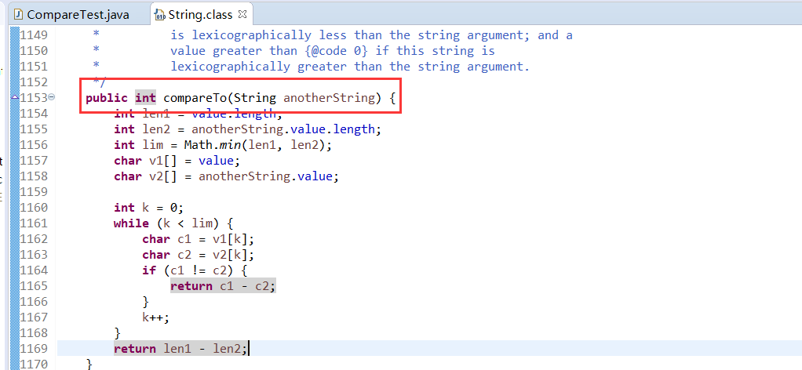
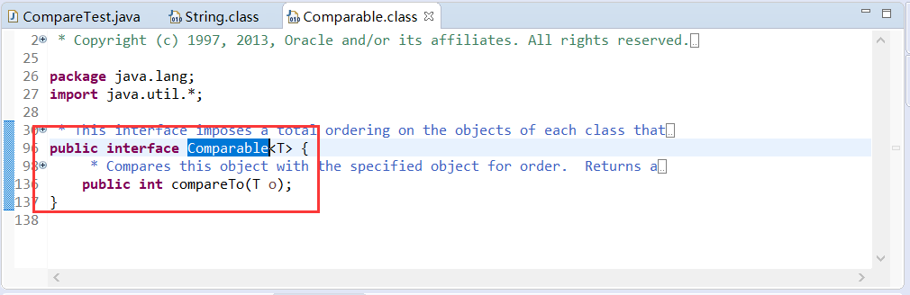

# 学习目标

```
1、掌握抽象类的定义及使用
2、掌握接口的定义及使用
3、掌握比较器的使用
```


# 第1章 抽象类

## 1.1 抽象类**概述**

**由来：**

当编写一个类时，我们往往会为该类定义一些方法，这些方法是用来描述该类的功能具体实现方式，那么这些方法都有具体的方法体。分析事物时，发现了共性内容，就出现向上抽取。会有这样一种特殊情况，就是方法功能声明相同，但方法功能主体不同。那么这时也可以抽取，但只抽取方法声明，不抽取方法主体。那么此方法就是一个抽象方法。例如：

- 描述讲师的行为：工作。
- 描述督导的行为：工作。

讲师、督导之间有共性，可以进行向上抽取。抽取它们的所属共性类型：员工。由于讲师、督导都具有工作功能，但是他们具体工作内容却不一样。这时在描述员工时，发现了有些功能不能够具体描述，那么，这些不具体的功能，需要在类中标识出来，通过java中的关键字abstract(抽象)修饰。当定义了抽象函数的类也必须被abstract关键字修饰，被abstract关键字修饰的类是抽象类。

**含义：**

- **抽象方法** ：没有方法体的方法。
- **抽象类**：包含抽象方法的类。


## 1.2 抽象类定义及使用

### 1.2.1 抽象方法

使用 abstract 关键字修饰方法，该方法就成了抽象方法，抽象方法只包含一个方法名，而没有方法体。

**定义格式：**

```
修饰符 abstract 返回值类型 方法名 (参数列表)；
```

**代码示例：**

```
public abstract void work();
```


### 1.2.2 抽象类

如果一个类包含抽象方法，那么该类必须是抽象类。

**定义格式：**

```
修饰符 abstract class 类名字 {
	抽象方法
}
```

**代码示例：**

```
public abstract class Employee { 
	public abstract void work(); 
}
```


### 1.2.3 抽象类的基本使用

继承抽象类的子类**必须重写父类所有的抽象方法**。否则，该子类也必须声明为抽象类。最终，必须有子类实现该父类的抽象方法，否则，从最初的父类到最终的子类都不能创建对象，就失去意义。

**代码示例：**

```java
// 1、抽象类
public abstract class Employee { 
	public abstract void work(); 
}
// 2、子类
public class Lecturer extends Employee {
	@Override
	public void work() {
		System.out.println("讲师在讲课");	
	}
}
// 3、测试类
public class EmployeeTest {
	public static void main(String[] args) {
		Lecturer lt= new Lecturer();
		lt.work();
	}
}
```

**注意：**此时的方法重写，是子类对父类抽象方法的完成实现，我们将这种方法重写的操作，也叫做**实现方法**。


## 1.3 注意事项

关于抽象类的使用，以下为语法上要注意的细节，虽然条目较多，但若理解了抽象的本质，无需死记硬背。

1. 抽象类**不能创建对象**，如果创建，编译无法通过而报错。只能创建其非抽象子类的对象。

> 理解：假设创建了抽象类的对象，调用抽象的方法，而抽象方法没有具体的方法体，没有意义。

2. 抽象类中，可以有构造方法，是供子类创建对象时，初始化父类成员使用的。

> 理解：子类的构造方法中，有默认的super()，需要访问父类构造方法。

3. 抽象类中，不一定包含抽象方法，但是有抽象方法的类必定是抽象类。

> 理解：未包含抽象方法的抽象类，目的就是不想让调用者创建该类对象，通常用于某些特殊的类结构设计。

4. 抽象类的子类，必须重写抽象父类中**所有的**抽象方法，否则，编译无法通过而报错。除非该子类也是抽象类。

> 理解：假设不重写所有抽象方法，则类中可能包含抽象方法。那么创建对象后，调用抽象的方法，没有意义。


# 第2章 接口

## **2.1** **概述**

接口，是Java语言中一种引用类型，是方法的集合，如果说类的内部封装了成员变量、构造方法和成员方法，那么接口的内部主要就是**封装了方法**，包含常量、抽象方法（JDK 7及以前），默认方法和静态方法（JDK 8）。

接口的定义，它与定义类方式相似，但是使用 interface 关键字。它也会被编译成.class文件，但一定要明确它并不是类，而是另外一种引用数据类型。

- public class 类名.java-->.class
- public interface 接口名.java-->.class

**引用数据类型：**数组，类，接口。

接口的使用，它不能创建对象，但是可以被实现（ implements ，类似于被继承）。一个实现接口的类（可以看做是接口的子类），需要实现接口中所有的抽象方法，创建该类对象，就可以调用方法了，否则它必须是一个抽象类。


## **2.2** 接口定义及使用

### 2.2.1 接口定义使用语法概述

**定义语法：**

```java
public interface 接口名称 { 
    // 常量
	// 抽象方法 
	// 默认方法 
	// 静态方法 
}
```

**说明：**在JDK 8之前，Java接口中只包括常量与抽象方法，从JDK8开始，接口中新增了默认方法与静态方法。

**示例：**

```java
public interface InterfaceName {
	// 1、常量
	public static final String DRIVER_URL = "jdbc:mysql://localhost:3306/mydb";
	// 2、抽象方法
	public abstract void work();
	// 3、静态方法
	public static void sleep() {
		System.out.println("睡觉了");
	}
	// 4、默认方法
	public default void eat() {
		System.out.println("吃饭了");
	}
}
```

**使用：**

类与接口的关系为实现关系，即**类实现接口**，该类可以称为接口的实现类，也可以称为接口的子类。实现的动作类似继承，格式相仿，只是关键字不同，实现使用 implements 关键字。

**非抽象子类实现接口：**

1. 必须重写接口中所有抽象方法。

2. 继承了接口的默认方法，即可以直接通过实现类对象调用，也可以重写。
3. 接口中的静态方法不能继承与重写，直接使用接口名调用即可。

**实现格式：**

```
修饰符 class 类名 implements 接口名 { 
	// 重写接口中抽象方法【必须】 
	// 重写接口中默认方法【可选】 
}
```


### 2.2.2 接口常量

**定义语法：**

```
public static final 常量类型 常量名 = 常量值;
```

**示例：**

```
public static final String DRIVER_URL = "jdbc:mysql://localhost:3306/mydb";
```

**说明：**

- Java接口中只能存在常量，不存在变量；
- 接口中定义常量时，public static final关键字默认可以省略，JVM会自动进行添加；
- 接口中定义常量时，必须进行初始化赋值，其初始化赋值后，值不能改变；
- 接口的实现类默认继承了接口中的常量，可以通过接口、子类、子类对象调用；
- 常量名要符合Java标识符规范，常量名通常用大写与下划线结合的形式。


**使用：**

```java
public class InterfaceTest implements InterfaceName{
	public static void main(String[] args) {
		InterfaceTest ift=new InterfaceTest();
		// 1、通过接口调用接口常量
		System.out.println(InterfaceName.DRIVER_URL);
		// 2、通过实现类调用接口常量
		System.out.println(InterfaceTest.DRIVER_URL);
		// 3、通过实现类对象调用接口常量
		System.out.println(ift.DRIVER_URL);
	}
}
```


### 2.2.3 抽象方法

**定义语法：**

```
修饰符 abstract 返回值类型 方法名 (参数列表);
```

**示例：**

```
public abstract void work();
```

**说明：**

- 接口中抽象方法的定义与抽象类中方法的定义及使用是一样的；
- 接口中，定义抽象方法时，abstract关键字可以省略，JVM会自动添加。

**使用：**

```java
public class InterfaceTest implements InterfaceName{
	// 重写接口方法
	@Override
	public void work() {
		System.out.println("该工作了");	
	}
	// 入口测试方法
	public static void main(String[] args) {
		InterfaceTest ift=new InterfaceTest();
		// 1.1、通过接口调用接口常量
		System.out.println(InterfaceName.DRIVER_URL);
		// 1.2、通过实现类调用接口常量
		System.out.println(InterfaceTest.DRIVER_URL);
		// 1.3、通过实现类对象调用接口常量
		System.out.println(ift.DRIVER_URL);
		
		// 2、通过实现类对象调用重写的接口方法
		ift.work();
	}
}
```


### 2.2.4 静态方法

**定义语法：**

```
修饰符 static 返回值类型 方法名 (参数列表){
	方法体
}
```

**示例：**

```java
public static void sleep() {
	System.out.println("睡觉了");
}
```

**说明：**

- 静态方法使用 static 关键字修饰，不可省略，供接口直接调用；
- 静态方法不能被继承，也不能被重写；
- 静态方法只能通过接口名直接调用。

**使用：**

```java
public class InterfaceTest implements InterfaceName{
	// 重写接口方法
	@Override
	public void work() {
		System.out.println("该工作了");	
	}
	// 入口测试方法
	public static void main(String[] args) {
		InterfaceTest ift=new InterfaceTest();
		// 1.1、通过接口调用接口常量
		System.out.println(InterfaceName.DRIVER_URL);
		// 1.2、通过实现类调用接口常量
		System.out.println(InterfaceTest.DRIVER_URL);
		// 1.3、通过实现类对象调用接口常量
		System.out.println(ift.DRIVER_URL);
		
		// 2、通过实现类对象调用重写的接口方法
		ift.work();
		
		// 3、通过接口名来调用接口静态方法
		InterfaceName.sleep();
	}
}
```


### 2.2.5 默认方法

**定义语法：**

```
修饰符 default 返回值类型 方法名 (参数列表){
	方法体
}
```

**示例：**

```java
public default void eat() {
	System.out.println("吃饭了");
}
```

**说明：**

- 默认方法使用 default 关键字修饰，不可省略，供子类调用；
- 默认方法可以被子类继承、同时也可以被子类重写，被子类实现时必须去除default关键字。
- 默认方法只能被实现类对象调用。
- default方法只允许在接口中定义。

**使用：**

```java
public class InterfaceTest implements InterfaceName{
	@Override
	public void work() {
		System.out.println("该工作了");	
	}
	// 重写接口默认方法，去除default关键字
	@Override
	public void eat() {
		System.out.println("吃饭了22");
	}
	
	// 入口测试方法
	public static void main(String[] args) {
		InterfaceTest ift=new InterfaceTest();
		// 1.1、通过接口调用接口常量
		System.out.println(InterfaceName.DRIVER_URL);
		// 1.2、通过实现类调用接口常量
		System.out.println(InterfaceTest.DRIVER_URL);
		// 1.3、通过实现类对象调用接口常量
		System.out.println(ift.DRIVER_URL);
		
		// 2、通过实现类对象调用重写的接口方法
		ift.work();
		
		// 3、通过接口名来调用接口静态方法
		InterfaceName.sleep();
		
		// 4、通过子类对象调用重写的默认方法
		ift.eat();	
	}
}
```


## 2.3 接口的多实现

### 2.3.1 接口的多实现说明

之前学过，在继承体系中，一个类只能继承一个父类。而对于接口而言，一个类是可以实现多个接口的，这叫做接口的**多实现**。并且，一个类能继承一个父类，同时实现多个接口。

**实现格式：**

```
修饰符 class 类名 [extends 父类名] implements 接口名1,接口名2,接口名3... { 
	// 重写接口中抽象方法【必须】 
	// 重写接口中默认方法【不重名时可选】 
}
```


**示例：**

```java
// 接口A
public interface InterfaceA {
	// 1、常量
	int A=1;
	// 2、抽象方法
	public abstract void work();
	// 3、静态方法
	public static void sleep() {
		System.out.println("睡觉了A");
	}
	// 4、默认方法
	public default void eat() {
		System.out.println("吃饭了A");
	}
}
// 接口B
public interface InterfaceB {
	// 1、常量
	int A=2;
	// 2、抽象方法
	public abstract void work();
	// 3、静态方法
	public static void sleep() {
		System.out.println("睡觉了B");
	}
	// 4、默认方法
	public default void eat() {
		System.out.println("吃饭了B");
	}
}
// 实现类
public class MoreInterfaceTest implements InterfaceA,InterfaceB {
	// 必须实现所有的接口方法
	@Override
	public void work() {
		System.out.println("该工作了");	
	}
	// 实现的接口默认方法重名，必须重写一次
	@Override
	public void eat() {
		System.out.println("重写的接口的eat()默认方法");	
	}
	public static void main(String[] args) {
		// 1、实现多接口时的接口常量使用
		System.out.println(InterfaceA.A);
		System.out.println(InterfaceB.A);
		
		// 2、接口抽象方法调用
		MoreInterfaceTest mit=new MoreInterfaceTest();
		mit.work();
		
		// 3、调用接口的静态方法
		InterfaceA.sleep();
		InterfaceB.sleep();
		
		// 4、调用默认方法
		mit.eat();
	}
}
```


### **2.3.2 注意事项**

- 子类进行多接口实现时，如果接口常量没有重名，可以按照之前的方式进行使用；如果接口常量出现重名，就必须通过接口名调用常量。
- 子类进行多接口实现时，接口中有多个抽象方法时，实现类必须重写所有抽象方法**。如果抽象方法有重名的，只需要重写一次。**
- 子类进行多接口实现时，接口中存在同名的静态方法并不会冲突，原因是只能通过各自接口名访问静态方法。
- 子类进行多接口实现时，接口中有多个默认方法时，实现类都可以选择继承使用。**如果默认方法有重名的，必须重写一次。**
- 当一个类既继承一个父类，又实现若干个接口时，父类中的成员方法与接口中的默认方法重名，子类就近选择执行父类的成员方法。


## **2.4** **接口的多继承【了解】**

一个接口能继承另一个或者多个接口，这和类之间的继承比较相似。接口的继承使用 extends 关键字，子接口继承父接口的方法。**如果父接口中的默认方法有重名的，那么子接口需要重写一次。**代码如下：

**定义父接口：**

```java
interface A { 
    public default void method(){ 
        System.out.println("A"); 
    } 
}
interface B { 
    public default void method(){ 
        System.out.println("B"); 
    } 
}
```

**定义子接口：**

```java
interface C extends A,B{ 
    @Override public default void method() { 
        System.out.println("C"); 
    } 
}
```

> **小贴士：**
>
> 子接口重写默认方法时，default关键字必须保留。
>
> 子类重写默认方法时，default关键字不可以保留。


# 第3章 接口应用-比较器

假设现在有一个需求，将班级的学生类Student（包括String类型name和int类型age）随机存储在一个数组中，然后对该学生数组进行排序。该如何实现？

## 3.1 实验测试

这里，我们先直接使用之前学习过的数组工具类Arrays的排序方法进行排序，进行尝试，看是否可行。

**示例代码：**

```java
// 学生类
class Student {
	private String name;
	private int age;
	public Student() {
	}
	public Student(String name, int age) {
		this.name = name;
		this.age = age;
	}
	public String getName() {
		return name;
	}
	public void setName(String name) {
		this.name = name;
	}
	public int getAge() {
		return age;
	}
	public void setAge(int age) {
		this.age = age;
	}
	@Override
	public String toString() {
		return "Student [name=" + name + ", age=" + age + "]";
	}
}
// 测试类
public class CompareTest {
	public static void main(String[] args) {
		// 初始化学生类数组
		Student[] str=new Student[5];
		str[0]=new Student("tom",22);
		str[1]=new Student("kitty",18);
		str[2]=new Student("Jacklove",23);
		str[3]=new Student("uzi",23);
		str[4]=new Student("tom",17);
		// 打印原生数组
		System.out.println(Arrays.toString(str));		
		// 工具类默认排序
		Arrays.sort(str);
		// 排序后再次打印
		System.out.println(Arrays.toString(str));
	}
}	
```

**执行效果：**



**问题分析：**从执行结果可以看出，最开始正确初始化并打印了学生类数组且按照初始化的顺序打印结果。但是，在使用Arrays工具类默认排序方法sort()进行排序时出现“com.hopu.study.Student cannot be cast to java.lang.Comparable”的错误。错误的意思是，学生类Student无法转换为Comparable。

为什么出现这种错误？我们之前对字符串String类型数组，还有int类型数组排序都没有问题，这是为什么呢？这里，我们以String为例可以参考下String类的源码。





同时，查看Comparable源码。




查看String类与Comparable接口源代码，同时参考对应的注释说明以及相关资料可以明白：

- Comparable接口是Java提供的一个类排序比较器，默认只有一个compareTo()抽象方法；
- Java内部提供的数据类型默认已经实现了Comparable接口，可以实现默认排序；
- 其他自定义类要实现排序，可以手动排序或者实现Comparable接口并重写compareTo()抽象方法。


## 3.2 比较器介绍

Java中针对类对象的排序比较，提供了两个对应的接口Comparable和Comparator。

### 3.2.1 Comparable接口比较器

Comparable的中文意思就是可被排序的，代表本身支持排序功能。只要我们的类实现了这个接口，那么这个类的对象就会自动拥有了可被排序的能力。而且这个排序被称为类的自然顺序。这个类的对象的列表可以被Collections.sort和Arrays.sort来执行排序。同时这个类的实例具备作为sorted map的key和sorted set的元素的资格。

Comparable接口内部只有一个比较方法：

```
 public int compareTo(T o);
```

这个方法主要就是为了定义我们的类所要排序的方式。compareTo方法用于比较当前元素a与指定元素b，结果为int值，如果a > b，int>0；如果a=b，int=0；如果a<b，int<0。

### 3.2.2 Comparator接口比较器

Comparator中文译为比较器，它可以作为一个参数传递到Collections.sort和Arrays.sort方法来指定某个类对象的排序方式。同时它也能为sorted set和sorted map指定排序方式。

Comparator接口内部只有一个比较方法：

```
int compare(T o1, T o2);
```


Comparable可以看做是内部比较器，Comparator可以看做是外部比较器。一个类，可以通过实现Comparable接口来自带有序性，也可以通过额外指定Comparator来附加有序性， 二者的作用其实是一致的。


## 3.3 比较器使用

下面，使用Comparable和Comparator两种比较器的方式完成上述Student类型数组的比较排序。

```java
// 学生类
class Student implements Comparable<Student> {
	private String name;
	private int age;
	public Student() {
	}
	public Student(String name, int age) {
		this.name = name;
		this.age = age;
	}
	public String getName() {
		return name;
	}
	public void setName(String name) {
		this.name = name;
	}
	public int getAge() {
		return age;
	}
	public void setAge(int age) {
		this.age = age;
	}
	@Override
	public String toString() {
		return "Student [name=" + name + ", age=" + age + "]";
	}
	@Override
	public int compareTo(Student o) {
		return this.age - o.age;
	}
}
// 自定义比较器类
class MyComparator implements Comparator<Student> {
    @Override
    public int compare(Student o1, Student o2) {
        return o1.getName().charAt(0)-o2.getName().charAt(0);
    }
}
// 测试类
public class CompareTest {
	public static void main(String[] args) {
		// 初始化学生类数组
		Student[] str=new Student[5];
		str[0]=new Student("tom",22);
		str[1]=new Student("kitty",18);
		str[2]=new Student("Jacklove",23);
		str[3]=new Student("uzi",23);
		str[4]=new Student("tom",17);
		// 打印原生数组
		System.out.println(Arrays.toString(str));		
		// 使用比较器默认排序
		Arrays.sort(str);
		// 排序后再次打印
		System.out.println(Arrays.toString(str));
		// 使用比较器排序
		Arrays.sort(str, new MyComparator());
		// 排序后再次打印
		System.out.println(Arrays.toString(str));
	}
}	
```


