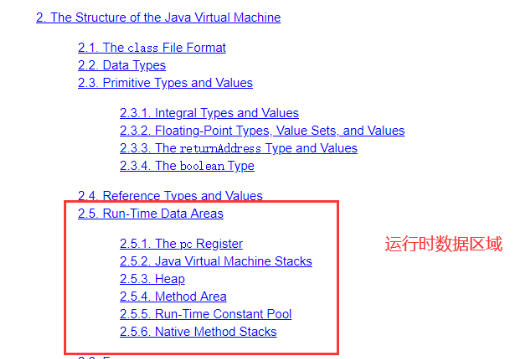
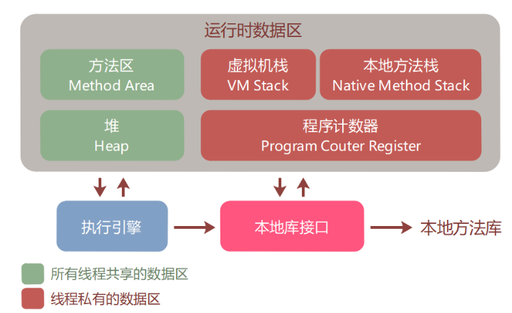
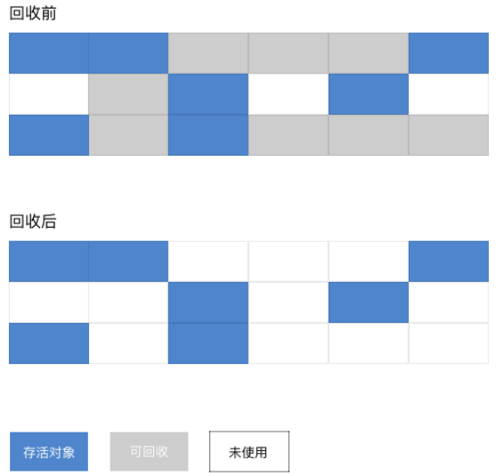
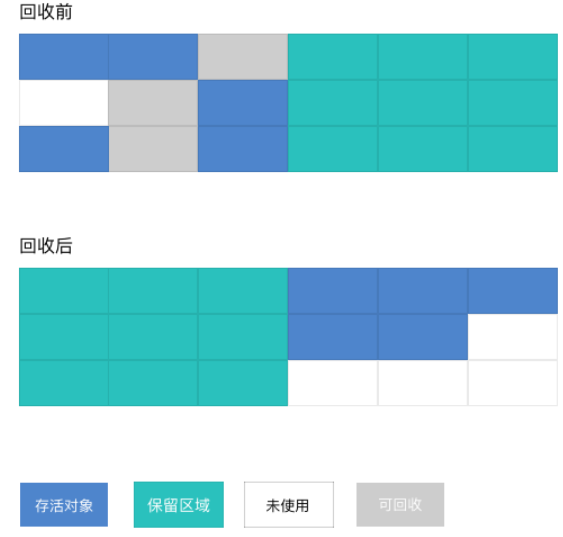
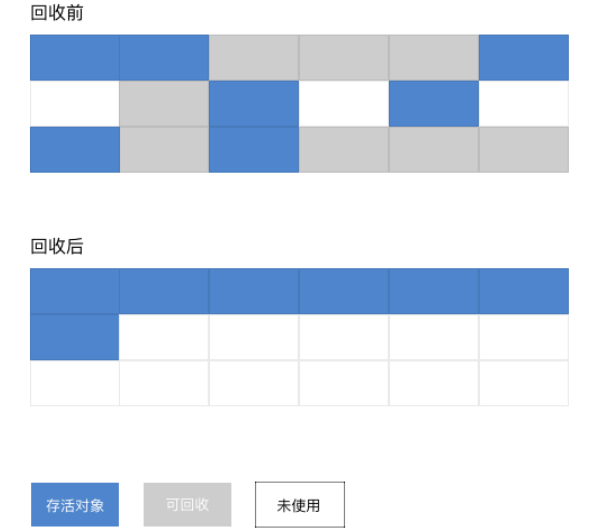
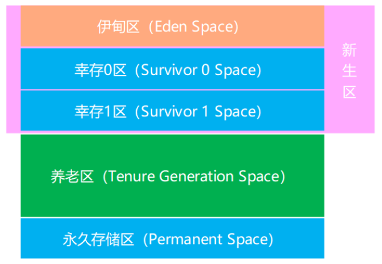
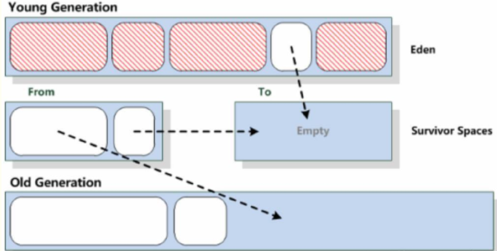

# 学习目标

```
1、掌握模板设计模式思想及实现
2、掌握Java多态的使用
3、掌握引用数据类型转换及异常处理
4、掌握几种内部类的使用
5、理解Java内存管理与垃圾回收机制
```


# 第1章 模板设计模式

## 1.1 模板设计模式概述

 **模板设计模式定义：**定义一个操作中的算法骨架，将通用步骤以模板形式封装在父类模板中，将具体细节步骤延迟到子类中实现。

  模板设计模式是一种行为设计模式，一般是准备一个抽象类，将部分逻辑以具体方法或者具体的构造函数实现，然后声明一些抽象方法，这样可以强制子类实现剩余的逻辑。不同的子类以不同的方式实现这些抽象方法，从而对剩余的逻辑有不同的实现。这就是模板设计模式能达成的功能。

**使用场景：**  

适用于一些复杂操作进行步骤分割、抽取公共部分由抽象父类实现、将不同的部分在父类中定义抽象实现、而将具体实现过程由子类完成。对于整体步骤很固定，但是某些部分易变，可以将易变的部分抽取出来，供子类实现。

  **角色：**

-  抽象类：实现模板方法、定义算法骨架；
-  具体类：实现抽象类中的抽象方法，完成特定的算法。


## 1.2 模板设计模式使用

我们举一个比较常见的例子：将一个物品装进冰箱。为了达到这个目的我们一般有如下几步：

- ​    a:打开冰箱门
- ​    b:将物品装进冰箱
- ​    c:关上冰箱门

  上面的这三步其实就是“将一个物品装进冰箱”这个算法的骨架。在这个算法中，物品这个字眼很重要，它是抽象的，而不是具体的，对于每个不同的物品，装入的时候行为可能不同，这一点非常重要。比如：

- ​    a:将一块猪肉放进冰箱--->一块猪肉这么小，直接放进去
- ​    b:将一头大象放进冰箱--->一头大象这么大，切碎放进去

  上面只是不恰当的举个例子，只是为了说明：针对与不同物品，放入冰箱的动作（行为）不同。

>   **特别注意**：上面物品虽是抽象的，但是我最终想表达的是“将物品装进冰箱”这个行为是抽象的。

**抽象类：**

```java
public abstract class AbstractClass{
    // 向冰箱里面放东西
    public final void execute(){
        open();
        put();
        close();
    }
	
    private void open(){
        System.out.println("打开冰箱");
    }

    private void close(){
        System.out.println("关闭冰箱");
    }

    protected abstract void put();
}
```

 上面的AbstractClass类中的execute方法就是一个算法骨架，它定义了复杂操作的许多步骤，其中需要注意：

  （1）AbstractClass是抽象类，因为子类需要继承某些抽象方法

  （2）execute是算法骨架，让外部调用，所以必须是public，但是又不想让子类进行重写，因此使用final关键字，如果重写则导致整个流程混乱。

  （3）open和close方法是固定的步骤，定义为私有，不让子类修改。

  （4）put方法是protected 的，保证子类可以重写，但是其它类无法看到，又是abstract 则子类必须重写。因为父类AbstractClass无法得知具体的物品该如何放入冰箱，只有靠子类去实现了。

**子类实现：**

```java
public class Pork extends AbstractClass{
    @Override
    protected void put(){
        System.out.println("将一块猪肉装进冰箱：直接装啊");
    }
}
```

```java
public class Elephant extends AbstractClass{
    @Override
    protected void put(){
        System.out.println("将大象装入冰箱：你必须剁碎再装入");
    }
}
```


**测试类：**

```java
public class Demo {
    public static void main(String[] args){
        AbstractClass abstractClass = new Pork();
        abstractClass.execute();

        System.out.println("-------------------");

        abstractClass = new Elephant();
        abstractClass.execute();
    }
}
```

通过上面的例子，可以看出：**不同的实现类，重写的抽象方法的逻辑不同，导致算法执行的结果也不相同，但是算法骨架是没有改变的。**


# 第2章 多态

## 2.1 概述

### **2.1.1 什么是多态**

多态是继封装、继承之后，面向对象的第三大特性。

生活中，比如跑的动作，小猫、小狗和大象，跑起来是不一样的。再比如飞的动作，昆虫、鸟类和飞机，飞起来也是

不一样的。可见，同一行为，通过不同的事物，可以体现出来的不同的形态。多态，描述的就是这样的状态。


**多态**： 是指同一行为，具有多个不同表现形式。


### 2.1.2 多态分类

对面向对象来说，多态分为**编译时多态和运行时多态**。其中编译时多态是静态的，主要是指方法的重载，它是根据参数列表的不同来区分不同的方法。通过编译之后会变成两个不同的方法，在运行时谈不上多态。而运行时多态是动态的，它是通过动态绑定来实现的，也就是大家通常所说的多态性。

[Java](http://c.biancheng.net/java/) 实现运行时多态有 3 个必要条件：**继承、重写和向上转型**。只有满足这 3 个条件，开发人员才能够在同一个继承结构中使用统一的逻辑实现代码处理不同的对象，从而执行不同的行为。

- 继承：在多态中必须存在有继承关系的子类和父类。
- 重写：子类对父类中某些方法进行重新定义，在调用这些方法时就会调用子类的方法。
- 向上转型：在多态中需要将子类的引用赋给父类对象，只有这样该引用才既能可以调用父类的方法，又能调用子类的方法。


## 2.2 运行时多态

运行时多态一个最显著的例子就是子类的上转型对象，即父类引用指向之类对象,调用的方法只能是父类下包含的方法(指向子类的那个父类引用)，执行的结果是子类重写以后的。

**多态体现的格式：**

```
父类类型 变量名 = new 子类对象； 
变量名.方法名();
```

> 父类类型：指子类对象继承的父类类型，或者实现的父接口类型。

**代码如下：**

```java
Fu f = new Zi(); 
f.method();
```


> **当使用多态方式调用方法时，首先检查父类中是否有该方法，如果没有，则编译错误；如果有，执行的是子类重写后的方法。**


**父类：**

```java
public abstract class Animal { 
	public abstract void eat(); 
}
```

**子类：**

```java
public class Cat extends Animal { 
    public void eat() { 
        System.out.println("吃鱼"); 
    } 
}
public class Dog extends Animal { 
    public void eat() { 
        System.out.println("吃骨头"); 
    } 
}
```

**测试类：**

```java
public class MyTest1 { 
    public static void main(String[] args) { 
        // 多态形式，创建对象 
        Animal a1 = new Cat(); 
        // 调用的是 Cat 的eat 
        a1.eat(); 
        // 多态形式，创建对象 
        Animal a2 = new Dog(); 
        // 调用的是 Dog 的 eat 
        a2.eat(); 
    }
}
```


## 2.3 多态的好处

实际开发的过程中，父类类型作为方法形式参数，传递子类对象给方法，进行方法的调用，更能体现出多态的扩展性与便利。代码如下：

**测试类：**

```java
public class MyTest2 { 
    public static void main(String[] args) { 
        // 多态形式，创建对象 
        Cat c = new Cat(); 
        Dog d = new Dog(); 
        // 调用showCatEat 
        showCatEat(c); 
        // 调用showDogEat 
        showDogEat(d); 
        // 以上两个方法, 均可以被showAnimalEat(Animal a)方法所替代 而执行效果一致
        showAnimalEat(c); 
        showAnimalEat(d); 
   }
    public static void showCatEat (Cat c){ 
        c.eat(); 
    }
    public static void showDogEat (Dog d){ 
        d.eat(); 
    }
    public static void showAnimalEat (Animal a){ 
        a.eat(); 
    } 
}
```

由于多态特性的支持，showAnimalEat方法的Animal类型，是Cat和Dog的父类类型，父类类型接收子类对象，当然可以把Cat对象和Dog对象，传递给方法。

当eat方法执行时，多态规定，执行的是子类重写的方法，那么效果自然与showCatEat、showDogEat方法一致，所以showAnimalEat完全可以替代以上两方法。

不仅仅是替代，在扩展性方面，无论之后再多的子类出现，我们都不需要编写showXxxEat方法了，直接使用showAnimalEat都可以完成。

所以，多态的好处，体现在，可以使程序编写的更简单，并有良好的扩展。

## 2.4 多态的成员访问特点

- 成员变量：编译看左边（父类），运行看左边（父类）


​    所有的成员变量取决于编译时类型

- 成员方法：编译看左边（父类），运行看右边（子类）


​	所有的成员方法取决于运行时类型

- 静态方法：编译看左边（父类），运行看左边（父类）


​	所有的静态方法取决于编译时类型


## 2.5 引用类型转换

### 2.5.1 引用类型转换介绍

多态的转型分为向上转型与向下转型两种：

**向上转型：**多态本身是子类类型向父类类型向上转换的过程，这个过程是默认的。

当父类引用指向一个子类对象时，便是向上转型。

**使用格式：**

```
父类类型 变量名 = new 子类类型(); 
如：Animal a = new Cat();
```

**向下转型：**父类类型向子类类型向下转换的过程，这个过程是强制的。

一个已经向上转型的子类对象，将父类引用转为子类引用，可以使用强制类型转换的格式，便是向下转型。

**使用格式：**

```
子类类型 变量名 = (子类类型) 父类变量名; 
如:Cat c =(Cat) a;
```


### 2.5.2 为什么要转换

当使用多态方式调用方法时，首先检查父类中是否有该方法，如果没有，则编译错误。也就是说，**不能调用**子类有而父类没有的方法。编译都错误，更别说运行了。这也是多态给我们带来的一点"小麻烦"。所以，想要调用子类特有的方法，必须做向下转型。

**修改一下Dog类，添加特有方法：**

```java
class Dog extends Animal { 
	public void eat() { 
		System.out.println("吃骨头"); 
	}
	public void watchHouse() { 
		System.out.println("看家"); 
	} 
}
```

**测试类：**

```java
public class MyTest3 { 
	public static void main(String[] args) { 
		// 向上转型 
		Animal a = new Cat(); 
		a.eat(); // 调用的是 Cat 的 eat 
		// 向下转型 
		Cat c = (Cat)a; 
		c.catchMouse(); // 调用的是 Cat 的 catchMouse 
	} 
}
```


### 2.5.3 类型转换异常

转型的过程中，一不小心就会遇到这样的问题，请看如下代码：

```java
public class MyTest3 { 
	public static void main(String[] args) { 
		// 向上转型 
		Animal a = new Cat(); 
		a.eat(); // 调用的是 Cat 的 eat 
		// 向下转型 
		Dog d = (Dog)a; 
		d.watchHouse(); // 调用的是 Dog 的 watchHouse 【运行报错】 
	} 
}
```

这段代码可以通过编译，但是运行时，却报出了 ClassCastException ，类型转换异常！这是因为，明明创建了Cat类型对象，运行时，当然不能转换成Dog对象的。这两个类型并没有任何继承关系，不符合类型转换的定义。

为了避免ClassCastException的发生，Java提供了 instanceof 关键字，给引用变量做类型的校验，格式如下：

```
变量名 instanceof 数据类型 

如果变量属于该数据类型，返回true。 如果变量不属于该数据类型，返回false。
```

所以，转换前，我们最好先做一个判断，代码如下：

```java
public class MyTest3 { 
    public static void main(String[] args) { 
        // 向上转型 
        Animal a = new Cat(); 
        a.eat(); // 调用的是 Cat 的 eat 
        // 向下转型 
        if (a instanceof Cat){ 
            Cat c = (Cat)a; 
            c.catchMouse(); // 调用的是 Cat 的 catchMouse 
        } else if (a instanceof Dog){ 
            Dog d = (Dog)a; 
            d.watchHouse(); // 调用的是 Dog 的 watchHouse 
        } 
    } 
}
```


# 第3章 内部类

将一个类A定义在另一个类B里面，里面的那个类A就称为**内部类**，B则称为**外部类**。

内部类可以很好地实现隐藏，一般的非内部类是不允许有 private 与 protected 权限的，但内部类可以。内部类拥有外部类的所有元素的访问权限。

内部类可以分为**：成员内部类、局部内部类、静态内部类、匿名内部类**，每种内部类都有它特定的一些特点。

## 3.1 成员内部类

**成员内部类** ：定义在**类中方法外**的类。

**定义格式：**

```
class 外部类 { 
	// 成员变量
	// 成员方法
	class 内部类{ 
	} 
}
```

**示例：**

```java
public class Outer {
    class Inner {
        // 成员内部类
    }
}
```

**访问特点：**

- 内部类可以直接访问外部类的成员，包括私有成员。
- 外部类要访问内部类的成员，必须要建立内部类的对象。

**创建内部类对象格式：**

```java
外部类名.内部类名 对象名 = new 外部类型().new 内部类型()；
```


## 3.2 静态内部类

**成员内部类** ：静态内部类是指使用 static 修饰的内部类。

```java
public class Outer {
    static class Inner {
        // 静态内部类
    }
}
```

**访问特点：**

- 在创建静态内部类的实例时，不需要创建外部类的实例；
- 静态内部类可以直接访问外部类的静态成员，如果要访问外部类的实例成员，则需要通过外部类的实例去访问。

```
Outer.Inner inner =new Outer.Inner();
```


## 3.3 局部内部类

**局部内部类：**局部内部类是指在一个方法中局部位置定义的内部类。

```java
public class Outer {
    public void method() {
        class Inner {
            // 局部内部类
        }
    }
}
```

**访问特点：**

- 局部内部类与局部变量一样，不能使用访问控制修饰符（public、private 和 protected）和 static 修饰符修饰；
- 局部内部类只在当前方法中有效；
- 局部内部类中不能定义 static 成员。


## 3.4 匿名内部类

**匿名内部类：**是内部类的简化写法，它的本质是一个 带具体实现的 父类或者父接口的 匿名的 子类对象**。**


开发中，最常用到的内部类就是匿名内部类了。以接口举例，当你使用一个接口时，似乎得做如下几步操作，

> 1. 定义子类
> 2. 重写接口中的方法
> 3. 创建子类对象
> 4. 调用重写后的方法

我们的目的，最终只是为了调用方法，那么能不能简化一下，把以上四步合成一步呢？匿名内部类就是做这样的快捷方式。

**前提：**存在一个**类或者接口**，这里的**类可以是具体类也可以是抽象类**。

**格式：**

```
new 父类名或者接口名(){ 
	// 方法重写 
	@Override 
	public void 方法名() { 
		// 执行语句 
	} 
};
```


# 第4章 Java内存管理&垃圾回收机制

我们知道，java所谓的跨平台特性（hardware- and operating system-independence）是依赖于JVM的。也就是，JAVA代码写好了之后会被编译成java的字节，一般存放为class文件，之后由JVM负责解释执行。

而做java后台开发，对jvm的考察就是最重要的了！面试官肯定会问你对jvm的理解，你就要从以下几个角度来描述：

> 1. JVM内存的划分
> 2. 垃圾回收问题(定义、回收的东西)
> 3. GC算法
> 4. 新生代、老年代、(jdk8之前还有永久代，jdk8开始取消了永久代的划分)

java代码的执行依赖于JVM，这里我们了解一下JVM的内存管理机制和垃圾回收机制。

## 4.1 Java内存管理机制

关于Java内存管理，可以查看官方文档声明：https://docs.oracle.com/javase/specs/jvms/se8/html/index.html



Java虚拟机在执行Java程序的过程中会把它所管理的内存划分成为若干个不同的数据区域，这些区域都有各自的用途，以及创建和销毁的时间，有的随着虚拟机的进程启动而存在，有的区域则依赖用户线程的启动和结束而建立和销毁。根据《Java虚拟机规范（Java SE 8版）》规定，Java虚拟机所管理的内存将包括以下几个运行时数据区域，如下图所示：




### 4.1.1 程序计数器

程序计数器有以下 三个特点：

- **较小**

程序计数器是一块较小的内存空间，它的作用可以看做是当前线程所指向的字节码的行号指示器。在虚拟机的概念模型里，字节码解释器工作时就是通过改变这个计数器的值来选取下一条需要指向字节码指令，分支、循环、跳转、异常处理、线程恢复等基础功能都需要依赖这个计数器来完成。

- **线程私有**

由于 Java 虚拟机的多线程是通过线程轮流 切换并分配处理器指向时间的方式来实现的，在任何一个确定的时刻，一个处理器（对于多核处理器来说是一个内核）只会执行一条线程的指令。因此，为了线程切换后能恢复到正确的执行位置，每条线程都需要有一个独立的程序计数器，各条线程之间的计数器互不影响，独立存储，我们称这类内存区域为“线程私有”的内存。

- **无异常**

如果线程正在执行的是一个 Java 的方法，这个计数器记录的是正在执行的虚拟机字节码指令的地址；如果正在执行的是 Native 方法，这个计数器值则为空（Undefined）。此内存区域是唯一一个在 Java 虚拟机规范中没有任何 OutOfMemoryError 情况的区域。

 

### 4.1.2 虚拟机栈

- **线程私有**

与程序计数器一样，Java 虚拟机栈也是线程私有的，它的生命周期与线程相同。

- **描述 Java 方法执行的内存模型**

虚拟机栈描述的是 Java 方法执行的内存模型：每个方法被执行的时候都会同时创建一个栈帧（Stack Frame，栈帧是方法运行期的基础数据结构）用于存储局部变量表、操作栈、动态链接、方法出口等信息。每一个方法被调用直至执行完成的过程，就对应着一个栈帧在虚拟机栈栈从入栈到出栈的过程。

- **异常**

在 Java 虚拟中，对虚拟机规定了下面两种异常：

① **StockOverflowError**

当执行 Java 方法是会进行压栈的操作，在栈栈会保存局部变量、操作栈和方法出口等信息。

JVM 规定了栈的最大胜读，如果线程请求执行方法时栈的深度大于规定的深度，就会抛出栈溢出异常 StockOverflowError。

② **OutOfMemoryError**

如果虚拟机在扩展时无法申请到足够的内存，就会抛出内存溢出异常 OutOfMemoryError。

 

###  4.1.3 本地方法栈

本地方法栈的作用于虚拟机非常相似，它有下面两个特点。

**① 为 native 服务**

本地方法栈与虚拟机栈的区别是虚拟机栈为 Java 服务，而本地方法栈为 native 方法服务。

**② 异常**

与虚拟机栈一样，本地方法栈也会抛出 StackOverflowError 和 OutOfMemoryError 异常。


### 4.1.4 Java堆

Java 堆（Java Heap）也就是实例堆，它有以下四个特点：

**① 最大**

对于大多数应用来说，Java 堆（Java Heap）是 Java 虚拟机所管理的内存中最大的一块。

**② 线程共享**

Java 堆是被所有线程共享的一块内存区域，在虚拟机启动时创建。

**③ 存放实例**

此内存区域的唯一目的就是存放对象的实例，几乎所有的对象实例都在这里分配内存。这一点在 Java 虚拟机规范中的描述是：所有的对象实例以及数组都要在堆上分配，但是随着 JIT 编译器的发展与逃逸分析技术的逐渐成熟，栈上分配、标量替换优化技术将会导致一些微妙的变化发送，所有的对象都分配在堆上也渐渐变得不那么“绝对”了 。

**④ GC**

Java 堆是垃圾收集器管理的主要区域，因此很多时候也被称为“GC堆”（Garbage Collected Heap）。如果从内存回收的角度看，由于现在收集器基本都是采用的分代收集算法（详见下节），所以 Java 堆中还可以细分为：新生代和老年代。如果从内存分配的角度看，线程共享的 Java 堆中可能划分多个线程私有的分配缓冲区（Thread Local Allocation Buffer，TLAB）。不过，无论如何划分，都与存放内容无关，无论哪个区域，存储的都依然是对象实例，进一步划分的目的是为了更好地回收内存，或者更快地分配内存。

 

### 4.1.5 方法区

方法区存储的是已经被虚拟机加载的数据，它有以下三个特点:

**① 线程共享**

方法区域 Java 堆一样，是各个线程共享的内存区域，它用于存储已经被虚拟机加载的等数据。

**② 存储的数据类型**

**◇** 类的信息；

**◇** 常量；

**◇** 静态变量；

**◇** 即时编译器编译后的代码，等。

**③ 异常**

方法区的大小决定履历系统可以保存多少个类，如果系统定义了太多的类，导致方法区溢出，虚拟机同样抛出内存溢出异常 OutOfMemoryError。

 

**方法区又可以分为运行时常量池和直接内存两部分：**

**① 运行常量池**

运行时常量池（Run-time Constant Pool）是方法区的一部分。

Class 文件中处了有类的 版本、字段、方法和接口等描述信息，还有一项信息就是常量池（Constant Pool Table）。

常量池用于存放编译期生成的各种字面量和符号引用，这部分内容将在类加载后进入方法区的运行时常量池中存放。

运行时常量池受到方法区内存的限制，当常量池无法再申请到内存时就会抛出 OutOfMemoryError 异常。

**② 直接内存**

直接内存（Direct Memory）有以下四个特点：

a）在虚拟机数据区外

直接内存不是虚拟机运行时数据区的一部分，也不是 Java 虚拟机规范中定义的内存区域。

b）直接分配

在 JDK1.4 中新加入的 NIO（New Input/Output）类，引入了一种基于通道（Channel）与缓冲区（Buffer）的 I/O 方式，它可以使用 native 函数库直接分配堆外内存，然后通过一个存储在 Java 堆中的 DirectByteBuffer 对象作为这块内存的引用操作，这样能避免在 Java 堆和 native 堆中来回复制数据。

c）受设备内存大小限制

直接内存的分配不会受到 Java 堆大小的限制，但是会受到设备总内存（RAM 以及 SWAP 区）大小以及处理器寻址空间的限制。

d）异常

直接内存的容量默认与 Java 对的最大值一样，如果超额申请内存，也可能导致 OOM 异常出现。


## 4.2 java垃圾回收机制

 java  语言中一个显著的特点就是引入了java回收机制，是c++程序员最头疼的内存管理的问题迎刃而解，它使得java程序员在编写程序的时候不在考虑内存管理。由于有个垃圾回收机制，java中的额对象不在有“作用域”的概念，只有对象的引用才有“作用域”。

垃圾回收可以有效的防止内存泄露，有效的使用空闲的内存；java语言规范没有明确的说明JVM 使用哪种垃圾回收算法，但是任何一种垃圾回收算法一般要做两件基本事情：（1）发现无用的信息对象；（2）回收将无用对象占用的内存空间。使该空间可被程序再次使用。


### 4.2.1 标记-清除算法

标记-清除算法（Mark-Sweep）相当于是先把货架上有人买的、没人买的、空着的商品和位置都记录下来，然后再把没人买的商品统一进行下架，这是垃圾收集器中的早期策略。



- **工作原理**

**◇** 第一步：标记所有需要回收的对象；

**◇** 第二步：标记完成后，统一回收所有被标记的对象。

- **缺点**

**◇** 效率低

标记和清除的效率都不高。

**◇** 内存碎片

标记清除后会产生大量不连续的内存碎片，内存碎片大多会导致当程序需要分配较大的对象时，无法找到足够的连续内存而不得不提前触发 GC。


### 4.2.2 复制算法

为了解决效率问题，复制（Copying）收集算法出现了。



- **工作原理**

复制算法把可用内存按容量划分为大小相同的两块，每次只使用其中的一块。

当使用中的这块内存用完了，就把存活的对象复制到另一块内存上，然后把已使用的空间一次清理掉。

这样每次都是对半个内存区域进行回收，内存分配时也不用考虑内存碎片等复杂问题。

- **优点**

复制算法的优点是每次只对半个内存区域进行内存回收，分配内存时也不用考虑内存碎片等复杂情况，只要移动堆顶指针，按顺序分配内存即可。

- **缺点**

**◇** 浪费空间

把内存缩小一半用太浪费空间。

**◇** 有时效率低

在对象存活率高时，要进行较多的复制操作，这时效率就低了。


### 4.2.3 标记-整理算法

在复制算法中，如果不想浪费 50% 的空间，就需要有额外的空间进行分配担保，以应对被使用内存中所有对象都存活的低端情况所以养老区不能用这种算法。

根据养老区的特点，有人提出了一种标记-整理（Mark-Compact）算法。



- **工作原理**

标记-整理算法的标记过程与标记-清除算法一样，但后续步骤是让所有存活的对象向一端移动，然后直接清除掉边界外的内存。


### 4.2.4 分代收集算法

现代商业虚拟机的垃圾回收机制都是采用分代收集算法（Generational Collection）算法，这种算法会根据对象存活周期的不同将内存划分为几块，这样就可以根据各个区域的特点采用最适当的收集算法。

在新生区，每次垃圾收集都有大批对象死去，只有少了存活，所以可以用复制算法。

养老区中因为对象存活率高、没有额外空间对它进行担保，就必须使用标记-清除或标记-整理算法进行回收。

对内存可分为新生区、养老区永久存储区三个区域。



**一、新生区（Young Generation Space）**

> 新生区也叫年轻代。

1. 所有新生成的对象首先都是放在年轻代的。年轻代的目标就是尽可能快速的收集掉那些生命周期短的对象。

2. 新生代内存按照8:1:1的比例分为一个eden区和两个survivor(survivor0,survivor1)区。一个Eden区，两个 Survivor区(一般而言)。大部分对象在Eden区中生成。

   回收时先将eden区存活对象复制到一个survivor0区，然后清空eden区，当这个survivor0区也存放满了时，则将eden区和survivor0区存活对象复制到另一个survivor1区，然后清空eden和这个survivor0区，此时survivor0区是空的，然后将survivor0区和survivor1区交换，即保持survivor1区为空， 如此往复。

3. 当survivor1区不足以存放 eden和survivor0的存活对象时，就将存活对象直接存放到老年代。若是老年代也满了就会触发一次Full GC，也就是新生代、老年代都进行回收。

4. 新生代发生的GC也叫做Minor GC，MinorGC发生频率比较高(不一定等Eden区满了才触发)。

 

**二、养老区（Tenure Generation Space）**

> 养老区也叫老年代。

1.在年轻代中经历了N次垃圾回收后仍然存活的对象，就会被放到年老代中。因此，可以认为年老代中存放的都是一些生命周期较长的对象。

2.内存比新生代也大很多(大概比例是1:2)，当老年代内存满时触发Major GC即Full GC，Full GC发生频率比较低，老年代对象存活时间比较长，存活率标记高。

 

**三、永久存储区（Permanent Space）**

> 永久存储区也叫持久代。

持久代用于存放静态文件，如Java类、方法等。持久代对垃圾回收没有显著影响，但是有些应用可能动态生成或者调用一些class，例如Hibernate 等，在这种时候需要设置一个比较大的持久代空间来存放这些运行过程中新增的类。


### 4.2.5 总结

​		目前大部分垃圾收集器对于新生代都采取Copying算法，因为新生代中每次垃圾回收都要回收大部分对象，也就是说需要复制的操作次数较少，但是实际中并不是按照1：1的比例来划分新生代的空间的，一般来说是将新生代划分为一块较大的Eden空间和两块较小的Survivor空间，每次使用Eden空间和其中的一块Survivor空间，当进行回收时，将Eden和Survivor中还存活的对象复制到另一块Survivor空间中，然后清理掉Eden和刚才使用过的Survivor空间。

　　而由于老年代的特点是每次回收都只回收少量对象，一般使用的是Mark-Compact算法。



1. 当Eden区满的时候，会触发第一次Minor gc，把还活着的对象拷贝到Survivor From区；

2. 当Eden区再次触发Minor gc的时候，会扫描Eden区和From区，对两个区域进行垃圾回收，经过这次回收后还存活的对象，则直接复制到To区域，并将Eden区和From区清空，然后将From区和to区交换，即保持to区为空；

3. 接着，重复1、2步操作；

4. 部分对象会在From区域和To区域中复制来复制去，如此交换15次(由JVM参数MaxTenuringThreshold决定，这个参数默认是15)，最终如果还存活，就存入老年代。

   > 但并非意味着，对象必须要经历15次YGC才会晋升到老年代中。例如，当survivor区空间不够时，便会提前进入到老年代中，但这个次数一定不大于设置的最大阈值。


