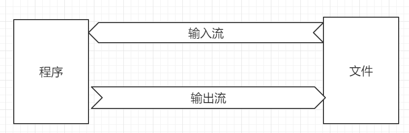
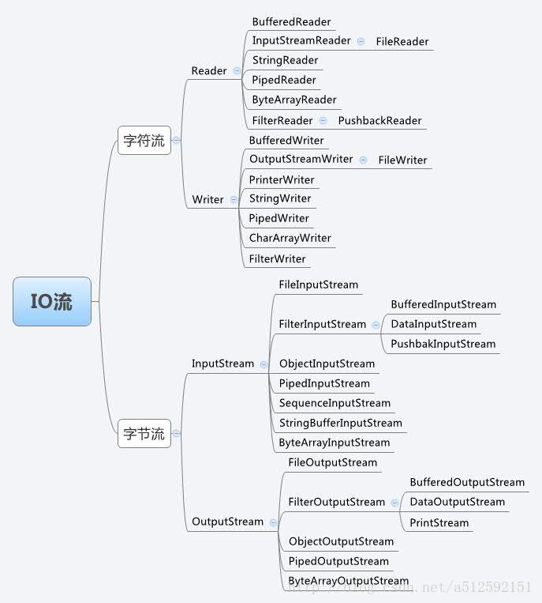
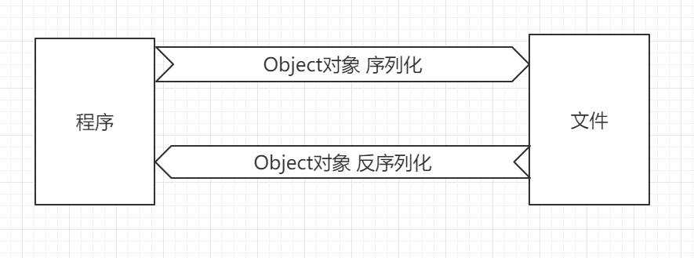

# 学习目标

```
1、了解异常和错误的区别
2、了解异常的分类
3、掌握异常的捕获跟处理
3、掌握自定义异常
4、掌握IO流的分类跟功能
5、掌握使用字节流跟字符流读写数据
6、掌握缓冲流、对象流、Properties的使用
```


# 第1章 异常

## 1.1 概述

​	 正常情况下，小王从家里去上班，路上大概需要1个小时。


但是，偶尔总会有各种情况发生，比如堵车、撞车等。这就是上班过程中的异常行为。


​		生活中我们有各种异常情况发生，我们写的程序也同样有各种异常情况发生。比如

```java
Scanner input = new Scanner(System.in);
System.out.println("请输入一个整数：");
int i = input.nextInt();
```

当用户控制台输入非数字的字符时，程序就出现异常情况了。

​		那么什么是异常呢？异常是指在程序的运行过程中所发生的不正常的事件，它会中断正在运行 

的程序。Java提供了一套处理异常情况的机制，我们可以使用这套机制为程序提供了错误处理的能力。好比上班堵车了就需要等待或者绕行，撞车了就需要交警跟保险处理，然后再去上班。 


## 1.2 异常体系


​		通过上面的异常体系图中我们可以发现，异常的根类是`java.lang.Throwable`，其下有两个子类：`java.lang.Error`与`java.lang.Exception`。

- **Error**： 严重错误Error，无法通过处理的错误，只能事先避免，好比绝症。
- **Exception**：表示异常，异常产生后程序员可以通过代码的方式纠正，使程序继续运行，是必须要处理的。好比感冒。


​	由于Error无法避免，我们上面说的异常处理机制主要是针对Exception。


## 1.3 异常的分类

​	Exception又可以分为2类，编译异常跟运行时异常。

- **编译时期异常**:checked异常。在编译时期,就会检查,如果没有处理异常,则编译失败。(如日期格式化异常)
- **运行时期异常**:runtime异常。在运行时期,检查异常.在编译时期,运行异常不会编译器检测(不报错)。(如数学异常)


## 1.4 异常的处理

Java异常处理的五个关键字：try、catch、finally、throw、throws


#### 1.4.1 throw抛出异常

​		在JAVA中，可以通过throw关键字来抛出一个指定的异常对象。throw用在方法内，用来抛出一个异常对象，将这个异常对象传递到调用者处，并结束当前方法的执行。

- 语法

  ```
  throw new 异常类名(描述信息);
  ```

**代码演示**

```java
public class Demo02Exception {

    public static void main(String[] args) {
        //创建数组
        int[] arr = {1,2,3,4};
        //根据索引找对应的元素
        int index = 4;
        int element = getElement(arr, index);
        System.out.println(element);

    }

    public static int getElement(int[] arr,int index){
// 当数组下表越界时抛出下标越界异常
        if(index<0 || index>arr.length-1){
            throw new ArrayIndexOutOfBoundsException("blb提醒您，数组下标已越界。");
        }
        return arr[index];
    }
}
```

​		throw抛出去的异常给谁了呢？谁调用谁处理，一层层往上找，没人处理则由JVM处理。


#### 1.4.2 throws声明异常

​		throws用于方法上，表示此方法中出现的异常自己不处理，丢给调用者来处理。就像小孩子之间发生了矛盾自己解决不了，由父母来负责处理。当然父母也可以不处理继续上抛，交给爷爷奶奶来处理。


-  语法

```
修饰符 返回值类型 方法名(参数) throws 异常类名1,异常类名2…{   }	
```

**代码演示**

```java
public void fun() throws ParseException {
    SimpleDateFormat format = new SimpleDateFormat("yyyy-MM-dd HH:mm:ss");
    Date date = format.parse("2020-10-10");
}
```


#### 1.4.3 try-catch捕获异常

​		刚刚我们都是在抛出异常，那如何进行捕获跟处理异常呢？通过try catch块进行异常的捕获跟处理。 

- 语法

  ```
  try{
       代码
  }catch(异常类型  e){
       发生了异常1，进行处理。     
  }catch(异常类型  e){
  	 发生了异常2，进行处理。     
  }...
  ```

  `try`块中写编写可能产生异常的代码。

  `catch`块中用来表示发生了异常，如何进行处理的逻辑。

  

**代码演示**

```java
public class Demo03Exception {

    public static void main(String[] args) {
        try {
//            制造一个异常。
            System.out.println(5/0);
            String s = null;
            System.out.println(s.toString());
        }catch (ArithmeticException e){
            System.out.println("发生了算术运算的异常。");
            e.printStackTrace();
        }catch (NullPointerException e){
            System.out.println("发生了空指针的异常。");
            e.printStackTrace();
        }
    }
}
```

tips: try-catch不能单独使用，必须一起使用。


#### 1.4.4 finally代码块

​		生活中，有时候即使发生了异常情况，干扰了生活的秩序，但有些事是无论是否异常都需要完成的。比如发生了疫情，我们不能正常的聚会、娱乐。但是无论是否发生疫情我们都必须活着，我们都需要吃饭睡觉。程序也一样，有时候当代码无论是否发生了异常我们都要保证执行一些操作，比如当我们打开了一些物理资源(磁盘文件/网络连接/数据库连接等),我们都得在使用完之后,最终关闭打开的资源。可以通过`finally`代码块来实现。

- 语法

  ```
  try{
       代码
  }catch(异常类型  e){
       发生了异常1，进行处理。     
  }catch(异常类型  e){
  	 发生了异常2，进行处理。     
  }...
  	fianlly{
  	  一定会执行的代码
  	}
  ```

  **代码演示**

  ```java
  @Test
  public void testTryCatchFinally() throws Exception{
          FileInputStream fs = null ;
          try {
              File file = new File("blb.txt");
              fs = new FileInputStream(file);
              System.exit(1);
          } catch (FileNotFoundException e) {
              e.printStackTrace();
          }finally {
  //            无论是否发生了异常都执行关闭打开的文件流
              if(fs!=null){
                  fs.close();
              }
          }
      }
  ```
  
  tips: `finally`中的代码无论是否异常都会执行，return也无法阻止，除非使用`System.exit(1);`退出虚拟机。`finally`也不能单独使用。	

  

#### 1.4.5 try-finally块

​	开发中还有一种比较少用的结果，`try-finally`结构，语法如下

```
try{
     代码
}fianlly{
	  一定会执行的代码
}
```

**代码演示**

```java
@Test
public void testTryFinally()throws Exception{
    FileInputStream fs = null ;
    try {
        File file = new File("blb.txt");
        fs = new FileInputStream(file);
        System.exit(1);
    }finally {
        //            无论是否发生了异常都执行关闭打开的文件流
        if(fs!=null){
            fs.close();
        }
    }
}
```


#### 1.4.6 注意事项

- 运行时异常被抛出可以不处理，由JVM处理。
- 多个catch块捕获多个异常且有父子关系时，子类的捕获在前面，父类的捕获在后面。
- 如果finally有return语句,永远返回finally中的结果
- 子类重写父类方法时，子类不能抛出比父类更宽泛的的异常，可以不抛出异常
- 子类不能抛出比父类更多的异常


#### 1.4.7 常见异常

| 序号 | 异常名称                                 | 异常描述                                    |
| :--: | ---------------------------------------- | ------------------------------------------- |
|  1   | java.lang.NullPointerException           | 空指针异常:对象为空，并且调用相应方法。     |
|  2   | java.lang.ClassNotFoundException         | 找不到指定类，常出现在反射中                |
|  3   | java.lang.ArrayIndexOutOfBoundsException | 数组下标越界                                |
|  4   | java.lang.NumberFormatException:         | 数字格式化异常                              |
|  5   | java.lang.ArithmeticException:           | 数学运算异常                                |
|  6   | java.lang.StackOverflowError             | 内存空间溢出错误，方法递归调用中，经常发生  |
|  7   | java.lang.ClassCastException             | 类型转换异常，向下转型中经常发生            |
|  8   | java.text.ParseException                 | 时间格式化异常，SimpleDateFormart中经常发生 |
|  9   | java.util.InputMismatchException         | 输入类型不匹配异常                          |


## 1.5 自定义异常

​		JAVA提供了很多异常类供我们使用，但是在实际开发中，根据业务的需求，有些异常情况是JDK没有提供的，比如年龄输入不合法等，此时我们要像JAVA一样来定义异常。

- 自定义一个编译异常类，继承`java.lang.Exception`。
- 自定义一个运行时期异常类，继承`java.lang.RuntimeException`。

**代码演示**

```java
// 自定义一个年龄越界的运行时异常，如果要定义编译异常改为Exception即可
class AgeOutOfBoundException extends RuntimeException{

    public AgeOutOfBoundException() {
    }

    public AgeOutOfBoundException(String message) {
        super(message);
    }
}
```

设置年龄的时候，检查如果为负数抛出此异常

```java
public class Demo05Exception {

    public static void main(String[] args) {
        setAge(-1);
    }

    public static void setAge(int age) throws AgeOutOfBoundException {
        // 如果年龄为负数抛出此异常
        if(age<0){
            throw new AgeOutOfBoundException("年龄不能为负数");
        }
    }
}
```


# 第2章 IO流

## 2.1 概述

​	我们遇到这种场景：打开文本编辑工具记事本，写入内容，然后保存。在这个过程中，写内容是写在电脑的内存中，当点击保存的时候会把内存中的数据传到硬盘中，当下次开机的时候这些数据仍然还在。但是如果在保存之前就重启电脑，那这些内容就会丢失，因为数据在内存中会被清空。数据在内存跟硬盘中传输的过程就是IO流。

​	I/O流称为输入/输出流，是指数据在程序跟另一端进行流向的一个过程，另一端可以是硬盘上的文件，也可以是网络或者其它。

​	这里的入跟出都是相对程序而已的，输入流是指数据源流向程序，输出是指从程序将数据写出到数据源中。




## 2.2 IO的分类

根据数据的流向分为：**输入流**和**输出流**。

- **输入流** ：把数据从数据源上读取到程序中的流。 
- **输出流** ：把数据从程序中写出到数据源上的流。

根据数据的类型分为：**字节流**和**字符流**。

- **字节流** ：以字节为单位，读写数据的流。

- **字符流** ：以字符为单位，读写数据的流。

  

|            |        **输入流**         |           输出流           |
| :--------: | :-----------------------: | :------------------------: |
| **字节流** | 字节输入流**InputStream** | 字节输出流**OutputStream** |
| **字符流** |   字符输入流**Reader**    |    字符输出流**Writer**    |





## 2.3 File类

​	由于经常需要使用IO流来操作硬盘上的文件，JDK将硬盘上的文件映射为`java.io.File`类，所以我们先要学习如何使用这个类。

​	File类以抽象的方式代表文件名和目录路径名。该类主要用于文件和目录的创建、文件的查找和文件的删除等。

File对象代表磁盘中实际存在的文件和目录。通过以下构造方法创建一个File对象。

- 常用构造方法

```java
new File(File parent,String child );
new File(String parent,String child);
new File(String pathName);
```

- 常用方法

| 方法名                  | 描述                               |
| ----------------------- | ---------------------------------- |
| String getName()        | 获取文件（夹）名                   |
| String getPath()        | 获取文件（夹）路径                 |
| boolean exists()        | 文件（夹）是否存在                 |
| boolean isFile()        | 是否是一个文件                     |
| boolean isDirectory()   | 是否是一个目录（文件夹）           |
| boolean createNewFile() | 创建一个文件                       |
| boolean mkdir()         | 创建一个具体的文件夹               |
| boolean mkdirs()        | 创建多级文件夹                     |
| boolean delete()        | 删除某个文件（夹）                 |
| String [] list()        | 返回某个文件夹下的所有文件（夹）名 |
| File [] listFiles()     | 获取某个文件夹下所有的文件（夹）   |

**代码演示**

```java
public class Demo06File {

    public static void main(String[] args) throws IOException {
        File file = new File("D:/a.txt");
//      输出个文件是否存在
        System.out.println(file.exists());

        if(!file.exists()){
//            创建这个文件
            file.createNewFile();
        }
//        判断这个文件是否是文件
        System.out.println(file.isFile());
//        判断这个文件是否是目录
        System.out.println(file.isDirectory());
//        输出文件的名字
        System.out.println(file.getName());
//        输出文件的路径
        System.out.println(file.getPath());
//        输出文件的绝对路径
        System.out.println(file.getAbsolutePath());
//         删除此文件
        file.delete();

        File dir = new File("d:/blb");
//        创建这个目录，前提是所有父级目录都存在
        dir.mkdir();
//        创建这个目录，父级目录不存在，则把所有父级目录都创建
        dir.mkdirs();
//        返回dir目录中的所有文件，以String [] 的形式保存
        String[] list = dir.list();
        System.out.println(Arrays.toString(list));

//        返回dir目录中的所有文件，以File [] 的形式保存
        File[] files = dir.listFiles();
        for (File f:files) {
            System.out.println(f.getName());
        }
//        删除此目录，前提是这是一个空目录
        dir.delete();

    }
}
```


## 2.4 字节流

​			一切文件数据(文本、图片、视频等)在存储时，都是以二进制数字的形式保存，传输时只需要传输对应的二进制数据即可。流的传输底层就是这些二进制的数据的流动。

- ​		`java.io.OutputStream `抽象类是表示字节输出流的超类，将指定的字节信息写出到目的地。常用API有
  - `public void close()` ：关闭此输出流并释放与此流相关联的任何系统资源。  
  - `public void flush() ` ：刷新此输出流并强制任何缓冲的输出字节被写出。  
  - `public void write(byte[] b)`：将 b.length个字节从指定的字节数组写入此输出流。  
  - `public void write(byte[] b, int off, int len)` ：从指定的字节数组写入 len字节，从偏移量 off开始输出到此输出流。  
  - `public abstract void write(int b)` ：将指定的字节输出流。
  - 

- ​		`java.io.InputStream `抽象类是表示字节输入流的超类，可以读取字节信息到内存中。常用API有
  - `public void close()` ：关闭此输入流并释放与此流相关联的任何系统资源。    

  - `public abstract int read()`： 从输入流读取数据的下一个字节。 

  - `public int read(byte[] b)`： 从输入流中读取一些字节数，并将它们存储到字节数组 b

    

  最常用的实现类是`java.io.FileInputStream`跟`java.io.FileOutputStream`，用来将数据读取/写出到文件中。


**代码演示**

要求：将盘中的一张图片（D:\a\blb.jpg）通过程序复制到另一个路径下（D:\b\blb.jpg）。

```java
public class Demo07IO {

    public static void main(String[] args) {
        // 把一个图片的数据读取到程序中，把程序中的数据写到另一个文件（图片）中。 复制
        InputStream input = null ;
        OutputStream output = null ;
        try {
            File f1 = new File("D:\\a\\blb.jpg");
            File f2 = new File("D:\\b\\blb.jpg");
            // 创建目标文件
            if (!f2.exists()) {
                f2.createNewFile();
            }
            // 把f1读取到程序中
            input = new FileInputStream(f1);
            output = new FileOutputStream(f2);

            byte b[] = new byte[1024];

            int i = 0;
            while ((i = input.read(b)) != -1) {
                output.write(b, 0, i);
            }

        } catch (IOException e) {
            e.printStackTrace();
        }finally{
            try {
                if(input != null ){
                    input.close();
                }

                if(output != null ){
                    output.close();
                }
            } catch (IOException e) {
                e.printStackTrace();
            }
        }
    }
}
```


## 2.5 字符流

​		有时候我们需要通过程序去操作文本文件，这时使用字节流可能会出现字符显示不完整的问题因为一个中文字符可能占据多个字节。所以JAVA专门提供一类字符流，以字符为单位操作，使用这类流来操作字符类型的数据更加契合。

`java.io.Reader`抽象类是表示用于读取字符流的超类，它定义了字符输入流的基本共性功能方法。

- `public void close()` ：关闭此流并释放与此流相关联的任何系统资源。    

- `public int read()`： 从输入流读取一个字符。 

- `public int read(char[] cbuf)`： 从输入流中读取一些字符，并将它们存储到字符数组 cbuf中 。

  

**代码演示**

要求：将文本文件中的内容读取到控制台中显示。

```java
public class Demo08IO {

    public static void main(String[] args) {
        FileReader fileReader = null;
        try {
//            读取D盘中a.txt文件的内容
            File f = new File("D:\\a.txt");
//            创建对应的输入流
            fileReader = new FileReader(f);
            int c ;
            while((c = fileReader.read())!=-1){
                System.out.println( (char)c);
            }
        } catch (IOException e) {
            e.printStackTrace();
        } finally {
            try {
//                关闭流
                if (fileReader != null) {
                    fileReader.close();
                }
            } catch (IOException e) {
                e.printStackTrace();
            }

        }
    }
}
```


`java.io.FileWriter `抽象类是表示用于写出字符流的超类。构造时使用系统默认的字符编码和默认字节缓冲区。

- `void write(int c)` 写入单个字符。
- `void write(char[] cbuf) `写入字符数组。 
- `abstract  void write(char[] cbuf, int off, int len) `写入字符数组的某一部分,off数组的开始索引,len写的字符个数。 
- `void write(String str) `写入字符串。 
- `void write(String str, int off, int len)` 写入字符串的某一部分,off字符串的开始索引,len写的字符个数。
- `void flush() `刷新该流的缓冲。  
- `void close()` 关闭此流，但要先刷新它。 


**代码演示**

要求：将下面的一段话输入到D盘的文本文件中。

`昨夜雨疏风骤，浓睡不消残酒。试问卷帘人，却道海棠依旧。知否，知否？应是绿肥红瘦。`

```java
public class Demo09IO {

    public static void main(String[] args) {
        File f = new File("D:\\blb.txt");
        FileWriter fileWriter = null;
        try {
//          创建文件输出流
            fileWriter = new FileWriter(f,true);// 第2个参数表示是追加还是覆盖
            fileWriter.write("昨夜雨疏风骤，浓睡不消残酒。试问卷帘人，却道海棠依旧。知否，知否？应是绿肥红瘦。");

        } catch (IOException e) {
            e.printStackTrace();
        }finally {
            try {
                if(fileWriter!=null){
                    fileWriter.close();
                }
            } catch (Exception e2) {
                e2.printStackTrace();
            }
        }
    }
}
```


## 2.6 缓冲流

### 2.6.1 概述

​		JAVA的IO体系中有些流不能独立使用，必须套在其它流的上面才能使用，称为包装流。JAVA的IO体系就是通过装饰模式来实现。需要什么流的功能就在外面套一个对应的流即可，就像一个武士，需要一把武器就装饰一把武器，需要一身铠甲就套一层铠甲，这个武士就能使用武器跟铠甲的功能了。

​		而缓冲流就是常用的一个包装流，也叫高效流，是对4个基本的`File` 流的增强，所以也是4个流，按照数据类型分类：

- **字节缓冲流**：`BufferedInputStream`，`BufferedOutputStream` 
- **字符缓冲流**：`BufferedReader`，`BufferedWriter`

缓冲流的基本原理，是在创建流对象时，会创建一个内置的默认大小的缓冲区数组，通过缓冲区读写，减少系统IO次数，从而提高读写的效率。


### 2.6.2 字符缓冲流

#### 构造方法

* `public BufferedReader(Reader in)` ：创建一个 新的缓冲输入流。 
* `public BufferedWriter(Writer out)`： 创建一个新的缓冲输出流。

构造举例，代码如下：

```java
// 创建字符缓冲输入流
BufferedReader br = new BufferedReader(new FileReader("br.txt"));
// 创建字符缓冲输出流
BufferedWriter bw = new BufferedWriter(new FileWriter("bw.txt"));
```

#### 特有方法

字符缓冲流的基本方法与普通字符流调用方式一致，不再阐述，我们来看它们具备的特有方法。

* BufferedReader：`public String readLine()`: 读一行文字。 
* BufferedWriter：`public void newLine()`: 写一行行分隔符,由系统属性定义符号。 


**输入缓冲流代码演示**

```java
public class Demo10IO {

    public static void main(String[] args) throws IOException {
        FileReader fileReader = null;
        BufferedReader bufferdReader = null;
        bufferdReader = new BufferedReader(fileReader);
//      读取D盘中a.txt文件的内容
        File f = new File("D:\\blb.txt");
//      创建对应的输入流
        fileReader = new FileReader(f);
        String s = null;

        while((s = bufferdReader.readLine())!=null){
            System.out.println(s);
        }
//      关闭流
        fileReader.close();

    }
}
```


**输出缓冲流代码演示**

```java
public class Demo11IO {

    public static void main(String[] args) throws IOException {
        File f = new File("D:\\blb.txt");
        FileWriter fileWriter = null;
        BufferedWriter bufferedWriter = null;
        fileWriter = new FileWriter(f,true);// 第2个参数表示是追加还是覆盖
        bufferedWriter = new BufferedWriter(fileWriter);

        bufferedWriter.newLine();
        bufferedWriter.write("床前明月光");
        bufferedWriter.newLine();
        bufferedWriter.write("疑是地上霜");
        bufferedWriter.newLine();
        bufferedWriter.write("举头望明月");
        bufferedWriter.newLine();
        bufferedWriter.write("低头思故乡");

        bufferedWriter.flush();

        bufferedWriter.close();
        fileWriter.close();
    }
}
```


## 2.7 对象流

### 2.7.1 概述

​	Java 提供了一种对象**序列化**的机制。用来将某个对象保存到磁盘上或者在网络上传输。可以理解为将内存中的对象进行持久化保存下来。反之，该字节序列还可以从文件中读取回来，重构对象，对它进行**反序列化**。 

​	JAVA中是通过对象流来实现对象的序列化跟反序列化的，对象流也是一种包装流。




### 2.7.2 序列化

​	`java.io.ObjectOutputStream ` 类，将Java对象的原始数据类型写出到文件,实现对象的持久存储。	

​	被序列化的对象需要实现`java.io.Serializable ` 接口。`Serializable` 是一个标记接口，不实现此接口的类将不会使任何状态序列化或反序列化，会抛出`NotSerializableException` 。

​	如果有不需要序列化的字段使用transient关键字修饰即可。

**代码演示**

```java
//实体类
class Person implements Serializable {
//  序列化版本号，必须保证序列化跟反序列化的版本号一致
    private static final long serialVersionUID = -1213754818242979380L;

    public String name   ;
    //设置age字段为transient，表示此字段不需要序列化
    public  transient int age = 1 ;

    public String sex ;

    @Override
    public String toString() {
        return "Person{" +
                "name='" + name + '\'' +
                ", age=" + age +
                ", sex='" + sex + '\'' +
                '}';
    }
}

```

**序列化代码演示**

```java
public class Demo12Serializable {

    public static void main(String[] args) throws IOException, ClassNotFoundException {
//        saveObject();// 序列化
        readObject();// 反序列化

    }

//  序列化
    public static void saveObject() throws IOException{
//        准备要序列化的对象
        Person person = new Person();
        person.name = "张三";
        person.age = 18 ;
        person.sex = "男";
//      准备对象流
        FileOutputStream fos = new FileOutputStream("d:/blb.txt");
        ObjectOutputStream out = new ObjectOutputStream(fos);
//      序列化对象
        out.writeObject(person);
//      关闭流
        out.close();
        fos.close();
    }

//    反序列化
    public  static void readObject() throws IOException, ClassNotFoundException {
        //      准备对象流
        FileInputStream fis = new FileInputStream("d:/blb.txt");
        ObjectInputStream in = new ObjectInputStream(fis);
        //      反序列化对象
        Person person = (Person) in.readObject();
        System.out.println(person);
        //      关闭流
        in.close();
        fis.close();
    }

}
```

 **重点**

​	序列化的重点在于序列化跟反序列化的的版本号要一致，通常可以设置成固定值或者有IDE自动生成，这个版本号定义在实体类的属性`private static final long serialVersionUID`。如果版本号信息不一致会抛出`InvalidClassException`异常。


## 2.8 Properties属性集

### 2.8.1 概述

 	前面学习过集合，集合家族中有个成员`java.util.Properties ` ，它继承于` Hashtable` 。`Properties`是使用键值结构存储数据的，但它最大的特点是具有持久化功能。


### 2.8.2 常用API

- `public Properties()` :创建一个空的属性列表。

- `public Object setProperty(String key, String value)` ： 保存一对属性。  

- `public String getProperty(String key) ` ：使用此属性列表中指定的键搜索属性值。

- `public Set<String> stringPropertyNames() ` ：所有键的名称的集合。

- `public void load(InputStream inStream)`： 从字节输入流中读取键值对数据。

- `public void store(OutputStream out,String comments)`:从字节输入流中存储键值对数据。


**代码演示**

要求：往`Properties`中存储数据，并通过流写出到本地文件中。

```java
public class Demo13IO {

    public static void main(String[] args) throws IOException {
//		创建对应的属性文件
        File  file = new File("d:/blb.properties");
        if(!file.exists()){
            file.createNewFile();
        }
//      创建Properties对象，存储数据
        Properties p = new Properties();
        p.setProperty("name", "张三");
        p.setProperty("age", "22");
        p.setProperty("sex", "男");

//        通过OutputStreamWriter包装一层流，可以处理乱码问题
        FileOutputStream fos = new FileOutputStream(file);
        OutputStreamWriter osw = new OutputStreamWriter(fos,"utf-8");

//      将Properties中的数据直接通过流写出去
        p.store(osw,"");
//      关闭流
        osw.close();
        fos.close();
    }
}
```


**代码演示**

要求：将`Properties`中的数据读取到程序中，遍历所有的数据。

```java
public class Demo14Properties {

    public static void main(String[] args) throws IOException {
//		创建对应的属性文件
        File  file = new File("d:/blb.properties");

//		建立到文件之间的流
        FileInputStream fis = new FileInputStream(file);
        InputStreamReader read = new InputStreamReader(fis,"utf-8");

//		通过流把配置文件中的数据加载到Properties对象中。
        Properties properties = new Properties();
        properties.load(read);
//      关闭流
        read.close();
        fis.close();

        System.out.println(properties.getProperty("name"));
        System.out.println(properties.getProperty("age"));
        System.out.println(properties.getProperty("sex"));

//		遍历所有内容
        Set<String> keys = properties.stringPropertyNames();
        for (String key:keys) {
            System.out.println( key+ " = "+ properties.getProperty(key));
        }

    }
}
```

tips: 

- `properties`文件中键值对之间的分割可以使用`=` ` :`跟空格。
- 由于`properties`继承`Hashtable`，所有还可以通过枚举器来遍历。


