# 学习目标

```
1、了解为什么要版本控制
2、了解版本控制系统的概念
3、了解GIT的特点
4、掌握GIT的工作流程（重点）
5、掌握GIT使用方法（重点）
6、掌握IDEA中配置GIT
```

# 1、为什么要版本控制

考虑两个问题：

1）小组分工合作开发项目时如何将代码整合到一起？

2）如果项目出现问题，如何回到正确版本上？

那么我们就需要一种工具能集中管理项目的代码，每个开发人员能够获得项目代码，并能够将代码提交到项目上；除此外能保存不同版本的代码，方便代码切换到特定的版本上。

# 2、什么是VCS

## 2.1 VCS的概念
版本控制系统（version control system）,是一种记录一个或若干文件内容变化，以便将来查阅特定版本修订情况的系统。版本控制系统不仅可以应用于软件源代码的文本文件，而且可以对任何类型的文件进行版本控制。

## 2.2 常用的VCS

**CVS**：老牌的版本控制工具，主要在开源软件管理中使用。多个开发人员通过一个中心版本控制系统来记录文件版本，从而达到保证文件同步的目的。（诞生时间相对较早，但逐渐被SVN代替）

**SVN**：是一个开放源代码的版本控制系统，相较于CVS，它采用了分支管理系统，它的设计目标就是取代CVS。可以说是集中式版本控制的集大成功者。

**GIT**：目前最优秀的分布式版本控制工具，没有之一。它开始主要用于Linux内核的开发，因为LInux内核的开发者遍布全球，任何人都可能修改并改进它。随开源社区的发展，Git也迅速的火热起来，已成为开源社区里使用人数最多的版本控制工具，并且开始渗透到企业中。

# 3、GIT的特点

## 3.1 GIT的由来

Git 是一个开源的分布式版本控制系统，用于敏捷高效地处理任何或小或大的项目。

Git 是 Linus Torvalds 为了帮助管理 Linux 内核开发而开发的一个开放源码的版本控制软件。

Git 与常用的版本控制工具 CVS, SVN等不同，它采用了分布式版本库的方式，不必服务器端软件支持。

## 3.2 集中式和分布式的区别

### 3.2.1 集中式

集中式VCS必须有一台电脑作为服务器，每台电脑都把代码提交到服务器上，再从服务器下载代码。如果网络出现问题或服务器宕机，系统就不能使用了。


### 3.2.2 分布式

分布式VCS没有中央服务器，每台电脑都可以保存代码版本，没有网络的时候可以先提交到本地，每台电脑也都可以作为服务器，其他电脑可以从作为服务器的电脑上克隆代码，可见分布式系统比集中式系统的安全性高很多。


# 4、GIT的工作流程

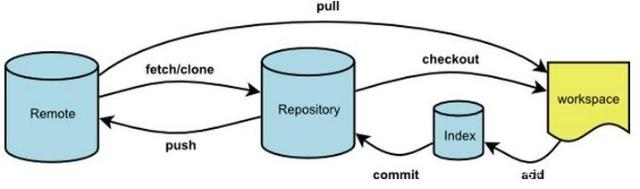

```
1、git clone 克隆远程资源到本地目录，作为工作目录；

2、然后在本地的克隆目录上添加或修改文件；

3、如果远程修改了，需要同步远程的内容，直接git pull就可以更新本地的文件；

4、本地在修改之后，可以通过git status 查看修改的文件。然后使用git add 添加修改的文件暂到缓冲区；

5、在添加之后，可以使用git commit添加到当前的工作区；

6、在修改完成后，如果发现错误，可以撤回提交并再次修改并提交；

7、git push将本地的修改推送到远程的git服务器。
```


# 5、GIt基本使用

## 5.1 Git安装

在Windows上使用Git，可以从Git官网直接[下载安装程序](https://git-scm.com/downloads)，（网速慢的同学请移步[国内镜像](https://pan.baidu.com/s/1kU5OCOB#list/path=%2Fpub%2Fgit)），然后按默认选项安装即可。

安装完成后，在右键菜单里找到“Git”->“Git Bash”，出现类似命令行窗口的东西，就说明Git安装成功！

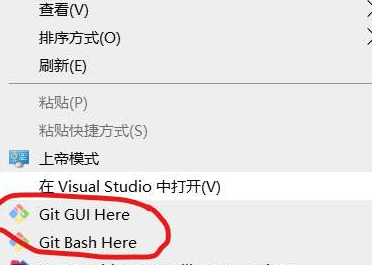

安装完成后，还需要最后一步设置，在命令行输入：

```shell
$ git config --global user.name "Your Name"
$ git config --global user.email "email@example.com"
```

注意`git config`命令的`--global`参数，用了这个参数，表示你这台机器上所有的Git仓库都会使用这个配置，当然也可以对某个仓库指定不同的用户名和Email地址。

## 5.2 初始化版本库

```shell
在当前目录创建一个.git的目录，并指定当前目录是git的仓库。
$ git init
```
## 5.3 代码提交
### 5.3.1 添加文件

Git有3个区域，一个是工作区，一个叫暂存区，一个叫仓库。
**添加文件即将工作区的文件添加到暂存区。**

```shell
添加指定文件
$ git add readme.txt

添加全部文件
$ git add .

添加全部文件
$ git add -A
```

### 5.3.2 提交文件

将暂存区的文件提交到仓库。

```shell
$ git commit -m '提交说明'
```

### 5.3.3 查看文件当前状态

```shell
$ git status
```

### 5.3.4 查看变化

```shell
$ git diff
```

## 5.4 Git时光机

### 5.4.1 查看提交记录

```shell
$ git log
```

### 5.4.2 版本回退

```shell
$ git reset --hard HEAD~1
```

首先，Git必须知道当前版本是哪个版本，在Git中，用`HEAD`表示当前版本，上一个版本就是`HEAD^`，上上一个版本就是`HEAD^^`，当然往上100个版本写100个`^`比较容易数不过来，所以写成`HEAD~100`。

### 5.4.3 查看每一次操作记录

```shell
git reflog
```
## 5.5 管理修改
### 5.5.1 管理修改
文件第一次修改是需要添加到暂存区
```shell
第一次修改 -> git add -> 第二次修改 -> git commit
```
### 5.5.2  撤销修改

```shell
git checkout -- readme.txt
```

### 5.5.3 删除文件

```shell
从工作区删除文件
rm 1.txt

从暂存区中删除文件
git rm 1.txt

从版本库中删除文件
git commit -m "remove 1.txt"
```

## 5.6 远程仓库

```
配置ssh

https://blog.csdn.net/lqlqlq007/article/details/78983879
```

### 5.6.1 添加远程仓库

```shell
$ git remote add origin 远程仓库地址
```

### 5.6.2 从远程仓库克隆

```shell
$ git clone 远程仓库地址
```

### 5.6.3 从远程仓库同步最新代码

```shell
$ git pull
```

### 5.6.4 将代码推送到远程仓库

```shell
$ git push
```
## 5.7 分支管理   

### 5.7.1 创建分支与切换分支

```shell
$ git checkout -b dev
```

`git checkout`命令加上`-b`参数表示创建并切换，相当于以下两条命令：

```shell
$ git branch dev
$ git checkout dev
```

### 5.7.2 查看分支

```shell
$ git branch
```

### 5.7.3 合并分支

```sh
将dev分支合并到当前分支
$ git merge dev
```

# 6、IDEA配置GIT

## 6.1 配置GIT

1、 File -> Settings -> Version Control -> Git 配置Git的目录

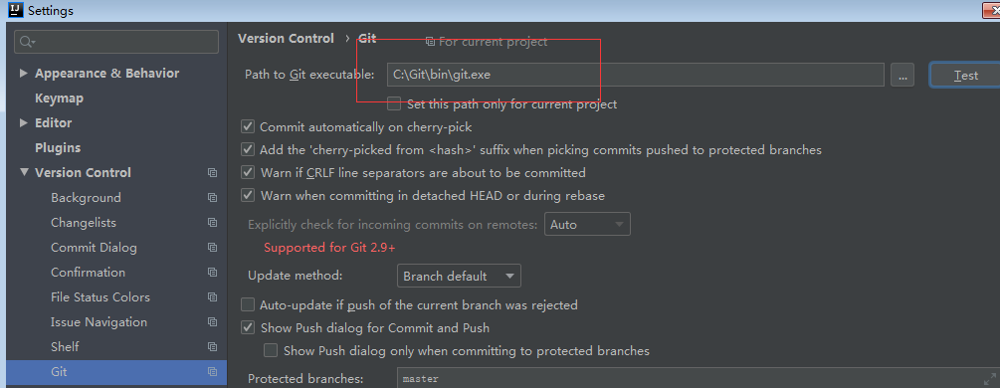

2、VCS -> Enable Version Control 启动版本控制

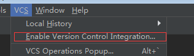

   然后选择Git


 这时候项目文件会出现不同的颜色

- 红色  没有加入到git暂存区

- 绿色  加入暂存区，没有提交

- 蓝色  做了修改，没有提交

- 白色  完成提交，是最新的

## 6.2 第一次提交代码

1、将项目add到暂存区

项目点击右键 Git -> Add 

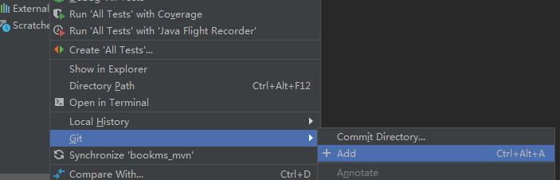

2、提交项目

项目右键--Git--Commit Directory

选择提交的文件，输入说明

点击commit and push

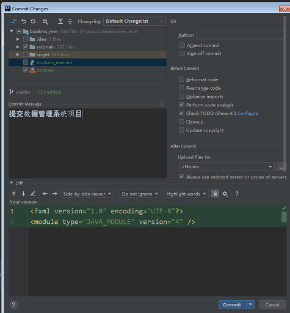

3、点击Define remote 配置远程服务器地址，再点击push，就完成了代码提交

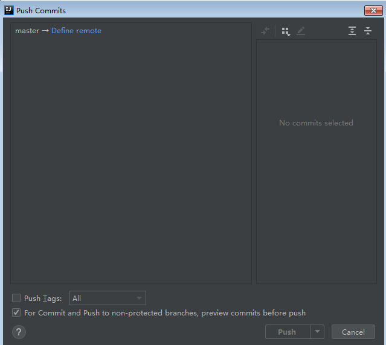


## 6.3 从服务器检出代码

有两种方式：

1、点击VCS -> Checkout -> Git

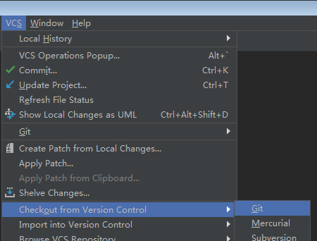

2、新建项目，选择 Project from Version Control

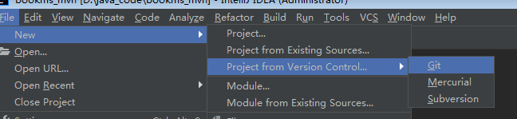

## 6.4 更新和提交

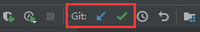

修改代码后点击绿色的勾，就可以提交代码

更新代码，点击蓝色箭头就可以了。

# 7、SVN的使用

## 7.1 安装SVN服务器

1、下载VisualSVN

https://www.visualsvn.com/files/VisualSVN-Server-4.3.2-x64.msi

2、安装VisualSVN

​	1）选择安装服务器

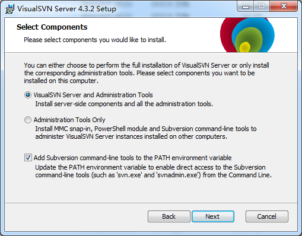

​	2）设置安装位置和端口

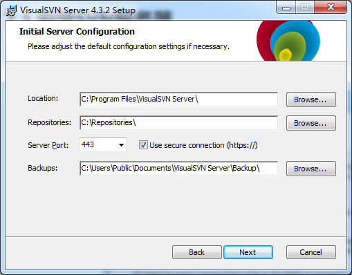

​	3）选择使用SVN用户的验证方式

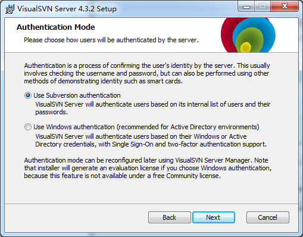

​	4） 安装完成

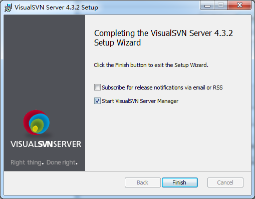

3、使用SVN服务器

​	1）新建SVN用户

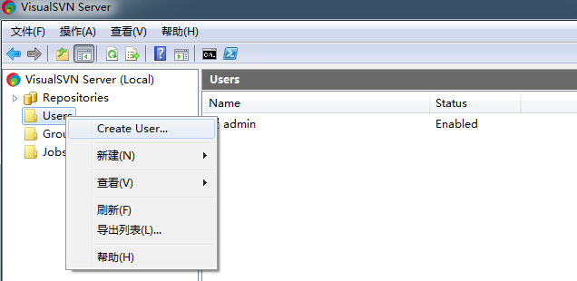

​	2）配置账号密码

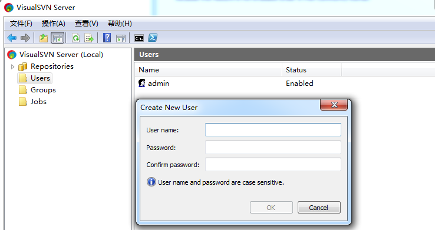

​	3）新建代码仓库

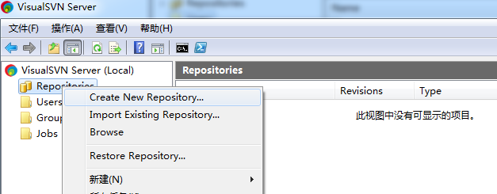

​		选择常规仓库

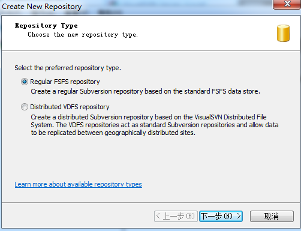

​		输入仓库名称

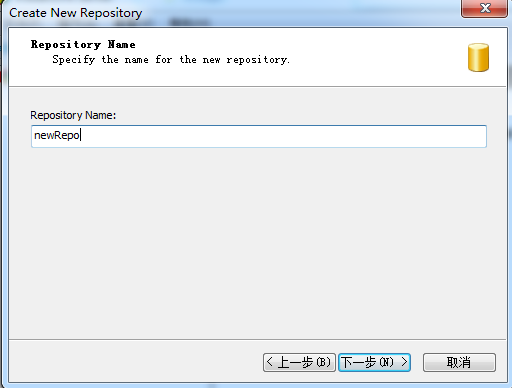

​		选择空仓库

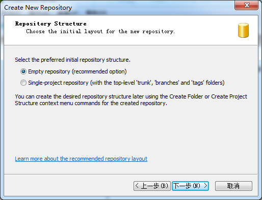

​		配置仓库权限，这里选择前面新建的用户作为仓库用户

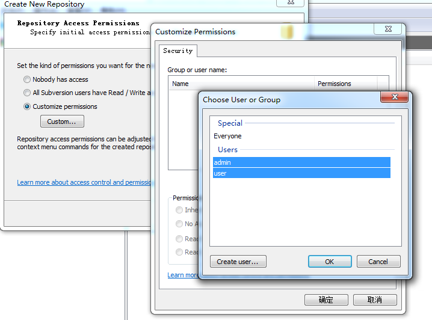


## 7.2 安装SVN客户端

1、下载TortoiseSVN

https://tortoisesvn.net/downloads.html

2、安装TortoiseSVN

​	选择安装command line client tools

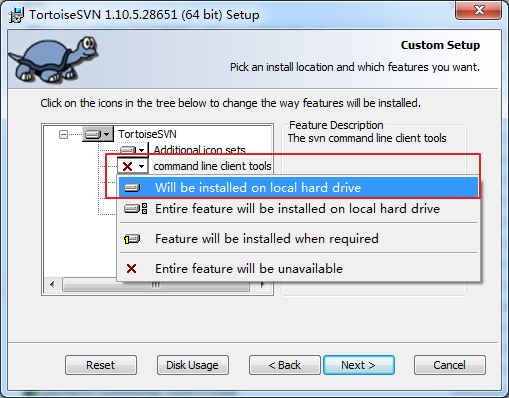

3、使用TortoiseSVN

​	1）检出仓库

​	安装好后，右键会出现SVN的菜单，选择Checkout

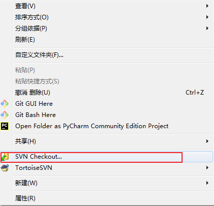

​	将SVN服务器中仓库的地址填写进去

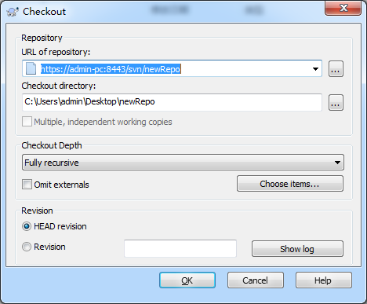

​	输入SVN用户的账号密码

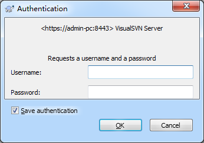

​	当前目录下会出现.svn目录，右键菜单会出现Update和Commit菜单

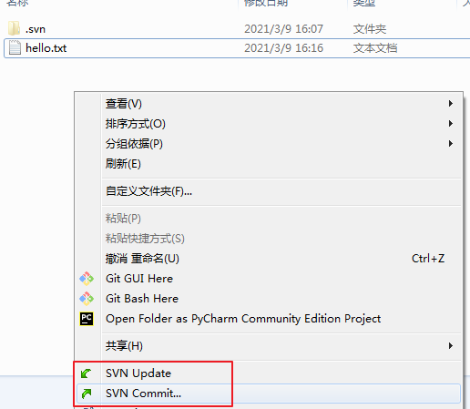

​	2）提交代码

​	在SVN目录下，新建一个hello.txt文件，选择Commit，填写说明，选择文件，点击ok

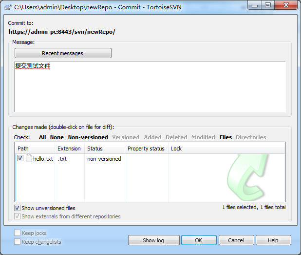

​	在SVN仓库中，可以看到提交的代码

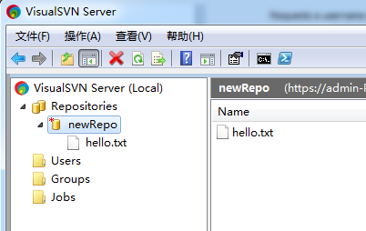

## 7.3 IDEA整合SVN

### 7.3.1 配置SVN

1、打开IDEA的settings菜单，选择Subversion，配置TortoiseSVN中svn.exe的路径

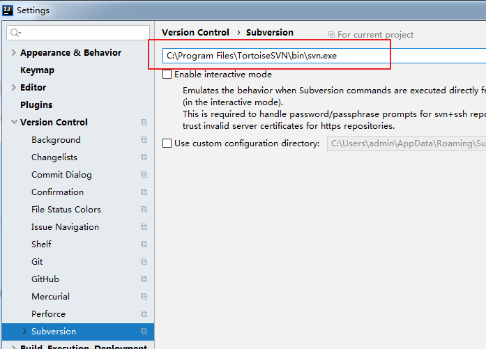

2、VCS -> Enable Version Control 启动版本控制，选择Subversion

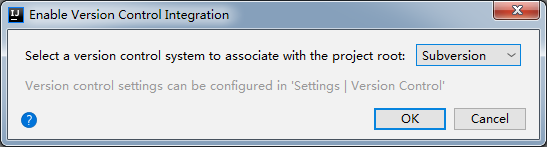

### 7.3.2 导入项目到SVN

1、作为开发者我们选择使用SVN管理项目代码时，需要把当前项目导入到SVN服务器中，这里选择IDEA的Import into Subversion菜单

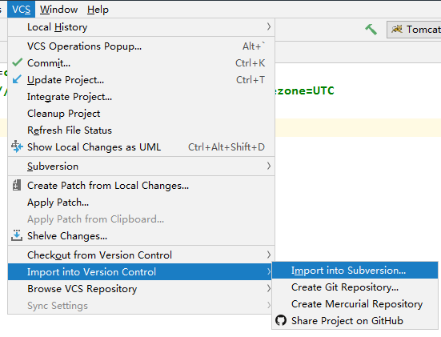

2、复制仓库的URL

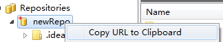

输入IDEAL仓库的URL中

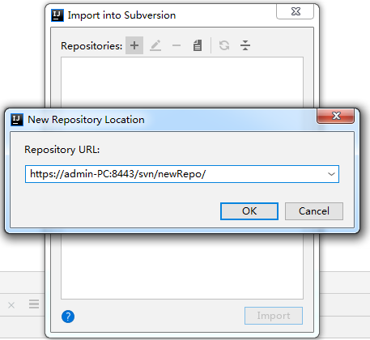

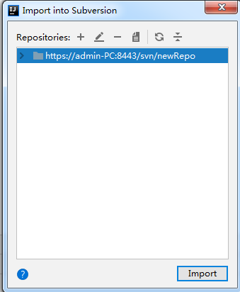

3、填写提交的说明文字


4、项目代码已经导入到SVN仓库中了


### 7.3.3 从SVN检出项目

作为开发者，我们需要从SVN检出项目，来提交和更新代码，选择从SVN检出代码

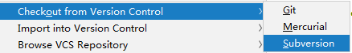

选择对应的代码仓库


### 7.3.4 更新和提交

IDEA出现了SVN的Update和Commit按钮，可以进行代码更新和提交


点击蓝色的更新按钮，默认选项，点击ok就可以完成更新代码

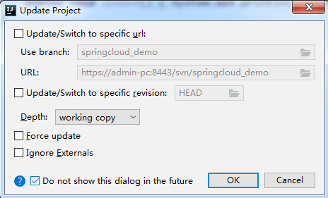

修改代码后，点击绿色的提交按钮，会显示提交对话框，这里显示了可以提交的文件，和文件的修改内容，输入提交的说明内容后，就可以提交到SVN仓库。

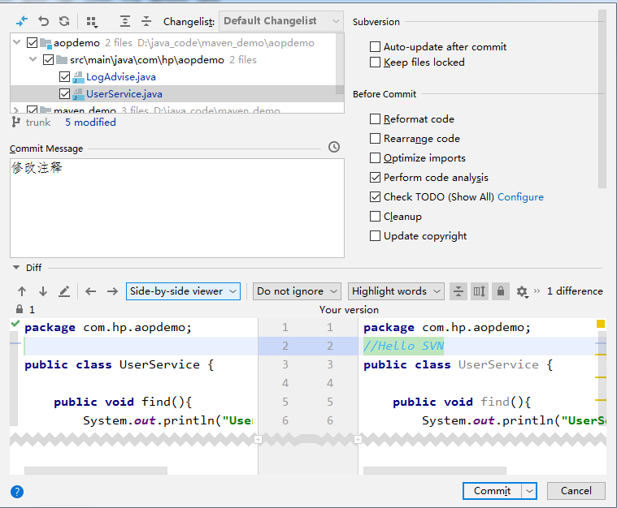

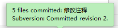

### 7.3.4 撤销修改

当修改了代码后，发现代码有问题，需要恢复到上次的代码版本，可以选择将修改撤销。

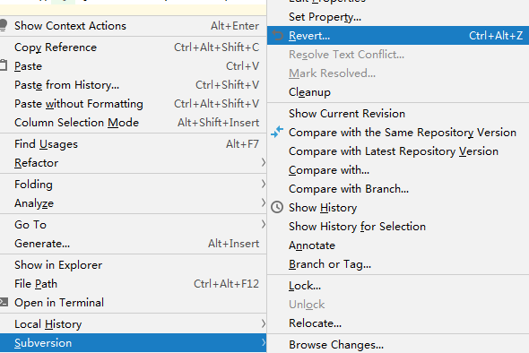

可以看到撤销代码的文件和具体的内容，选择Revert，就完成了撤销

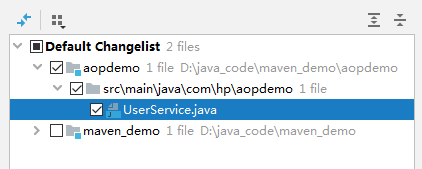

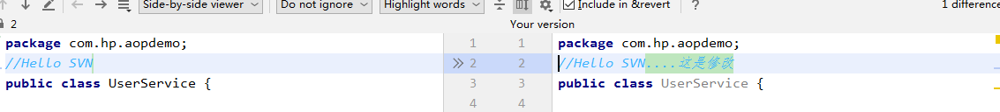

