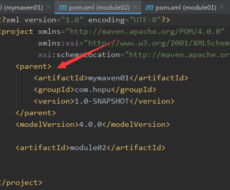

# 学习目标

```
1、为什么使用Maven
2、什么是Maven
3、Maven的安装
4、命令行构建Maven项目
5、IDEA构建Maven项目
6、Maven项目的结构
7、Maven的生命周期（重点）
8、Maven的配置（重点）
9、依赖管理（重点）
10、继承和聚合（重点）
11、依赖冲突的调解（重点）
```

# Maven概述

## 为什么使用Maven

思考：在前面的项目中我们是如何管理jar包的？

我们需要下载jar包，然后导入到项目中。

思考：如果网上找不到jar包下载地址怎么办？如果jar包还需要依赖其它jar包怎么办？如果jar包存在冲突怎么办？

思考：Eclipse创建的项目能直接导入到Idea中使用吗？

不能，因为项目的目录结构不同，需要进行转换。

那么如何解决上面的这些问题呢？ 

## 什么是Maven

Maven是一种项目管理工具，基于POM（项目对象模型），帮助实现管理依赖，以及项目的构建、发布、部署、生成报告等。

# Maven的安装

##  下载Maven

从官网下载Maven
https://maven.apache.org/download.cgi
解压下载的zip包

## 配置环境变量

在计算机上右键点击属性，点击高级系统设置，点击环境变量。

在系统变量中，点击新建，添加MAVEN_HOME系统变量，变量值就是Maven安装目录


找到Path变量，在变量值的最后添加：

 ;%MAVEN_HOME%\bin


## 查看
打开命令行输入：mvn -version


# 构建Maven项目

Maven项目根据不同的类型，定义了标准的目录结构，可以在任何开发环境中直接使用。

## 常用Maven命令

- mvn -version 查看版本

- mvn compile 编译项目

- mvn test	运行单元测试

- mvn package 项目打包

- mvn clean 删除target目录

- mvn install 安装打包好的项目jar包到仓库

- mvn archetype:generate 构建项目目录

  参数：-DgroupId=组织名 -DartifactId=项目名 -Dversion=版本 -Dpackage=包

## 使用命令构建第一个Maven项目

命令行输入：

```
mvn archetype:generate -DgroupId=com.blb -DartifactId=maven01 -Dversion=1.0 -Dpackge=com.blb.maven01
```

会出现一个列表，需要选择项目的架构，这里输入10，选择基本的web开发架构


需要确认时输入Y就会生成一个maven项目。


# IDEA使用Maven

## 在IDEA配置Maven

下面我们将在IDEA中配置Maven，这样我们就能在IDEA中创建Maven项目了
点击File菜单 -> Settings -> Build Tools 找到Maven

主要配置：

1. Maven home directory 可以配置Maven所在的目录

2. User settings file 是配置文件的路径

3. Local repository 是本地仓库的路径


## 在IDEA创建Maven项目

点击File -> New -> Project

选择Maven，然后勾选Create from archetype（这个archetype是选择固定的架构模板来创建项目），选择maven-archetype-webapp（web开发常用的架构）


点击Next，这里输入GroupId、ArtifactId和Version，可以理解为开发组名、项目名、版本号


点击Next，这里也是配置Maven的目录和配置文件、本地仓库的路径


最后就是确定项目名称和保存位置


点击Finish，就完成了一个Maven项目的创建

## Maven项目的结构

项目打开后，会出现下面的弹窗，import changes是导入配置的修改，后面的选项是每次修改配置后自动导入，点击import changes


在main目录下创建java和resources目录，在src目录下新建test目录，在test里面创建java目录

然后点击java目录右键 Mark Directory As 为Sources Root（源码目录），同样的方法将resources目录标记为Resources Root（资源目录），将test/java标记为Test Sources Root（测试源码目录），如下图：


下面我们了解下Maven项目的主要目录结构：
- src 		    源码
- main         主目录
- java           java源码目录，java的包和类都在这里
- resources 资源文件目录，保存各种配置文件
- webapp	前端代码，包含各种css\html\js前端目录和代码
- web-inf     web配置文件
- test/java   测试用例代码
- pom.xml  主要配置文件，包含项目、依赖、插件等配置

注意：不管使用什么开发工具，Maven的目录结构都是统一的，项目可以直接在不同的开发工具中打开

## 项目生命周期管理

Maven能管理这个项目的整个生命周期，生命周期包含：

1. clean		清理，部署前清理项目
2. default	 默认，默认生命周期又包含7个步骤
   1. validate		验证
   2. compile		编译
   3. test			    测试
   4. package		打包
   5. verify		    核准，部署前验证
   6. install		   安装，安装到仓库
   7. deploy		  部署，部署服务器
3. site		发布，发布网站，生成报告 

IDEA提供了Maven窗口，可以快捷的操作上面的生命周期，双击某个选项都可以执行该生命周期


# Maven的配置

Maven可以在settings.xml文件中进行配置

## 全局配置和局部配置

settings.xml文件一般存在于两个位置：

1. 全局配置: ${MAVEN_HOME}/conf/settings.xml

2. 用户配置: 用户目录/.m2/settings.xml

需要注意的是：**局部配置优先于全局配置**。
配置优先级从高到低：pom.xml> user settings > global settings
如果这些文件同时存在，会合并配置内容，如果有重复的配置，优先级高的配置会覆盖优先级低的。

## 配置详解

### 本地仓库
用于定义本地仓库保存jar文件的路径

localRepository

```
<localRepository>本地仓库路径</localRepository>
```
### 远程仓库

在mirrors节点中添加阿里云镜像地址，加速下载

mirror

```
	<mirror>
        <id>alimaven</id>
        <mirrorOf>central</mirrorOf>
        <name>aliyun maven</name>
       <url>http://maven.aliyun.com/nexus/content/repositories/central/</url>
    </mirror>
```

### profile

profile可以根据环境参数来调整构建配置

如：在Profiles中插入profile标签修改jdk全局版本
```
<profile>
    <id>jdk1.8</id>
    <activation>
        <activeByDefault>true</activeByDefault>
        <jdk>1.8</jdk>
    </activation>
    <properties>
        <maven.compiler.source>1.8</maven.compiler.source>
        <maven.compiler.target>1.8</maven.compiler.target>
 <maven.compiler.compilerVersion>1.8</maven.compiler.compilerVersion>
    </properties>
</profile>
```

## POM文件

Maven项目的主要配置都在pom.xml文件中，下面简单介绍下主要的配置：

- modelVersion			模型版本，默认是4.0.0 
- groupId					   开发组名
- artifactId					 项目名
- version						版本号
- packaging				   打包方式，打包方式有三种：
  - war 	适合JavaEE项目，需要到部署服务器
  - jar 	  适合JavaSE项目，可以单独运行，或导入其他项目
  - pom	Maven特有的，用于项目的聚合、继承等
- properties                  属性值配置，可以用于配置jdk版本或者各种第三方依赖的版本
- dependencies           配置第三方依赖的地方
- plugin                         插件的配置                         

# 继承和聚合

POM项目对象模型把项目以面向对象的方式管理，项目之间可以有继承、聚合这些特性。

继承，项目之间可以继承，子项目可以继承父项目的依赖和插件

子项目的pom.xml中用parent继承父项目，父项目的打包方式必须是pom

```
    <parent>
        <artifactId>父项目artifactId</artifactId>
        <groupId>父项目groupId</groupId>
        <version>父项目version</version>
    </parent>
```

聚合，一个项目可以把多个项目整合到一起打成一个包，部署到一起，聚合项目用modules配置被聚合的项目

```
  <modules>
    <module>项目1</module>
    <module>项目2</module>
  </modules>
```

继承和聚合一般一起使用，我们可以在一个大项目中创建多个子项目以完成不同的业务，子项目继承父项目，父项目聚合所有子项目。

动手测试下：在前面的Maven项目上添加两个子模块，点击New -> Module (模块，相当于子项目)

可以看到父项目的pom.xml出现了modules节点，里面是两个子模块的名称，而且打包方式改为了pom


子项目中出现了parent节点，继承父项目




# 依赖管理

当我们需要第三方的依赖时，不需要去网上找jar包了，只需要在dependencies添加依赖配置

依赖配置可以到Maven的网站上搜索，网址：[https://mvnrepository.com](https://mvnrepository.com/)

如：mysql的依赖

```
    <dependency>
      <groupId>mysql</groupId>
      <artifactId>mysql-connector-java</artifactId>
      <version>8.0.16</version>
    </dependency>
```

将它复制到dependencies里面，然后点击import changes，Maven会去查找和下载jar包。

## 依赖范围

在dependency的几个属性中，除了组名、项目名、版本外还有一个scope属性，它控制依赖起作用的范围。

scope的值有：

1. compile 编译，默认使用，在编译、测试、运行时起作用
2. test 测试，在编译和测试时起作用
3. provided 已提供，环境已提供该依赖，如Tomcat提供Servlet依赖
4. runtime 运行时，测试和运行起作用
5. system 由系统提供
6. import 用于导入

如：定义mysql驱动只在运行时生效

```
    <dependency>
      <groupId>mysql</groupId>
      <artifactId>mysql-connector-java</artifactId>
      <version>5.1.38</version>
      <scope>runtime</scope>
    </dependency>
```

## Maven的仓库

我们下载的jar包保存在哪里呢？

Maven的仓库是保存依赖jar包文件的地方。

### Maven仓库的分类

Maven仓库分为：

1. 本地仓库
   在本机保存jar包的目录

2. 远程仓库
   自己搭建的服务器，用于保存jar包文件，以提高jar下载速度和安全性

3. 中央仓库
   由maven团队维护的服务器，保存大量jar包

   地址：https://repo1.maven.org 、 [https://repo2.maven.org](https://repo1.maven.org)

```
这三种仓库工作的流程是：

当项目需要某个jar包时，先从本地仓库查找，如果有就返回，如果没有就到远程仓库查询，如果找到就返回jar包并保存到本地仓库，如果还没找到就到中央仓库查找，如果找到了就保存到远程仓库和本地仓库中，如果没有就查找失败了。

```


## 依赖冲突的调解


项目导入jar包时，项目中可能会存在同样类型但版本不同的jar包，这就是依赖冲突，最终导致项目无法运行。

### Maven默认解决方案
那么Maven是如何解决依赖冲突问题的呢？

1. 最短路径原则

​	首先我们要知道，依赖存在传递性，也就是：A依赖B，B依赖C，那么A也依赖C

​	如果存在下面的情况：A同时存在X依赖的1.0和2.0版本，按最短路径原则，A将使用X2.0版本

​	A--->B--->C--->X(1.0)

​	A--->D--->X(2.0)

2. 最先声明原则

​	那么如果路径长度相同怎么办呢？按最先声明原则，哪个依赖在pom中先出现就使用哪个，那么就是X1.0

​	A--->B--->X(1.0)

​	A--->D--->X(2.0)

### 排除依赖

除了依赖Maven自带的方案，我们还可以自己排除不需要的依赖

如：在spring-jdbc中排除spring-core

```
<dependency>
     <groupId>org.springframework</groupId>
     <artifactId>spring-jdbc</artifactId>
     <version>5.1.12.RELEASE</version>
     <exclusions>
         <exclusion>
             <artifactId>spring-core</artifactId>
             <groupId>org.springframework</groupId>
         </exclusion>
     </exclusions>
</dependency>
```

### 锁定版本

如果多个依赖都导入了同一个依赖，但是相同的依赖版本不同，就可能出现问题。

此时我们可以通过dependencyManagement锁定依赖版本

```
<dependencyManagement>
        <dependencies>
            <dependency>
                <groupId>org.springframework</groupId>
                <artifactId>spring-jdbc</artifactId>
                <version>5.1.12.RELEASE</version>
            </dependency>
        </dependencies>
</dependencyManagement>

<dependencies>
        <!--依赖版本被锁定为5.1.12.RELEASE -->
        <dependency>
            <groupId>org.springframework</groupId>
            <artifactId>spring-jdbc</artifactId>
        </dependency>
 </dependencies>
```


