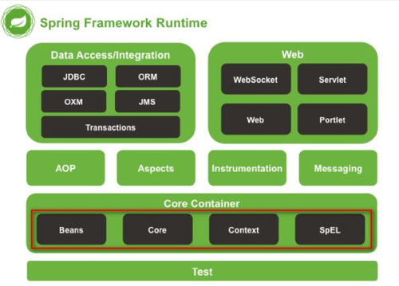
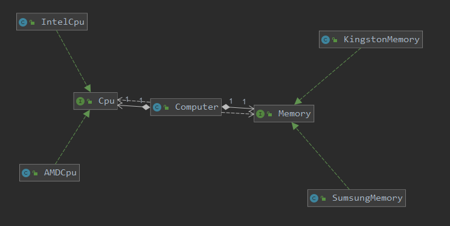
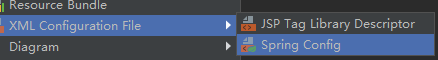
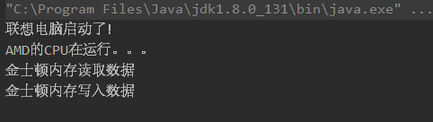
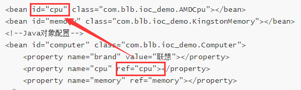
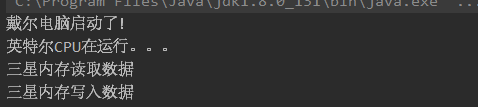

# 学习目标

```
1、Spring框架简介
2、IOC概念
3、IOC容器
4、IOC的XML配置案例
5、IOC的注解配置案例
6、IOC的实现原理
```

# 1、Spring框架简介

## 1.1 Spring基本概念

 	Spring是一个开源框架，它由Rod Johnson创建。它是为了解决企业应用开发的复杂性而创建的。Spring使用基本的JavaBean来完成以前只可能由EJB完成的事情。然而，Spring的用途不仅限于服务器端的开发。从简单性、可测试性和松耦合的角度而言，任何Java应用都可以从Spring中受益。

 	Spring是一个轻量级的控制反转(IoC)和面向切面(AOP)的容器框架。

- 轻量——从大小与开销两方面而言Spring都是轻量的。完整的Spring框架可以在一个大小只有1MB多的JAR文件里发布。并且Spring所需的处理开销也是微不足道的。此外，Spring是非侵入式的：Spring应用中的对象不依赖于Spring的特定类。

- 控制反转——通过控制反转（IoC）技术促进了松耦合。当应用了IoC，一个对象依赖的其它对象会通过被动的方式传递进来，而不是这个对象自己创建或者查找依赖对象。

- 面向切面——分离应用的业务逻辑与系统级服务。应用对象只实现业务逻辑。它们并不负责其它的系统级关注点，例如日志或事务支持。

- 容器——Spring是一种容器，能创建对象并管理对象的配置和生命周期。

- 框架——Spring可以将第三方框架灵活的整合起来，完成各种JavaEE企业级项目开发。
  
  所有Spring的这些特征使我们能够编写更干净、更可管理、并且更易于测试的代码。它们也为Spring中的各种模块提供了基础支持。

## 1.2 Spring框架的组成



上面是Spring的主要组件：

- Core   		核心组件 ，提供IOC功能
- Context	上下文组件，提供包的扫描、国际化、事件等功能
- Beans	     JavaBean的管理
- SpEL	       Spring表达式
- AOP	        面向切面编程
- Test	         集成单元测试
- MVC	        SpringMVC框架
- JDBC	       集成JDBC开发
- ORM	       数据库开发
- Cloud	      微服务开发框架
- Securty       权限控制框架

# 2、IOC的概念

## 2.1 什么是IOC

IOC（Inverse of Controll）控制反转是一种程序设计思想。

控制是什么？  

​	JavaBean（Java对象）的创建和管理

反转是什么？  

​	一般情况下对象的创建和管理由开发者控制，反转是把对象的创建和管理交给容器完成，然后再交给开发者。 

## 2.2 IOC有什么用

IOC的主要作用是：解耦。

解耦，是降低程序耦合度，也就是减少程序代码之间的依赖性，如果代码之间的依赖性很高，修改一处代码会影响很多其他的代码，这就给项目的稳定性带来的问题，不利于代码的扩展和维护。

没有IOC的程序中，我们使用new来完成对象的创建，如果需要的对象的类型发生改变，就需要手动修改代码。

有了IOC后，对象的创建由第三方（Spring容器）完成，由Spring来管理应用中所有对象的生命周期，开发者只需要关注自己的业务逻辑，代码更利于扩展和维护。

## 2.3 什么是DI

DI（Dependency Injection）依赖注入，是IOC另一种说法，也就是对象由容器来管理，注入到我们需要依赖中。

生活中的DI：我们身体不生产疫苗，由医院生产，需要的使用再注射进来。

# 3、IOC容器

## 3.1 容器的概念

IOC容器是 Spring 框架的核心。容器将创建对象，配置对象，并管理对象的整个生命周期。Spring 容器使用依赖注入（DI）来管理组成一个应用程序的组件。

## 3.2 容器的分类

Spring的IOC容器分为两种：

1）BeanFactory

```
最简单的容器，给 DI 提供了基本的支持，它用 org.springframework.beans.factory.BeanFactory 接口来定义。BeanFactory 或者相关的接口，如 BeanFactoryAware，InitializingBean，DisposableBean，在 Spring 中仍然存在具有大量的与 Spring 整合的第三方框架的反向兼容性的目的。
```

2）ApplicationContext

```
继承了BeanFactory，添加了更多的企业特定的功能，例如从一个属性文件中解析文本信息的能力，发布应用程序事件给感兴趣的事件监听器的能力。该容器是由 org.springframework.context.ApplicationContext 接口定义。通常推荐使用 ApplicationContext。
ApplicationContext 接口的主要实现：
1) FileSystemXmlApplicationContext 
	基于文件系统中XML文件配置的应用程序上下文
2) ClassPathXmlApplicationContext 
	基于ClassPath路径中XML文件配置的应用程序上下文
3) AnnotationConfigApplicationConext 
	基于注解配置的应用程序上下文
```

# 4、IOC的入门案例

## 4.1 案例概述



模拟电脑的装配，定义Cpu和Memory（内存）接口，Cpu接口有IntelCpu和AMDCpu两个实现类，Memory接口有KingstonMemory和SumsungMemory两个实现类，Computer类中定义了Cpu和Memory类型的两个属性

## 4.2 案例实现

1) 创建Maven项目

2) 导入依赖

```
<dependency>
	<groupId>org.springframework</groupId>
	<artifactId>spring-context</artifactId>
	<version>5.2.8.RELEASE</version>
</dependency>
```

3) 编写代码

```
/**
 * CPU接口
 */
public interface Cpu {

    void run();
}
```

```
public class AMDCpu implements Cpu {
    public void run() {
        System.out.println("AMD的CPU在运行。。。");
    }
}

public class IntelCpu implements Cpu {
    public void run() {
        System.out.println("英特尔CPU在运行。。。");
    }
}
```

```
/**
 * 内存
 */
public interface Memory {

    void read();
    void write();
}

```

```
public class KingstonMemory implements Memory {
    public void read() {
        System.out.println("金士顿内存读取数据");
    }

    public void write() {
        System.out.println("金士顿内存写入数据");
    }
}

public class SumsungMemory implements Memory {
    public void read() {
        System.out.println("三星内存读取数据");
    }

    public void write() {
        System.out.println("三星内存写入数据");
    }
}
```

```
/**
 * 电脑
 */
public class Computer {

    private String brand;

    private Cpu cpu;

    private Memory memory;

    public Cpu getCpu() {
        return cpu;
    }

    public void setCpu(Cpu cpu) {
        this.cpu = cpu;
    }

    public Memory getMemory() {
        return memory;
    }

    public void setMemory(Memory memory) {
        this.memory = memory;
    }

    public String getBrand() {
        return brand;
    }

    public void setBrand(String brand) {
        this.brand = brand;
    }

    public void start(){
        System.out.println(brand + "电脑启动了！");
        cpu.run();
        memory.read();
        memory.write();
    }
}
```

4) 添加Spring配置文件

在resources目录下，添加Spring配置文件



```
<?xml version="1.0" encoding="UTF-8"?>
<beans xmlns="http://www.springframework.org/schema/beans"
       xmlns:xsi="http://www.w3.org/2001/XMLSchema-instance"
       xsi:schemaLocation="http://www.springframework.org/schema/beans http://www.springframework.org/schema/beans/spring-beans.xsd">

    <bean id="cpu" class="com.blb.ioc_demo.AMDCpu"></bean>
    <bean id="memory" class="com.blb.ioc_demo.KingstonMemory"></bean>
    <!--Java对象配置-->
    <bean id="computer" class="com.blb.ioc_demo.Computer">
        <property name="brand" value="联想"></property>
        <property name="cpu" ref="cpu"></property>
        <property name="memory" ref="memory"></property>
    </bean>
</beans>
```

5) 测试代码

```
public class TestComputerSpring {

    public static void main(String[] args) {
        //创建应用程序上下文
        ClassPathXmlApplicationContext context = new ClassPathXmlApplicationContext("spring.xml");
        //获得对象
        Computer computer = (Computer) context.getBean("computer");
        computer.start();
    }
}
```



## 4.3 知识点讲解

### 4.3.1 beans 节点
​	beans节点是Spring配置文件的根节点，所有Javabean都定义在beans内部
### 4.3.2 bean 节点
​	代表一个javabean对象
​	bean节点的属性

- **id**		对象id，id不能重复
- **name**	对象名称，name可以重复，如果重复将读取最后一个
- **class**	对象的类型，包名+类名
- **scope**	作用域
	
	- **singleton**
	
	  单例模式，在IOC容器中仅存在一个实例
	
	- **prototype**
	
	  多例，每次从IOC容器调用Bean时，都会返回一个新的实例
	
	- **request**
	
	  每次Http请求都会创建一个新的Bean，该作用域仅适用于WebApplicationContext环境
	
	- **session**
	
	  同一个会话共享一个Bean，不同的会话使用不同的Bean，仅适用于WebApplicationContext环境
	
	- **application**
	
	  一般用于portlet应用环境，仅适用于WebApplicationContext环境

### 4.3.3 property 节点

​	用来配置javabean的属性依赖

​	property节点的属性

- **name** 属性的名称

- **ref** 注入引用类型的对象，值就是前面定义bean的id

  

- **value** 注入基本数据类型和String类型的值，如给brand的值注入“联想”

### 4.3.4 属性注入的几种方式

​	注入属性有几种方式：

​	1) set方法注入，就是上面通过property进行配置

​	2) 构造方法注入

​	给Computer类添加带参数的构造方法，将property改为：

```
<constructor-arg name="brand" value="苹果"></constructor-arg>
<constructor-arg name="cpu" ref="cpu"></constructor-arg>
<constructor-arg name="memory" ref="memory"></constructor-arg>
```

​	3) 自动装配

​	可以通过bean的autowire属性配置

​	类型：

- **no** 				  默认，不自动装配

- **byType**		  通过类型查找对象，如果相同类型的对象有多个，会出现异常

- **byName**	    通过名称查找对象，如果找不到对应的id或name的对象，会出现空指针异常

- **constructor**  通过构造方法装配

### 4.3.5 ClassPathXmlApplicationContext

​	通过ClassPath路径查找XML配置文件的IOC容器

- 创建方式

```
new ClassPathXmlApplicationContext("spring.xml");
注意：src和resources都在ClassPath下，所以可以直接写文件名，如果文件不在ClassPath下，则会出现异常
```

- getBean方法

​	用于在配置文件中查找对象，创建对象，返回对象

```
Object getBean(Class)	通过对象的类型查找

Object getBean(String)	通过对象id或name查找
```


# 5、注解配置的IOC案例

## 5.1 Spring的重要的注解

- @Component			 组件，被标记的类会被Spring扫描到，交给Spring容器进行管理

- @ComponentScan	组件扫描，标记在配置类上，用于扫描某一个包下带@Component的类

- @Configuration	     配置类，标记在类上，该类作为配置类代替XML

- @Value			           注入值类型数据，配置属性或set方法上

- @Autowrie		        自动装配，默认按类型进行注入

- @Qualifier		        标记名称，配置在类和注入属性上，用于区分类型相同的对象

- @Resource		       自动装配，类似Autowired，默认按名称注入，名称没有再按类型注入

- @Repository		    类似@Component，标记DAO实现类

- @Service		           类似@Component，标记Service实现类

- @Controller		      类似@Component，标记Controller类

## 5.2 注解实现IOC

修改上面的案例，给每个接口的一个实现类加上@Component注解

```
@Component
public class AMDCpu implements Cpu {
    public void run() {
        System.out.println("AMD的CPU在运行。。。");
    }
}

@Component
public class KingstonMemory implements Memory {
    public void read() {
        System.out.println("金士顿内存读取数据");
    }

    public void write() {
        System.out.println("金士顿内存写入数据");
    }
}
```
给Computer类添加@Component注解，值类型属性用@Value注入，引用类型用@Autowired注入
```
@Component
public class Computer {

    @Value("戴尔")
    private String brand;

    @Autowired
    private Cpu cpu;

    @Autowired
    private Memory memory;
```

```
/**
 * 配置类
 */
@ComponentScan(basePackages = "com.blb.ioc_demo")
@Configuration
public class ComputerConfig {

    public static void main(String[] args) {
        //创建注解应用程序上下文
        AnnotationConfigApplicationContext context = new AnnotationConfigApplicationContext(ComputerConfig.class);
        //获得对象
        Computer computer = context.getBean(Computer.class);
        computer.start();
    }
}
```

**思考问题**

如果给每个接口的所有实现类都加上@Component注解会出现什么问题？如何解决？


# 6、 IOC的实现原理

## 6.1 思考

**思考问题1**

上面案例中，配置了@Component注解后，Spring是怎么知道这个类上有这个注解的？

**思考问题2**

没有使用new关键字，Spring是如何创建对象的？

**思考问题3**

Spring是如何将创建的对象注入到对应的属性中的？

## 6.2 IOC实现原理

问题的答案是：通过自定义注解+反射机制实现

```
/**
 * 注入值的注解
 */
@Target(ElementType.FIELD)
@Retention(RetentionPolicy.RUNTIME)
public @interface MyValue {
    //注入的值
    String value();
}
```

```
/**
 * 注入对象的注解
 */
@Target(ElementType.FIELD)
@Retention(RetentionPolicy.RUNTIME)
public @interface MyComponent {
	//注入的类型
    Class value();
}
```

```
/**
 * 电脑
 */
public class Computer {

    @MyValue("戴尔")
    private String brand;

    @MyComponent(IntelCpu.class)
    private Cpu cpu;

    @MyComponent(SumsungMemory.class)
    private Memory memory;
    ...省略其余部分...
```

```
/**
 * 电脑工厂
 */
public class ComputerFactory {

    /**
     * 创建电脑对象
     * @param computerClass
     * @return
     */
    public Computer createComputer(Class computerClass) throws Exception {
        //反射创建对象
        Object computer = computerClass.newInstance();
        //遍历所有的属性
        Field[] fields = computerClass.getDeclaredFields();
        for(Field field : fields){
            String fName = field.getName();
            //读取自定义注解
            MyValue myValue = field.getDeclaredAnnotation(MyValue.class);
            if(myValue != null){
                //通过反射调用set方法注入值
                String mName = "set" + fName.substring(0,1).toUpperCase() + fName.substring(1);
                Method set = computerClass.getDeclaredMethod(mName, field.getType());
                set.invoke(computer,myValue.value());
            }
            MyComponent myComponent = field.getDeclaredAnnotation(MyComponent.class);
            if(myComponent != null){
                //通过反射调用set方法注入对象
                String mName = "set" + fName.substring(0,1).toUpperCase() + fName.substring(1);
                Method set = computerClass.getDeclaredMethod(mName, field.getType());
                //通过配置的类型创建对象
                Object obj = myComponent.value().newInstance();
                set.invoke(computer,obj);
            }
        }
        return (Computer) computer;
    }
}
```

```
public class TestFactory {

    public static void main(String[] args) {
        ComputerFactory factory = new ComputerFactory();
        try {
            Computer computer = factory.createComputer(Computer.class);
            computer.start();
        } catch (Exception e) {
            e.printStackTrace();
        }
    }
}
```



